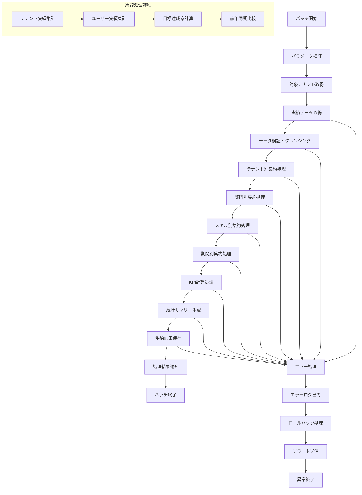

# バッチ定義書：実績データ集約バッチ (BATCH-403)

## 1. 基本情報

| 項目 | 内容 |
|------|------|
| **バッチID** | BATCH-403 |
| **バッチ名** | 実績データ集約バッチ |
| **実行スケジュール** | 日次（06:00） |
| **優先度** | 高 |
| **ステータス** | 実装済み |
| **作成日** | 2025/05/31 |
| **最終更新日** | 2025/05/31 |

## 2. バッチ概要

### 2.1 概要・目的
各テナントの実績データを集約し、統計情報やKPI計算に必要なデータを生成する。

### 2.2 関連テーブル
- TBL-020_実績データ
- TBL-021_集約実績
- TBL-022_KPI計算結果
- TBL-023_統計サマリー

### 2.3 関連API
- API-401_実績データ取得API
- API-402_集約結果登録API

## 3. 実行仕様

### 3.1 実行スケジュール
| 項目 | 設定値 | 備考 |
|------|--------|------|
| 実行頻度 | 0 6 * * * | cron形式（毎日06:00） |
| 実行時間 | 06:00 | 朝バッチ |
| タイムアウト | 180分 | 最大実行時間 |
| リトライ回数 | 2回 | 失敗時の再実行 |

### 3.2 実行条件
| 条件 | 内容 | 備考 |
|------|------|------|
| 前提条件 | 実績データ登録完了 | 前日分データ確定 |
| 実行可能時間 | 06:00-09:00 | 業務開始前 |
| 排他制御 | 同一バッチの重複実行禁止 | ロックファイル使用 |

### 3.3 実行パラメータ
| パラメータ名 | データ型 | 必須 | デフォルト値 | 説明 |
|--------------|----------|------|--------------|------|
| target_date | date | × | 前日 | 集約対象日 |
| tenant_id | string | × | all | 対象テナントID |
| aggregation_level | string | × | daily | 集約レベル（daily/weekly/monthly） |
| include_kpi_calculation | boolean | × | true | KPI計算実行フラグ |

## 4. 処理仕様

### 4.1 処理フロー

### 4.2 詳細処理
1. **初期化処理**
   - パラメータ検証
   - 対象テナント・期間の確定
   - 排他制御ロック取得

2. **実績データ取得・検証**
   - 対象期間の実績データ取得
   - データ整合性チェック
   - 欠損データの補完

3. **テナント別集約**
   - テナント単位での実績集計
   - ユーザー数・アクティブ率計算
   - 目標達成状況の算出

4. **部門・スキル別集約**
   - 部門別実績集計
   - スキル分野別集計
   - 習得状況の分析

5. **KPI計算**
   - 各種KPIの算出
   - 前期比較・トレンド分析
   - 予測値の計算

6. **結果保存・通知**
   - 集約結果のデータベース保存
   - 統計レポートの生成
   - 関係者への通知送信

## 5. データ仕様

### 5.1 入力データ
| データ名 | 形式 | 取得元 | 説明 |
|----------|------|--------|------|
| 実績データ | DB | TBL-020 | 個人・部門別実績 |
| 目標データ | DB | TBL-024 | 設定された目標値 |
| マスタデータ | DB | 各種マスタ | 組織・スキル・ユーザー情報 |

### 5.2 出力データ
| データ名 | 形式 | 出力先 | 説明 |
|----------|------|--------|------|
| 集約実績 | DB | TBL-021 | 集約済み実績データ |
| KPI計算結果 | DB | TBL-022 | 各種KPI値 |
| 統計サマリー | DB | TBL-023 | 統計情報サマリー |
| 実行ログ | LOG | /logs/batch/ | バッチ実行ログ |
| 集約レポート | JSON | /reports/ | 集約結果レポート |

### 5.3 データ量見積もり
| 項目 | 件数 | 備考 |
|------|------|------|
| 処理対象実績件数 | 10,000-100,000件/日 | テナント数・ユーザー数による |
| 生成集約データ件数 | 1,000-10,000件/日 | 集約レベルによる |
| 処理時間 | 60-120分 | データ量による |

## 6. エラーハンドリング

### 6.1 エラー分類
| エラー種別 | 対応方法 | 通知要否 | 備考 |
|------------|----------|----------|------|
| データ不整合エラー | エラーログ出力・継続 | ○ | 実績データ異常 |
| 計算エラー | エラーログ出力・デフォルト値 | △ | KPI計算失敗 |
| データベースエラー | 処理中断・リトライ | ○ | 接続・保存エラー |

### 6.2 リトライ仕様
| 条件 | リトライ回数 | 間隔 | 備考 |
|------|--------------|------|------|
| DB接続エラー | 3回 | 60秒 | 指数バックオフ |
| 一時的な計算エラー | 2回 | 30秒 | 固定間隔 |
| データロックエラー | 5回 | 10秒 | 短間隔リトライ |

### 6.3 異常終了時の処理
1. 処理中断
2. 部分的なロールバック
3. エラーログ出力
4. 業務担当者への通知
5. 排他制御ロック解除

## 7. 監視・運用

### 7.1 監視項目
| 監視項目 | 閾値 | アラート条件 | 対応方法 |
|----------|------|--------------|----------|
| 処理時間 | 180分 | 超過時 | データ量・処理ロジック見直し |
| エラー率 | 5% | 超過時 | データ品質確認 |
| 集約データ件数 | 期待値±30% | 乖離時 | 実績データ確認 |
| KPI計算精度 | 95% | 低下時 | 計算ロジック見直し |

### 7.2 ログ出力
| ログ種別 | 出力レベル | 出力内容 | 保存期間 |
|----------|------------|----------|----------|
| 実行ログ | INFO | 処理開始・終了・進捗・統計 | 6ヶ月 |
| エラーログ | ERROR | エラー詳細・データID | 1年 |
| 業務ログ | INFO | 集約結果・KPI値 | 2年 |

### 7.3 アラート通知
| 通知条件 | 通知先 | 通知方法 | 備考 |
|----------|--------|----------|------|
| 異常終了 | 開発チーム | メール・Slack | 即座に通知 |
| データ異常 | 業務担当者 | メール | 業務時間内のみ |
| KPI異常値 | 管理者 | Slack | 翌営業日まで |

## 8. 非機能要件

### 8.1 パフォーマンス
- 処理時間：180分以内
- メモリ使用量：4GB以内
- CPU使用率：70%以内

### 8.2 可用性
- 成功率：98%以上
- 部分的な処理継続機能
- データ整合性の保証

### 8.3 セキュリティ
- テナントデータの分離
- 集約データのアクセス制御
- 処理ログの暗号化

## 9. テスト仕様

### 9.1 単体テスト
| テストケース | 入力条件 | 期待結果 |
|--------------|----------|----------|
| 正常処理 | 正常な実績データ | 正常終了・集約データ生成 |
| データなし | 実績データ0件 | 正常終了（集約データ0件） |
| 大量データ | 100,000件の実績データ | 正常終了・適切な処理時間 |

### 9.2 異常系テスト
| テストケース | 入力条件 | 期待結果 |
|--------------|----------|----------|
| データ不整合 | 破損した実績データ | エラーログ出力・継続処理 |
| 計算エラー | 異常な数値データ | デフォルト値設定・継続 |
| DB接続エラー | データベース停止 | リトライ後異常終了 |

## 10. 実装メモ

### 10.1 技術仕様
- 言語：Node.js
- ORM：Prisma
- 計算処理：数値計算ライブラリ
- 並列処理：worker_threads

### 10.2 注意事項
- 大量データ処理時のメモリ管理
- テナント間データの分離保証
- 集約処理の原子性確保

### 10.3 デプロイ・実行環境
- 実行サーバー：バッチサーバー
- 実行ユーザー：data_aggregation_user
- 実行ディレクトリ：/opt/batch/data-aggregation/
- 設定ファイル：/etc/batch/data-aggregation.json

---

**改訂履歴**

| バージョン | 日付 | 変更者 | 変更内容 |
|------------|------|--------|----------|
| 1.0 | 2025/05/31 | システムアーキテクト | 初版作成 |
