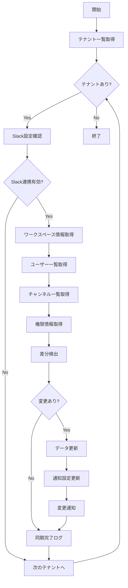

# バッチ定義書：Slack連携同期バッチ

| 項目                | 内容                                                                                |
|---------------------|------------------------------------------------------------------------------------|
| **バッチID**        | BATCH-407                                                                          |
| **バッチ名称**      | Slack連携同期バッチ                                                                 |
| **機能カテゴリ**    | 通知・連携管理                                                                      |
| **概要・目的**      | Slackワークスペースのユーザー・チャンネル情報を同期し、通知設定を最新化する         |
| **バッチ種別**      | 定期バッチ                                                                          |
| **実行スケジュール**| 日次（06:15）                                                                       |
| **入出力対象**      | SlackUsers, SlackChannels, SlackWorkspaces                                         |
| **優先度**          | 中                                                                                  |
| **備考**            | Slack API制限を考慮した同期処理                                                     |

## 1. 処理概要

Slack連携同期バッチは、各テナントのSlackワークスペースからユーザー・チャンネル・権限情報を取得し、システム内の情報を最新状態に同期するバッチ処理です。新規ユーザーの自動登録、退職者の無効化、チャンネル変更の反映を行います。

## 2. 処理フロー



## 3. 入力データ

### 3.1 SlackWorkspacesテーブル

| フィールド名      | データ型 | 説明                                           |
|-------------------|----------|------------------------------------------------|
| workspace_id      | String   | ワークスペースID（主キー）                     |
| tenant_id         | String   | テナントID（外部キー）                         |
| team_id           | String   | SlackチームID                                  |
| team_name         | String   | チーム名                                       |
| bot_token         | String   | Bot User OAuth Token（暗号化）                 |
| webhook_url       | String   | Incoming Webhook URL                           |
| is_active         | Boolean  | 有効フラグ                                     |
| last_sync_at      | DateTime | 最終同期日時                                   |

### 3.2 SlackUsersテーブル

| フィールド名      | データ型 | 説明                                           |
|-------------------|----------|------------------------------------------------|
| slack_user_id     | String   | SlackユーザーID（主キー）                      |
| workspace_id      | String   | ワークスペースID（外部キー）                   |
| user_id           | String   | システムユーザーID（外部キー）                 |
| slack_username    | String   | Slackユーザー名                                |
| display_name      | String   | 表示名                                         |
| email             | String   | メールアドレス                                 |
| is_admin          | Boolean  | 管理者フラグ                                   |
| is_bot            | Boolean  | Botフラグ                                      |
| is_deleted        | Boolean  | 削除フラグ                                     |
| timezone          | String   | タイムゾーン                                   |

### 3.3 SlackChannelsテーブル

| フィールド名      | データ型 | 説明                                           |
|-------------------|----------|------------------------------------------------|
| slack_channel_id  | String   | SlackチャンネルID（主キー）                    |
| workspace_id      | String   | ワークスペースID（外部キー）                   |
| channel_name      | String   | チャンネル名                                   |
| channel_type      | String   | チャンネル種別（"public"/"private"/"im"/"mpim"）|
| is_archived       | Boolean  | アーカイブフラグ                               |
| member_count      | Integer  | メンバー数                                     |
| purpose           | String   | チャンネル目的                                 |
| topic             | String   | チャンネルトピック                             |

## 4. 出力データ

### 4.1 SlackSyncLogテーブル（追加）

| フィールド名      | データ型 | 説明                                           |
|-------------------|----------|------------------------------------------------|
| sync_id           | String   | 同期ID（主キー）                               |
| workspace_id      | String   | ワークスペースID（外部キー）                   |
| sync_date         | DateTime | 同期実行日時                                   |
| sync_type         | String   | 同期種別（"FULL"/"INCREMENTAL"）               |
| users_added       | Integer  | 追加ユーザー数                                 |
| users_updated     | Integer  | 更新ユーザー数                                 |
| users_deleted     | Integer  | 削除ユーザー数                                 |
| channels_added    | Integer  | 追加チャンネル数                               |
| channels_updated  | Integer  | 更新チャンネル数                               |
| channels_archived | Integer  | アーカイブチャンネル数                         |
| api_calls_used    | Integer  | 使用API呼び出し数                              |
| status            | String   | 同期結果（"SUCCESS"/"FAILED"/"PARTIAL"）       |
| error_message     | String   | エラーメッセージ                               |

## 5. Slack API連携

### 5.1 使用API一覧

| API名             | 用途                     | レート制限        | 必要権限                |
|-------------------|--------------------------|-------------------|-------------------------|
| users.list        | ユーザー一覧取得         | Tier 2: 20/min    | users:read              |
| conversations.list| チャンネル一覧取得       | Tier 2: 20/min    | channels:read           |
| users.info        | ユーザー詳細取得         | Tier 3: 50/min    | users:read              |
| conversations.info| チャンネル詳細取得       | Tier 3: 50/min    | channels:read           |
| team.info         | チーム情報取得           | Tier 2: 20/min    | team:read               |

### 5.2 レート制限対応

```typescript
interface SlackRateLimiter {
  tier2Limit: number;    // 20 calls per minute
  tier3Limit: number;    // 50 calls per minute
  tier4Limit: number;    // 100 calls per minute
  
  async waitForRateLimit(tier: number): Promise<void>;
  async executeWithRetry<T>(apiCall: () => Promise<T>): Promise<T>;
}
```

## 6. 同期処理詳細

### 6.1 ユーザー同期

| 処理種別    | 条件                           | 実行内容                         |
|-------------|--------------------------------|----------------------------------|
| 新規追加    | Slackに存在、システムに未登録  | 新規ユーザー作成、権限設定       |
| 情報更新    | 表示名・メール等の変更         | ユーザー情報更新                 |
| 無効化      | Slackで削除・無効化            | システム内ユーザーを無効化       |
| 権限同期    | 管理者権限の変更               | システム権限の更新               |

### 6.2 チャンネル同期

| 処理種別    | 条件                           | 実行内容                         |
|-------------|--------------------------------|----------------------------------|
| 新規追加    | 新規チャンネル作成             | 通知設定に追加                   |
| 名前変更    | チャンネル名変更               | 通知設定の名前更新               |
| アーカイブ  | チャンネルアーカイブ           | 通知設定から除外                 |
| 権限変更    | プライベート⇔パブリック変更   | アクセス権限の再設定             |

## 7. 実行パラメータ

| パラメータ名        | 必須 | デフォルト値 | 説明                                           |
|---------------------|------|--------------|------------------------------------------------|
| --tenant-id         | No   | 全テナント   | 特定テナントのみ同期                           |
| --workspace-id      | No   | 全ワークスペース | 特定ワークスペースのみ同期                   |
| --sync-type         | No   | INCREMENTAL  | 同期種別（FULL/INCREMENTAL）                   |
| --force-full-sync   | No   | false        | 強制フル同期実行                               |
| --dry-run           | No   | false        | 同期内容確認のみ                               |

## 8. 実行例

```bash
# 通常実行
npm run batch:slack-sync

# 特定テナントのみ同期
npm run batch:slack-sync -- --tenant-id=tenant001

# フル同期実行
npm run batch:slack-sync -- --sync-type=FULL

# ドライラン
npm run batch:slack-sync -- --dry-run

# TypeScript直接実行
npx tsx src/batch/slack-sync.ts
```

## 9. エラー処理

| エラーケース                      | 対応方法                                                                 |
|-----------------------------------|--------------------------------------------------------------------------|
| API制限超過                       | 制限解除まで待機、次回実行時に再試行                                     |
| 認証エラー                        | トークン再取得試行、失敗時は管理者通知                                   |
| ワークスペース削除                | 該当設定を無効化、管理者通知                                             |
| ネットワークエラー                | 指数バックオフでリトライ                                                 |
| 権限不足                          | 必要権限の通知、管理者による権限付与待ち                                 |

## 10. 監視・アラート

### 10.1 監視項目

| 監視項目              | 閾値           | アラート条件                    |
|-----------------------|----------------|---------------------------------|
| 同期成功率            | 95%            | 下回った場合に警告              |
| API呼び出し数         | 制限の80%      | 超過時に制限警告                |
| 同期処理時間          | 30分           | 超過時に性能警告                |
| 差分検出数            | 期待値の200%   | 異常な変更量の検出              |

## 11. 関連バッチ

- **BATCH-401**: 定期通知送信バッチ（Slack通知を送信）
- **BATCH-405**: 通知設定検証バッチ（Slack設定を検証）
- **BATCH-408**: Teams連携同期バッチ（類似の同期処理）

## 12. 改訂履歴

| 改訂日     | 改訂者 | 改訂内容                                         |
|------------|--------|--------------------------------------------------|
| 2025/05/30 | 初版   | 初版作成                                         |
