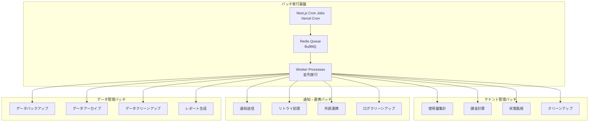

# バッチ一覧: マルチテナント対応スキル管理システム

## 1. 文書基本情報

- **文書名**: バッチ一覧
- **プロジェクト名**: 年間スキル報告書WEB化PJT - マルチテナント対応
- **対象システム**: ホールディングス・グループ会社向けマルチテナントSaaS基盤
- **作成日**: 2025/05/30
- **作成者**: システムアーキテクト
- **改訂履歴**: 2025/05/30 初版作成

---

## 2. バッチ処理概要

### 2.1 バッチ処理方針

**マルチテナント対応**と**運用自動化**を重視したバッチ処理設計：

1. **テナント別処理**: 各テナントのデータを分離して処理
2. **スケーラブル実行**: 並列処理による高速化
3. **エラーハンドリング**: 障害時の自動復旧・通知
4. **監視・ログ**: 実行状況の可視化・追跡

### 2.2 バッチ実行基盤



---

## 3. バッチ一覧

### 3.1 既存バッチ（継続）

| バッチID | バッチ名 | 実行頻度 | 実行時間 | 説明 |
|----------|----------|----------|----------|------|
| BATCH-001 | データバックアップバッチ | 日次 | 02:00 | 全データの定期バックアップ |
| BATCH-002 | ログクリーンアップバッチ | 週次 | 03:00 | 古いログファイルの削除 |
| BATCH-003 | 統計データ更新バッチ | 日次 | 01:00 | 各種統計データの更新 |
| BATCH-004 | レポート生成バッチ | 月次 | 05:00 | 月次レポートの自動生成 |

### 3.2 新規バッチ（マルチテナント対応）

#### A. BATCH-018: テナント管理バッチ

| サブバッチID | バッチ名 | 実行頻度 | 実行時間 | 説明 |
|-------------|----------|----------|----------|------|
| BATCH-018-01 | テナント使用量集計バッチ | 日次 | 01:30 | テナント別リソース使用量集計 |
| BATCH-018-02 | テナント課金計算バッチ | 月次 | 02:00 | テナント別課金額計算・請求書生成 |
| BATCH-018-03 | テナント状態監視バッチ | 時間毎 | 毎時00分 | テナント稼働状況・異常検知 |
| BATCH-018-04 | 非アクティブテナント検知バッチ | 日次 | 04:00 | 長期未使用テナントの検知・通知 |
| BATCH-018-05 | テナント設定同期バッチ | 日次 | 03:30 | テナント設定の整合性確認・同期 |

#### B. BATCH-019: 通知・連携バッチ

| サブバッチID | バッチ名 | 実行頻度 | 実行時間 | 説明 |
|-------------|----------|----------|----------|------|
| BATCH-019-01 | 定期通知送信バッチ | 日次 | 09:00 | スケジュール通知の一括送信 |
| BATCH-019-02 | 通知失敗リトライバッチ | 時間毎 | 毎時30分 | 送信失敗通知の再送処理 |
| BATCH-019-03 | 外部システム連携バッチ | 日次 | 06:00 | Teams/Slack/LINE WORKS連携 |
| BATCH-019-04 | 通知ログクリーンアップバッチ | 週次 | 日曜03:00 | 古い通知ログの削除 |
| BATCH-019-05 | 通知設定検証バッチ | 日次 | 05:30 | 通知設定の有効性確認 |

---

## 4. バッチ詳細設計

### 4.1 BATCH-018-01: テナント使用量集計バッチ

#### A. 処理概要
```typescript
// batch/tenant-usage-aggregation.ts
interface TenantUsageAggregationBatch {
  batchId: 'BATCH-018-01';
  name: 'テナント使用量集計バッチ';
  schedule: '0 1 * * *'; // 毎日01:30
  timeout: 3600; // 1時間
}

class TenantUsageAggregationService {
  async execute(): Promise<BatchResult> {
    const tenants = await this.getActiveTenants();
    const results: TenantUsageResult[] = [];
    
    for (const tenant of tenants) {
      try {
        const usage = await this.calculateTenantUsage(tenant.id);
        await this.saveTenantUsage(tenant.id, usage);
        results.push({ tenantId: tenant.id, status: 'success', usage });
      } catch (error) {
        results.push({ tenantId: tenant.id, status: 'error', error });
        await this.notifyError(tenant.id, error);
      }
    }
    
    return {
      batchId: 'BATCH-018-01',
      executedAt: new Date(),
      totalTenants: tenants.length,
      successCount: results.filter(r => r.status === 'success').length,
      errorCount: results.filter(r => r.status === 'error').length,
      results
    };
  }
  
  private async calculateTenantUsage(tenantId: string): Promise<TenantUsage> {
    const [userCount, storageUsage, apiCalls, reportCount] = await Promise.all([
      this.getUserCount(tenantId),
      this.getStorageUsage(tenantId),
      this.getApiCallCount(tenantId),
      this.getReportCount(tenantId)
    ]);
    
    return {
      tenantId,
      period: this.getCurrentPeriod(),
      activeUsers: userCount,
      storageUsedGB: storageUsage,
      apiCalls,
      reportsGenerated: reportCount,
      calculatedAt: new Date()
    };
  }
}
```

#### B. 処理フロー
1. **アクティブテナント取得**: 稼働中テナント一覧取得
2. **使用量計算**: テナント別リソース使用量算出
3. **データ保存**: 集計結果をデータベースに保存
4. **エラーハンドリング**: 失敗時の通知・ログ記録
5. **結果レポート**: 実行結果の集約・通知

### 4.2 BATCH-018-02: テナント課金計算バッチ

#### A. 処理概要
```typescript
// batch/tenant-billing-calculation.ts
class TenantBillingCalculationService {
  async execute(): Promise<BatchResult> {
    const tenants = await this.getBillableTenants();
    const invoices: Invoice[] = [];
    
    for (const tenant of tenants) {
      try {
        const usage = await this.getTenantUsage(tenant.id, this.getCurrentBillingPeriod());
        const invoice = await this.calculateInvoice(tenant, usage);
        await this.saveInvoice(invoice);
        await this.sendInvoiceNotification(tenant, invoice);
        invoices.push(invoice);
      } catch (error) {
        await this.handleBillingError(tenant.id, error);
      }
    }
    
    return {
      batchId: 'BATCH-018-02',
      executedAt: new Date(),
      processedTenants: tenants.length,
      generatedInvoices: invoices.length,
      totalAmount: invoices.reduce((sum, inv) => sum + inv.totalAmount, 0)
    };
  }
  
  private async calculateInvoice(tenant: Tenant, usage: TenantUsage): Promise<Invoice> {
    const pricingPlan = await this.getPricingPlan(tenant.plan);
    const lineItems = this.calculateLineItems(usage, pricingPlan);
    
    return {
      id: generateId(),
      tenantId: tenant.id,
      period: this.getCurrentBillingPeriod(),
      lineItems,
      subtotal: lineItems.reduce((sum, item) => sum + item.amount, 0),
      tax: this.calculateTax(lineItems),
      totalAmount: this.calculateTotal(lineItems),
      currency: tenant.customizations.currency,
      status: 'generated',
      generatedAt: new Date()
    };
  }
}
```

### 4.3 BATCH-019-01: 定期通知送信バッチ

#### A. 処理概要
```typescript
// batch/scheduled-notification.ts
class ScheduledNotificationService {
  async execute(): Promise<BatchResult> {
    const scheduledNotifications = await this.getScheduledNotifications();
    const results: NotificationResult[] = [];
    
    for (const notification of scheduledNotifications) {
      try {
        await this.sendNotification(notification);
        await this.markAsSent(notification.id);
        results.push({ notificationId: notification.id, status: 'sent' });
      } catch (error) {
        await this.markAsFailed(notification.id, error);
        await this.scheduleRetry(notification.id);
        results.push({ notificationId: notification.id, status: 'failed', error });
      }
    }
    
    return {
      batchId: 'BATCH-019-01',
      executedAt: new Date(),
      totalNotifications: scheduledNotifications.length,
      sentCount: results.filter(r => r.status === 'sent').length,
      failedCount: results.filter(r => r.status === 'failed').length
    };
  }
  
  private async sendNotification(notification: ScheduledNotification): Promise<void> {
    const tenant = await this.getTenant(notification.tenantId);
    const template = await this.getNotificationTemplate(notification.templateId);
    const recipients = await this.getRecipients(notification.recipientIds);
    
    switch (notification.type) {
      case 'email':
        await this.emailService.send(recipients, template, notification.data);
        break;
      case 'slack':
        await this.slackService.send(tenant.slackConfig, template, notification.data);
        break;
      case 'teams':
        await this.teamsService.send(tenant.teamsConfig, template, notification.data);
        break;
      case 'line-works':
        await this.lineWorksService.send(tenant.lineWorksConfig, template, notification.data);
        break;
    }
  }
}
```

### 4.4 BATCH-019-03: 外部システム連携バッチ

#### A. 処理概要
```typescript
// batch/external-system-integration.ts
class ExternalSystemIntegrationService {
  async execute(): Promise<BatchResult> {
    const tenants = await this.getTenantsWithExternalIntegration();
    const results: IntegrationResult[] = [];
    
    for (const tenant of tenants) {
      try {
        // Slack連携
        if (tenant.integrations.slack?.enabled) {
          await this.syncSlackData(tenant);
        }
        
        // Teams連携
        if (tenant.integrations.teams?.enabled) {
          await this.syncTeamsData(tenant);
        }
        
        // LINE WORKS連携
        if (tenant.integrations.lineWorks?.enabled) {
          await this.syncLineWorksData(tenant);
        }
        
        results.push({ tenantId: tenant.id, status: 'success' });
      } catch (error) {
        results.push({ tenantId: tenant.id, status: 'error', error });
        await this.notifyIntegrationError(tenant.id, error);
      }
    }
    
    return {
      batchId: 'BATCH-019-03',
      executedAt: new Date(),
      processedTenants: tenants.length,
      successCount: results.filter(r => r.status === 'success').length,
      errorCount: results.filter(r => r.status === 'error').length
    };
  }
  
  private async syncSlackData(tenant: Tenant): Promise<void> {
    const slackUsers = await this.slackService.getUsers(tenant.integrations.slack);
    const systemUsers = await this.userService.getUsers(tenant.id);
    
    // ユーザー同期
    await this.syncUsers(slackUsers, systemUsers, tenant.id);
    
    // チャンネル同期
    const slackChannels = await this.slackService.getChannels(tenant.integrations.slack);
    await this.syncNotificationChannels(slackChannels, tenant.id);
  }
}
```

---

## 5. バッチ実行基盤

### 5.1 Next.js Cron Jobs設定

```typescript
// app/api/cron/[batchId]/route.ts
import { NextRequest, NextResponse } from 'next/server';
import { verifySignature } from '@/lib/vercel-cron';
import { BatchExecutor } from '@/lib/batch/executor';

export async function POST(
  request: NextRequest,
  { params }: { params: { batchId: string } }
) {
  // Vercel Cron認証
  const signature = request.headers.get('x-vercel-signature');
  if (!verifySignature(signature)) {
    return new NextResponse('Unauthorized', { status: 401 });
  }
  
  const batchId = params.batchId;
  const executor = new BatchExecutor();
  
  try {
    const result = await executor.execute(batchId);
    return NextResponse.json(result);
  } catch (error) {
    console.error(`Batch execution failed: ${batchId}`, error);
    return new NextResponse('Internal Server Error', { status: 500 });
  }
}
```

### 5.2 Redis Queue設定

```typescript
// lib/batch/queue.ts
import { Queue, Worker } from 'bullmq';
import { redis } from '@/lib/redis';

export class BatchQueue {
  private queue: Queue;
  private worker: Worker;
  
  constructor() {
    this.queue = new Queue('batch-processing', {
      connection: redis,
      defaultJobOptions: {
        removeOnComplete: 100,
        removeOnFail: 50,
        attempts: 3,
        backoff: {
          type: 'exponential',
          delay: 2000
        }
      }
    });
    
    this.worker = new Worker('batch-processing', this.processJob.bind(this), {
      connection: redis,
      concurrency: 5
    });
  }
  
  async addJob(batchId: string, data: any): Promise<void> {
    await this.queue.add(batchId, data, {
      priority: this.getBatchPriority(batchId),
      delay: this.getBatchDelay(batchId)
    });
  }
  
  private async processJob(job: any): Promise<any> {
    const { batchId, data } = job.data;
    const executor = new BatchExecutor();
    return await executor.execute(batchId, data);
  }
}
```

### 5.3 バッチ監視・ログ

```typescript
// lib/batch/monitor.ts
class BatchMonitor {
  async logBatchStart(batchId: string, params: any): Promise<string> {
    const logId = generateId();
    
    await prisma.batchExecutionLog.create({
      data: {
        id: logId,
        batchId,
        status: 'running',
        startedAt: new Date(),
        parameters: params,
        executionHost: process.env.VERCEL_REGION || 'local'
      }
    });
    
    return logId;
  }
  
  async logBatchEnd(logId: string, result: BatchResult): Promise<void> {
    await prisma.batchExecutionLog.update({
      where: { id: logId },
      data: {
        status: result.success ? 'completed' : 'failed',
        endedAt: new Date(),
        result: result,
        errorMessage: result.error?.message
      }
    });
    
    // 失敗時はアラート送信
    if (!result.success) {
      await this.sendFailureAlert(logId, result);
    }
  }
  
  private async sendFailureAlert(logId: string, result: BatchResult): Promise<void> {
    const alertMessage = {
      title: `バッチ実行失敗: ${result.batchId}`,
      message: `実行ID: ${logId}\nエラー: ${result.error?.message}`,
      severity: 'high',
      timestamp: new Date()
    };
    
    await this.notificationService.sendSystemAlert(alertMessage);
  }
}
```

---

## 6. バッチ運用管理

### 6.1 実行スケジュール

| 時間 | バッチ | 説明 |
|------|--------|------|
| 01:00 | BATCH-003 | 統計データ更新 |
| 01:30 | BATCH-018-01 | テナント使用量集計 |
| 02:00 | BATCH-001, BATCH-018-02 | データバックアップ、課金計算 |
| 03:00 | BATCH-002 | ログクリーンアップ（週次） |
| 03:30 | BATCH-018-05 | テナント設定同期 |
| 04:00 | BATCH-018-04 | 非アクティブテナント検知 |
| 05:00 | BATCH-004 | レポート生成（月次） |
| 05:30 | BATCH-019-05 | 通知設定検証 |
| 06:00 | BATCH-019-03 | 外部システム連携 |
| 09:00 | BATCH-019-01 | 定期通知送信 |
| 毎時00分 | BATCH-018-03 | テナント状態監視 |
| 毎時30分 | BATCH-019-02 | 通知失敗リトライ |

### 6.2 エラーハンドリング

```typescript
// lib/batch/error-handler.ts
class BatchErrorHandler {
  async handleError(batchId: string, error: Error, context: any): Promise<void> {
    // エラーログ記録
    await this.logError(batchId, error, context);
    
    // 重要度判定
    const severity = this.determineSeverity(batchId, error);
    
    // 通知送信
    if (severity >= ErrorSeverity.HIGH) {
      await this.sendImmediateAlert(batchId, error, context);
    }
    
    // 自動復旧試行
    if (this.isRecoverable(error)) {
      await this.scheduleRetry(batchId, context);
    }
  }
  
  private determineSeverity(batchId: string, error: Error): ErrorSeverity {
    // 課金関連は最高優先度
    if (batchId.startsWith('BATCH-018-02')) {
      return ErrorSeverity.CRITICAL;
    }
    
    // 通知関連は高優先度
    if (batchId.startsWith('BATCH-019')) {
      return ErrorSeverity.HIGH;
    }
    
    // その他は中優先度
    return ErrorSeverity.MEDIUM;
  }
}
```

### 6.3 パフォーマンス監視

```typescript
// lib/batch/performance-monitor.ts
class BatchPerformanceMonitor {
  async trackExecution(batchId: string, executionTime: number, resourceUsage: ResourceUsage): Promise<void> {
    await prisma.batchPerformanceMetrics.create({
      data: {
        batchId,
        executionTime,
        memoryUsage: resourceUsage.memory,
        cpuUsage: resourceUsage.cpu,
        recordsProcessed: resourceUsage.recordsProcessed,
        timestamp: new Date()
      }
    });
    
    // 性能劣化検知
    const avgExecutionTime = await this.getAverageExecutionTime(batchId);
    if (executionTime > avgExecutionTime * 1.5) {
      await this.sendPerformanceAlert(batchId, executionTime, avgExecutionTime);
    }
  }
}
```

このバッチ一覧により、マルチテナント対応システムの運用自動化と安定稼働を実現します。
