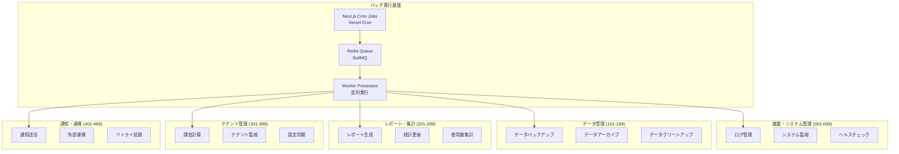

# バッチ一覧: マルチテナント対応スキル管理システム

## 1. 文書基本情報

- **文書名**: バッチ一覧
- **プロジェクト名**: 年間スキル報告書WEB化PJT - マルチテナント対応
- **対象システム**: ホールディングス・グループ会社向けマルチテナントSaaS基盤
- **作成日**: 2025/05/30
- **作成者**: システムアーキテクト
- **改訂履歴**: 
  - 2025/05/30 初版作成
  - 2025/05/30 採番ルール変更（3桁連番形式に統一）

---

## 2. バッチ採番ルール

### 2.1 新採番ルール
- **形式**: `BATCH-XXX` (XXXは3桁の連番)
- **範囲**: BATCH-001 ～ BATCH-999
- **分類**: 機能別にブロック分け

### 2.2 機能別ブロック分類
| ブロック | 範囲 | 機能分類 |
|----------|------|----------|
| 001-099 | BATCH-001 ～ BATCH-099 | 基盤・システム管理 |
| 101-199 | BATCH-101 ～ BATCH-199 | データ管理・バックアップ |
| 201-299 | BATCH-201 ～ BATCH-299 | レポート・集計処理 |
| 301-399 | BATCH-301 ～ BATCH-399 | テナント管理 |
| 401-499 | BATCH-401 ～ BATCH-499 | 通知・連携 |
| 501-599 | BATCH-501 ～ BATCH-599 | 監視・メンテナンス |
| 601-699 | BATCH-601 ～ BATCH-699 | スキル管理・分析 |
| 701-799 | BATCH-701 ～ BATCH-799 | マスタ管理・同期 |
| 901-999 | BATCH-901 ～ BATCH-999 | 緊急・特殊処理 |

---

## 3. バッチ処理概要

### 3.1 バッチ処理方針

**マルチテナント対応**と**運用自動化**を重視したバッチ処理設計：

1. **テナント別処理**: 各テナントのデータを分離して処理
2. **スケーラブル実行**: 並列処理による高速化
3. **エラーハンドリング**: 障害時の自動復旧・通知
4. **監視・ログ**: 実行状況の可視化・追跡

### 3.2 バッチ実行基盤



---

## 4. バッチ一覧

### 4.1 基盤・システム管理 (001-099)

| バッチID | バッチ名 | 実行頻度 | 実行時間 | 説明 | 定義書 |
|----------|----------|----------|----------|------|--------|
| BATCH-001 | システムヘルスチェックバッチ | 時間毎 | 毎時00分 | システム全体の稼働状況確認 | [バッチ定義書_BATCH-001_システムヘルスチェックバッチ.md](specs/バッチ定義書_BATCH-001_システムヘルスチェックバッチ.md) |
| BATCH-002 | ログクリーンアップバッチ | 日次 | 03:00 | 古いログファイルの削除・アーカイブ | [バッチ定義書_BATCH-002_ログクリーンアップバッチ.md](specs/バッチ定義書_BATCH-002_ログクリーンアップバッチ.md) |
| BATCH-003 | セキュリティスキャンバッチ | 日次 | 04:30 | セキュリティ脆弱性スキャン | [バッチ定義書_BATCH-003_セキュリティスキャンバッチ.md](specs/バッチ定義書_BATCH-003_セキュリティスキャンバッチ.md) |
| BATCH-004 | パフォーマンス監視バッチ | 時間毎 | 毎時15分 | システムパフォーマンス監視・記録 | [バッチ定義書_BATCH-004_パフォーマンス監視バッチ.md](specs/バッチ定義書_BATCH-004_パフォーマンス監視バッチ.md) |
| BATCH-005 | ライセンス管理バッチ | 日次 | 02:30 | テナント別ライセンス使用状況監視・期限切れ検知 | [バッチ定義書_BATCH-005_ライセンス管理バッチ.md](specs/バッチ定義書_BATCH-005_ライセンス管理バッチ.md) |
| BATCH-006 | トークン無効化バッチ | 時間毎 | 毎時30分 | 期限切れトークンの無効化・削除 | [バッチ定義書_BATCH-006_トークン無効化バッチ.md](specs/バッチ定義書_BATCH-006_トークン無効化バッチ.md) |
| BATCH-007 | エラーログ分析バッチ | 時間毎 | 毎時30分 | エラーログの解析・異常パターン検出・アラート送信 | [バッチ定義書_BATCH-007_エラーログ分析バッチ.md](specs/バッチ定義書_BATCH-007_エラーログ分析バッチ.md) |

### 4.2 データ管理・バックアップ (101-199)

| バッチID | バッチ名 | 実行頻度 | 実行時間 | 説明 | 定義書 |
|----------|----------|----------|----------|------|--------|
| BATCH-101 | データベースバックアップバッチ | 日次 | 02:00 | 全データベースの定期バックアップ | [バッチ定義書_BATCH-101_データベースバックアップバッチ.md](specs/バッチ定義書_BATCH-101_データベースバックアップバッチ.md) |
| BATCH-102 | ファイルバックアップバッチ | 日次 | 02:30 | アップロードファイルのバックアップ | [バッチ定義書_BATCH-102_ファイルバックアップバッチ.md](specs/バッチ定義書_BATCH-102_ファイルバックアップバッチ.md) |
| BATCH-103 | データアーカイブバッチ | 月次 | 1日 03:00 | 古いデータのアーカイブ処理 | [バッチ定義書_BATCH-103_データアーカイブバッチ.md](specs/バッチ定義書_BATCH-103_データアーカイブバッチ.md) |
| BATCH-104 | データクリーンアップバッチ | 週次 | 日曜 04:00 | 不要データの削除・整理 | [バッチ定義書_BATCH-104_データクリーンアップバッチ.md](specs/バッチ定義書_BATCH-104_データクリーンアップバッチ.md) |
| BATCH-105 | データ整合性チェックバッチ | 日次 | 05:30 | データベース整合性の確認 | [バッチ定義書_BATCH-105_データ整合性チェックバッチ.md](specs/バッチ定義書_BATCH-105_データ整合性チェックバッチ.md) |

### 4.3 レポート・集計処理 (201-299)

| バッチID | バッチ名 | 実行頻度 | 実行時間 | 説明 | 定義書 |
|----------|----------|----------|----------|------|--------|
| BATCH-201 | 統計データ更新バッチ | 日次 | 01:00 | 各種統計データの更新・集計 | [バッチ定義書_BATCH-201_統計データ更新バッチ.md](specs/バッチ定義書_BATCH-201_統計データ更新バッチ.md) |
| BATCH-202 | 月次レポート生成バッチ | 月次 | 1日 06:00 | 月次レポートの自動生成 | [バッチ定義書_BATCH-202_月次レポート生成バッチ.md](specs/バッチ定義書_BATCH-202_月次レポート生成バッチ.md) |
| BATCH-203 | 週次レポート生成バッチ | 週次 | 月曜 07:00 | 週次レポートの自動生成 | [バッチ定義書_BATCH-203_週次レポート生成バッチ.md](specs/バッチ定義書_BATCH-203_週次レポート生成バッチ.md) |
| BATCH-204 | 使用量集計バッチ | 日次 | 01:30 | システム使用量の集計・記録 | [バッチ定義書_BATCH-204_使用量集計バッチ.md](specs/バッチ定義書_BATCH-204_使用量集計バッチ.md) |
| BATCH-205 | KPI計算バッチ | 日次 | 06:30 | 各種KPIの計算・更新 | [バッチ定義書_BATCH-205_KPI計算バッチ.md](specs/バッチ定義書_BATCH-205_KPI計算バッチ.md) |

### 4.4 テナント管理 (301-399)

| バッチID | バッチ名 | 実行頻度 | 実行時間 | 説明 | 定義書 |
|----------|----------|----------|----------|------|--------|
| BATCH-301 | テナント使用量集計バッチ | 日次 | 01:45 | テナント別リソース使用量集計 | [バッチ定義書_BATCH-301_テナント使用量集計バッチ.md](specs/バッチ定義書_BATCH-301_テナント使用量集計バッチ.md) |
| BATCH-302 | テナント課金計算バッチ | 月次 | 1日 02:00 | テナント別課金額計算・請求書生成 | [バッチ定義書_BATCH-302_テナント課金計算バッチ.md](specs/バッチ定義書_BATCH-302_テナント課金計算バッチ.md) |
| BATCH-303 | テナント状態監視バッチ | 時間毎 | 毎時30分 | テナント稼働状況・異常検知 | [バッチ定義書_BATCH-303_テナント状態監視バッチ.md](specs/バッチ定義書_BATCH-303_テナント状態監視バッチ.md) |
| BATCH-304 | 非アクティブテナント検知バッチ | 日次 | 04:00 | 長期未使用テナントの検知・通知 | [バッチ定義書_BATCH-304_非アクティブテナント検知バッチ.md](specs/バッチ定義書_BATCH-304_非アクティブテナント検知バッチ.md) |
| BATCH-305 | テナント設定同期バッチ | 日次 | 03:30 | テナント設定の整合性確認・同期 | [バッチ定義書_BATCH-305_テナント設定同期バッチ.md](specs/バッチ定義書_BATCH-305_テナント設定同期バッチ.md) |
| BATCH-306 | テナントリソース最適化バッチ | 週次 | 土曜 02:00 | テナントリソースの最適化 | [バッチ定義書_BATCH-306_テナントリソース最適化バッチ.md](specs/バッチ定義書_BATCH-306_テナントリソース最適化バッチ.md) |
| BATCH-307 | テナント契約更新通知バッチ | 日次 | 09:30 | 契約更新期限の通知処理 | [バッチ定義書_BATCH-307_テナント契約更新通知バッチ.md](specs/バッチ定義書_BATCH-307_テナント契約更新通知バッチ.md) |

### 4.5 通知・連携 (401-499)

| バッチID | バッチ名 | 実行頻度 | 実行時間 | 説明 | 定義書 |
|----------|----------|----------|----------|------|--------|
| BATCH-401 | 定期通知送信バッチ | 日次 | 09:00 | スケジュール通知の一括送信 | [バッチ定義書_BATCH-401_定期通知送信バッチ.md](specs/バッチ定義書_BATCH-401_定期通知送信バッチ.md) |
| BATCH-402 | 通知失敗リトライバッチ | 時間毎 | 毎時45分 | 送信失敗通知の再送処理 | [バッチ定義書_BATCH-402_通知失敗リトライバッチ.md](specs/バッチ定義書_BATCH-402_通知失敗リトライバッチ.md) |
| BATCH-403 | 外部システム連携バッチ | 日次 | 06:00 | Teams/Slack/LINE WORKS連携 | [バッチ定義書_BATCH-403_外部システム連携バッチ.md](specs/バッチ定義書_BATCH-403_外部システム連携バッチ.md) |
| BATCH-404 | 通知ログクリーンアップバッチ | 週次 | 日曜 03:30 | 古い通知ログの削除 | [バッチ定義書_BATCH-404_通知ログクリーンアップバッチ.md](specs/バッチ定義書_BATCH-404_通知ログクリーンアップバッチ.md) |
| BATCH-405 | 通知設定検証バッチ | 日次 | 05:45 | 通知設定の有効性確認 | [バッチ定義書_BATCH-405_通知設定検証バッチ.md](specs/バッチ定義書_BATCH-405_通知設定検証バッチ.md) |
| BATCH-406 | メール配信バッチ | 時間毎 | 毎時10分 | メール配信キューの処理 | [バッチ定義書_BATCH-406_メール配信バッチ.md](specs/バッチ定義書_BATCH-406_メール配信バッチ.md) |
| BATCH-407 | Slack連携同期バッチ | 日次 | 06:15 | Slackユーザー・チャンネル同期 | [バッチ定義書_BATCH-407_Slack連携同期バッチ.md](specs/バッチ定義書_BATCH-407_Slack連携同期バッチ.md) |
| BATCH-408 | Teams連携同期バッチ | 日次 | 06:30 | Teamsユーザー・チーム同期 | [バッチ定義書_BATCH-408_Teams連携同期バッチ.md](specs/バッチ定義書_BATCH-408_Teams連携同期バッチ.md) |
| BATCH-409 | LINE WORKS連携同期バッチ | 日次 | 06:45 | LINE WORKSユーザー・グループ同期 | [バッチ定義書_BATCH-409_LINE WORKS連携同期バッチ.md](specs/バッチ定義書_BATCH-409_LINE%20WORKS連携同期バッチ.md) |

### 4.6 監視・メンテナンス (501-599)

| バッチID | バッチ名 | 実行頻度 | 実行時間 | 説明 | 定義書 |
|----------|----------|----------|----------|------|--------|
| BATCH-501 | システム監視バッチ | 5分毎 | - | システム全体の監視・アラート | [バッチ定義書_BATCH-501_システム監視バッチ.md](specs/バッチ定義書_BATCH-501_システム監視バッチ.md) |
| BATCH-502 | データベース監視バッチ | 10分毎 | - | データベースパフォーマンス監視 | [バッチ定義書_BATCH-502_データベース監視バッチ.md](specs/バッチ定義書_BATCH-502_データベース監視バッチ.md) |
| BATCH-503 | アプリケーション監視バッチ | 5分毎 | - | アプリケーション全体の監視・アラート | [バッチ定義書_BATCH-503_アプリケーション監視バッチ.md](specs/バッチ定義書_BATCH-503_アプリケーション監視バッチ.md) |
| BATCH-504 | メモリ使用量監視バッチ | 時間毎 | 毎時20分 | メモリ使用量の監視・最適化 | [バッチ定義書_BATCH-504_メモリ使用量監視バッチ.md](specs/バッチ定義書_BATCH-504_メモリ使用量監視バッチ.md) |
| BATCH-505 | ネットワーク監視バッチ | 時間毎 | 毎時35分 | ネットワーク状況の監視 | [バッチ定義書_BATCH-505_ネットワーク監視バッチ.md](specs/バッチ定義書_BATCH-505_ネットワーク監視バッチ.md) |
| BATCH-506 | セッション管理バッチ | 時間毎 | 毎時50分 | 期限切れセッションの削除 | [バッチ定義書_BATCH-506_セッション管理バッチ.md](specs/バッチ定義書_BATCH-506_セッション管理バッチ.md) |
| BATCH-507 | キャッシュ最適化バッチ | 日次 | 03:45 | キャッシュの最適化・クリア | [バッチ定義書_BATCH-507_キャッシュ最適化バッチ.md](specs/バッチ定義書_BATCH-507_キャッシュ最適化バッチ.md) |
| BATCH-508 | ディスク容量監視バッチ | 時間毎 | 毎時05分 | ディスク使用量の監視・アラート | [バッチ定義書_BATCH-508_ディスク容量監視バッチ.md](specs/バッチ定義書_BATCH-508_ディスク容量監視バッチ.md) |

### 4.7 スキル管理・分析 (601-699)

| バッチID | バッチ名 | 実行頻度 | 実行時間 | 説明 | 定義書 |
|----------|----------|----------|----------|------|--------|
| BATCH-601 | スキル分析レポート生成バッチ | 月次 | 1日 04:00 | スキルデータの集計・分析レポート自動生成 | [バッチ定義書_BATCH-601_スキル分析レポート生成バッチ.md](specs/バッチ定義書_BATCH-601_スキル分析レポート生成バッチ.md) |
| BATCH-602 | 帳票自動生成バッチ | 月次 | 1日 06:00 | 定型帳票（Excel/PDF）の自動生成・配信 | [バッチ定義書_BATCH-602_帳票自動生成バッチ.md](specs/バッチ定義書_BATCH-602_帳票自動生成バッチ.md) |
| BATCH-603 | データ品質監視バッチ | 日次 | 04:00 | データ品質の監視・整合性チェック・レポート生成 | [バッチ定義書_BATCH-603_データ品質監視バッチ.md](specs/バッチ定義書_BATCH-603_データ品質監視バッチ.md) |

### 4.8 マスタ管理・同期 (701-799)

| バッチID | バッチ名 | 実行頻度 | 実行時間 | 説明 | 定義書 |
|----------|----------|----------|----------|------|--------|
| BATCH-701 | 組織・役職マスタ同期バッチ | 日次 | 05:00 | 外部人事システムからの組織・役職情報同期 | [バッチ定義書_BATCH-701_組織・役職マスタ同期バッチ.md](specs/バッチ定義書_BATCH-701_組織・役職マスタ同期バッチ.md) |

### 4.9 緊急・特殊処理 (901-999)

| バッチID | バッチ名 | 実行頻度 | 実行時間 | 説明 | 定義書 |
|----------|----------|----------|----------|------|--------|
| BATCH-901 | 緊急データ復旧バッチ | 手動実行 | - | 緊急時のデータ復旧処理 | [バッチ定義書_BATCH-901_緊急データ復旧バッチ.md](specs/バッチ定義書_BATCH-901_緊急データ復旧バッチ.md) |
| BATCH-902 | システム緊急停止バッチ | 手動実行 | - | 緊急時のシステム停止処理 | [バッチ定義書_BATCH-902_システム緊急停止バッチ.md](specs/バッチ定義書_BATCH-902_システム緊急停止バッチ.md) |
| BATCH-903 | 大量データ移行バッチ | 手動実行 | - | 大量データの移行・変換処理 | [バッチ定義書_BATCH-903_大量データ移行バッチ.md](specs/バッチ定義書_BATCH-903_大量データ移行バッチ.md) |
| BATCH-904 | セキュリティ緊急対応バッチ | 手動実行 | - | セキュリティインシデント対応 | [バッチ定義書_BATCH-904_セキュリティ緊急対応バッチ.md](specs/バッチ定義書_BATCH-904_セキュリティ緊急対応バッチ.md) |
| BATCH-905 | データベース緊急メンテナンスバッチ | 手動実行 | - | 緊急データベースメンテナンス | [バッチ定義書_BATCH-905_データベース緊急メンテナンスバッチ.md](specs/バッチ定義書_BATCH-905_データベース緊急メンテナンスバッチ.md) |

---

## 5. バッチ詳細設計

### 5.1 BATCH-301: テナント使用量集計バッチ

#### A. 処理概要
```typescript
// batch/tenant-usage-aggregation.ts
interface TenantUsageAggregationBatch {
  batchId: 'BATCH-301';
  name: 'テナント使用量集計バッチ';
  schedule: '45 1 * * *'; // 毎日01:45
  timeout: 3600; // 1時間
}

class TenantUsageAggregationService {
  async execute(): Promise<BatchResult> {
    const tenants = await this.getActiveTenants();
    const results: TenantUsageResult[] = [];
    
    for (const tenant of tenants) {
      try {
        const usage = await this.calculateTenantUsage(tenant.id);
        await this.saveTenantUsage(tenant.id, usage);
        results.push({ tenantId: tenant.id, status: 'success', usage });
      } catch (error) {
        results.push({ tenantId: tenant.id, status: 'error', error });
        await this.notifyError(tenant.id, error);
      }
    }
    
    return {
      batchId: 'BATCH-301',
      executedAt: new Date(),
      totalTenants: tenants.length,
      successCount: results.filter(r => r.status === 'success').length,
      errorCount: results.filter(r => r.status === 'error').length,
      results
    };
  }
  
  private async calculateTenantUsage(tenantId: string): Promise<TenantUsage> {
    const [userCount, storageUsage, apiCalls, reportCount] = await Promise.all([
      this.getUserCount(tenantId),
      this.getStorageUsage(tenantId),
      this.getApiCallCount(tenantId),
      this.getReportCount(tenantId)
    ]);
    
    return {
      tenantId,
      period: this.getCurrentPeriod(),
      activeUsers: userCount,
      storageUsedGB: storageUsage,
      apiCalls,
      reportsGenerated: reportCount,
      calculatedAt: new Date()
    };
  }
}
```

### 5.2 BATCH-302: テナント課金計算バッチ

#### A. 処理概要
```typescript
// batch/tenant-billing-calculation.ts
class TenantBillingCalculationService {
  async execute(): Promise<BatchResult> {
    const tenants = await this.getBillableTenants();
    const invoices: Invoice[] = [];
    
    for (const tenant of tenants) {
      try {
        const usage = await this.getTenantUsage(tenant.id, this.getCurrentBillingPeriod());
        const invoice = await this.calculateInvoice(tenant, usage);
        await this.saveInvoice(invoice);
        await this.sendInvoiceNotification(tenant, invoice);
        invoices.push(invoice);
      } catch (error) {
        await this.handleBillingError(tenant.id, error);
      }
    }
    
    return {
      batchId: 'BATCH-302',
      executedAt: new Date(),
      processedTenants: tenants.length,
      generatedInvoices: invoices.length,
      totalAmount: invoices.reduce((sum, inv) => sum + inv.totalAmount, 0)
    };
  }
  
  private async calculateInvoice(tenant: Tenant, usage: TenantUsage): Promise<Invoice> {
    const pricingPlan = await this.getPricingPlan(tenant.plan);
    const lineItems = this.calculateLineItems(usage, pricingPlan);
    
    return {
      id: generateId(),
      tenantId: tenant.id,
      period: this.getCurrentBillingPeriod(),
      lineItems,
      subtotal: lineItems.reduce((sum, item) => sum + item.amount, 0),
      tax: this.calculateTax(lineItems),
      totalAmount: this.calculateTotal(lineItems),
      currency: tenant.customizations.currency,
      status: 'generated',
      generatedAt: new Date()
    };
  }
}
```

### 5.3 BATCH-401: 定期通知送信バッチ

#### A. 処理概要
```typescript
// batch/scheduled-notification.ts
class ScheduledNotificationService {
  async execute(): Promise<BatchResult> {
    const scheduledNotifications = await this.getScheduledNotifications();
    const results: NotificationResult[] = [];
    
    for (const notification of scheduledNotifications) {
      try {
        await this.sendNotification(notification);
        await this.markAsSent(notification.id);
        results.push({ notificationId: notification.id, status: 'sent' });
      } catch (error) {
        await this.markAsFailed(notification.id, error);
        await this.scheduleRetry(notification.id);
        results.push({ notificationId: notification.id, status: 'failed', error });
      }
    }
    
    return {
      batchId: 'BATCH-401',
      executedAt: new Date(),
      totalNotifications: scheduledNotifications.length,
      sentCount: results.filter(r => r.status === 'sent').length,
      failedCount: results.filter(r => r.status === 'failed').length
    };
  }
  
  private async sendNotification(notification: ScheduledNotification): Promise<void> {
    const tenant = await this.getTenant(notification.tenantId);
    const template = await this.getNotificationTemplate(notification.templateId);
    const recipients = await this.getRecipients(notification.recipientIds);
    
    switch (notification.type) {
      case 'email':
        await this.emailService.send(recipients, template, notification.data);
        break;
      case 'slack':
        await this.slackService.send(tenant.slackConfig, template, notification.data);
        break;
      case 'teams':
        await this.teamsService.send(tenant.teamsConfig, template, notification.data);
        break;
      case 'line-works':
        await this.lineWorksService.send(tenant.lineWorksConfig, template, notification.data);
        break;
    }
  }
}
```

---

## 6. バッチ実行基盤

### 6.1 Next.js Cron Jobs設定

```typescript
// app/api/cron/[batchId]/route.ts
import { NextRequest, NextResponse } from 'next/server';
import { verifySignature } from '@/lib/vercel-cron';
import { BatchExecutor } from '@/lib/batch/executor';

export async function POST(
  request: NextRequest,
  { params }: { params: { batchId: string } }
) {
  // Vercel Cron認証
  const signature = request.headers.get('x-vercel-signature');
  if (!verifySignature(signature)) {
    return new NextResponse('Unauthorized', { status: 401 });
  }
  
  const batchId = params.batchId;
  const executor = new BatchExecutor();
  
  try {
    const result = await executor.execute(batchId);
    return NextResponse.json(result);
  } catch (error) {
    console.error(`Batch execution failed: ${batchId}`, error);
    return new NextResponse('Internal Server Error', { status: 500 });
  }
}
```

### 6.2 Redis Queue設定

```typescript
// lib/batch/queue.ts
import { Queue, Worker } from 'bullmq';
import { redis } from '@/lib/redis';

export class BatchQueue {
  private queue: Queue;
  private worker: Worker;
  
  constructor() {
    this.queue = new Queue('batch-processing', {
      connection: redis,
      defaultJobOptions: {
        removeOnComplete: 100,
        removeOnFail: 50,
        attempts: 3,
        backoff: {
          type: 'exponential',
          delay: 2000
        }
      }
    });
    
    this.worker = new Worker('batch-processing', this.processJob.bind(this), {
      connection: redis,
      concurrency: 5
    });
  }
  
  async addJob(batchId: string, data: any): Promise<void> {
    await this.queue.add(batchId, data, {
      priority: this.getBatchPriority(batchId),
      delay: this.getBatchDelay(batchId)
    });
  }
  
  private async processJob(job: any): Promise<any> {
    const { batchId, data } = job.data;
    const executor = new BatchExecutor();
    return await executor.execute(batchId, data);
  }
}
```

---

## 7. バッチ運用管理

### 7.1 実行スケジュール

| 時間 | バッチ | 説明 |
|------|--------|------|
| 01:00 | BATCH-201 | 統計データ更新 |
| 01:30 | BATCH-204 | 使用量集計 |
| 01:45 | BATCH-301 | テナント使用量集計 |
| 02:00 | BATCH-101, BATCH-302 | データバックアップ、課金計算 |
| 02:30 | BATCH-102, BATCH-005 | ファイルバックアップ、ライセンス管理 |
| 03:00 | BATCH-002 | ログクリーンアップ |
| 03:30 | BATCH-305 | テナント設定同期 |
| 03:45 | BATCH-507 | キャッシュ最適化 |
| 04:00 | BATCH-304, BATCH-603 | 非アクティブテナント検知、データ品質監視 |
| 04:30 | BATCH-003 | セキュリティスキャン |
| 05:00 | BATCH-701 | 組織・役職マスタ同期 |
| 05:30 | BATCH-105 | データ整合性チェック |
| 05:45 | BATCH-405 | 通知設定検証 |
| 06:00 | BATCH-403 | 外部システム連携 |
| 06:15 | BATCH-407 | Slack連携同期 |
| 06:30 | BATCH-205, BATCH-408 | KPI計算、Teams連携同期 |
| 06:45 | BATCH-409 | LINE WORKS連携同期 |
| 09:00 | BATCH-401 | 定期通知送信 |
| 09:30 | BATCH-307 | テナント契約更新通知 |
| 毎時00分 | BATCH-001 | システムヘルスチェック |
| 毎時05分 | BATCH-508 | ディスク容量監視 |
| 毎時10分 | BATCH-406 | メール配信 |
| 毎時15分 | BATCH-004 | パフォーマンス監視 |
| 毎時20分 | BATCH-504 | メモリ使用量監視 |
| 毎時30分 | BATCH-006, BATCH-007, BATCH-303 | トークン無効化、エラーログ分析、テナント状態監視 |
| 毎時35分 | BATCH-505 | ネットワーク監視 |
| 毎時45分 | BATCH-402 | 通知失敗リトライ |
| 毎時50分 | BATCH-506 | セッション管理 |
| 5分毎 | BATCH-501, BATCH-503 | システム監視、アプリケーション監視 |
| 10分毎 | BATCH-502 | データベース監視 |

### 7.2 エラーハンドリング

```typescript
// lib/batch/error-handler.ts
class BatchErrorHandler {
  async handleError(batchId: string, error: Error, context: any): Promise<void> {
    // エラーログ記録
    await this.logError(batchId, error, context);
    
    // 重要度判定
    const severity = this.determineSeverity(batchId, error);
    
    // 通知送信
    if (severity >= ErrorSeverity.HIGH) {
      await this.sendImmediateAlert(batchId, error, context);
    }
    
    // 自動復旧試行
    if (this.isRecoverable(error)) {
      await this.scheduleRetry(batchId, context);
    }
  }
  
  private determineSeverity(batchId: string, error: Error): ErrorSeverity {
    // 課金関連は最高優先度
    if (batchId === 'BATCH-302') {
      return ErrorSeverity.CRITICAL;
    }
    
    // システム監視関連は高優先度
    if (batchId.startsWith('BATCH-50')) {
      return ErrorSeverity.HIGH;
    }
    
    // 通知関連は高優先度
    if (batchId.startsWith('BATCH-40')) {
      return ErrorSeverity.HIGH;
    }
    
    // その他は中優先度
    return ErrorSeverity.MEDIUM;
  }
}
```

### 7.3 パフォーマンス監視

```typescript
// lib/batch/performance-monitor.ts
class BatchPerformanceMonitor {
  async trackExecution(batchId: string, executionTime: number, resourceUsage: ResourceUsage): Promise<void> {
    await prisma.batchPerformanceMetrics.create({
      data: {
        batchId,
        executionTime,
        memoryUsage: resourceUsage.memory,
        cpuUsage: resourceUsage.cpu,
        recordsProcessed: resourceUsage.recordsProcessed,
        timestamp: new Date()
      }
    });
    
    // 性能劣化検知
    const avgExecutionTime = await this.getAverageExecutionTime(batchId);
    if (executionTime > avgExecutionTime * 1.5) {
      await this.sendPerformanceAlert(batchId, executionTime, avgExecutionTime);
    }
  }
}
```

このバッチ一覧により、マルチテナント対応システムの運用自動化と安定稼働を実現します。新たな3桁採番ルールにより、バッチの分類と管理が効率化されます。
