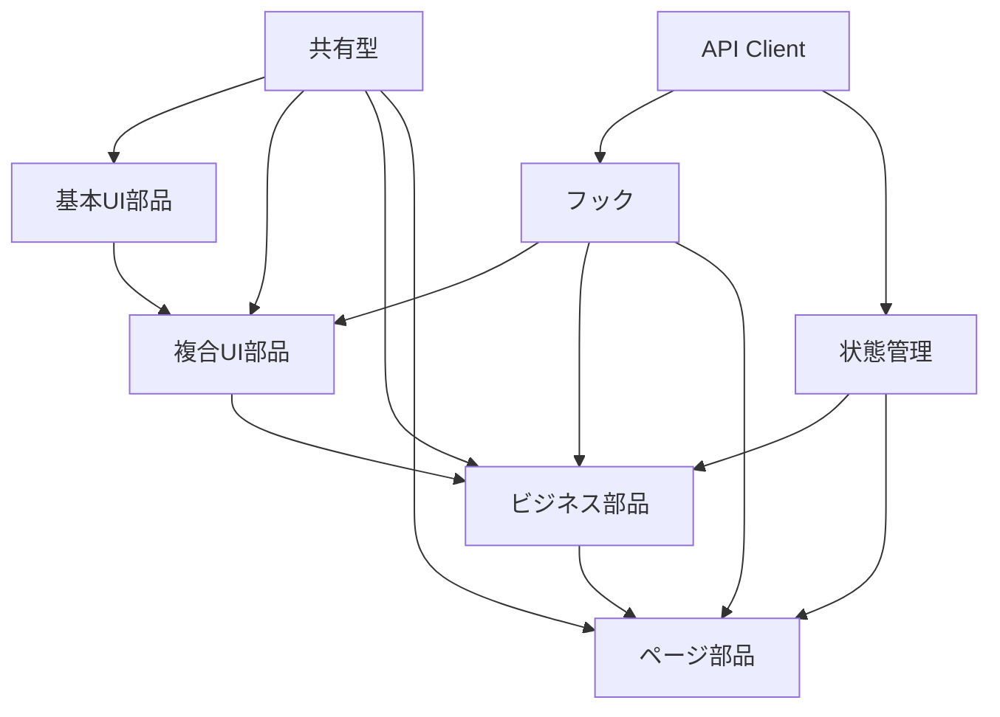
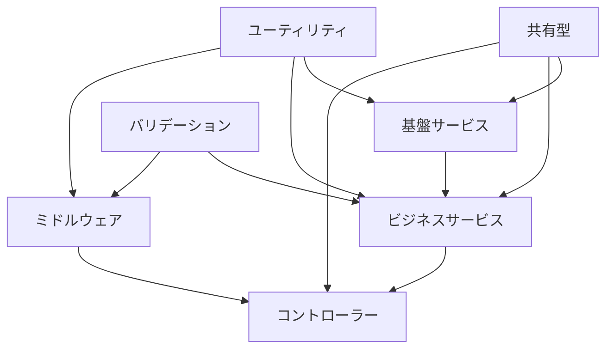
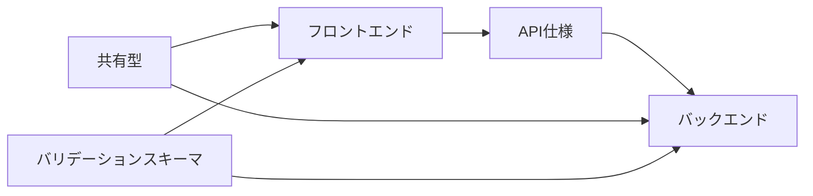

# 共通部品定義書: 年間スキル報告書WEB化PJT

## 1. 文書基本情報

- **文書名**: 共通部品定義書
- **プロジェクト名**: 年間スキル報告書WEB化PJT
- **対象システム**: 年間スキル報告書Webアプリケーション
- **作成日**: 2025/05/30
- **作成者**: システム設計担当
- **改訂履歴**: 2025/05/30 初版作成

---

## 2. 概要・目的

### 2.1 共通部品化の目的

本プロジェクトでは、フロントエンド・バックエンド双方において共通部品化を推進し、以下の目標を達成します：

1. **開発効率向上**
   - 重複コードの削減による開発工数短縮
   - 再利用可能なコンポーネントによる実装速度向上
   - 統一されたAPIインターフェースによる連携効率化

2. **品質統一**
   - 一貫したUI/UXの実現
   - 統一されたエラーハンドリング・バリデーション
   - コーディング規約の統一による可読性向上

3. **保守性向上**
   - 修正箇所の一元化による保守コスト削減
   - テストの効率化・自動化
   - ドキュメント管理の一元化

4. **チーム協力促進**
   - フロント・バック間の契約明確化
   - 共通理解による開発速度向上
   - レビュー効率の向上

### 2.2 適用範囲

- **フロントエンド**: React/Next.js アプリケーション
- **バックエンド**: Node.js/Express API サーバー
- **共有領域**: TypeScript型定義、バリデーションスキーマ、API仕様
- **テスト**: 単体テスト、統合テスト、E2Eテスト

---

## 3. 共通部品化戦略

### 3.1 アーキテクチャ概要

```
┌─────────────────────────────────────────────────────────────┐
│                    共通部品エコシステム                        │
├─────────────────────────────────────────────────────────────┤
│                                                             │
│  ┌─────────────┐    ┌─────────────┐    ┌─────────────┐      │
│  │ フロントエンド │    │   共有領域   │    │ バックエンド  │      │
│  │             │    │             │    │             │      │
│  │ ┌─────────┐ │    │ ┌─────────┐ │    │ ┌─────────┐ │      │
│  │ │UI部品   │ │◄──►│ │型定義   │ │◄──►│ │サービス │ │      │
│  │ └─────────┘ │    │ └─────────┘ │    │ └─────────┘ │      │
│  │ ┌─────────┐ │    │ ┌─────────┐ │    │ ┌─────────┐ │      │
│  │ │フック   │ │◄──►│ │スキーマ │ │◄──►│ │リポジトリ│ │      │
│  │ └─────────┘ │    │ └─────────┘ │    │ └─────────┘ │      │
│  │ ┌─────────┐ │    │ ┌─────────┐ │    │ ┌─────────┐ │      │
│  │ │状態管理 │ │◄──►│ │API仕様  │ │◄──►│ │ミドルウェア│ │      │
│  │ └─────────┘ │    │ └─────────┘ │    │ └─────────┘ │      │
│  └─────────────┘    └─────────────┘    └─────────────┘      │
│                                                             │
└─────────────────────────────────────────────────────────────┘
```

### 3.2 部品分類体系

#### レイヤー分類
1. **基盤層**: 最も基本的な部品（Button, Input等）
2. **複合層**: 基盤層を組み合わせた部品（Form, Table等）
3. **ビジネス層**: 業務固有の部品（SkillForm, Dashboard等）
4. **アプリケーション層**: ページレベルの部品

#### 責務分類
1. **表示責務**: UI表示・レンダリング
2. **制御責務**: 状態管理・イベント処理
3. **データ責務**: データ取得・更新・変換
4. **検証責務**: バリデーション・ビジネスルール

---

## 4. 部品カテゴリ一覧

### 4.1 フロントエンド共通部品

#### A. UI基本部品
| 部品名 | 責務 | 依存関係 | 優先度 |
|--------|------|----------|--------|
| Button | ユーザーアクション実行 | なし | 高 |
| Input | テキスト入力 | なし | 高 |
| Select | 選択肢入力 | なし | 高 |
| Checkbox | チェック入力 | なし | 高 |
| DatePicker | 日付入力 | Input | 中 |
| Badge | ステータス表示 | なし | 中 |
| Modal | モーダル表示 | なし | 中 |
| Toast | 通知表示 | なし | 低 |

#### B. UI複合部品
| 部品名 | 責務 | 依存関係 | 優先度 |
|--------|------|----------|--------|
| Form | フォーム管理 | Input, Select, Button | 高 |
| DataTable | データ一覧表示 | Table, Pagination | 高 |
| Pagination | ページング制御 | Button | 高 |
| Navigation | ナビゲーション | Button, Link | 高 |
| SearchBox | 検索機能 | Input, Button | 中 |
| FilterPanel | フィルター機能 | Select, Checkbox | 中 |

#### C. ビジネス部品
| 部品名 | 責務 | 依存関係 | 優先度 |
|--------|------|----------|--------|
| SkillForm | スキル入力フォーム | Form, Select, DatePicker | 高 |
| SkillTable | スキル一覧表示 | DataTable, Badge | 高 |
| Dashboard | ダッシュボード表示 | Chart, Card, Grid | 高 |
| ReportViewer | レポート表示 | Table, Chart, Export | 中 |
| UserProfile | ユーザー情報表示 | Card, Avatar, Badge | 低 |

#### D. フック・ユーティリティ
| 部品名 | 責務 | 依存関係 | 優先度 |
|--------|------|----------|--------|
| useApi | API呼び出し管理 | axios/fetch | 高 |
| useForm | フォーム状態管理 | react-hook-form | 高 |
| useSkillData | スキルデータ管理 | useApi | 高 |
| useLocalStorage | ローカルストレージ | なし | 中 |
| useDebounce | デバウンス処理 | なし | 中 |
| useToggle | トグル状態管理 | なし | 低 |

### 4.2 バックエンド共通部品

#### A. 基盤サービス
| 部品名 | 責務 | 依存関係 | 優先度 |
|--------|------|----------|--------|
| BaseRepository | データアクセス基盤 | ORM/ODM | 高 |
| BaseService | ビジネスロジック基盤 | BaseRepository | 高 |
| BaseController | API制御基盤 | BaseService | 高 |
| DatabaseService | DB接続管理 | Database Driver | 高 |
| CacheService | キャッシュ管理 | Redis/Memory | 中 |
| LoggingService | ログ出力管理 | Winston/Bunyan | 中 |

#### B. ビジネスサービス
| 部品名 | 責務 | 依存関係 | 優先度 |
|--------|------|----------|--------|
| SkillService | スキル業務ロジック | SkillRepository | 高 |
| UserService | ユーザー業務ロジック | UserRepository | 高 |
| AuthService | 認証・認可処理 | JWT, bcrypt | 高 |
| ReportService | レポート生成 | SkillService | 中 |
| NotificationService | 通知処理 | Email/SMS API | 低 |

#### C. ミドルウェア
| 部品名 | 責務 | 依存関係 | 優先度 |
|--------|------|----------|--------|
| AuthMiddleware | 認証チェック | AuthService | 高 |
| ValidationMiddleware | 入力検証 | Joi/Zod | 高 |
| ErrorMiddleware | エラーハンドリング | LoggingService | 高 |
| CorsMiddleware | CORS設定 | cors | 中 |
| RateLimitMiddleware | レート制限 | express-rate-limit | 中 |

#### D. ユーティリティ
| 部品名 | 責務 | 依存関係 | 優先度 |
|--------|------|----------|--------|
| ResponseUtils | レスポンス統一 | なし | 高 |
| ValidationUtils | バリデーション | Joi/Zod | 高 |
| DateUtils | 日付処理 | date-fns | 中 |
| FileUtils | ファイル処理 | fs, path | 中 |
| CryptoUtils | 暗号化処理 | crypto | 低 |

#### E. バッチ共通部品
| 部品名 | 責務 | 依存関係 | 優先度 |
|--------|------|----------|--------|
| BaseJob | バッチジョブ基盤 | なし | 高 |
| JobScheduler | ジョブスケジューラー | node-cron | 高 |
| JobProcessor | ジョブ実行エンジン | BaseJob | 高 |
| JobQueue | ジョブキュー管理 | Bull/Agenda | 高 |
| BatchLogger | バッチログ管理 | LoggingService | 高 |
| RetryHandler | リトライ処理 | なし | 中 |
| ProgressTracker | 進捗管理 | なし | 中 |
| NotificationHandler | バッチ通知 | NotificationService | 中 |
| DataSyncJob | データ同期バッチ | BaseJob | 中 |
| StatisticsJob | 統計集計バッチ | BaseJob | 中 |
| CleanupJob | データクリーンアップ | BaseJob | 低 |
| ReportGenerationJob | レポート生成バッチ | BaseJob | 低 |

### 4.3 共有部品

#### A. 型定義
| 部品名 | 責務 | 依存関係 | 優先度 |
|--------|------|----------|--------|
| SkillTypes | スキル関連型 | なし | 高 |
| UserTypes | ユーザー関連型 | なし | 高 |
| ApiTypes | API関連型 | なし | 高 |
| CommonTypes | 共通型 | なし | 高 |
| ErrorTypes | エラー関連型 | なし | 中 |

#### B. バリデーションスキーマ
| 部品名 | 責務 | 依存関係 | 優先度 |
|--------|------|----------|--------|
| SkillSchema | スキル検証 | Zod | 高 |
| UserSchema | ユーザー検証 | Zod | 高 |
| AuthSchema | 認証検証 | Zod | 高 |
| CommonSchema | 共通検証 | Zod | 中 |

#### C. 定数・設定
| 部品名 | 責務 | 依存関係 | 優先度 |
|--------|------|----------|--------|
| SkillConstants | スキル関連定数 | なし | 高 |
| ApiConstants | API関連定数 | なし | 高 |
| SystemConstants | システム定数 | なし | 中 |
| ErrorConstants | エラー定数 | なし | 中 |

#### D. ファイル処理ユーティリティ
| 部品名 | 責務 | 依存関係 | 優先度 |
|--------|------|----------|--------|
| FileHandler | ファイルインポート・エクスポート統合管理 | なし | 高 |
| CSVParser | CSV形式ファイル解析 | FileHandler | 高 |
| ExcelParser | Excel形式ファイル解析 | FileHandler, xlsx | 高 |
| CSVFormatter | CSV形式ファイル生成 | FileHandler | 高 |
| ExcelFormatter | Excel形式ファイル生成 | FileHandler, xlsx | 高 |
| JSONFormatter | JSON形式ファイル生成 | FileHandler | 中 |
| PDFFormatter | PDF形式ファイル生成 | FileHandler, jsPDF | 中 |

---

## 5. 依存関係図

### 5.1 フロントエンド依存関係



### 5.2 バックエンド依存関係



### 5.3 フロント・バック間依存関係



---

## 6. 命名規則・コーディング規約

### 6.1 命名規則

#### ファイル・ディレクトリ命名
- **コンポーネント**: PascalCase（例: `Button.tsx`, `SkillForm.tsx`）
- **フック**: camelCase + use接頭辞（例: `useApi.ts`, `useSkillData.ts`）
- **ユーティリティ**: camelCase + 機能名（例: `dateUtils.ts`, `validationUtils.ts`）
- **型定義**: PascalCase + Types接尾辞（例: `SkillTypes.ts`, `ApiTypes.ts`）
- **定数**: UPPER_SNAKE_CASE（例: `SKILL_LEVELS.ts`, `API_ENDPOINTS.ts`）

#### 変数・関数命名
- **変数**: camelCase（例: `skillData`, `userInfo`）
- **定数**: UPPER_SNAKE_CASE（例: `MAX_SKILL_COUNT`, `DEFAULT_PAGE_SIZE`）
- **関数**: camelCase + 動詞開始（例: `getSkills`, `validateInput`）
- **コンポーネント**: PascalCase（例: `SkillForm`, `DataTable`）
- **型・インターフェース**: PascalCase（例: `SkillItem`, `ApiResponse`）

### 6.2 ディレクトリ構造規約

#### フロントエンド構造
```
src/
├── components/
│   ├── ui/                     # 基本UI部品
│   ├── business/               # ビジネス部品
│   └── layout/                 # レイアウト部品
├── hooks/                      # カスタムフック
├── store/                      # 状態管理
├── utils/                      # ユーティリティ
├── types/                      # 型定義
└── constants/                  # 定数
```

#### バックエンド構造
```
src/
├── common/
│   ├── services/               # 基盤サービス
│   ├── middleware/             # ミドルウェア
│   ├── utils/                  # ユーティリティ
│   └── types/                  # 型定義
├── modules/
│   ├── auth/                   # 認証モジュール
│   ├── skills/                 # スキルモジュール
│   └── users/                  # ユーザーモジュール
└── config/                     # 設定
```

### 6.3 コーディング規約

#### TypeScript規約
- **厳密な型定義**: `any`の使用禁止、`unknown`推奨
- **null安全**: Optional Chaining（`?.`）、Nullish Coalescing（`??`）活用
- **型ガード**: 型安全性確保のための型ガード関数実装
- **ジェネリクス**: 再利用性向上のためのジェネリクス活用

#### React規約
- **関数コンポーネント**: クラスコンポーネント禁止
- **フック使用**: 状態管理・副作用処理はフック使用
- **Props型定義**: 全てのPropsに型定義必須
- **デフォルトProps**: デフォルト値はES6デフォルト引数使用

#### API規約
- **RESTful設計**: リソース指向のURL設計
- **HTTPステータス**: 適切なステータスコード使用
- **エラーレスポンス**: 統一されたエラーレスポンス形式
- **バリデーション**: 入力値検証の徹底

---

## 7. テスト戦略

### 7.1 テスト分類・方針

#### 単体テスト（Unit Test）
- **対象**: 個別の関数・コンポーネント・サービス
- **ツール**: Jest, React Testing Library, Vitest
- **カバレッジ**: 80%以上
- **実行タイミング**: コミット時、PR作成時

#### 統合テスト（Integration Test）
- **対象**: 複数コンポーネント・サービス間の連携
- **ツール**: Jest, Supertest
- **カバレッジ**: 主要フロー100%
- **実行タイミング**: PR作成時、リリース前

#### E2Eテスト（End-to-End Test）
- **対象**: ユーザーシナリオ全体
- **ツール**: Playwright, Cypress
- **カバレッジ**: 主要ユーザーフロー100%
- **実行タイミング**: リリース前、定期実行

### 7.2 テスト共通部品

#### テストユーティリティ
- **TestDataFactory**: テストデータ生成
- **MockApiClient**: API呼び出しモック
- **TestRenderer**: コンポーネントレンダリング
- **DatabaseSeeder**: テストデータ投入

#### テスト設定
- **Jest設定**: 共通設定・環境変数
- **Testing Library設定**: カスタムレンダラー
- **Playwright設定**: ブラウザ設定・ページオブジェクト

---

## 8. バージョン管理・リリース戦略

### 8.1 バージョニング方針

#### セマンティックバージョニング
- **MAJOR**: 破壊的変更（例: 1.0.0 → 2.0.0）
- **MINOR**: 機能追加（例: 1.0.0 → 1.1.0）
- **PATCH**: バグ修正（例: 1.0.0 → 1.0.1）

#### リリースサイクル
- **開発版**: feature/* ブランチ
- **統合版**: develop ブランチ
- **リリース版**: main ブランチ
- **ホットフィックス**: hotfix/* ブランチ

### 8.2 変更管理

#### 破壊的変更の管理
- **非推奨警告**: 1バージョン前に警告
- **移行ガイド**: 変更手順の文書化
- **後方互換性**: 可能な限り維持

#### 変更ログ
- **CHANGELOG.md**: 変更内容の記録
- **リリースノート**: ユーザー向け変更説明
- **マイグレーションガイド**: 移行手順

---

## 9. 実装ロードマップ

### 9.1 Phase 1: 基盤構築（2週間）

#### Week 1: 共有基盤
- [ ] 共有型定義（SkillTypes, UserTypes, ApiTypes）
- [ ] バリデーションスキーマ（Zod）
- [ ] 基本ユーティリティ（ResponseUtils, DateUtils）
- [ ] テスト環境構築

#### Week 2: 基本UI・API基盤
- [ ] 基本UIコンポーネント（Button, Input, Select）
- [ ] BaseRepository, BaseService実装
- [ ] 認証ミドルウェア
- [ ] エラーハンドリング

### 9.2 Phase 2: コア機能（3週間）

#### Week 3: フォーム・テーブル
- [ ] Form, DataTable コンポーネント
- [ ] useApi, useForm フック
- [ ] SkillService, UserService
- [ ] バリデーションミドルウェア

#### Week 4: ビジネス部品
- [ ] SkillForm, SkillTable コンポーネント
- [ ] useSkillData フック
- [ ] SkillRepository実装
- [ ] API統合テスト

#### Week 5: ナビゲーション・レイアウト
- [ ] Navigation, Layout コンポーネント
- [ ] 状態管理（Zustand/Redux）
- [ ] 認証フロー
- [ ] E2Eテスト基盤

### 9.3 Phase 3: 高度機能（2週間）

#### Week 6: ダッシュボード・レポート
- [ ] Dashboard, Chart コンポーネント
- [ ] ReportService実装
- [ ] データ可視化
- [ ] パフォーマンス最適化

#### Week 7: 最終調整・品質向上
- [ ] アクセシビリティ対応
- [ ] パフォーマンステスト
- [ ] セキュリティ監査
- [ ] ドキュメント完成

---

## 10. 運用・保守ガイドライン

### 10.1 継続的改善

#### 定期レビュー
- **月次**: 使用状況・パフォーマンス確認
- **四半期**: アーキテクチャ・設計見直し
- **年次**: 技術スタック・方針見直し

#### メトリクス監視
- **使用率**: コンポーネント・API使用頻度
- **パフォーマンス**: レスポンス時間・エラー率
- **品質**: テストカバレッジ・バグ発生率

### 10.2 ドキュメント管理

#### 更新ルール
- **機能追加**: 仕様書更新必須
- **破壊的変更**: 移行ガイド作成必須
- **バグ修正**: 既知の問題更新

#### レビュープロセス
- **技術レビュー**: アーキテクト承認
- **ユーザビリティレビュー**: UX担当承認
- **セキュリティレビュー**: セキュリティ担当承認

### 10.3 サポート体制

#### 問い合わせ対応
- **GitHub Issues**: バグ報告・機能要望
- **Slack**: 開発者間の質問・相談
- **ドキュメント**: FAQ・トラブルシューティング

#### 教育・研修
- **新規参加者**: オンボーディング資料
- **定期勉強会**: 新機能・ベストプラクティス共有
- **外部研修**: 技術動向・スキルアップ

---

## 11. 関連ドキュメント

### 11.1 設計ドキュメント
- [UI/UX共通仕様書](../requirements/UI_UX共通仕様書.md)
- [要件定義書](../requirements/要件定義.md)
- [システムパターン](../../memory-bank/systemPatterns.md)

### 11.2 実装ガイド
- [フロントエンド開発ガイドライン](../../.clinerules/03-frontend-guidelines.md)
- [バックエンド開発ガイドライン](../../.clinerules/04-backend-guidelines.md)
- [テスト戦略](../../.clinerules/07-testing-strategy.md)

### 11.3 個別部品定義書
- [フロントエンド部品定義書](./frontend/)
- [バックエンド部品定義書](./backend/)
- [共有部品定義書](./shared/)

---

## 12. 付録

### 12.1 用語集

| 用語 | 定義 |
|------|------|
| 共通部品 | 複数箇所で再利用可能な機能単位 |
| 基盤部品 | 最も基本的な機能を提供する部品 |
| 複合部品 | 複数の基盤部品を組み合わせた部品 |
| ビジネス部品 | 業務固有の機能を提供する部品 |
| フック | React の状態管理・副作用処理機能 |
| ミドルウェア | リクエスト・レスポンス処理の中間層 |

### 12.2 技術スタック一覧

#### フロントエンド
- **フレームワーク**: Next.js 14, React 18
- **言語**: TypeScript 5.x
- **スタイリング**: Tailwind CSS
- **状態管理**: Zustand / Redux Toolkit
- **フォーム**: React Hook Form
- **テスト**: Jest, React Testing Library, Playwright

#### バックエンド
- **ランタイム**: Node.js 20.x
- **フレームワーク**: Express.js
- **言語**: TypeScript 5.x
- **データベース**: PostgreSQL / MongoDB
- **ORM/ODM**: Prisma / Mongoose
- **テスト**: Jest, Supertest

#### 共通
- **バリデーション**: Zod
- **API仕様**: OpenAPI 3.0
- **ドキュメント**: Storybook, Swagger UI
- **CI/CD**: GitHub Actions
- **コード品質**: ESLint, Prettier, Husky

---

この共通部品定義書に基づいて、統一性と再利用性を重視した高品質なシステムを構築します。
