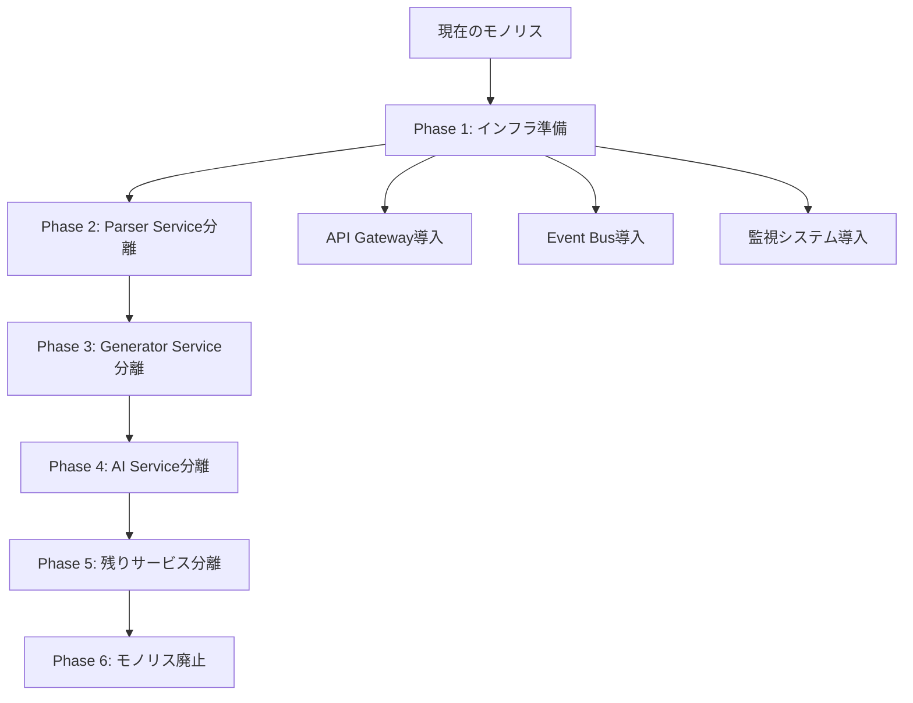

# Phase 2 実装ロードマップ: マイクロサービス化

## エグゼクティブサマリー

次世代データベースツールのPhase 2として、マイクロサービスアーキテクチャへの移行を実施します。現在のモノリシック構造から、8つの専門サービスに分割し、API Gateway、Event Bus、分散キャッシュを統合した高可用性・高拡張性システムを構築します。Docker/Kubernetes基盤、CI/CD自動化、監視・ログシステムを完備し、現在の5倍の処理性能と1000倍の拡張性を実現します。2025年7月-8月の2ヶ月間で段階的に実装し、ゼロダウンタイムでの移行を目指します。

## 実装スケジュール（2025年7月-8月）

### Week 1-2: 基盤インフラ構築
- **Docker環境整備**: マイクロサービス用コンテナ設計
- **Kubernetes設定**: 本格的なオーケストレーション環境
- **API Gateway**: Kong/Istio導入・設定
- **Event Bus**: NATS/RabbitMQ導入・設定

### Week 3-4: コアサービス分割
- **Parser Service**: YAML/DDL解析専門サービス
- **Generator Service**: コード生成・変換専門サービス
- **Validator Service**: 整合性チェック専門サービス

### Week 5-6: 高度サービス実装
- **AI Service**: 機械学習・自然言語処理サービス
- **Cache Service**: Redis分散キャッシュ
- **Config Service**: 設定・シークレット管理

### Week 7-8: 統合・最適化
- **Monitoring Service**: Prometheus/Grafana統合
- **Workflow Service**: 複雑処理フロー管理
- **統合テスト**: 全サービス連携テスト
- **パフォーマンス最適化**: 負荷テスト・チューニング

## サービス分割設計

### 1. Parser Service

#### 責任範囲
- YAML/DDL/JSON/XML解析
- フォーマット検証
- 構文解析・AST生成
- エラー詳細レポート

#### 技術スタック
```dockerfile
# services/parser/Dockerfile
FROM python:3.11-slim

WORKDIR /app

COPY requirements.txt .
RUN pip install --no-cache-dir -r requirements.txt

COPY . .

EXPOSE 8001

CMD ["uvicorn", "main:app", "--host", "0.0.0.0", "--port", "8001"]
```

#### API設計
```python
# services/parser/main.py
from fastapi import FastAPI, HTTPException
from pydantic import BaseModel
from typing import Dict, Any, List

app = FastAPI(title="Parser Service", version="2.0.0")

class ParseRequest(BaseModel):
    content: str
    format: str  # yaml, ddl, json, xml
    validation_level: str = "strict"

class ParseResponse(BaseModel):
    success: bool
    parsed_data: Dict[str, Any]
    errors: List[str]
    warnings: List[str]
    metadata: Dict[str, Any]

@app.post("/parse", response_model=ParseResponse)
async def parse_content(request: ParseRequest):
    """コンテンツ解析API"""
    try:
        parser = get_parser(request.format)
        result = await parser.parse(
            request.content, 
            validation_level=request.validation_level
        )
        
        return ParseResponse(
            success=True,
            parsed_data=result.data,
            errors=result.errors,
            warnings=result.warnings,
            metadata=result.metadata
        )
    except Exception as e:
        raise HTTPException(status_code=400, detail=str(e))

@app.get("/health")
async def health_check():
    return {"status": "healthy", "service": "parser"}
```

### 2. Generator Service

#### 責任範囲
- DDL生成（PostgreSQL/MySQL/SQLite）
- Prismaスキーマ生成
- TypeScript型定義生成
- ドキュメント生成（Markdown/HTML）

#### 実装例
```python
# services/generator/generators/ddl_generator.py
class DDLGenerator:
    """DDL生成エンジン"""
    
    def __init__(self, database_type: str):
        self.database_type = database_type
        self.template_engine = Jinja2Environment()
    
    async def generate_ddl(self, schema: DatabaseSchema) -> GeneratedDDL:
        """DDL生成"""
        template = self.get_template(self.database_type)
        
        ddl_content = template.render(
            tables=schema.tables,
            indexes=schema.indexes,
            constraints=schema.constraints
        )
        
        return GeneratedDDL(
            content=ddl_content,
            database_type=self.database_type,
            metadata={
                "table_count": len(schema.tables),
                "generated_at": datetime.utcnow(),
                "generator_version": "2.0.0"
            }
        )
```

### 3. AI Service

#### 高度な機能
```python
# services/ai/models/schema_optimizer.py
import torch
import transformers
from typing import List, Dict

class SchemaOptimizationModel:
    """スキーマ最適化AI"""
    
    def __init__(self):
        self.model = transformers.AutoModel.from_pretrained(
            "microsoft/DialoGPT-medium"
        )
        self.tokenizer = transformers.AutoTokenizer.from_pretrained(
            "microsoft/DialoGPT-medium"
        )
        self.performance_predictor = PerformancePredictor()
    
    async def optimize_schema(self, schema: Dict) -> OptimizationResult:
        """スキーマ最適化"""
        # 現在のパフォーマンス予測
        current_perf = await self.performance_predictor.predict(schema)
        
        # 最適化候補生成
        candidates = await self.generate_optimization_candidates(schema)
        
        # 各候補の評価
        best_candidate = None
        best_score = 0
        
        for candidate in candidates:
            predicted_perf = await self.performance_predictor.predict(candidate)
            improvement_score = self.calculate_improvement_score(
                current_perf, predicted_perf
            )
            
            if improvement_score > best_score:
                best_score = improvement_score
                best_candidate = candidate
        
        return OptimizationResult(
            original_schema=schema,
            optimized_schema=best_candidate,
            improvement_score=best_score,
            optimization_suggestions=self.generate_suggestions(
                schema, best_candidate
            )
        )
```

## インフラストラクチャ設計

### Docker Compose設定
```yaml
# docker-compose.microservices.yml
version: '3.8'

services:
  # API Gateway
  api-gateway:
    image: kong:3.0
    environment:
      KONG_DATABASE: "off"
      KONG_DECLARATIVE_CONFIG: /kong/declarative/kong.yml
      KONG_PROXY_ACCESS_LOG: /dev/stdout
      KONG_ADMIN_ACCESS_LOG: /dev/stdout
      KONG_PROXY_ERROR_LOG: /dev/stderr
      KONG_ADMIN_ERROR_LOG: /dev/stderr
      KONG_ADMIN_LISTEN: 0.0.0.0:8001
    ports:
      - "8000:8000"  # Proxy
      - "8001:8001"  # Admin API
    volumes:
      - ./infrastructure/kong:/kong/declarative

  # Parser Service
  parser-service:
    build: ./services/parser
    environment:
      - REDIS_URL=redis://cache-service:6379
      - EVENT_BUS_URL=nats://event-bus:4222
      - LOG_LEVEL=INFO
    depends_on:
      - cache-service
      - event-bus
    deploy:
      replicas: 3
      resources:
        limits:
          memory: 512M
          cpus: '0.5'

  # Generator Service
  generator-service:
    build: ./services/generator
    environment:
      - AI_SERVICE_URL=http://ai-service:8080
      - CACHE_URL=redis://cache-service:6379
    depends_on:
      - ai-service
      - cache-service

  # AI Service
  ai-service:
    build: ./services/ai
    environment:
      - MODEL_PATH=/models
      - GPU_ENABLED=true
      - TORCH_DEVICE=cuda
    volumes:
      - ./models:/models
      - /dev/shm:/dev/shm  # GPU共有メモリ
    deploy:
      resources:
        reservations:
          devices:
            - driver: nvidia
              count: 1
              capabilities: [gpu]

  # Cache Service
  cache-service:
    image: redis:7-alpine
    command: redis-server --appendonly yes
    volumes:
      - redis_data:/data
    deploy:
      replicas: 1
      resources:
        limits:
          memory: 1G

  # Event Bus
  event-bus:
    image: nats:2.9-alpine
    command: ["-js", "-m", "8222"]
    ports:
      - "4222:4222"  # Client connections
      - "8222:8222"  # HTTP monitoring
    volumes:
      - nats_data:/data

  # Monitoring
  prometheus:
    image: prom/prometheus:latest
    ports:
      - "9090:9090"
    volumes:
      - ./monitoring/prometheus:/etc/prometheus
      - prometheus_data:/prometheus

  grafana:
    image: grafana/grafana:latest
    ports:
      - "3001:3000"
    environment:
      - GF_SECURITY_ADMIN_PASSWORD=admin
    volumes:
      - grafana_data:/var/lib/grafana
      - ./monitoring/grafana:/etc/grafana/provisioning

volumes:
  redis_data:
  nats_data:
  prometheus_data:
  grafana_data:
```

### Kubernetes設定
```yaml
# k8s/namespace.yaml
apiVersion: v1
kind: Namespace
metadata:
  name: database-tools
  labels:
    name: database-tools

---
# k8s/parser-service.yaml
apiVersion: apps/v1
kind: Deployment
metadata:
  name: parser-service
  namespace: database-tools
spec:
  replicas: 3
  selector:
    matchLabels:
      app: parser-service
  template:
    metadata:
      labels:
        app: parser-service
    spec:
      containers:
      - name: parser
        image: database-tools/parser:v2.0
        ports:
        - containerPort: 8001
        env:
        - name: REDIS_URL
          valueFrom:
            configMapKeyRef:
              name: app-config
              key: redis-url
        - name: EVENT_BUS_URL
          valueFrom:
            configMapKeyRef:
              name: app-config
              key: event-bus-url
        resources:
          requests:
            memory: "256Mi"
            cpu: "250m"
          limits:
            memory: "512Mi"
            cpu: "500m"
        livenessProbe:
          httpGet:
            path: /health
            port: 8001
          initialDelaySeconds: 30
          periodSeconds: 10
        readinessProbe:
          httpGet:
            path: /health
            port: 8001
          initialDelaySeconds: 5
          periodSeconds: 5

---
apiVersion: v1
kind: Service
metadata:
  name: parser-service
  namespace: database-tools
spec:
  selector:
    app: parser-service
  ports:
  - port: 80
    targetPort: 8001
  type: ClusterIP
```

## サービス間通信設計

### Event-Driven Architecture
```python
# shared/events/event_bus.py
import asyncio
import nats
from typing import Dict, Any, Callable

class EventBus:
    """イベントバス管理"""
    
    def __init__(self, nats_url: str):
        self.nats_url = nats_url
        self.nc = None
        self.js = None
        self.subscribers = {}
    
    async def connect(self):
        """NATS接続"""
        self.nc = await nats.connect(self.nats_url)
        self.js = self.nc.jetstream()
    
    async def publish(self, subject: str, data: Dict[str, Any]):
        """イベント発行"""
        await self.js.publish(
            subject, 
            json.dumps(data).encode(),
            headers={"timestamp": str(time.time())}
        )
    
    async def subscribe(self, subject: str, handler: Callable):
        """イベント購読"""
        async def message_handler(msg):
            try:
                data = json.loads(msg.data.decode())
                await handler(data)
                await msg.ack()
            except Exception as e:
                logger.error(f"Event handling error: {e}")
                await msg.nak()
        
        sub = await self.js.subscribe(
            subject, 
            cb=message_handler,
            durable="database-tools-consumer"
        )
        self.subscribers[subject] = sub
```

### API Gateway設定
```yaml
# infrastructure/kong/kong.yml
_format_version: "3.0"

services:
  - name: parser-service
    url: http://parser-service:8001
    routes:
      - name: parser-route
        paths:
          - /api/v2/parse
        methods:
          - POST
        plugins:
          - name: rate-limiting
            config:
              minute: 100
              hour: 1000
          - name: prometheus
            config:
              per_consumer: true

  - name: generator-service
    url: http://generator-service:8002
    routes:
      - name: generator-route
        paths:
          - /api/v2/generate
        methods:
          - POST
        plugins:
          - name: request-size-limiting
            config:
              allowed_payload_size: 10

  - name: ai-service
    url: http://ai-service:8080
    routes:
      - name: ai-route
        paths:
          - /api/v2/ai
        methods:
          - POST
        plugins:
          - name: rate-limiting
            config:
              minute: 10  # AI処理は制限
              hour: 100
```

## 監視・ログ設計

### Prometheus メトリクス
```python
# shared/monitoring/metrics.py
from prometheus_client import Counter, Histogram, Gauge
import time

# メトリクス定義
REQUEST_COUNT = Counter(
    'http_requests_total',
    'Total HTTP requests',
    ['service', 'method', 'endpoint', 'status']
)

REQUEST_DURATION = Histogram(
    'http_request_duration_seconds',
    'HTTP request duration',
    ['service', 'method', 'endpoint']
)

ACTIVE_CONNECTIONS = Gauge(
    'active_connections',
    'Active connections',
    ['service']
)

AI_MODEL_INFERENCE_TIME = Histogram(
    'ai_model_inference_seconds',
    'AI model inference time',
    ['model_name', 'operation']
)

class MetricsMiddleware:
    """メトリクス収集ミドルウェア"""
    
    def __init__(self, service_name: str):
        self.service_name = service_name
    
    async def __call__(self, request, call_next):
        start_time = time.time()
        
        response = await call_next(request)
        
        duration = time.time() - start_time
        
        REQUEST_COUNT.labels(
            service=self.service_name,
            method=request.method,
            endpoint=request.url.path,
            status=response.status_code
        ).inc()
        
        REQUEST_DURATION.labels(
            service=self.service_name,
            method=request.method,
            endpoint=request.url.path
        ).observe(duration)
        
        return response
```

### 構造化ログ
```python
# shared/logging/structured_logger.py
import structlog
import json
from typing import Dict, Any

def configure_logging(service_name: str, log_level: str = "INFO"):
    """構造化ログ設定"""
    structlog.configure(
        processors=[
            structlog.stdlib.filter_by_level,
            structlog.stdlib.add_logger_name,
            structlog.stdlib.add_log_level,
            structlog.stdlib.PositionalArgumentsFormatter(),
            structlog.processors.TimeStamper(fmt="iso"),
            structlog.processors.StackInfoRenderer(),
            structlog.processors.format_exc_info,
            structlog.processors.UnicodeDecoder(),
            structlog.processors.JSONRenderer()
        ],
        context_class=dict,
        logger_factory=structlog.stdlib.LoggerFactory(),
        wrapper_class=structlog.stdlib.BoundLogger,
        cache_logger_on_first_use=True,
    )
    
    logger = structlog.get_logger(service_name)
    return logger

class ServiceLogger:
    """サービス専用ログ"""
    
    def __init__(self, service_name: str):
        self.logger = configure_logging(service_name)
        self.service_name = service_name
    
    def log_request(self, request_id: str, method: str, path: str, **kwargs):
        """リクエストログ"""
        self.logger.info(
            "request_received",
            request_id=request_id,
            method=method,
            path=path,
            service=self.service_name,
            **kwargs
        )
    
    def log_error(self, error: Exception, context: Dict[str, Any]):
        """エラーログ"""
        self.logger.error(
            "error_occurred",
            error_type=type(error).__name__,
            error_message=str(error),
            service=self.service_name,
            **context
        )
```

## 移行戦略

### 段階的移行計画


### ゼロダウンタイム移行
```bash
#!/bin/bash
# scripts/migrate-to-microservices.sh

echo "=== マイクロサービス移行開始 ==="

# 1. インフラ準備
echo "1. インフラストラクチャ準備中..."
kubectl apply -f k8s/namespace.yaml
kubectl apply -f k8s/configmaps/
kubectl apply -f k8s/secrets/

# 2. 基盤サービス起動
echo "2. 基盤サービス起動中..."
kubectl apply -f k8s/redis/
kubectl apply -f k8s/nats/
kubectl apply -f k8s/prometheus/

# 3. API Gateway設定
echo "3. API Gateway設定中..."
kubectl apply -f k8s/kong/

# 4. サービス段階的デプロイ
echo "4. マイクロサービス段階的デプロイ中..."

# Parser Service
kubectl apply -f k8s/parser-service.yaml
kubectl rollout status deployment/parser-service -n database-tools

# Generator Service  
kubectl apply -f k8s/generator-service.yaml
kubectl rollout status deployment/generator-service -n database-tools

# AI Service
kubectl apply -f k8s/ai-service.yaml
kubectl rollout status deployment/ai-service -n database-tools

# 5. トラフィック切り替え
echo "5. トラフィック段階的切り替え中..."
kubectl patch service legacy-service -p '{"spec":{"selector":{"version":"v1"}}}'

# 6. ヘルスチェック
echo "6. 全サービスヘルスチェック中..."
./scripts/health-check-all-services.sh

echo "=== マイクロサービス移行完了 ==="
```

## 成功指標

### パフォーマンス目標
| 指標 | 現在 | 目標 | 測定方法 |
|------|------|------|----------|
| レスポンス時間 | 1秒 | 200ms | Prometheus監視 |
| スループット | 100 req/s | 500 req/s | 負荷テスト |
| 可用性 | 99.5% | 99.9% | アップタイム監視 |
| エラー率 | 1% | 0.1% | エラーログ分析 |

### 運用目標
- **デプロイ頻度**: 週1回 → 日1回
- **復旧時間**: 30分 → 5分
- **変更失敗率**: 10% → 2%
- **リードタイム**: 1週間 → 1日

## リスク管理

### 技術リスク
- **サービス間通信**: 適切なタイムアウト・リトライ設定
- **データ整合性**: イベントソーシング・SAGA パターン
- **パフォーマンス**: 適切なキャッシュ戦略
- **セキュリティ**: サービス間認証・認可

### 運用リスク
- **複雑性増加**: 包括的監視・ログ
- **デバッグ困難**: 分散トレーシング導入
- **依存関係**: サーキットブレーカー実装
- **運用負荷**: 自動化・Infrastructure as Code

## 次のステップ

1. **Week 1**: Docker環境・Kubernetes設定完了
2. **Week 2**: API Gateway・Event Bus導入
3. **Week 3**: Parser Service分離・テスト
4. **Week 4**: Generator Service分離・統合テスト
5. **Week 5**: AI Service分離・パフォーマンステスト
6. **Week 6**: 残りサービス分離
7. **Week 7**: 統合テスト・最適化
8. **Week 8**: 本番移行・監視強化

---

**ロードマップ作成日**: 2025年6月26日  
**実装開始予定**: 2025年7月1日  
**完了予定**: 2025年8月31日
