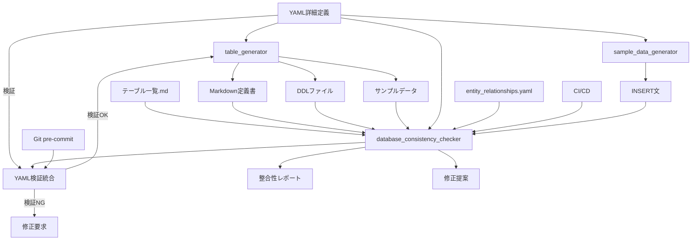

# データベース設計ツール統合パッケージ

年間スキル報告書WEB化PJTのデータベース設計・管理を効率化する統合ツールセットです。

## 🎯 概要

このツールパッケージは、YAML詳細定義からテーブル定義書・DDL・サンプルデータを自動生成し、データベース設計の整合性を保証する統合システムです。

### 主要機能

- **📝 YAML詳細定義**: 構造化されたテーブル定義の作成・管理
- **🔄 自動生成**: Markdown定義書・DDL・サンプルデータの一括生成
- **✅ 整合性チェック**: 全ファイル間の整合性検証
- **🔍 品質保証**: 命名規則・データ型・外部キー制約の検証
- **📊 レポート生成**: 整合性チェック結果の詳細レポート
- **🛡️ YAML検証**: 必須セクション・フォーマット検証
- **💾 サンプルデータ生成**: YAMLからのINSERT文自動生成

## 🏗️ アーキテクチャ

```
docs/design/database/tools/
├── 📁 shared/                    # 共通コンポーネント
│   ├── adapters/                 # アダプター層（統合・ファイルシステム）
│   ├── core/                     # コアロジック（設定・例外・ログ・モデル）
│   ├── generators/               # 生成エンジン（DDL・Markdown・サンプルデータ）
│   ├── parsers/                  # パーサー（YAML・DDL・Markdown）
│   └── utils/                    # ユーティリティ（ファイル操作）
├── 📁 table_generator/           # テーブル生成ツール
│   ├── core/                     # アダプター・ログ機能
│   ├── data/                     # Faker・YAMLデータローダー
│   ├── generators/               # 各種生成機能
│   └── utils/                    # ファイル・SQL・YAMLユーティリティ
├── 📁 database_consistency_checker/ # 整合性チェックツール（YAML検証・サンプルデータ生成統合済み）
│   ├── checkers/                 # 各種チェッカー（12種類）
│   ├── core/                     # アダプター・定義・ログ・レポート
│   ├── fixers/                   # 修正提案生成機能
│   ├── parsers/                  # 各種パーサー
│   ├── reporters/                # レポート出力（Console・JSON・Markdown）
│   ├── yaml_format_check_enhanced.py # YAML検証統合モジュール（✅ 実装済み）
│   ├── sample_data_generator.py  # サンプルデータINSERT文生成（✅ 実装済み）
│   ├── install_git_hook.sh       # Git pre-commitフック（統合版）
│   └── utils/                    # レポート管理
├── 📁 tests/                     # テストスイート
│   ├── unit/                     # ユニットテスト
│   ├── integration/              # 統合テスト
│   ├── performance/              # パフォーマンステスト
│   └── fixtures/                 # テストデータ
└── 📄 run_tests.py              # 統合テストランナー
```

### ツール間の関係性



## 🚀 クイックスタート

### 1. 環境セットアップ

```bash
# 作業ディレクトリに移動
cd ~/skill-report-web/docs/design/database/tools

# Python環境確認
python3 --version  # Python 3.7以上が必要

# 必要パッケージのインストール
pip3 install PyYAML faker psutil

# Git pre-commitフック設定（推奨）
cd database_consistency_checker
./install_git_hook.sh
cd ..
```

### 2. 基本的な使用方法

#### 新規テーブル作成の完全ワークフロー

```bash
# Step 1: テンプレートファイルをコピー（必須）
cp docs/design/database/table-details/MST_TEMPLATE_details.yaml \
   docs/design/database/table-details/MST_NewTable_details.yaml

# Step 2: YAML詳細定義を編集
# - table_name: "MST_NewTable"
# - logical_name: "新規テーブル論理名"
# - category: "マスタ系" または "トランザクション系"
# - 🔴 revision_history: 改版履歴（絶対省略禁止・最低1エントリ）
# - 🔴 overview: テーブルの概要と目的（絶対省略禁止・最低50文字）
# - columns: 業務固有カラム定義
# - indexes: 必要なインデックス
# - foreign_keys: 外部キー関係
# - 🔴 notes: 特記事項・考慮点（絶対省略禁止・最低3項目）
# - 🔴 business_rules: 業務ルール・制約（絶対省略禁止・最低3項目）
# - sample_data: サンプルデータ

# Step 3: YAML検証（必須）
python3 database_consistency_checker/yaml_format_check_enhanced.py --tables MST_NewTable --verbose

# Step 4: テーブル一覧.md更新
# 新規テーブルをテーブル一覧に追加

# Step 5: 自動生成実行
python3 -m table_generator --table MST_NewTable --verbose

# Step 6: サンプルデータINSERT文生成
python3 database_consistency_checker/sample_data_generator.py --tables MST_NewTable --verbose

# Step 7: 整合性チェック
python3 database_consistency_checker/run_check.py --tables MST_NewTable --verbose
```

#### 日常的な使用パターン

```bash
# 複数テーブル一括生成
python3 -m table_generator --table MST_Employee,MST_Department,MST_Position --verbose

# カテゴリ別生成
python3 -m table_generator --table MST_* --verbose

# 全体整合性チェック（推奨：週次実行）
python3 database_consistency_checker/run_check.py --verbose --output-format markdown --output-file weekly_report.md

# YAML検証（全テーブル）
python3 database_consistency_checker/yaml_format_check_enhanced.py --verbose

# 必須セクション検証のみ（基本検証）
python3 database_consistency_checker/yaml_format_check_enhanced.py --all --verbose

# YAML検証を含む整合性チェック（統合版）
python3 database_consistency_checker/run_check.py --include-yaml-validation --verbose

# サンプルデータ生成（全テーブル）
python3 database_consistency_checker/sample_data_generator.py --verbose
```

## 📋 YAML詳細定義の作成

### 基本構造とテンプレート

**重要**: 全てのテーブル定義は `docs/design/database/table-details/MST_TEMPLATE_details.yaml` をベースとして作成してください。

#### テンプレートファイルの使用方法

```bash
# 1. テンプレートファイルをコピー（必須）
cp docs/design/database/table-details/MST_TEMPLATE_details.yaml \
   docs/design/database/table-details/{テーブル名}_details.yaml

# 2. コピーしたファイルを編集
# - [テンプレート項目]を実際の値に置き換え
# - 🔴 必須セクション（revision_history、overview、notes、business_rules）は絶対省略禁止
# - 業務要件に応じてカラムやインデックスを追加

# 3. YAML検証実行（必須）
python3 database_consistency_checker/yaml_format_check_enhanced.py --tables {テーブル名} --verbose
```

### 🚨 必須セクション - 省略禁止

以下の4つのセクションは品質管理・監査・運用保守の観点から**いかなる場合も省略禁止**です：

| セクション | 目的 | 最低要件 | 省略時のリスク |
|------------|------|----------|----------------|
| 🔴 `revision_history` | 変更履歴の追跡・監査証跡 | 最低1エントリ必須 | 監査不能、変更管理の崩壊 |
| 🔴 `overview` | テーブルの目的・設計意図の明確化 | 最低50文字以上 | 設計意図の喪失、誤用 |
| 🔴 `notes` | 運用・保守に必要な特記事項 | 最低3項目以上 | 運用障害、保守困難化 |
| 🔴 `business_rules` | 業務ルール・制約の明文化 | 最低3項目以上 | 要件逸脱、整合性喪失 |

**検証方法**:
```bash
# 必須セクション検証（全テーブル）
python3 database_consistency_checker/yaml_format_check_enhanced.py --all --verbose

# 特定テーブルの必須セクション検証
python3 database_consistency_checker/yaml_format_check_enhanced.py --table MST_Employee --verbose

# 必須セクション不備の詳細確認
python3 database_consistency_checker/yaml_format_check_enhanced.py --check-required-only
```

#### MST_TEMPLATE_details.yamlの構造

```yaml
# table-details/{テーブル名}_details.yaml
table_name: "MST_Employee"
logical_name: "社員基本情報"
category: "マスタ系"

# 改版履歴
revision_history:
  - version: "1.0.0"
    date: "2025-06-01"
    author: "開発チーム"
    changes: "初版作成 - MST_Employeeの詳細定義"

# テーブル概要・目的
overview: |
  社員の基本情報を管理するマスタテーブル
  
  主な目的：
  - 社員の個人情報管理
  - 組織構造の管理
  - 認証・権限管理の基盤

# 業務カラム定義
columns:
  - name: "id"
    type: "VARCHAR(50)"
    nullable: false
    primary_key: true
    comment: "プライマリキー（UUID）"
    requirement_id: "PLT.1-WEB.1"
  
  - name: "tenant_id"
    type: "VARCHAR(50)"
    nullable: false
    comment: "マルチテナント識別子"
    requirement_id: "TNT.1-MGMT.1"
    
  - name: "emp_no"
    type: "VARCHAR(20)"
    nullable: false
    comment: "社員番号"
    requirement_id: "PRO.1-BASE.1"
    
  - name: "name"
    type: "VARCHAR(100)"
    nullable: false
    comment: "氏名"
    requirement_id: "PRO.1-BASE.1"

# インデックス定義
indexes:
  - name: "idx_employee_tenant"
    columns: ["tenant_id"]
    unique: false
    comment: "テナント別検索用インデックス"
    
  - name: "idx_employee_emp_no"
    columns: ["tenant_id", "emp_no"]
    unique: true
    comment: "テナント内社員番号一意制約"

# 外部キー制約
foreign_keys:
  - name: "fk_employee_tenant"
    columns: ["tenant_id"]
    references:
      table: "MST_Tenant"
      columns: ["id"]
    on_update: "CASCADE"
    on_delete: "RESTRICT"
    comment: "テナント参照制約"

# サンプルデータ
sample_data:
  - emp_no: "EMP001"
    name: "山田太郎"
    email: "yamada@example.com"
    dept_id: "DEPT001"
  - emp_no: "EMP002"
    name: "佐藤花子"
    email: "sato@example.com"
    dept_id: "DEPT002"
```

### テーブル命名規則

| プレフィックス | 用途 | 例 | パフォーマンス要件 |
|---|---|---|---|
| **MST_** | マスタ系テーブル | MST_Employee, MST_Department | 高速参照重視（5-10ms以内） |
| **TRN_** | トランザクション系テーブル | TRN_SkillRecord, TRN_GoalProgress | バランス重視（15-50ms以内） |
| **HIS_** | 履歴系テーブル | HIS_AuditLog, HIS_OperationHistory | 書き込み重視、参照は低頻度 |
| **SYS_** | システム系テーブル | SYS_SkillMatrix, SYS_SystemLog | 書き込み重視、参照は許容範囲 |
| **WRK_** | ワーク系テーブル | WRK_BulkJobLog, WRK_BatchWork | 処理効率重視 |
| **IF_** | インターフェイス系テーブル | IF_ExternalSync, IF_ImportExport | 外部連携・インポート/エクスポート用 |

## 🔧 テーブル生成ツール（table_generator）

### 主要機能

- **YAML解析・検証**: 構文チェック・必須項目確認
- **Markdown定義書生成**: 業務仕様書形式での出力
- **PostgreSQL DDL生成**: CREATE TABLE、インデックス、外部キー制約
- **サンプルデータ生成**: テスト用INSERT文の自動生成
- **共通カラム自動追加**: created_at, updated_at, is_deleted等

### 使用方法

#### 基本的な使用

```bash
# 全テーブル生成
python3 -m table_generator

# 個別テーブル生成
python3 -m table_generator --table MST_Employee

# 複数テーブル生成
python3 -m table_generator --table MST_Role,MST_Permission

# カテゴリ別生成（ワイルドカード使用）
python3 -m table_generator --table MST_* --verbose
```

#### 高度なオプション

```bash
# 出力先ディレクトリ指定
python3 -m table_generator --table MST_Employee --output-dir custom/

# ベースディレクトリ指定
python3 -m table_generator --base-dir ~/custom/database/

# ドライラン（ファイルを実際には作成しない）
python3 -m table_generator --dry-run --verbose

# 詳細ログ出力
python3 -m table_generator --table MST_Employee --verbose

# カラー出力無効
python3 -m table_generator --no-color
```

#### 特定フォーマットのみ生成

```bash
# DDLファイルのみ生成
python3 -m table_generator --table MST_Employee --ddl-only

# Markdown定義書のみ生成
python3 -m table_generator --table MST_Employee --markdown-only

# サンプルデータのみ生成
python3 -m table_generator --table MST_Employee --data-only
```

### 生成される出力ファイル

#### 1. テーブル定義書 (Markdown)
- **場所**: `../tables/`
- **形式**: `テーブル定義書_{テーブル名}_{論理名}.md`
- **内容**: 
  - テーブル概要・目的
  - カラム定義（業務カラム + 共通カラム）
  - インデックス定義・設計根拠
  - 外部キー制約・参照関係
  - 制約条件・ビジネスルール

#### 2. DDLファイル (SQL)
- **場所**: `../ddl/`
- **形式**: `{テーブル名}.sql`
- **内容**:
  - DROP TABLE文（IF EXISTS）
  - CREATE TABLE文（文字セット・照合順序設定）
  - インデックス作成文（通常・ユニーク）
  - 外部キー制約（CASCADE/RESTRICT設定）
  - 初期データINSERT文

#### 3. サンプルデータ (SQL)
- **場所**: `../data/`
- **形式**: `{テーブル名}_sample_data.sql`
- **内容**:
  - INSERT文（データ型に応じた値フォーマット）
  - 実行確認用SELECT文
  - データ整合性確認クエリ

### DDL生成機能の詳細

#### PostgreSQL対応機能
- **データ型マッピング**: VARCHAR, INTEGER, TIMESTAMP, BOOLEAN等
- **制約生成**: PRIMARY KEY, UNIQUE, NOT NULL, CHECK制約
- **インデックス**: B-tree, Hash, GIN, GiSTインデックス対応
- **外部キー**: CASCADE, RESTRICT, SET NULL, SET DEFAULT対応
- **文字セット**: UTF8, 照合順序ja_JP.UTF-8対応

#### 共通カラム自動生成
```sql
-- 全テーブルに自動追加される共通カラム
created_at TIMESTAMP DEFAULT CURRENT_TIMESTAMP COMMENT '作成日時',
updated_at TIMESTAMP DEFAULT CURRENT_TIMESTAMP ON UPDATE CURRENT_TIMESTAMP COMMENT '更新日時',
is_deleted BOOLEAN DEFAULT FALSE COMMENT '論理削除フラグ',
created_by VARCHAR(50) COMMENT '作成者',
updated_by VARCHAR(50) COMMENT '更新者'
```

## ✅ 整合性チェックツール（database_consistency_checker）

### 主要機能

データベース設計ドキュメント間の整合性をチェックし、品質保証を行うツールです。

#### チェック対象ファイル
1. **テーブル一覧.md** (手動作成)
2. **entity_relationships.yaml** (手動作成)
3. **テーブル定義詳細YAML** (手動作成)
4. **テーブル定義書** (自動作成) ⚠️ **手動編集禁止**
5. **DDL** (自動作成) ⚠️ **手動編集禁止**
6. **INSERT文** (自動作成) ⚠️ **手動編集禁止**

### ⚠️ 重要な注意事項

#### 手動編集禁止ファイル

以下のファイルは**自動生成されるため、手動での編集は絶対に禁止**です：

- **テーブル定義書** (`tables/テーブル定義書_*.md`)
- **DDLファイル** (`ddl/*.sql`)
- **INSERT文** (`data/*_sample_data.sql`)

これらのファイルを手動で編集した場合：
- 🚨 次回の自動生成時に変更が上書きされます
- 🚨 データベース設計の整合性が保てなくなります
- 🚨 チーム開発での混乱を招きます

**変更が必要な場合は、必ず手動作成ファイル（テーブル一覧.md、entity_relationships.yaml、テーブル定義詳細YAML）を修正してから自動生成を実行してください。**

### 実装済みチェック機能

#### ✅ 基本整合性チェック
- **テーブル存在整合性チェック**: 全ソース間でのテーブル定義一致
- **孤立ファイル検出**: 未使用・重複ファイルの特定
- **カラム定義整合性チェック**: YAML ↔ DDL ↔ 定義書の整合性
- **外部キー整合性チェック**: 参照関係の妥当性チェック

#### ✅ データ型整合性チェック (v1.2.0で追加)
- DDLとYAML間のデータ型完全一致・互換性チェック
- 長さ制約の比較（VARCHAR(50) vs VARCHAR(100)等）
- NULL制約の整合性（NOT NULL vs NULL許可）
- デフォルト値の比較
- ENUM値の整合性

#### ✅ YAMLフォーマット整合性チェック (v1.3.0で追加)
- テーブル定義詳細YAMLファイルの標準テンプレート準拠確認
- 必須フィールドの存在チェック
- データ型・制約の妥当性検証
- YAMLフォーマット・構造の検証
- **yaml_validator統合**: 必須セクション検証の統合実行

#### ✅ 制約整合性チェック (v1.5.0で追加)
- PRIMARY KEY制約の整合性確認（DDL vs YAML）
- UNIQUE制約の整合性確認
- CHECK制約の整合性確認
- インデックス定義の整合性確認（名前、カラム、ユニーク性）
- 外部キー制約の詳細確認（ON UPDATE/DELETE動作）

#### ✅ 修正提案機能 (v1.5.0で追加)
- 検出された問題に対する具体的な修正方法の提案
- テーブル一覧.mdへの不足テーブル追加提案
- 外部キー参照先カラム名の修正提案
- ON DELETE/UPDATE設定の統一提案
- DDL修正コマンドの自動生成
- YAML修正内容の提案

#### ✅ レポート出力管理機能 (v1.1.0で追加)
- タイムスタンプ付きファイル名でユニーク性担保
- 最新レポートへの自動リンク作成
- 古いレポートの自動クリーンアップ
- レポート統計情報の取得

### 使用方法

#### 基本的な使用方法

```bash
# 全チェック実行（推奨）
python3 database_consistency_checker/run_check.py --verbose

# 特定のテーブルのみチェック
python3 database_consistency_checker/run_check.py --tables MST_Employee,MST_Department

# 詳細ログ付きでチェック
python3 database_consistency_checker/run_check.py --verbose
```

#### 出力形式の指定

```bash
# Markdown形式で出力（推奨）
python3 database_consistency_checker/run_check.py --output-format markdown --output-file report.md

# JSON形式で出力（プログラム処理用）
python3 database_consistency_checker/run_check.py --output-format json --output-file report.json

# コンソール出力（デフォルト）
python3 database_consistency_checker/run_check.py --output-format console
```

#### 特定のチェックのみ実行

```bash
# テーブル存在チェックのみ
python3 database_consistency_checker/run_check.py --checks table_existence

# 孤立ファイルチェックのみ
python3 database_consistency_checker/run_check.py --checks orphaned_files

# カラム整合性チェックのみ
python3 database_consistency_checker/run_check.py --checks column_consistency

# 外部キー整合性チェックのみ
python3 database_consistency_checker/run_check.py --checks foreign_key_consistency

# データ型整合性チェックのみ
python3 database_consistency_checker/run_check.py --checks data_type_consistency

# YAMLフォーマット整合性チェックのみ
python3 database_consistency_checker/run_check.py --checks yaml_format

# 複数のチェックを指定
python3 database_consistency_checker/run_check.py --checks table_existence,column_consistency,foreign_key_consistency
```

#### YAML検証統合機能 (v1.3.0で追加)

```bash
# YAML検証を含む全チェック実行
python3 database_consistency_checker/run_check.py --include-yaml-validation --verbose

# YAML検証のみ実行（database_consistency_checker経由）
python3 database_consistency_checker/run_check.py --checks yaml_format --verbose

# 必須セクション検証を含む統合チェック
python3 database_consistency_checker/run_check.py --include-yaml-validation --check-required-sections --verbose
```

### チェック項目詳細

#### 1. テーブル存在整合性チェック

各テーブルが以下の全てのソースに存在するかをチェックします：

- テーブル一覧.md
- entity_relationships.yaml
- DDLファイル
- テーブル詳細定義ファイル

**エラー例：**
- ❌ テーブル一覧.mdに定義されていません
- ❌ DDLファイルが存在しません

**警告例：**
- ⚠️ エンティティ関連定義に存在しません
- ⚠️ テーブル詳細定義ファイルが存在しません

#### 2. データ型整合性チェック

DDLファイルとYAML詳細定義間のデータ型整合性をチェックします：

**チェック項目：**
- データ型の完全一致・互換性チェック
- 長さ制約の比較（VARCHAR(50) vs VARCHAR(100)等）
- NULL制約の整合性（NOT NULL vs NULL許可）
- デフォルト値の比較
- ENUM値の整合性

**エラー例：**
- ❌ カラム 'name' のデータ型が一致しません: DDL(VARCHAR(100)) ≠ YAML(VARCHAR(50))
- ❌ カラム 'status' のENUM値が一致しません
- ❌ カラム 'age' の長さ制約が一致しません

**警告例：**
- ⚠️ カラム 'description' のデータ型が互換性のある型で異なります: DDL(TEXT) vs YAML(VARCHAR)
- ⚠️ カラム 'is_active' のNULL制約が一致しません
- ⚠️ カラム 'created_at' のデフォルト値が一致しません

**成功例：**
- ✅ カラム 'id' のデータ型整合性OK: VARCHAR(50)
- ✅ MST_Employee: データ型整合性チェック完了 (12カラム確認済み)

#### 3. 外部キー整合性チェック

外部キー制約の妥当性をチェックします：

**チェック項目：**
- 参照先テーブルの存在確認
- 参照先カラムのデータ型一致確認
- CASCADE/RESTRICT設定の妥当性確認

**エラー例：**
- ❌ 参照先テーブル 'MST_Department' が存在しません
- ❌ 参照先カラムのデータ型が一致しません
- ❌ CASCADE設定により意図しないデータ削除の可能性

**警告例：**
- ⚠️ 外部キー制約名が命名規則に従っていません
- ⚠️ ON DELETE/UPDATE設定が統一されていません

**成功例：**
- ✅ 外部キー 'fk_employee_department' の整合性OK
- ✅ MST_Employee: 外部キー整合性チェック完了 (3制約確認済み)

### 📊 サンプルデータINSERT文生成ツール

テーブル詳細定義YAMLファイルの`sample_data`セクションを使用して、PostgreSQL用のINSERT文を自動生成するツールです。

#### 主要機能

- **YAML解析**: `sample_data`セクションからINSERT文を生成
- **共通カラム自動補完**: id, created_at, updated_at, is_deleted等の自動設定
- **複数テーブル対応**: 一括処理と個別処理の両方をサポート
- **統合ファイル出力**: 全テーブルのINSERT文をまとめたファイル生成
- **データ型対応**: PostgreSQL対応の適切な値フォーマット
- **詳細ログ**: 処理状況とエラーの詳細出力

#### 使用方法

##### 基本的な使用方法

```bash
# 全テーブルのサンプルデータINSERT文を生成
python3 database_consistency_checker/sample_data_generator.py

# 詳細ログ付きで実行
python3 database_consistency_checker/sample_data_generator.py --verbose

# 特定のテーブルのみ生成
python3 database_consistency_checker/sample_data_generator.py --tables MST_Employee

# 複数テーブルを指定
python3 database_consistency_checker/sample_data_generator.py --tables MST_Employee,MST_Department --verbose

# 検証機能付きで実行（利用可能な場合）
python3 database_consistency_checker/sample_data_generator.py --validate --verbose
```

##### コマンドラインオプション

| オプション | 説明 | 例 |
|------------|------|-----|
| `--tables` | 対象テーブルをカンマ区切りで指定 | `--tables MST_Employee,MST_Department` |
| `--verbose` | 詳細なログを出力 | `--verbose` |
| `--validate` | 検証機能も同時実行（利用可能な場合） | `--validate` |

#### 出力ファイル

##### 個別ファイル
- **場所**: `docs/design/database/data/sample_data_{テーブル名}.sql`
- **内容**: 各テーブル専用のINSERT文

##### 統合ファイル
- **場所**: `docs/design/database/data/sample_data_all.sql`
- **内容**: 全テーブルのINSERT文をまとめたファイル

#### YAMLファイルの要件

##### 必須セクション
- `sample_data`: サンプルデータの配列
- `columns` または `business_columns`: カラム定義

##### sample_dataの形式
```yaml
sample_data:
  - id: "emp_001"
    employee_code: "EMP000001"
    full_name: "山田太郎"
    email: "yamada.taro@example.com"
    # その他のカラム...
  
  - id: "emp_002"
    employee_code: "EMP000002"
    full_name: "佐藤花子"
    email: "sato.hanako@example.com"
    # その他のカラム...
```

#### 自動補完される共通カラム

以下のカラムは`sample_data`に含まれていない場合、自動的に補完されます：

| カラム | 自動設定値 | 説明 |
|--------|------------|------|
| `id` | `{テーブル接頭辞}_{UUID8桁}` | プライマリキー |
| `created_at` | `CURRENT_TIMESTAMP` | 作成日時 |
| `updated_at` | `CURRENT_TIMESTAMP` | 更新日時 |
| `is_deleted` | `FALSE` | 論理削除フラグ |

#### データ型別フォーマット

| データ型 | フォーマット | 例 |
|----------|--------------|-----|
| VARCHAR, TEXT, CHAR | シングルクォートで囲む | `'山田太郎'` |
| INTEGER, BIGINT, DECIMAL, FLOAT | 数値のまま | `123`, `45.67` |
| BOOLEAN | TRUE/FALSE | `TRUE`, `FALSE` |
| DATE, DATETIME, TIMESTAMP | シングルクォートで囲む | `'2020-04-01'` |
| NULL値 | NULL | `NULL` |

#### 実行例

##### 単一テーブルの生成
```bash
$ python3 database_consistency_checker/sample_data_generator.py --tables MST_Employee --verbose

テーブル MST_Employee のサンプルデータ処理を開始...
✓ テーブル MST_Employee: 2件のINSERT文を生成しました
✓ ファイル出力: /path/to/sample_data_MST_Employee.sql
✓ 統合ファイル出力: /path/to/sample_data_all.sql

=== サンプルデータINSERT文生成結果 ===
対象テーブル数: 1
生成成功テーブル数: 1
総レコード数: 2
エラー数: 0
```

##### 全テーブルの生成
```bash
$ python3 database_consistency_checker/sample_data_generator.py --verbose

# 51テーブルの処理結果...

=== サンプルデータINSERT文生成結果 ===
対象テーブル数: 51
生成成功テーブル数: 51
総レコード数: 137
エラー数: 0
```

#### 生成されるINSERT文の例

```sql
-- サンプルデータ INSERT文: MST_Employee
-- 生成日時: 2025-06-20 00:14:17
-- レコード数: 2

INSERT INTO MST_Employee (id, employee_code, full_name, full_name_kana, email, phone, hire_date, birth_date, gender, department_id, position_id, job_type_id, employment_status, manager_id, employee_status, is_deleted, created_at, updated_at) VALUES ('emp_001', 'EMP000001', '山田太郎', 'ヤマダタロウ', 'yamada.taro@example.com', '090-1234-5678', '2020-04-01', '1990-01-15', 'M', 'dept_001', 'pos_003', 'job_001', 'FULL_TIME', 'emp_002', 'ACTIVE', FALSE, CURRENT_TIMESTAMP, CURRENT_TIMESTAMP);

INSERT INTO MST_Employee (id, employee_code, full_name, full_name_kana, email, phone, hire_date, birth_date, gender, department_id, position_id, job_type_id, employment_status, manager_id, employee_status, is_deleted, created_at, updated_at) VALUES ('emp_002', 'EMP000002', '佐藤花子', 'サトウハナコ', 'sato.hanako@example.com', '090-2345-6789', '2018-04-01', '1985-03-20', 'F', 'dept_001', 'pos_002', 'job_001', 'FULL_TIME', NULL, 'ACTIVE', FALSE, CURRENT_TIMESTAMP, CURRENT_TIMESTAMP);

-- MST_Employee サンプルデータ終了
```

#### エラーハンドリング

##### よくあるエラーと対処法

###### 1. YAMLファイルが存在しない
```
❌ ファイル /path/to/MST_Table_details.yaml が存在しません
```
**対処法**: 指定したテーブル名のYAMLファイルが存在するか確認してください。

###### 2. sample_dataセクションが存在しない
```
⚠️ テーブル MST_Table: sample_dataセクションが存在しません
```
**対処法**: YAMLファイルに`sample_data`セクションを追加してください。

###### 3. カラム定義が存在しない
```
❌ テーブル MST_Table: カラム定義が存在しません
```
**対処法**: YAMLファイルに`columns`または`business_columns`セクションを追加してください。

#### 統合機能

##### database_consistency_checkerとの連携
このツールは`database_consistency_checker`パッケージの一部として動作し、他の検証ツールと連携できます。

##### 検証機能付き実行
`--validate`オプションを使用すると、sample_dataの品質検証も同時に実行されます（検証モジュールが利用可能な場合）。

#### 開発者向け情報

##### 主要な関数

| 関数名 | 説明 |
|--------|------|
| `generate_sample_data_sql()` | メイン生成関数 |
| `generate_insert_statements()` | 個別テーブルのINSERT文生成 |
| `format_value_for_sql()` | 値のSQL用フォーマット |
| `load_yaml_file()` | YAMLファイル読み込み |

##### 拡張ポイント
- 新しいデータ型のサポート追加
- カスタムフォーマット関数の追加
- 検証ルールの拡張

## 🛡️ YAML検証ツール（database_consistency_checker統合）

### 主要機能

YAML詳細定義ファイルの品質保証を行う統合ツールです。database_consistency_checkerに完全統合され、包括的な検証機能を提供します。

#### 検証項目
- **必須セクション検証**: revision_history、overview、notes、business_rulesの存在・内容チェック
- **フォーマット検証**: YAML構文・構造の妥当性チェック
- **データ型検証**: カラム定義のデータ型・制約の妥当性チェック
- **命名規則検証**: テーブル名・カラム名の命名規則準拠チェック
- **要求仕様ID検証**: 全カラムの要求仕様ID設定チェック

### 統合API仕様

#### 基本検証API

##### `check_yaml_format(tables=None, verbose=False)`

**目的**: 基本的なYAMLフォーマット検証と必須セクション存在確認

**パラメータ**:
- `tables` (list, optional): 検証対象テーブル名リスト（Noneで全テーブル）
- `verbose` (bool): 詳細ログ出力フラグ

**戻り値**:
```python
{
    'success': bool,           # 全体の成功/失敗
    'total': int,             # 総テーブル数
    'valid': int,             # 検証成功テーブル数
    'invalid': int,           # 検証失敗テーブル数
    'results': [              # 個別テーブル結果
        {
            'valid': bool,        # 検証結果
            'file': str,          # YAMLファイルパス
            'table': str,         # テーブル名
            'errors': list        # エラーメッセージリスト
        }
    ]
}
```

**使用例**:
```python
from database_consistency_checker.yaml_format_check_enhanced import check_yaml_format

# 全テーブル検証
result = check_yaml_format(verbose=True)

# 特定テーブル検証
result = check_yaml_format(tables=['MST_Employee', 'MST_Department'])

if not result['success']:
    print(f"検証失敗: {result['invalid']}テーブル")
    for table_result in result['results']:
        if not table_result['valid']:
            print(f"- {table_result['table']}: {table_result['errors']}")
```

#### 拡張検証API

##### `check_yaml_format_enhanced(tables=None, verbose=False)`

**目的**: 詳細なYAMLフォーマット検証・必須セクション内容検証・要求仕様ID検証

**パラメータ**:
- `tables` (list, optional): 検証対象テーブル名リスト（Noneで全テーブル）
- `verbose` (bool): 詳細ログ出力フラグ

**戻り値**:
```python
{
    'success': bool,           # 全体の成功/失敗
    'total': int,             # 総テーブル数
    'valid': int,             # 検証成功テーブル数
    'invalid': int,           # 検証失敗テーブル数
    'warning': int,           # 警告ありテーブル数
    'results': [              # 個別テーブル結果
        {
            'valid': bool,            # 検証結果
            'file': str,              # YAMLファイルパス
            'table': str,             # テーブル名
            'errors': list,           # エラーメッセージリスト
            'warnings': list,         # 警告メッセージリスト
            'required_sections': {    # 必須セクション検証結果
                'revision_history': bool,
                'overview': bool,
                'notes': bool,
                'business_rules': bool
            },
            'format_issues': list,    # フォーマット問題リスト
            'requirement_id_issues': list  # 要求仕様ID問題リスト
        }
    ],
    'summary': {              # 検証サマリー
        'critical_errors': int,       # 🔴 必須セクション不備数
        'format_errors': int,         # フォーマットエラー数
        'requirement_errors': int,    # 要求仕様IDエラー数
        'execution_time': float       # 実行時間（秒）
    }
}
```

**使用例**:
```python
from database_consistency_checker.yaml_format_check_enhanced import check_yaml_format_enhanced

# 拡張検証実行
result = check_yaml_format_enhanced(verbose=True)

# 結果分析
print(f"🔴 必須セクション不備: {result['summary']['critical_errors']}テーブル")
print(f"⚠️ フォーマット問題: {result['summary']['format_errors']}件")
print(f"📋 要求仕様ID問題: {result['summary']['requirement_errors']}件")
print(f"⏱️ 実行時間: {result['summary']['execution_time']:.2f}秒")

# 必須セクション不備の詳細確認
for table_result in result['results']:
    if not table_result['valid']:
        critical_issues = [
            section for section, valid in table_result['required_sections'].items()
            if not valid
        ]
        if critical_issues:
            print(f"🔴 {table_result['table']}: {', '.join(critical_issues)} 不備")
```

### database_consistency_checkerとの統合

#### 統合実装

database_consistency_checkerでは、YAML検証機能が以下のように統合されています：

##### 統合モジュール構成
```
database_consistency_checker/
├── __main__.py                       # メインエントリーポイント
├── yaml_format_check_enhanced.py    # YAML検証モジュール（統合版）
└── yaml_format_check_integration.py # 統合API実装
```

##### 統合API実装

`yaml_format_check_enhanced.py`では、以下の2つの主要な検証関数を提供：

```python
# 基本検証
def check_yaml_format(tables=None, verbose=False):
    """基本的なYAMLフォーマット検証と必須セクション存在確認"""
    # 実装詳細は yaml_format_check_enhanced.py を参照

# 拡張検証  
def check_yaml_format_enhanced(tables=None, verbose=False):
    """詳細なYAMLフォーマット検証・必須セクション内容検証・要求仕様ID検証"""
    # 実装詳細は yaml_format_check_enhanced.py を参照
```

##### database_consistency_checkerでの呼び出し

`__main__.py`では、以下のチェック名で統合されています：

- **`yaml_format`**: 基本的なYAMLフォーマット検証
- **`yaml_format_enhanced`**: 拡張YAML検証（必須セクション詳細・要求仕様ID検証）

### 必須セクション検証詳細

#### 🔴 絶対省略禁止セクション

以下の4つのセクションは品質管理・監査・運用保守の観点から**絶対省略禁止**です：

| セクション | 目的 | 最低要件 | 検証内容 |
|------------|------|----------|----------|
| `revision_history` | 変更履歴の追跡・監査証跡 | 最低1エントリ | リスト形式・エントリ数確認 |
| `overview` | テーブルの目的・設計意図の明確化 | 最低50文字 | 文字数・内容の妥当性 |
| `notes` | 運用・保守に必要な特記事項 | 最低3項目 | リスト形式・項目数確認 |
| `business_rules` | 業務ルール・制約の明文化 | 最低3項目 | リスト形式・項目数確認 |

#### 検証エラー例

```
🔴 MST_Employee: 必須セクション不備
  - revision_history: 最低1エントリが必要です
  - overview: 最低50文字以上の説明が必要です (現在: 25文字)
  - notes: 最低3項目以上の記載が必要です
  - business_rules: 最低3項目以上の記載が必要です
```

### 要求仕様ID検証

#### 検証対象
- **テーブルレベル**: `requirement_id`フィールド
- **カラムレベル**: 各カラムの`requirement_id`フィールド

#### 形式要件
- **パターン**: `[カテゴリ].[シリーズ]-[機能].[番号]`
- **例**: `PRO.1-BASE.1`, `SKL.2-HIER.3`, `ACC.1-AUTH.2`

#### 有効なカテゴリ
- **PLT**: Platform (システム基盤要件)
- **ACC**: Access Control (ユーザー権限管理)
- **PRO**: Profile (個人プロフィール管理)
- **SKL**: Skill (スキル情報管理)
- **CAR**: Career (目標・キャリア管理)
- **WPM**: Work Performance Mgmt (作業実績管理)
- **TRN**: Training (研修・セミナー管理)
- **RPT**: Report (レポート出力)
- **NTF**: Notification (通知・連携サービス)

#### 検証エラー例

```
⚠️ MST_Employee: 要求仕様ID問題
  - カラム employee_code: 要求仕様ID未設定
  - カラム full_name: 要求仕様ID形式エラー (PRO-BASE-1)
  - カラム email: 要求仕様ID形式エラー (ACC.AUTH.1)
```

### 使用方法

#### 基本的な使用方法

```bash
# 全テーブルのYAML検証
python3 database_consistency_checker/yaml_format_check_enhanced.py --all --verbose

# 特定テーブルのYAML検証
python3 database_consistency_checker/yaml_format_check_enhanced.py --table MST_Employee --verbose

# 複数テーブル指定
python3 database_consistency_checker/yaml_format_check_enhanced.py --tables MST_Employee,MST_Department --verbose

# YAML検証とサンプルデータ生成の統合実行
python3 database_consistency_checker/yaml_format_check_enhanced.py --all --generate-sample-data --output-dir ./sample_data --verbose
```

#### 統合コマンド実行例

```bash
# 基本的なYAML検証
cd docs/design/database/tools
python3 -m database_consistency_checker --checks yaml_format --tables MST_Employee

# 拡張YAML検証
python3 -m database_consistency_checker --checks yaml_format_enhanced --tables MST_Employee

# 詳細ログ付きでYAML検証
python3 -m database_consistency_checker --checks yaml_format --verbose

# 複数テーブルの検証
python3 -m database_consistency_checker --checks yaml_format --tables MST_Employee,MST_Department

# 全テーブルの拡張検証
python3 -m database_consistency_checker --checks yaml_format_enhanced --verbose

# 直接実行（スタンドアロン）
python3 database_consistency_checker/yaml_format_check.py --tables MST_Employee --verbose
```

#### YAML検証統合機能

```bash
# YAML検証を含む全チェック実行
python3 database_consistency_checker/run_check.py --include-yaml-validation --verbose

# YAML検証のみ実行（database_consistency_checker経由）
python3 database_consistency_checker/run_check.py --checks yaml_format --verbose

# 必須セクション検証を含む統合チェック
python3 database_consistency_checker/run_check.py --include-yaml-validation --check-required-sections --verbose
```

### 検証結果の例

#### 成功例
```
✅ MST_Employee: 必須セクション検証完了
✅ MST_Employee: フォーマット検証完了
✅ MST_Employee: データ型検証完了
✅ MST_Employee: 命名規則検証完了
```

#### 失敗例
```
以下のテーブルの検証に失敗しました:
  - MST_Employee
    🔴 revision_history（絶対省略禁止）
    🔴 overview（絶対省略禁止）
    - カラム employee_code: 要求仕様ID未設定

詳細なガイドラインは docs/design/database/tools/yaml_validator/README_REQUIRED_SECTIONS.md を参照してください。

=== データベース整合性チェック結果 ===
総チェック数: 1
成功: 0
失敗: 1
警告: 0

❌ 整合性エラーが検出されました
```

## 📋 Git統合・pre-commitフック

### pre-commitフック設定

YAML検証を自動化するためのGit pre-commitフック機能を提供します。

#### 設定方法

```bash
# Git pre-commitフック設定（推奨）
cd yaml_validator
./install_git_hook.sh
cd ..

# 設定後、コミット時に自動でYAML検証が実行されます
git add .
git commit -m "feat: 新規テーブル追加"
# → 自動的にYAML検証が実行される
```

### フック動作

#### 動作概要
- **コミット前**: 変更されたYAMLファイルの自動検証
- **検証失敗**: コミット拒否・エラー詳細表示
- **検証成功**: 正常コミット実行

#### フック設定例

```bash
#!/bin/sh
# Git pre-commit hook for YAML validation

# 変更されたYAMLファイルを取得
changed_yaml_files=$(git diff --cached --name-only --diff-filter=ACM | grep "_details\.yaml$")

if [ -n "$changed_yaml_files" ]; then
    echo "🔍 YAML検証を実行中..."
    
    # テーブル名を抽出
    tables=""
    for file in $changed_yaml_files; do
        table_name=$(basename "$file" "_details.yaml")
        if [ "$table_name" != "MST_TEMPLATE" ]; then
            if [ -z "$tables" ]; then
                tables="$table_name"
            else
                tables="$tables,$table_name"
            fi
        fi
    done
    
    if [ -n "$tables" ]; then
        # YAML検証実行
        python docs/design/database/tools/database_consistency_checker/yaml_format_check.py --tables "$tables"
        
        if [ $? -ne 0 ]; then
            echo "❌ YAML検証に失敗しました。コミットを中止します。"
            echo "詳細は docs/design/database/tools/yaml_validator/README_REQUIRED_SECTIONS.md を参照してください。"
            exit 1
        fi
        
        echo "✅ YAML検証に成功しました。"
    fi
fi

exit 0
```

## 🚀 運用ガイドライン

### 日常的な使用

#### 1. 新規テーブル作成時
```bash
# 1. テンプレートからYAML作成
cp docs/design/database/table-details/MST_TEMPLATE_details.yaml \
   docs/design/database/table-details/NEW_TABLE_details.yaml

# 2. 必須セクション編集
# - revision_history: 初版エントリ追加
# - overview: テーブルの目的・概要記述（50文字以上）
# - notes: 運用・保守の特記事項（3項目以上）
# - business_rules: 業務ルール・制約（3項目以上）

# 3. YAML検証実行
python docs/design/database/tools/database_consistency_checker/yaml_format_check.py --tables NEW_TABLE --verbose

# 4. 拡張検証実行
python -c "
from docs.design.database.tools.database_consistency_checker.yaml_format_check import check_yaml_format_enhanced
result = check_yaml_format_enhanced(tables=['NEW_TABLE'], verbose=True)
print(f'検証結果: {\"成功\" if result[\"success\"] else \"失敗\"}')
"
```

#### 2. 既存テーブル修正時
```bash
# 1. 修正前の検証
python docs/design/database/tools/database_consistency_checker/yaml_format_check.py --tables MODIFIED_TABLE

# 2. YAML修正
# - revision_history: 新しい変更エントリ追加
# - 必要に応じて他のセクションも更新

# 3. 修正後の検証
python docs/design/database/tools/database_consistency_checker/yaml_format_check.py --tables MODIFIED_TABLE --verbose

# 4. 統合整合性チェック
python -m database_consistency_checker --tables MODIFIED_TABLE
```

#### 3. 定期的な全体検証
```bash
# 週次: 全テーブルの基本検証
python docs/design/database/tools/database_consistency_checker/yaml_format_check.py --verbose

# 月次: 拡張検証・詳細レポート
python -c "
from docs.design.database.tools.database_consistency_checker.yaml_format_check import check_yaml_format_enhanced
import json
result = check_yaml_format_enhanced(verbose=True)
with open('yaml_validation_report.json', 'w', encoding='utf-8') as f:
    json.dump(result, f, ensure_ascii=False, indent=2)
print('詳細レポートを yaml_validation_report.json に出力しました')
"
```

### YAML検証特化のトラブルシューティング

#### よくあるエラーと対処法

##### 1. 必須セクション不備
```
❌ エラー: 必須セクション 'revision_history' が存在しません
```

**対処法**:
```yaml
# revision_history セクションを追加
revision_history:
  - version: "1.0.0"
    date: "2025-06-17"
    author: "開発チーム"
    changes: "初版作成"
```

##### 2. overview文字数不足
```
❌ エラー: 'overview': 最低50文字以上の説明が必要です (現在: 25文字)
```

**対処法**:
```yaml
# overview を詳細に記述
overview: |
  このテーブルは組織に所属する全社員の基本的な個人情報と組織情報を一元管理するマスタテーブルです。
  主な目的は、社員の基本情報（氏名、連絡先、入社日等）の管理、組織構造（部署、役職、上司関係）の管理、
  認証・権限管理のためのユーザー情報提供、人事システムとの連携データ基盤の提供です。
```

##### 3. 要求仕様ID形式エラー
```
❌ エラー: カラム 'employee_code' の要求仕様ID形式エラー: PRO-BASE-1
```

**対処法**:
```yaml
# 正しい形式に修正
requirement_id: "PRO.1-BASE.1"  # ドット(.)とハイフン(-)の位置に注意
```

## 🚀 今後追加すべき機能と詳細タスクリスト

### 1. **データベース移行・マイグレーション機能** 🆕

#### タスクリスト：
- [ ] **マイグレーションファイル生成器の実装**
  - YAMLの変更差分からマイグレーションSQL生成
  - バージョン管理機能
  - ロールバック機能
- [ ] **スキーマ比較ツール**
  - 現在のDBスキーマとYAML定義の差分検出
  - ALTER TABLE文の自動生成
  - 破壊的変更の警告
- [ ] **マイグレーション実行管理**
  - 実行履歴の記録
  - 依存関係の解決
  - ドライラン機能

### 2. **ビジュアル化・ドキュメント強化** 🆕

#### タスクリスト：
- [ ] **ER図自動生成機能**
  - YAMLからPlantUML/Mermaid形式のER図生成
  - SVG/PNG出力対応
  - インタラクティブなHTML版
- [ ] **データ辞書生成**
  - Excel/CSV形式での出力
  - 業務用語集との連携
  - 多言語対応（日英）
- [ ] **API仕様書連携**
  - テーブル定義とAPI仕様の相互参照
  - OpenAPI仕様との統合

### 3. **パフォーマンス最適化支援** 🆕

#### タスクリスト：
- [ ] **インデックス最適化アドバイザー**
  - クエリパターン分析
  - 推奨インデックスの提案
  - 既存インデックスの評価
- [ ] **パーティショニング設計支援**
  - データ量予測に基づく提案
  - パーティション戦略の自動生成
- [ ] **クエリ性能予測**
  - 想定クエリの実行計画シミュレーション
  - ボトルネック検出

### 4. **テストデータ生成の高度化** 🆕

#### タスクリスト：
- [ ] **リアリスティックなテストデータ生成**
  - 業務シナリオベースのデータ生成
  - 統計的分布を考慮したデータ
  - 時系列データの生成
- [ ] **データマスキング機能**
  - 本番データからのテストデータ生成
  - 個人情報の自動マスキング
  - 整合性を保持したマスキング
- [ ] **負荷テスト用データセット**
  - 大量データの効率的生成
  - パフォーマンステスト用シナリオ

### 5. **CI/CD統合の強化** 🆕

#### タスクリスト：
- [ ] **GitHub Actions統合**
  - 自動検証ワークフロー
  - PR時の差分チェック
  - 自動デプロイメント
- [ ] **Docker統合**
  - DB環境の自動構築
  - テスト環境の分離
  - コンテナ化されたツール実行
- [ ] **監視・アラート**
  - スキーマ変更の通知
  - 品質メトリクスのダッシュボード

### 6. **セキュリティ・コンプライアンス** 🆕

#### タスクリスト：
- [ ] **セキュリティ監査機能**
  - 暗号化要件のチェック
  - アクセス権限の検証
  - GDPR/個人情報保護法準拠チェック
- [ ] **監査ログ設計支援**
  - 必要な監査項目の提案
  - トリガー自動生成
  - ログローテーション設計

### 7. **マルチデータベース対応** 🆕

#### タスクリスト：
- [ ] **MySQL/MariaDB対応**
  - DDL生成の拡張
  - データ型マッピング
  - 方言の吸収
- [ ] **NoSQL統合**
  - MongoDB スキーマ生成
  - DynamoDB 設計支援
- [ ] **クロスDB移行**
  - データベース間の移行支援
  - 互換性チェック

### 8. **AI/ML統合** 🆕

#### タスクリスト：
- [ ] **スキーマ最適化AI**
  - 使用パターンからの最適化提案
  - 自動正規化/非正規化提案
- [ ] **異常検知**
  - スキーマの異常パターン検出
  - 命名規則違反の自動検出
- [ ] **自然言語からのスキーマ生成**
  - 要件文書からのテーブル設計
  - ChatGPT/Claude統合

### 9. **開発者体験（DX）の向上** 🆕

#### タスクリスト：
- [ ] **VSCode拡張機能**
  - YAML編集支援
  - リアルタイム検証
  - スニペット機能
- [ ] **Web UI**
  - ブラウザベースの管理画面
  - ビジュアルスキーマエディタ
  - コラボレーション機能
- [ ] **CLI改善**
  - インタラクティブモード
  - 自動補完
  - プログレスバー表示

### 10. **運用・保守機能** 🆕

#### タスクリスト：
- [ ] **バックアップ・リストア支援**
  - バックアップスクリプト生成
  - リストア手順書生成
  - 定期バックアップ設定
- [ ] **容量予測・管理**
  - データ増加予測
  - ストレージ最適化提案
  - アーカイブ戦略
- [ ] **ヘルスチェック**
  - DB健全性の定期チェック
  - インデックス断片化検出
  - 統計情報更新提案

## 📋 優先度別実装ロードマップ

### Phase 1（1-2ヶ月）- 基盤強化
1. マイグレーション機能の基本実装
2. ER図自動生成
3. GitHub Actions統合

### Phase 2（3-4ヶ月）- 品質向上
1. パフォーマンス最適化支援
2. セキュリティ監査機能
3. テストデータ生成の高度化

### Phase 3（5-6ヶ月）- エコシステム拡張
1. マルチデータベース対応
2. Web UI開発
3. VSCode拡張機能

### Phase 4（7-8ヶ月）- 先進機能
1. AI/ML統合
2. 高度な運用支援機能
3. エンタープライズ機能

## 🎯 各機能の期待効果

| 機能カテゴリ | 期待効果 | 対象ユーザー |
|------------|---------|------------|
| マイグレーション | 開発効率50%向上 | 開発者 |
| ビジュアル化 | ドキュメント作成時間80%削減 | 開発者・設計者 |
| パフォーマンス最適化 | クエリ性能30%改善 | DBA・開発者 |
| テストデータ生成 | テスト準備時間70%削減 | QAエンジニア |
| CI/CD統合 | デプロイ時間60%削減 | DevOpsエンジニア |
| セキュリティ | コンプライアンス対応工数50%削減 | セキュリティ担当 |

## 🔍 トラブルシューティング

### よくある問題と解決方法

#### 1. 整合性チェックエラー
```bash
# 問題: テーブル存在整合性エラー
❌ MST_Department: DDLファイルが存在しません

# 解決方法
# 1. エラー詳細確認
python3 database_consistency_checker/run_check.py --verbose --tables MST_Department

# 2. 個別ファイル確認
ls -la table-details/MST_Department_details.yaml
ls -la ddl/MST_Department.sql
ls -la tables/テーブル定義書_MST_Department_*.md

# 3. 再生成実行
python3 -m table_generator --table MST_Department --verbose

# 4. 再チェック
python3 database_consistency_checker/run_check.py --tables MST_Department
```

#### 2. DDL生成エラー
```bash
# 問題: YAML構文エラー
❌ YAML解析エラー: mapping values are not allowed here

# 解決方法
# 1. YAML構文チェック
python3 -c "import yaml; yaml.safe_load(open('table-details/MST_Employee_details.yaml'))"

# 2. インデント・構文確認
# - インデントはスペース2文字で統一
# - コロン後にスペース必須
# - 文字列は引用符で囲む

# 3. 再生成実行
python3 -m table_generator --table MST_Employee --verbose
```

#### 3. 外部キー制約エラー
```bash
# 問題: 外部キー制約違反
❌ 参照先テーブル 'MST_Department' が存在しません

# 解決方法
# 1. 参照先テーブルの存在確認
python3 database_consistency_checker/run_check.py --tables MST_Department

# 2. 参照先テーブルの生成
python3 -m table_generator --table MST_Department

# 3. 参照元テーブルの再生成
python3 -m table_generator --table MST_Employee

# 4. 外部キー整合性チェック
python3 database_consistency_checker/run_check.py --checks foreign_key_consistency
```

#### 4. パフォーマンス問題
```bash
# 問題: 応答時間が設定値を超過
⚠️ MST_Employee: SELECT応答時間 15ms > 設定値 10ms

# 解決方法
# 1. インデックス設計の見直し
# - 検索条件に使用されるカラムにインデックス追加
# - 複合インデックスの列順序最適化

# 2. クエリの最適化
# - WHERE句の条件見直し
# - JOINの最適化
# - 不要なカラムの除外

# 3. データ量の確認
# - 想定データ量との乖離確認
# - パーティショニングの検討
```

### 緊急時対応フロー
```
1. 問題発見
   ↓
2. 影響範囲特定
   - 関連テーブル・機能の確認
   - ユーザー影響度の評価
   ↓
3. 根本原因分析
   - ログ・エラーメッセージの確認
   - 設定・データの確認
   ↓
4. 応急処置
   - サービス継続のための一時対応
   - ユーザー通知
   ↓
5. 恒久対策
   - YAML修正
   - 再生成実行
   - 整合性確認
   ↓
6. 再発防止策
   - チェック項目の追加
   - 手順の見直し
   ↓
7. Git コミット
   - 修正内容の記録
   - 影響範囲の明記
```

## 📚 関連ドキュメント

### 内部ドキュメント
- **テーブル一覧**: `docs/design/database/テーブル一覧.md`
- **エンティティ関連図**: `docs/design/database/エンティティ関連図.md`
- **YAML検証詳細**: `docs/design/database/tools/yaml_validator/README.md`
- **必須セクション詳細**: `docs/design/database/tools/yaml_validator/README_REQUIRED_SECTIONS.md`
- **統合ガイド**: `docs/design/database/tools/yaml_validator/INTEGRATION.md`

### 外部参照
- **PostgreSQL公式ドキュメント**: https://www.postgresql.org/docs/
- **Prisma公式ドキュメント**: https://www.prisma.io/docs/
- **YAML仕様**: https://yaml.org/spec/

## 🤝 コントリビューション

### 開発への参加
1. Issueの作成・議論
2. Pull Requestの提出
3. コードレビュー
4. マージ・リリース

### コーディング規約
- Python: PEP 8準拠
- 型ヒント使用推奨
- docstring必須
- ユニットテスト必須

### テスト実行
```bash
# 全テスト実行
python3 run_tests.py

# 特定のテストのみ
python3 -m pytest tests/unit/test_yaml_parser.py

# カバレッジレポート
python3 -m pytest --cov=. --cov-report=html
```

## 📄 ライセンス

このプロジェクトは年間スキル報告書WEB化PJTの一部として開発されています。

---

**最終更新日**: 2025年6月20日  
**バージョン**: 2.0.0  
**メンテナー**: 開発チーム
