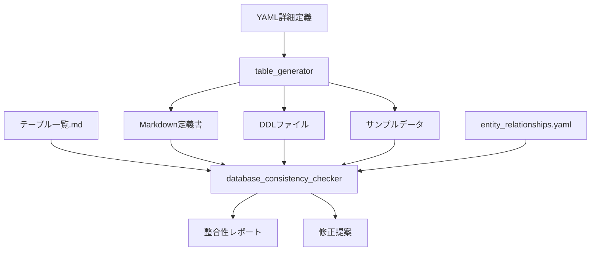

# データベース設計ツール統合パッケージ

年間スキル報告書WEB化PJTのデータベース設計・管理を効率化する統合ツールセットです。

## 🎯 概要

このツールパッケージは、YAML詳細定義からテーブル定義書・DDL・サンプルデータを自動生成し、データベース設計の整合性を保証する統合システムです。

### 主要機能

- **📝 YAML詳細定義**: 構造化されたテーブル定義の作成・管理
- **🔄 自動生成**: Markdown定義書・DDL・サンプルデータの一括生成
- **✅ 整合性チェック**: 全ファイル間の整合性検証
- **🔍 品質保証**: 命名規則・データ型・外部キー制約の検証
- **📊 レポート生成**: 整合性チェック結果の詳細レポート

## 🏗️ アーキテクチャ

```
docs/design/database/tools/
├── 📁 shared/                    # 共通コンポーネント
│   ├── adapters/                 # アダプター層
│   ├── core/                     # コアロジック
│   └── generators/               # 生成エンジン
├── 📁 table_generator/           # テーブル生成ツール
├── 📁 database_consistency_checker/ # 整合性チェックツール
├── 📁 tests/                     # テストスイート
├── 📁 configs/                   # 設定ファイル
└── 📄 run_tests.py              # 統合テストランナー
```

### ツール間の関係性



## 🚀 クイックスタート

### 1. 環境セットアップ

```bash
# 作業ディレクトリに移動
cd ~/skill-report-web/docs/design/database/tools

# Python環境確認
python3 --version  # Python 3.7以上が必要

# 必要パッケージのインストール
pip3 install PyYAML faker psutil

# インストール確認
python3 -c "import yaml, faker, psutil; print('All packages installed successfully')"
```

### 2. 基本的な使用方法

#### 新規テーブル作成の完全ワークフロー

```bash
# Step 1: テンプレートファイルをコピー（必須）
cp docs/design/database/table-details/MST_TEMPLATE_details.yaml \
   docs/design/database/table-details/MST_NewTable_details.yaml

# Step 2: YAML詳細定義を編集
# - table_name: "MST_NewTable"
# - logical_name: "新規テーブル論理名"
# - category: "マスタ系" または "トランザクション系"
# - columns: 業務固有カラム定義
# - business_indexes: 必要なインデックス
# - foreign_keys: 外部キー関係
# - sample_data: サンプルデータ

# Step 3: テーブル一覧.md更新
# 新規テーブルをテーブル一覧に追加

# Step 4: 自動生成実行
python3 -m table_generator --table MST_NewTable --verbose

# Step 5: 整合性チェック
python3 database_consistency_checker/run_check.py --tables MST_NewTable --verbose

# Step 6: 全体整合性確認
python3 database_consistency_checker/run_check.py --verbose
```

#### 日常的な使用パターン

```bash
# 複数テーブル一括生成
python3 -m table_generator --table MST_Employee,MST_Department,MST_Position --verbose

# カテゴリ別生成
python3 -m table_generator --table MST_* --verbose

# 全体整合性チェック（推奨：週次実行）
python3 database_consistency_checker/run_check.py --verbose --output-format markdown --output-file weekly_report.md
```

## 📋 YAML詳細定義の作成

### 基本構造とテンプレート

**重要**: 全てのテーブル定義は `docs/design/database/table-details/MST_TEMPLATE_details.yaml` をベースとして作成してください。

#### テンプレートファイルの使用方法

```bash
# 1. テンプレートファイルをコピー（必須）
cp docs/design/database/table-details/MST_TEMPLATE_details.yaml \
   docs/design/database/table-details/{テーブル名}_details.yaml

# 2. コピーしたファイルを編集
# - [テンプレート項目]を実際の値に置き換え
# - 不要なセクションやコメントを削除
# - 業務要件に応じてカラムやインデックスを追加
```

#### MST_TEMPLATE_details.yamlの構造

```yaml
# table-details/{テーブル名}_details.yaml
table_name: "MST_Employee"
logical_name: "社員基本情報"
category: "マスタ系"

# 改版履歴
revision_history:
  - version: "1.0.0"
    date: "2025-06-01"
    author: "開発チーム"
    changes: "初版作成 - MST_Employeeの詳細定義"

# テーブル概要・目的
overview: |
  社員の基本情報を管理するマスタテーブル
  
  主な目的：
  - 社員の個人情報管理
  - 組織構造の管理
  - 認証・権限管理の基盤

# 業務カラム定義
columns:
  - name: "id"
    type: "VARCHAR(50)"
    nullable: false
    primary_key: true
    comment: "プライマリキー（UUID）"
    requirement_id: "PLT.1-WEB.1"
  
  - name: "tenant_id"
    type: "VARCHAR(50)"
    nullable: false
    comment: "マルチテナント識別子"
    requirement_id: "TNT.1-MGMT.1"
    
  - name: "emp_no"
    type: "VARCHAR(20)"
    nullable: false
    comment: "社員番号"
    requirement_id: "PRO.1-BASE.1"
    
  - name: "name"
    type: "VARCHAR(100)"
    nullable: false
    comment: "氏名"
    requirement_id: "PRO.1-BASE.1"

# インデックス定義
indexes:
  - name: "idx_employee_tenant"
    columns: ["tenant_id"]
    unique: false
    comment: "テナント別検索用インデックス"
    
  - name: "idx_employee_emp_no"
    columns: ["tenant_id", "emp_no"]
    unique: true
    comment: "テナント内社員番号一意制約"

# 外部キー制約
foreign_keys:
  - name: "fk_employee_tenant"
    columns: ["tenant_id"]
    references:
      table: "MST_Tenant"
      columns: ["id"]
    on_update: "CASCADE"
    on_delete: "RESTRICT"
    comment: "テナント参照制約"

# サンプルデータ
sample_data:
  - emp_no: "EMP001"
    name: "山田太郎"
    email: "yamada@example.com"
    dept_id: "DEPT001"
  - emp_no: "EMP002"
    name: "佐藤花子"
    email: "sato@example.com"
    dept_id: "DEPT002"
```

### テーブル命名規則

| プレフィックス | 用途 | 例 | パフォーマンス要件 |
|---|---|---|---|
| **MST_** | マスタ系テーブル | MST_Employee, MST_Department | 高速参照重視（5-10ms以内） |
| **TRN_** | トランザクション系テーブル | TRN_SkillRecord, TRN_GoalProgress | バランス重視（15-50ms以内） |
| **HIS_** | 履歴系テーブル | HIS_AuditLog, HIS_OperationHistory | 書き込み重視、参照は低頻度 |
| **SYS_** | システム系テーブル | SYS_SearchIndex, SYS_SystemLog | 書き込み重視、参照は許容範囲 |
| **WRK_** | ワーク系テーブル | WRK_BulkJobLog, WRK_BatchWork | 処理効率重視 |
| **IF_** | インターフェイス系テーブル | IF_ExternalSync, IF_ImportExport | 外部連携・インポート/エクスポート用 |

## 🔧 テーブル生成ツール（table_generator）

### 主要機能

- **YAML解析・検証**: 構文チェック・必須項目確認
- **Markdown定義書生成**: 業務仕様書形式での出力
- **PostgreSQL DDL生成**: CREATE TABLE、インデックス、外部キー制約
- **サンプルデータ生成**: テスト用INSERT文の自動生成
- **共通カラム自動追加**: created_at, updated_at, is_deleted等

### ディレクトリ構造

```
table_generator/
├── __init__.py              # パッケージ初期化
├── __main__.py              # メインエントリーポイント
├── core/                    # コア機能
│   ├── __init__.py
│   ├── config.py            # 設定管理
│   ├── logger.py            # 強化ログ機能（カラー出力対応）
│   └── models.py            # データモデル定義
├── data/                    # データ関連
│   ├── __init__.py
│   ├── faker_utils.py       # テストデータ生成
│   └── yaml_data_loader.py  # YAMLデータローダー
├── generators/              # 生成機能
│   ├── __init__.py
│   ├── common_columns.py    # 共通カラム生成
│   ├── ddl_generator.py     # DDL生成機能
│   ├── insert_generator.py  # INSERT文生成機能
│   └── table_definition_generator.py  # テーブル定義書生成
└── utils/                   # ユーティリティ
    ├── __init__.py
    ├── file_utils.py        # ファイル操作
    ├── sql_utils.py         # SQL関連ユーティリティ
    └── yaml_loader.py       # YAML読み込み
```

### 使用方法

#### 基本的な使用

```bash
# 全テーブル生成
python3 -m table_generator

# 個別テーブル生成
python3 -m table_generator --table MST_Employee

# 複数テーブル生成
python3 -m table_generator --table MST_Role,MST_Permission

# カテゴリ別生成（ワイルドカード使用）
python3 -m table_generator --table MST_* --verbose
```

#### 高度なオプション

```bash
# 出力先ディレクトリ指定
python3 -m table_generator --table MST_Employee --output-dir custom/

# ベースディレクトリ指定
python3 -m table_generator --base-dir ~/custom/database/
                                                                                                                                                                                                                                                                                                                                                                                                                                                                                                                                                                                                                                                                                                                                                                                                                                                                                                                                                                                                                                                                                                                                                                                                                                                                                                                                                                                                                                                                                                                                                                                                                                                                                                                                                                                                                                                                                                                                                                                                                                                                                                                                                                                                                                                                                                                                                                                                                                                                                                                                                                                                                                                                                                                                                                                                                                                                                                                                                                                                                                                                                                                                                                                                                                                                                                                                                                                                                                                                                                                                                                                                                                                                                                                                                                                                                                                                                                                                                                                                                                                                                                                                                                                                                                                                                                                                                                                                                                                                                                                                                                                                                                                                                                                                                                                                                                                                                                                                                                                                                                                                                                                                                                                                                                                                                                                                                                                                                                                                                                                                                                                                                                                                                                                                                                                                                                                                                                                                                                                                                                                                                                                                                                                                                                                                                                                                                                                                                                                                                                                                                                                                                                                                                                                                                                                                                                                                                                                                                                                                                                                                                                                                                                                                                                                                                                                                                                                                                                                                                                                                                                                                                                                                                                                                                                                                                                                                                                                                                                                                                                                                                                                                                                                                                                                                                                                                                                                                                                                                                                                                                                                                                                                                                                                                                                                                                                                                                                                                                                                                                                                                                                                                                                                                                                                                                                                                                                                                                                                                                                                                                                                                                                                                                                                                                                                                                                                                                                                                                                                                                                                                                                                                                                                                                                                                                                                                                                                                                                                                                                                                                                                                                                                                                                                                                                                                                                                                                                                                                                                                                                                                                                                                                                                                                                                                                                                                                                                                                                                                                                                                                                                                                                                                                                                                                                                                                                                                                                                                                                                                                                                                                                                                                                                                                                                                                                                                                                                                                                                                                                                                                                                                                                                                                                                                                                                                                                                                                                                                                                                                                                                                                                                                                                                                                                                                                                                                                                                                                                                              
                                                                                                                                                                                                                                                                                                                                                                                                                                                                                                                                                                                                                                                                                                                                                                                                                                                                                                                                                                                                                                                                                                                                                                                                                                                                                                                                                                                                                                                                                                                                                                                                                                                                                                                                                                                                                                                                                                                                                                                                                                                                                                                                                                                                                                                                                                                                                                                                                                                                                                                                                                                                                                                                                                                                                                                                                                                                                                                                                                                                                                                                                                                                                                                                                                                                                                                                                                                                                                                                                                                                                                                                                                                                                                                                                                                                                                                                                                                                                                                                                                                                                                                                                                                                                                                                                                                                                                                                                                                                                                                                                                                                                                                                                                                                                                                                                                                                                                                                                                                                                                                                                                                                                                                                                                                                                                                                                                                                                                                                                                                                                                                                                                                                                                                                                                                                                                                                                                                                                                                                                                                                                                                                                                                                                                                                                                                                                                                                                                                                                                                                                                                                                                                                                                                                                                                                                                                                                                                                                                                                                                                                                                                                                                                                                                                                                                                                                                                                                                                                                                                                                                                                                                                                                                                                                                                                                                                                                                                                                                                                                                                                                                                                                                                                                                                                                                                                                                                                                                                                                                                                                                                                                                                                                                                                                                                                                                                                                                                                                                                                                                                                                                                                                                                                                                                                                                                                                                                                                                                                                                                                                                                                                                                                                                                                                                                                                                                                                                                                                                                                                                                                                                                                                                                                                                                                                                                                                                                                                                                                                                                                                                                                                                                                                                                                                                                                                                                                                                                                                                                                                                                                                                                                                                                                                                                                                                                                                                                                                                                                                                                                                                                                                                                                                                                                                                                                                                                                                                                                                                                                                                                                                                                                                                                                                                                                                                                                                                                                                                                                                                                                                                                                                                                                                                                                                                                                                                                                                                                                                                                                                                                                                                                                                                                                                                                                                                                                                                                                                                                              
# ドライラン（ファイルを実際には作成しない）
python3 -m table_generator --dry-run --verbose

# 詳細ログ出力
python3 -m table_generator --table MST_Employee --verbose

# カラー出力無効
python3 -m table_generator --no-color
```

#### 特定フォーマットのみ生成

```bash
# DDLファイルのみ生成
python3 -m table_generator --table MST_Employee --ddl-only

# Markdown定義書のみ生成
python3 -m table_generator --table MST_Employee --markdown-only

# サンプルデータのみ生成
python3 -m table_generator --table MST_Employee --data-only
```

### 生成される出力ファイル

#### 1. テーブル定義書 (Markdown)
- **場所**: `../tables/`
- **形式**: `テーブル定義書_{テーブル名}_{論理名}.md`
- **内容**: 
  - テーブル概要・目的
  - カラム定義（業務カラム + 共通カラム）
  - インデックス定義・設計根拠
  - 外部キー制約・参照関係
  - 制約条件・ビジネスルール

#### 2. DDLファイル (SQL)
- **場所**: `../ddl/`
- **形式**: `{テーブル名}.sql`
- **内容**:
  - DROP TABLE文（IF EXISTS）
  - CREATE TABLE文（文字セット・照合順序設定）
  - インデックス作成文（通常・ユニーク）
  - 外部キー制約（CASCADE/RESTRICT設定）
  - 初期データINSERT文

#### 3. サンプルデータ (SQL)
- **場所**: `../data/`
- **形式**: `{テーブル名}_sample_data.sql`
- **内容**:
  - INSERT文（データ型に応じた値フォーマット）
  - 実行確認用SELECT文
  - データ整合性確認クエリ

### DDL生成機能の詳細

#### PostgreSQL対応機能
- **データ型マッピング**: VARCHAR, INTEGER, TIMESTAMP, BOOLEAN等
- **制約生成**: PRIMARY KEY, UNIQUE, NOT NULL, CHECK制約
- **インデックス**: B-tree, Hash, GIN, GiSTインデックス対応
- **外部キー**: CASCADE, RESTRICT, SET NULL, SET DEFAULT対応
- **文字セット**: UTF8, 照合順序ja_JP.UTF-8対応

#### マルチテナント対応
- **tenant_idカラム**: 全テーブルに自動追加
- **複合インデックス**: tenant_idを含む効率的なインデックス設計
- **外部キー制約**: テナント間参照防止の制約設計

#### 共通カラム自動生成
```sql
-- 全テーブルに自動追加される共通カラム
created_at TIMESTAMP DEFAULT CURRENT_TIMESTAMP COMMENT '作成日時',
updated_at TIMESTAMP DEFAULT CURRENT_TIMESTAMP ON UPDATE CURRENT_TIMESTAMP COMMENT '更新日時',
is_deleted BOOLEAN DEFAULT FALSE COMMENT '論理削除フラグ',
created_by VARCHAR(50) COMMENT '作成者',
updated_by VARCHAR(50) COMMENT '更新者'
```

## ✅ 整合性チェックツール（database_consistency_checker）

### 主要機能

データベース設計ドキュメント間の整合性をチェックし、品質保証を行うツールです。

#### チェック対象ファイル
1. **テーブル一覧.md** (手動作成)
2. **entity_relationships.yaml** (手動作成)
3. **テーブル定義詳細YAML** (手動作成)
4. **テーブル定義書** (自動作成) ⚠️ **手動編集禁止**
5. **DDL** (自動作成) ⚠️ **手動編集禁止**
6. **INSERT文** (自動作成) ⚠️ **手動編集禁止**

### ⚠️ 重要な注意事項

#### 手動編集禁止ファイル

以下のファイルは**自動生成されるため、手動での編集は絶対に禁止**です：

- **テーブル定義書** (`tables/テーブル定義書_*.md`)
- **DDLファイル** (`ddl/*.sql`)
- **INSERT文** (`data/*_sample_data.sql`)

これらのファイルを手動で編集した場合：
- 🚨 次回の自動生成時に変更が上書きされます
- 🚨 データベース設計の整合性が保てなくなります
- 🚨 チーム開発での混乱を招きます

**変更が必要な場合は、必ず手動作成ファイル（テーブル一覧.md、entity_relationships.yaml、テーブル定義詳細YAML）を修正してから自動生成を実行してください。**

### 実装済みチェック機能

#### ✅ 基本整合性チェック
- **テーブル存在整合性チェック**: 全ソース間でのテーブル定義一致
- **孤立ファイル検出**: 未使用・重複ファイルの特定
- **カラム定義整合性チェック**: YAML ↔ DDL ↔ 定義書の整合性
- **外部キー整合性チェック**: 参照関係の妥当性チェック

#### ✅ データ型整合性チェック (v1.2.0で追加)
- DDLとYAML間のデータ型完全一致・互換性チェック
- 長さ制約の比較（VARCHAR(50) vs VARCHAR(100)等）
- NULL制約の整合性（NOT NULL vs NULL許可）
- デフォルト値の比較
- ENUM値の整合性

#### ✅ YAMLフォーマット整合性チェック (v1.3.0で追加)
- テーブル定義詳細YAMLファイルの標準テンプレート準拠確認
- 必須フィールドの存在チェック
- データ型・制約の妥当性検証
- YAMLフォーマット・構造の検証

#### ✅ 制約整合性チェック (v1.5.0で追加)
- PRIMARY KEY制約の整合性確認（DDL vs YAML）
- UNIQUE制約の整合性確認
- CHECK制約の整合性確認
- インデックス定義の整合性確認（名前、カラム、ユニーク性）
- 外部キー制約の詳細確認（ON UPDATE/DELETE動作）

#### ✅ 修正提案機能 (v1.5.0で追加)
- 検出された問題に対する具体的な修正方法の提案
- テーブル一覧.mdへの不足テーブル追加提案
- 外部キー参照先カラム名の修正提案
- ON DELETE/UPDATE設定の統一提案
- DDL修正コマンドの自動生成
- YAML修正内容の提案

#### ✅ レポート出力管理機能 (v1.1.0で追加)
- タイムスタンプ付きファイル名でユニーク性担保
- 最新レポートへの自動リンク作成
- 古いレポートの自動クリーンアップ
- レポート統計情報の取得

### 使用方法

#### 基本的な使用方法

```bash
# 全チェック実行（推奨）
python3 database_consistency_checker/run_check.py --verbose

# 特定のテーブルのみチェック
python3 database_consistency_checker/run_check.py --tables MST_Employee,MST_Department

# 詳細ログ付きでチェック
python3 database_consistency_checker/run_check.py --verbose
```

#### 出力形式の指定

```bash
# Markdown形式で出力（推奨）
python3 database_consistency_checker/run_check.py --output-format markdown --output-file report.md

# JSON形式で出力（プログラム処理用）
python3 database_consistency_checker/run_check.py --output-format json --output-file report.json

# コンソール出力（デフォルト）
python3 database_consistency_checker/run_check.py --output-format console
```

#### 特定のチェックのみ実行

```bash
# テーブル存在チェックのみ
python3 database_consistency_checker/run_check.py --checks table_existence

# 孤立ファイルチェックのみ
python3 database_consistency_checker/run_check.py --checks orphaned_files

# カラム整合性チェックのみ
python3 database_consistency_checker/run_check.py --checks column_consistency

# 外部キー整合性チェックのみ
python3 database_consistency_checker/run_check.py --checks foreign_key_consistency

# データ型整合性チェックのみ
python3 database_consistency_checker/run_check.py --checks data_type_consistency

# YAMLフォーマット整合性チェックのみ
python3 database_consistency_checker/run_check.py --checks yaml_format_consistency

# 複数のチェックを指定
python3 database_consistency_checker/run_check.py --checks table_existence,column_consistency,foreign_key_consistency
```

#### レポート管理機能

```bash
# レポート出力ディレクトリを指定
python3 database_consistency_checker/run_check.py --output-format markdown --report-dir custom_reports

# レポート保持期間を設定（デフォルト: 30日）
python3 database_consistency_checker/run_check.py --output-format markdown --keep-reports 7

# 最大レポート数を設定（デフォルト: 100件）
python3 database_consistency_checker/run_check.py --output-format markdown --max-reports 50

# カスタムプレフィックスを指定
python3 database_consistency_checker/run_check.py --output-format markdown --report-prefix "manual_check"

# 自動クリーンアップを無効化
python3 database_consistency_checker/run_check.py --output-format markdown --no-cleanup

# 詳細なレポート統計を表示
python3 database_consistency_checker/run_check.py --output-format markdown --verbose
```

#### 修正提案機能の使用

```bash
# 修正提案付きチェック実行
python3 database_consistency_checker/run_check.py --suggest-fixes --verbose

# 特定の問題に対する修正提案のみ
python3 database_consistency_checker/run_check.py --checks foreign_key_consistency --suggest-fixes

# 修正提案をファイルに出力
python3 database_consistency_checker/run_check.py --suggest-fixes --output-format markdown --output-file fixes_report.md
```

### チェック項目詳細

#### 1. テーブル存在整合性チェック

各テーブルが以下の全てのソースに存在するかをチェックします：

- テーブル一覧.md
- entity_relationships.yaml
- DDLファイル
- テーブル詳細定義ファイル

**エラー例：**
- ❌ テーブル一覧.mdに定義されていません
- ❌ DDLファイルが存在しません

**警告例：**
- ⚠️ エンティティ関連定義に存在しません
- ⚠️ テーブル詳細定義ファイルが存在しません

#### 2. データ型整合性チェック

DDLファイルとYAML詳細定義間のデータ型整合性をチェックします：

**チェック項目：**
- データ型の完全一致・互換性チェック
- 長さ制約の比較（VARCHAR(50) vs VARCHAR(100)等）
- NULL制約の整合性（NOT NULL vs NULL許可）
- デフォルト値の比較
- ENUM値の整合性

**エラー例：**
- ❌ カラム 'name' のデータ型が一致しません: DDL(VARCHAR(100)) ≠ YAML(VARCHAR(50))
- ❌ カラム 'status' のENUM値が一致しません
- ❌ カラム 'age' の長さ制約が一致しません

**警告例：**
- ⚠️ カラム 'description' のデータ型が互換性のある型で異なります: DDL(TEXT) vs YAML(VARCHAR)
- ⚠️ カラム 'is_active' のNULL制約が一致しません
- ⚠️ カラム 'created_at' のデフォルト値が一致しません

**成功例：**
- ✅ カラム 'id' のデータ型整合性OK: VARCHAR(50)
- ✅ MST_Employee: データ型整合性チェック完了 (12カラム確認済み)

#### 3. 外部キー整合性チェック

外部キー制約の妥当性をチェックします：

**チェック項目：**
- 参照先テーブルの存在確認
- 参照先カラムのデータ型一致確認
- CASCADE/RESTRICT設定の妥当性確認
- ON UPDATE/DELETE動作の整合性確認

**エラー例：**
- ❌ 参照先テーブル 'MST_Department' が存在しません
- ❌ 参照先カラムのデータ型が一致しません
- ❌ 外部キー制約名が重複しています

**警告例：**
- ⚠️ CASCADE設定により意図しないデータ削除の可能性
- ⚠️ ON DELETE/UPDATE設定が統一されていません

### 出力例

#### コンソール出力

```
🔍 データベース整合性チェック開始

📊 テーブル存在整合性チェック
✅ MST_Employee: 全てのソースに存在します
❌ MST_Department: DDLファイルが存在しません
⚠️ MST_Project: テーブル詳細定義ファイルが存在しません

🔍 データ型整合性チェック
✅ MST_Employee: データ型整合性OK (12カラム確認済み)
❌ MST_Role: カラム 'name' のデータ型が一致しません: DDL(VARCHAR(100)) ≠ YAML(VARCHAR(50))

🔍 外部キー整合性チェック
✅ MST_Employee.tenant_id → MST_Tenant.id: 整合性OK
❌ MST_Employee.dept_id → MST_Department.id: 参照先テーブルが存在しません

🔍 孤立ファイルチェック
⚠️ 孤立ファイル: OLD_Table.sql

📈 結果サマリー:
  ✅ SUCCESS: 2件
  ⚠️ WARNING: 2件
  ❌ ERROR: 3件

🎯 総合判定:
  ❌ 修正が必要な問題があります

💡 修正提案:
  1. MST_Department テーブルの生成: python3 -m table_generator --table MST_Department
  2. MST_Role の name カラム長を統一: YAML側をVARCHAR(100)に変更
  3. 孤立ファイル OLD_Table.sql の削除を検討
```

#### Markdown出力

詳細な表形式のレポートが生成されます：

```markdown
# データベース整合性チェックレポート

**実行日時**: 2025-06-11 23:07:00
**チェック対象**: 全テーブル (100テーブル)
**総チェック数**: 628件

## 📊 結果サマリー

| 結果 | 件数 | 割合 |
|------|------|------|
| ✅ SUCCESS | 580 | 92.4% |
| ⚠️ WARNING | 35 | 5.6% |
| ❌ ERROR | 13 | 2.1% |

## ❌ エラー詳細

### テーブル存在整合性エラー

| テーブル名 | 問題 | 修正提案 |
|-----------|------|----------|
| MST_Department | DDLファイルが存在しません | `python3 -m table_generator --table MST_Department` |
| MST_Project | YAML詳細定義が存在しません | `table-details/MST_Project_details.yaml` を作成 |

### データ型整合性エラー

| テーブル名 | カラム名 | DDL型 | YAML型 | 修正提案 |
|-----------|---------|-------|--------|----------|
| MST_Role | name | VARCHAR(100) | VARCHAR(50) | YAML側をVARCHAR(100)に変更 |
| MST_Permission | description | TEXT | VARCHAR(255) | 互換性あり、統一推奨 |
```

#### JSON出力

プログラムで処理しやすい構造化データが出力されます：

```json
{
  "execution_info": {
    "timestamp": "2025-06-11T23:07:00Z",
    "total_tables": 100,
    "total_checks": 628
  },
  "summary": {
    "success": 580,
    "warning": 35,
    "error": 13
  },
  "results": {
    "table_existence": {
      "MST_Employee": {"status": "success", "message": "全てのソースに存在します"},
      "MST_Department": {"status": "error", "message": "DDLファイルが存在しません"}
    },
    "data_type_consistency": {
      "MST_Role": {
        "status": "error",
        "issues": [
          {
            "column": "name",
            "ddl_type": "VARCHAR(100)",
            "yaml_type": "VARCHAR(50)",
            "suggestion": "YAML側をVARCHAR(100)に変更"
          }
        ]
      }
    }
  },
  "suggestions": [
    {
      "priority": "high",
      "category": "table_generation",
      "command": "python3 -m table_generator --table MST_Department",
      "description": "MST_Department テーブルの生成"
    }
  ]
}
```

### 将来実装予
