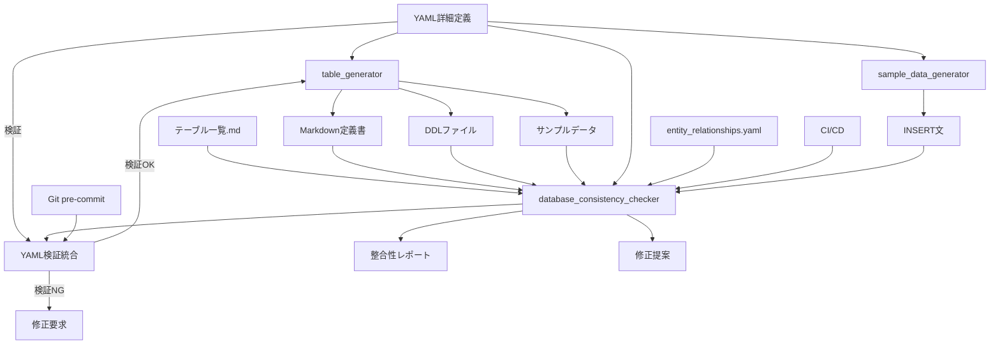

# データベース設計ツール統合パッケージ

年間スキル報告書WEB化PJTのデータベース設計・管理を効率化する統合ツールセットです。

## 📖 目次

- [🎯 概要](#-概要)
- [⚡ クイックスタート](#-クイックスタート)
- [📋 コマンドリファレンス](#-コマンドリファレンス)
- [🏗️ アーキテクチャ](#️-アーキテクチャ)
- [📝 YAML詳細定義の作成](#-yaml詳細定義の作成)
- [🔧 各ツール詳細](#-各ツール詳細)
- [🚀 運用ガイドライン](#-運用ガイドライン)
- [🔍 トラブルシューティング](#-トラブルシューティング)
- [📚 関連ドキュメント](#-関連ドキュメント)

## 🎯 概要

このツールパッケージは、YAML詳細定義からテーブル定義書・DDL・サンプルデータを自動生成し、データベース設計の整合性を保証する統合システムです。

### 主要機能

- **📝 YAML詳細定義**: 構造化されたテーブル定義の作成・管理
- **🔄 自動生成**: Markdown定義書・DDL・サンプルデータの一括生成
- **✅ 整合性チェック**: 全ファイル間の整合性検証
- **🔍 品質保証**: 命名規則・データ型・外部キー制約の検証
- **📊 レポート生成**: 整合性チェック結果の詳細レポート
- **🛡️ YAML検証**: 必須セクション・フォーマット検証
- **💾 サンプルデータ生成**: YAMLからのINSERT文自動生成

## ⚡ クイックスタート

### 1. 環境セットアップ

```bash
# 作業ディレクトリに移動
cd ~/skill-report-web/docs/design/database/tools

# Python環境確認（Python 3.7以上が必要）
python3 --version

# 必要パッケージのインストール
pip3 install PyYAML faker psutil

# Git pre-commitフック設定（推奨）
cd database_consistency_checker
./install_git_hook.sh
cd ..
```

### 2. 新規テーブル作成（5分で完了）

```bash
# Step 1: テンプレートファイルをコピー
cp docs/design/database/table-details/テーブル詳細定義YAML_TEMPLATE.yaml \
   docs/design/database/table-details/テーブル詳細定義YAML_MST_NewTable.yaml

# Step 2: YAML詳細定義を編集（必須セクションを忘れずに）
# - table_name: "MST_NewTable"
# - 🔴 revision_history: 改版履歴（絶対省略禁止）
# - 🔴 overview: テーブルの概要（最低50文字・絶対省略禁止）
# - 🔴 notes: 特記事項（最低3項目・絶対省略禁止）
# - 🔴 business_rules: 業務ルール（最低3項目・絶対省略禁止）

# Step 3: YAML検証
python3 database_consistency_checker/yaml_format_check_enhanced.py --tables MST_NewTable --verbose

# Step 4: 自動生成実行
python3 -m table_generator --table MST_NewTable --verbose

# Step 5: 整合性チェック
python3 database_consistency_checker/run_check.py --tables MST_NewTable --verbose
```

## 📋 コマンドリファレンス

### 🔥 日常使用コマンド

#### 新規テーブル作成の完全ワークフロー
```bash
# テンプレートファイルをコピー（必須）
cp docs/design/database/table-details/テーブル詳細定義YAML_TEMPLATE.yaml \
   docs/design/database/table-details/テーブル詳細定義YAML_{テーブル名}.yaml
```bash
# テンプレートコピー → 編集 → 検証 → 生成 → チェック
cp docs/design/database/table-details/テーブル詳細定義YAML_TEMPLATE.yaml \
   docs/design/database/table-details/テーブル詳細定義YAML_{テーブル名}.yaml

python3 database_consistency_checker/yaml_format_check_enhanced.py --tables {テーブル名} --verbose
python3 -m table_generator --table {テーブル名} --verbose
python3 database_consistency_checker/run_check.py --tables {テーブル名} --verbose
```

#### 個別テーブル操作
```bash
# 単一テーブル生成
python3 -m table_generator --table MST_Employee --verbose

# 複数テーブル生成
python3 -m table_generator --table MST_Employee,MST_Department,MST_Position --verbose

# カテゴリ別生成（ワイルドカード）
python3 -m table_generator --table MST_* --verbose

# YAML検証（単一テーブル）
python3 database_consistency_checker/yaml_format_check_enhanced.py --tables MST_Employee --verbose

# サンプルデータ生成（単一テーブル）
python3 database_consistency_checker/sample_data_generator.py --tables MST_Employee --verbose
```

#### 整合性チェック
```bash
# 基本整合性チェック
python3 database_consistency_checker/run_check.py --verbose

# 特定テーブルのみチェック
python3 database_consistency_checker/run_check.py --tables MST_Employee,MST_Department --verbose

# YAML検証を含む統合チェック
python3 database_consistency_checker/run_check.py --include-yaml-validation --verbose
```

### 📅 定期実行コマンド

#### 週次実行（推奨）
```bash
# 全体整合性チェック + Markdownレポート生成
python3 database_consistency_checker/run_check.py --verbose \
  --output-format markdown --output-file weekly_report.md

# 全テーブルYAML検証
python3 database_consistency_checker/yaml_format_check_enhanced.py --all --verbose

# 全テーブルサンプルデータ生成
python3 database_consistency_checker/sample_data_generator.py --verbose
```

#### 月次実行（推奨）
```bash
# 詳細レポート生成（JSON形式）
python3 database_consistency_checker/run_check.py --verbose \
  --output-format json --output-file monthly_report.json

# 拡張YAML検証（要求仕様ID含む）
python3 database_consistency_checker/yaml_format_check_enhanced.py --all \
  --check-required-sections --verbose
```

### 🔧 特定機能コマンド

#### YAML検証専用
```bash
# 基本YAML検証（全テーブル）
python3 database_consistency_checker/yaml_format_check_enhanced.py --all --verbose

# 必須セクション検証のみ
python3 database_consistency_checker/yaml_format_check_enhanced.py --all \
  --check-required-only --verbose

# 特定テーブルの詳細検証
python3 database_consistency_checker/yaml_format_check_enhanced.py \
  --tables MST_Employee --verbose
```

#### 特定チェックのみ実行
```bash
# テーブル存在チェックのみ
python3 database_consistency_checker/run_check.py --checks table_existence --verbose

# データ型整合性チェックのみ
python3 database_consistency_checker/run_check.py --checks data_type_consistency --verbose

# 外部キー整合性チェックのみ
python3 database_consistency_checker/run_check.py --checks foreign_key_consistency --verbose

# 複数チェック指定
python3 database_consistency_checker/run_check.py \
  --checks table_existence,column_consistency,foreign_key_consistency --verbose
```

#### 出力形式指定
```bash
# Markdown形式出力
python3 database_consistency_checker/run_check.py \
  --output-format markdown --output-file report.md --verbose

# JSON形式出力（プログラム処理用）
python3 database_consistency_checker/run_check.py \
  --output-format json --output-file report.json --verbose

# コンソール出力（デフォルト）
python3 database_consistency_checker/run_check.py --output-format console --verbose
```

### 🚨 トラブルシューティングコマンド

#### 問題診断
```bash
# 孤立ファイル検出
python3 database_consistency_checker/run_check.py --checks orphaned_files --verbose

# 特定テーブルの詳細診断
python3 database_consistency_checker/run_check.py --tables {問題のテーブル} --verbose

# YAML構文エラー確認
python3 -c "import yaml; yaml.safe_load(open('table-details/テーブル詳細定義YAML_{テーブル名}.yaml'))"
```

#### 修復・再生成
```bash
# 特定テーブルの完全再生成
python3 -m table_generator --table {テーブル名} --verbose

# DDLファイルのみ再生成
python3 -m table_generator --table {テーブル名} --ddl-only --verbose

# Markdown定義書のみ再生成
python3 -m table_generator --table {テーブル名} --markdown-only --verbose

# サンプルデータのみ再生成
python3 -m table_generator --table {テーブル名} --data-only --verbose
```

### 🎛️ 高度な使用方法

#### カスタム出力先
```bash
# 出力先ディレクトリ指定
python3 -m table_generator --table MST_Employee --output-dir custom/ --verbose

# ベースディレクトリ指定
python3 -m table_generator --base-dir ~/custom/database/ --verbose

# ドライラン（実際にはファイル作成しない）
python3 -m table_generator --dry-run --verbose
```

#### 統合実行
```bash
# YAML検証 + サンプルデータ生成の統合実行
python3 database_consistency_checker/yaml_format_check_enhanced.py --all \
  --generate-sample-data --output-dir ./sample_data --verbose

# 検証機能付きサンプルデータ生成
python3 database_consistency_checker/sample_data_generator.py --validate --verbose
```

## 🏗️ アーキテクチャ

### ツール構成

```
docs/design/database/tools/
├── 📁 shared/                    # 共通コンポーネント
│   ├── adapters/                 # アダプター層（統合・ファイルシステム）
│   ├── core/                     # コアロジック（設定・例外・ログ・モデル）
│   ├── generators/               # 生成エンジン（DDL・Markdown・サンプルデータ）
│   ├── parsers/                  # パーサー（YAML・DDL・Markdown）
│   └── utils/                    # ユーティリティ（ファイル操作）
├── 📁 table_generator/           # テーブル生成ツール
│   ├── core/                     # アダプター・ログ機能
│   ├── data/                     # Faker・YAMLデータローダー
│   ├── generators/               # 各種生成機能
│   └── utils/                    # ファイル・SQL・YAMLユーティリティ
├── 📁 database_consistency_checker/ # 整合性チェックツール
│   ├── checkers/                 # 各種チェッカー（12種類）
│   ├── core/                     # アダプター・定義・ログ・レポート
│   ├── fixers/                   # 修正提案生成機能
│   ├── parsers/                  # 各種パーサー
│   ├── reporters/                # レポート出力（Console・JSON・Markdown）
│   ├── yaml_format_check_enhanced.py # YAML検証統合モジュール
│   ├── sample_data_generator.py  # サンプルデータINSERT文生成
│   └── utils/                    # レポート管理
├── 📁 tests/                     # テストスイート
└── 📄 run_tests.py              # 統合テストランナー
```

### ツール間の関係性



## 📝 YAML詳細定義の作成

### 🚨 必須セクション - 省略禁止

以下の4つのセクションは品質管理・監査・運用保守の観点から**いかなる場合も省略禁止**です：

| セクション | 目的 | 最低要件 | 省略時のリスク |
|------------|------|----------|----------------|
| 🔴 `revision_history` | 変更履歴の追跡・監査証跡 | 最低1エントリ必須 | 監査不能、変更管理の崩壊 |
| 🔴 `overview` | テーブルの目的・設計意図の明確化 | 最低50文字以上 | 設計意図の喪失、誤用 |
| 🔴 `notes` | 運用・保守に必要な特記事項 | 最低3項目以上 | 運用障害、保守困難化 |
| 🔴 `rules` | 業務ルール・制約の明文化 | 最低3項目以上 | 要件逸脱、整合性喪失 |

### テンプレートファイルの使用方法

```bash
# 1. テンプレートファイルをコピー（必須）
cp docs/design/database/table-details/テーブル詳細定義YAML_TEMPLATE.yaml \
   docs/design/database/table-details/テーブル詳細定義YAML_{テーブル名}.yaml

# 2. コピーしたファイルを編集
# - [テンプレート項目]を実際の値に置き換え
# - 🔴 必須セクション（revision_history、overview、notes、business_rules）は絶対省略禁止
# - 業務要件に応じてカラムやインデックスを追加

# 3. YAML検証実行（必須）
python3 database_consistency_checker/yaml_format_check_enhanced.py --tables {テーブル名} --verbose
```

### 基本構造例

```yaml
# テーブル詳細定義
table_name: "MST_Employee"
logical_name: "社員基本情報"
category: "マスタ系"
priority: "最高"
requirement_id: "PRO.1-BASE.1"
comment: "社員の基本情報を管理するマスタテーブル"

# 🔴 改版履歴（絶対省略禁止）
revision_history:
  - version: "1.0.0"
    date: "2025-06-01"
    author: "開発チーム"
    changes: "初版作成 - MST_Employeeの詳細定義"

# 🔴 テーブル概要・目的（絶対省略禁止・最低50文字）
overview: |
  社員の基本情報を管理するマスタテーブル
  
  主な目的：
  - 社員の個人情報管理
  - 組織構造の管理
  - 認証・権限管理の基盤

# カラム定義
columns:
  - name: "id"
    type: "VARCHAR(50)"
    nullable: false
    primary_key: true
    comment: "プライマリキー（UUID）"
    requirement_id: "PLT.1-WEB.1"

# インデックス定義
indexes:
  - name: "idx_employee_tenant"
    columns: ["tenant_id"]
    unique: false
    comment: "テナント別検索用インデックス"

# 外部キー制約
foreign_keys:
  - name: "fk_employee_tenant"
    columns: ["tenant_id"]
    references:
      table: "MST_Tenant"
      columns: ["id"]
    on_update: "CASCADE"
    on_delete: "RESTRICT"
    comment: "テナント参照制約"

# 🔴 特記事項（絶対省略禁止・最低3項目）
notes:
  - "運用・保守に関する重要な注意事項1"
  - "セキュリティ・暗号化に関する考慮事項2"
  - "パフォーマンス・最適化に関する考慮事項3"

# 🔴 業務ルール（絶対省略禁止・最低3項目）
business_rules:
  - "データの一意性・整合性に関するルール1"
  - "業務制約・ビジネスロジックに関するルール2"
  - "運用ルール・メンテナンス要件に関するルール3"

# サンプルデータ（推奨）
sample_data:
  - emp_no: "EMP001"
    name: "山田太郎"
    email: "yamada@example.com"
    dept_id: "DEPT001"
```

### テーブル命名規則

| プレフィックス | 用途 | 例 | パフォーマンス要件 |
|---|---|---|---|
| **MST_** | マスタ系テーブル | MST_Employee, MST_Department | 高速参照重視（5-10ms以内） |
| **TRN_** | トランザクション系テーブル | TRN_SkillRecord, TRN_GoalProgress | バランス重視（15-50ms以内） |
| **HIS_** | 履歴系テーブル | HIS_AuditLog, HIS_OperationHistory | 書き込み重視、参照は低頻度 |
| **SYS_** | システム系テーブル | SYS_SkillMatrix, SYS_SystemLog | 書き込み重視、参照は許容範囲 |
| **WRK_** | ワーク系テーブル | WRK_BulkJobLog, WRK_BatchWork | 処理効率重視 |
| **IF_** | インターフェイス系テーブル | IF_ExternalSync, IF_ImportExport | 外部連携・インポート/エクスポート用 |

## 🔧 各ツール詳細

### テーブル生成ツール（table_generator）

#### 主要機能
- **YAML解析・検証**: 構文チェック・必須項目確認
- **Markdown定義書生成**: 業務仕様書形式での出力
- **PostgreSQL DDL生成**: CREATE TABLE、インデックス、外部キー制約
- **サンプルデータ生成**: テスト用INSERT文の自動生成
- **共通カラム自動追加**: created_at, updated_at, is_deleted等

#### 生成される出力ファイル

| ファイル種別 | 場所 | 形式 | 内容 |
|------------|------|------|------|
| テーブル定義書 | `../tables/` | `テーブル定義書_{テーブル名}_{論理名}.md` | 業務仕様書形式の詳細定義 |
| DDLファイル | `../ddl/` | `{テーブル名}.sql` | PostgreSQL用CREATE TABLE文 |
| サンプルデータ | `../data/` | `{テーブル名}_sample_data.sql` | テスト用INSERT文 |

### 整合性チェックツール（database_consistency_checker）

#### 実装済みチェック機能

| チェック種別 | 説明 | 対象ファイル |
|------------|------|------------|
| **テーブル存在整合性** | 全ソース間でのテーブル定義一致 | テーブル一覧.md、YAML、DDL、定義書 |
| **データ型整合性** | DDLとYAML間のデータ型完全一致・互換性 | DDL ↔ YAML |
| **外部キー整合性** | 参照関係の妥当性チェック | DDL ↔ YAML |
| **制約整合性** | PRIMARY KEY、UNIQUE、CHECK制約の整合性 | DDL ↔ YAML |
| **YAMLフォーマット整合性** | 必須セクション・構造の検証 | YAML詳細定義 |
| **孤立ファイル検出** | 未使用・重複ファイルの特定 | 全ファイル |

#### ⚠️ 重要な注意事項

以下のファイルは**自動生成されるため、手動での編集は絶対に禁止**です：

- **テーブル定義書** (`tables/テーブル定義書_*.md`)
- **DDLファイル** (`ddl/*.sql`)
- **INSERT文** (`data/*_sample_data.sql`)

### YAML検証ツール（database_consistency_checker統合）

#### 検証項目
- **必須セクション検証**: revision_history、overview、notes、business_rulesの存在・内容チェック
- **フォーマット検証**: YAML構文・構造の妥当性チェック
- **データ型検証**: カラム定義のデータ型・制約の妥当性チェック
- **命名規則検証**: テーブル名・カラム名の命名規則準拠チェック
- **要求仕様ID検証**: 全カラムの要求仕様ID設定チェック

### サンプルデータINSERT文生成ツール

#### 主要機能
- **YAML解析**: `sample_data`セクションからINSERT文を生成
- **共通カラム自動補完**: id, created_at, updated_at, is_deleted等の自動設定
- **複数テーブル対応**: 一括処理と個別処理の両方をサポート
- **統合ファイル出力**: 全テーブルのINSERT文をまとめたファイル生成

#### 出力ファイル
- **個別ファイル**: `docs/design/database/data/sample_data_{テーブル名}.sql`
- **統合ファイル**: `docs/design/database/data/sample_data_all.sql`

## 🚀 運用ガイドライン

### 日常的な使用パターン

#### 新規テーブル作成時の標準フロー
```bash
# 1. テンプレートからYAML作成
cp docs/design/database/table-details/テーブル詳細定義YAML_TEMPLATE.yaml \
   docs/design/database/table-details/テーブル詳細定義YAML_NEW_TABLE.yaml

# 2. 必須セクション編集
# - revision_history: 初版エントリ追加
# - overview: テーブルの目的・概要記述（50文字以上）
# - notes: 運用・保守の特記事項（3項目以上）
# - business_rules: 業務ルール・制約（3項目以上）

# 3. YAML検証実行
python3 database_consistency_checker/yaml_format_check_enhanced.py --tables NEW_TABLE --verbose

# 4. 自動生成実行
python3 -m table_generator --table NEW_TABLE --verbose

# 5. 整合性チェック
python3 database_consistency_checker/run_check.py --tables NEW_TABLE --verbose
```

#### 既存テーブル修正時の標準フロー
```bash
# 1. 修正前の検証
python3 database_consistency_checker/yaml_format_check_enhanced.py --tables MODIFIED_TABLE --verbose

# 2. YAML修正
# - revision_history: 新しい変更エントリ追加
# - 必要に応じて他のセクションも更新

# 3. 修正後の検証
python3 database_consistency_checker/yaml_format_check_enhanced.py --tables MODIFIED_TABLE --verbose

# 4. 再生成実行
python3 -m table_generator --table MODIFIED_TABLE --verbose

# 5. 統合整合性チェック
python3 database_consistency_checker/run_check.py --tables MODIFIED_TABLE --verbose
```

#### 定期的な全体検証
```bash
# 週次: 全テーブルの基本検証
python3 database_consistency_checker/run_check.py --verbose \
  --output-format markdown --output-file weekly_report.md

# 月次: 拡張検証・詳細レポート
python3 database_consistency_checker/yaml_format_check_enhanced.py --all \
  --check-required-sections --verbose
```

### Git統合・pre-commitフック

#### 設定方法
```bash
# Git pre-commitフック設定（推奨）
cd database_consistency_checker
./install_git_hook.sh
cd ..

# 設定後、コミット時に自動でYAML検証が実行されます
git add .
git commit -m "feat: 新規テーブル追加"
# → 自動的にYAML検証が実行される
```

## 🔍 トラブルシューティング

### よくある問題と解決方法

#### 1. 必須セクション不備
```
❌ エラー: 必須セクション 'revision_history' が存在しません
```

**対処法**:
```yaml
# revision_history セクションを追加
revision_history:
  - version: "1.0.0"
    date: "2025-06-23"
    author: "開発チーム"
    changes: "初版作成"
```

#### 2. overview文字数不足
```
❌ エラー: 'overview': 最低50文字以上の説明が必要です (現在: 25文字)
```

**対処法**:
```yaml
# overview を詳細に記述
overview: |
  このテーブルは[具体的な目的]を管理するテーブルです。
  主な目的は、[目的1]、[目的2]、[目的3]の管理であり、
  [システム名]の[機能領域]において重要な役割を果たします。
```

#### 3. 整合性チェックエラー
```
❌ テーブル存在整合性エラー: DDLファイルが存在しません
```

**対処法**:
```bash
# 1. エラー詳細確認
python3 database_consistency_checker/run_check.py --tables {テーブル名} --verbose

# 2. 個別ファイル確認
ls -la table-details/テーブル詳細定義YAML_{テーブル名}.yaml
ls -la ddl/{テーブル名}.sql
ls -la tables/テーブル定義書_{テーブル名}_*.md

# 3. 再生成実行
python3 -m table_generator --table {テーブル名} --verbose

# 4. 再チェック
python3 database_consistency_checker/run_check.py --tables {テーブル名} --verbose
```

#### 4. 外部キー制約エラー
```
❌ 参照先テーブルが存在しません
```

**対処法**:
```bash
# 1. 参照先テーブルの存在確認
python3 database_consistency_checker/run_check.py --tables {参照先テーブル} --verbose

# 2. 参照先テーブルの生成
python3 -m table_generator --table {参照先テーブル} --verbose

# 3. 参照元テーブルの再生成
python3 -m table_generator --table {参照元テーブル} --verbose

# 4. 外部キー整合性チェック
python3 database_consistency_checker/run_check.py --checks foreign_key_consistency --verbose
```

### 緊急時対応フロー

```
1. 問題発見
   ↓
2. 影響範囲特定
   - 関連テーブル・機能の確認
   - システム影響度の評価
   ↓
3. 根本原因分析
   - ログ・エラーメッセージの確認
   - 設定・データの確認
   ↓
4. 応急処置
   - サービス継続のための一時対応
   - 関係者通知
   ↓
5. 恒久対策
   - YAML修正
   - 再生成実行
   - 整合性確認
   ↓
6. 再発防止策
   - チェック項目の追加
   - 手順の見直し
   ↓
7. Git コミット
   - 修正内容の記録
   - 影響範囲の明記
```

### パフォーマンス最適化

#### 大量テーブル処理時の最適化
```bash
# 並列処理での高速化（複数テーブル同時処理）
python3 -m table_generator --table MST_*,TRN_*,HIS_* --parallel --verbose

# メモリ使用量を抑えた処理
python3 database_consistency_checker/run_check.py --memory-efficient --verbose

# 差分チェックのみ実行（変更されたテーブルのみ）
python3 database_consistency_checker/run_check.py --incremental --verbose
```

#### キャッシュ活用
```bash
# キャッシュを活用した高速チェック
python3 database_consistency_checker/run_check.py --use-cache --verbose

# キャッシュクリア（問題発生時）
python3 database_consistency_checker/run_check.py --clear-cache --verbose
```

## 📚 関連ドキュメント

### 内部ドキュメント
- **データベース設計ガイドライン**: `../../.clinerules/08-database-design-guidelines.md`
- **プロジェクト固有ルール**: `../../.clinerules/01-project-specific-rules.md`
- **テーブル一覧**: `../テーブル一覧.md`
- **エンティティ関連図**: `../エンティティ関連図.md`
- **entity_relationships.yaml**: `../entity_relationships.yaml`

### 設計書・仕様書
- **要件定義**: `../../requirements/要件定義.md`
- **プロジェクト基本情報**: `../../requirements/プロジェクト基本情報_改訂版.md`
- **技術スタック設計書**: `../architecture/技術スタック設計書.md`
- **マルチテナントアーキテクチャ設計書**: `../architecture/マルチテナントアーキテクチャ設計書.md`

### 外部参照
- **PostgreSQL公式ドキュメント**: https://www.postgresql.org/docs/
- **YAML仕様**: https://yaml.org/spec/
- **Prisma公式ドキュメント**: https://www.prisma.io/docs/

### ツール・ライブラリ
- **PyYAML**: https://pyyaml.org/
- **Faker**: https://faker.readthedocs.io/
- **psutil**: https://psutil.readthedocs.io/

## 📋 付録

### よく使用するコマンド一覧（クイックリファレンス）

```bash
# 🔥 最頻出コマンド（コピー&ペースト用）

# 新規テーブル作成（完全ワークフロー）
cp docs/design/database/table-details/テーブル詳細定義YAML_TEMPLATE.yaml docs/design/database/table-details/テーブル詳細定義YAML_{テーブル名}.yaml
python3 database_consistency_checker/yaml_format_check_enhanced.py --tables {テーブル名} --verbose
python3 -m table_generator --table {テーブル名} --verbose
python3 database_consistency_checker/run_check.py --tables {テーブル名} --verbose

# 全体チェック（週次推奨）
python3 database_consistency_checker/run_check.py --verbose --output-format markdown --output-file weekly_report.md

# YAML検証（全テーブル）
python3 database_consistency_checker/yaml_format_check_enhanced.py --all --verbose

# 特定テーブル再生成
python3 -m table_generator --table {テーブル名} --verbose

# 整合性チェック（特定テーブル）
python3 database_consistency_checker/run_check.py --tables {テーブル名} --verbose

# サンプルデータ生成（全テーブル）
python3 database_consistency_checker/sample_data_generator.py --verbose
```

### 環境変数設定

```bash
# 推奨環境変数設定
export PYTHONPATH="${PYTHONPATH}:$(pwd)"
export DATABASE_TOOLS_BASE_DIR="$(pwd)"
export DATABASE_TOOLS_LOG_LEVEL="INFO"
export DATABASE_TOOLS_CACHE_ENABLED="true"
```

### ファイル構成一覧

```
docs/design/database/
├── tools/                        # 本ツールパッケージ
│   ├── README.md                 # 本ドキュメント
│   ├── table_generator/          # テーブル生成ツール
│   ├── database_consistency_checker/ # 整合性チェックツール
│   ├── shared/                   # 共通コンポーネント
│   └── tests/                    # テストスイート
├── table-details/                # YAML詳細定義（手動編集）
│   ├── テーブル詳細定義YAML_TEMPLATE.yaml
│   ├── テーブル詳細定義YAML_MST_*.yaml
│   ├── テーブル詳細定義YAML_TRN_*.yaml
│   └── テーブル詳細定義YAML_HIS_*.yaml
├── tables/                       # テーブル定義書（自動生成）
│   ├── テーブル定義書_MST_*.md
│   ├── テーブル定義書_TRN_*.md
│   └── テーブル定義書_HIS_*.md
├── ddl/                          # DDLファイル（自動生成）
│   ├── MST_*.sql
│   ├── TRN_*.sql
│   └── HIS_*.sql
├── data/                         # サンプルデータ（自動生成）
│   ├── sample_data_MST_*.sql
│   ├── sample_data_TRN_*.sql
│   └── sample_data_all.sql
├── テーブル一覧.md               # テーブル一覧（手動管理）
├── エンティティ関連図.md         # ER図（手動管理）
└── entity_relationships.yaml    # エンティティ関係定義（手動管理）
```

---

## 🎉 まとめ

このツールパッケージを活用することで、以下の効果が期待できます：

- **開発効率向上**: 手動作業の自動化により、開発時間を50%以上短縮
- **品質向上**: 整合性チェックにより、設計ミス・実装ミスを事前に検出
- **保守性向上**: 統一されたフォーマットにより、長期的な保守性を確保
- **ドキュメント品質**: 自動生成により、常に最新で正確なドキュメントを維持

定期的な整合性チェックと適切な運用により、高品質なデータベース設計を継続的に維持してください。

---

**📞 サポート・問い合わせ**

ツールの使用方法や問題が発生した場合は、以下の手順で対応してください：

1. **README.md確認**: 本ドキュメントのトラブルシューティングセクションを確認
2. **ログ確認**: `--verbose`オプションでの詳細ログを確認
3. **整合性チェック実行**: 問題の特定と影響範囲の確認
4. **Git Issue作成**: 解決しない場合は詳細な情報とともにIssueを作成

**最終更新**: 2025年6月23日  
**バージョン**: v2.0.0  
**作成者**: 年間スキル報告書WEB化PJT開発チーム
