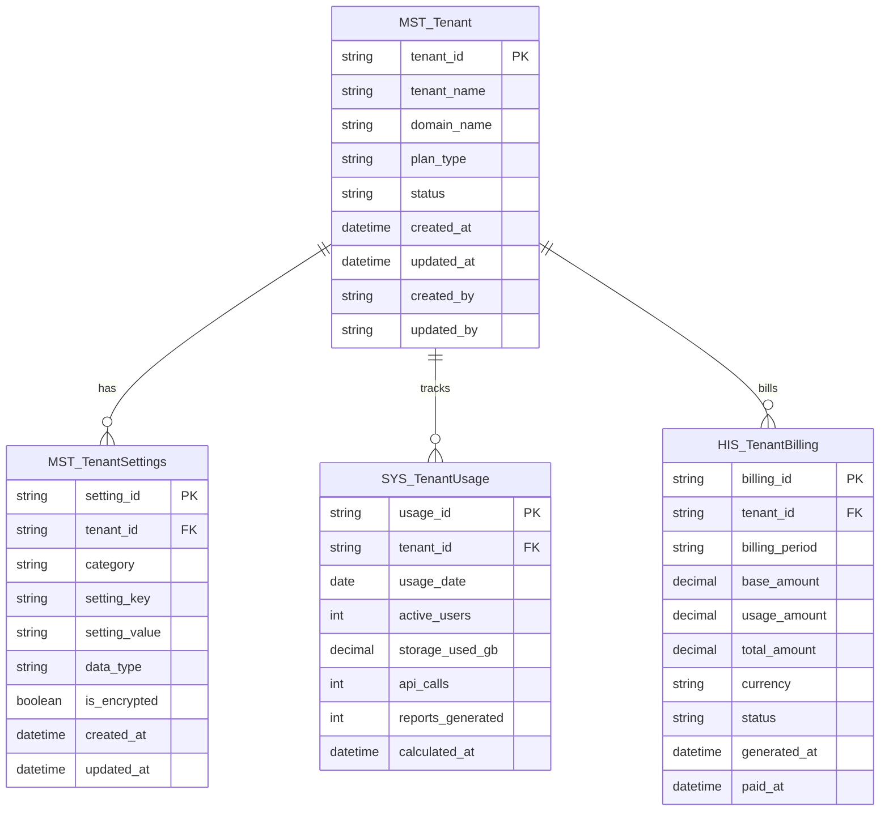
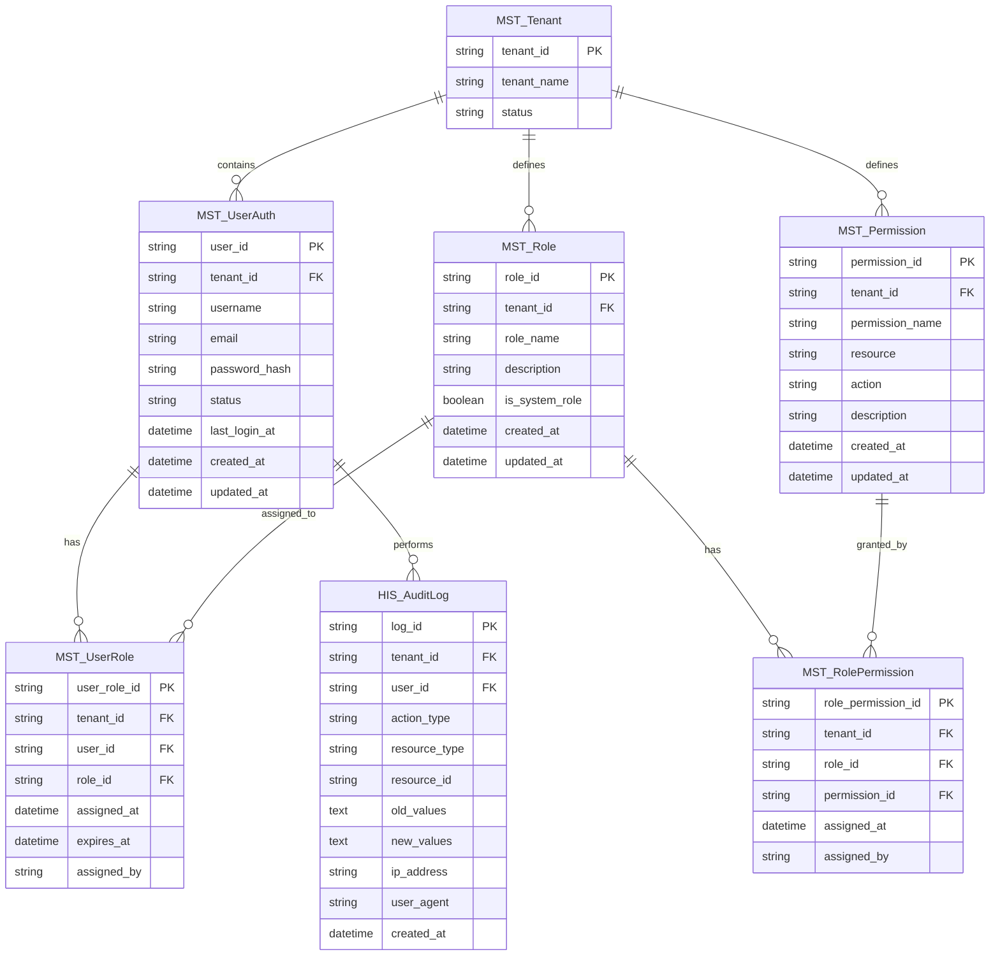
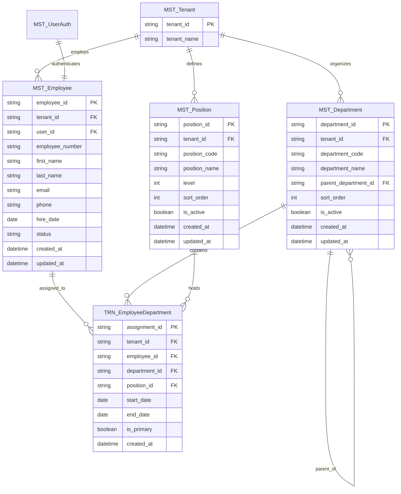
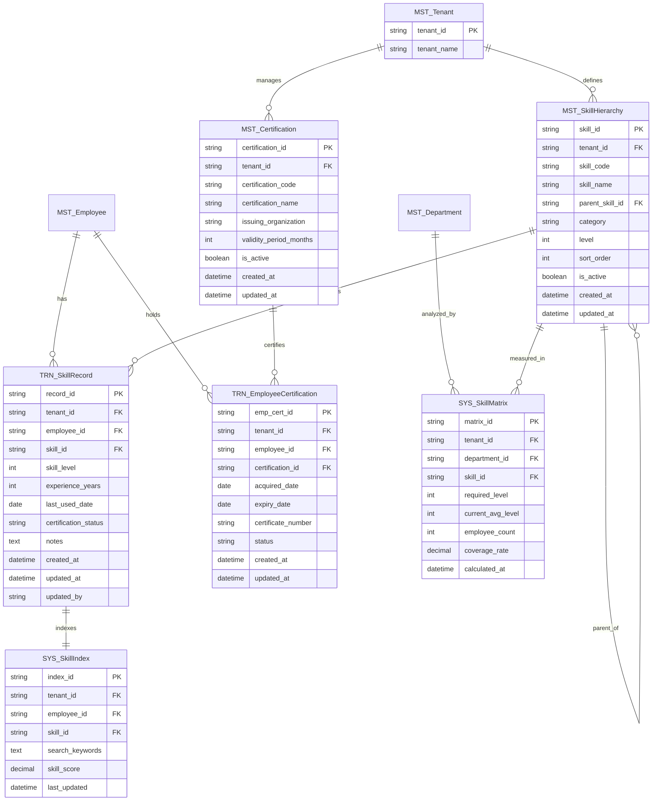
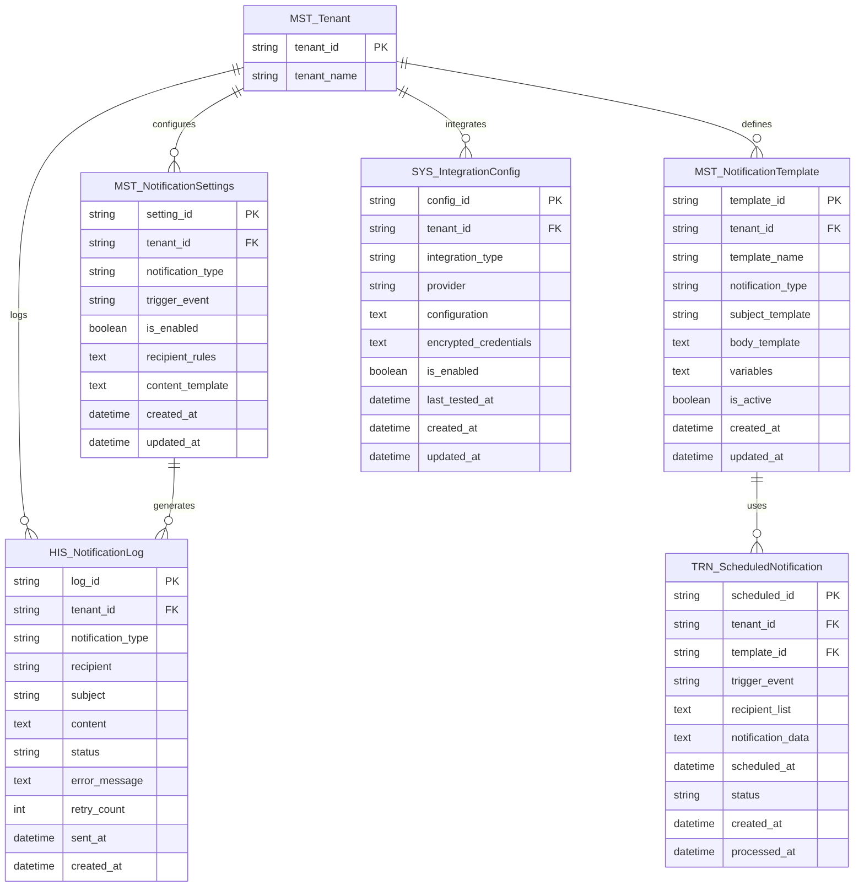
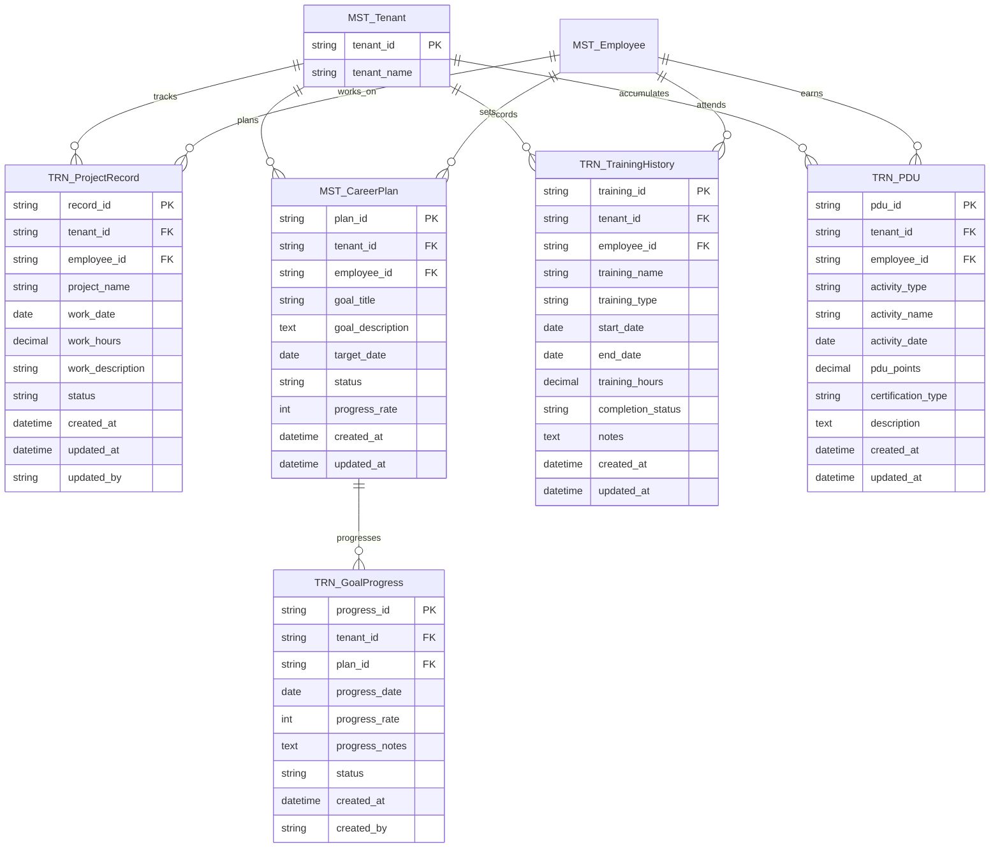

# エンティティ関連図: マルチテナント対応スキル管理システム

## 1. 文書基本情報

- **文書名**: エンティティ関連図
- **プロジェクト名**: 年間スキル報告書WEB化PJT - マルチテナント対応
- **対象システム**: ホールディングス・グループ会社向けマルチテナントSaaS基盤
- **作成日**: 2025/05/30
- **作成者**: システムアーキテクト
- **改訂履歴**: 2025/05/30 初版作成（マルチテナント対応）

---

## 2. エンティティ関連図概要

### 2.1 マルチテナント対応設計方針

**テナント分離**と**データ整合性**を重視したエンティティ設計：

1. **テナント分離**: 全エンティティにtenant_idを追加してデータ分離
2. **参照整合性**: テナント内でのみ外部キー制約を適用
3. **拡張性**: 新しいテナント固有機能の容易な追加
4. **監査性**: 全操作の追跡・監査機能

### 2.2 エンティティカテゴリ

```mermaid
graph TB
    subgraph "マルチテナント基盤"
        TENANT[MST_Tenant<br/>テナント管理]
        TENANT_SETTINGS[MST_TenantSettings<br/>テナント設定]
        TENANT_USAGE[SYS_TenantUsage<br/>テナント使用量]
        TENANT_BILLING[HIS_TenantBilling<br/>課金履歴]
    end
    
    subgraph "認証・認可"
        USER_AUTH[MST_UserAuth<br/>ユーザー認証]
        ROLE[MST_Role<br/>ロール]
        PERMISSION[MST_Permission<br/>権限]
        USER_ROLE[MST_UserRole<br/>ユーザーロール]
    end
    
    subgraph "組織・プロフィール"
        EMPLOYEE[MST_Employee<br/>社員情報]
        DEPARTMENT[MST_Department<br/>部署]
        POSITION[MST_Position<br/>役職]
    end
    
    subgraph "スキル管理"
        SKILL_HIERARCHY[MST_SkillHierarchy<br/>スキル階層]
        SKILL_RECORD[TRN_SkillRecord<br/>スキル情報]
        CERTIFICATION[MST_Certification<br/>資格情報]
        SKILL_INDEX[SYS_SkillIndex<br/>検索インデックス]
    end
    
    subgraph "通知・連携"
        NOTIFY_SETTINGS[MST_NotificationSettings<br/>通知設定]
        NOTIFY_TEMPLATE[MST_NotificationTemplate<br/>通知テンプレート]
        INTEGRATION_CONFIG[SYS_IntegrationConfig<br/>外部連携設定]
        NOTIFY_LOG[HIS_NotificationLog<br/>通知履歴]
    end
    
    TENANT --> USER_AUTH
    TENANT --> EMPLOYEE
    TENANT --> SKILL_RECORD
    TENANT --> NOTIFY_SETTINGS
    TENANT_SETTINGS --> TENANT
    TENANT_USAGE --> TENANT
    TENANT_BILLING --> TENANT
```



---

## 3. 詳細エンティティ関連図

### 3.1 マルチテナント基盤エンティティ



### 3.2 認証・認可エンティティ（マルチテナント対応）



### 3.3 組織・プロフィールエンティティ（マルチテナント対応）



### 3.4 スキル管理エンティティ（マルチテナント対応）



### 3.5 通知・連携エンティティ（マルチテナント対応）



### 3.6 作業実績・目標管理エンティティ（マルチテナント対応）



---

## 4. マルチテナント制約・インデックス設計

### 4.1 テナント分離制約

```sql
-- 全テーブルにテナント分離制約を追加
-- 例: MST_UserAuth
ALTER TABLE MST_UserAuth 
ADD CONSTRAINT chk_tenant_isolation 
CHECK (tenant_id IS NOT NULL);

-- 複合インデックス（tenant_id + 主要検索キー）
CREATE INDEX idx_userauth_tenant_email 
ON MST_UserAuth (tenant_id, email);

CREATE INDEX idx_skillrecord_tenant_employee 
ON TRN_SkillRecord (tenant_id, employee_id);

CREATE INDEX idx_auditlog_tenant_user_date 
ON HIS_AuditLog (tenant_id, user_id, created_at);
```

### 4.2 参照整合性制約（テナント内）

```sql
-- テナント内参照整合性制約の例
-- MST_UserRole: 同一テナント内でのみ参照可能
ALTER TABLE MST_UserRole 
ADD CONSTRAINT fk_userrole_tenant_user 
FOREIGN KEY (tenant_id, user_id) 
REFERENCES MST_UserAuth (tenant_id, user_id);

ALTER TABLE MST_UserRole 
ADD CONSTRAINT fk_userrole_tenant_role 
FOREIGN KEY (tenant_id, role_id) 
REFERENCES MST_Role (tenant_id, role_id);

-- TRN_SkillRecord: 同一テナント内でのみ参照可能
ALTER TABLE TRN_SkillRecord 
ADD CONSTRAINT fk_skillrecord_tenant_employee 
FOREIGN KEY (tenant_id, employee_id) 
REFERENCES MST_Employee (tenant_id, employee_id);

ALTER TABLE TRN_SkillRecord 
ADD CONSTRAINT fk_skillrecord_tenant_skill 
FOREIGN KEY (tenant_id, skill_id) 
REFERENCES MST_SkillHierarchy (tenant_id, skill_id);
```

### 4.3 Row Level Security (RLS) 設定

```sql
-- PostgreSQL RLS設定例
-- MST_UserAuth テーブル
ALTER TABLE MST_UserAuth ENABLE ROW LEVEL SECURITY;

CREATE POLICY tenant_isolation_policy ON MST_UserAuth
FOR ALL TO application_role
USING (tenant_id = current_setting('app.current_tenant_id'));

-- TRN_SkillRecord テーブル
ALTER TABLE TRN_SkillRecord ENABLE ROW LEVEL SECURITY;

CREATE POLICY tenant_isolation_policy ON TRN_SkillRecord
FOR ALL TO application_role
USING (tenant_id = current_setting('app.current_tenant_id'));

-- HIS_AuditLog テーブル
ALTER TABLE HIS_AuditLog ENABLE ROW LEVEL SECURITY;

CREATE POLICY tenant_isolation_policy ON HIS_AuditLog
FOR ALL TO application_role
USING (tenant_id = current_setting('app.current_tenant_id'));
```

---

## 5. データ移行・テナント追加戦略

### 5.1 既存データのテナント割り当て

```sql
-- 既存データに対するテナント割り当て
-- 1. デフォルトテナント作成
INSERT INTO MST_Tenant (tenant_id, tenant_name, domain_name, plan_type, status)
VALUES ('default-tenant', 'デフォルトテナント', 'default.example.com', 'enterprise', 'active');

-- 2. 既存データにテナントID追加
UPDATE MST_UserAuth SET tenant_id = 'default-tenant' WHERE tenant_id IS NULL;
UPDATE MST_Employee SET tenant_id = 'default-tenant' WHERE tenant_id IS NULL;
UPDATE TRN_SkillRecord SET tenant_id = 'default-tenant' WHERE tenant_id IS NULL;

-- 3. インデックス再構築
REINDEX TABLE MST_UserAuth;
REINDEX TABLE TRN_SkillRecord;
```

### 5.2 新規テナント追加プロセス

```typescript
// 新規テナント追加サービス
class TenantProvisioningService {
  async createNewTenant(tenantData: CreateTenantRequest): Promise<Tenant> {
    const transaction = await prisma.$transaction(async (tx) => {
      // 1. テナント作成
      const tenant = await tx.mst_Tenant.create({
        data: {
          tenant_id: generateTenantId(),
          tenant_name: tenantData.name,
          domain_name: tenantData.domain,
          plan_type: tenantData.plan,
          status: 'active'
        }
      });
      
      // 2. デフォルト設定作成
      await this.createDefaultSettings(tx, tenant.tenant_id);
      
      // 3. デフォルトロール・権限作成
      await this.createDefaultRolesAndPermissions(tx, tenant.tenant_id);
      
      // 4. 管理者ユーザー作成
      await this.createAdminUser(tx, tenant.tenant_id, tenantData.adminUser);
      
      return tenant;
    });
    
    // 5. 外部システム通知
    await this.notifyTenantCreation(tenant);
    
    return tenant;
  }
}
```

このエンティティ関連図により、マルチテナント対応システムのデータ構造と関連性を明確に定義し、安全で拡張性の高いデータ管理を実現します。
