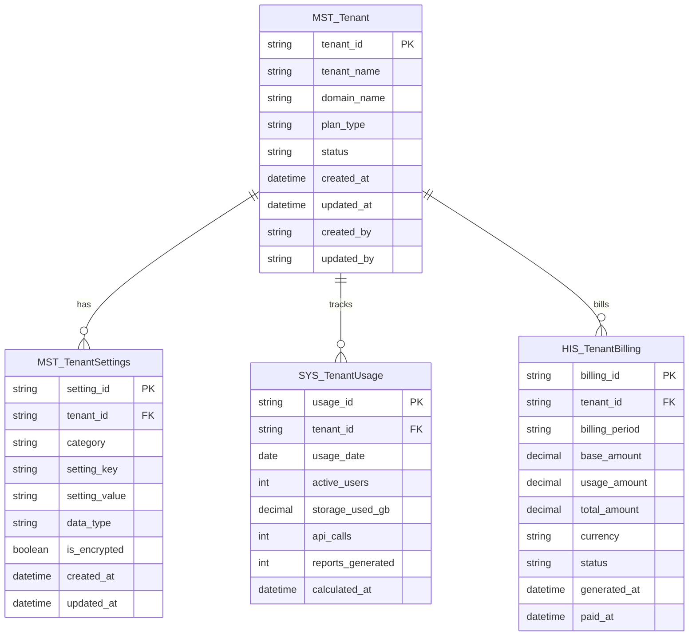
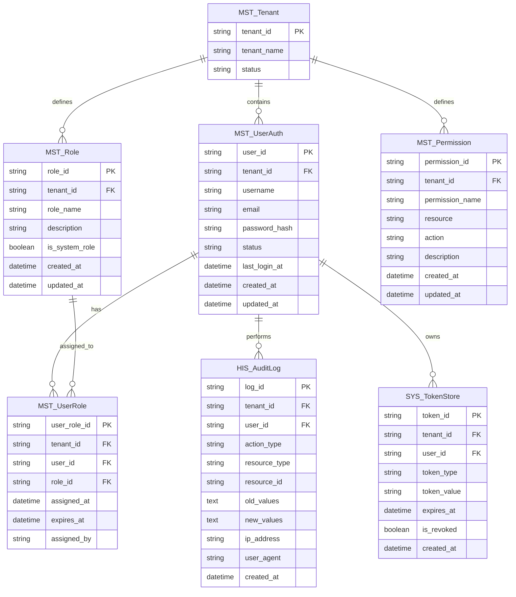
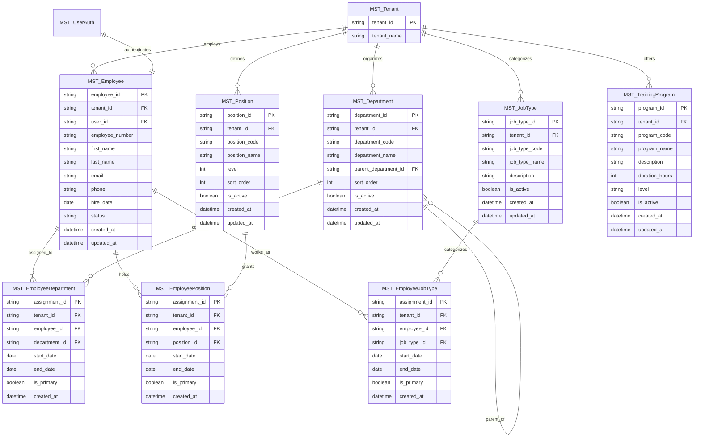
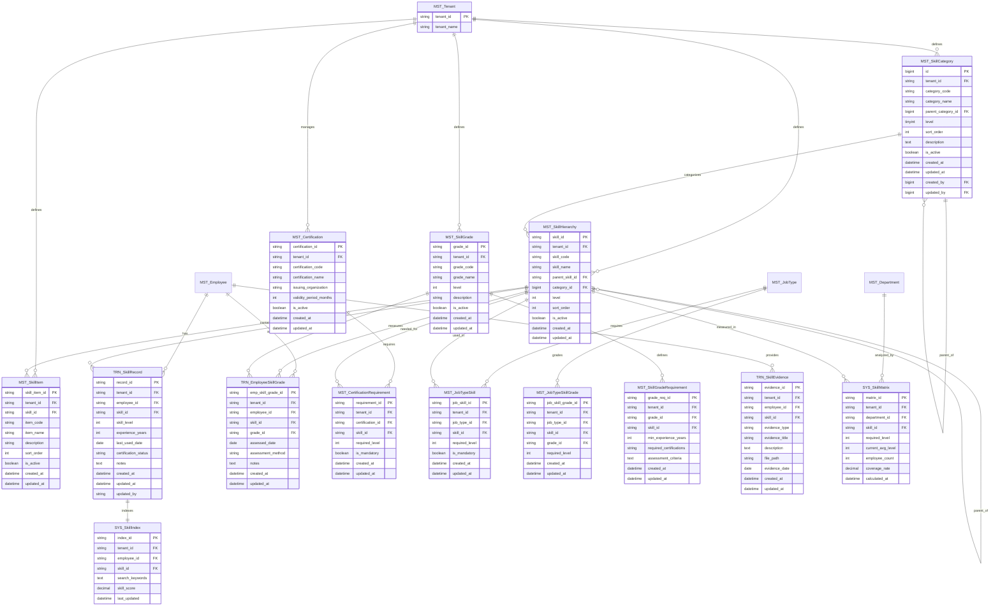
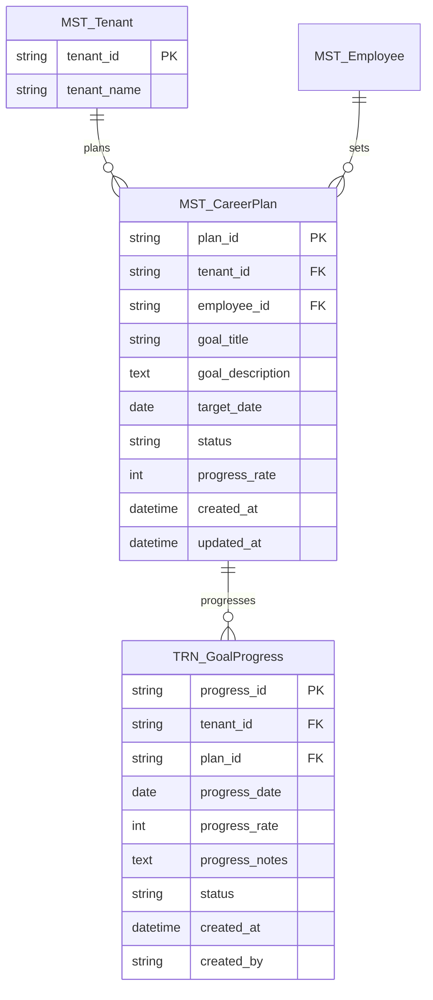
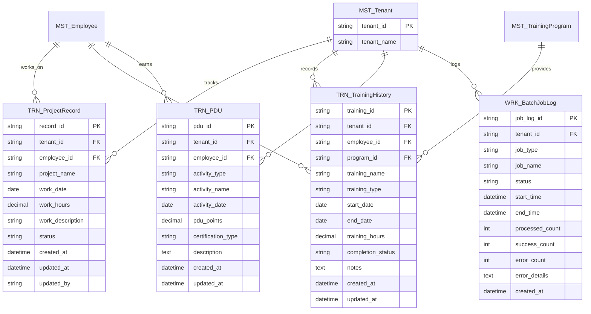
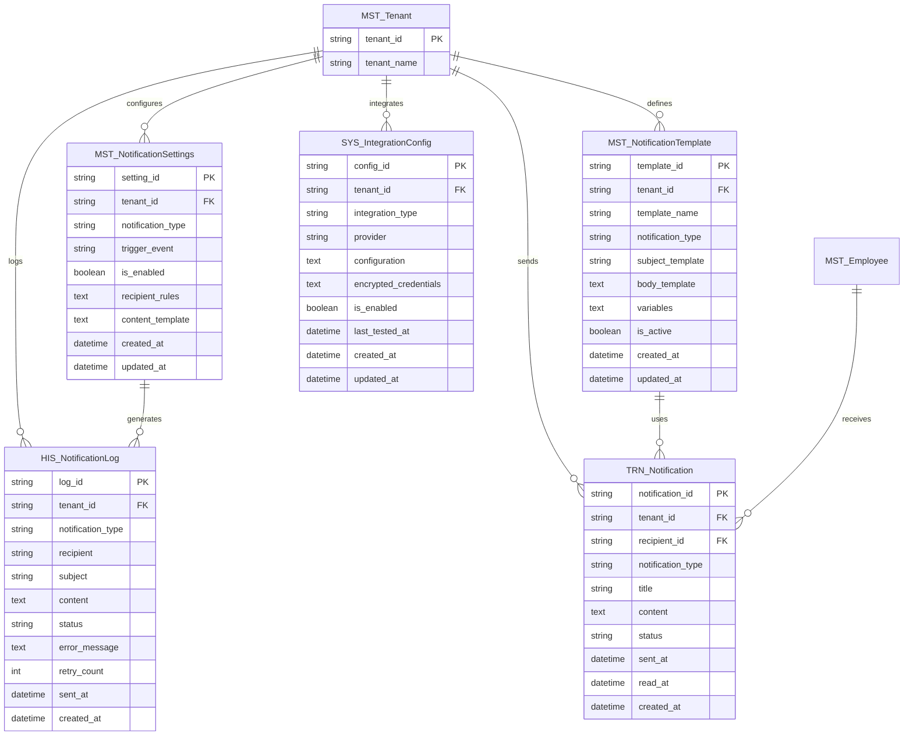
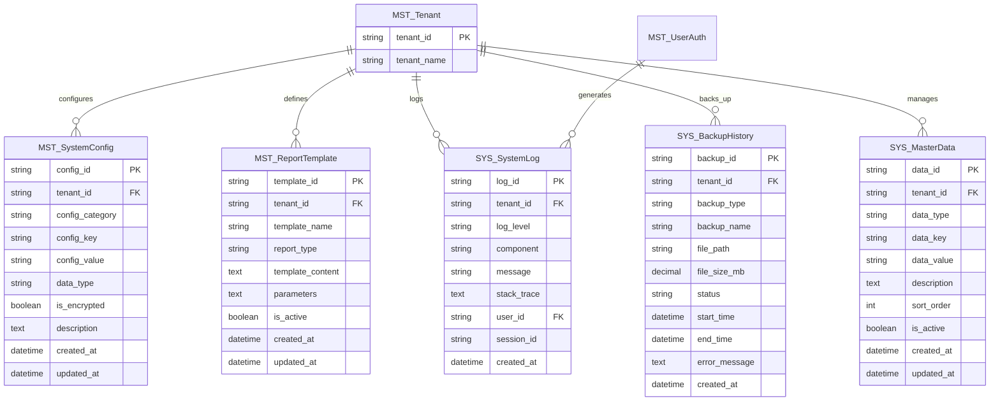

# エンティティ関連図: マルチテナント対応スキル管理システム

## 1. 文書基本情報

- **文書名**: エンティティ関連図
- **プロジェクト名**: 年間スキル報告書WEB化PJT - マルチテナント対応
- **対象システム**: ホールディングス・グループ会社向けマルチテナントSaaS基盤
- **作成日**: 2025/06/01
- **作成者**: システムアーキテクト
- **改訂履歴**: 
  - 2025/05/30 初版作成（マルチテナント対応）
  - 2025/06/01 テーブル一覧に基づく全面更新（48テーブル対応）

---

## 2. エンティティ関連図概要

### 2.1 マルチテナント対応設計方針

**テナント分離**と**データ整合性**を重視したエンティティ設計：

1. **テナント分離**: 全エンティティにtenant_idを追加してデータ分離
2. **参照整合性**: テナント内でのみ外部キー制約を適用
3. **拡張性**: 新しいテナント固有機能の容易な追加
4. **監査性**: 全操作の追跡・監査機能

### 2.2 エンティティカテゴリ構成（48テーブル）

```mermaid
graph TB
    subgraph "マルチテナント基盤（4テーブル）"
        TENANT[MST_Tenant<br/>テナント管理]
        TENANT_SETTINGS[MST_TenantSettings<br/>テナント設定]
        TENANT_USAGE[SYS_TenantUsage<br/>テナント使用量]
        TENANT_BILLING[HIS_TenantBilling<br/>課金履歴]
    end
    
    subgraph "認証・認可（5テーブル）"
        USER_AUTH[MST_UserAuth<br/>ユーザー認証]
        ROLE[MST_Role<br/>ロール]
        PERMISSION[MST_Permission<br/>権限]
        USER_ROLE[MST_UserRole<br/>ユーザーロール]
        AUDIT_LOG[HIS_AuditLog<br/>監査ログ]
    end
    
    subgraph "組織・プロフィール（8テーブル）"
        EMPLOYEE[MST_Employee<br/>社員情報]
        DEPARTMENT[MST_Department<br/>部署]
        POSITION[MST_Position<br/>役職]
        JOB_TYPE[MST_JobType<br/>職種]
        EMP_DEPT[MST_EmployeeDepartment<br/>社員部署関連]
        EMP_POS[MST_EmployeePosition<br/>社員役職関連]
        EMP_JOB[MST_EmployeeJobType<br/>社員職種関連]
        TRAINING_PROG[MST_TrainingProgram<br/>研修プログラム]
    end
    
    subgraph "スキル管理（14テーブル）"
        SKILL_CATEGORY[MST_SkillCategory<br/>スキルカテゴリ]
        SKILL_HIERARCHY[MST_SkillHierarchy<br/>スキル階層]
        SKILL_ITEM[MST_SkillItem<br/>スキル項目]
        SKILL_GRADE[MST_SkillGrade<br/>スキルグレード]
        SKILL_RECORD[TRN_SkillRecord<br/>スキル情報]
        EMP_SKILL_GRADE[TRN_EmployeeSkillGrade<br/>社員スキルグレード]
        CERTIFICATION[MST_Certification<br/>資格情報]
        CERT_REQ[MST_CertificationRequirement<br/>資格要件]
        JOB_SKILL[MST_JobTypeSkill<br/>職種スキル関連]
        JOB_SKILL_GRADE[MST_JobTypeSkillGrade<br/>職種スキルグレード]
        SKILL_GRADE_REQ[MST_SkillGradeRequirement<br/>スキルグレード要件]
        SKILL_EVIDENCE[TRN_SkillEvidence<br/>スキル証跡]
        SKILL_INDEX[SYS_SkillIndex<br/>検索インデックス]
        SKILL_MATRIX[SYS_SkillMatrix<br/>スキルマップ]
    end
    
    subgraph "目標・キャリア管理（2テーブル）"
        CAREER_PLAN[MST_CareerPlan<br/>目標・キャリアプラン]
        GOAL_PROGRESS[TRN_GoalProgress<br/>目標進捗]
    end
    
    subgraph "作業実績・研修管理（4テーブル）"
        PROJECT_RECORD[TRN_ProjectRecord<br/>案件実績]
        TRAINING_HISTORY[TRN_TrainingHistory<br/>研修参加履歴]
        PDU[TRN_PDU<br/>継続教育ポイント]
        BATCH_JOB_LOG[WRK_BatchJobLog<br/>一括登録ジョブログ]
    end
    
    subgraph "通知・連携管理（5テーブル）"
        NOTIFY_SETTINGS[MST_NotificationSettings<br/>通知設定]
        NOTIFY_TEMPLATE[MST_NotificationTemplate<br/>通知テンプレート]
        NOTIFICATION[TRN_Notification<br/>通知履歴]
        NOTIFY_LOG[HIS_NotificationLog<br/>通知送信履歴]
        INTEGRATION_CONFIG[SYS_IntegrationConfig<br/>外部連携設定]
    end
    
    subgraph "システム管理（6テーブル）"
        SYSTEM_CONFIG[MST_SystemConfig<br/>システム設定]
        SYSTEM_LOG[SYS_SystemLog<br/>システムログ]
        TOKEN_STORE[SYS_TokenStore<br/>トークン管理]
        BACKUP_HISTORY[SYS_BackupHistory<br/>バックアップ履歴]
        MASTER_DATA[SYS_MasterData<br/>マスタデータ全般]
        REPORT_TEMPLATE[MST_ReportTemplate<br/>帳票テンプレート]
    end
    
    TENANT --> USER_AUTH
    TENANT --> EMPLOYEE
    TENANT --> SKILL_RECORD
    TENANT --> NOTIFY_SETTINGS
    TENANT_SETTINGS --> TENANT
    TENANT_USAGE --> TENANT
    TENANT_BILLING --> TENANT
```



---

## 3. 詳細エンティティ関連図

### 3.1 マルチテナント基盤エンティティ



### 3.2 認証・認可エンティティ（マルチテナント対応）



### 3.3 組織・プロフィールエンティティ（マルチテナント対応）



### 3.4 スキル管理エンティティ（マルチテナント対応）



### 3.5 目標・キャリア管理エンティティ



### 3.6 作業実績・研修管理エンティティ



### 3.7 通知・連携管理エンティティ



### 3.8 システム管理エンティティ



---

## 4. マルチテナント制約・インデックス設計

### 4.1 テナント分離制約

```sql
-- 全テーブルにテナント分離制約を追加
-- 例: MST_UserAuth
ALTER TABLE MST_UserAuth 
ADD CONSTRAINT chk_tenant_isolation 
CHECK (tenant_id IS NOT NULL);

-- 複合インデックス（tenant_id + 主要検索キー）
CREATE INDEX idx_userauth_tenant_email 
ON MST_UserAuth (tenant_id, email);

CREATE INDEX idx_skillrecord_tenant_employee 
ON TRN_SkillRecord (tenant_id, employee_id);

CREATE INDEX idx_auditlog_tenant_user_date 
ON HIS_AuditLog (tenant_id, user_id, created_at);

-- スキル関連の複合インデックス
CREATE INDEX idx_empskillgrade_tenant_emp_skill 
ON TRN_EmployeeSkillGrade (tenant_id, employee_id, skill_id);

CREATE INDEX idx_skillmatrix_tenant_dept_skill 
ON SYS_SkillMatrix (tenant_id, department_id, skill_id);
```

### 4.2 参照整合性制約（テナント内）

```sql
-- テナント内参照整合性制約の例
-- MST_UserRole: 同一テナント内でのみ参照可能
ALTER TABLE MST_UserRole 
ADD CONSTRAINT fk_userrole_tenant_user 
FOREIGN KEY (tenant_id, user_id) 
REFERENCES MST_UserAuth (tenant_id, user_id);

ALTER TABLE MST_UserRole 
ADD CONSTRAINT fk_userrole_tenant_role 
FOREIGN KEY (tenant_id, role_id) 
REFERENCES MST_Role (tenant_id, role_id);

-- TRN_SkillRecord: 同
