# エンティティ関連図

```mermaid
erDiagram

%% マスタ系
MST_UserAuth {
    string user_id PK
    string password_hash
    string email
    string status
}
MST_Role {
    string role_id PK
    string role_name
    string description
    int level
}
MST_Permission {
    string perm_id PK
    string perm_name
    string description
}
MST_UserRole {
    string user_id PK, FK
    string role_id PK, FK
}
MST_Employee {
    string emp_no PK
    string name_kanji
    string name_kana
    string dept_id FK
    string position_id FK
    string email
    date birth_date
    date join_date
}
MST_Department {
    string dept_id PK
    string dept_name
}
MST_Position {
    string position_id PK
    string position_name
}
MST_SkillHierarchy {
    string skill_id PK
    string parent_skill_id
    string skill_name
    int level
}
MST_Certification {
    string cert_id PK
    string cert_name
    string org
    date valid_from
    date valid_to
}
MST_CareerPlan {
    string plan_id PK
    string emp_no FK
    string plan_content
    date plan_date
}
MST_ReportTemplate {
    string template_id PK
    string template_name
    string file_path
}
MST_SystemConfig {
    string config_id PK
    string config_key
    string config_value
}

%% トランザクション系
TRN_SkillRecord {
    string record_id PK
    string emp_no FK
    string skill_id FK
    int level
    date acquired_date
}
TRN_GoalProgress {
    string progress_id PK
    string plan_id FK
    string emp_no FK
    string status
    date progress_date
}
TRN_ProjectRecord {
    string project_id PK
    string emp_no FK
    string project_name
    date start_date
    date end_date
}
TRN_TrainingHistory {
    string training_id PK
    string emp_no FK
    string training_name
    date attend_date
}
TRN_PDU {
    string pdu_id PK
    string emp_no FK
    int points
    date acquired_date
}

%% 履歴系
HIS_AuditLog {
    string log_id PK
    string user_id FK
    string action
    string detail
    date log_date
}

%% システム系
SYS_SkillIndex {
    string index_id PK
    string skill_id FK
    string emp_no FK
}
SYS_SkillMatrix {
    string matrix_id PK
    string dept_id FK
    string skill_id FK
    int avg_level
}
SYS_BackupHistory {
    string backup_id PK
    date backup_date
    string status
}
SYS_SystemLog {
    string log_id PK
    string log_type
    string message
    date log_date
}
SYS_TokenStore {
    string token_id PK
    string user_id FK
    date issued_at
    date expired_at
}
SYS_MasterData {
    string master_id PK
    string master_type
    string data_json
}

%% ワーク系
WRK_BatchJobLog {
    string job_id PK
    string job_type
    string status
    date executed_at
}

%% 関連（外部キー）
MST_UserRole ||--|| MST_UserAuth : user_id
MST_UserRole }o--|| MST_Role : role_id
MST_Role ||--o{ MST_Permission : role_id
MST_Employee }o--|| MST_Department : dept_id
MST_Employee }o--|| MST_Position : position_id
TRN_SkillRecord }o--|| MST_Employee : emp_no
TRN_SkillRecord }o--|| MST_SkillHierarchy : skill_id
TRN_GoalProgress }o--|| MST_CareerPlan : plan_id
TRN_GoalProgress }o--|| MST_Employee : emp_no
TRN_ProjectRecord }o--|| MST_Employee : emp_no
TRN_TrainingHistory }o--|| MST_Employee : emp_no
TRN_PDU }o--|| MST_Employee : emp_no
HIS_AuditLog }o--|| MST_UserAuth : user_id
SYS_SkillIndex }o--|| MST_SkillHierarchy : skill_id
SYS_SkillIndex }o--|| MST_Employee : emp_no
SYS_SkillMatrix }o--|| MST_Department : dept_id
SYS_SkillMatrix }o--|| MST_SkillHierarchy : skill_id
SYS_TokenStore }o--|| MST_UserAuth : user_id
```

## ポイント
- 各テーブルはカテゴリごとにプレフィックス（MST_, TRN_, HIS_, SYS_, WRK_）を付与
- 主な外部キーリレーションを明示
- ER図としてMermaid記法で表現（Mermaid Live Editor等で可視化可）
- インターフェイス系や一時テーブルは必要に応じて追加

**このER図で、全体の論理構造・参照関係・カテゴリが一目で把握できます。**
