# エンティティ関連図: マルチテナント対応スキル管理システム

## 1. 文書基本情報

- **文書名**: エンティティ関連図
- **プロジェクト名**: 年間スキル報告書WEB化PJT - マルチテナント対応
- **対象システム**: ホールディングス・グループ会社向けマルチテナントSaaS基盤
- **作成日**: 2025/06/01
- **作成者**: システムアーキテクト
- **ベースファイル**: entity_relationships.yaml v2.0.0
- **総テーブル数**: 48テーブル
- **改訂履歴**: 
  - 2025/05/30 初版作成（マルチテナント対応）
  - 2025/06/01 テーブル一覧に基づく全面更新（48テーブル対応）
  - 2025/06/01 統合版として完全統合（3ファイル統合）

---

## 2. システム全体概要図

### 2.1 テーブルカテゴリ別構成（48テーブル）

```mermaid
graph TB
    subgraph "🏢 マルチテナント基盤（2テーブル）"
        MST_Tenant[MST_Tenant<br/>テナント管理]
        MST_TenantSettings[MST_TenantSettings<br/>テナント設定]
    end
    
    subgraph "🔐 認証・認可（6テーブル）"
        MST_UserAuth[MST_UserAuth<br/>ユーザー認証情報]
        MST_Role[MST_Role<br/>ロール情報]
        MST_Permission[MST_Permission<br/>権限情報]
        MST_UserRole[MST_UserRole<br/>ユーザーロール関連]
        MST_RolePermission[MST_RolePermission<br/>ロール権限紐付け]
        SYS_TokenStore[SYS_TokenStore<br/>トークン管理]
    end
    
    subgraph "👥 組織・プロフィール（7テーブル）"
        MST_Employee[MST_Employee<br/>社員基本情報]
        MST_Department[MST_Department<br/>部署マスタ]
        MST_Position[MST_Position<br/>役職マスタ]
        MST_JobType[MST_JobType<br/>職種マスタ]
        MST_EmployeeDepartment[MST_EmployeeDepartment<br/>社員部署関連]
        MST_EmployeePosition[MST_EmployeePosition<br/>社員役職関連]
        MST_EmployeeJobType[MST_EmployeeJobType<br/>社員職種関連]
    end
    
    subgraph "🎯 スキル管理（10テーブル）"
        MST_SkillCategory[MST_SkillCategory<br/>スキルカテゴリマスタ]
        MST_Skill[MST_Skill<br/>スキルマスタ]
        MST_SkillHierarchy[MST_SkillHierarchy<br/>スキル階層マスタ]
        MST_SkillItem[MST_SkillItem<br/>スキル項目マスタ]
        MST_SkillGrade[MST_SkillGrade<br/>スキルグレードマスタ]
        MST_SkillGradeRequirement[MST_SkillGradeRequirement<br/>スキルグレード要件]
        MST_JobTypeSkill[MST_JobTypeSkill<br/>職種スキル関連]
        MST_JobTypeSkillGrade[MST_JobTypeSkillGrade<br/>職種スキルグレード関連]
        TRN_EmployeeSkillGrade[TRN_EmployeeSkillGrade<br/>社員スキルグレード]
        TRN_SkillRecord[TRN_SkillRecord<br/>スキル情報]
    end
    
    subgraph "📜 資格・研修管理（4テーブル）"
        MST_Certification[MST_Certification<br/>資格情報]
        MST_CertificationRequirement[MST_CertificationRequirement<br/>資格要件マスタ]
        MST_TrainingProgram[MST_TrainingProgram<br/>研修プログラム]
        TRN_TrainingHistory[TRN_TrainingHistory<br/>研修参加履歴]
    end
    
    subgraph "🎯 目標・キャリア管理（2テーブル）"
        MST_CareerPlan[MST_CareerPlan<br/>目標・キャリアプラン]
        TRN_GoalProgress[TRN_GoalProgress<br/>目標進捗]
    end
    
    subgraph "📊 トランザクション系（4テーブル）"
        TRN_ProjectRecord[TRN_ProjectRecord<br/>案件実績]
        TRN_PDU[TRN_PDU<br/>継続教育ポイント]
        TRN_SkillEvidence[TRN_SkillEvidence<br/>スキル証跡]
        TRN_Notification[TRN_Notification<br/>通知履歴]
    end
    
    subgraph "🔔 通知・連携管理（3テーブル）"
        MST_NotificationSettings[MST_NotificationSettings<br/>通知設定]
        MST_NotificationTemplate[MST_NotificationTemplate<br/>通知テンプレート]
        SYS_IntegrationConfig[SYS_IntegrationConfig<br/>外部連携設定]
    end
    
    subgraph "⚙️ システム管理（2テーブル）"
        MST_SystemConfig[MST_SystemConfig<br/>システム設定]
        MST_ReportTemplate[MST_ReportTemplate<br/>帳票テンプレート]
    end
    
    subgraph "💾 システム系（5テーブル）"
        SYS_SkillIndex[SYS_SkillIndex<br/>スキル検索インデックス]
        SYS_SkillMatrix[SYS_SkillMatrix<br/>スキルマップ]
        SYS_BackupHistory[SYS_BackupHistory<br/>バックアップ履歴]
        SYS_SystemLog[SYS_SystemLog<br/>システムログ]
        SYS_MasterData[SYS_MasterData<br/>マスタデータ全般]
        SYS_TenantUsage[SYS_TenantUsage<br/>テナント使用量]
    end
    
    subgraph "📋 履歴系（3テーブル）"
        HIS_AuditLog[HIS_AuditLog<br/>監査ログ]
        HIS_NotificationLog[HIS_NotificationLog<br/>通知送信履歴]
        HIS_TenantBilling[HIS_TenantBilling<br/>テナント課金履歴]
    end
    
    subgraph "⚡ ワーク系（1テーブル）"
        WRK_BatchJobLog[WRK_BatchJobLog<br/>一括登録ジョブログ]
    end
    
    %% 主要な関連線
    MST_Tenant --> MST_UserAuth
    MST_Tenant --> MST_Employee
    MST_Tenant --> TRN_SkillRecord
    MST_Employee --> TRN_SkillRecord
    MST_SkillCategory --> MST_Skill
    MST_Skill --> MST_SkillItem
    TRN_SkillRecord --> MST_SkillItem
```



### 2.2 マルチテナント設計方針

**テナント分離**と**データ整合性**を重視したエンティティ設計：

1. **完全テナント分離**: 全エンティティにtenant_idを追加してデータ分離
2. **参照整合性**: テナント内でのみ外部キー制約を適用
3. **拡張性**: 新しいテナント固有機能の容易な追加
4. **監査性**: 全操作の追跡・監査機能
5. **パフォーマンス**: tenant_idを含む複合インデックス戦略

---

## 3. 詳細エンティティ関連図

### 3.1 マルチテナント基盤 + 認証・認可

```mermaid
erDiagram
    MST_Tenant {
        varchar(50) id PK "テナントID"
        varchar(100) tenant_name "テナント名"
        varchar(100) domain_name "ドメイン名"
        varchar(50) plan_type "プランタイプ"
        enum status "ステータス"
        datetime created_at "作成日時"
        datetime updated_at "更新日時"
        varchar(50) created_by "作成者"
        varchar(50) updated_by "更新者"
    }
    
    MST_TenantSettings {
        varchar(50) id PK "設定ID"
        varchar(50) tenant_id FK "テナントID"
        varchar(100) category "カテゴリ"
        varchar(100) setting_key "設定キー"
        text setting_value "設定値"
        varchar(50) data_type "データ型"
        boolean is_encrypted "暗号化フラグ"
        datetime created_at "作成日時"
        datetime updated_at "更新日時"
    }
    
    MST_UserAuth {
        varchar(50) id PK "ユーザーID"
        varchar(50) tenant_id FK "テナントID"
        varchar(100) username "ユーザー名"
        varchar(255) email "メールアドレス"
        varchar(255) password_hash "パスワードハッシュ"
        enum status "ステータス"
        datetime last_login_at "最終ログイン日時"
        datetime created_at "作成日時"
        datetime updated_at "更新日時"
    }
    
    MST_Role {
        varchar(50) id PK "ロールID"
        varchar(50) tenant_id FK "テナントID"
        varchar(100) role_name "ロール名"
        text description "説明"
        boolean is_system_role "システムロールフラグ"
        datetime created_at "作成日時"
        datetime updated_at "更新日時"
    }
    
    MST_Permission {
        varchar(50) id PK "権限ID"
        varchar(50) tenant_id FK "テナントID"
        varchar(100) permission_name "権限名"
        varchar(100) resource "リソース"
        varchar(50) action "アクション"
        text description "説明"
        datetime created_at "作成日時"
        datetime updated_at "更新日時"
    }
    
    MST_UserRole {
        varchar(50) id PK "ユーザーロールID"
        varchar(50) tenant_id FK "テナントID"
        varchar(50) user_id FK "ユーザーID"
        varchar(50) role_id FK "ロールID"
        datetime assigned_at "割り当て日時"
        datetime expires_at "有効期限"
        varchar(50) assigned_by "割り当て者"
    }
    
    MST_RolePermission {
        varchar(50) id PK "ロール権限ID"
        varchar(50) tenant_id FK "テナントID"
        varchar(50) role_id FK "ロールID"
        varchar(50) permission_id FK "権限ID"
        datetime created_at "作成日時"
        datetime updated_at "更新日時"
    }
    
    SYS_TokenStore {
        varchar(50) id PK "トークンID"
        varchar(50) tenant_id FK "テナントID"
        varchar(50) user_id FK "ユーザーID"
        varchar(50) token_type "トークン種別"
        text token_value "トークン値"
        datetime expires_at "有効期限"
        boolean is_revoked "無効化フラグ"
        datetime created_at "作成日時"
    }
    
    %% 関連
    MST_Tenant ||--o{ MST_TenantSettings : "has"
    MST_Tenant ||--o{ MST_UserAuth : "contains"
    MST_Tenant ||--o{ MST_Role : "defines"
    MST_Tenant ||--o{ MST_Permission : "defines"
    MST_UserAuth ||--o{ MST_UserRole : "has"
    MST_Role ||--o{ MST_UserRole : "assigned_to"
    MST_Role ||--o{ MST_RolePermission : "has"
    MST_Permission ||--o{ MST_RolePermission : "granted_by"
    MST_UserAuth ||--o{ SYS_TokenStore : "owns"
```



### 3.2 組織・プロフィール管理

```mermaid
erDiagram
    MST_Tenant {
        varchar(50) id PK "テナントID"
        varchar(100) tenant_name "テナント名"
    }
    
    MST_Employee {
        varchar(50) id PK "社員ID"
        varchar(50) tenant_id FK "テナントID"
        varchar(50) user_id FK "ユーザーID"
        varchar(30) employee_code "社員番号"
        varchar(100) full_name "氏名"
        varchar(255) email "メールアドレス"
        varchar(20) phone "電話番号"
        varchar(50) department_id FK "部署ID"
        varchar(50) position_id FK "役職ID"
        varchar(50) job_type_id FK "職種ID"
        varchar(50) manager_id FK "上司ID"
        date hire_date "入社日"
        enum status "ステータス"
        datetime created_at "作成日時"
        datetime updated_at "更新日時"
    }
    
    MST_Department {
        varchar(50) id PK "部署ID"
        varchar(50) tenant_id FK "テナントID"
        varchar(20) department_code "部署コード"
        varchar(100) department_name "部署名"
        varchar(50) parent_department_id FK "親部署ID"
        int sort_order "表示順"
        boolean is_active "有効フラグ"
        datetime created_at "作成日時"
        datetime updated_at "更新日時"
    }
    
    MST_Position {
        varchar(50) id PK "役職ID"
        varchar(50) tenant_id FK "テナントID"
        varchar(20) position_code "役職コード"
        varchar(100) position_name "役職名"
        int level "レベル"
        int sort_order "表示順"
        boolean is_active "有効フラグ"
        datetime created_at "作成日時"
        datetime updated_at "更新日時"
    }
    
    MST_JobType {
        varchar(50) id PK "職種ID"
        varchar(50) tenant_id FK "テナントID"
        varchar(20) job_type_code "職種コード"
        varchar(100) job_type_name "職種名"
        text description "説明"
        boolean is_active "有効フラグ"
        datetime created_at "作成日時"
        datetime updated_at "更新日時"
    }
    
    MST_EmployeeDepartment {
        varchar(50) id PK "社員部署関連ID"
        varchar(50) tenant_id FK "テナントID"
        varchar(50) employee_id FK "社員ID"
        varchar(50) department_id FK "部署ID"
        date start_date "開始日"
        date end_date "終了日"
        boolean is_primary "主部署フラグ"
        datetime created_at "作成日時"
    }
    
    MST_EmployeePosition {
        varchar(50) id PK "社員役職関連ID"
        varchar(50) tenant_id FK "テナントID"
        varchar(50) employee_id FK "社員ID"
        varchar(50) position_id FK "役職ID"
        date start_date "開始日"
        date end_date "終了日"
        boolean is_primary "主役職フラグ"
        datetime created_at "作成日時"
    }
    
    MST_EmployeeJobType {
        varchar(50) id PK "社員職種関連ID"
        varchar(50) tenant_id FK "テナントID"
        varchar(50) employee_id FK "社員ID"
        varchar(50) job_type_id FK "職種ID"
        date start_date "開始日"
        date end_date "終了日"
        boolean is_primary "主職種フラグ"
        datetime created_at "作成日時"
    }
    
    %% 関連
    MST_Tenant ||--o{ MST_Employee : "employs"
    MST_Tenant ||--o{ MST_Department : "organizes"
    MST_Tenant ||--o{ MST_Position : "defines"
    MST_Tenant ||--o{ MST_JobType : "categorizes"
    MST_UserAuth ||--|| MST_Employee : "authenticates"
    MST_Employee ||--o{ MST_Department : "belongs_to"
    MST_Employee ||--o{ MST_Position : "holds"
    MST_Employee ||--o{ MST_JobType : "works_as"
    MST_Employee ||--o{ MST_Employee : "manages"
    MST_Department ||--o{ MST_Department : "parent_of"
    MST_Employee ||--o{ MST_EmployeeDepartment : "assigned_to"
    MST_Employee ||--o{ MST_EmployeePosition : "holds"
    MST_Employee ||--o{ MST_EmployeeJobType : "works_as"
    MST_Department ||--o{ MST_EmployeeDepartment : "contains"
    MST_Position ||--o{ MST_EmployeePosition : "grants"
    MST_JobType ||--o{ MST_EmployeeJobType : "categorizes"
```



### 3.3 スキル管理（コア）

```mermaid
erDiagram
    MST_Tenant {
        varchar(50) id PK "テナントID"
        varchar(100) tenant_name "テナント名"
    }
    
    MST_SkillCategory {
        bigint id PK "カテゴリID"
        varchar(50) tenant_id FK "テナントID"
        varchar(20) category_code "カテゴリコード"
        varchar(100) category_name "カテゴリ名"
        bigint parent_category_id FK "親カテゴリID"
        tinyint level "階層レベル"
        int sort_order "表示順"
        text description "説明"
        boolean is_active "有効フラグ"
        datetime created_at "作成日時"
        datetime updated_at "更新日時"
    }
    
    MST_Skill {
        varchar(50) id PK "スキルID"
        varchar(50) tenant_id FK "テナントID"
        varchar(20) skill_code "スキルコード"
        varchar(100) skill_name "スキル名"
        bigint category_id FK "カテゴリID"
        text description "説明"
        boolean is_active "有効フラグ"
        datetime created_at "作成日時"
        datetime updated_at "更新日時"
    }
    
    MST_SkillHierarchy {
        varchar(50) skill_id PK "スキルID"
        varchar(50) tenant_id FK "テナントID"
        varchar(50) parent_skill_id FK "親スキルID"
        int hierarchy_level "階層レベル"
        int sort_order "表示順"
        boolean is_active "有効フラグ"
        datetime created_at "作成日時"
        datetime updated_at "更新日時"
    }
    
    MST_SkillItem {
        varchar(50) id PK "スキル項目ID"
        varchar(50) tenant_id FK "テナントID"
        varchar(50) skill_id FK "スキルID"
        varchar(20) item_code "項目コード"
        varchar(100) item_name "項目名"
        text description "説明"
        int sort_order "表示順"
        boolean is_active "有効フラグ"
        datetime created_at "作成日時"
        datetime updated_at "更新日時"
    }
    
    MST_SkillGrade {
        varchar(50) id PK "グレードID"
        varchar(50) tenant_id FK "テナントID"
        varchar(20) grade_code "グレードコード"
        varchar(100) grade_name "グレード名"
        int level "レベル"
        text description "説明"
        boolean is_active "有効フラグ"
        datetime created_at "作成日時"
        datetime updated_at "更新日時"
    }
    
    MST_SkillGradeRequirement {
        varchar(50) id PK "要件ID"
        varchar(50) tenant_id FK "テナントID"
        varchar(50) skill_grade_id FK "スキルグレードID"
        varchar(50) skill_id FK "スキルID"
        int min_experience_years "最低経験年数"
        text required_certifications "必要資格"
        text assessment_criteria "評価基準"
        datetime created_at "作成日時"
        datetime updated_at "更新日時"
    }
    
    TRN_SkillRecord {
        varchar(50) id PK "記録ID"
        varchar(50) tenant_id FK "テナントID"
        varchar(50) employee_id FK "社員ID"
        varchar(50) skill_item_id FK "スキル項目ID"
        bigint skill_category_id FK "スキルカテゴリID"
        int skill_level "スキルレベル"
        int experience_years "経験年数"
        date last_used_date "最終使用日"
        varchar(50) certification_status "資格ステータス"
        text notes "備考"
        datetime created_at "作成日時"
        datetime updated_at "更新日時"
        varchar(50) updated_by "更新者"
    }
    
    TRN_EmployeeSkillGrade {
        varchar(50) id PK "社員スキルグレードID"
        varchar(50) tenant_id FK "テナントID"
        varchar(50) employee_id FK "社員ID"
        varchar(50) skill_id FK "スキルID"
        varchar(50) grade_id FK "グレードID"
        date assessed_date "評価日"
        varchar(100) assessment_method "評価方法"
        text notes "備考"
        datetime created_at "作成日時"
        datetime updated_at "更新日時"
    }
    
    %% 関連
    MST_Tenant ||--o{ MST_SkillCategory : "defines"
    MST_Tenant ||--o{ MST_Skill : "manages"
    MST_Tenant ||--o{ MST_SkillGrade : "grades"
    MST_SkillCategory ||--o{ MST_SkillCategory : "parent_of"
    MST_SkillCategory ||--o{ MST_Skill : "categorizes"
    MST_Skill ||--o{ MST_SkillHierarchy : "hierarchies"
    MST_SkillHierarchy ||--o{ MST_SkillHierarchy : "parent_of"
    MST_Skill ||--o{ MST_SkillItem : "contains"
    MST_SkillHierarchy ||--|| MST_SkillItem : "corresponds"
    MST_SkillGrade ||--o{ MST_SkillGradeRequirement : "requires"
    MST_Skill ||--o{ MST_SkillGradeRequirement : "needed_for"
    MST_Employee ||--o{ TRN_SkillRecord : "has"
    MST_SkillItem ||--o{ TRN_SkillRecord : "recorded_in"
    MST_SkillCategory ||--o{ TRN_SkillRecord : "categorizes"
    MST_Employee ||--o{ TRN_EmployeeSkillGrade : "assessed"
    MST_Skill ||--o{ TRN_EmployeeSkillGrade : "measures"
    MST_SkillGrade ||--o{ TRN_EmployeeSkillGrade : "grades"
```



### 3.4 職種スキル関連 + 資格・研修管理

```mermaid
erDiagram
    MST_JobType {
        varchar(50) id PK "職種ID"
        varchar(50) tenant_id FK "テナントID"
        varchar(100) job_type_name "職種名"
    }
    
    MST_JobTypeSkill {
        varchar(50) id PK "職種スキル関連ID"
        varchar(50) tenant_id FK "テナントID"
        varchar(50) job_type_id FK "職種ID"
        varchar(50) skill_item_id FK "スキル項目ID"
        int required_level "必要レベル"
        boolean is_mandatory "必須フラグ"
        datetime created_at "作成日時"
        datetime updated_at "更新日時"
    }
    
    MST_JobTypeSkillGrade {
        varchar(50) id PK "職種スキルグレード関連ID"
        varchar(50) tenant_id FK "テナントID"
        varchar(50) job_type_id FK "職種ID"
        varchar(50) skill_grade_id FK "スキルグレードID"
        int required_level "必要レベル"
        datetime created_at "作成日時"
        datetime updated_at "更新日時"
    }
    
    MST_Certification {
        varchar(50) id PK "資格ID"
        varchar(50) tenant_id FK "テナントID"
        varchar(20) certification_code "資格コード"
        varchar(100) certification_name "資格名"
        varchar(200) issuing_organization "発行機関"
        int validity_period_months "有効期間（月）"
        boolean is_active "有効フラグ"
        datetime created_at "作成日時"
        datetime updated_at "更新日時"
    }
    
    MST_CertificationRequirement {
        varchar(50) id PK "要件ID"
        varchar(50) tenant_id FK "テナントID"
        varchar(50) certification_id FK "資格ID"
        varchar(50) target_skill_grade_id FK "対象スキルグレードID"
        int required_level "必要レベル"
        boolean is_mandatory "必須フラグ"
        datetime created_at "作成日時"
        datetime updated_at "更新日時"
    }
    
    MST_TrainingProgram {
        varchar(50) id PK "研修プログラムID"
        varchar(50) tenant_id FK "テナントID"
        varchar(20) program_code "プログラムコード"
        varchar(100) program_name "プログラム名"
        text description "説明"
        int duration_hours "時間数"
        varchar(50) level "レベル"
        boolean is_active "有効フラグ"
        datetime created_at "作成日時"
        datetime updated_at "更新日時"
    }
    
    TRN_TrainingHistory {
        varchar(50) id PK "研修履歴ID"
        varchar(50) tenant_id FK "テナントID"
        varchar(50) employee_id FK "社員ID"
        varchar(50) training_program_id FK "研修プログラムID"
        varchar(200) training_name "研修名"
        varchar(50) training_type "研修種別"
        date start_date "開始日"
        date end_date "終了日"
        decimal training_hours "研修時間"
        varchar(50) completion_status "完了ステータス"
        text notes "備考"
        datetime created_at "作成日時"
        datetime updated_at "更新日時"
    }
    
    %% 関連
    MST_JobType ||--o{ MST_JobTypeSkill : "requires"
    MST_JobType ||--o{ MST_JobTypeSkillGrade : "grades"
    MST_SkillItem ||--o{ MST_JobTypeSkill : "used_in"
    MST_SkillGrade ||--o{ MST_JobTypeSkillGrade : "required_for"
    MST_Certification ||--o{ MST_CertificationRequirement : "requires"
    MST_SkillGrade ||--o{ MST_CertificationRequirement : "needed_for"
    MST_Employee ||--o{ TRN_TrainingHistory : "attends"
    MST_TrainingProgram ||--o{ TRN_TrainingHistory : "provides"
```



### 3.5 目標・キャリア管理 + 案件実績

```mermaid
erDiagram
    MST_Employee {
        varchar(50) id PK "社員ID"
        varchar(50) tenant_id FK "テナントID"
        varchar(100) full_name "氏名"
    }
    
    MST_CareerPlan {
        varchar(50) id PK "キャリアプランID"
        varchar(50) tenant_id FK "テナントID"
        varchar(50) employee_id FK "社員ID"
        varchar(100) plan_name "プラン名"
        text goal_description "目標説明"
        date target_date "目標日"
        varchar(50) status "ステータス"
        int progress_rate "進捗率"
        datetime created_at "作成日時"
        datetime updated_at "更新日時"
    }
    
    TRN_GoalProgress {
        varchar(50) id PK "進捗ID"
        varchar(50) tenant_id FK "テナントID"
        varchar(50) employee_id FK "社員ID"
        varchar(50) career_plan_id FK "キャリアプランID"
        date progress_date "進捗日"
        int progress_rate "進捗率"
        text progress_notes "進捗メモ"
        varchar(50) status "ステータス"
        datetime created_at "作成日時"
        varchar(50) created_by "作成者"
    }
    
    TRN_ProjectRecord {
        varchar(50) id PK "案件実績ID"
        varchar(50) tenant_id FK "テナントID"
        varchar(50) employee_id FK "社員ID"
        varchar(200) project_name "案件名"
        date work_date "作業日"
        decimal work_hours "作業時間"
        text work_description "作業内容"
        varchar(50) status "ステータス"
        datetime created_at "作成日時"
        datetime updated_at "更新日時"
        varchar(50) updated_by "更新者"
    }
    
    TRN_PDU {
        varchar(50) pdu_id PK "PDU ID"
        varchar(50) tenant_id FK "テナントID"
        varchar(50) employee_id FK "社員ID"
        varchar(50) certification_id FK "資格ID"
        enum activity_type "活動種別"
        varchar(200) activity_name "活動名"
        date activity_date "活動日"
        decimal(5,1) pdu_points "PDUポイント"
        varchar(50) certification_type "資格種別"
        text description "説明"
        datetime created_at "作成日時"
        datetime updated_at "更新日時"
    }
    
    TRN_SkillEvidence {
        varchar(50) id PK "証跡ID"
        varchar(50) tenant_id FK "テナントID"
        varchar(50) employee_id FK "社員ID"
        varchar(50) skill_id FK "スキルID"
        varchar(100) evidence_type "証跡種別"
        varchar(200) evidence_title "証跡タイトル"
        text description "説明"
        varchar(500) file_path "ファイルパス"
        date evidence_date "証跡日"
        datetime created_at "作成日時"
        datetime updated_at "更新日時"
    }
    
    %% 関連
    MST_Employee ||--o{ MST_CareerPlan : "sets"
    MST_CareerPlan ||--o{ TRN_GoalProgress : "progresses"
    MST_Employee ||--o{ TRN_GoalProgress : "tracks"
    MST_Employee ||--o{ TRN_ProjectRecord : "works_on"
    MST_Employee ||--o{ TRN_PDU : "earns"
    MST_Certification ||--o{ TRN_PDU : "related_to"
    MST_Employee ||--o{ TRN_SkillEvidence : "provides"
    MST_Skill ||--o{ TRN_SkillEvidence : "evidenced_by"
```

---

## 4. まとめ

本エンティティ関連図は、entity_relationships.yamlに基づく48テーブルの完全なマルチテナント対応スキル管理システムの設計を示しています。

### 4.1 主要特徴
- **完全テナント分離**: 全テーブルにtenant_idを配置
- **階層構造**: スキルカテゴリ→スキル→スキル項目の3階層
- **グレード管理**: スキルレベルとグレードの分離設計
- **監査機能**: 全操作の追跡・監査
- **拡張性**: 新機能の容易な追加

### 4.2 設計指針
1. **マルチテナント**: 完全データ分離とセキュリティ
2. **パフォーマンス**: 複合インデックス戦略
3. **拡張性**: 柔軟な階層構造
4. **監査性**: 全操作の追跡機能
5. **整合性**: テナント内参照整合性制約

### 4.3 運用考慮事項
- テナント分離制約の定期チェック
- パフォーマンス監視とインデックス最適化
- セキュリティ監査とアクセス権限管理
- データ整合性の定期検証

---

**文書終了**
