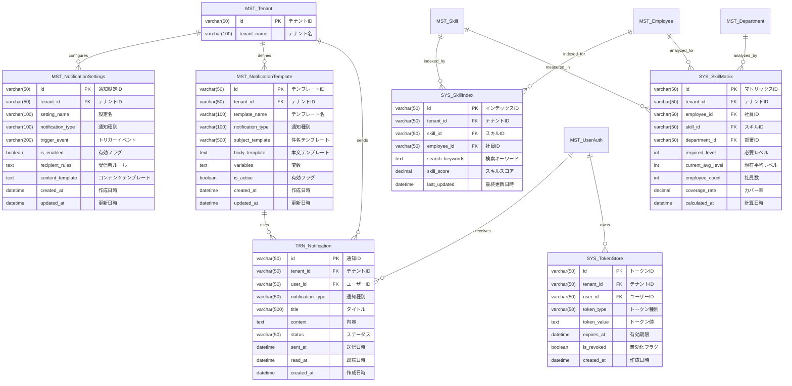

datetime updated_at "更新日時"
        varchar(50) updated_by "更新者"
    }
    
    TRN_SkillEvidence {
        varchar(50) id PK "証跡ID"
        varchar(50) tenant_id FK "テナントID"
        varchar(50) employee_id FK "社員ID"
        varchar(50) skill_id FK "スキルID"
        varchar(100) evidence_type "証跡種別"
        varchar(200) evidence_title "証跡タイトル"
        text description "説明"
        varchar(500) file_path "ファイルパス"
        date evidence_date "証跡日"
        datetime created_at "作成日時"
        datetime updated_at "更新日時"
    }
    
    %% 関連
    MST_Employee ||--o{ MST_CareerPlan : "sets"
    MST_CareerPlan ||--o{ TRN_GoalProgress : "progresses"
    MST_Employee ||--o{ TRN_GoalProgress : "tracks"
    MST_Employee ||--o{ TRN_ProjectRecord : "works_on"
    MST_Employee ||--o{ TRN_SkillEvidence : "provides"
    MST_Skill ||--o{ TRN_SkillEvidence : "evidenced_by"
```

### 3.6 通知・連携管理 + システム系



### 3.7 システム管理 + 履歴系 + ワーク系


---

## 4. 主要エンティティ中心の関連図

### 4.1 MST_Employee中心の関連図

```mermaid
erDiagram
    MST_Employee {
        varchar(50) id PK
        varchar(50) tenant_id FK
        varchar(30) employee_code
        varchar(100) full_name
        varchar(255) email
        varchar(50) department_id FK
        varchar(50) position_id FK
        varchar(50) job_type_id FK
        varchar(50) manager_id FK
    }
    
    MST_UserAuth {
        varchar(50) id PK
        varchar(50) tenant_id FK
        varchar(100) username
        varchar(255) email
    }
    
    MST_Department {
        varchar(50) id PK
        varchar(50) tenant_id FK
        varchar(100) department_name
    }
    
    MST_Position {
        varchar(50) id PK
        varchar(50) tenant_id FK
        varchar(100) position_name
    }
    
    MST_JobType {
        varchar(50) id PK
        varchar(50) tenant_id FK
        varchar(100) job_type_name
    }
    
    TRN_SkillRecord {
        varchar(50) id PK
        varchar(50) tenant_id FK
        varchar(50) employee_id FK
        varchar(50) skill_item_id FK
        int skill_level
    }
    
    TRN_EmployeeSkillGrade {
        varchar(50) id PK
        varchar(50) tenant_id FK
        varchar(50) employee_id FK
        varchar(50) skill_id FK
        varchar(50) grade_id FK
    }
    
    TRN_TrainingHistory {
        varchar(50) id PK
        varchar(50) tenant_id FK
        varchar(50) employee_id FK
        varchar(50) training_program_id FK
    }
    
    TRN_PDU {
        varchar(50) pdu_id PK
        varchar(50) tenant_id FK
        varchar(50) employee_id FK
        varchar(50) certification_id FK
        decimal(5,1) pdu_points
    }
    
    TRN_ProjectRecord {
        varchar(50) id PK
        varchar(50) tenant_id FK
        varchar(50) employee_id FK
        varchar(200) project_name
    }
    
    MST_CareerPlan {
        varchar(50) id PK
        varchar(50) tenant_id FK
        varchar(50) employee_id FK
        varchar(100) plan_name
    }
    
    %% 関連
    MST_UserAuth ||--|| MST_Employee : "authenticates"
    MST_Employee ||--o{ MST_Department : "belongs_to"
    MST_Employee ||--o{ MST_Position : "holds"
    MST_Employee ||--o{ MST_JobType : "works_as"
    MST_Employee ||--o{ MST_Employee : "manages"
    MST_Employee ||--o{ TRN_SkillRecord : "has"
    MST_Employee ||--o{ TRN_EmployeeSkillGrade : "assessed"
    MST_Employee ||--o{ TRN_TrainingHistory : "attends"
    MST_Employee ||--o{ TRN_PDU : "earns"
    MST_Employee ||--o{ TRN_ProjectRecord : "works_on"
    MST_Employee ||--o{ MST_CareerPlan : "sets"
```

### 4.2 TRN_SkillRecord中心の関連図


---

## 5. マルチテナント制約・設計指針

### 5.1 テナント分離制約

```sql
-- 全テーブルにテナント分離制約を追加
-- 例: MST_UserAuth
ALTER TABLE MST_UserAuth 
ADD CONSTRAINT chk_tenant_isolation 
CHECK (tenant_id IS NOT NULL);

-- 複合インデックス（tenant_id + 主要検索キー）
CREATE INDEX idx_userauth_tenant_email 
ON MST_UserAuth (tenant_id, email);

CREATE INDEX idx_skillrecord_tenant_employee 
ON TRN_SkillRecord (tenant_id, employee_id);

CREATE INDEX idx_auditlog_tenant_user_date 
ON HIS_AuditLog (tenant_id, user_id, created_at);
```

### 5.2 参照整合性制約（テナント内）

```sql
-- テナント内参照整合性制約の例
-- MST_UserRole: 同一テナント内でのみ参照可能
ALTER TABLE MST_UserRole 
ADD CONSTRAINT fk_userrole_tenant_user 
FOREIGN KEY (tenant_id, user_id) 
REFERENCES MST_UserAuth (tenant_id, id);

ALTER TABLE MST_UserRole 
ADD CONSTRAINT fk_userrole_tenant_role 
FOREIGN KEY (tenant_id, role_id) 
REFERENCES MST_Role (tenant_id, id);

-- TRN_SkillRecord: 同一テナント内でのみ参照可能
ALTER TABLE TRN_SkillRecord 
ADD CONSTRAINT fk_skillrecord_tenant_employee 
FOREIGN KEY (tenant_id, employee_id) 
REFERENCES MST_Employee (tenant_id, id);

ALTER TABLE TRN_SkillRecord 
ADD CONSTRAINT fk_skillrecord_tenant_skillitem 
FOREIGN KEY (tenant_id, skill_item_id) 
REFERENCES MST_SkillItem (tenant_id, id);
```

### 5.3 パフォーマンス最適化インデックス

```sql
-- スキル関連の複合インデックス
CREATE INDEX idx_empskillgrade_tenant_emp_skill 
ON TRN_EmployeeSkillGrade (tenant_id, employee_id, skill_id);

CREATE INDEX idx_skillmatrix_tenant_dept_skill 
ON SYS_SkillMatrix (tenant_id, department_id, skill_id);

-- 検索・分析用インデックス
CREATE INDEX idx_skillrecord_tenant_category_level 
ON TRN_SkillRecord (tenant_id, skill_category_id, skill_level);

CREATE INDEX idx_traininghistory_tenant_emp_date 
ON TRN_TrainingHistory (tenant_id, employee_id, start_date);

-- 監査・ログ用インデックス
CREATE INDEX idx_auditlog_tenant_resource_date 
ON HIS_AuditLog (tenant_id, resource_type, created_at);

CREATE INDEX idx_systemlog_tenant_level_date 
ON SYS_SystemLog (tenant_id, log_level, created_at);
```

---

## 6. 関連エンティティ抽出ルール

### 6.1 デフォルト設定
- **関連深度**: 2階層
- **最大エンティティ数**: 8テーブル
- **優先順位**: 外部キー関係 > 業務関連性 > 使用頻度

### 6.2 テーブル別カスタム設定

#### MST_Employee中心
- **深度**: 2階層
- **最大エンティティ数**: 10テーブル
- **優先関連**:
  1. MST_UserAuth（認証情報）
  2. MST_Department（部署情報）
  3. MST_Position（役職情報）
  4. MST_JobType（職種情報）
  5. TRN_SkillRecord（スキル記録）
  6. TRN_EmployeeSkillGrade（スキルグレード）

#### TRN_SkillRecord中心
- **深度**: 2階層
- **最大エンティティ数**: 8テーブル
- **優先関連**:
  1. MST_Employee（社員情報）
  2. MST_SkillItem（スキル項目）
  3. MST_SkillCategory（スキルカテゴリ）
  4. TRN_EmployeeSkillGrade（スキルグレード）

#### MST_Skill中心
- **深度**: 2階層
- **最大エンティティ数**: 8テーブル
- **優先関連**:
  1. MST_SkillCategory（スキルカテゴリ）
  2. MST_SkillItem（スキル項目）
  3. TRN_SkillRecord（スキル記録）
  4. TRN_EmployeeSkillGrade（スキルグレード）
  5. SYS_SkillIndex（検索インデックス）
  6. SYS_SkillMatrix（スキルマップ）

#### TRN_PDU中心
- **深度**: 2階層
- **最大エンティティ数**: 8テーブル
- **優先関連**:
  1. MST_Employee（社員情報）
  2. MST_Certification（資格情報）
  3. TRN_TrainingHistory（研修履歴）
  4. TRN_ProjectRecord（案件実績）

---

## 7. 設計原則・ガイドライン

### 7.1 マルチテナント設計原則
1. **完全分離**: 全テーブルにtenant_idを必須とする
2. **参照整合性**: テナント内でのみ外部キー制約を適用
3. **パフォーマンス**: tenant_idを含む複合インデックスを必須とする
4. **セキュリティ**: テナント間のデータ漏洩を防ぐ制約を実装

### 7.2 拡張性設計
1. **階層構造**: カテゴリ・スキル・項目の3階層構造で柔軟性を確保
2. **グレード管理**: スキルレベルとグレードの分離で詳細評価を実現
3. **証跡管理**: スキル証跡テーブルで根拠の明確化
4. **監査機能**: 全操作の追跡・監査機能を標準装備

### 7.3 パフォーマンス設計
1. **インデックス戦略**: tenant_id + 検索キーの複合インデックス
2. **分析テーブル**: SYS_SkillMatrix等で集計済みデータを管理
3. **検索最適化**: SYS_SkillIndexで全文検索を高速化
4. **履歴分離**: 履歴系テーブルで運用データと分析データを分離

---

## 8. 運用・保守指針

### 8.1 データ整合性チェック
- テナント分離制約の定期チェック
- 参照整合性の定期検証
- スキルグレード要件の整合性確認

### 8.2 パフォーマンス監視
- インデックス使用状況の監視
- クエリパフォーマンスの定期測定
- テナント別使用量の監視

### 8.3 セキュリティ管理
- テナント間データ分離の検証
- アクセス権限の定期監査
- 監査ログの定期分析

---

## 9. まとめ

本エンティティ関連図は、entity_relationships.yaml v2.0.0を基に作成された、マルチテナント対応スキル管理システムの完全なデータベース設計図です。

### 主要特徴
- **48テーブル**の包括的な設計
- **マルチテナント完全分離**アーキテクチャ
- **スキル管理の3階層構造**（カテゴリ・スキル・項目）
- **詳細なグレード管理**システム
- **包括的な監査・履歴機能**

### 設計の利点
1. **拡張性**: 新しいテナントや機能の容易な追加
2. **セキュリティ**: 完全なテナント分離によるデータ保護
3. **パフォーマンス**: 最適化されたインデックス戦略
4. **保守性**: 明確な関連定義と制約設計

この設計により、企業グループ全体のスキル管理を効率的かつ安全に実現できます。
