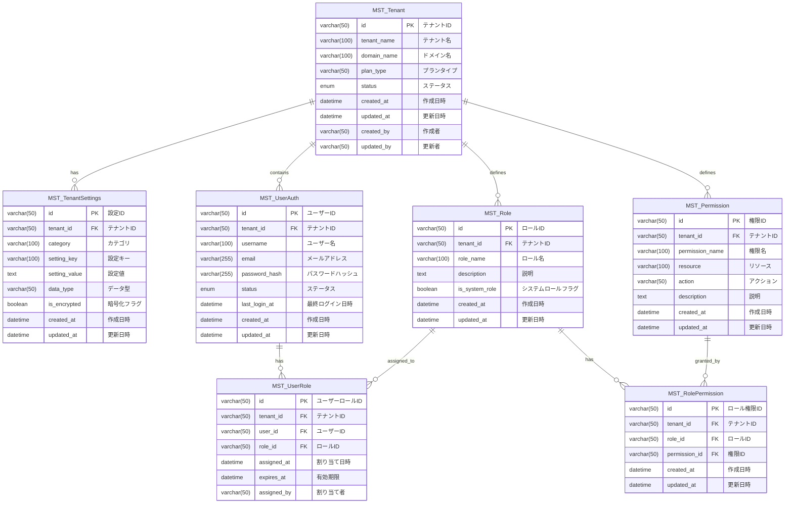
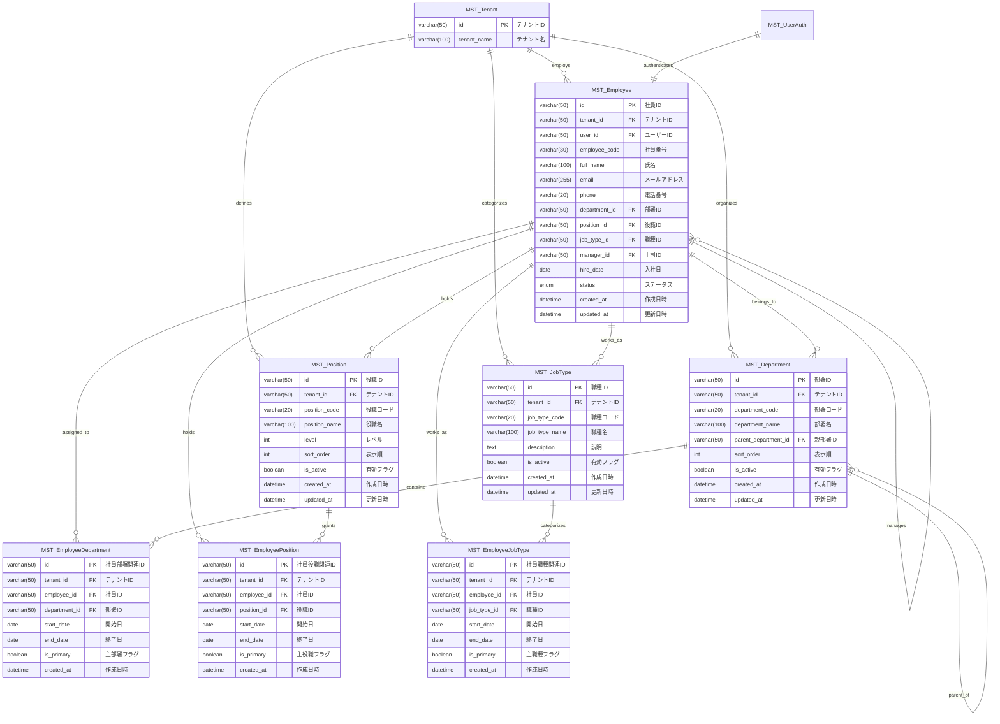
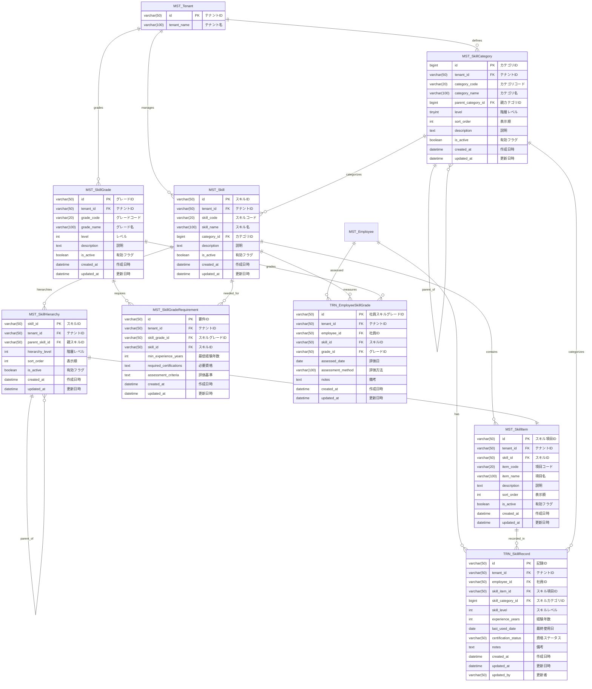

# エンティティ関連図: マルチテナント対応スキル管理システム（統合版）

## 1. 文書基本情報

- **文書名**: エンティティ関連図（統合版）
- **プロジェクト名**: 年間スキル報告書WEB化PJT - マルチテナント対応
- **対象システム**: ホールディングス・グループ会社向けマルチテナントSaaS基盤
- **作成日**: 2025/06/01
- **作成者**: システムアーキテクト
- **ベースファイル**: entity_relationships.yaml v2.0.0
- **総テーブル数**: 48テーブル
- **統合元ファイル**: 
  - エンティティ関連図.md
  - エンティティ関連図_完全版.md
  - エンティティ関連図_完全版_追加.md

---

## 2. システム全体概要図

### 2.1 テーブルカテゴリ別構成（48テーブル）

```mermaid
graph TB
    subgraph "🏢 マルチテナント基盤（2テーブル）"
        MST_Tenant[MST_Tenant<br/>テナント管理]
        MST_TenantSettings[MST_TenantSettings<br/>テナント設定]
    end
    
    subgraph "🔐 認証・認可（6テーブル）"
        MST_UserAuth[MST_UserAuth<br/>ユーザー認証情報]
        MST_Role[MST_Role<br/>ロール情報]
        MST_Permission[MST_Permission<br/>権限情報]
        MST_UserRole[MST_UserRole<br/>ユーザーロール関連]
        MST_RolePermission[MST_RolePermission<br/>ロール権限紐付け]
    end
    
    subgraph "👥 組織・プロフィール（7テーブル）"
        MST_Employee[MST_Employee<br/>社員基本情報]
        MST_Department[MST_Department<br/>部署マスタ]
        MST_Position[MST_Position<br/>役職マスタ]
        MST_JobType[MST_JobType<br/>職種マスタ]
        MST_EmployeeDepartment[MST_EmployeeDepartment<br/>社員部署関連]
        MST_EmployeePosition[MST_EmployeePosition<br/>社員役職関連]
        MST_EmployeeJobType[MST_EmployeeJobType<br/>社員職種関連]
    end
    
    subgraph "🎯 スキル管理（10テーブル）"
        MST_SkillCategory[MST_SkillCategory<br/>スキルカテゴリマスタ]
        MST_Skill[MST_Skill<br/>スキルマスタ]
        MST_SkillHierarchy[MST_SkillHierarchy<br/>スキル階層マスタ]
        MST_SkillItem[MST_SkillItem<br/>スキル項目マスタ]
        MST_SkillGrade[MST_SkillGrade<br/>スキルグレードマスタ]
        MST_SkillGradeRequirement[MST_SkillGradeRequirement<br/>スキルグレード要件]
        MST_JobTypeSkill[MST_JobTypeSkill<br/>職種スキル関連]
        MST_JobTypeSkillGrade[MST_JobTypeSkillGrade<br/>職種スキルグレード関連]
        TRN_EmployeeSkillGrade[TRN_EmployeeSkillGrade<br/>社員スキルグレード]
    end
    
    subgraph "📜 資格・研修管理（4テーブル）"
        MST_Certification[MST_Certification<br/>資格情報]
        MST_CertificationRequirement[MST_CertificationRequirement<br/>資格要件マスタ]
        MST_TrainingProgram[MST_TrainingProgram<br/>研修プログラム]
    end
    
    subgraph "🎯 目標・キャリア管理（2テーブル）"
        MST_CareerPlan[MST_CareerPlan<br/>目標・キャリアプラン]
        TRN_GoalProgress[TRN_GoalProgress<br/>目標進捗]
    end
    
    subgraph "📊 トランザクション系（6テーブル）"
        TRN_SkillRecord[TRN_SkillRecord<br/>スキル情報]
        TRN_ProjectRecord[TRN_ProjectRecord<br/>案件実績]
        TRN_TrainingHistory[TRN_TrainingHistory<br/>研修参加履歴]
        TRN_PDU[TRN_PDU<br/>継続教育ポイント]
        TRN_SkillEvidence[TRN_SkillEvidence<br/>スキル証跡]
        TRN_Notification[TRN_Notification<br/>通知履歴]
    end
    
    subgraph "🔔 通知・連携管理（2テーブル）"
        MST_NotificationSettings[MST_NotificationSettings<br/>通知設定]
        MST_NotificationTemplate[MST_NotificationTemplate<br/>通知テンプレート]
    end
    
    subgraph "⚙️ システム管理（2テーブル）"
        MST_SystemConfig[MST_SystemConfig<br/>システム設定]
        MST_ReportTemplate[MST_ReportTemplate<br/>帳票テンプレート]
    end
    
    subgraph "💾 システム系（8テーブル）"
        SYS_SkillIndex[SYS_SkillIndex<br/>スキル検索インデックス]
        SYS_SkillMatrix[SYS_SkillMatrix<br/>スキルマップ]
        SYS_BackupHistory[SYS_BackupHistory<br/>バックアップ履歴]
        SYS_SystemLog[SYS_SystemLog<br/>システムログ]
        SYS_TokenStore[SYS_TokenStore<br/>トークン管理]
        SYS_MasterData[SYS_MasterData<br/>マスタデータ全般]
        SYS_TenantUsage[SYS_TenantUsage<br/>テナント使用量]
        SYS_IntegrationConfig[SYS_IntegrationConfig<br/>外部連携設定]
    end
    
    subgraph "📋 履歴系（3テーブル）"
        HIS_AuditLog[HIS_AuditLog<br/>監査ログ]
        HIS_NotificationLog[HIS_NotificationLog<br/>通知送信履歴]
        HIS_TenantBilling[HIS_TenantBilling<br/>テナント課金履歴]
    end
    
    subgraph "⚡ ワーク系（1テーブル）"
        WRK_BatchJobLog[WRK_BatchJobLog<br/>一括登録ジョブログ]
    end
    
    %% 主要な関連線
    MST_Tenant --> MST_UserAuth
    MST_Tenant --> MST_Employee
    MST_Tenant --> TRN_SkillRecord
    MST_Employee --> TRN_SkillRecord
    MST_SkillCategory --> MST_Skill
    MST_Skill --> MST_SkillItem
    TRN_SkillRecord --> MST_SkillItem
```



### 2.2 マルチテナント設計方針

**テナント分離**と**データ整合性**を重視したエンティティ設計：

1. **完全テナント分離**: 全エンティティにtenant_idを追加してデータ分離
2. **参照整合性**: テナント内でのみ外部キー制約を適用
3. **拡張性**: 新しいテナント固有機能の容易な追加
4. **監査性**: 全操作の追跡・監査機能
5. **パフォーマンス**: tenant_idを含む複合インデックス戦略

---

## 3. 詳細エンティティ関連図

### 3.1 マルチテナント基盤 + 認証・認可



### 3.2 組織・プロフィール管理



### 3.3 スキル管理（コア）



### 3.4 職種スキル関連 + 資格・研修管理

```mermaid
erDiagram
    MST_JobType {
        varchar(50) id PK "職種ID"
        varchar(50) tenant_id FK "テナントID"
        varchar(100) job_type_name "職種名"
    }
    
    MST_JobTypeSkill {
        varchar(50) id PK "職種スキル関連ID"
        varchar(50) tenant_id FK "テナントID"
        varchar(50) job_type_id FK "職種ID"
        varchar(50) skill_item_id FK "スキル項目ID"
        int required_level "必要レベル"
        boolean is_mandatory "必須フラグ"
        datetime created_at "作成日時"
        datetime updated_at "更新日時"
    }
    
    MST_JobTypeSkillGrade {
        varchar(50) id PK "職種スキルグレード関連ID"
        varchar(50) tenant_id FK "テナントID"
        varchar(50) job_type_id FK "職種ID"
        varchar(50) skill_grade_id FK "スキルグレードID"
        int required_level "必要レベル"
        datetime created_at "作成日時"
        datetime updated_at "更新日時"
    }
    
    MST_Certification {
        varchar(50) id PK "資格ID"
        varchar(50) tenant_id FK "テナントID"
        varchar(20) certification_code "資格コード"
        varchar(100) certification_name "資格名"
        varchar(200) issuing_organization "発行機関"
        int validity_period_months "有効期間（月）"
        boolean is_active "有効フラグ"
        datetime created_at "作成日時"
        datetime updated_at "更新日時"
    }
    
    MST_CertificationRequirement {
        varchar(50) id PK "要件ID"
        varchar(50) tenant_id FK "テナントID"
        varchar(50) certification_id FK "資格ID"
        varchar(50) target_skill_grade_id FK "対象スキルグレードID"
        int required_level "必要レベル"
        boolean is_mandatory "必須フラグ"
        datetime created_at "作成日時"
        datetime updated_at "更新日時"
    }
    
    MST_TrainingProgram {
        varchar(50) id PK "研修プログラムID"
        varchar(50) tenant_id FK "テナントID"
        varchar(20) program_code "プログラムコード"
        varchar(100) program_name "プログラム名"
        text description "説明"
        int duration_hours "時間数"
        varchar(50) level "レベル"
        boolean is_active "有効フラグ"
        datetime created_at "作成日時"
        datetime updated_at "更新日時"
    }
    
    TRN_PDU {
        varchar(50) pdu_id PK "PDU ID"
        varchar(50) tenant_id FK "テナントID"
        varchar(50) employee_id FK "社員ID"
        varchar(50) certification_id FK "資格ID"
        enum activity_type "活動種別"
        varchar(200) activity_name "活動名"
        date activity_date "活動日"
        decimal(5,1) pdu_points "PDUポイント"
        varchar(50) certification_type "資格種別"
        text description "説明"
        datetime created_at "作成日時"
        datetime updated_at "更新日時"
    }
    
    TRN_TrainingHistory {
        varchar(50) id PK "研修履歴ID"
        varchar(50) tenant_id FK "テナントID"
        varchar(50) employee_id FK "社員ID"
        varchar(50) training_program_id FK "研修プログラムID"
        varchar(200) training_name "研修名"
        varchar(50) training_type "研修種別"
        date start_date "開始日"
        date end_date "終了日"
        decimal training_hours "研修時間"
        varchar(50) completion_status "完了ステータス"
        text notes "備考"
        datetime created_at "作成日時"
        datetime updated_at "更新日時"
    }
    
    %% 関連
    MST_JobType ||--o{ MST_JobTypeSkill : "requires"
    MST_JobType ||--o{ MST_JobTypeSkillGrade : "grades"
    MST_SkillItem ||--o{ MST_JobTypeSkill : "used_in"
    MST_SkillGrade ||--o{ MST_JobTypeSkillGrade : "required_for"
    MST_Certification ||--o{ MST_CertificationRequirement : "requires"
    MST_SkillGrade ||--o{ MST_CertificationRequirement : "needed_for"
    MST_Employee ||--o{ TRN_PDU : "earns"
    MST_Certification ||--o{ TRN_PDU : "related_to"
    MST_Employee ||--o{ TRN_TrainingHistory : "attends"
    MST_TrainingProgram ||--o{ TRN_TrainingHistory : "provides"
```

### 3.5 目標・キャリア管理 + 案件実績

```mermaid
erDiagram
    MST_Employee {
        varchar(50) id PK "社員ID"
        varchar(50) tenant_id FK "テナントID"
        varchar(100) full_name "氏名"
    }
    
    MST_CareerPlan {
        varchar(50) id PK
