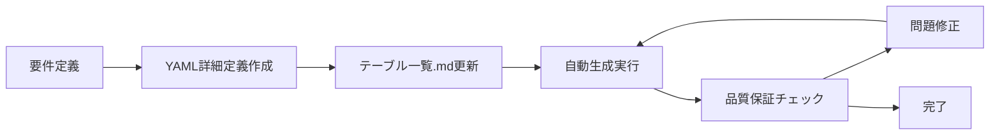

# テーブル一覧

以下は、マスタ系・トランザクション系・履歴系・システム系・ワーク系・インターフェイス系のカテゴリに分け、  
**テーブル名のプレフィックスで各カテゴリを識別できる命名規則**を適用したテーブル一覧です。

データ量見積もり、パフォーマンス要件、運用特性を含む拡張版です。

| テーブルID | カテゴリ | テーブル名 | 論理名 | 主な利用機能カテゴリ | 主な利用API ID | 主な利用バッチID | 優先度 | 初期データ件数 | 月間増加件数 | 年間増加件数 | 5年後想定件数 | SELECT応答時間 | INSERT応答時間 | UPDATE応答時間 | DELETE応答時間 | 個人情報含有 | 機密情報レベル | 暗号化要否 | アーカイブ条件 | 備考・関連画面例 |
|------------|----------|------------|--------|---------------------|---------------|------------------|--------|----------------|--------------|--------------|---------------|----------------|----------------|----------------|----------------|--------------|----------------|------------|----------------|------------------|
| TBL-001 | マスタ系 | MST_UserAuth | ユーザー認証情報 | 認証・認可 | API-001, API-002 | BATCH-001, BATCH-002, BATCH-003, BATCH-017 | 最高 | 50件 | 10件 | 120件 | 650件 | 5ms以内 | 20ms以内 | 20ms以内 | 50ms以内 | あり | 高 | 要 | 無効化から5年経過 | SCR-LOGIN, SCR-ACCESS |
| TBL-002 | マスタ系 | MST_Role | ロール情報 | 認証・認可 | API-003 | BATCH-003 | 高 | 10件 | 1件 | 12件 | 70件 | 5ms以内 | 20ms以内 | 20ms以内 | 50ms以内 | なし | 中 | 不要 | 無効化から3年経過 | SCR-ACCESS |
| TBL-003 | マスタ系 | MST_Permission | 権限情報 | 認証・認可 | API-003, API-004 | BATCH-003 | 高 | 50件 | 5件 | 60件 | 350件 | 5ms以内 | 20ms以内 | 20ms以内 | 50ms以内 | なし | 中 | 不要 | 無効化から3年経過 | SCR-ACCESS |
| TBL-004 | マスタ系 | MST_UserRole | ユーザーロール紐付け | 認証・認可 | API-004 | BATCH-003 | 高 | 100件 | 20件 | 240件 | 1,300件 | 5ms以内 | 20ms以内 | 20ms以内 | 50ms以内 | なし | 中 | 不要 | 無効化から3年経過 | SCR-ACCESS |
| TBL-006 | マスタ系 | MST_Employee | 社員基本情報 | プロフィール管理 | API-005 | BATCH-004 | 最高 | 500件 | 20件 | 240件 | 1,700件 | 10ms以内 | 30ms以内 | 30ms以内 | 100ms以内 | あり | 高 | 要 | 退職から7年経過 | SCR-PROFILE |
| TBL-007 | マスタ系 | MST_Department | 部署マスタ | プロフィール管理 | API-006 | BATCH-004, BATCH-015 | 最高 | 50件 | 2件 | 24件 | 170件 | 5ms以内 | 20ms以内 | 20ms以内 | 50ms以内 | なし | 低 | 不要 | 無効化から3年経過 | SCR-PROFILE, SCR-ADMIN |
| TBL-008 | マスタ系 | MST_Position | 役職マスタ | プロフィール管理 | API-006 | BATCH-004, BATCH-015 | 最高 | 30件 | 1件 | 12件 | 90件 | 5ms以内 | 20ms以内 | 20ms以内 | 50ms以内 | なし | 低 | 不要 | 無効化から3年経過 | SCR-PROFILE, SCR-ADMIN |
| TBL-009 | マスタ系 | MST_SkillHierarchy | スキル階層マスタ | スキル管理 | API-007 | BATCH-005 | 高 | 100件 | 10件 | 120件 | 700件 | 10ms以内 | 30ms以内 | 30ms以内 | 50ms以内 | なし | 低 | 不要 | 無効化から3年経過 | SCR-SKILL-M |
| TBL-011 | マスタ系 | MST_Certification | 資格情報 | スキル管理 | API-009, API-010 | BATCH-007 | 高 | 200件 | 5件 | 60件 | 500件 | 10ms以内 | 30ms以内 | 30ms以内 | 50ms以内 | なし | 低 | 不要 | 無効化から3年経過 | SCR-SKILL, SCR-SKILL-M |
| TBL-013 | マスタ系 | MST_CareerPlan | 目標・キャリアプラン | 目標・キャリア管理 | API-012 | BATCH-008 | 中 | 50件 | 10件 | 120件 | 650件 | 10ms以内 | 30ms以内 | 30ms以内 | 50ms以内 | なし | 低 | 不要 | 無効化から3年経過 | SCR-CAR-PLAN |
| TBL-019 | マスタ系 | MST_ReportTemplate | 帳票テンプレート | レポート・分析 | API-018 | BATCH-012 | 低 | 20件 | 2件 | 24件 | 140件 | 10ms以内 | 30ms以内 | 30ms以内 | 50ms以内 | なし | 低 | 不要 | 無効化から3年経過 | SCR-REPORT |
| TBL-023 | マスタ系 | MST_SystemConfig | システム設定 | システム管理 | API-024 | BATCH-016 | 低 | 100件 | 5件 | 60件 | 400件 | 10ms以内 | 30ms以内 | 30ms以内 | 50ms以内 | なし | 中 | 不要 | 無効化から3年経過 | SCR-ADMIN |
| TBL-026 | マスタ系 | MST_Tenant | テナント管理 | マルチテナント管理 | API-025 | BATCH-018-01, BATCH-018-02 | 最高 | 10件 | 5件 | 60件 | 310件 | 5ms以内 | 20ms以内 | 20ms以内 | 100ms以内 | あり | 高 | 要 | 契約終了から5年経過 | SCR-TENANT-ADMIN |
| TBL-027 | マスタ系 | MST_TenantSettings | テナント設定 | マルチテナント管理 | API-026 | BATCH-018-05 | 最高 | 50件 | 10件 | 120件 | 650件 | 5ms以内 | 20ms以内 | 20ms以内 | 50ms以内 | なし | 中 | 不要 | 無効化から3年経過 | SCR-TENANT-ADMIN |
| TBL-028 | マスタ系 | MST_NotificationSettings | 通知設定 | 通知・連携管理 | API-028 | BATCH-019-05 | 高 | 30件 | 5件 | 60件 | 330件 | 10ms以内 | 30ms以内 | 30ms以内 | 50ms以内 | なし | 低 | 不要 | 無効化から3年経過 | SCR-NOTIFY-ADMIN |
| TBL-029 | マスタ系 | MST_NotificationTemplate | 通知テンプレート | 通知・連携管理 | API-029 | BATCH-019-01 | 高 | 50件 | 5件 | 60件 | 350件 | 10ms以内 | 30ms以内 | 30ms以内 | 50ms以内 | なし | 低 | 不要 | 無効化から3年経過 | SCR-NOTIFY-ADMIN |
| TBL-034 | マスタ系 | MST_SkillCategory | スキルカテゴリマスタ | スキル管理 | API-030 | BATCH-020 | 高 | 50件 | 5件 | 60件 | 350件 | 10ms以内 | 30ms以内 | 30ms以内 | 50ms以内 | なし | 低 | 不要 | 無効化から3年経過 | SCR-SKILL-M |
| TBL-035 | マスタ系 | MST_JobType | 職種マスタ | プロフィール管理 | API-031 | BATCH-027 | 最高 | 30件 | 2件 | 24件 | 150件 | 5ms以内 | 20ms以内 | 20ms以内 | 50ms以内 | なし | 低 | 不要 | 無効化から3年経過 | SCR-PROFILE, SCR-ADMIN |
| TBL-036 | マスタ系 | MST_SkillGrade | スキルグレードマスタ | スキル管理 | API-032 | BATCH-028 | 高 | 20件 | 2件 | 24件 | 140件 | 10ms以内 | 30ms以内 | 30ms以内 | 50ms以内 | なし | 低 | 不要 | 無効化から3年経過 | SCR-SKILL-M |
| TBL-037 | マスタ系 | MST_CertificationRequirement | 資格要件マスタ | スキル管理 | API-033 | BATCH-029 | 高 | 100件 | 10件 | 120件 | 700件 | 10ms以内 | 30ms以内 | 30ms以内 | 50ms以内 | なし | 低 | 不要 | 無効化から3年経過 | SCR-SKILL-M |
| TBL-038 | マスタ系 | MST_EmployeeJobType | 社員職種関連 | プロフィール管理 | API-034 | BATCH-030 | 最高 | 500件 | 20件 | 240件 | 1,700件 | 10ms以内 | 30ms以内 | 30ms以内 | 50ms以内 | なし | 中 | 不要 | 無効化から3年経過 | SCR-PROFILE, SCR-ADMIN |
| TBL-039 | マスタ系 | MST_JobTypeSkillGrade | 職種スキルグレード関連 | スキル管理 | API-035 | BATCH-031 | 高 | 200件 | 20件 | 240件 | 1,400件 | 10ms以内 | 30ms以内 | 30ms以内 | 50ms以内 | なし | 低 | 不要 | 無効化から3年経過 | SCR-SKILL-M |
| TBL-040 | マスタ系 | MST_SkillGradeRequirement | スキルグレード要件 | スキル管理 | API-036 | BATCH-032 | 高 | 100件 | 10件 | 120件 | 700件 | 10ms以内 | 30ms以内 | 30ms以内 | 50ms以内 | なし | 低 | 不要 | 無効化から3年経過 | SCR-SKILL-M |
| TBL-041 | マスタ系 | MST_JobTypeSkill | 職種スキル関連 | スキル管理 | API-037 | BATCH-033 | 高 | 300件 | 30件 | 360件 | 2,100件 | 10ms以内 | 30ms以内 | 30ms以内 | 50ms以内 | なし | 低 | 不要 | 無効化から3年経過 | SCR-SKILL-M |
| TBL-042 | マスタ系 | MST_EmployeeDepartment | 社員部署関連 | プロフィール管理 | API-020 | BATCH-025 | 最高 | 500件 | 30件 | 360件 | 2,300件 | 10ms以内 | 30ms以内 | 30ms以内 | 50ms以内 | なし | 中 | 不要 | 無効化から3年経過 | SCR-PROFILE, SCR-ADMIN |
| TBL-043 | マスタ系 | MST_EmployeePosition | 社員役職関連 | プロフィール管理 | API-021 | BATCH-026 | 最高 | 500件 | 20件 | 240件 | 1,700件 | 10ms以内 | 30ms以内 | 30ms以内 | 50ms以内 | なし | 中 | 不要 | 無効化から3年経過 | SCR-PROFILE, SCR-ADMIN |
| TBL-044 | マスタ系 | MST_SkillItem | スキル項目マスタ | スキル管理 | API-038 | BATCH-034 | 高 | 500件 | 50件 | 600件 | 3,500件 | 10ms以内 | 30ms以内 | 30ms以内 | 50ms以内 | なし | 低 | 不要 | 無効化から3年経過 | SCR-SKILL-M |
| TBL-045 | マスタ系 | MST_TrainingProgram | 研修プログラム | 研修・教育管理 | API-039 | BATCH-035 | 中 | 100件 | 20件 | 240件 | 1,300件 | 10ms以内 | 30ms以内 | 30ms以内 | 50ms以内 | なし | 低 | 不要 | 無効化から3年経過 | SCR-TRAIN-M |
| TBL-010 | トランザクション系 | TRN_SkillRecord | スキル情報 | スキル管理 | API-008 | BATCH-006 | 最高 | 1000件 | 500件 | 6000件 | 31,000件 | 15ms以内 | 50ms以内 | 50ms以内 | 100ms以内 | なし | 中 | 不要 | 作成から3年経過 | SCR-SKILL |
| TBL-048 | トランザクション系 | TRN_EmployeeSkillGrade | 社員スキルグレード | スキル管理 | API-042 | BATCH-038 | 最高 | 1000件 | 200件 | 2400件 | 12,500件 | 15ms以内 | 50ms以内 | 50ms以内 | 100ms以内 | なし | 中 | 不要 | 作成から3年経過 | SCR-SKILL |
| TBL-014 | トランザクション系 | TRN_GoalProgress | 目標進捗 | 目標・キャリア管理 | API-013 | BATCH-008 | 中 | 500件 | 200件 | 2400件 | 12,500件 | 15ms以内 | 50ms以内 | 50ms以内 | 100ms以内 | なし | 低 | 不要 | 作成から3年経過 | SCR-CAR-EVAL |
| TBL-015 | トランザクション系 | TRN_ProjectRecord | 案件実績 | 作業実績管理 | API-014 | BATCH-009 | 中 | 200件 | 100件 | 1200件 | 6,200件 | 15ms以内 | 50ms以内 | 50ms以内 | 100ms以内 | なし | 中 | 不要 | 作成から5年経過 | SCR-WORK |
| TBL-017 | トランザクション系 | TRN_TrainingHistory | 研修参加履歴 | 研修・教育管理 | API-016 | BATCH-011 | 中 | 500件 | 300件 | 3600件 | 18,500件 | 15ms以内 | 50ms以内 | 50ms以内 | 100ms以内 | あり | 中 | 不要 | 作成から5年経過 | SCR-TRAIN |
| TBL-018 | トランザクション系 | TRN_PDU | 継続教育ポイント | 研修・教育管理 | API-017 | BATCH-011 | 中 | 200件 | 100件 | 1200件 | 6,200件 | 15ms以内 | 50ms以内 | 50ms以内 | 100ms以内 | なし | 低 | 不要 | 作成から3年経過 | SCR-TRAIN-M |
| TBL-046 | トランザクション系 | TRN_SkillEvidence | スキル証跡 | スキル管理 | API-040 | BATCH-036 | 中 | 500件 | 200件 | 2400件 | 12,500件 | 15ms以内 | 50ms以内 | 50ms以内 | 100ms以内 | なし | 中 | 不要 | 作成から3年経過 | SCR-SKILL |
| TBL-047 | トランザクション系 | TRN_Notification | 通知履歴 | 通知・連携管理 | API-041 | BATCH-037 | 中 | 100件 | 1000件 | 12000件 | 61,000件 | 20ms以内 | 30ms以内 | 50ms以内 | 50ms以内 | なし | 低 | 不要 | 作成から1年経過 | SCR-NOTIFY |
| TBL-012 | システム系 | SYS_SkillIndex | スキル検索インデックス | スキル管理 | API-011 | BATCH-006 | 高 | 1000件 | 1000件 | 12000件 | 61,000件 | 5ms以内 | 100ms以内 | 100ms以内 | 200ms以内 | なし | 低 | 不要 | 作成から1年経過 | SCR-SKILL-SEARCH |
| TBL-020 | システム系 | SYS_SkillMatrix | スキルマップ | レポート・分析 | API-019 | BATCH-006 | 低 | 500件 | 500件 | 6000件 | 31,000件 | 20ms以内 | 100ms以内 | 100ms以内 | 200ms以内 | なし | 低 | 不要 | 作成から2年経過 | SCR-SKILL-MAP |
| TBL-021 | システム系 | SYS_BackupHistory | バックアップ履歴 | システム管理 | API-020 | BATCH-013 | 高 | 100件 | 1000件 | 12000件 | 61,000件 | 20ms以内 | 30ms以内 | 50ms以内 | 50ms以内 | なし | 低 | 不要 | 作成から1年経過 | SCR-ADMIN |
| TBL-022 | システム系 | SYS_SystemLog | システムログ | システム管理 | API-021 | BATCH-014 | 高 | 1000件 | 10000件 | 120000件 | 601,000件 | 30ms以内 | 20ms以内 | 50ms以内 | 50ms以内 | なし | 中 | 不要 | 作成から6ヶ月経過 | SCR-ADMIN |
| TBL-024 | システム系 | SYS_TokenStore | トークン管理 | 認証・認可 | API-001, API-002 | BATCH-017 | 高 | 100件 | 2000件 | 24000件 | 121,000件 | 5ms以内 | 20ms以内 | 20ms以内 | 20ms以内 | なし | 高 | 要 | 作成から1日経過 | セッション管理 |
| TBL-025 | システム系 | SYS_MasterData | マスタデータ全般 | システム管理 | API-023 | BATCH-015 | 低 | 1000件 | 100件 | 1200件 | 6,000件 | 20ms以内 | 100ms以内 | 100ms以内 | 200ms以内 | なし | 低 | 不要 | 作成から3年経過 | SCR-ADMIN |
| TBL-030 | システム系 | SYS_TenantUsage | テナント使用量 | マルチテナント管理 | API-025 | BATCH-018-01 | 高 | 100件 | 3000件 | 36000件 | 181,000件 | 20ms以内 | 30ms以内 | 50ms以内 | 50ms以内 | なし | 中 | 不要 | 作成から2年経過 | SCR-TENANT-ADMIN |
| TBL-031 | システム系 | SYS_IntegrationConfig | 外部連携設定 | 通知・連携管理 | API-028, API-029 | BATCH-019-03 | 高 | 50件 | 10件 | 120件 | 650件 | 15ms以内 | 50ms以内 | 50ms以内 | 100ms以内 | なし | 中 | 不要 | 無効化から3年経過 | SCR-NOTIFY-ADMIN |
| TBL-005 | 履歴系 | HIS_AuditLog | 監査ログ | 認証・認可・システム管理 | API-022 | BATCH-003, BATCH-014 | 高 | 1000件 | 5000件 | 60000件 | 301,000件 | 30ms以内 | 20ms以内 | 100ms以内 | 100ms以内 | あり | 高 | 要 | 作成から7年経過 | SCR-ACCESS, SCR-ADMIN |
| TBL-032 | 履歴系 | HIS_NotificationLog | 通知送信履歴 | 通知・連携管理 | API-029 | BATCH-019-04 | 中 | 500件 | 2000件 | 24000件 | 121,000件 | 30ms以内 | 20ms以内 | 100ms以内 | 100ms以内 | なし | 低 | 不要 | 作成から2年経過 | SCR-NOTIFY-ADMIN |
| TBL-033 | 履歴系 | HIS_TenantBilling | テナント課金履歴 | マルチテナント管理 | API-025 | BATCH-018-02 | 高 | 100件 | 1000件 | 12000件 | 61,000件 | 30ms以内 | 20ms以内 | 100ms以内 | 100ms以内 | あり | 高 | 要 | 作成から7年経過 | SCR-TENANT-ADMIN |
| TBL-049 | 履歴系 | HIS_ReportGeneration | 帳票生成履歴 | レポート・分析 | API-018 | BATCH-012 | 中 | 100件 | 500件 | 6000件 | 31,000件 | 30ms以内 | 20ms以内 | 100ms以内 | 100ms以内 | なし | 中 | 不要 | 作成から1年経過 | SCR-REPORT |
| TBL-016 | ワーク系 | WRK_BatchJobLog | 一括登録ジョブログ | 作業実績管理 | API-015 | BATCH-010 | 低 | 100件 | 500件 | 6000件 | 31,000件 | 50ms以内 | 100ms以内 | 100ms以内 | 50ms以内 | なし | 低 | 不要 | 作成から3ヶ月経過 | SCR-WORK-BULK |

## カテゴリ別特性

### マスタ系テーブル
- **データ特性**: 少量、安定的な増加
- **パフォーマンス**: 高速参照重視（5-10ms）
- **運用**: 長期保持、無効化から3-5年でアーカイブ
- **セキュリティ**: 個人情報含有テーブルは暗号化必須

### トランザクション系テーブル
- **データ特性**: 中〜大量、継続的な増加
- **パフォーマンス**: バランス重視（15-50ms）
- **運用**: 定期アーカイブ（3-5年）
- **セキュリティ**: 業務データレベル

### システム系テーブル
- **データ特性**: 大量、急速な増加
- **パフォーマンス**: 書き込み重視、参照は許容範囲
- **運用**: 短期保持（1-2年）、頻繁アーカイブ
- **セキュリティ**: システム情報レベル

### 履歴系テーブル
- **データ特性**: 大量、継続的な蓄積
- **パフォーマンス**: 書き込み重視、参照は低頻度
- **運用**: 法的要件に応じた長期保持（7年）
- **セキュリティ**: 監査証跡として高セキュリティ

### ワーク系テーブル
- **データ特性**: 一時的、処理完了後削除
- **パフォーマンス**: 処理効率重視
- **運用**: 短期保持（3ヶ月）
- **セキュリティ**: 低レベル

## 運用指針

1. **データ量監視**: 想定値の150%を超えた場合はアラート
2. **パフォーマンス監視**: 応答時間が設定値の120%を超えた場合は調査
3. **アーカイブ実行**: 各テーブルの条件に従い自動実行
4. **セキュリティ監査**: 個人情報・機密情報含有テーブルは月次監査

## カテゴリとプレフィックス対応

| カテゴリ         | プレフィックス | 用途例                                                         |
|------------------|---------------|---------------------------------------------------------------|
| マスタ系         | MST_          | ユーザー、ロール、部署、役職、スキル階層、資格、システム設定等 |
| トランザクション系 | TRN_          | スキル情報、目標進捗、案件実績、研修参加履歴、PDU等            |
| 履歴系           | HIS_          | 監査ログ、操作履歴等                                           |
| システム系       | SYS_          | 検索インデックス、バックアップ履歴、システムログ、トークン等    |
| ワーク系         | WRK_          | 一括登録ジョブログ、バッチワーク等                             |
| インターフェイス系 | IF_           | 外部連携・インポート/エクスポート用一時テーブル                |

**この命名規則により、テーブル名を見るだけでカテゴリが分かり、設計・運用・監査が容易になります。**

## 🛠️ テーブル定義書作成ツール

テーブル定義書の自動生成については、以下のツールドキュメントを参照してください：

**📖 [テーブル定義書作成ツール - 詳細ガイド](tools/README.md)**

### 🚀 主要機能
- **テーブル定義書生成**: YAMLからMarkdown形式の定義書を自動生成
- **DDL生成**: CREATE TABLE文、インデックス、外部キー制約などを生成
- **INSERT文生成**: サンプルデータからINSERT文を生成

## 🔧 インストール・セットアップ

### 前提条件
- Python 3.8以上
- 標準ライブラリのみ使用（外部依存なし）

### 1. 動作確認
```bash
cd ~/skill-report-web/docs/design/database/tools
python3 -m table_generator --help
python run_check.py --help
```

### 2. テストデータについて
- **YAML駆動**: テストデータはYAMLファイルの`sample_data`セクションで定義
- **手動作成**: 各テーブルごとに業務要件に沿った高品質なサンプルデータを手動作成
- **外部依存なし**: Fakerライブラリ等の外部ライブラリは不要
- **軽量設計**: 標準ライブラリのみで動作する軽量な実装

### 3. 設計思想
- **YAML駆動**: すべてのテーブル定義はYAMLファイルで管理
- **品質重視**: 業務ロジックに沿った現実的なテストデータ
- **保守性**: データ内容が明確で変更・カスタマイズが容易
- **一貫性**: 統一されたフォーマットでの定義書・DDL・データ生成

### 📋 基本的な使用方法
```bash
cd ~/skill-report-web/docs/design/database/tools
python3 -m table_generator
```

### 📚 詳細情報
- インストール手順
- コマンドラインオプション
- 出力ファイルの種類
- 開発・カスタマイズ方法
- トラブルシューティング

**すべての詳細は [tools/README.md](tools/README.md) をご確認ください。**

---

# 🎯 DB設計方針・開発ガイドライン

## テーブル定義書作成ツールを活用した統合ワークフロー

### 🔄 設計プロセス


#### Phase 1: 設計フェーズ
1. **要件定義**: 業務要件からテーブル仕様を策定
2. **YAML詳細定義作成**: `table-details/{テーブル名}_details.yaml`を作成
3. **テーブル一覧.md更新**: 新規テーブルをテーブル一覧に追加

#### Phase 2: 自動生成フェーズ
```bash
python3 -m table_generator --table [テーブル名] --verbose
```
- Markdown定義書生成 (`tables/`)
- DDL生成 (`ddl/`)
- サンプルデータ生成 (`data/`)

#### Phase 3: 品質保証フェーズ
```bash
python run_check.py --verbose
```
- 整合性チェック → 問題修正 → 再チェック

### 📁 標準化されたファイル管理

#### ディレクトリ構造
```
docs/design/database/
├── 📋 テーブル一覧.md (手動管理)
├── 🔗 entity_relationships.yaml (手動管理)
├── 📝 table-details/ (手動管理)
│   └── [テーブル名]_details.yaml
├── 📖 tables/ (自動生成)
│   └── テーブル定義書_[テーブル名]_[論理名].md
├── 🗃️ ddl/ (自動生成)
│   └── [テーブル名].sql
├── 📊 data/ (自動生成)
│   └── [テーブル名]_sample_data.sql
└── 🔧 tools/ (ツール群)
    ├── table_generator/ (定義書作成)
    └── database_consistency_checker/ (整合性チェック)
```

#### ファイル命名規則
- **YAML詳細**: `{テーブル名}_details.yaml`
- **定義書**: `テーブル定義書_{テーブル名}_{論理名}.md`
- **DDL**: `{テーブル名}.sql`
- **データ**: `{テーブル名}_sample_data.sql`

### ✅ 品質保証プロセス

#### 自動チェック項目
- ✅ **テーブル存在整合性**: 全ソース間でのテーブル定義一致
- ✅ **カラム定義整合性**: YAML ↔ DDL ↔ 定義書の整合性
- ✅ **外部キー整合性**: 参照関係の妥当性チェック
- ✅ **孤立ファイル検出**: 未使用・重複ファイルの特定

#### 手動レビュー項目
- 📋 **業務要件との整合性**: 要求仕様IDとの対応確認
- 🔗 **エンティティ関連の妥当性**: 正規化・非正規化の適切性
- 📊 **パフォーマンス要件**: インデックス設計・クエリ最適化
- 🔒 **セキュリティ要件**: 暗号化・アクセス制御の実装

### 🚀 開発効率化戦略

#### バッチ処理の活用
```bash
# 全テーブル一括生成
python3 -m table_generator

# カテゴリ別生成
python3 -m table_generator --table MST_* --verbose

# 特定テーブル群の生成
python3 -m table_generator --table MST_Employee,MST_Department,MST_Position
```

#### CI/CD統合の検討
- **Git pre-commitフック**: コミット前の整合性チェック
- **PR作成時**: 自動品質チェック実行
- **マスターブランチマージ時**: 全体整合性確認

## 🛠️ 実践的なツール使用方法

### 新規テーブル追加時の標準フロー
```bash
# 1. YAML詳細定義作成後、テーブル生成
cd ~/skill-report-web/docs/design/database/tools
python3 -m table_generator --table NEW_TABLE --verbose

# 2. 個別整合性チェック
python run_check.py --tables NEW_TABLE

# 3. 全体整合性確認
python run_check.py --verbose

# 4. Git コミット
cd ~/skill-report-web
git add .
git commit -m "🆕 feat: NEW_TABLEテーブル追加"
```

### 既存テーブル修正時の標準フロー
```bash
# 1. YAML修正後、該当テーブルのみ再生成
python3 -m table_generator --table MODIFIED_TABLE --verbose

# 2. 影響範囲チェック
python run_check.py --checks foreign_key_consistency

# 3. 関連テーブルの整合性確認
python run_check.py --tables MODIFIED_TABLE,RELATED_TABLE

# 4. Git コミット
git add .
git commit -m "🔧 fix: MODIFIED_TABLEテーブル修正"
```

### 一括メンテナンス作業
```bash
# 全テーブル再生成（大規模変更時）
python3 -m table_generator --verbose

# 全体整合性チェック
python run_check.py --verbose --output-format markdown --output-file consistency_report.md

# 孤立ファイル検出・クリーンアップ
python run_check.py --checks orphaned_files
```

## 📅 定期メンテナンス指針

### 月次作業
- **全体整合性チェック実行**: `python run_check.py --verbose`
- **新規追加テーブルの品質確認**: 要求仕様IDとの対応確認
- **パフォーマンス監視**: 想定データ量との乖離チェック

### 四半期作業
- **孤立ファイル・重複ファイルのクリーンアップ**
- **パフォーマンス要件の見直し**: 応答時間・データ量の再評価
- **セキュリティ監査**: 個人情報・機密情報含有テーブルの確認

### 半期作業
- **ツール機能の見直し・改善**: 新機能追加・バグ修正
- **設計方針の更新**: 技術トレンド・業務要件変化への対応
- **アーカイブ実行**: 各テーブルの保持期間に基づくデータ整理

## 🎯 品質指標・成功基準

### 設計品質指標
- **整合性チェック通過率**: 100%維持
- **要求仕様ID対応率**: 100%（全テーブル・全カラム）
- **命名規則準拠率**: 100%
- **ドキュメント自動生成率**: 95%以上

### 開発効率指標
- **新規テーブル追加時間**: 30分以内（設計〜生成〜チェック完了）
- **既存テーブル修正時間**: 15分以内
- **整合性チェック実行時間**: 5分以内（全テーブル）
- **エラー修正時間**: 問題発見から修正完了まで1時間以内

### 運用品質指標
- **データ量監視**: 想定値の150%を超えた場合はアラート
- **パフォーマンス監視**: 応答時間が設定値の120%を超えた場合は調査
- **セキュリティ監査**: 個人情報・機密情報含有テーブルは月次監査
- **アーカイブ実行**: 各テーブルの条件に従い自動実行

## 🚨 トラブルシューティング・FAQ

### よくある問題と解決方法

#### 1. 整合性チェックエラー
```bash
# エラー詳細確認
python run_check.py --verbose --tables PROBLEM_TABLE

# 個別ファイル確認
ls -la table-details/PROBLEM_TABLE_details.yaml
ls -la ddl/PROBLEM_TABLE.sql
ls -la tables/テーブル定義書_PROBLEM_TABLE_*.md
```

#### 2. DDL生成エラー
```bash
# YAML構文チェック
python3 -c "import yaml; yaml.safe_load(open('table-details/TABLE_details.yaml'))"

# 再生成実行
python3 -m table_generator --table TABLE --verbose
```

#### 3. 外部キー制約エラー
- 参照先テーブルの存在確認
- 参照先カラムのデータ型一致確認
- CASCADE/RESTRICT設定の妥当性確認

### 緊急時対応フロー
```
問題発見 → 影響範囲特定 → 根本原因分析 → YAML修正 → 再生成 → 整合性確認 → Git コミット
```

---

**この設計方針に従って、効率的で品質の高いDB設計・開発を実現してください。**
