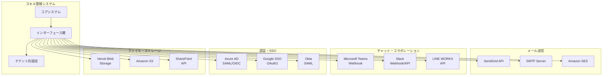

# インターフェース一覧: マルチテナント対応スキル管理システム

## 1. 文書基本情報

- **文書名**: インターフェース一覧
- **プロジェクト名**: 年間スキル報告書WEB化PJT - マルチテナント対応
- **対象システム**: ホールディングス・グループ会社向けマルチテナントSaaS基盤
- **作成日**: 2025/05/30
- **作成者**: システムアーキテクト
- **改訂履歴**: 2025/05/30 初版作成

---

## 2. インターフェース概要

### 2.1 インターフェース設計方針

**マルチテナント対応**と**外部システム連携**を重視したインターフェース設計：

1. **テナント別設定**: 各テナントが独自の外部システム設定を保持
2. **標準化**: 共通インターフェースによる実装の統一
3. **セキュリティ**: 認証・暗号化による安全な通信
4. **拡張性**: 新しい外部システムの容易な追加

### 2.2 インターフェースアーキテクチャ



---

## 3. インターフェース一覧

### 3.1 通知・メッセージング系インターフェース

#### A. IF-001: メール送信インターフェース

| 項目 | 内容 |
|------|------|
| **インターフェースID** | IF-001 |
| **インターフェース名** | メール送信インターフェース |
| **説明** | テナント別メール送信機能 |
| **プロトコル** | HTTPS/SMTP |
| **認証方式** | API Key / SMTP認証 |
| **データ形式** | JSON / MIME |
| **対応プロバイダー** | SendGrid, Amazon SES, SMTP |

**実装例**:
```typescript
// lib/interfaces/email-interface.ts
interface EmailProvider {
  send(message: EmailMessage): Promise<EmailResult>;
  validateConfig(config: EmailConfig): Promise<boolean>;
  getDeliveryStatus(messageId: string): Promise<DeliveryStatus>;
}

class SendGridProvider implements EmailProvider {
  constructor(private config: SendGridConfig) {}
  
  async send(message: EmailMessage): Promise<EmailResult> {
    const sgMail = require('@sendgrid/mail');
    sgMail.setApiKey(this.config.apiKey);
    
    const msg = {
      to: message.recipients,
      from: {
        email: this.config.fromEmail,
        name: this.config.fromName
      },
      subject: message.subject,
      html: message.htmlContent,
      text: message.textContent,
      attachments: message.attachments?.map(att => ({
        content: att.content,
        filename: att.filename,
        type: att.mimeType
      }))
    };
    
    try {
      const response = await sgMail.send(msg);
      return {
        success: true,
        messageId: response[0].headers['x-message-id'],
        provider: 'sendgrid'
      };
    } catch (error) {
      return {
        success: false,
        error: error.message,
        provider: 'sendgrid'
      };
    }
  }
}

class EmailService {
  private providers: Map<string, EmailProvider> = new Map();
  
  async sendEmail(tenantId: string, message: EmailMessage): Promise<EmailResult> {
    const config = await this.getEmailConfig(tenantId);
    const provider = this.getProvider(config.provider);
    
    // テナント別設定適用
    const tenantMessage = {
      ...message,
      from: config.fromEmail,
      replyTo: config.replyToEmail
    };
    
    return await provider.send(tenantMessage);
  }
  
  private getProvider(providerType: string): EmailProvider {
    const provider = this.providers.get(providerType);
    if (!provider) {
      throw new Error(`Unsupported email provider: ${providerType}`);
    }
    return provider;
  }
}
```

#### B. IF-002: Teams Webhook インターフェース

| 項目 | 内容 |
|------|------|
| **インターフェースID** | IF-002 |
| **インターフェース名** | Microsoft Teams Webhook インターフェース |
| **説明** | Teams チャンネルへの通知送信 |
| **プロトコル** | HTTPS |
| **認証方式** | Webhook URL |
| **データ形式** | JSON (Adaptive Cards) |
| **API バージョン** | v1.0 |

**実装例**:
```typescript
// lib/interfaces/teams-interface.ts
interface TeamsMessage {
  title: string;
  text: string;
  themeColor?: string;
  sections?: TeamsSection[];
  potentialAction?: TeamsAction[];
}

class TeamsWebhookProvider {
  constructor(private webhookUrl: string) {}
  
  async sendMessage(message: TeamsMessage): Promise<TeamsResult> {
    const payload = {
      "@type": "MessageCard",
      "@context": "http://schema.org/extensions",
      "themeColor": message.themeColor || "0076D7",
      "summary": message.title,
      "sections": [
        {
          "activityTitle": message.title,
          "activitySubtitle": new Date().toLocaleString('ja-JP'),
          "text": message.text,
          "facts": message.sections?.map(section => ({
            "name": section.name,
            "value": section.value
          })) || []
        }
      ],
      "potentialAction": message.potentialAction || []
    };
    
    try {
      const response = await fetch(this.webhookUrl, {
        method: 'POST',
        headers: {
          'Content-Type': 'application/json'
        },
        body: JSON.stringify(payload)
      });
      
      if (response.ok) {
        return { success: true, provider: 'teams' };
      } else {
        throw new Error(`Teams API error: ${response.status}`);
      }
    } catch (error) {
      return {
        success: false,
        error: error.message,
        provider: 'teams'
      };
    }
  }
}

class TeamsNotificationService {
  async sendSkillUpdateNotification(
    tenantId: string, 
    user: User, 
    skill: Skill
  ): Promise<void> {
    const config = await this.getTeamsConfig(tenantId);
    const provider = new TeamsWebhookProvider(config.webhookUrl);
    
    const message: TeamsMessage = {
      title: "スキル情報が更新されました",
      text: `${user.name}さんがスキル情報を更新しました`,
      themeColor: "28a745",
      sections: [
        {
          name: "ユーザー",
          value: user.name
        },
        {
          name: "スキル",
          value: skill.name
        },
        {
          name: "カテゴリ",
          value: skill.category
        },
        {
          name: "レベル",
          value: skill.level.toString()
        }
      ],
      potentialAction: [
        {
          "@type": "OpenUri",
          "name": "詳細を確認",
          "targets": [
            {
              "os": "default",
              "uri": `${config.baseUrl}/skills/${skill.id}`
            }
          ]
        }
      ]
    };
    
    await provider.sendMessage(message);
  }
}
```

#### C. IF-003: LINE WORKS API インターフェース

| 項目 | 内容 |
|------|------|
| **インターフェースID** | IF-003 |
| **インターフェース名** | LINE WORKS API インターフェース |
| **説明** | LINE WORKS への通知・メッセージ送信 |
| **プロトコル** | HTTPS |
| **認証方式** | OAuth 2.0 / JWT |
| **データ形式** | JSON |
| **API バージョン** | v2.0 |

**実装例**:
```typescript
// lib/interfaces/line-works-interface.ts
class LineWorksProvider {
  private accessToken: string | null = null;
  
  constructor(private config: LineWorksConfig) {}
  
  async authenticate(): Promise<void> {
    const tokenUrl = 'https://auth.worksmobile.com/oauth2/v2.0/token';
    
    const params = new URLSearchParams({
      grant_type: 'client_credentials',
      client_id: this.config.clientId,
      client_secret: this.config.clientSecret,
      scope: 'bot message.write'
    });
    
    const response = await fetch(tokenUrl, {
      method: 'POST',
      headers: {
        'Content-Type': 'application/x-www-form-urlencoded'
      },
      body: params
    });
    
    const data = await response.json();
    this.accessToken = data.access_token;
  }
  
  async sendMessage(
    channelId: string, 
    message: LineWorksMessage
  ): Promise<LineWorksResult> {
    if (!this.accessToken) {
      await this.authenticate();
    }
    
    const apiUrl = `https://www.worksapis.com/v1.0/bots/${this.config.botId}/channels/${channelId}/messages`;
    
    const payload = {
      content: {
        type: message.type,
        text: message.text,
        ...message.content
      }
    };
    
    try {
      const response = await fetch(apiUrl, {
        method: 'POST',
        headers: {
          'Authorization': `Bearer ${this.accessToken}`,
          'Content-Type': 'application/json'
        },
        body: JSON.stringify(payload)
      });
      
      if (response.ok) {
        const result = await response.json();
        return {
          success: true,
          messageId: result.messageId,
          provider: 'line-works'
        };
      } else {
        throw new Error(`LINE WORKS API error: ${response.status}`);
      }
    } catch (error) {
      return {
        success: false,
        error: error.message,
        provider: 'line-works'
      };
    }
  }
}
```

### 3.2 認証・SSO系インターフェース

#### A. IF-004: Azure AD SAML インターフェース

| 項目 | 内容 |
|------|------|
| **インターフェースID** | IF-004 |
| **インターフェース名** | Azure AD SAML インターフェース |
| **説明** | Azure AD による SAML 認証 |
| **プロトコル** | HTTPS |
| **認証方式** | SAML 2.0 |
| **データ形式** | XML (SAML Assertion) |
| **証明書** | X.509 |

**実装例**:
```typescript
// lib/interfaces/azure-ad-saml.ts
import { SAML } from 'passport-saml';

class AzureADSAMLProvider {
  private saml: SAML;
  
  constructor(private config: AzureADSAMLConfig) {
    this.saml = new SAML({
      entryPoint: config.ssoUrl,
      issuer: config.entityId,
      cert: config.certificate,
      callbackUrl: config.callbackUrl,
      identifierFormat: 'urn:oasis:names:tc:SAML:2.0:nameid-format:persistent',
      attributeConsumingServiceIndex: false,
      disableRequestedAuthnContext: true
    });
  }
  
  async validateSAMLResponse(
    samlResponse: string
  ): Promise<SAMLValidationResult> {
    return new Promise((resolve, reject) => {
      this.saml.validatePostResponse(
        { SAMLResponse: samlResponse },
        (err, profile) => {
          if (err) {
            resolve({
              success: false,
              error: err.message
            });
          } else {
            resolve({
              success: true,
              user: {
                id: profile.nameID,
                email: profile.email || profile['http://schemas.xmlsoap.org/ws/2005/05/identity/claims/emailaddress'],
                firstName: profile.givenName || profile['http://schemas.xmlsoap.org/ws/2005/05/identity/claims/givenname'],
                lastName: profile.surname || profile['http://schemas.xmlsoap.org/ws/2005/05/identity/claims/surname'],
                groups: profile.groups || []
              }
            });
          }
        }
      );
    });
  }
  
  getLoginUrl(): string {
    return this.saml.getAuthorizeUrl({});
  }
}
```

### 3.3 ファイル・ストレージ系インターフェース

#### A. IF-005: Vercel Blob ストレージインターフェース

| 項目 | 内容 |
|------|------|
| **インターフェースID** | IF-005 |
| **インターフェース名** | Vercel Blob ストレージインターフェース |
| **説明** | ファイルアップロード・ダウンロード |
| **プロトコル** | HTTPS |
| **認証方式** | API Token |
| **データ形式** | Binary / Multipart |
| **制限** | 500MB per file |

**実装例**:
```typescript
// lib/interfaces/vercel-blob-storage.ts
import { put, del, list } from '@vercel/blob';

class VercelBlobStorageProvider {
  async uploadFile(
    tenantId: string,
    file: File,
    path: string
  ): Promise<UploadResult> {
    try {
      const filename = `${tenantId}/${path}/${file.name}`;
      
      const blob = await put(filename, file, {
        access: 'public',
        addRandomSuffix: true
      });
      
      return {
        success: true,
        url: blob.url,
        filename: blob.pathname,
        size: file.size,
        provider: 'vercel-blob'
      };
    } catch (error) {
      return {
        success: false,
        error: error.message,
        provider: 'vercel-blob'
      };
    }
  }
  
  async deleteFile(url: string): Promise<DeleteResult> {
    try {
      await del(url);
      return {
        success: true,
        provider: 'vercel-blob'
      };
    } catch (error) {
      return {
        success: false,
        error: error.message,
        provider: 'vercel-blob'
      };
    }
  }
  
  async listFiles(tenantId: string, prefix?: string): Promise<FileListResult> {
    try {
      const searchPrefix = prefix ? `${tenantId}/${prefix}` : tenantId;
      const { blobs } = await list({ prefix: searchPrefix });
      
      return {
        success: true,
        files: blobs.map(blob => ({
          url: blob.url,
          pathname: blob.pathname,
          size: blob.size,
          uploadedAt: blob.uploadedAt
        })),
        provider: 'vercel-blob'
      };
    } catch (error) {
      return {
        success: false,
        error: error.message,
        files: [],
        provider: 'vercel-blob'
      };
    }
  }
}
```

---

## 4. インターフェース管理

### 4.1 テナント別設定管理

```typescript
// lib/interfaces/tenant-config-manager.ts
class TenantConfigManager {
  async getEmailConfig(tenantId: string): Promise<EmailConfig> {
    const config = await prisma.tenantIntegrationConfig.findFirst({
      where: {
        tenantId,
        type: 'email',
        enabled: true
      }
    });
    
    if (!config) {
      throw new Error('Email configuration not found');
    }
    
    return {
      provider: config.provider,
      apiKey: await this.decryptSecret(config.apiKey),
      fromEmail: config.settings.fromEmail,
      fromName: config.settings.fromName,
      replyToEmail: config.settings.replyToEmail
    };
  }
  
  async updateIntegrationConfig(
    tenantId: string,
    type: IntegrationType,
    config: IntegrationConfig
  ): Promise<void> {
    const encryptedConfig = {
      ...config,
      apiKey: await this.encryptSecret(config.apiKey),
      clientSecret: config.clientSecret ? await this.encryptSecret(config.clientSecret) : undefined
    };
    
    await prisma.tenantIntegrationConfig.upsert({
      where: {
        tenantId_type: {
          tenantId,
          type
        }
      },
      update: {
        provider: encryptedConfig.provider,
        settings: encryptedConfig.settings,
        apiKey: encryptedConfig.apiKey,
        clientSecret: encryptedConfig.clientSecret,
        enabled: encryptedConfig.enabled,
        updatedAt: new Date()
      },
      create: {
        tenantId,
        type,
        provider: encryptedConfig.provider,
        settings: encryptedConfig.settings,
        apiKey: encryptedConfig.apiKey,
        clientSecret: encryptedConfig.clientSecret,
        enabled: encryptedConfig.enabled
      }
    });
  }
  
  private async encryptSecret(secret: string): Promise<string> {
    // 暗号化実装
    return encrypt(secret, process.env.ENCRYPTION_KEY!);
  }
  
  private async decryptSecret(encryptedSecret: string): Promise<string> {
    // 復号化実装
    return decrypt(encryptedSecret, process.env.ENCRYPTION_KEY!);
  }
}
```

### 4.2 インターフェース統合サービス

```typescript
// lib/interfaces/integration-service.ts
class IntegrationService {
  private emailService: EmailService;
  private teamsService: TeamsNotificationService;
  private lineWorksService: LineWorksNotificationService;
  private slackService: SlackNotificationService;
  
  constructor() {
    this.emailService = new EmailService();
    this.teamsService = new TeamsNotificationService();
    this.lineWorksService = new LineWorksNotificationService();
    this.slackService = new SlackNotificationService();
  }
  
  async sendNotification(
    tenantId: string,
    notification: NotificationRequest
  ): Promise<NotificationResult[]> {
    const enabledIntegrations = await this.getEnabledIntegrations(tenantId);
    const results: NotificationResult[] = [];
    
    for (const integration of enabledIntegrations) {
      try {
        let result: NotificationResult;
        
        switch (integration.type) {
          case 'email':
            result = await this.emailService.sendEmail(tenantId, {
              recipients: notification.recipients,
              subject: notification.subject,
              htmlContent: notification.htmlContent,
              textContent: notification.textContent
            });
            break;
            
          case 'teams':
            result = await this.teamsService.sendMessage(tenantId, {
              title: notification.subject,
              text: notification.textContent,
              themeColor: notification.themeColor
            });
            break;
            
          case 'line-works':
            result = await this.lineWorksService.sendMessage(tenantId, {
              type: 'text',
              text: notification.textContent
            });
            break;
            
          case 'slack':
            result = await this.slackService.sendMessage(tenantId, {
              text: notification.textContent,
              channel: integration.settings.defaultChannel
            });
            break;
            
          default:
            continue;
        }
        
        results.push(result);
      } catch (error) {
        results.push({
          success: false,
          error: error.message,
          provider: integration.type
        });
      }
    }
    
    return results;
  }
  
  async testIntegration(
    tenantId: string,
    integrationType: IntegrationType
  ): Promise<TestResult> {
    try {
      switch (integrationType) {
        case 'email':
          return await this.testEmailIntegration(tenantId);
        case 'teams':
          return await this.testTeamsIntegration(tenantId);
        case 'line-works':
          return await this.testLineWorksIntegration(tenantId);
        case 'slack':
          return await this.testSlackIntegration(tenantId);
        default:
          throw new Error(`Unsupported integration type: ${integrationType}`);
      }
    } catch (error) {
      return {
        success: false,
        error: error.message,
        integrationType
      };
    }
  }
  
  private async testEmailIntegration(tenantId: string): Promise<TestResult> {
    const testMessage = {
      recipients: ['test@example.com'],
      subject: 'テスト通知',
      textContent: 'これはテスト通知です。',
      htmlContent: '<p>これはテスト通知です。</p>'
    };
    
    const result = await this.emailService.sendEmail(tenantId, testMessage);
    
    return {
      success: result.success,
      error: result.error,
      integrationType: 'email',
      details: result
    };
  }
}
```

### 4.3 エラーハンドリング・リトライ機能

```typescript
// lib/interfaces/retry-handler.ts
class IntegrationRetryHandler {
  private maxRetries = 3;
  private retryDelays = [1000, 5000, 15000]; // 1秒, 5秒, 15秒
  
  async executeWithRetry<T>(
    operation: () => Promise<T>,
    context: RetryContext
  ): Promise<T> {
    let lastError: Error;
    
    for (let attempt = 0; attempt <= this.maxRetries; attempt++) {
      try {
        return await operation();
      } catch (error) {
        lastError = error;
        
        // 最後の試行の場合はエラーを投げる
        if (attempt === this.maxRetries) {
          await this.logFailedIntegration(context, error);
          throw error;
        }
        
        // リトライ可能なエラーかチェック
        if (!this.isRetryableError(error)) {
          throw error;
        }
        
        // 遅延実行
        await this.delay(this.retryDelays[attempt]);
        
        await this.logRetryAttempt(context, attempt + 1, error);
      }
    }
    
    throw lastError!;
  }
  
  private isRetryableError(error: Error): boolean {
    // ネットワークエラー、タイムアウト、一時的なサーバーエラーはリトライ対象
    const retryablePatterns = [
      /network/i,
      /timeout/i,
      /502/,
      /503/,
      /504/,
      /rate limit/i
    ];
    
    return retryablePatterns.some(pattern => 
      pattern.test(error.message)
    );
  }
  
  private async delay(ms: number): Promise<void> {
    return new Promise(resolve => setTimeout(resolve, ms));
  }
  
  private async logRetryAttempt(
    context: RetryContext,
    attempt: number,
    error: Error
  ): Promise<void> {
    await prisma.integrationRetryLog.create({
      data: {
        tenantId: context.tenantId,
        integrationType: context.integrationType,
        attempt,
        error: error.message,
        timestamp: new Date()
      }
    });
  }
}
```

このインターフェース一覧により、マルチテナント対応システムの外部システム連携を標準化・効率化します。
