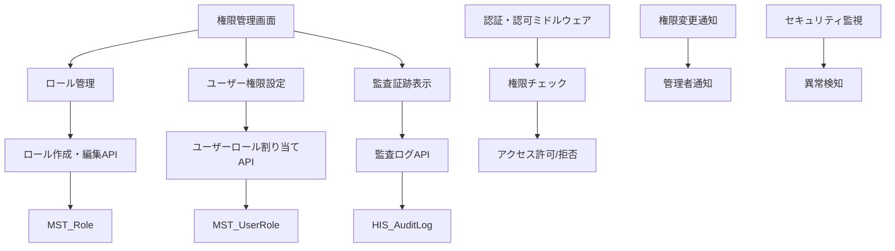
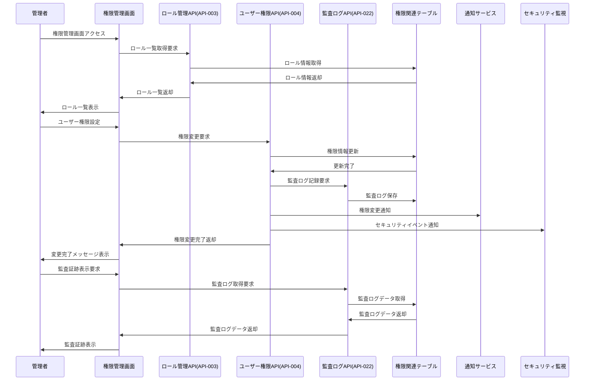

# インターフェース仕様書：権限・ロール管理 (IF-002)

| 項目                | 内容                                                                                |
|---------------------|------------------------------------------------------------------------------------|
| **インターフェースID** | IF-002                                                                          |
| **名称**            | 権限・ロール管理                                                                    |
| **インターフェース方式** | 内部                                                                           |
| **インターフェース種別** | 画面-API                                                                       |
| **概要**            | ユーザーの権限・ロール設定、アクセス制御、監査証跡管理                              |
| **主な連携先**      | SCR-ACCESS → API-003/004/022                                                      |
| **主なAPI/バッチID** | API-003, API-004, API-022                                                         |
| **主なテーブル/データ** | MST_Role, MST_UserRole, HIS_AuditLog                                           |
| **主な機能ID**      | F02                                                                                |
| **優先度**          | 高                                                                                  |
| **備考**            | 監査証跡含む                                                                        |

## 1. インターフェース概要

権限・ロール管理インターフェース（IF-002）は、システム全体のアクセス制御を担う重要なセキュリティ基盤です。ユーザーに対するロール割り当て、権限設定、アクセス制御の実行、および全ての権限変更に対する監査証跡の記録を行います。RBAC（Role-Based Access Control）モデルに基づく階層的な権限管理を実現します。

## 2. 権限管理アーキテクチャ



## 3. インターフェースフロー



## 4. API仕様

### 4.1 ロール管理API (API-003)

**エンドポイント**: `/api/v1/roles`  
**メソッド**: GET, POST, PUT, DELETE  
**認証**: Bearer Token必須  
**権限**: ROLE_ADMIN

#### 4.1.1 ロール一覧取得

**メソッド**: GET  
**エンドポイント**: `/api/v1/roles`

**クエリパラメータ**:
| パラメータ名 | データ型 | 必須 | 説明 |
|-------------|---------|------|------|
| status | String | × | ロール状態（"ACTIVE"/"INACTIVE"） |
| category | String | × | ロールカテゴリ |
| limit | Integer | × | 取得件数（デフォルト: 50） |
| offset | Integer | × | オフセット（デフォルト: 0） |

**レスポンス例 (成功)**:
```json
{
  "status": "success",
  "data": {
    "roles": [
      {
        "roleId": "ROLE-001",
        "roleName": "システム管理者",
        "roleCode": "SYSTEM_ADMIN",
        "description": "システム全体の管理権限を持つロール",
        "category": "ADMIN",
        "permissions": [
          {
            "permissionId": "PERM-001",
            "permissionName": "ユーザー管理",
            "resource": "USER",
            "actions": ["CREATE", "READ", "UPDATE", "DELETE"]
          },
          {
            "permissionId": "PERM-002",
            "permissionName": "システム設定",
            "resource": "SYSTEM",
            "actions": ["READ", "UPDATE"]
          }
        ],
        "userCount": 5,
        "status": "ACTIVE",
        "createdAt": "2025-01-15T09:00:00Z",
        "updatedAt": "2025-03-20T14:30:00Z"
      }
    ],
    "totalCount": 15,
    "hasMore": false
  }
}
```

#### 4.1.2 ロール作成

**メソッド**: POST  
**エンドポイント**: `/api/v1/roles`  
**Content-Type**: application/json

**リクエスト例**:
```json
{
  "roleName": "部門管理者",
  "roleCode": "DEPT_MANAGER",
  "description": "部門内のユーザー・データ管理権限",
  "category": "MANAGER",
  "permissions": [
    {
      "permissionId": "PERM-003",
      "actions": ["READ", "UPDATE"]
    },
    {
      "permissionId": "PERM-004",
      "actions": ["CREATE", "READ", "UPDATE"]
    }
  ],
  "inheritFromRole": "ROLE-002",
  "status": "ACTIVE"
}
```

**レスポンス例 (成功)**:
```json
{
  "status": "success",
  "message": "ロールを作成しました",
  "data": {
    "roleId": "ROLE-016",
    "roleName": "部門管理者",
    "roleCode": "DEPT_MANAGER",
    "createdAt": "2025-05-30T11:45:00Z"
  }
}
```

### 4.2 ユーザー権限管理API (API-004)

**エンドポイント**: `/api/v1/users/{userId}/roles`  
**メソッド**: GET, POST, DELETE  
**認証**: Bearer Token必須  
**権限**: ROLE_ADMIN または USER_MANAGER

#### 4.2.1 ユーザー権限取得

**メソッド**: GET  
**エンドポイント**: `/api/v1/users/{userId}/roles`

**レスポンス例 (成功)**:
```json
{
  "status": "success",
  "data": {
    "userId": "user123",
    "userName": "山田 太郎",
    "email": "yamada@company.com",
    "department": "開発部",
    "position": "主任",
    "roles": [
      {
        "roleId": "ROLE-003",
        "roleName": "一般ユーザー",
        "roleCode": "GENERAL_USER",
        "assignedAt": "2025-01-15T09:00:00Z",
        "assignedBy": "admin001",
        "expiresAt": null,
        "status": "ACTIVE"
      },
      {
        "roleId": "ROLE-005",
        "roleName": "プロジェクトリーダー",
        "roleCode": "PROJECT_LEADER",
        "assignedAt": "2025-03-01T10:00:00Z",
        "assignedBy": "manager001",
        "expiresAt": "2025-12-31T23:59:59Z",
        "status": "ACTIVE"
      }
    ],
    "effectivePermissions": [
      {
        "resource": "SKILL",
        "actions": ["CREATE", "READ", "UPDATE"]
      },
      {
        "resource": "PROJECT",
        "actions": ["READ", "UPDATE", "MANAGE_TEAM"]
      }
    ],
    "lastLoginAt": "2025-05-29T16:30:00Z"
  }
}
```

#### 4.2.2 ユーザーロール割り当て

**メソッド**: POST  
**エンドポイント**: `/api/v1/users/{userId}/roles`  
**Content-Type**: application/json

**リクエスト例**:
```json
{
  "roleId": "ROLE-005",
  "expiresAt": "2025-12-31T23:59:59Z",
  "reason": "プロジェクトリーダーに昇格のため",
  "notifyUser": true,
  "effectiveFrom": "2025-06-01T00:00:00Z"
}
```

**レスポンス例 (成功)**:
```json
{
  "status": "success",
  "message": "ユーザーにロールを割り当てました",
  "data": {
    "userId": "user123",
    "roleId": "ROLE-005",
    "assignedAt": "2025-05-30T11:45:00Z",
    "effectiveFrom": "2025-06-01T00:00:00Z",
    "expiresAt": "2025-12-31T23:59:59Z",
    "auditLogId": "AUDIT-2025-001234"
  }
}
```

### 4.3 監査ログAPI (API-022)

**エンドポイント**: `/api/v1/audit/access-control`  
**メソッド**: GET  
**認証**: Bearer Token必須  
**権限**: AUDIT_VIEWER

**クエリパラメータ**:
| パラメータ名 | データ型 | 必須 | 説明 |
|-------------|---------|------|------|
| userId | String | × | 対象ユーザーID |
| action | String | × | アクション種別 |
| fromDate | Date | × | 開始日時 |
| toDate | Date | × | 終了日時 |
| severity | String | × | 重要度（"LOW"/"MEDIUM"/"HIGH"/"CRITICAL"） |
| limit | Integer | × | 取得件数（デフォルト: 100） |

**レスポンス例 (成功)**:
```json
{
  "status": "success",
  "data": {
    "auditLogs": [
      {
        "auditLogId": "AUDIT-2025-001234",
        "timestamp": "2025-05-30T11:45:00Z",
        "action": "ROLE_ASSIGNED",
        "severity": "MEDIUM",
        "userId": "user123",
        "userName": "山田 太郎",
        "performedBy": "admin001",
        "performerName": "管理者",
        "details": {
          "roleId": "ROLE-005",
          "roleName": "プロジェクトリーダー",
          "reason": "プロジェクトリーダーに昇格のため",
          "expiresAt": "2025-12-31T23:59:59Z"
        },
        "ipAddress": "192.168.1.100",
        "userAgent": "Mozilla/5.0...",
        "sessionId": "sess_abc123",
        "result": "SUCCESS"
      }
    ],
    "summary": {
      "totalCount": 1250,
      "severityDistribution": {
        "LOW": 800,
        "MEDIUM": 350,
        "HIGH": 80,
        "CRITICAL": 20
      },
      "actionDistribution": {
        "ROLE_ASSIGNED": 450,
        "ROLE_REMOVED": 200,
        "PERMISSION_CHANGED": 300,
        "ACCESS_DENIED": 300
      }
    }
  }
}
```

## 5. データ項目定義

### 5.1 MST_Roleテーブル

| フィールド名 | データ型 | 必須 | 説明 |
|-------------|---------|------|------|
| role_id | String | ○ | ロールID（主キー） |
| role_name | String | ○ | ロール名 |
| role_code | String | ○ | ロールコード（ユニーク） |
| description | Text | × | ロール説明 |
| category | String | ○ | ロールカテゴリ（"ADMIN"/"MANAGER"/"USER"/"GUEST"） |
| permissions | JSON | ○ | 権限リスト |
| inherit_from_role | String | × | 継承元ロールID |
| priority | Integer | ○ | 優先度（1-100） |
| status | String | ○ | 状態（"ACTIVE"/"INACTIVE"） |
| created_by | String | ○ | 作成者ID |
| created_at | DateTime | ○ | 作成日時 |
| updated_by | String | ○ | 更新者ID |
| updated_at | DateTime | ○ | 更新日時 |

### 5.2 MST_UserRoleテーブル

| フィールド名 | データ型 | 必須 | 説明 |
|-------------|---------|------|------|
| user_role_id | String | ○ | ユーザーロールID（主キー） |
| user_id | String | ○ | ユーザーID（外部キー） |
| role_id | String | ○ | ロールID（外部キー） |
| assigned_by | String | ○ | 割り当て者ID |
| assigned_at | DateTime | ○ | 割り当て日時 |
| effective_from | DateTime | ○ | 有効開始日時 |
| expires_at | DateTime | × | 有効期限 |
| reason | Text | × | 割り当て理由 |
| status | String | ○ | 状態（"ACTIVE"/"INACTIVE"/"EXPIRED"） |
| created_at | DateTime | ○ | 作成日時 |
| updated_at | DateTime | ○ | 更新日時 |

### 5.3 HIS_AuditLogテーブル

| フィールド名 | データ型 | 必須 | 説明 |
|-------------|---------|------|------|
| audit_log_id | String | ○ | 監査ログID（主キー） |
| timestamp | DateTime | ○ | 発生日時 |
| action | String | ○ | アクション種別 |
| severity | String | ○ | 重要度（"LOW"/"MEDIUM"/"HIGH"/"CRITICAL"） |
| user_id | String | ○ | 対象ユーザーID |
| performed_by | String | ○ | 実行者ID |
| resource_type | String | ○ | リソース種別 |
| resource_id | String | × | リソースID |
| details | JSON | ○ | 詳細情報 |
| ip_address | String | ○ | IPアドレス |
| user_agent | String | × | ユーザーエージェント |
| session_id | String | × | セッションID |
| result | String | ○ | 実行結果（"SUCCESS"/"FAILURE"/"ERROR"） |
| error_message | Text | × | エラーメッセージ |

## 6. 権限モデル

### 6.1 RBAC階層構造

```typescript
interface RoleHierarchy {
  SYSTEM_ADMIN: {
    inherits: [];
    permissions: ['*']; // 全権限
  };
  
  DEPT_ADMIN: {
    inherits: ['DEPT_MANAGER'];
    permissions: [
      'USER_MANAGE_DEPT',
      'ROLE_ASSIGN_DEPT',
      'DATA_EXPORT_DEPT'
    ];
  };
  
  DEPT_MANAGER: {
    inherits: ['PROJECT_LEADER'];
    permissions: [
      'USER_VIEW_DEPT',
      'SKILL_MANAGE_DEPT',
      'REPORT_VIEW_DEPT'
    ];
  };
  
  PROJECT_LEADER: {
    inherits: ['GENERAL_USER'];
    permissions: [
      'PROJECT_MANAGE',
      'TEAM_SKILL_VIEW',
      'WORK_RECORD_APPROVE'
    ];
  };
  
  GENERAL_USER: {
    inherits: [];
    permissions: [
      'PROFILE_VIEW_OWN',
      'PROFILE_UPDATE_OWN',
      'SKILL_MANAGE_OWN',
      'WORK_RECORD_OWN'
    ];
  };
}
```

### 6.2 権限チェック処理

```typescript
interface AccessControlService {
  async checkPermission(
    userId: string, 
    resource: string, 
    action: string,
    context?: any
  ): Promise<boolean> {
    // 1. ユーザーのアクティブロール取得
    const userRoles = await this.getUserActiveRoles(userId);
    
    // 2. ロールから権限を集約
    const permissions = await this.aggregatePermissions(userRoles);
    
    // 3. 権限チェック実行
    const hasPermission = this.evaluatePermission(permissions, resource, action, context);
    
    // 4. 監査ログ記録
    await this.logAccessAttempt(userId, resource, action, hasPermission);
    
    return hasPermission;
  }
  
  private evaluatePermission(
    permissions: Permission[], 
    resource: string, 
    action: string,
    context?: any
  ): boolean {
    for (const permission of permissions) {
      if (this.matchesResource(permission.resource, resource) &&
          this.matchesAction(permission.actions, action) &&
          this.matchesContext(permission.context, context)) {
        return true;
      }
    }
    return false;
  }
}
```

## 7. セキュリティ仕様

### 7.1 権限昇格防止

```typescript
interface PrivilegeEscalationPrevention {
  // 自分より高い権限のロールは割り当て不可
  validateRoleAssignment(assignerId: string, targetRoleId: string): Promise<boolean>;
  
  // 権限変更の承認フロー
  requireApprovalForSensitiveRoles(roleId: string): boolean;
  
  // 一時的権限の自動失効
  scheduleRoleExpiration(userRoleId: string, expiresAt: Date): void;
}
```

### 7.2 異常検知

```typescript
interface SecurityAnomalyDetection {
  // 短時間での大量権限変更
  detectBulkPermissionChanges(timeWindow: number, threshold: number): Promise<SecurityAlert[]>;
  
  // 通常時間外の権限変更
  detectOffHoursPermissionChanges(): Promise<SecurityAlert[]>;
  
  // 権限昇格パターンの検知
  detectPrivilegeEscalationAttempts(userId: string): Promise<SecurityAlert[]>;
}
```

## 8. エラーハンドリング

### 8.1 権限管理エラー分類

| エラーコード | 説明 | HTTP ステータス | 対応方法 |
|-------------|------|----------------|---------|
| ROLE_NOT_FOUND | ロールが見つからない | 404 | 指定されたロールIDが存在しない |
| INSUFFICIENT_PRIVILEGES | 権限不足 | 403 | 操作に必要な権限がない |
| ROLE_ALREADY_ASSIGNED | ロール重複割り当て | 409 | 既に同じロールが割り当て済み |
| ROLE_DEPENDENCY_ERROR | ロール依存関係エラー | 400 | 削除対象ロールに依存関係がある |
| PERMISSION_CONFLICT | 権限競合 | 400 | 矛盾する権限設定 |

### 8.2 権限チェック失敗時の処理

```typescript
interface AccessDeniedHandler {
  async handleAccessDenied(
    userId: string,
    resource: string,
    action: string,
    reason: string
  ): Promise<void> {
    // 1. 監査ログ記録
    await this.auditLogger.logAccessDenied(userId, resource, action, reason);
    
    // 2. セキュリティ監視への通知
    await this.securityMonitor.reportAccessDenied(userId, resource, action);
    
    // 3. 異常パターン検知
    const isAnomalous = await this.anomalyDetector.checkAccessPattern(userId);
    
    if (isAnomalous) {
      // 4. セキュリティアラート発報
      await this.alertManager.sendSecurityAlert({
        type: 'SUSPICIOUS_ACCESS_PATTERN',
        userId,
        resource,
        action,
        timestamp: new Date()
      });
    }
  }
}
```

## 9. 監視・アラート

### 9.1 権限管理KPI

```typescript
interface AccessControlKPI {
  // セキュリティ指標
  accessDeniedRate: number;           // アクセス拒否率
  privilegeEscalationAttempts: number; // 権限昇格試行回数
  roleAssignmentFrequency: number;    // ロール割り当て頻度
  
  // 運用指標
  activeRoleCount: number;            // アクティブロール数
  userRoleDistribution: Map<string, number>; // ユーザー・ロール分布
  roleUtilizationRate: number;        // ロール利用率
  
  // 監査指標
  auditLogCompleteness: number;       // 監査ログ完全性
  complianceViolations: number;       // コンプライアンス違反数
}
```

### 9.2 セキュリティアラート

```typescript
interface SecurityAlertManager {
  async sendPrivilegeEscalationAlert(userId: string, attemptedRole: string): Promise<void> {
    const alert = {
      type: 'PRIVILEGE_ESCALATION_ATTEMPT',
      severity: 'CRITICAL',
      userId,
      attemptedRole,
      timestamp: new Date(),
      requiresImmedateAction: true
    };
    
    // 即座に管理者に通知
    await this.notificationService.sendUrgentAlert(alert);
    
    // セキュリティチームに通知
    await this.slackNotifier.sendMessage('#security-alerts', alert);
    
    // 必要に応じてアカウント一時停止
    if (await this.shouldSuspendAccount(userId)) {
      await this.userService.suspendAccount(userId, 'SECURITY_VIOLATION');
    }
  }
}
```

## 10. 運用手順

### 10.1 ロール管理運用

1. **新規ロール作成**:
   - 業務要件の確認
   - 最小権限の原則に基づく権限設計
   - 承認フローの実行
   - テスト環境での検証

2. **ユーザーロール割り当て**:
   - 申請書による正式手続き
   - 上長承認の確認
   - 期限付き割り当ての検討
   - 定期的な権限見直し

### 10.2 監査対応

```typescript
interface AuditCompliance {
  // 定期監査レポート生成
  generateAuditReport(fromDate: Date, toDate: Date): Promise<AuditReport>;
  
  // コンプライアンスチェック
  checkComplianceViolations(): Promise<ComplianceViolation[]>;
  
  // 権限棚卸し
  conductPermissionInventory(): Promise<PermissionInventoryReport>;
}
```

## 11. 関連インターフェース

- [IF-001](./インターフェース仕様書_IF-001.md): ログイン認証
- [IF-015](./インターフェース仕様書_IF-015.md): SSO認証・外部認証連携
- [IF-009](./インターフェース仕様書_IF-009.md): システム管理
- [IF-010](./インターフェース仕様書_IF-010.md): 通知・アラート

## 12. 改訂履歴

| 改訂日     | 改訂者 | 改訂内容                                         |
|------------|--------|--------------------------------------------------|
| 2025/05/30 | 初版   | 初版作成                                         |
