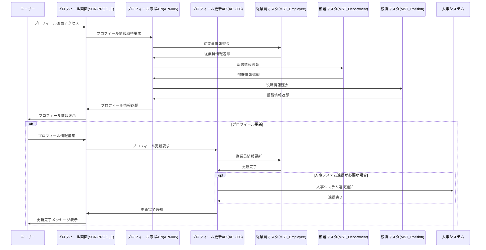

# インターフェース仕様書：プロフィール管理 (IF-003)

| 項目                | 内容                                                                                |
|---------------------|------------------------------------------------------------------------------------|
| **インターフェースID** | IF-003                                                                          |
| **名称**            | プロフィール管理                                                                    |
| **インターフェース方式** | 内部                                                                           |
| **インターフェース種別** | 画面-API                                                                       |
| **概要**            | 従業員の基本情報、所属部署、役職情報の表示・更新管理                                |
| **主な連携先**      | SCR-PROFILE → API-005/006                                                          |
| **主なAPI/バッチID** | API-005, API-006                                                                  |
| **主なテーブル/データ** | MST_Employee, MST_Department, MST_Position                                      |
| **主な機能ID**      | F03, F04                                                                           |
| **優先度**          | 最高                                                                                |
| **備考**            | 人事システム連携                                                                    |

## 1. インターフェース概要

プロフィール管理インターフェース（IF-003）は、従業員の基本情報（氏名、メールアドレス、入社日等）、所属部署情報、役職情報の表示と更新を行います。人事システムとの連携により、組織情報の同期を実現し、従業員が自身の基本情報を確認・更新できる機能を提供します。

## 2. インターフェースフロー



## 3. リクエスト・レスポンス仕様

### 3.1 プロフィール情報取得 (API-005)

**エンドポイント**: `/api/v1/profile/{userId}`  
**メソッド**: GET  
**認証**: Bearer Token必須

**パスパラメータ**:
| パラメータ名 | データ型 | 必須 | 説明 |
|-------------|---------|------|------|
| userId | String | ○ | ユーザーID |

**レスポンス例 (成功)**:
```json
{
  "status": "success",
  "data": {
    "employee": {
      "employeeId": "EMP001",
      "userId": "user123",
      "lastName": "山田",
      "firstName": "太郎",
      "lastNameKana": "ヤマダ",
      "firstNameKana": "タロウ",
      "email": "yamada.taro@company.com",
      "phoneNumber": "090-1234-5678",
      "hireDate": "2020-04-01",
      "birthDate": "1990-01-15",
      "gender": "M",
      "status": "ACTIVE"
    },
    "department": {
      "departmentCode": "D001",
      "departmentName": "開発部",
      "parentDepartmentCode": "D000",
      "parentDepartmentName": "技術本部",
      "managerEmployeeId": "EMP100",
      "managerName": "田中 部長"
    },
    "position": {
      "positionCode": "P003",
      "positionName": "主任",
      "positionLevel": 3,
      "salaryGrade": "G3"
    },
    "lastUpdated": "2025-05-29T10:30:00Z",
    "updatedBy": "user123"
  }
}
```

**レスポンス例 (エラー)**:
```json
{
  "status": "error",
  "code": "EMPLOYEE_NOT_FOUND",
  "message": "指定された従業員が見つかりません"
}
```

### 3.2 プロフィール情報更新 (API-006)

**エンドポイント**: `/api/v1/profile/{userId}`  
**メソッド**: PUT  
**Content-Type**: application/json  
**認証**: Bearer Token必須

**リクエスト例**:
```json
{
  "employee": {
    "lastName": "山田",
    "firstName": "太郎",
    "lastNameKana": "ヤマダ",
    "firstNameKana": "タロウ",
    "email": "yamada.taro@company.com",
    "phoneNumber": "090-1234-5678"
  },
  "updateReason": "連絡先変更"
}
```

**レスポンス例 (成功)**:
```json
{
  "status": "success",
  "message": "プロフィール情報を更新しました",
  "data": {
    "employeeId": "EMP001",
    "lastUpdated": "2025-05-30T11:25:00Z",
    "updatedBy": "user123"
  }
}
```

**レスポンス例 (バリデーションエラー)**:
```json
{
  "status": "error",
  "code": "VALIDATION_ERROR",
  "message": "入力値に誤りがあります",
  "errors": [
    {
      "field": "email",
      "message": "有効なメールアドレスを入力してください"
    },
    {
      "field": "phoneNumber",
      "message": "電話番号の形式が正しくありません"
    }
  ]
}
```

## 4. データ項目定義

### 4.1 MST_Employeeテーブル

| フィールド名 | データ型 | 必須 | 説明 |
|-------------|---------|------|------|
| employee_id | String | ○ | 従業員ID（主キー） |
| user_id | String | ○ | ユーザーID（外部キー） |
| last_name | String | ○ | 姓 |
| first_name | String | ○ | 名 |
| last_name_kana | String | ○ | 姓（カナ） |
| first_name_kana | String | ○ | 名（カナ） |
| email | String | ○ | メールアドレス |
| phone_number | String | × | 電話番号 |
| hire_date | Date | ○ | 入社日 |
| birth_date | Date | × | 生年月日 |
| gender | String | × | 性別（"M"/"F"/"O"） |
| department_code | String | ○ | 部署コード（外部キー） |
| position_code | String | ○ | 役職コード（外部キー） |
| status | String | ○ | 状態（"ACTIVE"/"INACTIVE"/"RETIRED"） |
| hr_sync_flag | Boolean | ○ | 人事システム同期フラグ |
| created_at | DateTime | ○ | 作成日時 |
| updated_at | DateTime | ○ | 更新日時 |
| updated_by | String | ○ | 更新者 |

### 4.2 MST_Departmentテーブル

| フィールド名 | データ型 | 必須 | 説明 |
|-------------|---------|------|------|
| department_code | String | ○ | 部署コード（主キー） |
| department_name | String | ○ | 部署名 |
| parent_department_code | String | × | 親部署コード |
| manager_employee_id | String | × | 部署長従業員ID |
| cost_center | String | × | コストセンター |
| status | String | ○ | 状態（"ACTIVE"/"INACTIVE"） |
| display_order | Integer | ○ | 表示順序 |
| created_at | DateTime | ○ | 作成日時 |
| updated_at | DateTime | ○ | 更新日時 |

### 4.3 MST_Positionテーブル

| フィールド名 | データ型 | 必須 | 説明 |
|-------------|---------|------|------|
| position_code | String | ○ | 役職コード（主キー） |
| position_name | String | ○ | 役職名 |
| position_level | Integer | ○ | 役職レベル |
| salary_grade | String | × | 給与等級 |
| status | String | ○ | 状態（"ACTIVE"/"INACTIVE"） |
| display_order | Integer | ○ | 表示順序 |
| created_at | DateTime | ○ | 作成日時 |
| updated_at | DateTime | ○ | 更新日時 |

## 5. エラーハンドリング

| エラーコード | 説明 | HTTP ステータス | 対応方法 |
|-------------|------|----------------|---------|
| EMPLOYEE_NOT_FOUND | 従業員情報が見つからない | 404 | 指定されたユーザーIDに対応する従業員情報が存在しない |
| DEPARTMENT_NOT_FOUND | 部署情報が見つからない | 404 | 指定された部署コードが存在しない |
| POSITION_NOT_FOUND | 役職情報が見つからない | 404 | 指定された役職コードが存在しない |
| VALIDATION_ERROR | 入力値検証エラー | 400 | 必須項目未入力、形式不正等のバリデーションエラー |
| PERMISSION_DENIED | 権限不足 | 403 | 他のユーザーのプロフィール更新権限がない |
| HR_SYNC_ERROR | 人事システム連携エラー | 500 | 人事システムとの連携処理でエラーが発生 |
| UPDATE_CONFLICT | 更新競合 | 409 | 他のユーザーによる同時更新が発生 |

## 6. セキュリティ要件

1. **認証・認可**:
   - Bearer Token認証必須
   - 自身のプロフィールのみ参照・更新可能
   - 管理者は全従業員のプロフィール参照可能

2. **データ保護**:
   - 個人情報の暗号化保存
   - 生年月日等の機微情報は権限に応じて表示制御
   - 更新履歴の監査ログ記録

3. **入力検証**:
   - メールアドレス形式チェック
   - 電話番号形式チェック
   - XSS対策のためのサニタイズ処理

## 7. 運用・監視要件

1. **ログ記録**:
   - プロフィール参照・更新操作
   - 人事システム連携結果
   - エラー発生状況

2. **監視項目**:
   - API応答時間
   - 人事システム連携成功率
   - プロフィール更新頻度

3. **アラート条件**:
   - 人事システム連携失敗
   - 大量のプロフィール更新（不正操作検知）
   - API応答時間の異常値

## 8. 人事システム連携仕様

1. **連携タイミング**:
   - 日次バッチによる組織情報同期
   - リアルタイム更新通知（重要な変更のみ）

2. **連携データ**:
   - 部署情報（新設・廃止・名称変更）
   - 役職情報（新設・廃止・名称変更）
   - 従業員の所属・役職変更

3. **連携方式**:
   - REST API または CSV ファイル連携
   - 差分データのみ連携（効率化）

## 9. 関連インターフェース

- [IF-001](./インターフェース仕様書_IF-001.md): ログイン認証
- [IF-002](./インターフェース仕様書_IF-002.md): 権限・ロール管理
- [IF-017](./インターフェース仕様書_IF-017.md): 人事システム連携
- [IF-011](./インターフェース仕様書_IF-011.md): ホームダッシュボード

## 10. 改訂履歴

| 改訂日     | 改訂者 | 改訂内容                                         |
|------------|--------|--------------------------------------------------|
| 2025/05/30 | 初版   | 初版作成                                         |
