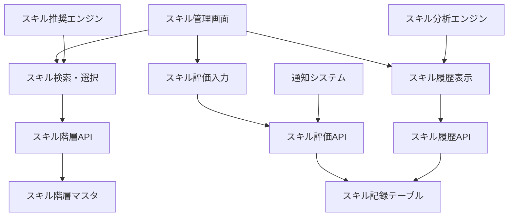
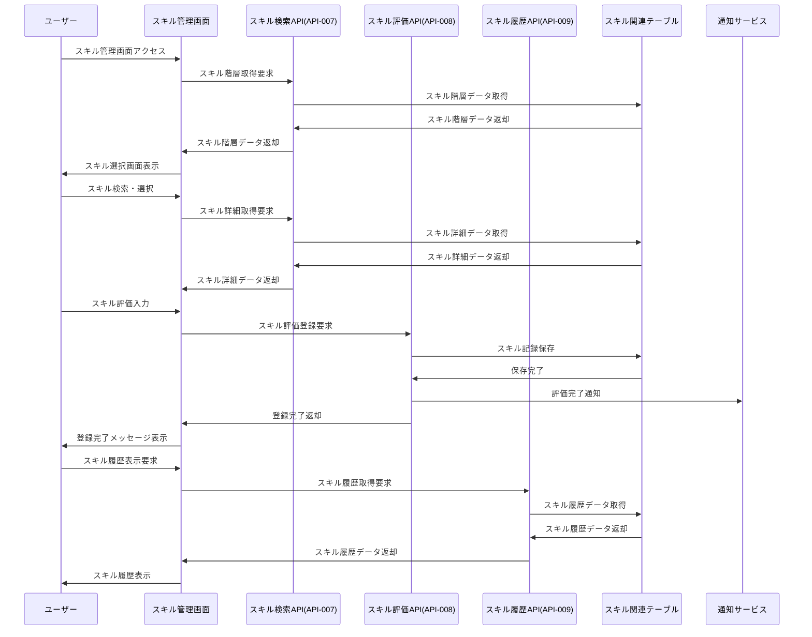

# インターフェース仕様書：スキル管理 (IF-004)

| 項目                | 内容                                                                                |
|---------------------|------------------------------------------------------------------------------------|
| **インターフェースID** | IF-004                                                                          |
| **名称**            | スキル管理                                                                          |
| **インターフェース方式** | 内部                                                                           |
| **インターフェース種別** | 画面-API                                                                       |
| **概要**            | スキル情報の登録・更新・削除、スキル評価レベルの管理                                |
| **主な連携先**      | SCR-SKILL → API-007/008/009                                                       |
| **主なAPI/バッチID** | API-007, API-008, API-009                                                         |
| **主なテーブル/データ** | TRN_SkillRecord, MST_SkillHierarchy                                            |
| **主な機能ID**      | F05, F06, F07                                                                      |
| **優先度**          | 高                                                                                  |
| **備考**            | スキル階層管理                                                                      |

## 1. インターフェース概要

スキル管理インターフェース（IF-004）は、従業員のスキル情報の登録・更新・削除機能を提供します。スキル階層（カテゴリ→大分類→中分類→小分類）に基づく体系的なスキル管理と、5段階評価によるスキルレベル管理を実現し、従業員の能力可視化とスキル向上支援を行います。

## 2. スキル管理アーキテクチャ



## 3. インターフェースフロー



## 4. API仕様

### 4.1 スキル検索API (API-007)

**エンドポイント**: `/api/v1/skills/search`  
**メソッド**: GET  
**認証**: Bearer Token必須

**クエリパラメータ**:
| パラメータ名 | データ型 | 必須 | 説明 |
|-------------|---------|------|------|
| category | String | × | スキルカテゴリ |
| keyword | String | × | キーワード検索 |
| level | Integer | × | 推奨レベル |
| limit | Integer | × | 取得件数（デフォルト: 50） |
| offset | Integer | × | オフセット（デフォルト: 0） |

**レスポンス例 (成功)**:
```json
{
  "status": "success",
  "data": {
    "skills": [
      {
        "skillCode": "TECH-001-001-001",
        "skillName": "Java",
        "skillNameEn": "Java",
        "category": "技術スキル",
        "majorCategory": "プログラミング言語",
        "middleCategory": "オブジェクト指向言語",
        "minorCategory": "Java系",
        "description": "Javaプログラミング言語の知識と実装能力",
        "evaluationCriteria": [
          {
            "level": 1,
            "description": "基本的な文法を理解し、簡単なプログラムが書ける"
          },
          {
            "level": 2,
            "description": "オブジェクト指向の概念を理解し、クラス設計ができる"
          },
          {
            "level": 3,
            "description": "フレームワークを使用した開発ができる"
          },
          {
            "level": 4,
            "description": "パフォーマンスを考慮した設計・実装ができる"
          },
          {
            "level": 5,
            "description": "アーキテクチャ設計やチーム指導ができる"
          }
        ],
        "relatedSkills": ["TECH-001-001-002", "TECH-002-001-001"],
        "recommendedLevel": 3,
        "currentUserLevel": 2,
        "lastEvaluated": "2025-03-15T10:30:00Z"
      }
    ],
    "totalCount": 150,
    "hasMore": true
  }
}
```

### 4.2 スキル評価API (API-008)

**エンドポイント**: `/api/v1/skills/evaluation`  
**メソッド**: POST  
**Content-Type**: application/json  
**認証**: Bearer Token必須

**リクエスト例**:
```json
{
  "skillCode": "TECH-001-001-001",
  "evaluationLevel": 3,
  "selfAssessment": true,
  "evaluatorId": "user123",
  "evaluationDate": "2025-05-30",
  "evidence": {
    "projectExperience": "Spring Bootを使用したWebアプリケーション開発（6ヶ月）",
    "certifications": ["Oracle Certified Java Programmer"],
    "trainingHistory": ["Java基礎研修", "Spring Framework研修"],
    "achievements": "チーム内でのコードレビュー担当"
  },
  "goals": {
    "targetLevel": 4,
    "targetDate": "2025-12-31",
    "actionPlan": "Spring Securityの習得、パフォーマンスチューニングの学習"
  },
  "comments": "実務でSpring Bootを使用した開発経験があり、基本的な設計パターンを理解している"
}
```

**レスポンス例 (成功)**:
```json
{
  "status": "success",
  "message": "スキル評価を登録しました",
  "data": {
    "evaluationId": "EVAL-2025-001234",
    "skillCode": "TECH-001-001-001",
    "previousLevel": 2,
    "newLevel": 3,
    "levelUpAchieved": true,
    "nextRecommendations": [
      {
        "skillCode": "TECH-002-001-001",
        "skillName": "Spring Framework",
        "reason": "Javaスキル向上に関連する推奨スキル"
      }
    ],
    "evaluatedAt": "2025-05-30T11:25:00Z"
  }
}
```

### 4.3 スキル履歴API (API-009)

**エンドポイント**: `/api/v1/skills/history/{userId}`  
**メソッド**: GET  
**認証**: Bearer Token必須

**パスパラメータ**:
| パラメータ名 | データ型 | 必須 | 説明 |
|-------------|---------|------|------|
| userId | String | ○ | ユーザーID |

**クエリパラメータ**:
| パラメータ名 | データ型 | 必須 | 説明 |
|-------------|---------|------|------|
| skillCode | String | × | 特定スキルの履歴のみ取得 |
| fromDate | Date | × | 開始日 |
| toDate | Date | × | 終了日 |
| limit | Integer | × | 取得件数（デフォルト: 100） |

**レスポンス例 (成功)**:
```json
{
  "status": "success",
  "data": {
    "skillHistory": [
      {
        "evaluationId": "EVAL-2025-001234",
        "skillCode": "TECH-001-001-001",
        "skillName": "Java",
        "evaluationLevel": 3,
        "previousLevel": 2,
        "evaluationType": "SELF_ASSESSMENT",
        "evaluatorId": "user123",
        "evaluatorName": "山田 太郎",
        "evaluationDate": "2025-05-30",
        "evidence": {
          "projectExperience": "Spring Bootを使用したWebアプリケーション開発（6ヶ月）",
          "certifications": ["Oracle Certified Java Programmer"]
        },
        "goals": {
          "targetLevel": 4,
          "targetDate": "2025-12-31"
        },
        "comments": "実務でSpring Bootを使用した開発経験があり、基本的な設計パターンを理解している"
      }
    ],
    "summary": {
      "totalSkills": 25,
      "averageLevel": 2.8,
      "levelDistribution": {
        "level1": 3,
        "level2": 8,
        "level3": 10,
        "level4": 3,
        "level5": 1
      },
      "recentImprovements": 5,
      "skillGaps": [
        {
          "skillCode": "TECH-003-001-001",
          "skillName": "AWS",
          "recommendedLevel": 3,
          "currentLevel": 0,
          "priority": "HIGH"
        }
      ]
    }
  }
}
```

## 5. データ項目定義

### 5.1 TRN_SkillRecordテーブル

| フィールド名 | データ型 | 必須 | 説明 |
|-------------|---------|------|------|
| evaluation_id | String | ○ | 評価ID（主キー） |
| employee_id | String | ○ | 従業員ID（外部キー） |
| skill_code | String | ○ | スキルコード（外部キー） |
| evaluation_level | Integer | ○ | 評価レベル（1-5） |
| previous_level | Integer | × | 前回評価レベル |
| evaluation_type | String | ○ | 評価種別（"SELF"/"MANAGER"/"PEER"/"EXTERNAL"） |
| evaluator_id | String | ○ | 評価者ID |
| evaluation_date | Date | ○ | 評価日 |
| evidence_text | Text | × | 根拠・エビデンス |
| project_experience | Text | × | プロジェクト経験 |
| certifications | JSON | × | 資格情報 |
| training_history | JSON | × | 研修履歴 |
| achievements | Text | × | 実績・成果 |
| target_level | Integer | × | 目標レベル |
| target_date | Date | × | 目標達成日 |
| action_plan | Text | × | アクションプラン |
| comments | Text | × | コメント |
| status | String | ○ | 状態（"ACTIVE"/"ARCHIVED"） |
| created_at | DateTime | ○ | 作成日時 |
| updated_at | DateTime | ○ | 更新日時 |

### 5.2 MST_SkillHierarchyテーブル

| フィールド名 | データ型 | 必須 | 説明 |
|-------------|---------|------|------|
| skill_code | String | ○ | スキルコード（主キー） |
| skill_name | String | ○ | スキル名 |
| skill_name_en | String | × | スキル名（英語） |
| category | String | ○ | カテゴリ |
| major_category | String | ○ | 大分類 |
| middle_category | String | ○ | 中分類 |
| minor_category | String | × | 小分類 |
| description | Text | × | スキル説明 |
| evaluation_criteria | JSON | ○ | 評価基準（レベル別） |
| related_skills | JSON | × | 関連スキル |
| recommended_level | Integer | × | 推奨レベル |
| difficulty_level | Integer | × | 習得難易度（1-5） |
| market_demand | Integer | × | 市場需要（1-5） |
| display_order | Integer | ○ | 表示順序 |
| status | String | ○ | 状態（"ACTIVE"/"INACTIVE"） |
| created_at | DateTime | ○ | 作成日時 |
| updated_at | DateTime | ○ | 更新日時 |

## 6. スキル評価基準

### 6.1 評価レベル定義

| レベル | 名称 | 説明 |
|--------|------|------|
| 1 | 初級 | 基本的な知識を有し、指導の下で作業ができる |
| 2 | 中級 | 一般的な作業を独力で遂行できる |
| 3 | 上級 | 複雑な作業を独力で遂行し、他者に指導できる |
| 4 | 専門家 | 高度な専門知識を有し、設計・企画ができる |
| 5 | エキスパート | 業界トップレベルの知識・経験を有し、革新的な取り組みができる |

### 6.2 評価種別

```typescript
enum EvaluationType {
  SELF = 'SELF',           // 自己評価
  MANAGER = 'MANAGER',     // 上司評価
  PEER = 'PEER',          // 同僚評価
  EXTERNAL = 'EXTERNAL'    // 外部評価（資格・認定等）
}

interface EvaluationWeight {
  self: number;      // 30%
  manager: number;   // 50%
  peer: number;      // 15%
  external: number;  // 5%
}
```

## 7. スキル推奨エンジン

### 7.1 推奨アルゴリズム

```typescript
interface SkillRecommendationEngine {
  async getRecommendedSkills(userId: string): Promise<SkillRecommendation[]> {
    const userProfile = await this.getUserProfile(userId);
    const currentSkills = await this.getCurrentSkills(userId);
    const careerPath = await this.getCareerPath(userProfile.positionCode);
    
    // 1. キャリアパス基準の推奨
    const careerBasedRecommendations = this.getCareerBasedRecommendations(careerPath, currentSkills);
    
    // 2. スキルギャップ分析
    const skillGaps = this.analyzeSkillGaps(currentSkills, careerPath.requiredSkills);
    
    // 3. 市場動向基準の推奨
    const marketBasedRecommendations = this.getMarketBasedRecommendations(userProfile.department);
    
    // 4. 関連スキル基準の推奨
    const relatedSkillRecommendations = this.getRelatedSkillRecommendations(currentSkills);
    
    // 5. 推奨スコア計算・統合
    return this.calculateRecommendationScore([
      ...careerBasedRecommendations,
      ...skillGaps,
      ...marketBasedRecommendations,
      ...relatedSkillRecommendations
    ]);
  }
}
```

### 7.2 スキル分析

```typescript
interface SkillAnalytics {
  async generateSkillReport(userId: string): Promise<SkillReport> {
    const skillHistory = await this.getSkillHistory(userId);
    const currentSkills = await this.getCurrentSkills(userId);
    
    return {
      overview: {
        totalSkills: currentSkills.length,
        averageLevel: this.calculateAverageLevel(currentSkills),
        strongAreas: this.identifyStrongAreas(currentSkills),
        improvementAreas: this.identifyImprovementAreas(currentSkills)
      },
      progress: {
        levelUpsLastYear: this.countLevelUps(skillHistory, 365),
        newSkillsLastYear: this.countNewSkills(skillHistory, 365),
        progressTrend: this.calculateProgressTrend(skillHistory)
      },
      comparison: {
        departmentAverage: await this.getDepartmentAverage(userId),
        positionAverage: await this.getPositionAverage(userId),
        industryBenchmark: await this.getIndustryBenchmark()
      },
      recommendations: await this.getRecommendedSkills(userId)
    };
  }
}
```

## 8. エラーハンドリング

### 8.1 スキル管理エラー分類

| エラーコード | 説明 | HTTP ステータス | 対応方法 |
|-------------|------|----------------|---------|
| SKILL_NOT_FOUND | スキルが見つからない | 404 | 指定されたスキルコードが存在しない |
| INVALID_EVALUATION_LEVEL | 無効な評価レベル | 400 | 評価レベルは1-5の範囲で指定 |
| EVALUATION_ALREADY_EXISTS | 評価が既に存在 | 409 | 同一日付での重複評価 |
| INSUFFICIENT_EVIDENCE | 根拠不足 | 400 | レベル3以上の評価には根拠が必要 |
| SKILL_HIERARCHY_ERROR | スキル階層エラー | 400 | スキル階層の整合性エラー |

### 8.2 バリデーション

```typescript
interface SkillEvaluationValidator {
  validateEvaluation(evaluation: SkillEvaluation): ValidationResult {
    const errors: ValidationError[] = [];
    
    // レベル妥当性チェック
    if (evaluation.evaluationLevel < 1 || evaluation.evaluationLevel > 5) {
      errors.push({
        field: 'evaluationLevel',
        message: '評価レベルは1-5の範囲で指定してください'
      });
    }
    
    // 根拠チェック（レベル3以上）
    if (evaluation.evaluationLevel >= 3 && !evaluation.evidence) {
      errors.push({
        field: 'evidence',
        message: 'レベル3以上の評価には根拠の入力が必要です'
      });
    }
    
    // 目標設定チェック
    if (evaluation.targetLevel && evaluation.targetLevel <= evaluation.evaluationLevel) {
      errors.push({
        field: 'targetLevel',
        message: '目標レベルは現在のレベルより高く設定してください'
      });
    }
    
    return {
      isValid: errors.length === 0,
      errors
    };
  }
}
```

## 9. セキュリティ・権限制御

### 9.1 スキル情報アクセス制御

```typescript
interface SkillAccessControl {
  // 自分のスキル情報：参照・更新可能
  canViewOwnSkills(userId: string): boolean;
  canUpdateOwnSkills(userId: string): boolean;
  
  // 部下のスキル情報：上司は参照・評価可能
  canViewSubordinateSkills(managerId: string, subordinateId: string): Promise<boolean>;
  canEvaluateSubordinateSkills(managerId: string, subordinateId: string): Promise<boolean>;
  
  // 同僚のスキル情報：限定的な参照のみ
  canViewPeerSkills(userId: string, peerId: string): Promise<boolean>;
  
  // 管理者：全体参照・管理可能
  canManageAllSkills(userId: string): Promise<boolean>;
}
```

## 10. 監視・分析

### 10.1 スキル管理KPI

```typescript
interface SkillManagementKPI {
  // 利用状況
  skillEvaluationRate: number;        // スキル評価実施率
  skillUpdateFrequency: number;       // スキル更新頻度
  averageSkillsPerEmployee: number;   // 従業員あたり平均スキル数
  
  // 成長指標
  skillLevelUpRate: number;           // スキルレベルアップ率
  newSkillAcquisitionRate: number;    // 新規スキル習得率
  skillGapReductionRate: number;      // スキルギャップ削減率
  
  // 品質指標
  evaluationAccuracy: number;         // 評価精度
  evidenceCompleteness: number;       // 根拠記入完成度
  goalAchievementRate: number;        // 目標達成率
}
```

## 11. 関連インターフェース

- [IF-003](./インターフェース仕様書_IF-003.md): プロフィール管理
- [IF-012](./インターフェース仕様書_IF-012.md): API-DBアクセス全般
- [IF-018](./インターフェース仕様書_IF-018.md): スキルマスタ外部連携
- [IF-011](./インターフェース仕様書_IF-011.md): ホームダッシュボード

## 12. 改訂履歴

| 改訂日     | 改訂者 | 改訂内容                                         |
|------------|--------|--------------------------------------------------|
| 2025/05/30 | 初版   | 初版作成                                         |
