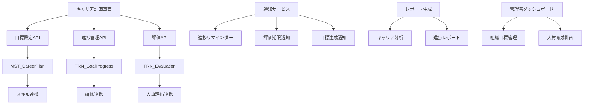
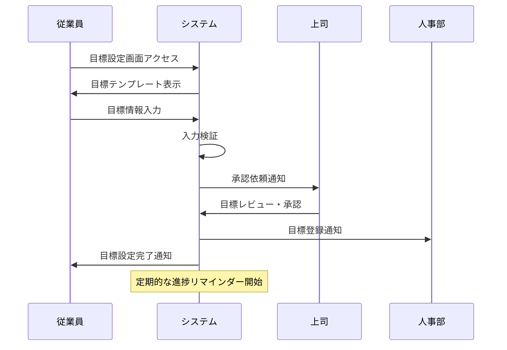
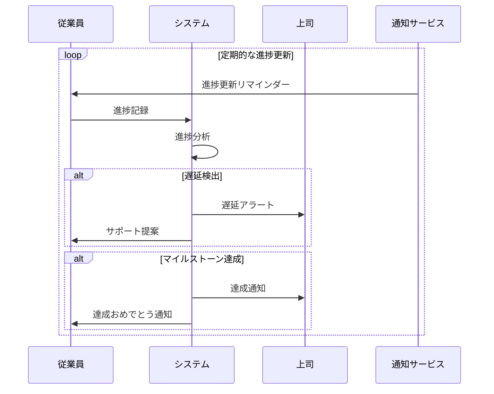
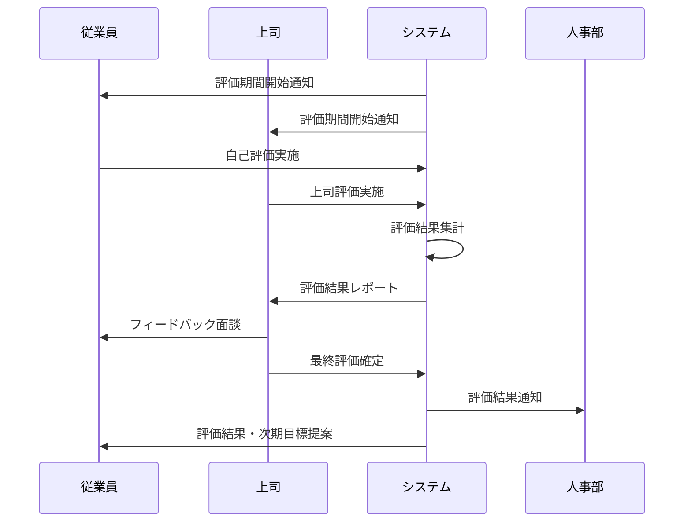

# インターフェース仕様書：目標・キャリア管理 (IF-005)

| 項目                | 内容                                                                                |
|---------------------|------------------------------------------------------------------------------------|
| **インターフェースID** | IF-005                                                                          |
| **名称**            | 目標・キャリア管理                                                                  |
| **インターフェース方式** | 内部                                                                           |
| **インターフェース種別** | 画面-API                                                                       |
| **概要**            | 個人のキャリア目標設定、進捗管理、評価機能                                          |
| **主な連携先**      | SCR-CAR-PLAN/EVAL                                                                  |
| **主なAPI/バッチID** | API-012, API-013                                                                  |
| **主なテーブル/データ** | MST_CareerPlan, TRN_GoalProgress                                               |
| **主な機能ID**      | F09, F10                                                                           |
| **優先度**          | 中                                                                                  |
| **備考**            | 進捗リマインダー連携                                                                |

## 1. インターフェース概要

目標・キャリア管理インターフェース（IF-005）は、従業員の中長期的なキャリア開発を支援する包括的な管理システムです。個人のキャリア目標設定から進捗追跡、評価、フィードバックまでを一元管理し、組織の人材育成戦略と個人の成長目標を効果的に連携させます。

## 2. システムアーキテクチャ



## 3. API仕様

### 3.1 API-012: キャリア目標管理API

#### 3.1.1 目標設定・更新

**エンドポイント**: `POST /api/career/goals`

```typescript
interface CareerGoalRequest {
  employeeId: string;           // 従業員ID
  goalType: 'SHORT_TERM' | 'MEDIUM_TERM' | 'LONG_TERM';
  title: string;                // 目標タイトル
  description: string;          // 目標詳細
  targetDate: Date;             // 目標達成予定日
  priority: 'HIGH' | 'MEDIUM' | 'LOW';
  category: string;             // 目標カテゴリ
  skillRequirements: string[];  // 必要スキル
  milestones: Milestone[];      // マイルストーン
  successCriteria: string[];    // 成功基準
  resources: Resource[];        // 必要リソース
}

interface Milestone {
  milestoneId: string;
  title: string;
  description: string;
  targetDate: Date;
  status: 'NOT_STARTED' | 'IN_PROGRESS' | 'COMPLETED';
  completionRate: number;       // 完了率（0-100）
}

interface Resource {
  resourceType: 'TRAINING' | 'MENTORING' | 'PROJECT' | 'CERTIFICATION';
  resourceId: string;
  title: string;
  estimatedCost: number;
  estimatedTime: number;        // 時間（時間単位）
}
```

**レスポンス例**:
```json
{
  "status": "success",
  "data": {
    "goalId": "GOAL-2025-001",
    "employeeId": "EMP-001",
    "goalType": "MEDIUM_TERM",
    "title": "プロジェクトマネージャーへのキャリアアップ",
    "description": "3年以内にプロジェクトマネージャーとして独立したプロジェクトを統括できるスキルを習得する",
    "targetDate": "2027-12-31T00:00:00Z",
    "priority": "HIGH",
    "category": "MANAGEMENT",
    "status": "ACTIVE",
    "progress": 0,
    "createdAt": "2025-01-15T09:00:00Z",
    "milestones": [
      {
        "milestoneId": "MS-001",
        "title": "PMP資格取得",
        "targetDate": "2025-12-31T00:00:00Z",
        "status": "NOT_STARTED",
        "completionRate": 0
      }
    ]
  }
}
```

#### 3.1.2 目標一覧取得

**エンドポイント**: `GET /api/career/goals`

**クエリパラメータ**:
```typescript
interface GoalListQuery {
  employeeId?: string;          // 従業員ID（管理者用）
  goalType?: string;            // 目標種別
  status?: string;              // 状態
  category?: string;            // カテゴリ
  page?: number;                // ページ番号
  limit?: number;               // 取得件数
  sortBy?: 'targetDate' | 'priority' | 'progress';
  sortOrder?: 'asc' | 'desc';
}
```

#### 3.1.3 目標詳細取得

**エンドポイント**: `GET /api/career/goals/{goalId}`

**レスポンス例**:
```json
{
  "status": "success",
  "data": {
    "goalId": "GOAL-2025-001",
    "employeeId": "EMP-001",
    "employee": {
      "name": "田中太郎",
      "department": "IT部",
      "position": "シニアエンジニア"
    },
    "goalDetails": {
      "title": "プロジェクトマネージャーへのキャリアアップ",
      "description": "3年以内にプロジェクトマネージャーとして独立したプロジェクトを統括できるスキルを習得する",
      "targetDate": "2027-12-31T00:00:00Z",
      "priority": "HIGH",
      "category": "MANAGEMENT",
      "status": "ACTIVE",
      "progress": 25
    },
    "milestones": [
      {
        "milestoneId": "MS-001",
        "title": "PMP資格取得",
        "description": "Project Management Professional資格を取得し、プロジェクト管理の基礎知識を習得",
        "targetDate": "2025-12-31T00:00:00Z",
        "status": "IN_PROGRESS",
        "completionRate": 60,
        "activities": [
          {
            "activityId": "ACT-001",
            "title": "PMP試験対策講座受講",
            "status": "COMPLETED",
            "completedDate": "2025-03-15T00:00:00Z"
          }
        ]
      }
    ],
    "skillRequirements": [
      {
        "skillCode": "PM-001",
        "skillName": "プロジェクト計画",
        "currentLevel": 2,
        "targetLevel": 4,
        "progress": 50
      }
    ],
    "evaluationHistory": [
      {
        "evaluationId": "EVAL-001",
        "evaluationDate": "2025-03-31T00:00:00Z",
        "evaluator": "山田花子",
        "score": 3.5,
        "feedback": "順調に進捗しています。PMP資格取得に向けた学習が計画通り進んでいます。"
      }
    ]
  }
}
```

### 3.2 API-013: 進捗評価API

#### 3.2.1 進捗更新

**エンドポイント**: `PUT /api/career/goals/{goalId}/progress`

```typescript
interface ProgressUpdateRequest {
  milestoneId?: string;         // マイルストーンID（マイルストーン更新時）
  completionRate: number;       // 完了率（0-100）
  status?: 'NOT_STARTED' | 'IN_PROGRESS' | 'COMPLETED' | 'ON_HOLD' | 'CANCELLED';
  progressNote: string;         // 進捗メモ
  achievements: Achievement[];  // 達成事項
  challenges: Challenge[];      // 課題・障害
  nextActions: string[];        // 次のアクション
  evidenceFiles?: string[];     // 証跡ファイル
}

interface Achievement {
  achievementId: string;
  title: string;
  description: string;
  achievedDate: Date;
  impact: 'HIGH' | 'MEDIUM' | 'LOW';
  skillsGained: string[];       // 習得スキル
}

interface Challenge {
  challengeId: string;
  title: string;
  description: string;
  severity: 'HIGH' | 'MEDIUM' | 'LOW';
  status: 'OPEN' | 'IN_PROGRESS' | 'RESOLVED';
  resolutionPlan: string;
  supportNeeded: string[];      // 必要なサポート
}
```

#### 3.2.2 評価実施

**エンドポイント**: `POST /api/career/goals/{goalId}/evaluations`

```typescript
interface EvaluationRequest {
  evaluatorId: string;          // 評価者ID
  evaluationType: 'SELF' | 'SUPERVISOR' | 'PEER' | 'SUBORDINATE';
  evaluationPeriod: {
    startDate: Date;
    endDate: Date;
  };
  overallScore: number;         // 総合評価（1-5）
  criteriaScores: CriteriaScore[];
  strengths: string[];          // 強み
  improvementAreas: string[];   // 改善点
  feedback: string;             // フィードバック
  recommendations: string[];    // 推奨事項
  nextGoals: string[];          // 次の目標提案
}

interface CriteriaScore {
  criteriaId: string;
  criteriaName: string;
  score: number;                // 評価点（1-5）
  comment: string;              // コメント
  evidence: string[];           // 根拠・証跡
}
```

## 4. データベース仕様

### 4.1 MST_CareerPlanテーブル

| フィールド名 | データ型 | 必須 | 説明 |
|-------------|---------|------|------|
| goal_id | String | ○ | 目標ID（主キー） |
| employee_id | String | ○ | 従業員ID |
| goal_type | String | ○ | 目標種別（"SHORT_TERM"/"MEDIUM_TERM"/"LONG_TERM"） |
| title | String | ○ | 目標タイトル |
| description | Text | ○ | 目標詳細 |
| target_date | Date | ○ | 目標達成予定日 |
| priority | String | ○ | 優先度（"HIGH"/"MEDIUM"/"LOW"） |
| category | String | ○ | 目標カテゴリ |
| status | String | ○ | 状態（"ACTIVE"/"COMPLETED"/"ON_HOLD"/"CANCELLED"） |
| progress | Integer | ○ | 進捗率（0-100） |
| skill_requirements | JSON | × | 必要スキル |
| milestones | JSON | × | マイルストーン |
| success_criteria | JSON | × | 成功基準 |
| resources | JSON | × | 必要リソース |
| created_by | String | ○ | 作成者ID |
| created_at | DateTime | ○ | 作成日時 |
| updated_at | DateTime | ○ | 更新日時 |

### 4.2 TRN_GoalProgressテーブル

| フィールド名 | データ型 | 必須 | 説明 |
|-------------|---------|------|------|
| progress_id | String | ○ | 進捗ID（主キー） |
| goal_id | String | ○ | 目標ID |
| milestone_id | String | × | マイルストーンID |
| progress_date | Date | ○ | 進捗記録日 |
| completion_rate | Integer | ○ | 完了率（0-100） |
| status | String | ○ | 状態 |
| progress_note | Text | × | 進捗メモ |
| achievements | JSON | × | 達成事項 |
| challenges | JSON | × | 課題・障害 |
| next_actions | JSON | × | 次のアクション |
| evidence_files | JSON | × | 証跡ファイル |
| recorded_by | String | ○ | 記録者ID |
| created_at | DateTime | ○ | 作成日時 |

### 4.3 TRN_Evaluationテーブル

| フィールド名 | データ型 | 必須 | 説明 |
|-------------|---------|------|------|
| evaluation_id | String | ○ | 評価ID（主キー） |
| goal_id | String | ○ | 目標ID |
| evaluator_id | String | ○ | 評価者ID |
| evaluation_type | String | ○ | 評価種別 |
| evaluation_period_start | Date | ○ | 評価期間開始 |
| evaluation_period_end | Date | ○ | 評価期間終了 |
| overall_score | Decimal | ○ | 総合評価 |
| criteria_scores | JSON | × | 評価基準別スコア |
| strengths | JSON | × | 強み |
| improvement_areas | JSON | × | 改善点 |
| feedback | Text | × | フィードバック |
| recommendations | JSON | × | 推奨事項 |
| next_goals | JSON | × | 次の目標提案 |
| evaluation_date | Date | ○ | 評価実施日 |
| created_at | DateTime | ○ | 作成日時 |

## 5. 画面仕様

### 5.1 キャリア計画画面（SCR-CAR-PLAN）

#### 5.1.1 目標一覧表示

```typescript
interface CareerPlanScreen {
  // 目標フィルター
  goalFilters: {
    goalType: string;
    status: string;
    category: string;
    priority: string;
  };
  
  // 目標一覧
  goalList: CareerGoalSummary[];
  
  // 進捗サマリー
  progressSummary: {
    totalGoals: number;
    activeGoals: number;
    completedGoals: number;
    overallProgress: number;
    upcomingDeadlines: GoalDeadline[];
  };
}

interface CareerGoalSummary {
  goalId: string;
  title: string;
  goalType: string;
  priority: string;
  targetDate: Date;
  progress: number;
  status: string;
  nextMilestone: string;
  daysToDeadline: number;
}
```

#### 5.1.2 目標詳細・編集

```typescript
interface GoalDetailForm {
  basicInfo: {
    title: string;
    description: string;
    goalType: string;
    category: string;
    priority: string;
    targetDate: Date;
  };
  
  skillRequirements: SkillRequirement[];
  milestones: MilestoneForm[];
  successCriteria: string[];
  resources: ResourceForm[];
}

interface MilestoneForm {
  title: string;
  description: string;
  targetDate: Date;
  dependencies: string[];       // 依存関係
  activities: ActivityForm[];
}

interface ActivityForm {
  title: string;
  description: string;
  estimatedHours: number;
  assignedTo: string;
  dueDate: Date;
}
```

### 5.2 評価画面（SCR-EVAL）

#### 5.2.1 進捗記録

```typescript
interface ProgressRecordForm {
  goalSelection: {
    goalId: string;
    milestoneId?: string;
  };
  
  progressUpdate: {
    completionRate: number;
    status: string;
    progressNote: string;
  };
  
  achievements: AchievementForm[];
  challenges: ChallengeForm[];
  nextActions: string[];
  evidenceUpload: FileUpload[];
}
```

#### 5.2.2 評価実施

```typescript
interface EvaluationForm {
  evaluationInfo: {
    goalId: string;
    evaluationType: string;
    evaluationPeriod: DateRange;
  };
  
  scoring: {
    overallScore: number;
    criteriaScores: CriteriaScoreForm[];
  };
  
  feedback: {
    strengths: string[];
    improvementAreas: string[];
    detailedFeedback: string;
    recommendations: string[];
    nextGoals: string[];
  };
}
```

## 6. 業務フロー

### 6.1 目標設定フロー



### 6.2 進捗管理フロー



### 6.3 評価フロー



## 7. 通知・リマインダー仕様

### 7.1 進捗リマインダー

```typescript
interface ProgressReminderService {
  async scheduleProgressReminders(): Promise<void> {
    const activeGoals = await this.getActiveGoals();
    
    for (const goal of activeGoals) {
      // 週次進捗リマインダー
      await this.scheduleWeeklyReminder(goal);
      
      // マイルストーン期限リマインダー
      await this.scheduleMilestoneReminders(goal);
      
      // 目標期限リマインダー
      await this.scheduleDeadlineReminders(goal);
    }
  }
  
  private async scheduleWeeklyReminder(goal: CareerGoal): Promise<void> {
    const reminderConfig = {
      goalId: goal.goalId,
      employeeId: goal.employeeId,
      reminderType: 'WEEKLY_PROGRESS',
      schedule: '0 9 * * 1', // 毎週月曜日 9:00
      message: `目標「${goal.title}」の進捗を更新してください。`,
      actionUrl: `/career/goals/${goal.goalId}/progress`
    };
    
    await this.notificationService.scheduleReminder(reminderConfig);
  }
}
```

### 7.2 評価期限通知

```typescript
interface EvaluationNotificationService {
  async sendEvaluationReminders(): Promise<void> {
    const upcomingEvaluations = await this.getUpcomingEvaluations();
    
    for (const evaluation of upcomingEvaluations) {
      // 評価者への通知
      await this.notifyEvaluator(evaluation);
      
      // 被評価者への通知
      await this.notifyEvaluatee(evaluation);
      
      // 管理者への通知
      await this.notifyManager(evaluation);
    }
  }
}
```

## 8. レポート・分析機能

### 8.1 個人キャリア分析

```typescript
interface CareerAnalyticsService {
  async generatePersonalCareerReport(
    employeeId: string,
    period: DateRange
  ): Promise<PersonalCareerReport> {
    return {
      employee: await this.getEmployeeInfo(employeeId),
      goalSummary: await this.getGoalSummary(employeeId, period),
      progressAnalysis: await this.analyzeProgress(employeeId, period),
      skillDevelopment: await this.analyzeSkillDevelopment(employeeId, period),
      achievementHighlights: await this.getAchievements(employeeId, period),
      recommendedActions: await this.generateRecommendations(employeeId)
    };
  }
  
  private async analyzeProgress(
    employeeId: string,
    period: DateRange
  ): Promise<ProgressAnalysis> {
    const progressData = await this.getProgressData(employeeId, period);
    
    return {
      overallProgressRate: this.calculateOverallProgress(progressData),
      progressTrend: this.analyzeProgressTrend(progressData),
      milestoneAchievementRate: this.calculateMilestoneRate(progressData),
      timeToCompletion: this.estimateTimeToCompletion(progressData),
      riskFactors: this.identifyRiskFactors(progressData)
    };
  }
}
```

### 8.2 組織キャリア分析

```typescript
interface OrganizationalCareerAnalytics {
  async generateOrganizationReport(
    departmentId?: string,
    period?: DateRange
  ): Promise<OrganizationCareerReport> {
    return {
      departmentSummary: await this.getDepartmentSummary(departmentId),
      goalDistribution: await this.analyzeGoalDistribution(departmentId),
      progressMetrics: await this.calculateProgressMetrics(departmentId, period),
      skillGapAnalysis: await this.analyzeSkillGaps(departmentId),
      successFactors: await this.identifySuccessFactors(departmentId),
      improvementOpportunities: await this.identifyImprovements(departmentId)
    };
  }
}
```

## 9. セキュリティ・権限制御

### 9.1 アクセス制御

```typescript
interface CareerAccessControl {
  // 目標の閲覧権限
  canViewGoal(userId: string, goalId: string): Promise<boolean> {
    const goal = await this.getGoal(goalId);
    const user = await this.getUser(userId);
    
    // 本人の目標
    if (goal.employeeId === userId) return true;
    
    // 直属の上司
    if (await this.isDirectManager(userId, goal.employeeId)) return true;
    
    // HR部門
    if (user.department === 'HR') return true;
    
    // システム管理者
    if (user.role === 'SYSTEM_ADMIN') return true;
    
    return false;
  }
  
  // 目標の編集権限
  canEditGoal(userId: string, goalId: string): Promise<boolean> {
    const goal = await this.getGoal(goalId);
    
    // 本人のみ編集可能（承認前）
    if (goal.employeeId === userId && goal.status === 'DRAFT') return true;
    
    // 承認後は制限された編集のみ
    if (goal.employeeId === userId && goal.status === 'APPROVED') {
      return this.canEditApprovedGoal(userId, goalId);
    }
    
    return false;
  }
}
```

### 9.2 データ暗号化

```typescript
interface CareerDataSecurity {
  // 機密情報の暗号化
  async encryptSensitiveData(data: CareerGoalData): Promise<EncryptedData> {
    const sensitiveFields = ['description', 'feedback', 'personalNotes'];
    
    for (const field of sensitiveFields) {
      if (data[field]) {
        data[field] = await this.encryptionService.encrypt(data[field]);
      }
    }
    
    return data;
  }
  
  // 復号化
  async decryptSensitiveData(
    encryptedData: EncryptedData,
    userId: string
  ): Promise<CareerGoalData> {
    // アクセス権限確認
    if (!await this.hasDecryptionPermission(userId, encryptedData.goalId)) {
      throw new UnauthorizedError('復号化権限がありません');
    }
    
    // 復号化実行
    return await this.encryptionService.decrypt(encryptedData);
  }
}
```

## 10. パフォーマンス最適化

### 10.1 キャッシュ戦略

```typescript
interface CareerCacheStrategy {
  // 目標データのキャッシュ
  async cacheGoalData(goalId: string): Promise<void> {
    const goal = await this.getGoalFromDB(goalId);
    const cacheKey = `career:goal:${goalId}`;
    
    await this.redis.setex(cacheKey, 3600, JSON.stringify(goal)); // 1時間キャッシュ
  }
  
  // 進捗データのキャッシュ
  async cacheProgressData(employeeId: string): Promise<void> {
    const progress = await this.getProgressFromDB(employeeId);
    const cacheKey = `career:progress:${employeeId}`;
    
    await this.redis.setex(cacheKey, 1800, JSON.stringify(progress)); // 30分キャッシュ
  }
  
  // キャッシュ無効化
  async invalidateCache(goalId: string): Promise<void> {
    const goal = await this.getGoal(goalId);
    
    // 関連キャッシュを無効化
    await this.redis.del(`career:goal:${goalId}`);
    await this.redis.del(`career:progress:${goal.employeeId}`);
    await this.redis.del(`career:summary:${goal.employeeId}`);
  }
}
```

### 10.2 データベース最適化

```typescript
interface CareerDatabaseOptimization {
  // インデックス設計
  createIndexes(): Promise<void> {
    // 目標テーブルのインデックス
    this.db.createIndex('MST_CareerPlan', ['employee_id', 'status']);
    this.db.createIndex('MST_CareerPlan', ['target_date', 'priority']);
    this.db.createIndex('MST_CareerPlan', ['category', 'goal_type']);
    
    // 進捗テーブルのインデックス
    this.db.createIndex('TRN_GoalProgress', ['goal_id', 'progress_date']);
    this.db.createIndex('TRN_GoalProgress', ['progress_date', 'status']);
    
    // 評価テーブルのインデックス
    this.db.createIndex('TRN_Evaluation', ['goal_id', 'evaluation_date']);
    this.db.createIndex('TRN_Evaluation', ['evaluator_id', 'evaluation_type']);
  }
  
  // クエリ最適化
  async getGoalSummaryOptimized(employeeId: string): Promise<GoalSummary[]> {
    // 必要な項目のみ取得
    const query = `
      SELECT 
        goal_id, title, goal_type, priority, target_date, 
        progress, status, created_at
      FROM
