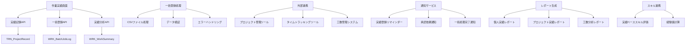
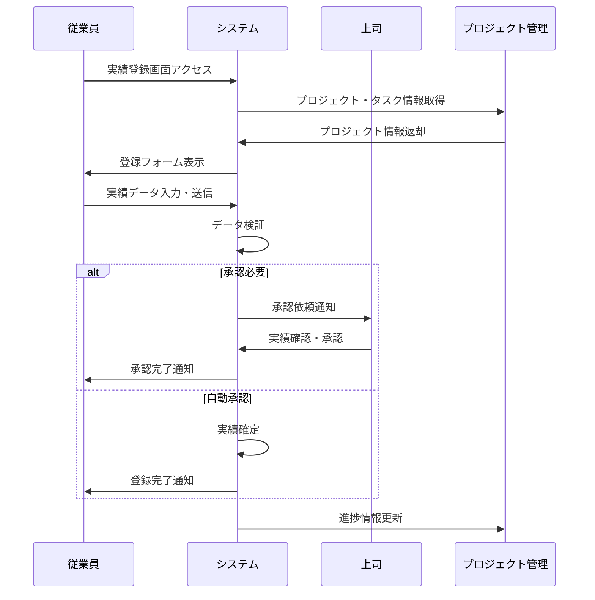
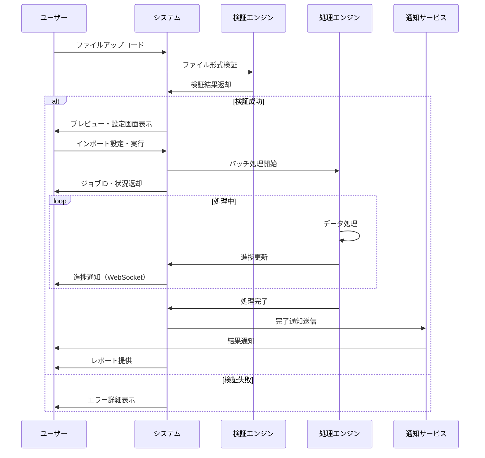
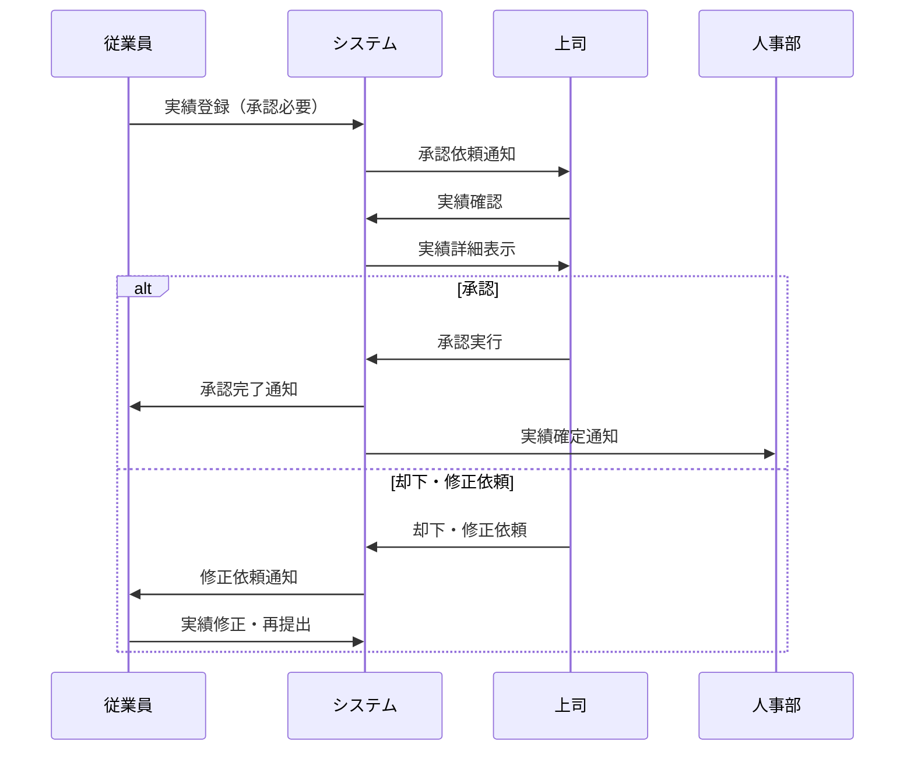

# インターフェース仕様書：作業実績管理 (IF-006)

| 項目                | 内容                                                                                |
|---------------------|------------------------------------------------------------------------------------|
| **インターフェースID** | IF-006                                                                          |
| **名称**            | 作業実績管理                                                                        |
| **インターフェース方式** | 内部                                                                           |
| **インターフェース種別** | 画面-API                                                                       |
| **概要**            | プロジェクト作業実績の記録・管理、一括登録機能                                      |
| **主な連携先**      | SCR-WORK/WORK-BULK                                                                |
| **主なAPI/バッチID** | API-014, API-015                                                                  |
| **主なテーブル/データ** | TRN_ProjectRecord, WRK_BatchJobLog                                             |
| **主な機能ID**      | F11, F12                                                                           |
| **優先度**          | 中/低                                                                               |
| **備考**            | 一括登録はオンラインバッチ                                                          |

## 1. インターフェース概要

作業実績管理インターフェース（IF-006）は、従業員のプロジェクト作業実績を効率的に記録・管理するシステムです。日々の作業時間、タスク進捗、成果物の記録から、一括データ登録、実績分析まで、プロジェクト管理と人材評価に必要な作業データを包括的に管理します。

## 2. システムアーキテクチャ



## 3. API仕様

### 3.1 API-014: 作業実績記録API

#### 3.1.1 作業実績登録・更新

**エンドポイント**: `POST /api/work/records`

```typescript
interface WorkRecordRequest {
  recordId?: string;            // 実績ID（更新時）
  employeeId: string;           // 従業員ID
  projectId: string;            // プロジェクトID
  taskId?: string;              // タスクID
  workDate: Date;               // 作業日
  startTime?: string;           // 開始時間
  endTime?: string;             // 終了時間
  workHours: number;            // 作業時間
  workType: 'DEVELOPMENT' | 'DESIGN' | 'TESTING' | 'MEETING' | 'DOCUMENTATION' | 'RESEARCH' | 'SUPPORT' | 'OTHER';
  workCategory: string;         // 作業カテゴリ
  description: string;          // 作業内容
  deliverables: Deliverable[];  // 成果物
  technologies: string[];       // 使用技術
  skillsUsed: string[];         // 使用スキル
  difficulty: 'LOW' | 'MEDIUM' | 'HIGH' | 'EXPERT';
  progress: number;             // 進捗率（0-100）
  issues: Issue[];              // 課題・問題
  achievements: string[];       // 達成事項
  learnings: string[];          // 学習事項
  nextActions: string[];        // 次のアクション
  approvalRequired: boolean;    // 承認必要フラグ
  billable: boolean;            // 請求可能フラグ
  overtime: boolean;            // 残業フラグ
  location: 'OFFICE' | 'HOME' | 'CLIENT' | 'OTHER';
  notes: string;                // 備考
}

interface Deliverable {
  deliverableId: string;
  name: string;
  type: 'DOCUMENT' | 'CODE' | 'DESIGN' | 'TEST_CASE' | 'REPORT' | 'OTHER';
  description: string;
  fileUrl?: string;
  completionRate: number;       // 完成度（0-100）
  quality: 'DRAFT' | 'REVIEW' | 'APPROVED' | 'FINAL';
}

interface Issue {
  issueId: string;
  title: string;
  description: string;
  severity: 'LOW' | 'MEDIUM' | 'HIGH' | 'CRITICAL';
  status: 'OPEN' | 'IN_PROGRESS' | 'RESOLVED' | 'CLOSED';
  assignedTo?: string;
  dueDate?: Date;
  resolution?: string;
}
```

**レスポンス例**:
```json
{
  "status": "success",
  "data": {
    "recordId": "WRK-2025-001",
    "employeeId": "EMP-001",
    "projectId": "PRJ-001",
    "projectName": "スキル管理システム開発",
    "workDate": "2025-05-30T00:00:00Z",
    "workHours": 8.0,
    "workType": "DEVELOPMENT",
    "workCategory": "フロントエンド開発",
    "description": "ユーザー管理画面のReactコンポーネント実装",
    "deliverables": [
      {
        "deliverableId": "DEL-001",
        "name": "UserManagement.tsx",
        "type": "CODE",
        "description": "ユーザー管理画面コンポーネント",
        "completionRate": 80
      }
    ],
    "technologies": ["React", "TypeScript", "Material-UI"],
    "skillsUsed": ["フロントエンド開発", "React", "TypeScript"],
    "difficulty": "MEDIUM",
    "progress": 75,
    "status": "PENDING_APPROVAL",
    "createdAt": "2025-05-30T18:00:00Z"
  }
}
```

#### 3.1.2 作業実績一覧取得

**エンドポイント**: `GET /api/work/records`

**クエリパラメータ**:
```typescript
interface WorkRecordQuery {
  employeeId?: string;          // 従業員ID
  projectId?: string;           // プロジェクトID
  workDateFrom?: Date;          // 作業日（開始）
  workDateTo?: Date;            // 作業日（終了）
  workType?: string;            // 作業種別
  status?: string;              // 状態
  approvalStatus?: string;      // 承認状態
  billable?: boolean;           // 請求可能
  page?: number;                // ページ番号
  limit?: number;               // 取得件数
  sortBy?: 'workDate' | 'workHours' | 'createdAt';
  sortOrder?: 'asc' | 'desc';
}
```

#### 3.1.3 作業実績承認

**エンドポイント**: `PUT /api/work/records/{recordId}/approval`

```typescript
interface WorkRecordApprovalRequest {
  approverId: string;           // 承認者ID
  approvalStatus: 'APPROVED' | 'REJECTED' | 'PENDING_REVISION';
  approvalComment: string;      // 承認コメント
  revisionRequests?: RevisionRequest[];
  approvedHours?: number;       // 承認時間（調整時）
  approvalDate: Date;           // 承認日時
}

interface RevisionRequest {
  field: string;                // 修正対象フィールド
  currentValue: any;            // 現在値
  suggestedValue: any;          // 提案値
  reason: string;               // 修正理由
}
```

### 3.2 API-015: 一括登録API

#### 3.2.1 一括登録実行

**エンドポイント**: `POST /api/work/bulk-import`

```typescript
interface BulkImportRequest {
  importType: 'CSV' | 'EXCEL' | 'JSON';
  fileData: string;             // Base64エンコードファイルデータ
  fileName: string;             // ファイル名
  employeeId: string;           // 実行者ID
  projectId?: string;           // 対象プロジェクトID
  validateOnly: boolean;        // 検証のみフラグ
  overwriteExisting: boolean;   // 既存データ上書きフラグ
  importOptions: ImportOptions;
}

interface ImportOptions {
  dateFormat: string;           // 日付フォーマット
  timeFormat: string;           // 時間フォーマット
  encoding: string;             // 文字エンコーディング
  delimiter: string;            // 区切り文字（CSV用）
  skipHeaderRows: number;       // ヘッダー行スキップ数
  columnMapping: ColumnMapping[];
  validationRules: ValidationRule[];
}

interface ColumnMapping {
  columnIndex: number;          // 列インデックス
  fieldName: string;            // フィールド名
  dataType: 'STRING' | 'NUMBER' | 'DATE' | 'TIME' | 'BOOLEAN';
  required: boolean;            // 必須フラグ
  defaultValue?: any;           // デフォルト値
  transformation?: string;      // 変換ルール
}

interface ValidationRule {
  field: string;                // 対象フィールド
  ruleType: 'REQUIRED' | 'RANGE' | 'FORMAT' | 'UNIQUE' | 'REFERENCE';
  parameters: any;              // ルールパラメータ
  errorMessage: string;         // エラーメッセージ
}
```

**レスポンス例**:
```json
{
  "status": "success",
  "data": {
    "jobId": "BULK-2025-001",
    "importType": "CSV",
    "fileName": "work_records_202505.csv",
    "status": "IN_PROGRESS",
    "totalRows": 150,
    "processedRows": 0,
    "successRows": 0,
    "errorRows": 0,
    "validationErrors": [],
    "estimatedCompletionTime": "2025-05-30T18:15:00Z",
    "startedAt": "2025-05-30T18:00:00Z"
  }
}
```

#### 3.2.2 一括登録状況確認

**エンドポイント**: `GET /api/work/bulk-import/{jobId}/status`

**レスポンス例**:
```json
{
  "status": "success",
  "data": {
    "jobId": "BULK-2025-001",
    "status": "COMPLETED",
    "progress": 100,
    "totalRows": 150,
    "processedRows": 150,
    "successRows": 145,
    "errorRows": 5,
    "validationErrors": [
      {
        "row": 23,
        "field": "workHours",
        "error": "作業時間は0以上24以下で入力してください",
        "value": "25.5"
      }
    ],
    "processingLog": [
      {
        "timestamp": "2025-05-30T18:05:00Z",
        "message": "データ検証開始",
        "level": "INFO"
      }
    ],
    "completedAt": "2025-05-30T18:12:00Z",
    "downloadUrls": {
      "successReport": "/api/work/bulk-import/BULK-2025-001/success-report",
      "errorReport": "/api/work/bulk-import/BULK-2025-001/error-report"
    }
  }
}
```

#### 3.2.3 一括登録テンプレート取得

**エンドポイント**: `GET /api/work/bulk-import/template`

**クエリパラメータ**:
```typescript
interface TemplateQuery {
  format: 'CSV' | 'EXCEL';
  includeExample: boolean;      // サンプルデータ含む
  projectId?: string;           // プロジェクト固有テンプレート
}
```

## 4. データベース仕様

### 4.1 TRN_ProjectRecordテーブル

| フィールド名 | データ型 | 必須 | 説明 |
|-------------|---------|------|------|
| record_id | String | ○ | 実績ID（主キー） |
| employee_id | String | ○ | 従業員ID |
| project_id | String | ○ | プロジェクトID |
| task_id | String | × | タスクID |
| work_date | Date | ○ | 作業日 |
| start_time | Time | × | 開始時間 |
| end_time | Time | × | 終了時間 |
| work_hours | Decimal | ○ | 作業時間 |
| work_type | String | ○ | 作業種別 |
| work_category | String | ○ | 作業カテゴリ |
| description | Text | ○ | 作業内容 |
| deliverables | JSON | × | 成果物 |
| technologies | JSON | × | 使用技術 |
| skills_used | JSON | × | 使用スキル |
| difficulty | String | ○ | 難易度 |
| progress | Integer | ○ | 進捗率 |
| issues | JSON | × | 課題・問題 |
| achievements | JSON | × | 達成事項 |
| learnings | JSON | × | 学習事項 |
| next_actions | JSON | × | 次のアクション |
| approval_required | Boolean | ○ | 承認必要フラグ |
| approval_status | String | ○ | 承認状態 |
| approved_by | String | × | 承認者ID |
| approved_at | DateTime | × | 承認日時 |
| approval_comment | Text | × | 承認コメント |
| billable | Boolean | ○ | 請求可能フラグ |
| overtime | Boolean | ○ | 残業フラグ |
| location | String | ○ | 作業場所 |
| notes | Text | × | 備考 |
| created_at | DateTime | ○ | 作成日時 |
| updated_at | DateTime | ○ | 更新日時 |

### 4.2 WRK_BatchJobLogテーブル

| フィールド名 | データ型 | 必須 | 説明 |
|-------------|---------|------|------|
| job_id | String | ○ | ジョブID（主キー） |
| job_type | String | ○ | ジョブ種別 |
| import_type | String | ○ | インポート種別 |
| file_name | String | ○ | ファイル名 |
| file_size | Integer | ○ | ファイルサイズ |
| executed_by | String | ○ | 実行者ID |
| status | String | ○ | 状態 |
| progress | Integer | ○ | 進捗率 |
| total_rows | Integer | ○ | 総行数 |
| processed_rows | Integer | ○ | 処理済み行数 |
| success_rows | Integer | ○ | 成功行数 |
| error_rows | Integer | ○ | エラー行数 |
| validation_errors | JSON | × | 検証エラー |
| processing_log | JSON | × | 処理ログ |
| import_options | JSON | × | インポートオプション |
| started_at | DateTime | ○ | 開始日時 |
| completed_at | DateTime | × | 完了日時 |
| error_report_url | String | × | エラーレポートURL |
| success_report_url | String | × | 成功レポートURL |

### 4.3 WRK_WorkSummaryテーブル

| フィールド名 | データ型 | 必須 | 説明 |
|-------------|---------|------|------|
| summary_id | String | ○ | サマリーID（主キー） |
| employee_id | String | ○ | 従業員ID |
| project_id | String | ○ | プロジェクトID |
| summary_period | String | ○ | 集計期間（"DAILY"/"WEEKLY"/"MONTHLY"） |
| summary_date | Date | ○ | 集計日 |
| total_hours | Decimal | ○ | 総作業時間 |
| billable_hours | Decimal | ○ | 請求可能時間 |
| overtime_hours | Decimal | ○ | 残業時間 |
| work_type_breakdown | JSON | × | 作業種別内訳 |
| skill_usage_summary | JSON | × | スキル使用サマリー |
| technology_usage | JSON | × | 技術使用状況 |
| productivity_metrics | JSON | × | 生産性指標 |
| created_at | DateTime | ○ | 作成日時 |
| updated_at | DateTime | ○ | 更新日時 |

## 5. 画面仕様

### 5.1 作業実績画面（SCR-WORK）

#### 5.1.1 実績登録・編集

```typescript
interface WorkRecordScreen {
  // 基本情報
  basicInfo: {
    workDate: Date;
    projectId: string;
    taskId?: string;
    workHours: number;
    workType: string;
    workCategory: string;
  };
  
  // 作業詳細
  workDetails: {
    description: string;
    startTime?: string;
    endTime?: string;
    location: string;
    difficulty: string;
    progress: number;
  };
  
  // 技術・スキル
  technicalInfo: {
    technologies: string[];
    skillsUsed: string[];
    deliverables: DeliverableForm[];
  };
  
  // 課題・学習
  issuesAndLearnings: {
    issues: IssueForm[];
    achievements: string[];
    learnings: string[];
    nextActions: string[];
  };
  
  // その他
  additionalInfo: {
    billable: boolean;
    overtime: boolean;
    approvalRequired: boolean;
    notes: string;
  };
}

interface DeliverableForm {
  name: string;
  type: string;
  description: string;
  completionRate: number;
  fileUpload?: File;
}

interface IssueForm {
  title: string;
  description: string;
  severity: string;
  status: string;
  dueDate?: Date;
}
```

#### 5.1.2 実績一覧・検索

```typescript
interface WorkRecordListScreen {
  // フィルター
  filters: {
    dateRange: DateRange;
    projectId?: string;
    workType?: string;
    approvalStatus?: string;
    billable?: boolean;
  };
  
  // 実績一覧
  recordList: WorkRecordSummary[];
  
  // 集計情報
  summary: {
    totalHours: number;
    billableHours: number;
    overtimeHours: number;
    pendingApprovalCount: number;
    thisWeekHours: number;
    thisMonthHours: number;
  };
  
  // カレンダービュー
  calendarView: CalendarWorkRecord[];
}

interface WorkRecordSummary {
  recordId: string;
  workDate: Date;
  projectName: string;
  workType: string;
  workHours: number;
  description: string;
  approvalStatus: string;
  billable: boolean;
  overtime: boolean;
}

interface CalendarWorkRecord {
  date: Date;
  totalHours: number;
  records: WorkRecordSummary[];
  hasIssues: boolean;
  approvalPending: boolean;
}
```

### 5.2 一括登録画面（SCR-WORK-BULK）

#### 5.2.1 ファイルアップロード

```typescript
interface BulkImportScreen {
  // ファイル選択
  fileUpload: {
    selectedFile?: File;
    importType: 'CSV' | 'EXCEL' | 'JSON';
    previewData: any[][];
    columnHeaders: string[];
  };
  
  // インポート設定
  importSettings: {
    projectId?: string;
    dateFormat: string;
    timeFormat: string;
    encoding: string;
    delimiter: string;
    skipHeaderRows: number;
    overwriteExisting: boolean;
  };
  
  // カラムマッピング
  columnMapping: ColumnMappingForm[];
  
  // 検証設定
  validationSettings: {
    validateOnly: boolean;
    strictValidation: boolean;
    customRules: ValidationRuleForm[];
  };
}

interface ColumnMappingForm {
  columnIndex: number;
  columnName: string;
  mappedField: string;
  dataType: string;
  required: boolean;
  defaultValue?: any;
  sampleValues: any[];
}

interface ValidationRuleForm {
  field: string;
  ruleType: string;
  parameters: any;
  enabled: boolean;
}
```

#### 5.2.2 処理状況・結果

```typescript
interface BulkImportStatusScreen {
  // 処理状況
  jobStatus: {
    jobId: string;
    status: string;
    progress: number;
    estimatedCompletion?: Date;
    elapsedTime: number;
  };
  
  // 処理結果
  results: {
    totalRows: number;
    processedRows: number;
    successRows: number;
    errorRows: number;
    warningRows: number;
  };
  
  // エラー詳細
  errors: ImportError[];
  
  // 処理ログ
  processingLog: LogEntry[];
  
  // ダウンロード
  downloadOptions: {
    successReport: boolean;
    errorReport: boolean;
    processedData: boolean;
  };
}

interface ImportError {
  row: number;
  field: string;
  error: string;
  value: any;
  suggestion?: string;
}

interface LogEntry {
  timestamp: Date;
  level: 'INFO' | 'WARNING' | 'ERROR';
  message: string;
  details?: any;
}
```

## 6. 業務フロー

### 6.1 日次実績登録フロー



### 6.2 一括登録フロー



### 6.3 承認フロー



## 7. 一括登録処理仕様

### 7.1 ファイル処理エンジン

```typescript
interface FileProcessingEngine {
  async processFile(
    fileData: Buffer,
    importOptions: ImportOptions
  ): Promise<ProcessingResult> {
    
    // 1. ファイル形式判定・パース
    const parsedData = await this.parseFile(fileData, importOptions);
    
    // 2. データ検証
    const validationResult = await this.validateData(parsedData, importOptions);
    
    // 3. データ変換
    const transformedData = await this.transformData(
      validationResult.validRows,
      importOptions
    );
    
    // 4. データベース登録
    const insertResult = await this.insertData(transformedData);
    
    return {
      totalRows: parsedData.length,
      validRows: validationResult.validRows.length,
      errorRows: validationResult.errorRows.length,
      insertedRows: insertResult.successCount,
      errors: validationResult.errors,
      warnings: validationResult.warnings
    };
  }
  
  private async parseFile(
    fileData: Buffer,
    options: ImportOptions
  ): Promise<any[]> {
    switch (options.importType) {
      case 'CSV':
        return this.parseCSV(fileData, options);
      case 'EXCEL':
        return this.parseExcel(fileData, options);
      case 'JSON':
        return this.parseJSON(fileData, options);
      default:
        throw new Error(`Unsupported import type: ${options.importType}`);
    }
  }
  
  private async validateData(
    data: any[],
    options: ImportOptions
  ): Promise<ValidationResult> {
    const validRows: any[] = [];
    const errorRows: any[] = [];
    const errors: ValidationError[] = [];
    const warnings: ValidationWarning[] = [];
    
    for (let i = 0; i < data.length; i++) {
      const row = data[i];
      const rowValidation = await this.validateRow(row, options.validationRules, i + 1);
      
      if (rowValidation.isValid) {
        validRows.push(row);
        warnings.push(...rowValidation.warnings);
      } else {
        errorRows.push(row);
        errors.push(...rowValidation.errors);
      }
    }
    
    return { validRows, errorRows, errors, warnings };
  }
}
```

### 7.2 データ検証ルール

```typescript
interface DataValidationEngine {
  async validateRow(
    row: any,
    rules: ValidationRule[],
    rowNumber: number
  ): Promise<RowValidationResult> {
    const errors: ValidationError[] = [];
    const warnings: ValidationWarning[] = [];
    
    for (const rule of rules) {
      const result = await this.applyRule(row, rule, rowNumber);
      
      if (result.type === 'ERROR') {
        errors.push(result);
      } else if (result.type === 'WARNING') {
        warnings.push(result);
      }
    }
    
    return {
      isValid: errors.length === 0,
      errors,
      warnings
    };
  }
  
  private async applyRule(
    row: any,
    rule: ValidationRule,
    rowNumber: number
  ): Promise<ValidationError | ValidationWarning | null> {
    const value = row[rule.field];
    
    switch (rule.ruleType) {
      case 'REQUIRED':
        if (!
