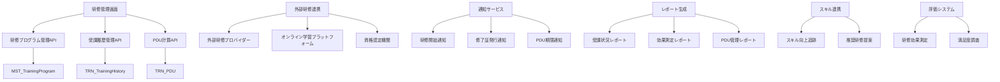
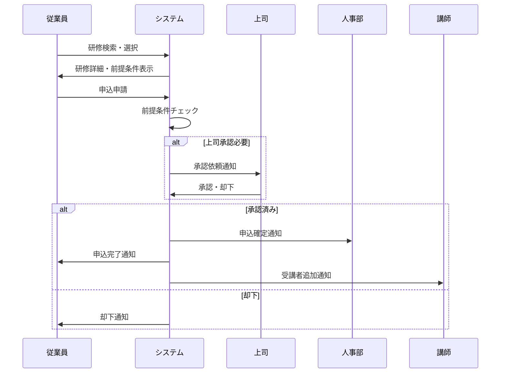
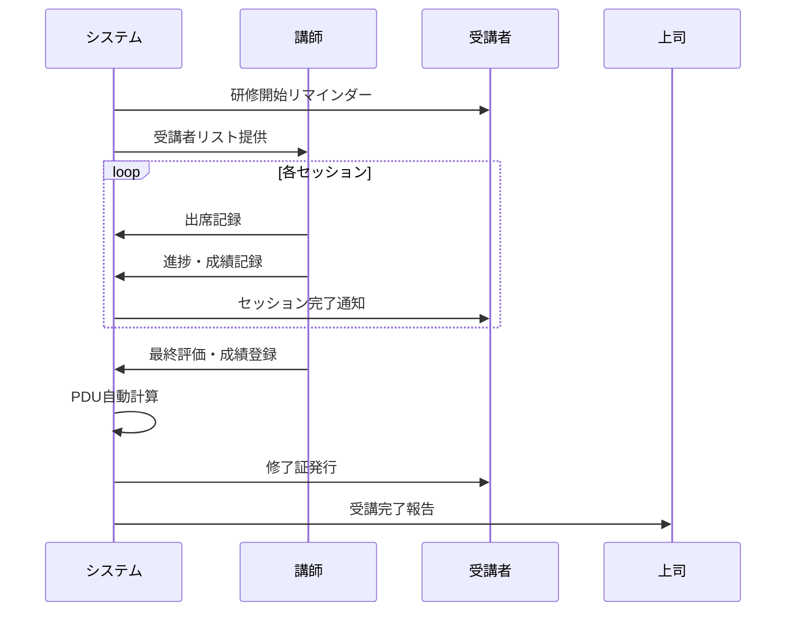
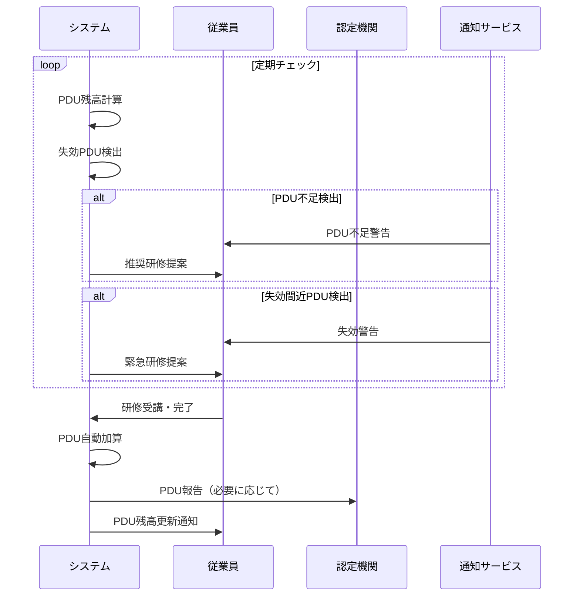

# インターフェース仕様書：研修・教育管理 (IF-007)

| 項目                | 内容                                                                                |
|---------------------|------------------------------------------------------------------------------------|
| **インターフェースID** | IF-007                                                                          |
| **名称**            | 研修・教育管理                                                                      |
| **インターフェース方式** | 内部                                                                           |
| **インターフェース種別** | 画面-API                                                                       |
| **概要**            | 研修プログラム管理、受講履歴管理、PDU自動計算機能                                    |
| **主な連携先**      | SCR-TRAIN/TRAIN-M                                                                  |
| **主なAPI/バッチID** | API-016, API-017                                                                  |
| **主なテーブル/データ** | TRN_TrainingHistory, TRN_PDU                                                   |
| **主な機能ID**      | F13, F14                                                                           |
| **優先度**          | 中                                                                                  |
| **備考**            | PDU自動計算                                                                         |

## 1. インターフェース概要

研修・教育管理インターフェース（IF-007）は、組織の人材育成を支援する包括的な研修管理システムです。研修プログラムの企画・実施から受講者の履歴管理、継続教育単位（PDU）の自動計算まで、教育プロセス全体を効率的に管理し、従業員のスキル向上と資格維持を支援します。

## 2. システムアーキテクチャ



## 3. API仕様

### 3.1 API-016: 研修プログラム管理API

#### 3.1.1 研修プログラム登録・更新

**エンドポイント**: `POST /api/training/programs`

```typescript
interface TrainingProgramRequest {
  programId?: string;           // プログラムID（更新時）
  title: string;                // 研修タイトル
  description: string;          // 研修説明
  category: string;             // 研修カテゴリ
  type: 'INTERNAL' | 'EXTERNAL' | 'ONLINE' | 'CERTIFICATION';
  level: 'BEGINNER' | 'INTERMEDIATE' | 'ADVANCED' | 'EXPERT';
  duration: number;             // 研修時間（時間）
  capacity: number;             // 定員
  prerequisites: string[];      // 前提条件
  objectives: string[];         // 学習目標
  curriculum: CurriculumItem[]; // カリキュラム
  instructor: InstructorInfo;   // 講師情報
  schedule: TrainingSchedule;   // スケジュール
  venue: VenueInfo;            // 会場情報
  cost: CostInfo;              // 費用情報
  materials: MaterialInfo[];    // 教材情報
  certification: CertificationInfo; // 認定情報
  pduCredits: PDUCredit[];     // PDU単位
  targetSkills: string[];      // 対象スキル
  evaluationCriteria: EvaluationCriteria[]; // 評価基準
}

interface CurriculumItem {
  itemId: string;
  title: string;
  description: string;
  duration: number;             // 時間
  type: 'LECTURE' | 'WORKSHOP' | 'EXERCISE' | 'EXAM';
  materials: string[];          // 使用教材
  objectives: string[];         // 学習目標
}

interface InstructorInfo {
  instructorId: string;
  name: string;
  title: string;
  qualifications: string[];
  experience: string;
  rating: number;
}

interface TrainingSchedule {
  startDate: Date;
  endDate: Date;
  sessions: SessionInfo[];
  timezone: string;
}

interface SessionInfo {
  sessionId: string;
  date: Date;
  startTime: string;
  endTime: string;
  topic: string;
  instructorId: string;
}

interface VenueInfo {
  venueType: 'ONSITE' | 'ONLINE' | 'HYBRID';
  location?: string;
  address?: string;
  room?: string;
  capacity?: number;
  equipment: string[];
  onlineUrl?: string;
  accessInfo?: string;
}

interface CostInfo {
  totalCost: number;
  costPerParticipant: number;
  currency: string;
  costBreakdown: CostBreakdownItem[];
  paymentTerms: string;
}

interface CostBreakdownItem {
  category: string;
  amount: number;
  description: string;
}

interface CertificationInfo {
  certificationType: string;
  issuingOrganization: string;
  validityPeriod: number;       // 有効期間（月）
  renewalRequirements: string[];
  certificateTemplate: string;
}

interface PDUCredit {
  category: 'TECHNICAL' | 'LEADERSHIP' | 'STRATEGIC';
  credits: number;
  description: string;
  accreditingBody: string;
}
```

**レスポンス例**:
```json
{
  "status": "success",
  "data": {
    "programId": "TRN-2025-001",
    "title": "プロジェクトマネジメント基礎研修",
    "description": "プロジェクトマネジメントの基本概念と実践的なスキルを習得する研修",
    "category": "PROJECT_MANAGEMENT",
    "type": "INTERNAL",
    "level": "BEGINNER",
    "duration": 16,
    "capacity": 20,
    "status": "ACTIVE",
    "schedule": {
      "startDate": "2025-06-01T09:00:00Z",
      "endDate": "2025-06-02T17:00:00Z",
      "sessions": [
        {
          "sessionId": "SES-001",
          "date": "2025-06-01T09:00:00Z",
          "startTime": "09:00",
          "endTime": "17:00",
          "topic": "プロジェクトマネジメント概論"
        }
      ]
    },
    "pduCredits": [
      {
        "category": "TECHNICAL",
        "credits": 8,
        "description": "プロジェクトマネジメント技術スキル"
      }
    ],
    "enrollmentCount": 0,
    "createdAt": "2025-01-15T09:00:00Z"
  }
}
```

#### 3.1.2 研修プログラム一覧取得

**エンドポイント**: `GET /api/training/programs`

**クエリパラメータ**:
```typescript
interface TrainingProgramQuery {
  category?: string;            // 研修カテゴリ
  type?: string;               // 研修種別
  level?: string;              // レベル
  status?: string;             // 状態
  startDate?: Date;            // 開始日（以降）
  endDate?: Date;              // 終了日（以前）
  instructor?: string;         // 講師ID
  skills?: string[];           // 対象スキル
  pduCategory?: string;        // PDUカテゴリ
  available?: boolean;         // 受講可能
  page?: number;               // ページ番号
  limit?: number;              // 取得件数
  sortBy?: 'startDate' | 'title' | 'popularity';
  sortOrder?: 'asc' | 'desc';
}
```

#### 3.1.3 研修申込・キャンセル

**エンドポイント**: `POST /api/training/programs/{programId}/enrollment`

```typescript
interface EnrollmentRequest {
  employeeId: string;           // 従業員ID
  enrollmentType: 'SELF' | 'MANAGER_ASSIGNED' | 'HR_ASSIGNED';
  priority: 'HIGH' | 'MEDIUM' | 'LOW';
  reason: string;               // 受講理由
  expectedOutcome: string;      // 期待する成果
  managerApproval?: boolean;    // 上司承認
  budgetCode?: string;          // 予算コード
  specialRequirements?: string; // 特別要件
}
```

### 3.2 API-017: 受講履歴・PDU管理API

#### 3.2.1 受講履歴登録

**エンドポイント**: `POST /api/training/history`

```typescript
interface TrainingHistoryRequest {
  employeeId: string;           // 従業員ID
  programId: string;            // プログラムID
  enrollmentDate: Date;         // 申込日
  startDate: Date;              // 受講開始日
  completionDate?: Date;        // 修了日
  status: 'ENROLLED' | 'IN_PROGRESS' | 'COMPLETED' | 'CANCELLED' | 'FAILED';
  attendanceRate: number;       // 出席率（0-100）
  score?: number;               // 成績
  grade?: string;               // 評価
  feedback: string;             // フィードバック
  satisfaction: number;         // 満足度（1-5）
  certificateIssued: boolean;   // 修了証発行
  certificateNumber?: string;   // 修了証番号
  pduEarned: PDUEarned[];      // 獲得PDU
  skillsAcquired: string[];    // 習得スキル
  actionPlan: string;          // アクションプラン
}

interface PDUEarned {
  category: 'TECHNICAL' | 'LEADERSHIP' | 'STRATEGIC';
  credits: number;
  earnedDate: Date;
  expiryDate: Date;
  accreditingBody: string;
  certificateNumber?: string;
}
```

#### 3.2.2 PDU残高照会

**エンドポイント**: `GET /api/training/pdu/balance/{employeeId}`

**レスポンス例**:
```json
{
  "status": "success",
  "data": {
    "employeeId": "EMP-001",
    "employee": {
      "name": "田中太郎",
      "certifications": [
        {
          "certificationId": "PMP-001",
          "name": "Project Management Professional",
          "issueDate": "2023-01-15T00:00:00Z",
          "expiryDate": "2026-01-15T00:00:00Z",
          "requiredPDU": 60
        }
      ]
    },
    "pduBalance": {
      "technical": {
        "earned": 25,
        "required": 35,
        "remaining": 10,
        "expiringIn6Months": 5
      },
      "leadership": {
        "earned": 15,
        "required": 25,
        "remaining": 10,
        "expiringIn6Months": 3
      },
      "strategic": {
        "earned": 0,
        "required": 0,
        "remaining": 0,
        "expiringIn6Months": 0
      },
      "total": {
        "earned": 40,
        "required": 60,
        "remaining": 20,
        "expiringIn6Months": 8
      }
    },
    "recentPDU": [
      {
        "pduId": "PDU-001",
        "programTitle": "アジャイル開発実践研修",
        "category": "TECHNICAL",
        "credits": 8,
        "earnedDate": "2025-03-15T00:00:00Z",
        "expiryDate": "2028-03-15T00:00:00Z"
      }
    ],
    "recommendations": [
      {
        "type": "URGENT",
        "message": "6ヶ月以内に8PDUが失効します。早急に研修を受講してください。",
        "suggestedPrograms": ["TRN-2025-005", "TRN-2025-008"]
      }
    ]
  }
}
```

#### 3.2.3 PDU自動計算・更新

**エンドポイント**: `PUT /api/training/pdu/calculate/{employeeId}`

```typescript
interface PDUCalculationRequest {
  calculationDate: Date;        // 計算基準日
  includeExpired: boolean;      // 失効分を含む
  recalculateAll: boolean;      // 全件再計算
}

interface PDUCalculationResult {
  employeeId: string;
  calculationDate: Date;
  totalPDUEarned: number;
  totalPDUExpired: number;
  currentBalance: PDUBalance;
  expiringPDU: ExpiringPDU[];
  recommendations: PDURecommendation[];
  calculationLog: CalculationLogEntry[];
}

interface ExpiringPDU {
  pduId: string;
  category: string;
  credits: number;
  expiryDate: Date;
  daysToExpiry: number;
  programTitle: string;
}

interface PDURecommendation {
  type: 'URGENT' | 'WARNING' | 'INFO';
  priority: number;
  message: string;
  actionRequired: string;
  suggestedPrograms: string[];
  deadline?: Date;
}
```

## 4. データベース仕様

### 4.1 MST_TrainingProgramテーブル

| フィールド名 | データ型 | 必須 | 説明 |
|-------------|---------|------|------|
| program_id | String | ○ | プログラムID（主キー） |
| title | String | ○ | 研修タイトル |
| description | Text | ○ | 研修説明 |
| category | String | ○ | 研修カテゴリ |
| type | String | ○ | 研修種別 |
| level | String | ○ | レベル |
| duration | Integer | ○ | 研修時間 |
| capacity | Integer | ○ | 定員 |
| prerequisites | JSON | × | 前提条件 |
| objectives | JSON | × | 学習目標 |
| curriculum | JSON | × | カリキュラム |
| instructor_info | JSON | × | 講師情報 |
| schedule | JSON | × | スケジュール |
| venue_info | JSON | × | 会場情報 |
| cost_info | JSON | × | 費用情報 |
| certification_info | JSON | × | 認定情報 |
| pdu_credits | JSON | × | PDU単位 |
| target_skills | JSON | × | 対象スキル |
| status | String | ○ | 状態（"ACTIVE"/"INACTIVE"/"CANCELLED"） |
| created_by | String | ○ | 作成者ID |
| created_at | DateTime | ○ | 作成日時 |
| updated_at | DateTime | ○ | 更新日時 |

### 4.2 TRN_TrainingHistoryテーブル

| フィールド名 | データ型 | 必須 | 説明 |
|-------------|---------|------|------|
| history_id | String | ○ | 履歴ID（主キー） |
| employee_id | String | ○ | 従業員ID |
| program_id | String | ○ | プログラムID |
| enrollment_date | Date | ○ | 申込日 |
| start_date | Date | ○ | 受講開始日 |
| completion_date | Date | × | 修了日 |
| status | String | ○ | 状態 |
| attendance_rate | Decimal | ○ | 出席率 |
| score | Decimal | × | 成績 |
| grade | String | × | 評価 |
| feedback | Text | × | フィードバック |
| satisfaction | Integer | × | 満足度 |
| certificate_issued | Boolean | ○ | 修了証発行フラグ |
| certificate_number | String | × | 修了証番号 |
| skills_acquired | JSON | × | 習得スキル |
| action_plan | Text | × | アクションプラン |
| created_at | DateTime | ○ | 作成日時 |
| updated_at | DateTime | ○ | 更新日時 |

### 4.3 TRN_PDUテーブル

| フィールド名 | データ型 | 必須 | 説明 |
|-------------|---------|------|------|
| pdu_id | String | ○ | PDU ID（主キー） |
| employee_id | String | ○ | 従業員ID |
| history_id | String | × | 履歴ID |
| category | String | ○ | PDUカテゴリ |
| credits | Decimal | ○ | 単位数 |
| earned_date | Date | ○ | 取得日 |
| expiry_date | Date | ○ | 失効日 |
| accrediting_body | String | ○ | 認定機関 |
| certificate_number | String | × | 証明書番号 |
| program_title | String | ○ | プログラム名 |
| status | String | ○ | 状態（"ACTIVE"/"EXPIRED"/"CANCELLED"） |
| created_at | DateTime | ○ | 作成日時 |
| updated_at | DateTime | ○ | 更新日時 |

### 4.4 MST_Certificationテーブル

| フィールド名 | データ型 | 必須 | 説明 |
|-------------|---------|------|------|
| certification_id | String | ○ | 資格ID（主キー） |
| employee_id | String | ○ | 従業員ID |
| certification_name | String | ○ | 資格名 |
| issuing_organization | String | ○ | 発行機関 |
| issue_date | Date | ○ | 取得日 |
| expiry_date | Date | × | 失効日 |
| certificate_number | String | × | 証明書番号 |
| required_pdu | Integer | × | 必要PDU |
| pdu_cycle_months | Integer | × | PDUサイクル（月） |
| status | String | ○ | 状態（"ACTIVE"/"EXPIRED"/"SUSPENDED"） |
| created_at | DateTime | ○ | 作成日時 |
| updated_at | DateTime | ○ | 更新日時 |

## 5. 画面仕様

### 5.1 研修管理画面（SCR-TRAIN）

#### 5.1.1 研修プログラム一覧

```typescript
interface TrainingListScreen {
  // フィルター
  filters: {
    category: string;
    type: string;
    level: string;
    dateRange: DateRange;
    availability: boolean;
  };
  
  // 研修一覧
  programList: TrainingProgramSummary[];
  
  // 申込状況
  enrollmentStatus: {
    totalPrograms: number;
    availablePrograms: number;
    enrolledPrograms: number;
    completedPrograms: number;
  };
  
  // 推奨研修
  recommendedPrograms: RecommendedProgram[];
}

interface TrainingProgramSummary {
  programId: string;
  title: string;
  category: string;
  type: string;
  level: string;
  duration: number;
  startDate: Date;
  capacity: number;
  enrolledCount: number;
  pduCredits: number;
  rating: number;
  isEnrolled: boolean;
  canEnroll: boolean;
}

interface RecommendedProgram {
  programId: string;
  title: string;
  reason: string;
  priority: 'HIGH' | 'MEDIUM' | 'LOW';
  skillGap: string[];
  pduNeeded: boolean;
}
```

#### 5.1.2 研修詳細・申込

```typescript
interface TrainingDetailScreen {
  programInfo: {
    basicInfo: TrainingBasicInfo;
    curriculum: CurriculumDetail[];
    instructor: InstructorDetail;
    schedule: ScheduleDetail;
    venue: VenueDetail;
    cost: CostDetail;
  };
  
  enrollmentInfo: {
    canEnroll: boolean;
    enrollmentDeadline: Date;
    prerequisites: PrerequisiteCheck[];
    managerApprovalRequired: boolean;
  };
  
  reviews: TrainingReview[];
  relatedPrograms: RelatedProgram[];
}

interface PrerequisiteCheck {
  requirement: string;
  satisfied: boolean;
  details: string;
}

interface TrainingReview {
  reviewId: string;
  employeeName: string;
  rating: number;
  comment: string;
  completionDate: Date;
  helpful: number;
}
```

### 5.2 研修管理画面（SCR-TRAIN-M）

#### 5.2.1 プログラム管理

```typescript
interface ProgramManagementScreen {
  // プログラム作成・編集
  programForm: TrainingProgramForm;
  
  // プログラム一覧
  managedPrograms: ManagedProgram[];
  
  // 統計情報
  statistics: {
    totalPrograms: number;
    activePrograms: number;
    totalEnrollments: number;
    completionRate: number;
    averageRating: number;
  };
}

interface ManagedProgram {
  programId: string;
  title: string;
  status: string;
  enrollmentCount: number;
  capacity: number;
  startDate: Date;
  completionRate: number;
  rating: number;
  revenue: number;
}
```

#### 5.2.2 受講者管理

```typescript
interface ParticipantManagementScreen {
  // 受講者一覧
  participants: ParticipantInfo[];
  
  // 出席管理
  attendanceTracking: AttendanceRecord[];
  
  // 成績管理
  gradeManagement: GradeRecord[];
  
  // 修了証発行
  certificateIssuance: CertificateRequest[];
}

interface ParticipantInfo {
  employeeId: string;
  name: string;
  department: string;
  enrollmentDate: Date;
  status: string;
  attendanceRate: number;
  currentScore: number;
  lastActivity: Date;
}

interface AttendanceRecord {
  sessionId: string;
  sessionDate: Date;
  sessionTitle: string;
  attendees: AttendeeInfo[];
}

interface AttendeeInfo {
  employeeId: string;
  name: string;
  status: 'PRESENT' | 'ABSENT' | 'LATE' | 'EARLY_LEAVE';
  checkInTime?: Date;
  checkOutTime?: Date;
  notes?: string;
}
```

## 6. 業務フロー

### 6.1 研修申込フロー



### 6.2 研修実施フロー



### 6.3 PDU管理フロー



## 7. PDU自動計算仕様

### 7.1 PDU計算エンジン

```typescript
interface PDUCalculationEngine {
  async calculatePDUBalance(employeeId: string): Promise<PDUBalance> {
    const certifications = await this.getEmployeeCertifications(employeeId);
    const pduHistory = await this.getPDUHistory(employeeId);
    
    const balance: PDUBalance = {
      technical: { earned: 0, required: 0, remaining: 0, expiringIn6Months: 0 },
      leadership: { earned: 0, required: 0, remaining: 0, expiringIn6Months: 0 },
      strategic: { earned: 0, required: 0, remaining: 0, expiringIn6Months: 0 },
      total: { earned: 0, required: 0, remaining: 0, expiringIn6Months: 0 }
    };
    
    for (const cert of certifications) {
      const requirements = await this.getCertificationRequirements(cert.certificationId);
      const earnedPDU = this.calculateEarnedPDU(pduHistory, cert.issueDate, cert.expiryDate);
      const expiringPDU = this.calculateExpiringPDU(pduHistory, 6); // 6ヶ月以内
      
      // カテゴリ別計算
      for (const category of ['technical', 'leadership', 'strategic']) {
        balance[category].required += requirements[category] || 0;
        balance[category].earned += earnedPDU[category] || 0;
        balance[category].remaining = Math.max(0, balance[category].required - balance[category].earned);
        balance[category].expiringIn6Months += expiringPDU[category] || 0;
      }
    }
    
    // 合計計算
    balance.total = this.calculateTotalBalance(balance);
    
    return balance;
  }
  
  private calculateEarnedPDU(
    pduHistory: PDURecord[],
    certIssueDate: Date,
    certExpiryDate: Date
  ): PDUByCategory {
    const validPDU = pduHistory.filter(pdu => 
      pdu.earnedDate >= certIssueDate && 
      pdu.earnedDate <= certExpiryDate &&
      pdu.status === 'ACTIVE'
    );
    
    return this.groupPDUByCategory(validPDU);
  }
  
  private calculateExpiringPDU(
    pduHistory: PDURecord[],
    monthsAhead: number
  ): PDUByCategory {
    const cutoffDate = new Date();
    cutoffDate.setMonth(cutoffDate.getMonth() + monthsAhead);
    
    const expiringPDU = pduHistory.filter(pdu =>
      pdu.expiryDate <= cutoffDate &&
      pdu.status === 'ACTIVE'
    );
    
    return this.groupPDUByCategory(expiringPDU);
  }
}
```

### 7.2 PDU推奨システム

```typescript
interface PDURecommendationEngine {
  async generateRecommendations(employeeId: string): Promise<PDURecommendation[]> {
    const balance = await this.pduCalculationEngine.calculatePDUBalance(employeeId);
