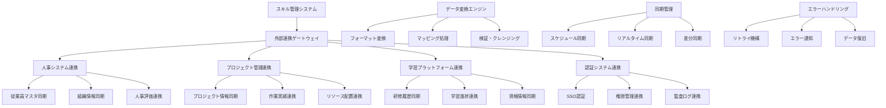

# インターフェース仕様書：外部システム連携 (IF-008)

| 項目                | 内容                                                                                |
|---------------------|------------------------------------------------------------------------------------|
| **インターフェースID** | IF-008                                                                          |
| **名称**            | 外部システム連携                                                                    |
| **インターフェース方式** | 外部                                                                           |
| **インターフェース種別** | API-API                                                                        |
| **概要**            | 人事システム、プロジェクト管理ツール、学習プラットフォーム連携                      |
| **主な連携先**      | EXT-HR/EXT-PM/EXT-LMS                                                             |
| **主なAPI/バッチID** | API-018, API-019, API-020                                                         |
| **主なテーブル/データ** | EXT_SystemConfig, EXT_SyncHistory                                              |
| **主な機能ID**      | F17, F18                                                                           |
| **優先度**          | 中                                                                                  |
| **備考**            | 外部API連携                                                                         |

## 1. インターフェース概要

外部システム連携インターフェース（IF-008）は、スキル管理システムと組織内外の各種システムとの効率的な連携を実現します。人事システムからの従業員情報同期、プロジェクト管理ツールとの作業実績連携、学習プラットフォームとの研修履歴同期により、データの一元管理と業務効率の向上を図ります。

## 2. システムアーキテクチャ



## 3. API仕様

### 3.1 API-018: 人事システム連携API

#### 3.1.1 従業員情報同期

**エンドポイント**: `POST /api/external/hr/employees/sync`

```typescript
interface EmployeeSyncRequest {
  syncType: 'FULL' | 'INCREMENTAL' | 'DELTA';
  lastSyncTimestamp?: Date;     // 差分同期用
  targetEmployees?: string[];   // 特定従業員のみ同期
  syncOptions: {
    includeInactive: boolean;   // 退職者を含む
    includePersonalInfo: boolean; // 個人情報を含む
    includeOrgInfo: boolean;    // 組織情報を含む
    validateData: boolean;      // データ検証実行
  };
}

interface EmployeeSyncResponse {
  syncId: string;
  status: 'SUCCESS' | 'PARTIAL_SUCCESS' | 'FAILED';
  summary: {
    totalRecords: number;
    processedRecords: number;
    createdRecords: number;
    updatedRecords: number;
    errorRecords: number;
  };
  errors: SyncError[];
  nextSyncRecommendation?: Date;
}

interface HREmployeeData {
  employeeId: string;           // 従業員ID
  employeeNumber: string;       // 社員番号
  personalInfo: {
    lastName: string;
    firstName: string;
    lastNameKana: string;
    firstNameKana: string;
    email: string;
    phoneNumber?: string;
    birthDate?: Date;
    gender?: 'MALE' | 'FEMALE' | 'OTHER';
  };
  employmentInfo: {
    hireDate: Date;
    employmentType: 'REGULAR' | 'CONTRACT' | 'PART_TIME' | 'INTERN';
    employmentStatus: 'ACTIVE' | 'INACTIVE' | 'SUSPENDED' | 'RETIRED';
    retirementDate?: Date;
    workLocation: string;
    workSchedule: string;
  };
  organizationInfo: {
    departmentId: string;
    departmentName: string;
    positionId: string;
    positionName: string;
    managerId?: string;
    costCenter: string;
    businessUnit: string;
  };
  compensationInfo?: {
    salaryGrade: string;
    jobLevel: number;
    evaluationRank?: string;
  };
  lastModified: Date;
}
```

#### 3.1.2 組織情報同期

**エンドポイント**: `POST /api/external/hr/organization/sync`

```typescript
interface OrganizationSyncRequest {
  syncType: 'FULL' | 'INCREMENTAL';
  includeHierarchy: boolean;    // 組織階層を含む
  includePositions: boolean;    // 役職情報を含む
  effectiveDate?: Date;         // 有効日
}

interface OrganizationData {
  departments: DepartmentInfo[];
  positions: PositionInfo[];
  hierarchy: OrganizationHierarchy[];
}

interface DepartmentInfo {
  departmentId: string;
  departmentCode: string;
  departmentName: string;
  parentDepartmentId?: string;
  managerId?: string;
  costCenter: string;
  businessUnit: string;
  location: string;
  status: 'ACTIVE' | 'INACTIVE';
  effectiveDate: Date;
  endDate?: Date;
}

interface PositionInfo {
  positionId: string;
  positionCode: string;
  positionName: string;
  jobLevel: number;
  salaryGrade: string;
  responsibilities: string[];
  requiredSkills: string[];
  status: 'ACTIVE' | 'INACTIVE';
}
```

### 3.2 API-019: プロジェクト管理連携API

#### 3.2.1 プロジェクト情報同期

**エンドポイント**: `POST /api/external/pm/projects/sync`

```typescript
interface ProjectSyncRequest {
  syncType: 'FULL' | 'INCREMENTAL' | 'ACTIVE_ONLY';
  projectIds?: string[];        // 特定プロジェクトのみ
  includeTaskDetails: boolean;  // タスク詳細を含む
  includeResourceAllocation: boolean; // リソース配置を含む
  dateRange?: {
    startDate: Date;
    endDate: Date;
  };
}

interface ProjectManagementData {
  projects: ProjectInfo[];
  tasks: TaskInfo[];
  resourceAllocations: ResourceAllocation[];
  milestones: MilestoneInfo[];
}

interface ProjectInfo {
  projectId: string;
  projectCode: string;
  projectName: string;
  description: string;
  projectType: 'DEVELOPMENT' | 'MAINTENANCE' | 'RESEARCH' | 'CONSULTING';
  status: 'PLANNING' | 'ACTIVE' | 'ON_HOLD' | 'COMPLETED' | 'CANCELLED';
  priority: 'LOW' | 'MEDIUM' | 'HIGH' | 'CRITICAL';
  startDate: Date;
  endDate: Date;
  budget: number;
  currency: string;
  clientInfo: {
    clientId?: string;
    clientName: string;
    contactPerson?: string;
  };
  projectManager: {
    employeeId: string;
    name: string;
  };
  technologies: string[];
  requiredSkills: SkillRequirement[];
  lastModified: Date;
}

interface TaskInfo {
  taskId: string;
  projectId: string;
  taskName: string;
  description: string;
  taskType: string;
  status: 'NOT_STARTED' | 'IN_PROGRESS' | 'COMPLETED' | 'BLOCKED';
  priority: 'LOW' | 'MEDIUM' | 'HIGH';
  estimatedHours: number;
  actualHours?: number;
  startDate: Date;
  dueDate: Date;
  completionDate?: Date;
  assignedTo: string[];
  dependencies: string[];
  deliverables: string[];
}

interface ResourceAllocation {
  allocationId: string;
  projectId: string;
  employeeId: string;
  role: string;
  allocationPercentage: number;
  startDate: Date;
  endDate: Date;
  billableRate?: number;
  skills: string[];
}
```

#### 3.2.2 作業実績連携

**エンドポイント**: `POST /api/external/pm/timesheet/sync`

```typescript
interface TimesheetSyncRequest {
  syncType: 'INCREMENTAL' | 'DATE_RANGE';
  dateRange: {
    startDate: Date;
    endDate: Date;
  };
  employeeIds?: string[];
  projectIds?: string[];
  approvedOnly: boolean;
}

interface TimesheetData {
  entries: TimesheetEntry[];
  approvals: TimesheetApproval[];
}

interface TimesheetEntry {
  entryId: string;
  employeeId: string;
  projectId: string;
  taskId?: string;
  workDate: Date;
  startTime?: string;
  endTime?: string;
  hours: number;
  workType: string;
  description: string;
  billable: boolean;
  overtime: boolean;
  status: 'DRAFT' | 'SUBMITTED' | 'APPROVED' | 'REJECTED';
  submittedAt?: Date;
  lastModified: Date;
}

interface TimesheetApproval {
  approvalId: string;
  entryId: string;
  approverId: string;
  approvalStatus: 'APPROVED' | 'REJECTED' | 'PENDING_REVISION';
  approvalComment?: string;
  approvedAt: Date;
}
```

### 3.3 API-020: 学習プラットフォーム連携API

#### 3.3.1 研修履歴同期

**エンドポイント**: `POST /api/external/lms/training/sync`

```typescript
interface TrainingSyncRequest {
  syncType: 'FULL' | 'INCREMENTAL' | 'COMPLETED_ONLY';
  lastSyncTimestamp?: Date;
  employeeIds?: string[];
  courseIds?: string[];
  includeProgress: boolean;     // 進捗情報を含む
  includeCertifications: boolean; // 資格情報を含む
}

interface LearningPlatformData {
  courses: CourseInfo[];
  enrollments: EnrollmentInfo[];
  completions: CompletionInfo[];
  certifications: CertificationInfo[];
  assessments: AssessmentInfo[];
}

interface CourseInfo {
  courseId: string;
  courseCode: string;
  courseName: string;
  description: string;
  category: string;
  level: 'BEGINNER' | 'INTERMEDIATE' | 'ADVANCED';
  duration: number;             // 時間
  format: 'ONLINE' | 'CLASSROOM' | 'BLENDED';
  provider: string;
  skills: string[];
  prerequisites: string[];
  pduCredits?: number;
  certificationOffered: boolean;
  status: 'ACTIVE' | 'INACTIVE' | 'ARCHIVED';
  lastUpdated: Date;
}

interface EnrollmentInfo {
  enrollmentId: string;
  courseId: string;
  employeeId: string;
  enrollmentDate: Date;
  startDate?: Date;
  targetCompletionDate?: Date;
  status: 'ENROLLED' | 'IN_PROGRESS' | 'COMPLETED' | 'DROPPED' | 'FAILED';
  progress: number;             // 0-100
  lastAccessDate?: Date;
}

interface CompletionInfo {
  completionId: string;
  enrollmentId: string;
  courseId: string;
  employeeId: string;
  completionDate: Date;
  finalScore?: number;
  grade?: string;
  certificateIssued: boolean;
  certificateNumber?: string;
  pduEarned?: number;
  feedback?: string;
  satisfaction?: number;        // 1-5
}

interface CertificationInfo {
  certificationId: string;
  employeeId: string;
  certificationName: string;
  issuingOrganization: string;
  issueDate: Date;
  expiryDate?: Date;
  certificateNumber: string;
  verificationUrl?: string;
  relatedCourses: string[];
  status: 'ACTIVE' | 'EXPIRED' | 'REVOKED';
}
```

#### 3.3.2 学習進捗同期

**エンドポイント**: `POST /api/external/lms/progress/sync`

```typescript
interface ProgressSyncRequest {
  syncType: 'REAL_TIME' | 'BATCH';
  employeeIds?: string[];
  courseIds?: string[];
  includeDetailedProgress: boolean; // 詳細進捗を含む
  includeAssessments: boolean;  // 評価結果を含む
}

interface LearningProgressData {
  progressRecords: ProgressRecord[];
  assessmentResults: AssessmentResult[];
  learningPaths: LearningPathProgress[];
}

interface ProgressRecord {
  progressId: string;
  enrollmentId: string;
  employeeId: string;
  courseId: string;
  moduleId?: string;
  lessonId?: string;
  progressType: 'MODULE_COMPLETION' | 'LESSON_COMPLETION' | 'ASSESSMENT_COMPLETION' | 'COURSE_COMPLETION';
  completionPercentage: number;
  timeSpent: number;            // 分
  lastAccessDate: Date;
  completionDate?: Date;
  score?: number;
  attempts?: number;
  notes?: string;
}

interface AssessmentResult {
  assessmentId: string;
  enrollmentId: string;
  employeeId: string;
  courseId: string;
  assessmentType: 'QUIZ' | 'EXAM' | 'ASSIGNMENT' | 'PROJECT';
  score: number;
  maxScore: number;
  passingScore: number;
  passed: boolean;
  attemptNumber: number;
  startTime: Date;
  endTime: Date;
  timeSpent: number;
  answers?: AssessmentAnswer[];
  feedback?: string;
}
```

## 4. データ変換・マッピング仕様

### 4.1 データマッピングエンジン

```typescript
interface DataMappingEngine {
  async transformData<T, U>(
    sourceData: T,
    mappingConfig: MappingConfiguration,
    targetSchema: Schema<U>
  ): Promise<U> {
    
    // 1. データ前処理
    const preprocessedData = await this.preprocessData(sourceData, mappingConfig.preprocessing);
    
    // 2. フィールドマッピング
    const mappedData = await this.applyFieldMapping(preprocessedData, mappingConfig.fieldMappings);
    
    // 3. データ変換
    const transformedData = await this.applyTransformations(mappedData, mappingConfig.transformations);
    
    // 4. データ検証
    const validationResult = await this.validateData(transformedData, targetSchema);
    
    if (!validationResult.isValid) {
      throw new DataValidationError(validationResult.errors);
    }
    
    // 5. 後処理
    const finalData = await this.postprocessData(transformedData, mappingConfig.postprocessing);
    
    return finalData;
  }
  
  private async applyFieldMapping(
    sourceData: any,
    fieldMappings: FieldMapping[]
  ): Promise<any> {
    const mappedData: any = {};
    
    for (const mapping of fieldMappings) {
      const sourceValue = this.extractValue(sourceData, mapping.sourcePath);
      
      if (sourceValue !== undefined && sourceValue !== null) {
        const transformedValue = await this.applyFieldTransformation(
          sourceValue,
          mapping.transformation
        );
        
        this.setValue(mappedData, mapping.targetPath, transformedValue);
      } else if (mapping.defaultValue !== undefined) {
        this.setValue(mappedData, mapping.targetPath, mapping.defaultValue);
      }
    }
    
    return mappedData;
  }
  
  private async applyFieldTransformation(
    value: any,
    transformation?: FieldTransformation
  ): Promise<any> {
    if (!transformation) {
      return value;
    }
    
    switch (transformation.type) {
      case 'DATE_FORMAT':
        return moment(value).format(transformation.format);
      case 'STRING_CASE':
        return transformation.case === 'UPPER' ? String(value).toUpperCase() : String(value).toLowerCase();
      case 'NUMBER_CONVERSION':
        return Number(value);
      case 'LOOKUP':
        return await this.performLookup(value, transformation.lookupTable);
      case 'CUSTOM_FUNCTION':
        return await this.executeCustomFunction(value, transformation.functionName, transformation.parameters);
      default:
        return value;
    }
  }
}
```

### 4.2 データ検証エンジン

```typescript
interface DataValidationEngine {
  async validateExternalData(
    data: any,
    validationRules: ValidationRule[]
  ): Promise<ValidationResult> {
    const errors: ValidationError[] = [];
    const warnings: ValidationWarning[] = [];
    
    for (const rule of validationRules) {
      const result = await this.executeValidationRule(data, rule);
      
      if (result.type === 'ERROR') {
        errors.push(result);
      } else if (result.type === 'WARNING') {
        warnings.push(result);
      }
    }
    
    return {
      isValid: errors.length === 0,
      errors,
      warnings,
      validatedAt: new Date()
    };
  }
  
  private async executeValidationRule(
    data: any,
    rule: ValidationRule
  ): Promise<ValidationError | ValidationWarning | null> {
    const value = this.extractValue(data, rule.fieldPath);
    
    switch (rule.type) {
      case 'REQUIRED':
        if (value === undefined || value === null || value === '') {
          return {
            type: 'ERROR',
            field: rule.fieldPath,
            message: `${rule.fieldPath} is required`,
            value
          };
        }
        break;
        
      case 'DATA_TYPE':
        if (!this.validateDataType(value, rule.expectedType)) {
          return {
            type: 'ERROR',
            field: rule.fieldPath,
            message: `${rule.fieldPath} must be of type ${rule.expectedType}`,
            value
          };
        }
        break;
        
      case 'RANGE':
        if (!this.validateRange(value, rule.min, rule.max)) {
          return {
            type: 'ERROR',
            field: rule.fieldPath,
            message: `${rule.fieldPath} must be between ${rule.min} and ${rule.max}`,
            value
          };
        }
        break;
        
      case 'FORMAT':
        if (!this.validateFormat(value, rule.pattern)) {
          return {
            type: 'ERROR',
            field: rule.fieldPath,
            message: `${rule.fieldPath} format is invalid`,
            value
          };
        }
        break;
        
      case 'REFERENCE':
        const exists = await this.validateReference(value, rule.referenceTable, rule.referenceField);
        if (!exists) {
          return {
            type: 'WARNING',
            field: rule.fieldPath,
            message: `${rule.fieldPath} reference not found in ${rule.referenceTable}`,
            value
          };
        }
        break;
    }
    
    return null;
  }
}
```

## 5. 同期管理仕様

### 5.1 同期スケジューラ

```typescript
interface SyncScheduler {
  async scheduleSyncJobs(): Promise<void> {
    const syncConfigurations = await this.getSyncConfigurations();
    
    for (const config of syncConfigurations) {
      if (config.enabled) {
        await this.scheduleJob(config);
      }
    }
  }
  
  private async scheduleJob(config: SyncConfiguration): Promise<void> {
    const job = new CronJob(config.schedule, async () => {
      try {
        await this.executeSyncJob(config);
      } catch (error) {
        await this.handleSyncError(config, error);
      }
    });
    
    job.start();
    
    // ジョブ登録
    this.registeredJobs.set(config.configId, job);
  }
  
  private async executeSyncJob(config: SyncConfiguration): Promise<void> {
    const syncId = this.generateSyncId(config);
    
    try {
      // 1. 同期開始ログ
      await this.logSyncStart(syncId, config);
      
      // 2. 外部システムからデータ取得
      const externalData = await this.fetchExternalData(config);
      
      // 3. データ変換
      const transformedData = await this.transformData(externalData, config.mappingConfig);
      
      // 4. データ検証
      const validationResult = await this.validateData(transformedData, config.validationRules);
      
      // 5. データ同期
      const syncResult = await this.syncData(transformedData, config);
      
      // 6. 同期完了ログ
      await this.logSyncCompletion(syncId, syncResult);
      
      // 7. 通知送信
      if (config.notificationSettings.onSuccess) {
        await this.sendSuccessNotification(syncId, syncResult);
      }
      
    } catch (error) {
      await this.logSyncError(syncId, error);
      
      if (config.notificationSettings.onError) {
        await this.sendErrorNotification(syncId, error);
      }
      
      throw error;
    }
  }
}
```

### 5.2 差分同期エンジン

```typescript
interface DeltaSyncEngine {
  async performDeltaSync(
    config: SyncConfiguration,
    lastSyncTimestamp: Date
  ): Promise<DeltaSyncResult> {
    
    // 1. 変更データ特定
    const changedData = await this.identifyChangedData(config, lastSyncTimestamp);
    
    if (changedData.isEmpty()) {
      return {
        syncId: this.generateSyncId(config),
        status: 'NO_CHANGES',
        processedRecords: 0,
        duration: 0
      };
    }
    
    // 2. 変更種別分類
    const categorizedChanges = this.categorizeChanges(changedData);
    
    // 3. 順次処理
    const results = await Promise.all([
      this.processCreatedRecords(categorizedChanges.created, config),
      this.processUpdatedRecords(categorizedChanges.updated, config),
      this.processDeletedRecords(categorizedChanges.deleted, config)
    ]);
    
    // 4. 結果集計
    const aggregatedResult = this.aggregateResults(results);
    
    return aggregatedResult;
  }
  
  private async identifyChangedData(
    config: SyncConfiguration,
    since: Date
  ): Promise<ChangedDataSet> {
    const externalAPI = this.getExternalAPI(config.externalSystem);
    
    // 外部システムから変更データ取得
    const changedRecords = await externalAPI.getChangedRecords({
      since,
      includeDeleted: true,
      changeTypes: ['CREATE', 'UPDATE', 'DELETE']
    });
    
    return {
      records: changedRecords,
      isEmpty: () => changedRecords.length === 0
    };
  }
  
  private categorizeChanges(changedData: ChangedDataSet): CategorizedChanges {
    const created: any[] = [];
    const updated: any[] = [];
    const deleted: any[] = [];
    
    for (const record of changedData.records) {
      switch (record.changeType) {
        case 'CREATE':
          created.push(record);
          break;
        case 'UPDATE':
          updated.push(record);
          break;
        case 'DELETE':
          deleted.push(record);
          break;
      }
    }
    
    return { created, updated, deleted };
  }
}
```

## 6. エラーハンドリング・復旧仕様

### 6.1 エラーハンドリング

```typescript
interface ExternalSyncErrorHandler {
  async handleSyncError(
    syncId: string,
    error: Error,
    config: SyncConfiguration
  ): Promise<ErrorHandlingResult> {
    
    // 1. エラー分類
    const errorCategory = this.categorizeError(error);
    
    // 2. エラーログ記録
    await this.logError(syncId, error, errorCategory);
    
    // 3. リトライ判定
    const shouldRetry = this.shouldRetry(errorCategory, config.retryPolicy);
    
    if (shouldRetry) {
      // 4. リトライ実行
      return await this.executeRetry(syncId, config);
    } else {
      // 5. エラー通知
      await this.sendErrorNotification(syncId, error, config);
      
      // 6. 代替処理
      return await this.executeAlternativeAction(syncId, error, config);
    }
  }
  
  private categorizeError(error: Error): ErrorCategory {
    if (error instanceof NetworkError) {
      return 'NETWORK_ERROR';
    } else if (error instanceof AuthenticationError) {
      return 'AUTHENTICATION_ERROR';
    } else if (error instanceof DataValidationError) {
      return 'DATA_VALIDATION_ERROR';
    } else if (error instanceof RateLimitError) {
      return 'RATE_LIMIT_ERROR';
    } else if (error instanceof TimeoutError) {
      return 'TIMEOUT_ERROR';
    } else {
      return 'UNKNOWN_ERROR';
    }
  }
  
  private shouldRetry(
    errorCategory: ErrorCategory,
    retryPolicy: RetryPolicy
  ): boolean {
    const retryableErrors = [
      'NETWORK_ERROR',
      'TIMEOUT_ERROR',
      'RATE_LIMIT_ERROR'
    ];
    
    return retryableErrors.includes(errorCategory) && 
           retryPolicy.enabled && 
           retryPolicy.maxAttempts > 0;
  }
  
  private async executeRetry(
    syncId: string,
    config: SyncConfiguration
  ): Promise<ErrorHandlingResult> {
    const retryPolicy = config.retryPolicy;
    let lastError: Error;
    
    for (let attempt = 1; attempt <= retryPolicy.maxAttempts; attempt++) {
      try {
        // 指数バックオフ待機
        if (attempt > 1) {
          const delay = retryPolicy.baseDelay * Math.pow(2, attempt - 2);
          await this.sleep(delay);
        }
        
        // リトライ実行
        const result = await this.executeSyncJob(config);
        
        // 成功時
        await this.logRetrySuccess(syncId, attempt);
        return {
          status: 'RECOVERED',
          attempts: attempt,
          result
        };
        
      } catch (error) {
        lastError = error;
        await this.logRetryAttempt(syncId, attempt, error);
      }
    }
    
    // 全リトライ失敗
    return {
      status: 'FAILED',
      attempts: retryPolicy.maxAttempts,
      finalError: lastError
    };
  }
}
```

### 6.2 データ復旧機能

```typescript
interface DataRecoveryService {
  async recoverFromSyncFailure(
    syncId: string,
    failurePoint: string
  ): Promise<RecoveryResult> {
    
    // 1. 失敗ポイント分析
    const failureAnalysis = await this.analyzeFailure(syncId, failurePoint);
    
    // 2. 復旧戦略決定
    const recoveryStrategy = this.determineRecoveryStrategy(failureAnalysis);
    
    // 3. 復旧実行
    switch (recoveryStrategy.type) {
      case 'ROLLBACK':
        return await this.executeRollback(syncId, recoveryStrategy);
      case 'PARTIAL_RECOVERY':
        return await this.executePartialRecovery(syncId, recoveryStrategy);
      case 'FULL_RESYNC':
        return await this.executeFullResync(syncId, recoveryStrategy);
      case 'MANUAL_INTERVENTION':
        return await this.requestManualIntervention(syncId, recoveryStrategy);
      default:
        throw new Error(`Unknown recovery strategy: ${recoveryStrategy.type}`);
    }
  }
  
  private async executeRollback(
    syncId: string,
    strategy: RecoveryStrategy
  ): Promise<RecoveryResult> {
    
    // 1. トランザクションログ取得
    const transactionLog = await this.getTransactionLog(syncId);
    
    // 2. 逆順で変更を取り消し
    for (const transaction of transaction
