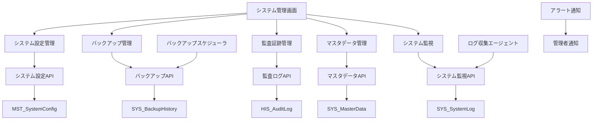
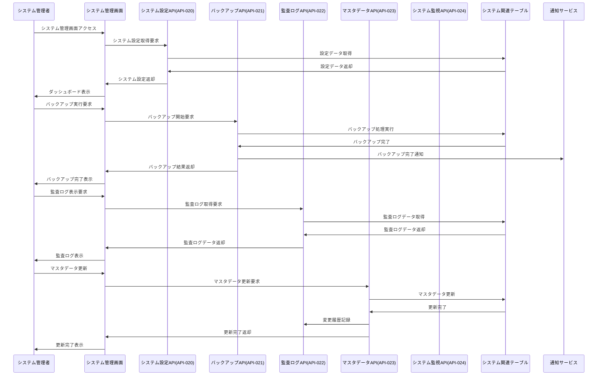

# インターフェース仕様書：システム管理 (IF-009)

| 項目                | 内容                                                                                |
|---------------------|------------------------------------------------------------------------------------|
| **インターフェースID** | IF-009                                                                          |
| **名称**            | システム管理                                                                        |
| **インターフェース方式** | 内部                                                                           |
| **インターフェース種別** | 画面-API                                                                       |
| **概要**            | システム設定、バックアップ管理、監査証跡、マスタデータ管理                          |
| **主な連携先**      | SCR-ADMIN → API-020/021/022/023/024                                               |
| **主なAPI/バッチID** | API-020, API-021, API-022, API-023, API-024                                      |
| **主なテーブル/データ** | SYS_BackupHistory, SYS_SystemLog, SYS_MasterData, MST_SystemConfig            |
| **主な機能ID**      | F16, F17, F18, F19, F20                                                            |
| **優先度**          | 高/低                                                                               |
| **備考**            | バックアップ、監査証跡、設定等                                                      |

## 1. インターフェース概要

システム管理インターフェース（IF-009）は、スキル報告システムの運用管理を担う重要な基盤機能です。システム設定の管理、データバックアップ・復旧、監査証跡の管理、マスタデータの一括管理、システム監視・ログ管理を統合的に提供し、安定したシステム運用を支援します。

## 2. システム管理アーキテクチャ



## 3. インターフェースフロー



## 4. API仕様

### 4.1 システム設定API (API-020)

**エンドポイント**: `/api/v1/system/config`  
**メソッド**: GET, PUT  
**認証**: Bearer Token必須  
**権限**: SYSTEM_ADMIN

#### 4.1.1 システム設定取得

**メソッド**: GET  
**エンドポイント**: `/api/v1/system/config`

**クエリパラメータ**:
| パラメータ名 | データ型 | 必須 | 説明 |
|-------------|---------|------|------|
| category | String | × | 設定カテゴリ |
| includeSecure | Boolean | × | セキュア設定を含むか（デフォルト: false） |

**レスポンス例 (成功)**:
```json
{
  "status": "success",
  "data": {
    "systemConfig": {
      "general": {
        "systemName": "スキル報告システム",
        "version": "1.0.0",
        "environment": "production",
        "timezone": "Asia/Tokyo",
        "locale": "ja-JP",
        "maintenanceMode": false
      },
      "security": {
        "sessionTimeout": 3600,
        "passwordPolicy": {
          "minLength": 8,
          "requireUppercase": true,
          "requireLowercase": true,
          "requireNumbers": true,
          "requireSpecialChars": true,
          "expirationDays": 90
        },
        "loginAttemptLimit": 5,
        "accountLockoutDuration": 1800
      },
      "notification": {
        "emailEnabled": true,
        "slackEnabled": true,
        "smsEnabled": false,
        "defaultNotificationLevel": "INFO"
      },
      "backup": {
        "autoBackupEnabled": true,
        "backupSchedule": "0 2 * * *",
        "retentionDays": 30,
        "compressionEnabled": true
      },
      "performance": {
        "maxConcurrentUsers": 1000,
        "queryTimeout": 30,
        "cacheEnabled": true,
        "cacheTtl": 300
      }
    },
    "lastUpdated": "2025-05-30T02:00:00Z",
    "updatedBy": "admin001"
  }
}
```

#### 4.1.2 システム設定更新

**メソッド**: PUT  
**エンドポイント**: `/api/v1/system/config`  
**Content-Type**: application/json

**リクエスト例**:
```json
{
  "category": "security",
  "settings": {
    "sessionTimeout": 7200,
    "passwordPolicy": {
      "minLength": 10,
      "requireUppercase": true,
      "requireLowercase": true,
      "requireNumbers": true,
      "requireSpecialChars": true,
      "expirationDays": 60
    },
    "loginAttemptLimit": 3
  },
  "reason": "セキュリティポリシー強化のため"
}
```

**レスポンス例 (成功)**:
```json
{
  "status": "success",
  "message": "システム設定を更新しました",
  "data": {
    "category": "security",
    "updatedSettings": ["sessionTimeout", "passwordPolicy", "loginAttemptLimit"],
    "updatedAt": "2025-05-30T11:45:00Z",
    "auditLogId": "AUDIT-2025-001235"
  }
}
```

### 4.2 バックアップAPI (API-021)

**エンドポイント**: `/api/v1/system/backup`  
**メソッド**: GET, POST  
**認証**: Bearer Token必須  
**権限**: BACKUP_ADMIN

#### 4.2.1 バックアップ履歴取得

**メソッド**: GET  
**エンドポイント**: `/api/v1/system/backup`

**クエリパラメータ**:
| パラメータ名 | データ型 | 必須 | 説明 |
|-------------|---------|------|------|
| fromDate | Date | × | 開始日 |
| toDate | Date | × | 終了日 |
| status | String | × | バックアップ状態 |
| limit | Integer | × | 取得件数（デフォルト: 50） |

**レスポンス例 (成功)**:
```json
{
  "status": "success",
  "data": {
    "backupHistory": [
      {
        "backupId": "BACKUP-2025-001234",
        "backupType": "FULL",
        "startTime": "2025-05-30T02:00:00Z",
        "endTime": "2025-05-30T02:45:00Z",
        "duration": 2700,
        "status": "SUCCESS",
        "fileSize": 1073741824,
        "filePath": "/backups/2025/05/30/full_backup_20250530_020000.sql.gz",
        "checksum": "sha256:abc123def456...",
        "tables": [
          {
            "tableName": "MST_Employee",
            "recordCount": 1500,
            "size": 52428800
          },
          {
            "tableName": "TRN_SkillRecord",
            "recordCount": 25000,
            "size": 209715200
          }
        ],
        "triggeredBy": "SCHEDULE",
        "performedBy": "system"
      }
    ],
    "summary": {
      "totalBackups": 30,
      "successfulBackups": 29,
      "failedBackups": 1,
      "totalSize": 32212254720,
      "lastSuccessfulBackup": "2025-05-30T02:00:00Z"
    }
  }
}
```

#### 4.2.2 バックアップ実行

**メソッド**: POST  
**エンドポイント**: `/api/v1/system/backup`  
**Content-Type**: application/json

**リクエスト例**:
```json
{
  "backupType": "INCREMENTAL",
  "includeTables": ["MST_Employee", "TRN_SkillRecord", "MST_SkillHierarchy"],
  "compression": true,
  "encryption": true,
  "description": "月次バックアップ（手動実行）"
}
```

**レスポンス例 (成功)**:
```json
{
  "status": "success",
  "message": "バックアップを開始しました",
  "data": {
    "backupId": "BACKUP-2025-001235",
    "backupType": "INCREMENTAL",
    "startTime": "2025-05-30T11:45:00Z",
    "estimatedDuration": 1800,
    "status": "IN_PROGRESS"
  }
}
```

### 4.3 監査ログAPI (API-022)

**エンドポイント**: `/api/v1/system/audit`  
**メソッド**: GET  
**認証**: Bearer Token必須  
**権限**: AUDIT_VIEWER

**クエリパラメータ**:
| パラメータ名 | データ型 | 必須 | 説明 |
|-------------|---------|------|------|
| userId | String | × | 対象ユーザーID |
| action | String | × | アクション種別 |
| resource | String | × | リソース種別 |
| fromDate | Date | × | 開始日時 |
| toDate | Date | × | 終了日時 |
| severity | String | × | 重要度 |
| limit | Integer | × | 取得件数（デフォルト: 100） |

**レスポンス例 (成功)**:
```json
{
  "status": "success",
  "data": {
    "auditLogs": [
      {
        "auditLogId": "AUDIT-2025-001235",
        "timestamp": "2025-05-30T11:45:00Z",
        "action": "SYSTEM_CONFIG_UPDATE",
        "severity": "HIGH",
        "userId": "admin001",
        "userName": "システム管理者",
        "resourceType": "SYSTEM_CONFIG",
        "resourceId": "security",
        "details": {
          "category": "security",
          "changedSettings": ["sessionTimeout", "passwordPolicy"],
          "oldValues": {
            "sessionTimeout": 3600,
            "passwordPolicy.minLength": 8
          },
          "newValues": {
            "sessionTimeout": 7200,
            "passwordPolicy.minLength": 10
          },
          "reason": "セキュリティポリシー強化のため"
        },
        "ipAddress": "192.168.1.100",
        "userAgent": "Mozilla/5.0...",
        "sessionId": "sess_abc123",
        "result": "SUCCESS"
      }
    ],
    "aggregation": {
      "totalCount": 5000,
      "timeRange": {
        "from": "2025-05-01T00:00:00Z",
        "to": "2025-05-30T23:59:59Z"
      },
      "actionDistribution": {
        "LOGIN": 1500,
        "SKILL_UPDATE": 2000,
        "SYSTEM_CONFIG_UPDATE": 50,
        "BACKUP_EXECUTE": 30,
        "USER_ROLE_CHANGE": 420
      },
      "severityDistribution": {
        "LOW": 3000,
        "MEDIUM": 1500,
        "HIGH": 400,
        "CRITICAL": 100
      }
    }
  }
}
```

### 4.4 マスタデータAPI (API-023)

**エンドポイント**: `/api/v1/system/masterdata`  
**メソッド**: GET, POST, PUT, DELETE  
**認証**: Bearer Token必須  
**権限**: MASTER_DATA_ADMIN

#### 4.4.1 マスタデータ一覧取得

**メソッド**: GET  
**エンドポイント**: `/api/v1/system/masterdata`

**レスポンス例 (成功)**:
```json
{
  "status": "success",
  "data": {
    "masterTables": [
      {
        "tableName": "MST_Department",
        "displayName": "部署マスタ",
        "recordCount": 50,
        "lastUpdated": "2025-05-25T14:30:00Z",
        "updatedBy": "hr_admin",
        "status": "ACTIVE",
        "description": "組織の部署情報を管理"
      },
      {
        "tableName": "MST_Position",
        "displayName": "役職マスタ",
        "recordCount": 20,
        "lastUpdated": "2025-05-20T09:15:00Z",
        "updatedBy": "hr_admin",
        "status": "ACTIVE",
        "description": "従業員の役職情報を管理"
      },
      {
        "tableName": "MST_SkillHierarchy",
        "displayName": "スキル階層マスタ",
        "recordCount": 500,
        "lastUpdated": "2025-05-30T10:00:00Z",
        "updatedBy": "skill_admin",
        "status": "ACTIVE",
        "description": "スキルの階層構造を管理"
      }
    ],
    "summary": {
      "totalTables": 15,
      "totalRecords": 2500,
      "lastGlobalUpdate": "2025-05-30T10:00:00Z"
    }
  }
}
```

### 4.5 システム監視API (API-024)

**エンドポイント**: `/api/v1/system/monitoring`  
**メソッド**: GET  
**認証**: Bearer Token必須  
**権限**: SYSTEM_MONITOR

**レスポンス例 (成功)**:
```json
{
  "status": "success",
  "data": {
    "systemHealth": {
      "overall": "HEALTHY",
      "components": {
        "database": {
          "status": "HEALTHY",
          "responseTime": 15,
          "connectionPool": {
            "active": 8,
            "idle": 12,
            "max": 20
          }
        },
        "cache": {
          "status": "HEALTHY",
          "hitRate": 0.85,
          "memoryUsage": 0.65
        },
        "storage": {
          "status": "WARNING",
          "diskUsage": 0.82,
          "availableSpace": "180GB"
        }
      }
    },
    "performance": {
      "activeUsers": 150,
      "requestsPerMinute": 450,
      "averageResponseTime": 250,
      "errorRate": 0.002
    },
    "alerts": [
      {
        "alertId": "ALERT-2025-001",
        "severity": "WARNING",
        "component": "storage",
        "message": "ディスク使用率が80%を超えています",
        "timestamp": "2025-05-30T11:30:00Z",
        "acknowledged": false
      }
    ]
  }
}
```

## 5. データ項目定義

### 5.1 MST_SystemConfigテーブル

| フィールド名 | データ型 | 必須 | 説明 |
|-------------|---------|------|------|
| config_id | String | ○ | 設定ID（主キー） |
| category | String | ○ | 設定カテゴリ |
| config_key | String | ○ | 設定キー |
| config_value | Text | ○ | 設定値 |
| data_type | String | ○ | データ型（"STRING"/"INTEGER"/"BOOLEAN"/"JSON"） |
| description | Text | × | 設定説明 |
| is_secure | Boolean | ○ | セキュア設定フラグ |
| is_editable | Boolean | ○ | 編集可能フラグ |
| validation_rule | Text | × | バリデーションルール |
| default_value | Text | × | デフォルト値 |
| created_by | String | ○ | 作成者ID |
| created_at | DateTime | ○ | 作成日時 |
| updated_by | String | ○ | 更新者ID |
| updated_at | DateTime | ○ | 更新日時 |

### 5.2 SYS_BackupHistoryテーブル

| フィールド名 | データ型 | 必須 | 説明 |
|-------------|---------|------|------|
| backup_id | String | ○ | バックアップID（主キー） |
| backup_type | String | ○ | バックアップ種別（"FULL"/"INCREMENTAL"/"DIFFERENTIAL"） |
| start_time | DateTime | ○ | 開始日時 |
| end_time | DateTime | × | 終了日時 |
| duration | Integer | × | 実行時間（秒） |
| status | String | ○ | 状態（"IN_PROGRESS"/"SUCCESS"/"FAILED"/"CANCELLED"） |
| file_size | BigInteger | × | ファイルサイズ（バイト） |
| file_path | String | × | ファイルパス |
| checksum | String | × | チェックサム |
| table_info | JSON | × | テーブル情報 |
| triggered_by | String | ○ | 実行トリガー（"SCHEDULE"/"MANUAL"/"API"） |
| performed_by | String | ○ | 実行者ID |
| description | Text | × | 説明 |
| error_message | Text | × | エラーメッセージ |
| created_at | DateTime | ○ | 作成日時 |

### 5.3 SYS_SystemLogテーブル

| フィールド名 | データ型 | 必須 | 説明 |
|-------------|---------|------|------|
| log_id | String | ○ | ログID（主キー） |
| timestamp | DateTime | ○ | 発生日時 |
| log_level | String | ○ | ログレベル（"DEBUG"/"INFO"/"WARN"/"ERROR"/"FATAL"） |
| component | String | ○ | コンポーネント名 |
| message | Text | ○ | ログメッセージ |
| details | JSON | × | 詳細情報 |
| user_id | String | × | ユーザーID |
| session_id | String | × | セッションID |
| ip_address | String | × | IPアドレス |
| request_id | String | × | リクエストID |
| stack_trace | Text | × | スタックトレース |
| created_at | DateTime | ○ | 作成日時 |

## 6. システム監視仕様

### 6.1 ヘルスチェック

```typescript
interface SystemHealthChecker {
  async checkDatabaseHealth(): Promise<HealthStatus> {
    const startTime = Date.now();
    
    try {
      // データベース接続テスト
      await this.dbConnection.query('SELECT 1');
      const responseTime = Date.now() - startTime;
      
      // 接続プール状態確認
      const poolStats = await this.dbConnection.getPoolStats();
      
      return {
        status: responseTime < 100 ? 'HEALTHY' : 'WARNING',
        responseTime,
        connectionPool: poolStats,
        lastChecked: new Date()
      };
    } catch (error) {
      return {
        status: 'UNHEALTHY',
        error: error.message,
        lastChecked: new Date()
      };
    }
  }
  
  async checkStorageHealth(): Promise<HealthStatus> {
    const diskUsage = await this.getDiskUsage();
    
    return {
      status: diskUsage < 0.8 ? 'HEALTHY' : diskUsage < 0.9 ? 'WARNING' : 'CRITICAL',
      diskUsage,
      availableSpace: await this.getAvailableSpace(),
      lastChecked: new Date()
    };
  }
}
```

### 6.2 パフォーマンス監視

```typescript
interface PerformanceMonitor {
  async collectMetrics(): Promise<PerformanceMetrics> {
    return {
      activeUsers: await this.getActiveUserCount(),
      requestsPerMinute: await this.getRequestRate(),
      averageResponseTime: await this.getAverageResponseTime(),
      errorRate: await this.getErrorRate(),
      memoryUsage: await this.getMemoryUsage(),
      cpuUsage: await this.getCpuUsage()
    };
  }
  
  async detectAnomalies(metrics: PerformanceMetrics): Promise<Anomaly[]> {
    const anomalies: Anomaly[] = [];
    
    // レスポンス時間異常
    if (metrics.averageResponseTime > 1000) {
      anomalies.push({
        type: 'HIGH_RESPONSE_TIME',
        severity: 'WARNING',
        value: metrics.averageResponseTime,
        threshold: 1000
      });
    }
    
    // エラー率異常
    if (metrics.errorRate > 0.05) {
      anomalies.push({
        type: 'HIGH_ERROR_RATE',
        severity: 'CRITICAL',
        value: metrics.errorRate,
        threshold: 0.05
      });
    }
    
    return anomalies;
  }
}
```

## 7. バックアップ・復旧仕様

### 7.1 バックアップ戦略

```typescript
interface BackupStrategy {
  // フルバックアップ（週次）
  fullBackup: {
    schedule: '0 2 * * 0'; // 毎週日曜日 2:00
    retention: 12; // 12週間保持
    compression: true;
    encryption: true;
  };
  
  // 増分バックアップ（日次）
  incrementalBackup: {
    schedule: '0 2 * * 1-6'; // 月-土曜日 2:00
    retention: 30; // 30日間保持
    compression: true;
    encryption: true;
  };
  
  // トランザクションログバックアップ（時間毎）
  transactionLogBackup: {
    schedule: '0 * * * *'; // 毎時0分
    retention: 7; // 7日間保持
    compression: false;
    encryption: true;
  };
}
```

### 7.2 復旧手順

```typescript
interface DisasterRecovery {
  async performPointInTimeRecovery(targetTime: Date): Promise<RecoveryResult> {
    // 1. 最新のフルバックアップを特定
    const fullBackup = await this.findLatestFullBackup(targetTime);
    
    // 2. 必要な増分バックアップを特定
    const incrementalBackups = await this.findIncrementalBackups(fullBackup.timestamp, targetTime);
    
    // 3. 必要なトランザクションログを特定
    const transactionLogs = await this.findTransactionLogs(fullBackup.timestamp, targetTime);
    
    // 4. 復旧実行
    await this.restoreFullBackup(fullBackup);
    
    for (const backup of incrementalBackups) {
      await this.applyIncrementalBackup(backup);
    }
    
    for (const log of transactionLogs) {
      await this.applyTransactionLog(log, targetTime);
    }
    
    return {
      status: 'SUCCESS',
      recoveredToTime: targetTime,
      duration: Date.now() - startTime
    };
  }
}
```

## 8. エラーハンドリング

### 8.1 システム管理エラー分類

| エラーコード | 説明 | HTTP ステータス | 対応方法 |
|-------------|------|----------------|---------|
| CONFIG_NOT_FOUND | 設定が見つからない | 404 | 指定された設定キーが存在しない |
| CONFIG_VALIDATION_ERROR | 設定値検証エラー | 400 | 設定値が検証ルールに違反 |
| BACKUP_IN_PROGRESS | バックアップ実行中 | 409 | 既にバックアップが実行中 |
| BACKUP_FAILED | バックアップ失敗 | 500 | バックアップ処理でエラー発生 |
| INSUFFICIENT_STORAGE | ストレージ不足 | 507 | バックアップ用ストレージが不足 |

### 8.2 システム障害対応

```typescript
interface SystemFailureHandler {
  async handleCriticalError(error: SystemError): Promise<void> {
    // 1. 緊急アラート送信
    await this.alertManager.sendCriticalAlert({
      type: 'SYSTEM_FAILURE',
      component: error.component,
      message: error.message,
      timestamp: new Date()
    });
    
    // 2. 自動復旧試行
    if (error.isRecoverable) {
      await this.attemptAutoRecovery(error);
    }
    
    // 3. システム状態記録
    await this.logSystemState(error);
    
    // 4. 必要に応じてメンテナンスモード移行
    if (error.severity === 'CRITICAL') {
      await this.enableMaintenanceMode();
    }
  }
}
```

## 9. セキュリティ仕様

### 9.1 設定データ保護

```typescript
interface ConfigSecurity {
  // セキュア設定の暗号化
  encryptSecureConfig(value: string): string {
    return this.encryptionService.encrypt(value, this.getConfigEncryptionKey());
  }
  
  // 設定変更の承認フロー
  async requireApprovalForCriticalConfig(configKey: string): Promise<boolean> {
    const criticalConfigs = [
      'security.passwordPolicy',
      'security.sessionTimeout',
      'backup.retentionDays'
    ];
    
    return criticalConfigs.includes(configKey);
  }
  
  // 設定アクセス監査
  async auditConfigAccess(userId: string, action: string, configKey: string): Promise<void> {
    await this.auditLogger.log({
      action: `CONFIG_${action}`,
      userId,
      resourceType: 'SYSTEM_CONFIG',
      resourceId: configKey,
      timestamp: new Date()
    });
  }
}
```

## 10. 運用手順

### 10.1 日次運用チェック

1. **システ
