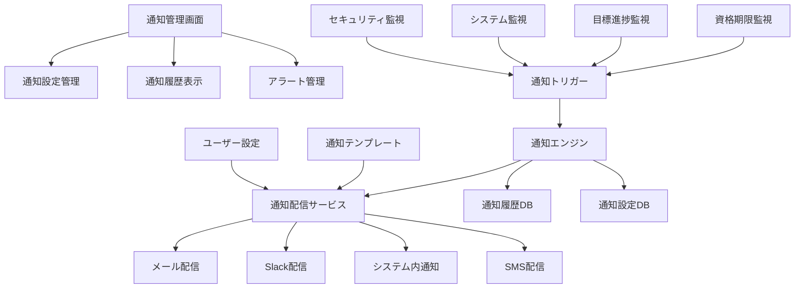
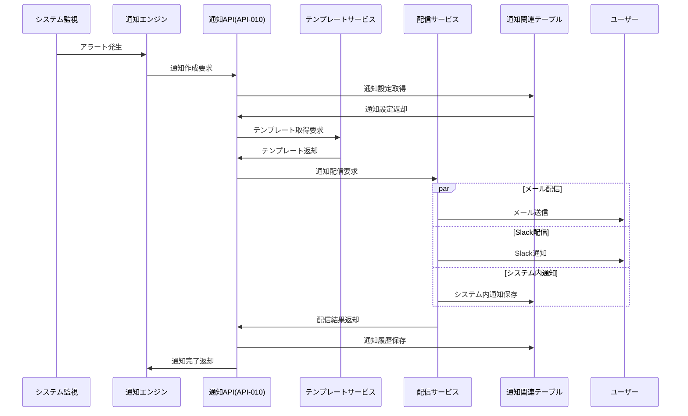

# インターフェース仕様書：通知・アラート (IF-010)

| 項目                | 内容                                                                                |
|---------------------|------------------------------------------------------------------------------------|
| **インターフェースID** | IF-010                                                                          |
| **名称**            | 通知・アラート                                                                      |
| **インターフェース方式** | 内部                                                                           |
| **インターフェース種別** | 画面-API                                                                       |
| **概要**            | 資格期限・障害・進捗通知、システムアラート、ユーザー通知管理                        |
| **主な連携先**      | SCR-NOTIFY → API-010/013/021                                                      |
| **主なAPI/バッチID** | API-010, API-013, API-021                                                         |
| **主なテーブル/データ** | MST_Certification, TRN_GoalProgress, SYS_SystemLog                             |
| **主な機能ID**      | F22                                                                                |
| **優先度**          | 高                                                                                  |
| **備考**            | 資格期限・障害・進捗通知                                                            |

## 1. インターフェース概要

通知・アラートインターフェース（IF-010）は、システム全体の通知機能を統合管理する重要なコミュニケーション基盤です。資格期限切れ、目標進捗、システム障害、セキュリティアラートなど、様々な種類の通知を適切なタイミングで適切な手段（メール、Slack、システム内通知）で配信し、ユーザーの業務効率向上とシステムの安定運用を支援します。

## 2. 通知・アラートアーキテクチャ



## 3. インターフェースフロー



## 4. API仕様

### 4.1 通知管理API (API-010)

**エンドポイント**: `/api/v1/notifications`  
**メソッド**: GET, POST, PUT, DELETE  
**認証**: Bearer Token必須

#### 4.1.1 通知一覧取得

**メソッド**: GET  
**エンドポイント**: `/api/v1/notifications`

**クエリパラメータ**:
| パラメータ名 | データ型 | 必須 | 説明 |
|-------------|---------|------|------|
| userId | String | × | 対象ユーザーID |
| type | String | × | 通知種別 |
| status | String | × | 通知状態（"UNREAD"/"READ"/"ARCHIVED"） |
| priority | String | × | 優先度（"LOW"/"MEDIUM"/"HIGH"/"CRITICAL"） |
| fromDate | Date | × | 開始日時 |
| toDate | Date | × | 終了日時 |
| limit | Integer | × | 取得件数（デフォルト: 50） |

**レスポンス例 (成功)**:
```json
{
  "status": "success",
  "data": {
    "notifications": [
      {
        "notificationId": "NOTIFY-2025-001234",
        "type": "CERTIFICATION_EXPIRY",
        "title": "資格期限切れ通知",
        "message": "Oracle Certified Java Programmerの有効期限が30日後に切れます",
        "priority": "HIGH",
        "status": "UNREAD",
        "userId": "user123",
        "createdAt": "2025-05-30T09:00:00Z",
        "scheduledAt": "2025-05-30T09:00:00Z",
        "readAt": null,
        "details": {
          "certificationId": "CERT-001",
          "certificationName": "Oracle Certified Java Programmer",
          "expiryDate": "2025-06-30",
          "daysUntilExpiry": 30,
          "renewalUrl": "https://education.oracle.com/renewal"
        },
        "actions": [
          {
            "actionType": "RENEWAL_LINK",
            "label": "更新手続きへ",
            "url": "https://education.oracle.com/renewal"
          },
          {
            "actionType": "MARK_AS_READ",
            "label": "既読にする"
          }
        ]
      },
      {
        "notificationId": "NOTIFY-2025-001235",
        "type": "GOAL_PROGRESS",
        "title": "目標進捗アラート",
        "message": "Q2のスキル向上目標の進捗が遅れています（進捗率: 45%）",
        "priority": "MEDIUM",
        "status": "UNREAD",
        "userId": "user123",
        "createdAt": "2025-05-30T10:30:00Z",
        "details": {
          "goalId": "GOAL-2025-Q2-001",
          "goalTitle": "Java Spring Framework習得",
          "progressRate": 0.45,
          "targetDate": "2025-06-30",
          "daysRemaining": 30
        }
      }
    ],
    "summary": {
      "totalCount": 25,
      "unreadCount": 15,
      "priorityDistribution": {
        "CRITICAL": 2,
        "HIGH": 5,
        "MEDIUM": 8,
        "LOW": 10
      }
    }
  }
}
```

#### 4.1.2 通知作成

**メソッド**: POST  
**エンドポイント**: `/api/v1/notifications`  
**Content-Type**: application/json

**リクエスト例**:
```json
{
  "type": "SYSTEM_MAINTENANCE",
  "title": "システムメンテナンス通知",
  "message": "2025年6月1日 2:00-4:00にシステムメンテナンスを実施します",
  "priority": "HIGH",
  "targetUsers": ["all"],
  "scheduledAt": "2025-05-30T17:00:00Z",
  "channels": ["EMAIL", "SLACK", "IN_APP"],
  "details": {
    "maintenanceStart": "2025-06-01T02:00:00Z",
    "maintenanceEnd": "2025-06-01T04:00:00Z",
    "affectedServices": ["スキル管理", "レポート機能"],
    "contactInfo": "support@company.com"
  },
  "template": "SYSTEM_MAINTENANCE_TEMPLATE",
  "expiresAt": "2025-06-01T04:00:00Z"
}
```

**レスポンス例 (成功)**:
```json
{
  "status": "success",
  "message": "通知を作成しました",
  "data": {
    "notificationId": "NOTIFY-2025-001236",
    "type": "SYSTEM_MAINTENANCE",
    "targetUserCount": 1500,
    "scheduledAt": "2025-05-30T17:00:00Z",
    "estimatedDeliveryTime": "2025-05-30T17:05:00Z",
    "channels": ["EMAIL", "SLACK", "IN_APP"]
  }
}
```

### 4.2 通知設定API

**エンドポイント**: `/api/v1/notifications/settings`  
**メソッド**: GET, PUT  
**認証**: Bearer Token必須

#### 4.2.1 通知設定取得

**メソッド**: GET  
**エンドポイント**: `/api/v1/notifications/settings/{userId}`

**レスポンス例 (成功)**:
```json
{
  "status": "success",
  "data": {
    "userId": "user123",
    "notificationSettings": {
      "CERTIFICATION_EXPIRY": {
        "enabled": true,
        "channels": ["EMAIL", "IN_APP"],
        "advanceNotice": [30, 7, 1],
        "quietHours": {
          "enabled": true,
          "start": "22:00",
          "end": "08:00"
        }
      },
      "GOAL_PROGRESS": {
        "enabled": true,
        "channels": ["IN_APP"],
        "frequency": "WEEKLY",
        "threshold": 0.5
      },
      "SYSTEM_ALERT": {
        "enabled": true,
        "channels": ["EMAIL", "SLACK", "IN_APP"],
        "minimumPriority": "MEDIUM"
      },
      "SKILL_RECOMMENDATION": {
        "enabled": false,
        "channels": ["IN_APP"],
        "frequency": "MONTHLY"
      }
    },
    "globalSettings": {
      "timezone": "Asia/Tokyo",
      "language": "ja",
      "emailFormat": "HTML",
      "digestEnabled": true,
      "digestFrequency": "DAILY",
      "digestTime": "09:00"
    }
  }
}
```

#### 4.2.2 通知設定更新

**メソッド**: PUT  
**エンドポイント**: `/api/v1/notifications/settings/{userId}`  
**Content-Type**: application/json

**リクエスト例**:
```json
{
  "notificationSettings": {
    "CERTIFICATION_EXPIRY": {
      "enabled": true,
      "channels": ["EMAIL", "SLACK", "IN_APP"],
      "advanceNotice": [60, 30, 7, 1],
      "quietHours": {
        "enabled": true,
        "start": "21:00",
        "end": "09:00"
      }
    }
  },
  "globalSettings": {
    "digestEnabled": false
  }
}
```

### 4.3 アラート管理API

**エンドポイント**: `/api/v1/alerts`  
**メソッド**: GET, POST, PUT  
**認証**: Bearer Token必須  
**権限**: ALERT_MANAGER

#### 4.3.1 アラート一覧取得

**メソッド**: GET  
**エンドポイント**: `/api/v1/alerts`

**レスポンス例 (成功)**:
```json
{
  "status": "success",
  "data": {
    "alerts": [
      {
        "alertId": "ALERT-2025-001",
        "type": "SYSTEM_ERROR",
        "severity": "CRITICAL",
        "title": "データベース接続エラー",
        "message": "メインデータベースへの接続が失敗しています",
        "component": "DATABASE",
        "status": "ACTIVE",
        "createdAt": "2025-05-30T11:45:00Z",
        "acknowledgedAt": null,
        "acknowledgedBy": null,
        "resolvedAt": null,
        "escalationLevel": 1,
        "affectedUsers": 1500,
        "details": {
          "errorCode": "DB_CONNECTION_TIMEOUT",
          "connectionPool": "main-pool",
          "lastSuccessfulConnection": "2025-05-30T11:40:00Z",
          "retryAttempts": 5
        },
        "actions": [
          {
            "actionType": "ACKNOWLEDGE",
            "label": "確認済みにする"
          },
          {
            "actionType": "ESCALATE",
            "label": "エスカレーション"
          }
        ]
      }
    ],
    "summary": {
      "totalAlerts": 15,
      "activeAlerts": 3,
      "criticalAlerts": 1,
      "acknowledgedAlerts": 8,
      "resolvedAlerts": 4
    }
  }
}
```

## 5. 通知種別・テンプレート

### 5.1 通知種別定義

```typescript
enum NotificationType {
  // 資格関連
  CERTIFICATION_EXPIRY = 'CERTIFICATION_EXPIRY',           // 資格期限切れ
  CERTIFICATION_RENEWAL = 'CERTIFICATION_RENEWAL',         // 資格更新完了
  
  // 目標・キャリア関連
  GOAL_PROGRESS = 'GOAL_PROGRESS',                         // 目標進捗
  GOAL_DEADLINE = 'GOAL_DEADLINE',                         // 目標期限
  GOAL_ACHIEVEMENT = 'GOAL_ACHIEVEMENT',                   // 目標達成
  
  // スキル関連
  SKILL_LEVEL_UP = 'SKILL_LEVEL_UP',                       // スキルレベルアップ
  SKILL_RECOMMENDATION = 'SKILL_RECOMMENDATION',           // スキル推奨
  
  // システム関連
  SYSTEM_MAINTENANCE = 'SYSTEM_MAINTENANCE',               // システムメンテナンス
  SYSTEM_ALERT = 'SYSTEM_ALERT',                          // システムアラート
  SECURITY_ALERT = 'SECURITY_ALERT',                      // セキュリティアラート
  
  // 承認・ワークフロー
  APPROVAL_REQUEST = 'APPROVAL_REQUEST',                   // 承認依頼
  APPROVAL_COMPLETED = 'APPROVAL_COMPLETED',               // 承認完了
  
  // 一般通知
  ANNOUNCEMENT = 'ANNOUNCEMENT',                           // お知らせ
  REMINDER = 'REMINDER'                                    // リマインダー
}
```

### 5.2 通知テンプレート

```typescript
interface NotificationTemplate {
  templateId: string;
  type: NotificationType;
  channels: NotificationChannel[];
  
  email: {
    subject: string;
    htmlBody: string;
    textBody: string;
  };
  
  slack: {
    text: string;
    blocks?: SlackBlock[];
    attachments?: SlackAttachment[];
  };
  
  inApp: {
    title: string;
    message: string;
    icon: string;
    actions?: NotificationAction[];
  };
  
  sms: {
    message: string;
    maxLength: 160;
  };
}

// 資格期限切れテンプレート例
const certificationExpiryTemplate: NotificationTemplate = {
  templateId: 'CERT_EXPIRY_TEMPLATE',
  type: NotificationType.CERTIFICATION_EXPIRY,
  channels: ['EMAIL', 'IN_APP'],
  
  email: {
    subject: '【重要】資格期限切れ通知 - {{certificationName}}',
    htmlBody: `
      <h2>資格期限切れ通知</h2>
      <p>{{userName}}様</p>
      <p>お持ちの資格「{{certificationName}}」の有効期限が{{daysUntilExpiry}}日後に切れます。</p>
      <p><strong>有効期限：</strong>{{expiryDate}}</p>
      <p>更新手続きをお忘れなく。</p>
      <a href="{{renewalUrl}}" style="background-color: #007bff; color: white; padding: 10px 20px; text-decoration: none;">更新手続きへ</a>
    `,
    textBody: `
      資格期限切れ通知
      
      {{userName}}様
      
      お持ちの資格「{{certificationName}}」の有効期限が{{daysUntilExpiry}}日後に切れます。
      有効期限：{{expiryDate}}
      
      更新手続きURL: {{renewalUrl}}
    `
  },
  
  inApp: {
    title: '資格期限切れ通知',
    message: '{{certificationName}}の有効期限が{{daysUntilExpiry}}日後に切れます',
    icon: 'warning',
    actions: [
      {
        actionType: 'RENEWAL_LINK',
        label: '更新手続きへ',
        url: '{{renewalUrl}}'
      }
    ]
  }
};
```

## 6. 配信チャネル仕様

### 6.1 メール配信

```typescript
interface EmailDeliveryService {
  async sendEmail(notification: Notification, user: User): Promise<DeliveryResult> {
    const template = await this.getTemplate(notification.type, 'EMAIL');
    const renderedContent = await this.renderTemplate(template, notification.details);
    
    const emailConfig = {
      to: user.email,
      subject: renderedContent.subject,
      html: renderedContent.htmlBody,
      text: renderedContent.textBody,
      headers: {
        'X-Notification-ID': notification.notificationId,
        'X-Notification-Type': notification.type
      }
    };
    
    try {
      const result = await this.emailProvider.send(emailConfig);
      
      return {
        status: 'SUCCESS',
        channel: 'EMAIL',
        deliveredAt: new Date(),
        messageId: result.messageId
      };
    } catch (error) {
      return {
        status: 'FAILED',
        channel: 'EMAIL',
        error: error.message,
        retryable: this.isRetryableError(error)
      };
    }
  }
}
```

### 6.2 Slack配信

```typescript
interface SlackDeliveryService {
  async sendSlackMessage(notification: Notification, user: User): Promise<DeliveryResult> {
    const template = await this.getTemplate(notification.type, 'SLACK');
    const slackUser = await this.getSlackUser(user.email);
    
    if (!slackUser) {
      return {
        status: 'FAILED',
        channel: 'SLACK',
        error: 'Slack user not found'
      };
    }
    
    const message = {
      channel: slackUser.id,
      text: template.text,
      blocks: template.blocks,
      attachments: template.attachments
    };
    
    try {
      const result = await this.slackClient.chat.postMessage(message);
      
      return {
        status: 'SUCCESS',
        channel: 'SLACK',
        deliveredAt: new Date(),
        messageId: result.ts
      };
    } catch (error) {
      return {
        status: 'FAILED',
        channel: 'SLACK',
        error: error.message
      };
    }
  }
}
```

### 6.3 システム内通知

```typescript
interface InAppNotificationService {
  async createInAppNotification(notification: Notification, user: User): Promise<DeliveryResult> {
    const inAppNotification = {
      notificationId: notification.notificationId,
      userId: user.userId,
      type: notification.type,
      title: notification.title,
      message: notification.message,
      priority: notification.priority,
      status: 'UNREAD',
      details: notification.details,
      actions: notification.actions,
      createdAt: new Date(),
      expiresAt: notification.expiresAt
    };
    
    try {
      await this.notificationRepository.create(inAppNotification);
      
      // WebSocket経由でリアルタイム通知
      await this.websocketService.sendToUser(user.userId, {
        type: 'NEW_NOTIFICATION',
        data: inAppNotification
      });
      
      return {
        status: 'SUCCESS',
        channel: 'IN_APP',
        deliveredAt: new Date()
      };
    } catch (error) {
      return {
        status: 'FAILED',
        channel: 'IN_APP',
        error: error.message
      };
    }
  }
}
```

## 7. 通知スケジューリング

### 7.1 定期通知

```typescript
interface NotificationScheduler {
  // 資格期限監視（日次実行）
  async checkCertificationExpiry(): Promise<void> {
    const expiringCertifications = await this.certificationService.getExpiringCertifications([30, 7, 1]);
    
    for (const cert of expiringCertifications) {
      const notification = {
        type: NotificationType.CERTIFICATION_EXPIRY,
        userId: cert.userId,
        title: '資格期限切れ通知',
        message: `${cert.certificationName}の有効期限が${cert.daysUntilExpiry}日後に切れます`,
        priority: cert.daysUntilExpiry <= 7 ? 'HIGH' : 'MEDIUM',
        details: {
          certificationId: cert.certificationId,
          certificationName: cert.certificationName,
          expiryDate: cert.expiryDate,
          daysUntilExpiry: cert.daysUntilExpiry
        }
      };
      
      await this.notificationService.createNotification(notification);
    }
  }
  
  // 目標進捗監視（週次実行）
  async checkGoalProgress(): Promise<void> {
    const goals = await this.goalService.getActiveGoals();
    
    for (const goal of goals) {
      const progress = await this.goalService.calculateProgress(goal.goalId);
      const expectedProgress = this.calculateExpectedProgress(goal.startDate, goal.targetDate);
      
      if (progress.rate < expectedProgress * 0.8) { // 期待進捗の80%未満
        const notification = {
          type: NotificationType.GOAL_PROGRESS,
          userId: goal.userId,
          title: '目標進捗アラート',
          message: `${goal.goalTitle}の進捗が遅れています（進捗率: ${Math.round(progress.rate * 100)}%）`,
          priority: 'MEDIUM',
          details: {
            goalId: goal.goalId,
            goalTitle: goal.goalTitle,
            progressRate: progress.rate,
            expectedRate: expectedProgress,
            targetDate: goal.targetDate
          }
        };
        
        await this.notificationService.createNotification(notification);
      }
    }
  }
}
```

### 7.2 イベント駆動通知

```typescript
interface EventDrivenNotifications {
  // スキルレベルアップ時
  async onSkillLevelUp(event: SkillLevelUpEvent): Promise<void> {
    const notification = {
      type: NotificationType.SKILL_LEVEL_UP,
      userId: event.userId,
      title: 'スキルレベルアップ！',
      message: `${event.skillName}がレベル${event.newLevel}にアップしました！`,
      priority: 'MEDIUM',
      details: {
        skillCode: event.skillCode,
        skillName: event.skillName,
        previousLevel: event.previousLevel,
        newLevel: event.newLevel,
        achievedAt: event.achievedAt
      }
    };
    
    await this.notificationService.createNotification(notification);
  }
  
  // システムアラート発生時
  async onSystemAlert(event: SystemAlertEvent): Promise<void> {
    const targetUsers = await this.getUsersByRole(['SYSTEM_ADMIN', 'SUPPORT_TEAM']);
    
    for (const user of targetUsers) {
      const notification = {
        type: NotificationType.SYSTEM_ALERT,
        userId: user.userId,
        title: `システムアラート: ${event.component}`,
        message: event.message,
        priority: event.severity,
        details: {
          alertId: event.alertId,
          component: event.component,
          errorCode: event.errorCode,
          timestamp: event.timestamp
        }
      };
      
      await this.notificationService.createNotification(notification);
    }
  }
}
```

## 8. データ項目定義

### 8.1 TRN_Notificationテーブル

| フィールド名 | データ型 | 必須 | 説明 |
|-------------|---------|------|------|
| notification_id | String | ○ | 通知ID（主キー） |
| type | String | ○ | 通知種別 |
| title | String | ○ | 通知タイトル |
| message | Text | ○ | 通知メッセージ |
| priority | String | ○ | 優先度（"LOW"/"MEDIUM"/"HIGH"/"CRITICAL"） |
| status | String | ○ | 状態（"PENDING"/"SENT"/"READ"/"ARCHIVED"） |
| user_id | String | ○ | 対象ユーザーID |
| scheduled_at | DateTime | ○ | 配信予定日時 |
| sent_at | DateTime | × | 配信日時 |
| read_at | DateTime | × | 既読日時 |
| details | JSON | × | 詳細情報 |
| actions | JSON | × | アクション情報 |
| template_id | String | × | テンプレートID |
| expires_at | DateTime | × | 有効期限 |
| created_at | DateTime | ○ | 作成日時 |
| updated_at | DateTime | ○ | 更新日時 |

### 8.2 MST_NotificationSettingテーブル

| フィールド名 | データ型 | 必須 | 説明 |
|-------------|---------|------|------|
| setting_id | String | ○ | 設定ID（主キー） |
| user_id | String | ○ | ユーザーID |
| notification_type | String | ○ | 通知種別 |
| enabled | Boolean | ○ | 有効フラグ |
| channels | JSON | ○ | 配信チャネル |
| frequency | String | × | 配信頻度 |
| quiet_hours | JSON | × | 静寂時間設定 |
| threshold | JSON | × | 閾値設定 |
| created_at | DateTime | ○ | 作成日時 |
| updated_at | DateTime | ○ | 更新日時 |

### 8.3 HIS_NotificationDeliveryテーブル

| フィールド名 | データ型 | 必須 | 説明 |
|-------------|---------|------|------|
| delivery_id | String | ○ | 配信ID（主キー） |
| notification_id | String | ○ | 通知ID（外部キー） |
| channel | String | ○ | 配信チャネル |
| status | String | ○ | 配信状態（"SUCCESS"/"FAILED"/"RETRY"） |
| delivered_at | DateTime | × | 配信日時 |
| message_id | String | × | メッセージID |
| error_message | Text | × | エラーメッセージ |
| retry_count | Integer | ○ | リトライ回数 |
| created_at | DateTime | ○ | 作成日時 |

## 9. エラーハンドリング・リトライ

### 9.1 配信エラー処理

```typescript
interface DeliveryErrorHandler {
  async handleDeliveryFailure(
    notification: Notification,
    channel: NotificationChannel,
    error: Error
  ): Promise<void> {
    const deliveryRecord = {
      notificationId: notification.notificationId,
      channel,
      status: 'FAILED',
      errorMessage: error.message,
      retryCount: 0
    };
    
    await this.deliveryHistoryRepository.create(deliveryRecord);
    
    // リトライ可能なエラーの場合
    if (this.isRetryableError(error)) {
      await this.scheduleRetry(notification, channel, 1);
    } else {
      // 代替チャネルでの配信を試行
      await this.tryAlternativeChannel(notification, channel);
    }
  }
  
  private async scheduleRetry(
    notification: Notification,
    channel: NotificationChannel,
    retryCount: number
  ): Promise<void> {
    const maxRetries = 3;
    const retryDelay = Math.pow(2, retryCount) * 60000; // 指数バックオフ
    
    if (retryCount
