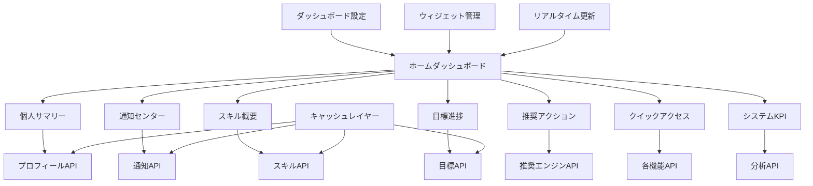
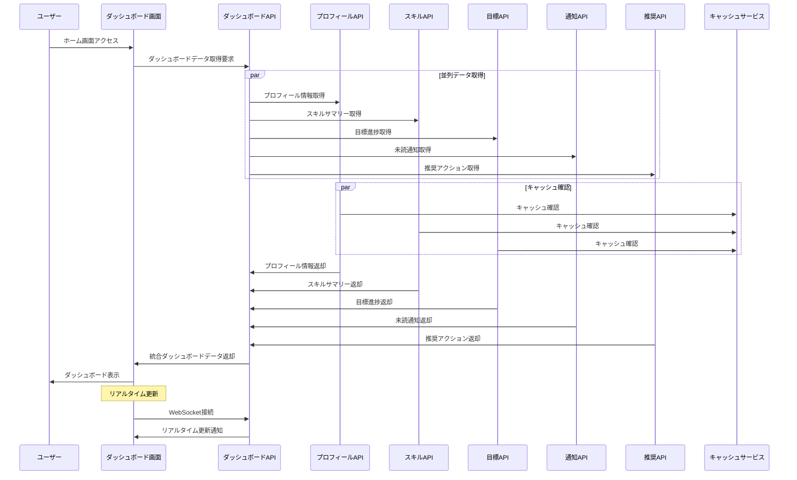

# インターフェース仕様書：ホームダッシュボード (IF-011)

| 項目                | 内容                                                                                |
|---------------------|------------------------------------------------------------------------------------|
| **インターフェースID** | IF-011                                                                          |
| **名称**            | ホームダッシュボード                                                                |
| **インターフェース方式** | 内部                                                                           |
| **インターフェース種別** | 画面-API                                                                       |
| **概要**            | サマリ・通知集約、個人ダッシュボード、KPI表示、クイックアクセス                      |
| **主な連携先**      | SCR-HOME → 各カテゴリAPI                                                           |
| **主なAPI/バッチID** | 各API                                                                              |
| **主なテーブル/データ** | 各種データ                                                                      |
| **主な機能ID**      | F23                                                                                |
| **優先度**          | 高                                                                                  |
| **備考**            | サマリ・通知集約                                                                    |

## 1. インターフェース概要

ホームダッシュボードインターフェース（IF-011）は、ユーザーがシステムにログイン後最初に表示される統合ダッシュボードです。個人のスキル状況、目標進捗、通知、推奨アクション、システム全体のKPIなどを一元的に表示し、ユーザーの効率的な業務遂行とシステム活用を支援します。パーソナライズされた情報表示により、各ユーザーに最適化されたエクスペリエンスを提供します。

## 2. ダッシュボードアーキテクチャ



## 3. インターフェースフロー



## 4. API仕様

### 4.1 ダッシュボードAPI

**エンドポイント**: `/api/v1/dashboard`  
**メソッド**: GET  
**認証**: Bearer Token必須

#### 4.1.1 ダッシュボードデータ取得

**メソッド**: GET  
**エンドポイント**: `/api/v1/dashboard/{userId}`

**クエリパラメータ**:
| パラメータ名 | データ型 | 必須 | 説明 |
|-------------|---------|------|------|
| widgets | String | × | 取得するウィジェット（カンマ区切り） |
| refresh | Boolean | × | キャッシュを無視して最新データを取得 |

**レスポンス例 (成功)**:
```json
{
  "status": "success",
  "data": {
    "userId": "user123",
    "userName": "山田 太郎",
    "lastLoginAt": "2025-05-29T16:30:00Z",
    "dashboardConfig": {
      "layout": "default",
      "widgets": ["profile", "skills", "goals", "notifications", "recommendations"],
      "refreshInterval": 300
    },
    "widgets": {
      "profile": {
        "type": "PROFILE_SUMMARY",
        "data": {
          "employeeId": "EMP-001",
          "department": "開発部",
          "position": "主任",
          "hireDate": "2020-04-01",
          "profileCompleteness": 0.85,
          "lastProfileUpdate": "2025-05-25T14:30:00Z"
        }
      },
      "skills": {
        "type": "SKILL_SUMMARY",
        "data": {
          "totalSkills": 25,
          "averageLevel": 2.8,
          "recentLevelUps": 3,
          "topSkills": [
            {
              "skillCode": "TECH-001-001-001",
              "skillName": "Java",
              "level": 4,
              "lastUpdated": "2025-05-20T10:00:00Z"
            },
            {
              "skillCode": "TECH-002-001-001",
              "skillName": "Spring Framework",
              "level": 3,
              "lastUpdated": "2025-05-15T14:30:00Z"
            }
          ],
          "skillGaps": [
            {
              "skillCode": "TECH-003-001-001",
              "skillName": "AWS",
              "recommendedLevel": 3,
              "currentLevel": 0,
              "priority": "HIGH"
            }
          ]
        }
      },
      "goals": {
        "type": "GOAL_PROGRESS",
        "data": {
          "activeGoals": 3,
          "completedGoals": 2,
          "overallProgress": 0.65,
          "currentGoals": [
            {
              "goalId": "GOAL-2025-Q2-001",
              "goalTitle": "Java Spring Framework習得",
              "progressRate": 0.75,
              "targetDate": "2025-06-30",
              "daysRemaining": 30,
              "status": "ON_TRACK"
            },
            {
              "goalId": "GOAL-2025-Q2-002",
              "goalTitle": "AWS認定資格取得",
              "progressRate": 0.45,
              "targetDate": "2025-07-31",
              "daysRemaining": 61,
              "status": "BEHIND"
            }
          ]
        }
      },
      "notifications": {
        "type": "NOTIFICATION_CENTER",
        "data": {
          "unreadCount": 5,
          "criticalCount": 1,
          "recentNotifications": [
            {
              "notificationId": "NOTIFY-2025-001234",
              "type": "CERTIFICATION_EXPIRY",
              "title": "資格期限切れ通知",
              "message": "Oracle Certified Java Programmerの有効期限が30日後に切れます",
              "priority": "HIGH",
              "createdAt": "2025-05-30T09:00:00Z"
            },
            {
              "notificationId": "NOTIFY-2025-001235",
              "type": "GOAL_PROGRESS",
              "title": "目標進捗アラート",
              "message": "Q2のスキル向上目標の進捗が遅れています",
              "priority": "MEDIUM",
              "createdAt": "2025-05-30T10:30:00Z"
            }
          ]
        }
      },
      "recommendations": {
        "type": "RECOMMENDED_ACTIONS",
        "data": {
          "actions": [
            {
              "actionType": "SKILL_LEARNING",
              "title": "AWS基礎学習の開始",
              "description": "キャリアパスに基づいてAWSスキルの習得をお勧めします",
              "priority": "HIGH",
              "estimatedTime": "2週間",
              "actionUrl": "/skills/search?category=AWS"
            },
            {
              "actionType": "CERTIFICATION_RENEWAL",
              "title": "Java資格の更新手続き",
              "description": "期限切れ前に更新手続きを完了してください",
              "priority": "CRITICAL",
              "dueDate": "2025-06-30",
              "actionUrl": "https://education.oracle.com/renewal"
            },
            {
              "actionType": "GOAL_UPDATE",
              "title": "目標進捗の更新",
              "description": "最近の学習成果を目標に反映してください",
              "priority": "MEDIUM",
              "actionUrl": "/goals/update"
            }
          ]
        }
      },
      "quickAccess": {
        "type": "QUICK_ACCESS",
        "data": {
          "frequentlyUsed": [
            {
              "name": "スキル登録",
              "url": "/skills/register",
              "icon": "skill-add",
              "usageCount": 25
            },
            {
              "name": "目標設定",
              "url": "/goals/create",
              "icon": "goal-add",
              "usageCount": 15
            },
            {
              "name": "レポート出力",
              "url": "/reports",
              "icon": "report",
              "usageCount": 10
            }
          ],
          "recentlyAccessed": [
            {
              "name": "Java スキル詳細",
              "url": "/skills/detail/TECH-001-001-001",
              "accessedAt": "2025-05-30T10:15:00Z"
            },
            {
              "name": "Q2目標進捗",
              "url": "/goals/detail/GOAL-2025-Q2-001",
              "accessedAt": "2025-05-30T09:45:00Z"
            }
          ]
        }
      }
    },
    "systemInfo": {
      "lastDataUpdate": "2025-05-30T11:45:00Z",
      "systemStatus": "HEALTHY",
      "maintenanceScheduled": null
    }
  }
}
```

### 4.2 ダッシュボード設定API

**エンドポイント**: `/api/v1/dashboard/settings`  
**メソッド**: GET, PUT  
**認証**: Bearer Token必須

#### 4.2.1 ダッシュボード設定取得

**メソッド**: GET  
**エンドポイント**: `/api/v1/dashboard/settings/{userId}`

**レスポンス例 (成功)**:
```json
{
  "status": "success",
  "data": {
    "userId": "user123",
    "dashboardSettings": {
      "layout": "default",
      "theme": "light",
      "widgets": {
        "profile": {
          "enabled": true,
          "position": 1,
          "size": "medium"
        },
        "skills": {
          "enabled": true,
          "position": 2,
          "size": "large",
          "showTopSkillsCount": 5
        },
        "goals": {
          "enabled": true,
          "position": 3,
          "size": "medium",
          "showActiveGoalsOnly": true
        },
        "notifications": {
          "enabled": true,
          "position": 4,
          "size": "small",
          "maxDisplayCount": 5
        },
        "recommendations": {
          "enabled": true,
          "position": 5,
          "size": "medium",
          "maxRecommendations": 3
        }
      },
      "refreshSettings": {
        "autoRefresh": true,
        "refreshInterval": 300,
        "refreshOnFocus": true
      },
      "notificationSettings": {
        "showPopups": true,
        "soundEnabled": false,
        "minimumPriority": "MEDIUM"
      }
    }
  }
}
```

#### 4.2.2 ダッシュボード設定更新

**メソッド**: PUT  
**エンドポイント**: `/api/v1/dashboard/settings/{userId}`  
**Content-Type**: application/json

**リクエスト例**:
```json
{
  "dashboardSettings": {
    "layout": "compact",
    "theme": "dark",
    "widgets": {
      "skills": {
        "enabled": true,
        "position": 1,
        "size": "large",
        "showTopSkillsCount": 8
      },
      "goals": {
        "enabled": true,
        "position": 2,
        "size": "medium"
      },
      "notifications": {
        "enabled": false
      }
    },
    "refreshSettings": {
      "autoRefresh": false,
      "refreshInterval": 600
    }
  }
}
```

### 4.3 ウィジェット個別API

#### 4.3.1 スキルサマリーウィジェット

**エンドポイント**: `/api/v1/dashboard/widgets/skills/{userId}`  
**メソッド**: GET

**レスポンス例 (成功)**:
```json
{
  "status": "success",
  "data": {
    "skillSummary": {
      "totalSkills": 25,
      "averageLevel": 2.8,
      "levelDistribution": {
        "level1": 3,
        "level2": 8,
        "level3": 10,
        "level4": 3,
        "level5": 1
      },
      "recentActivity": {
        "levelUpsThisMonth": 3,
        "newSkillsThisMonth": 2,
        "lastSkillUpdate": "2025-05-30T10:00:00Z"
      },
      "topSkills": [
        {
          "skillCode": "TECH-001-001-001",
          "skillName": "Java",
          "level": 4,
          "category": "技術スキル",
          "lastUpdated": "2025-05-20T10:00:00Z",
          "trend": "UP"
        }
      ],
      "skillGaps": [
        {
          "skillCode": "TECH-003-001-001",
          "skillName": "AWS",
          "recommendedLevel": 3,
          "currentLevel": 0,
          "priority": "HIGH",
          "reason": "キャリアパス要件"
        }
      ],
      "achievements": [
        {
          "type": "LEVEL_UP",
          "skillName": "Spring Framework",
          "achievedAt": "2025-05-25T14:30:00Z",
          "newLevel": 3
        }
      ]
    }
  }
}
```

#### 4.3.2 目標進捗ウィジェット

**エンドポイント**: `/api/v1/dashboard/widgets/goals/{userId}`  
**メソッド**: GET

**レスポンス例 (成功)**:
```json
{
  "status": "success",
  "data": {
    "goalProgress": {
      "summary": {
        "activeGoals": 3,
        "completedGoals": 2,
        "overallProgress": 0.65,
        "onTrackGoals": 2,
        "behindGoals": 1
      },
      "currentGoals": [
        {
          "goalId": "GOAL-2025-Q2-001",
          "goalTitle": "Java Spring Framework習得",
          "goalType": "SKILL_ACQUISITION",
          "progressRate": 0.75,
          "targetDate": "2025-06-30",
          "daysRemaining": 30,
          "status": "ON_TRACK",
          "milestones": [
            {
              "milestoneId": "MS-001",
              "title": "基礎学習完了",
              "completed": true,
              "completedAt": "2025-05-15T00:00:00Z"
            },
            {
              "milestoneId": "MS-002",
              "title": "実践プロジェクト",
              "completed": false,
              "targetDate": "2025-06-15T00:00:00Z"
            }
          ]
        }
      ],
      "upcomingDeadlines": [
        {
          "goalId": "GOAL-2025-Q2-001",
          "goalTitle": "Java Spring Framework習得",
          "targetDate": "2025-06-30",
          "daysRemaining": 30,
          "urgency": "MEDIUM"
        }
      ]
    }
  }
}
```

## 5. ウィジェット仕様

### 5.1 ウィジェット種別

```typescript
enum WidgetType {
  PROFILE_SUMMARY = 'PROFILE_SUMMARY',           // プロフィールサマリー
  SKILL_SUMMARY = 'SKILL_SUMMARY',               // スキルサマリー
  GOAL_PROGRESS = 'GOAL_PROGRESS',               // 目標進捗
  NOTIFICATION_CENTER = 'NOTIFICATION_CENTER',   // 通知センター
  RECOMMENDED_ACTIONS = 'RECOMMENDED_ACTIONS',   // 推奨アクション
  QUICK_ACCESS = 'QUICK_ACCESS',                 // クイックアクセス
  RECENT_ACTIVITY = 'RECENT_ACTIVITY',           // 最近のアクティビティ
  SYSTEM_KPI = 'SYSTEM_KPI',                     // システムKPI（管理者用）
  TEAM_OVERVIEW = 'TEAM_OVERVIEW',               // チーム概要（管理者用）
  CALENDAR = 'CALENDAR'                          // カレンダー
}
```

### 5.2 ウィジェット設定

```typescript
interface WidgetConfig {
  widgetId: string;
  type: WidgetType;
  enabled: boolean;
  position: number;
  size: 'small' | 'medium' | 'large';
  refreshInterval?: number;
  customSettings?: {
    [key: string]: any;
  };
}

// スキルサマリーウィジェット設定例
const skillSummaryConfig: WidgetConfig = {
  widgetId: 'skills',
  type: WidgetType.SKILL_SUMMARY,
  enabled: true,
  position: 2,
  size: 'large',
  refreshInterval: 300,
  customSettings: {
    showTopSkillsCount: 5,
    showSkillGaps: true,
    showRecentActivity: true,
    chartType: 'radar'
  }
};
```

### 5.3 レスポンシブレイアウト

```typescript
interface DashboardLayout {
  desktop: {
    columns: 3;
    widgetSizes: {
      small: { width: 1, height: 1 };
      medium: { width: 1, height: 2 };
      large: { width: 2, height: 2 };
    };
  };
  
  tablet: {
    columns: 2;
    widgetSizes: {
      small: { width: 1, height: 1 };
      medium: { width: 1, height: 2 };
      large: { width: 2, height: 2 };
    };
  };
  
  mobile: {
    columns: 1;
    widgetSizes: {
      small: { width: 1, height: 1 };
      medium: { width: 1, height: 2 };
      large: { width: 1, height: 3 };
    };
  };
}
```

## 6. パーソナライゼーション

### 6.1 推奨エンジン

```typescript
interface RecommendationEngine {
  async generateRecommendations(userId: string): Promise<RecommendedAction[]> {
    const userProfile = await this.getUserProfile(userId);
    const skillData = await this.getSkillData(userId);
    const goalData = await this.getGoalData(userId);
    const activityData = await this.getActivityData(userId);
    
    const recommendations: RecommendedAction[] = [];
    
    // 1. スキルギャップ基準の推奨
    const skillGapRecommendations = await this.generateSkillGapRecommendations(
      userProfile, skillData
    );
    recommendations.push(...skillGapRecommendations);
    
    // 2. 目標進捗基準の推奨
    const goalProgressRecommendations = await this.generateGoalProgressRecommendations(
      goalData
    );
    recommendations.push(...goalProgressRecommendations);
    
    // 3. 期限切れ対応の推奨
    const expiryRecommendations = await this.generateExpiryRecommendations(userId);
    recommendations.push(...expiryRecommendations);
    
    // 4. 活動パターン基準の推奨
    const activityRecommendations = await this.generateActivityRecommendations(
      activityData
    );
    recommendations.push(...activityRecommendations);
    
    // 優先度順にソートして上位を返却
    return recommendations
      .sort((a, b) => this.calculatePriority(b) - this.calculatePriority(a))
      .slice(0, 5);
  }
  
  private async generateSkillGapRecommendations(
    userProfile: UserProfile,
    skillData: SkillData
  ): Promise<RecommendedAction[]> {
    const careerPath = await this.getCareerPath(userProfile.positionCode);
    const skillGaps = this.analyzeSkillGaps(skillData.skills, careerPath.requiredSkills);
    
    return skillGaps.map(gap => ({
      actionType: 'SKILL_LEARNING',
      title: `${gap.skillName}の学習開始`,
      description: `キャリアパスに必要なスキルです（推奨レベル: ${gap.recommendedLevel}）`,
      priority: gap.priority,
      estimatedTime: this.estimateLearningTime(gap),
      actionUrl: `/skills/search?skillCode=${gap.skillCode}`
    }));
  }
}
```

### 6.2 アダプティブUI

```typescript
interface AdaptiveUIService {
  async adaptDashboardForUser(userId: string): Promise<DashboardConfig> {
    const userBehavior = await this.getUserBehavior(userId);
    const preferences = await this.getUserPreferences(userId);
    const role = await this.getUserRole(userId);
    
    // ロール基準の基本設定
    let config = this.getBaseConfigForRole(role);
    
    // 利用パターンに基づく調整
    if (userBehavior.frequentlyUsedFeatures.includes('SKILL_MANAGEMENT')) {
      config.widgets.skills.size = 'large';
      config.widgets.skills.position = 1;
    }
    
    if (userBehavior.goalEngagement > 0.8) {
      config.widgets.goals.enabled = true;
      config.widgets.goals.size = 'medium';
    }
    
    // 通知頻度に基づく調整
    if (userBehavior.notificationInteractionRate < 0.3) {
      config.widgets.notifications.size = 'small';
      config.widgets.notifications.maxDisplayCount = 3;
    }
    
    return config;
  }
}
```

## 7. リアルタイム更新

### 7.1 WebSocket通信

```typescript
interface DashboardWebSocketService {
  async establishConnection(userId: string): Promise<WebSocket> {
    const ws = new WebSocket(`wss://api.company.com/dashboard/ws/${userId}`);
    
    ws.onopen = () => {
      console.log('Dashboard WebSocket connected');
      this.sendHeartbeat(ws);
    };
    
    ws.onmessage = (event) => {
      const message = JSON.parse(event.data);
      this.handleRealtimeUpdate(message);
    };
    
    ws.onclose = () => {
      console.log('Dashboard WebSocket disconnected');
      // 自動再接続
      setTimeout(() => this.establishConnection(userId), 5000);
    };
    
    return ws;
  }
  
  private handleRealtimeUpdate(message: WebSocketMessage): void {
    switch (message.type) {
      case 'NOTIFICATION_UPDATE':
        this.updateNotificationWidget(message.data);
        break;
      case 'SKILL_UPDATE':
        this.updateSkillWidget(message.data);
        break;
      case 'GOAL_PROGRESS_UPDATE':
        this.updateGoalWidget(message.data);
        break;
      case 'SYSTEM_ALERT':
        this.showSystemAlert(message.data);
        break;
    }
  }
}
```

### 7.2 増分更新

```typescript
interface IncrementalUpdateService {
  async getIncrementalUpdates(
    userId: string,
    lastUpdateTime: Date
  ): Promise<IncrementalUpdate[]> {
    const updates: IncrementalUpdate[] = [];
    
    // 通知の増分更新
    const notificationUpdates = await this.getNotificationUpdates(userId, lastUpdateTime);
    if (notificationUpdates.length > 0) {
      updates.push({
        widgetType: 'NOTIFICATION_CENTER',
        updateType: 'INCREMENTAL',
        data: notificationUpdates
      });
    }
    
    // スキルの増分更新
    const skillUpdates = await this.getSkillUpdates(userId, lastUpdateTime);
    if (skillUpdates.length > 0) {
      updates.push({
        widgetType: 'SKILL_SUMMARY',
        updateType: 'PARTIAL',
        data: skillUpdates
      });
    }
    
    return updates;
  }
}
```

## 8. パフォーマンス最適化

### 8.1 キャッシュ戦略

```typescript
interface DashboardCacheService {
  // ユーザー固有データのキャッシュ
  async cacheUserDashboardData(userId: string, data: DashboardData): Promise<void> {
    const cacheKey = `dashboard:user:${userId}`;
    const ttl = 300; // 5分
    
    await this.redisClient.setex(cacheKey, ttl, JSON.stringify(data));
  }
  
  // ウィジェット別キャッシュ
  async cacheWidgetData(
    userId: string,
    widgetType: WidgetType,
    data: any
  ): Promise<void> {
    const cacheKey = `dashboard:widget:${userId}:${widgetType}`;
    const ttl = this.getWidgetCacheTTL(widgetType);
    
    await this.redisClient.setex(cacheKey, ttl, JSON.stringify(data));
  }
  
  private getWidgetCacheTTL(widgetType: WidgetType): number {
    const ttlMap = {
      [WidgetType.PROFILE_SUMMARY]: 3600,      // 1時間
      [WidgetType.SKILL_SUMMARY]: 1800,        // 30分
      [WidgetType.GOAL_PROGRESS]: 900,         // 15分
      [WidgetType.NOTIFICATION_CENTER]: 60,    // 1分
      [WidgetType.RECOMMENDED_ACTIONS]: 1800   // 30分
    };
    
    return ttlMap[widgetType] || 300;
  }
}
```

### 8.2 遅延読み込み

```typescript
interface LazyLoadingService {
  async loadDashboardInStages(userId: string): Promise<DashboardData> {
    // Stage 1: 重要度の高いウィジェットを優先読み込み
    const criticalWidgets = await this.loadCriticalWidgets(userId);
    
    // Stage 2: 残りのウィジェットを非同期で読み込み
    this.loadRemainingWidgets(userId).then(widgets => {
      this.updateDashboard(widgets);
    });
    
    return {
      userId,
      widgets: criticalWidgets,
      loadingStatus: 'PARTIAL'
    };
