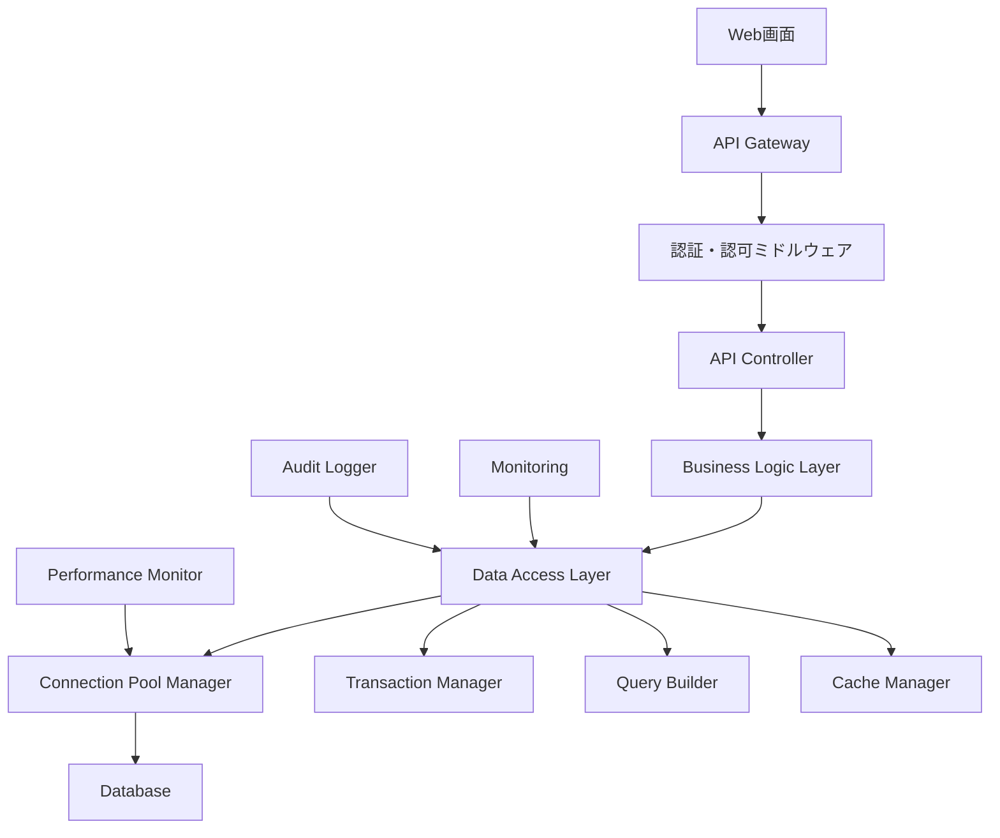
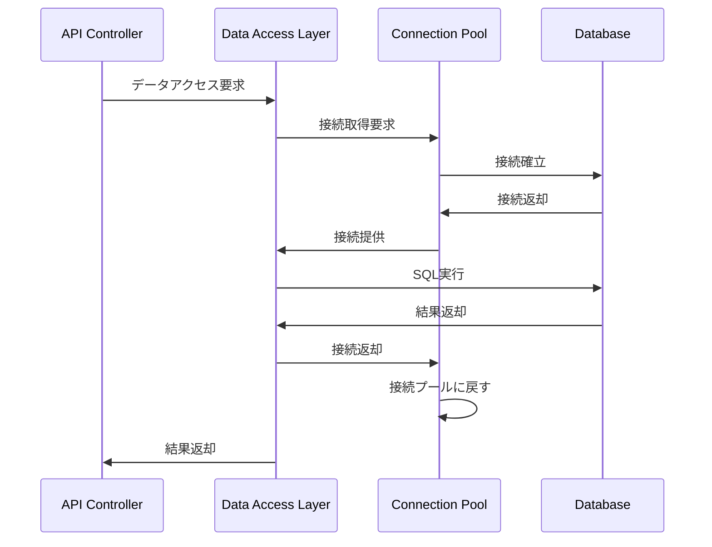

# インターフェース仕様書：API-DBアクセス全般 (IF-012)

| 項目                | 内容                                                                                |
|---------------------|------------------------------------------------------------------------------------|
| **インターフェースID** | IF-012                                                                          |
| **名称**            | API-DBアクセス全般                                                                  |
| **インターフェース方式** | 内部                                                                           |
| **インターフェース種別** | API-DB                                                                         |
| **概要**            | 全APIからデータベースへのアクセス制御、接続管理、トランザクション管理                |
| **主な連携先**      | 各API → 各テーブル                                                                 |
| **主なAPI/バッチID** | 全API                                                                              |
| **主なテーブル/データ** | 全テーブル                                                                      |
| **主な機能ID**      | 全機能                                                                              |
| **優先度**          | 最高                                                                                |
| **備考**            | API経由のみDBアクセス                                                               |

## 1. インターフェース概要

API-DBアクセス全般インターフェース（IF-012）は、システム内の全APIからデータベースへのアクセスを統一的に管理します。データベース接続プール管理、トランザクション制御、SQLインジェクション対策、パフォーマンス監視等を提供し、安全で効率的なデータアクセスを実現します。

## 2. アーキテクチャ概要



## 3. データアクセス層仕様

### 3.1 接続管理

**接続プール設定**:
```typescript
interface ConnectionPoolConfig {
  host: string;
  port: number;
  database: string;
  username: string;
  password: string;
  maxConnections: number;      // 最大接続数: 20
  minConnections: number;      // 最小接続数: 5
  acquireTimeoutMillis: number; // 接続取得タイムアウト: 30000ms
  idleTimeoutMillis: number;   // アイドルタイムアウト: 600000ms
  ssl: boolean;               // SSL接続: true
}
```

**接続取得・解放フロー**:


### 3.2 トランザクション管理

**トランザクション制御**:
```typescript
interface TransactionManager {
  begin(): Promise<Transaction>;
  commit(transaction: Transaction): Promise<void>;
  rollback(transaction: Transaction): Promise<void>;
  savepoint(transaction: Transaction, name: string): Promise<void>;
  rollbackToSavepoint(transaction: Transaction, name: string): Promise<void>;
}

// 使用例
async function updateUserProfile(userId: string, profileData: ProfileData): Promise<void> {
  const transaction = await transactionManager.begin();
  try {
    await employeeRepository.update(userId, profileData.employee, transaction);
    await auditLogRepository.insert(createAuditLog(userId, 'PROFILE_UPDATE'), transaction);
    await transactionManager.commit(transaction);
  } catch (error) {
    await transactionManager.rollback(transaction);
    throw error;
  }
}
```

### 3.3 クエリビルダー

**安全なSQL構築**:
```typescript
interface QueryBuilder {
  select(columns: string[]): QueryBuilder;
  from(table: string): QueryBuilder;
  where(condition: string, params: any[]): QueryBuilder;
  join(table: string, condition: string): QueryBuilder;
  orderBy(column: string, direction: 'ASC' | 'DESC'): QueryBuilder;
  limit(count: number): QueryBuilder;
  offset(count: number): QueryBuilder;
  build(): { sql: string; params: any[] };
}

// 使用例
const query = queryBuilder
  .select(['e.employee_id', 'e.last_name', 'e.first_name', 'd.department_name'])
  .from('MST_Employee e')
  .join('MST_Department d', 'e.department_code = d.department_code')
  .where('e.status = ?', ['ACTIVE'])
  .where('d.status = ?', ['ACTIVE'])
  .orderBy('e.last_name', 'ASC')
  .limit(100)
  .build();
```

## 4. セキュリティ仕様

### 4.1 SQLインジェクション対策

1. **パラメータ化クエリ必須**:
   - 全てのSQL文でプリペアドステートメント使用
   - 動的SQL構築時の入力値サニタイズ

2. **入力値検証**:
   - データ型チェック
   - 文字列長制限
   - 特殊文字エスケープ

3. **権限制御**:
   - データベースユーザーの最小権限設定
   - テーブル単位でのアクセス制御

### 4.2 データ暗号化

```typescript
interface EncryptionService {
  encrypt(plainText: string): string;
  decrypt(encryptedText: string): string;
  hash(password: string): string;
  verifyHash(password: string, hash: string): boolean;
}

// 機微情報の暗号化
const encryptedData = {
  email: encryptionService.encrypt(userData.email),
  phoneNumber: encryptionService.encrypt(userData.phoneNumber),
  birthDate: encryptionService.encrypt(userData.birthDate)
};
```

## 5. パフォーマンス最適化

### 5.1 キャッシュ戦略

```typescript
interface CacheManager {
  get<T>(key: string): Promise<T | null>;
  set<T>(key: string, value: T, ttl?: number): Promise<void>;
  delete(key: string): Promise<void>;
  clear(pattern?: string): Promise<void>;
}

// キャッシュ使用例
async function getDepartmentList(): Promise<Department[]> {
  const cacheKey = 'departments:active';
  let departments = await cacheManager.get<Department[]>(cacheKey);
  
  if (!departments) {
    departments = await departmentRepository.findActive();
    await cacheManager.set(cacheKey, departments, 3600); // 1時間キャッシュ
  }
  
  return departments;
}
```

### 5.2 インデックス戦略

**推奨インデックス**:
```sql
-- 従業員マスタ
CREATE INDEX idx_employee_user_id ON MST_Employee(user_id);
CREATE INDEX idx_employee_department ON MST_Employee(department_code);
CREATE INDEX idx_employee_status ON MST_Employee(status);
CREATE INDEX idx_employee_email ON MST_Employee(email);

-- スキル記録
CREATE INDEX idx_skill_record_employee ON TRN_SkillRecord(employee_id);
CREATE INDEX idx_skill_record_skill ON TRN_SkillRecord(skill_code);
CREATE INDEX idx_skill_record_date ON TRN_SkillRecord(evaluation_date);

-- 監査ログ
CREATE INDEX idx_audit_log_user ON HIS_AuditLog(user_id);
CREATE INDEX idx_audit_log_date ON HIS_AuditLog(created_at);
CREATE INDEX idx_audit_log_action ON HIS_AuditLog(action_type);
```

## 6. 監視・ログ仕様

### 6.1 パフォーマンス監視

```typescript
interface PerformanceMonitor {
  recordQueryExecution(sql: string, duration: number, rowCount: number): void;
  recordConnectionUsage(activeConnections: number, maxConnections: number): void;
  recordTransactionDuration(transactionId: string, duration: number): void;
}

// 監視メトリクス
const metrics = {
  queryExecutionTime: {
    threshold: 1000, // 1秒
    alertLevel: 'WARNING'
  },
  connectionPoolUsage: {
    threshold: 0.8, // 80%
    alertLevel: 'CRITICAL'
  },
  transactionDuration: {
    threshold: 5000, // 5秒
    alertLevel: 'WARNING'
  }
};
```

### 6.2 監査ログ

```typescript
interface AuditLog {
  logId: string;
  userId: string;
  actionType: 'SELECT' | 'INSERT' | 'UPDATE' | 'DELETE';
  tableName: string;
  recordId?: string;
  oldValues?: Record<string, any>;
  newValues?: Record<string, any>;
  ipAddress: string;
  userAgent: string;
  timestamp: Date;
}

// 監査ログ記録
async function logDataAccess(auditLog: AuditLog): Promise<void> {
  await auditLogRepository.insert(auditLog);
  
  // 重要な操作は即座にアラート
  if (auditLog.actionType === 'DELETE' || 
      sensitiveTableList.includes(auditLog.tableName)) {
    await alertService.sendSecurityAlert(auditLog);
  }
}
```

## 7. エラーハンドリング

### 7.1 データベースエラー分類

| エラーカテゴリ | 説明 | 対応方法 |
|---------------|------|---------|
| CONNECTION_ERROR | 接続エラー | 接続プール再初期化、フェイルオーバー |
| TIMEOUT_ERROR | タイムアウト | クエリ最適化、リトライ処理 |
| CONSTRAINT_VIOLATION | 制約違反 | バリデーションエラーとして返却 |
| DEADLOCK | デッドロック | 自動リトライ（最大3回） |
| DISK_FULL | ディスク容量不足 | 緊急アラート、運用チーム通知 |

### 7.2 エラーハンドリング実装

```typescript
class DatabaseErrorHandler {
  async handleError(error: DatabaseError): Promise<void> {
    switch (error.code) {
      case 'CONNECTION_ERROR':
        await this.handleConnectionError(error);
        break;
      case 'DEADLOCK':
        await this.handleDeadlock(error);
        break;
      case 'CONSTRAINT_VIOLATION':
        throw new ValidationError(this.parseConstraintError(error));
      default:
        await this.logUnknownError(error);
        throw new SystemError('データベースエラーが発生しました');
    }
  }
  
  private async handleDeadlock(error: DatabaseError): Promise<void> {
    const retryCount = error.context?.retryCount || 0;
    if (retryCount < 3) {
      await this.delay(Math.pow(2, retryCount) * 1000); // 指数バックオフ
      throw new RetryableError('デッドロックが発生しました', retryCount + 1);
    }
    throw new SystemError('デッドロックが解決できませんでした');
  }
}
```

## 8. バックアップ・復旧

### 8.1 バックアップ戦略

1. **フルバックアップ**:
   - 毎日深夜2:00に実行
   - 30日間保持

2. **差分バックアップ**:
   - 6時間毎に実行
   - 7日間保持

3. **トランザクションログバックアップ**:
   - 15分毎に実行
   - 24時間保持

### 8.2 復旧手順

```sql
-- ポイントインタイム復旧例
RESTORE DATABASE SkillReportDB 
FROM DISK = 'C:\Backup\SkillReportDB_Full.bak'
WITH NORECOVERY;

RESTORE DATABASE SkillReportDB 
FROM DISK = 'C:\Backup\SkillReportDB_Diff.bak'
WITH NORECOVERY;

RESTORE LOG SkillReportDB 
FROM DISK = 'C:\Backup\SkillReportDB_Log.trn'
WITH STOPAT = '2025-05-30 10:30:00';
```

## 9. 関連インターフェース

- [IF-013](./インターフェース仕様書_IF-013.md): バッチ-DBアクセス全般
- [IF-001](./インターフェース仕様書_IF-001.md): ログイン認証
- [IF-003](./インターフェース仕様書_IF-003.md): プロフィール管理
- [IF-004](./インターフェース仕様書_IF-004.md): スキル管理

## 10. 改訂履歴

| 改訂日     | 改訂者 | 改訂内容                                         |
|------------|--------|--------------------------------------------------|
| 2025/05/30 | 初版   | 初版作成                                         |
