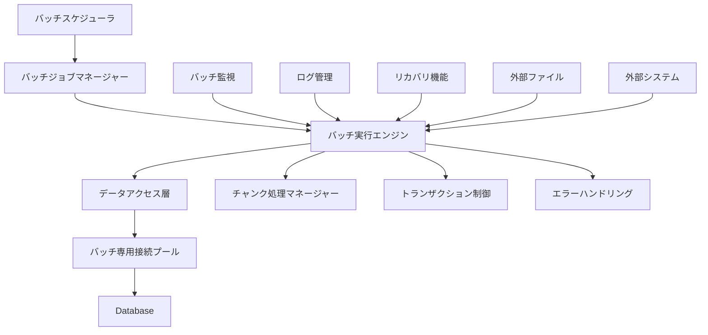
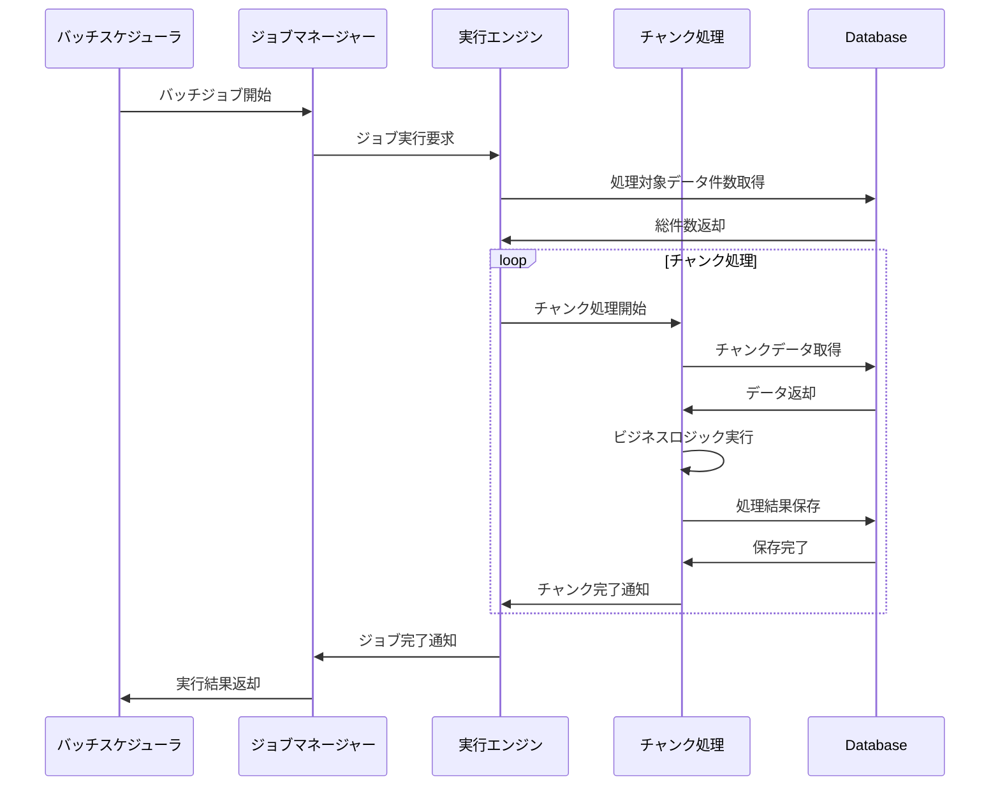

# インターフェース仕様書：バッチ-DBアクセス全般 (IF-013)

| 項目                | 内容                                                                                |
|---------------------|------------------------------------------------------------------------------------|
| **インターフェースID** | IF-013                                                                          |
| **名称**            | バッチ-DBアクセス全般                                                               |
| **インターフェース方式** | 内部                                                                           |
| **インターフェース種別** | バッチ-DB                                                                      |
| **概要**            | 全バッチ処理からデータベースへのアクセス制御、大量データ処理、バッチトランザクション管理 |
| **主な連携先**      | 各バッチ → 各テーブル                                                              |
| **主なAPI/バッチID** | 全バッチ                                                                           |
| **主なテーブル/データ** | 全テーブル                                                                      |
| **主な機能ID**      | 全機能                                                                              |
| **優先度**          | 最高                                                                                |
| **備考**            | バッチ経由のみDBアクセス                                                            |

## 1. インターフェース概要

バッチ-DBアクセス全般インターフェース（IF-013）は、システム内の全バッチ処理からデータベースへのアクセスを統一的に管理します。大量データの効率的な処理、長時間実行トランザクションの制御、バッチ処理の監視・復旧機能を提供し、安定したバッチ処理環境を実現します。

## 2. バッチアーキテクチャ概要



## 3. バッチ処理仕様

### 3.1 バッチジョブ管理

**バッチジョブ定義**:
```typescript
interface BatchJobDefinition {
  jobId: string;
  jobName: string;
  jobType: 'DATA_SYNC' | 'REPORT_GENERATION' | 'MAINTENANCE' | 'BACKUP';
  schedule: CronExpression;
  timeout: number;
  retryCount: number;
  chunkSize: number;
  parallelism: number;
  dependencies: string[];
  parameters: Record<string, any>;
}

// バッチジョブ例
const hrSyncJob: BatchJobDefinition = {
  jobId: 'BATCH-004',
  jobName: '人事システム連携',
  jobType: 'DATA_SYNC',
  schedule: '0 2 * * *', // 毎日2:00
  timeout: 3600000, // 1時間
  retryCount: 3,
  chunkSize: 1000,
  parallelism: 2,
  dependencies: [],
  parameters: {
    syncMode: 'INCREMENTAL',
    targetTables: ['MST_Employee', 'MST_Department']
  }
};
```

### 3.2 チャンク処理

**大量データ処理フロー**:


### 3.3 バッチ専用接続管理

**接続プール設定**:
```typescript
interface BatchConnectionPoolConfig {
  host: string;
  port: number;
  database: string;
  username: string;
  password: string;
  maxConnections: number;      // 最大接続数: 10
  minConnections: number;      // 最小接続数: 2
  acquireTimeoutMillis: number; // 接続取得タイムアウト: 60000ms
  idleTimeoutMillis: number;   // アイドルタイムアウト: 1800000ms
  batchFetchSize: number;      // バッチフェッチサイズ: 1000
  autoCommit: boolean;         // オートコミット: false
}

// バッチ専用トランザクション制御
class BatchTransactionManager {
  async executeInChunks<T>(
    data: T[],
    chunkSize: number,
    processor: (chunk: T[]) => Promise<void>
  ): Promise<void> {
    const chunks = this.createChunks(data, chunkSize);
    
    for (const chunk of chunks) {
      const transaction = await this.begin();
      try {
        await processor(chunk);
        await this.commit(transaction);
        await this.recordProgress(chunk.length);
      } catch (error) {
        await this.rollback(transaction);
        await this.handleChunkError(error, chunk);
      }
    }
  }
}
```

## 4. バッチ種別別仕様

### 4.1 データ同期バッチ

**人事システム連携バッチ (BATCH-004)**:
```typescript
interface HRSyncBatchProcessor {
  async syncEmployeeData(): Promise<BatchResult> {
    const syncResult = {
      totalRecords: 0,
      insertedRecords: 0,
      updatedRecords: 0,
      errorRecords: 0,
      errors: []
    };
    
    // 差分データ取得
    const hrData = await this.fetchHRSystemData();
    syncResult.totalRecords = hrData.length;
    
    // チャンク処理で同期
    await this.batchTransactionManager.executeInChunks(
      hrData,
      1000,
      async (chunk) => {
        for (const record of chunk) {
          try {
            const existing = await this.employeeRepository.findByEmployeeId(record.employeeId);
            if (existing) {
              await this.employeeRepository.update(record);
              syncResult.updatedRecords++;
            } else {
              await this.employeeRepository.insert(record);
              syncResult.insertedRecords++;
            }
          } catch (error) {
            syncResult.errorRecords++;
            syncResult.errors.push({ record, error: error.message });
          }
        }
      }
    );
    
    return syncResult;
  }
}
```

### 4.2 レポート生成バッチ

**月次スキルレポート生成 (BATCH-007)**:
```typescript
interface SkillReportBatchProcessor {
  async generateMonthlyReport(targetMonth: string): Promise<BatchResult> {
    const reportData = await this.aggregateSkillData(targetMonth);
    
    // 大量データの集計処理
    const aggregatedData = await this.batchTransactionManager.executeQuery(`
      SELECT 
        d.department_name,
        s.skill_category,
        COUNT(*) as employee_count,
        AVG(sr.evaluation_level) as avg_level
      FROM MST_Employee e
      JOIN MST_Department d ON e.department_code = d.department_code
      JOIN TRN_SkillRecord sr ON e.employee_id = sr.employee_id
      JOIN MST_SkillHierarchy s ON sr.skill_code = s.skill_code
      WHERE sr.evaluation_date >= ? AND sr.evaluation_date < ?
      GROUP BY d.department_name, s.skill_category
      ORDER BY d.department_name, s.skill_category
    `, [targetMonth + '-01', this.getNextMonth(targetMonth) + '-01']);
    
    // レポートファイル生成
    const reportFile = await this.generateExcelReport(aggregatedData);
    
    // レポート履歴保存
    await this.reportHistoryRepository.insert({
      reportId: this.generateReportId(),
      reportType: 'MONTHLY_SKILL',
      targetPeriod: targetMonth,
      filePath: reportFile.path,
      generatedAt: new Date()
    });
    
    return { success: true, reportPath: reportFile.path };
  }
}
```

### 4.3 メンテナンスバッチ

**データクリーンアップバッチ (BATCH-010)**:
```typescript
interface MaintenanceBatchProcessor {
  async cleanupOldData(): Promise<BatchResult> {
    const cleanupResult = {
      auditLogsDeleted: 0,
      tempFilesDeleted: 0,
      cacheCleared: false
    };
    
    // 90日以上前の監査ログ削除
    const auditLogCutoff = new Date();
    auditLogCutoff.setDate(auditLogCutoff.getDate() - 90);
    
    cleanupResult.auditLogsDeleted = await this.batchTransactionManager.executeUpdate(`
      DELETE FROM HIS_AuditLog 
      WHERE created_at < ?
    `, [auditLogCutoff]);
    
    // 一時ファイル削除
    cleanupResult.tempFilesDeleted = await this.cleanupTempFiles();
    
    // キャッシュクリア
    await this.cacheManager.clear();
    cleanupResult.cacheCleared = true;
    
    return cleanupResult;
  }
}
```

## 5. エラーハンドリング・復旧

### 5.1 バッチエラー分類

| エラーカテゴリ | 説明 | 対応方法 |
|---------------|------|---------|
| DATA_ERROR | データ不整合・形式エラー | エラーレコードをスキップして継続 |
| CONNECTION_ERROR | DB接続エラー | 指数バックオフでリトライ |
| TIMEOUT_ERROR | 処理タイムアウト | チャンクサイズを縮小して再実行 |
| DISK_FULL | ディスク容量不足 | 緊急停止、運用チーム通知 |
| EXTERNAL_SYSTEM_ERROR | 外部システムエラー | 一定時間後にリトライ |

### 5.2 リカバリ機能

```typescript
interface BatchRecoveryManager {
  async recoverFailedJob(jobId: string, lastCheckpoint: string): Promise<void> {
    const jobDefinition = await this.getJobDefinition(jobId);
    const failureInfo = await this.getFailureInfo(jobId);
    
    switch (failureInfo.errorType) {
      case 'DATA_ERROR':
        await this.recoverFromDataError(jobId, lastCheckpoint);
        break;
      case 'CONNECTION_ERROR':
        await this.recoverFromConnectionError(jobId);
        break;
      case 'TIMEOUT_ERROR':
        await this.recoverWithReducedChunkSize(jobId, lastCheckpoint);
        break;
      default:
        await this.manualRecoveryRequired(jobId, failureInfo);
    }
  }
  
  private async recoverFromDataError(jobId: string, checkpoint: string): Promise<void> {
    // エラーレコードをスキップして処理を継続
    const skipErrorRecords = true;
    await this.restartJobFromCheckpoint(jobId, checkpoint, { skipErrorRecords });
  }
}
```

## 6. 監視・ログ仕様

### 6.1 バッチ実行監視

```typescript
interface BatchMonitor {
  recordJobStart(jobId: string, parameters: Record<string, any>): void;
  recordJobProgress(jobId: string, processedCount: number, totalCount: number): void;
  recordJobCompletion(jobId: string, result: BatchResult): void;
  recordJobFailure(jobId: string, error: Error): void;
}

// 監視メトリクス
const batchMetrics = {
  executionTime: {
    threshold: 3600000, // 1時間
    alertLevel: 'WARNING'
  },
  memoryUsage: {
    threshold: 0.8, // 80%
    alertLevel: 'CRITICAL'
  },
  errorRate: {
    threshold: 0.05, // 5%
    alertLevel: 'WARNING'
  }
};
```

### 6.2 バッチログ管理

```typescript
interface BatchLog {
  logId: string;
  jobId: string;
  executionId: string;
  logLevel: 'INFO' | 'WARN' | 'ERROR' | 'DEBUG';
  message: string;
  details?: Record<string, any>;
  timestamp: Date;
}

// バッチ実行履歴
interface BatchExecutionHistory {
  executionId: string;
  jobId: string;
  startTime: Date;
  endTime?: Date;
  status: 'RUNNING' | 'COMPLETED' | 'FAILED' | 'CANCELLED';
  processedRecords: number;
  errorRecords: number;
  parameters: Record<string, any>;
  result?: BatchResult;
  errorMessage?: string;
}
```

## 7. パフォーマンス最適化

### 7.1 大量データ処理最適化

```sql
-- バルクインサート最適化
INSERT INTO TRN_SkillRecord (employee_id, skill_code, evaluation_level, evaluation_date)
VALUES 
  (?, ?, ?, ?),
  (?, ?, ?, ?),
  -- ... 1000件まとめて挿入
  (?, ?, ?, ?);

-- インデックス無効化・再構築
ALTER INDEX idx_skill_record_employee DISABLE;
-- 大量データ処理
ALTER INDEX idx_skill_record_employee REBUILD;

-- 統計情報更新
UPDATE STATISTICS TRN_SkillRecord;
```

### 7.2 並列処理

```typescript
interface ParallelBatchProcessor {
  async processInParallel<T>(
    data: T[],
    chunkSize: number,
    parallelism: number,
    processor: (chunk: T[]) => Promise<void>
  ): Promise<void> {
    const chunks = this.createChunks(data, chunkSize);
    const semaphore = new Semaphore(parallelism);
    
    const promises = chunks.map(async (chunk) => {
      await semaphore.acquire();
      try {
        await processor(chunk);
      } finally {
        semaphore.release();
      }
    });
    
    await Promise.all(promises);
  }
}
```

## 8. スケジューリング

### 8.1 バッチスケジュール

| バッチID | バッチ名 | 実行タイミング | 実行時間目安 | 依存関係 |
|---------|---------|---------------|-------------|---------|
| BATCH-001 | システム監視 | */5 * * * * | 1分 | なし |
| BATCH-002 | 通知送信 | 0 9 * * * | 5分 | なし |
| BATCH-003 | データバックアップ | 0 2 * * * | 30分 | なし |
| BATCH-004 | 人事システム連携 | 0 3 * * * | 20分 | BATCH-003 |
| BATCH-005 | スキルマスタ連携 | 0 4 * * * | 10分 | BATCH-004 |

### 8.2 依存関係管理

```typescript
interface BatchDependencyManager {
  async canExecute(jobId: string): Promise<boolean> {
    const jobDefinition = await this.getJobDefinition(jobId);
    
    for (const dependencyJobId of jobDefinition.dependencies) {
      const lastExecution = await this.getLastExecution(dependencyJobId);
      if (!lastExecution || lastExecution.status !== 'COMPLETED') {
        return false;
      }
    }
    
    return true;
  }
}
```

## 9. 関連インターフェース

- [IF-012](./インターフェース仕様書_IF-012.md): API-DBアクセス全般
- [IF-016](./インターフェース仕様書_IF-016.md): バックアップ・帳票ファイル出力
- [IF-017](./インターフェース仕様書_IF-017.md): 人事システム連携
- [IF-018](./インターフェース仕様書_IF-018.md): スキルマスタ外部連携

## 10. 改訂履歴

| 改訂日     | 改訂者 | 改訂内容                                         |
|------------|--------|--------------------------------------------------|
| 2025/05/30 | 初版   | 初版作成                                         |
