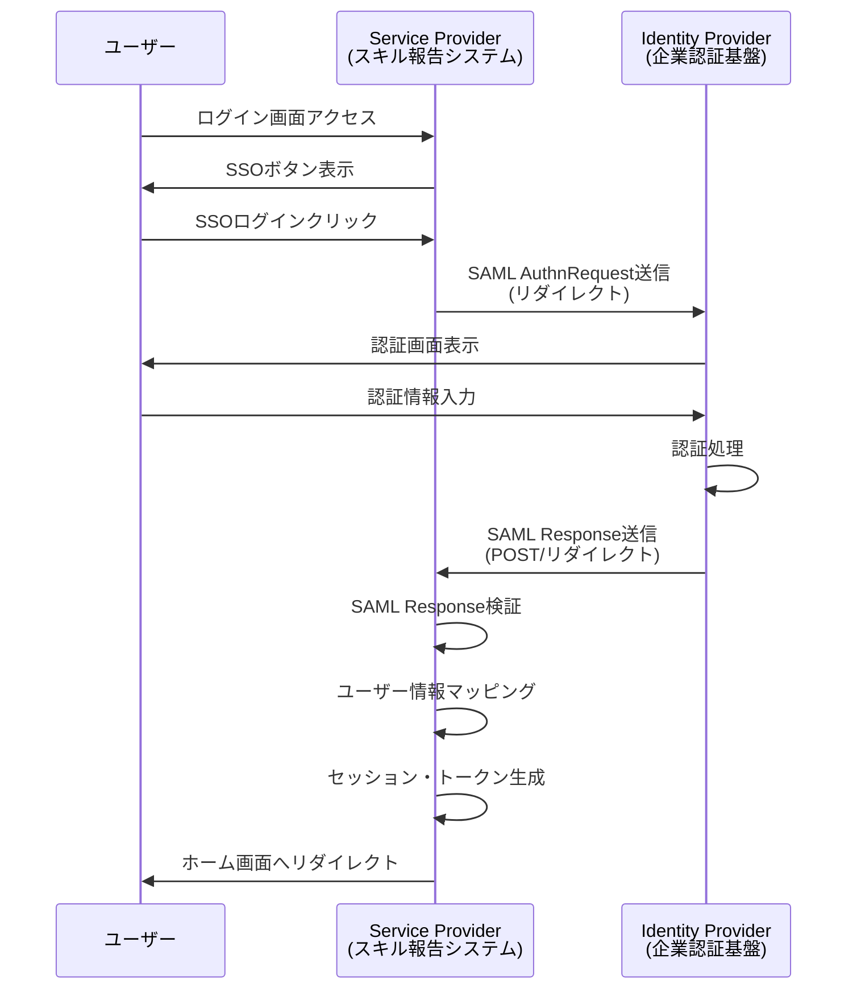
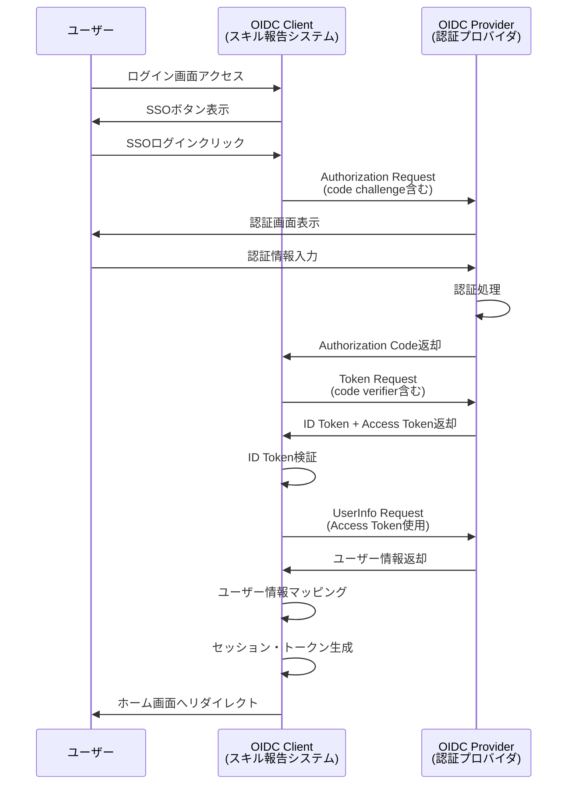

# インターフェース仕様書：SSO認証・外部認証連携 (IF-015)

| 項目                | 内容                                                                                |
|---------------------|------------------------------------------------------------------------------------|
| **インターフェースID** | IF-015                                                                          |
| **名称**            | SSO認証・外部認証連携                                                               |
| **インターフェース方式** | 外部                                                                           |
| **インターフェース種別** | 画面-外部                                                                      |
| **概要**            | SAML/OIDC等による外部認証プロバイダとのシングルサインオン連携                        |
| **主な連携先**      | SCR-LOGIN                                                                          |
| **主なAPI/バッチID** | API-002                                                                            |
| **主なテーブル/データ** | MST_UserAuth                                                                    |
| **主な機能ID**      | F01                                                                                |
| **優先度**          | 最高                                                                                |
| **備考**            | SAML/OIDC等                                                                        |

## 1. インターフェース概要

SSO認証・外部認証連携インターフェース（IF-015）は、企業の既存認証基盤（Active Directory、Azure AD、Google Workspace等）とのシングルサインオン（SSO）連携を実現します。SAML 2.0およびOpenID Connect（OIDC）プロトコルをサポートし、ユーザーの利便性向上とセキュリティ強化を両立します。

## 2. 対応認証プロトコル

### 2.1 SAML 2.0



### 2.2 OpenID Connect (OIDC)



## 3. SAML 2.0 実装仕様

### 3.1 SAML設定

**Service Provider (SP) メタデータ**:
```xml
<?xml version="1.0" encoding="UTF-8"?>
<md:EntityDescriptor xmlns:md="urn:oasis:names:tc:SAML:2.0:metadata"
                     entityID="https://skill-report.company.com">
  <md:SPSSODescriptor AuthnRequestsSigned="true"
                      WantAssertionsSigned="true"
                      protocolSupportEnumeration="urn:oasis:names:tc:SAML:2.0:protocol">
    
    <md:KeyDescriptor use="signing">
      <ds:KeyInfo xmlns:ds="http://www.w3.org/2000/09/xmldsig#">
        <ds:X509Data>
          <ds:X509Certificate><!-- SP署名証明書 --></ds:X509Certificate>
        </ds:X509Data>
      </ds:KeyInfo>
    </md:KeyDescriptor>
    
    <md:KeyDescriptor use="encryption">
      <ds:KeyInfo xmlns:ds="http://www.w3.org/2000/09/xmldsig#">
        <ds:X509Data>
          <ds:X509Certificate><!-- SP暗号化証明書 --></ds:X509Certificate>
        </ds:X509Data>
      </ds:KeyInfo>
    </md:KeyDescriptor>
    
    <md:SingleLogoutService Binding="urn:oasis:names:tc:SAML:2.0:bindings:HTTP-Redirect"
                           Location="https://skill-report.company.com/sso/sls"/>
    
    <md:AssertionConsumerService Binding="urn:oasis:names:tc:SAML:2.0:bindings:HTTP-POST"
                                Location="https://skill-report.company.com/sso/acs"
                                index="0" isDefault="true"/>
  </md:SPSSODescriptor>
</md:EntityDescriptor>
```

### 3.2 SAML AuthnRequest

```typescript
interface SAMLAuthRequest {
  generateAuthRequest(relayState?: string): string {
    const authRequest = {
      ID: this.generateRequestId(),
      Version: '2.0',
      IssueInstant: new Date().toISOString(),
      Destination: this.idpSSOUrl,
      Issuer: this.spEntityId,
      NameIDPolicy: {
        Format: 'urn:oasis:names:tc:SAML:1.1:nameid-format:emailAddress',
        AllowCreate: true
      },
      RequestedAuthnContext: {
        AuthnContextClassRef: 'urn:oasis:names:tc:SAML:2.0:ac:classes:PasswordProtectedTransport',
        Comparison: 'minimum'
      }
    };
    
    const signedRequest = this.signRequest(authRequest);
    return this.encodeRequest(signedRequest, relayState);
  }
}
```

### 3.3 SAML Response処理

```typescript
interface SAMLResponseProcessor {
  async processResponse(samlResponse: string, relayState?: string): Promise<UserInfo> {
    // 1. SAML Response検証
    const decodedResponse = this.decodeResponse(samlResponse);
    await this.validateSignature(decodedResponse);
    await this.validateTimestamp(decodedResponse);
    await this.validateAudience(decodedResponse);
    
    // 2. Assertion抽出
    const assertion = this.extractAssertion(decodedResponse);
    await this.validateAssertion(assertion);
    
    // 3. 属性マッピング
    const attributes = this.extractAttributes(assertion);
    const userInfo = this.mapAttributes(attributes);
    
    // 4. ユーザー情報同期
    await this.syncUserInfo(userInfo);
    
    return userInfo;
  }
  
  private mapAttributes(attributes: SAMLAttributes): UserInfo {
    return {
      userId: attributes['http://schemas.xmlsoap.org/ws/2005/05/identity/claims/name'],
      email: attributes['http://schemas.xmlsoap.org/ws/2005/05/identity/claims/emailaddress'],
      lastName: attributes['http://schemas.xmlsoap.org/ws/2005/05/identity/claims/surname'],
      firstName: attributes['http://schemas.xmlsoap.org/ws/2005/05/identity/claims/givenname'],
      departmentCode: attributes['http://schemas.company.com/claims/department'],
      positionCode: attributes['http://schemas.company.com/claims/position']
    };
  }
}
```

## 4. OpenID Connect 実装仕様

### 4.1 OIDC設定

```typescript
interface OIDCConfig {
  clientId: string;
  clientSecret: string;
  issuer: string;
  authorizationEndpoint: string;
  tokenEndpoint: string;
  userInfoEndpoint: string;
  jwksUri: string;
  scopes: string[];
  responseType: 'code';
  responseMode: 'form_post' | 'query';
  redirectUri: string;
  postLogoutRedirectUri: string;
}

const oidcConfig: OIDCConfig = {
  clientId: 'skill-report-system',
  clientSecret: process.env.OIDC_CLIENT_SECRET,
  issuer: 'https://login.company.com',
  authorizationEndpoint: 'https://login.company.com/oauth2/authorize',
  tokenEndpoint: 'https://login.company.com/oauth2/token',
  userInfoEndpoint: 'https://login.company.com/oauth2/userinfo',
  jwksUri: 'https://login.company.com/.well-known/jwks.json',
  scopes: ['openid', 'profile', 'email'],
  responseType: 'code',
  responseMode: 'form_post',
  redirectUri: 'https://skill-report.company.com/oidc/callback',
  postLogoutRedirectUri: 'https://skill-report.company.com/logout'
};
```

### 4.2 Authorization Code Flow with PKCE

```typescript
interface OIDCAuthFlow {
  async initiateAuth(): Promise<string> {
    // PKCE パラメータ生成
    const codeVerifier = this.generateCodeVerifier();
    const codeChallenge = this.generateCodeChallenge(codeVerifier);
    const state = this.generateState();
    const nonce = this.generateNonce();
    
    // セッションに保存
    await this.storeAuthState({
      codeVerifier,
      state,
      nonce,
      timestamp: Date.now()
    });
    
    // Authorization URL構築
    const authUrl = new URL(this.config.authorizationEndpoint);
    authUrl.searchParams.set('client_id', this.config.clientId);
    authUrl.searchParams.set('response_type', this.config.responseType);
    authUrl.searchParams.set('scope', this.config.scopes.join(' '));
    authUrl.searchParams.set('redirect_uri', this.config.redirectUri);
    authUrl.searchParams.set('state', state);
    authUrl.searchParams.set('nonce', nonce);
    authUrl.searchParams.set('code_challenge', codeChallenge);
    authUrl.searchParams.set('code_challenge_method', 'S256');
    
    return authUrl.toString();
  }
  
  async handleCallback(code: string, state: string): Promise<UserInfo> {
    // State検証
    const authState = await this.getAuthState(state);
    if (!authState || Date.now() - authState.timestamp > 600000) { // 10分
      throw new Error('Invalid or expired state');
    }
    
    // Token交換
    const tokenResponse = await this.exchangeCodeForTokens(code, authState.codeVerifier);
    
    // ID Token検証
    const idToken = await this.validateIdToken(tokenResponse.id_token, authState.nonce);
    
    // UserInfo取得
    const userInfo = await this.getUserInfo(tokenResponse.access_token);
    
    return this.mapUserInfo(userInfo, idToken);
  }
}
```

### 4.3 ID Token検証

```typescript
interface IDTokenValidator {
  async validateIdToken(idToken: string, expectedNonce: string): Promise<IDTokenClaims> {
    // JWTヘッダー解析
    const header = this.decodeJWTHeader(idToken);
    
    // 公開鍵取得
    const publicKey = await this.getPublicKey(header.kid);
    
    // 署名検証
    const isValidSignature = await this.verifySignature(idToken, publicKey);
    if (!isValidSignature) {
      throw new Error('Invalid ID token signature');
    }
    
    // Claims検証
    const claims = this.decodeJWTPayload(idToken);
    
    // Issuer検証
    if (claims.iss !== this.config.issuer) {
      throw new Error('Invalid issuer');
    }
    
    // Audience検証
    if (claims.aud !== this.config.clientId) {
      throw new Error('Invalid audience');
    }
    
    // 有効期限検証
    if (claims.exp < Date.now() / 1000) {
      throw new Error('ID token expired');
    }
    
    // Nonce検証
    if (claims.nonce !== expectedNonce) {
      throw new Error('Invalid nonce');
    }
    
    return claims;
  }
}
```

## 5. ユーザー情報マッピング

### 5.1 属性マッピング設定

```typescript
interface AttributeMapping {
  saml: {
    userId: string;
    email: string;
    lastName: string;
    firstName: string;
    departmentCode: string;
    positionCode: string;
    roles: string;
  };
  oidc: {
    userId: string;
    email: string;
    lastName: string;
    firstName: string;
    departmentCode: string;
    positionCode: string;
    roles: string;
  };
}

const attributeMapping: AttributeMapping = {
  saml: {
    userId: 'http://schemas.xmlsoap.org/ws/2005/05/identity/claims/name',
    email: 'http://schemas.xmlsoap.org/ws/2005/05/identity/claims/emailaddress',
    lastName: 'http://schemas.xmlsoap.org/ws/2005/05/identity/claims/surname',
    firstName: 'http://schemas.xmlsoap.org/ws/2005/05/identity/claims/givenname',
    departmentCode: 'http://schemas.company.com/claims/department',
    positionCode: 'http://schemas.company.com/claims/position',
    roles: 'http://schemas.microsoft.com/ws/2008/06/identity/claims/role'
  },
  oidc: {
    userId: 'preferred_username',
    email: 'email',
    lastName: 'family_name',
    firstName: 'given_name',
    departmentCode: 'department',
    positionCode: 'job_title',
    roles: 'roles'
  }
};
```

### 5.2 ユーザー情報同期

```typescript
interface UserSyncService {
  async syncUserFromSSO(ssoUserInfo: SSOUserInfo, provider: 'SAML' | 'OIDC'): Promise<UserInfo> {
    // 既存ユーザー検索
    let user = await this.userRepository.findByUserId(ssoUserInfo.userId);
    
    if (!user) {
      // 新規ユーザー作成
      user = await this.createUserFromSSO(ssoUserInfo, provider);
    } else {
      // 既存ユーザー更新
      user = await this.updateUserFromSSO(user, ssoUserInfo);
    }
    
    // SSO連携情報更新
    await this.updateSSOInfo(user.userId, {
      provider,
      lastLoginAt: new Date(),
      ssoSubject: ssoUserInfo.subject
    });
    
    return user;
  }
  
  private async createUserFromSSO(ssoUserInfo: SSOUserInfo, provider: string): Promise<UserInfo> {
    const newUser = {
      userId: ssoUserInfo.userId,
      email: ssoUserInfo.email,
      lastName: ssoUserInfo.lastName,
      firstName: ssoUserInfo.firstName,
      departmentCode: ssoUserInfo.departmentCode,
      positionCode: ssoUserInfo.positionCode,
      status: 'ACTIVE',
      ssoEnabled: true,
      ssoProvider: provider,
      ssoSubject: ssoUserInfo.subject,
      createdAt: new Date()
    };
    
    return await this.userRepository.create(newUser);
  }
}
```

## 6. セキュリティ仕様

### 6.1 証明書管理

```typescript
interface CertificateManager {
  // SAML署名・暗号化証明書
  getSigningCertificate(): X509Certificate;
  getEncryptionCertificate(): X509Certificate;
  
  // IdP証明書検証
  validateIdPCertificate(certificate: X509Certificate): boolean;
  
  // 証明書ローテーション
  rotateCertificates(): Promise<void>;
}

// 証明書設定
const certificateConfig = {
  signingCert: {
    path: '/etc/ssl/certs/saml-signing.crt',
    keyPath: '/etc/ssl/private/saml-signing.key',
    algorithm: 'RS256'
  },
  encryptionCert: {
    path: '/etc/ssl/certs/saml-encryption.crt',
    keyPath: '/etc/ssl/private/saml-encryption.key',
    algorithm: 'RSA-OAEP'
  }
};
```

### 6.2 セッション管理

```typescript
interface SSOSessionManager {
  async createSSOSession(userInfo: UserInfo, provider: string): Promise<string> {
    const sessionData = {
      userId: userInfo.userId,
      provider,
      loginTime: new Date(),
      lastActivity: new Date(),
      ipAddress: this.getClientIP(),
      userAgent: this.getUserAgent()
    };
    
    const sessionId = this.generateSessionId();
    await this.sessionStore.set(sessionId, sessionData, 3600); // 1時間
    
    return sessionId;
  }
  
  async validateSSOSession(sessionId: string): Promise<boolean> {
    const session = await this.sessionStore.get(sessionId);
    if (!session) return false;
    
    // セッション有効期限チェック
    const now = new Date();
    const lastActivity = new Date(session.lastActivity);
    const sessionTimeout = 30 * 60 * 1000; // 30分
    
    if (now.getTime() - lastActivity.getTime() > sessionTimeout) {
      await this.sessionStore.delete(sessionId);
      return false;
    }
    
    // 最終アクティビティ更新
    session.lastActivity = now;
    await this.sessionStore.set(sessionId, session, 3600);
    
    return true;
  }
}
```

## 7. エラーハンドリング

### 7.1 SSO エラー分類

| エラーコード | 説明 | HTTP ステータス | 対応方法 |
|-------------|------|----------------|---------|
| SSO_CONFIG_ERROR | SSO設定エラー | 500 | 設定ファイル・証明書の確認 |
| SAML_VALIDATION_ERROR | SAML検証エラー | 400 | SAML Response の署名・形式確認 |
| OIDC_TOKEN_ERROR | OIDC トークンエラー | 400 | ID Token の検証・有効期限確認 |
| USER_MAPPING_ERROR | ユーザーマッピングエラー | 400 | 属性マッピング設定の確認 |
| SSO_TIMEOUT | SSO タイムアウト | 408 | 認証フロー再開始 |

### 7.2 エラーハンドリング実装

```typescript
class SSOErrorHandler {
  async handleSSOError(error: SSOError, context: SSOContext): Promise<void> {
    switch (error.code) {
      case 'SAML_VALIDATION_ERROR':
        await this.logSAMLError(error, context);
        throw new AuthenticationError('SAML認証に失敗しました');
        
      case 'OIDC_TOKEN_ERROR':
        await this.logOIDCError(error, context);
        throw new AuthenticationError('OIDC認証に失敗しました');
        
      case 'USER_MAPPING_ERROR':
        await this.logMappingError(error, context);
        throw new AuthenticationError('ユーザー情報の取得に失敗しました');
        
      default:
        await this.logUnknownError(error, context);
        throw new SystemError('認証システムエラーが発生しました');
    }
  }
}
```

## 8. 監視・ログ

### 8.1 SSO監視項目

```typescript
interface SSOMonitor {
  // 認証成功率
  recordAuthSuccess(provider: string, duration: number): void;
  recordAuthFailure(provider: string, error: string): void;
  
  // レスポンス時間
  recordResponseTime(provider: string, operation: string, duration: number): void;
  
  // 証明書有効期限
  checkCertificateExpiry(): Promise<CertificateStatus[]>;
}

// 監視メトリクス
const ssoMetrics = {
  authSuccessRate: {
    threshold: 0.95, // 95%
    alertLevel: 'WARNING'
  },
  responseTime: {
    threshold: 5000, // 5秒
    alertLevel: 'WARNING'
  },
  certificateExpiry: {
    threshold: 30, // 30日前
    alertLevel: 'CRITICAL'
  }
};
```

### 8.2 監査ログ

```typescript
interface SSOAuditLog {
  logId: string;
  userId: string;
  provider: 'SAML' | 'OIDC';
  action: 'LOGIN_ATTEMPT' | 'LOGIN_SUCCESS' | 'LOGIN_FAILURE' | 'LOGOUT';
  ipAddress: string;
  userAgent: string;
  sessionId?: string;
  errorCode?: string;
  errorMessage?: string;
  timestamp: Date;
}
```

## 9. 関連インターフェース

- [IF-001](./インターフェース仕様書_IF-001.md): ログイン認証
- [IF-002](./インターフェース仕様書_IF-002.md): 権限・ロール管理
- [IF-003](./インターフェース仕様書_IF-003.md): プロフィール管理

## 10. 改訂履歴

| 改訂日     | 改訂者 | 改訂内容                                         |
|------------|--------|--------------------------------------------------|
| 2025/05/30 | 初版   | 初版作成                                         |
