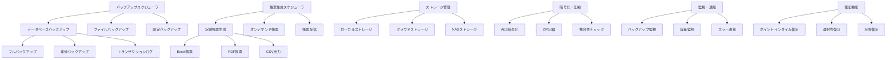

# インターフェース仕様書：バックアップ・帳票ファイル出力 (IF-016)

| 項目                | 内容                                                                                |
|---------------------|------------------------------------------------------------------------------------|
| **インターフェースID** | IF-016                                                                          |
| **名称**            | バックアップ・帳票ファイル出力                                                      |
| **インターフェース方式** | 外部                                                                           |
| **インターフェース種別** | バッチ-ファイル                                                                |
| **概要**            | システムバックアップ、帳票ファイル出力、ストレージ連携                              |
| **主な連携先**      | BATCH-012, BATCH-013                                                              |
| **主なAPI/バッチID** | -                                                                                  |
| **主なテーブル/データ** | SYS_BackupHistory, MST_ReportTemplate                                         |
| **主な機能ID**      | F15, F16                                                                           |
| **優先度**          | 低/高                                                                               |
| **備考**            | ストレージ連携                                                                      |

## 1. インターフェース概要

バックアップ・帳票ファイル出力インターフェース（IF-016）は、システムの継続性とデータ保護を確保する重要な基盤機能です。定期的なデータベースバックアップ、システム設定のエクスポート、各種帳票の自動生成・配信、外部ストレージとの連携により、システムの安全性と運用効率を向上させます。

## 2. システムアーキテクチャ



## 3. バックアップ仕様

### 3.1 データベースバックアップ（BATCH-012）

#### 3.1.1 フルバックアップ

```typescript
interface FullBackupJob {
  async executeFullBackup(): Promise<BackupResult> {
    const backupConfig = await this.getBackupConfiguration();
    const backupId = this.generateBackupId('FULL');
    
    try {
      // 1. バックアップ前処理
      await this.preBackupTasks();
      
      // 2. データベース整合性チェック
      const integrityCheck = await this.checkDatabaseIntegrity();
      if (!integrityCheck.isValid) {
        throw new Error(`Database integrity check failed: ${integrityCheck.errors}`);
      }
      
      // 3. フルバックアップ実行
      const backupFile = await this.createFullBackup(backupConfig);
      
      // 4. バックアップファイル検証
      const verification = await this.verifyBackupFile(backupFile);
      
      // 5. 暗号化・圧縮
      const securedFile = await this.secureBackupFile(backupFile, backupConfig);
      
      // 6. ストレージ転送
      const storageResult = await this.transferToStorage(securedFile, backupConfig);
      
      // 7. バックアップ履歴記録
      await this.recordBackupHistory({
        backupId,
        backupType: 'FULL',
        status: 'COMPLETED',
        fileSize: securedFile.size,
        storageLocation: storageResult.location,
        checksum: securedFile.checksum
      });
      
      // 8. 古いバックアップの削除
      await this.cleanupOldBackups(backupConfig.retentionPolicy);
      
      return {
        backupId,
        status: 'SUCCESS',
        fileSize: securedFile.size,
        duration: Date.now() - startTime,
        location: storageResult.location
      };
      
    } catch (error) {
      await this.handleBackupError(backupId, error);
      throw error;
    }
  }
  
  private async createFullBackup(config: BackupConfiguration): Promise<BackupFile> {
    const backupCommand = this.buildBackupCommand(config);
    const backupFile = await this.executeBackupCommand(backupCommand);
    
    return {
      filePath: backupFile.path,
      size: backupFile.size,
      checksum: await this.calculateChecksum(backupFile.path),
      createdAt: new Date()
    };
  }
  
  private buildBackupCommand(config: BackupConfiguration): string {
    // PostgreSQL例
    return `pg_dump -h ${config.host} -p ${config.port} -U ${config.username} ` +
           `-d ${config.database} -f ${config.outputPath} --verbose --no-password`;
  }
}
```

#### 3.1.2 差分バックアップ

```typescript
interface IncrementalBackupJob {
  async executeIncrementalBackup(): Promise<BackupResult> {
    const lastFullBackup = await this.getLastFullBackup();
    const backupId = this.generateBackupId('INCREMENTAL');
    
    try {
      // 1. 変更データ特定
      const changedData = await this.identifyChangedData(lastFullBackup.timestamp);
      
      if (changedData.isEmpty()) {
        return {
          backupId,
          status: 'SKIPPED',
          reason: 'No changes detected',
          duration: 0
        };
      }
      
      // 2. 差分バックアップ作成
      const backupFile = await this.createIncrementalBackup(changedData);
      
      // 3. バックアップチェーン検証
      await this.validateBackupChain(backupFile, lastFullBackup);
      
      // 4. ストレージ保存
      const storageResult = await this.storeIncrementalBackup(backupFile);
      
      return {
        backupId,
        status: 'SUCCESS',
        fileSize: backupFile.size,
        changedTables: changedData.tables.length,
        baseBackupId: lastFullBackup.backupId
      };
      
    } catch (error) {
      await this.handleBackupError(backupId, error);
      throw error;
    }
  }
  
  private async identifyChangedData(since: Date): Promise<ChangedDataInfo> {
    const changedTables = await this.getChangedTables(since);
    const changedRows = await this.getChangedRowCount(changedTables, since);
    
    return {
      tables: changedTables,
      totalRows: changedRows,
      isEmpty: () => changedTables.length === 0
    };
  }
}
```

#### 3.1.3 トランザクションログバックアップ

```typescript
interface TransactionLogBackupJob {
  async executeLogBackup(): Promise<BackupResult> {
    const backupId = this.generateBackupId('LOG');
    
    try {
      // 1. アクティブログファイル特定
      const activeLogFiles = await this.getActiveLogFiles();
      
      // 2. ログファイルバックアップ
      const logBackups = await Promise.all(
        activeLogFiles.map(logFile => this.backupLogFile(logFile))
      );
      
      // 3. ログシーケンス検証
      await this.validateLogSequence(logBackups);
      
      // 4. ストレージ保存
      const storageResults = await this.storeLogBackups(logBackups);
      
      return {
        backupId,
        status: 'SUCCESS',
        logFileCount: logBackups.length,
        totalSize: logBackups.reduce((sum, log) => sum + log.size, 0)
      };
      
    } catch (error) {
      await this.handleBackupError(backupId, error);
      throw error;
    }
  }
}
```

### 3.2 ファイルシステムバックアップ

```typescript
interface FileSystemBackupJob {
  async executeFileBackup(): Promise<BackupResult> {
    const backupConfig = await this.getFileBackupConfiguration();
    const backupId = this.generateBackupId('FILE');
    
    try {
      // 1. バックアップ対象ファイル収集
      const targetFiles = await this.collectTargetFiles(backupConfig.includePaths);
      
      // 2. 除外ファイルフィルタリング
      const filteredFiles = this.filterExcludedFiles(targetFiles, backupConfig.excludePatterns);
      
      // 3. ファイル変更検出（差分バックアップ用）
      const changedFiles = await this.detectChangedFiles(filteredFiles, backupConfig.lastBackupTime);
      
      // 4. アーカイブ作成
      const archiveFile = await this.createArchive(changedFiles, backupConfig);
      
      // 5. 整合性検証
      await this.verifyArchive(archiveFile);
      
      // 6. ストレージ転送
      const storageResult = await this.transferArchiveToStorage(archiveFile, backupConfig);
      
      return {
        backupId,
        status: 'SUCCESS',
        fileCount: changedFiles.length,
        archiveSize: archiveFile.size,
        location: storageResult.location
      };
      
    } catch (error) {
      await this.handleBackupError(backupId, error);
      throw error;
    }
  }
  
  private async createArchive(
    files: FileInfo[],
    config: FileBackupConfiguration
  ): Promise<ArchiveFile> {
    const archivePath = this.generateArchivePath(config);
    
    // ZIP圧縮でアーカイブ作成
    const archive = new AdmZip();
    
    for (const file of files) {
      if (file.isDirectory) {
        archive.addLocalFolder(file.path, file.relativePath);
      } else {
        archive.addLocalFile(file.path, file.directory, file.name);
      }
    }
    
    // パスワード保護
    if (config.encryption.enabled) {
      archive.writeZip(archivePath, config.encryption.password);
    } else {
      archive.writeZip(archivePath);
    }
    
    return {
      path: archivePath,
      size: await this.getFileSize(archivePath),
      checksum: await this.calculateChecksum(archivePath),
      createdAt: new Date()
    };
  }
}
```

## 4. 帳票出力仕様

### 4.1 定期帳票生成（BATCH-013）

#### 4.1.1 Excel帳票生成

```typescript
interface ExcelReportGenerator {
  async generateExcelReport(
    templateId: string,
    parameters: ReportParameters
  ): Promise<ReportFile> {
    const template = await this.getReportTemplate(templateId);
    const data = await this.fetchReportData(template.dataSource, parameters);
    
    // Excel Workbook作成
    const workbook = new ExcelJS.Workbook();
    
    // テンプレートに基づいてワークシート作成
    for (const sheetTemplate of template.sheets) {
      const worksheet = workbook.addWorksheet(sheetTemplate.name);
      
      // ヘッダー設定
      await this.setupWorksheetHeader(worksheet, sheetTemplate.header);
      
      // データ行追加
      await this.populateWorksheetData(worksheet, data[sheetTemplate.dataKey], sheetTemplate);
      
      // スタイル適用
      await this.applyWorksheetStyles(worksheet, sheetTemplate.styles);
      
      // チャート追加
      if (sheetTemplate.charts) {
        await this.addChartsToWorksheet(worksheet, sheetTemplate.charts, data);
      }
    }
    
    // ファイル保存
    const outputPath = this.generateReportPath(templateId, 'xlsx', parameters);
    await workbook.xlsx.writeFile(outputPath);
    
    return {
      filePath: outputPath,
      fileName: path.basename(outputPath),
      fileSize: await this.getFileSize(outputPath),
      mimeType: 'application/vnd.openxmlformats-officedocument.spreadsheetml.sheet',
      generatedAt: new Date()
    };
  }
  
  private async populateWorksheetData(
    worksheet: ExcelJS.Worksheet,
    data: any[],
    template: SheetTemplate
  ): Promise<void> {
    let rowIndex = template.dataStartRow || 2;
    
    for (const record of data) {
      const row = worksheet.getRow(rowIndex);
      
      template.columns.forEach((column, colIndex) => {
        const cell = row.getCell(colIndex + 1);
        const value = this.extractValue(record, column.dataPath);
        
        // データ型に応じた値設定
        switch (column.dataType) {
          case 'NUMBER':
            cell.value = Number(value) || 0;
            break;
          case 'DATE':
            cell.value = new Date(value);
            cell.numFmt = column.format || 'yyyy/mm/dd';
            break;
          case 'CURRENCY':
            cell.value = Number(value) || 0;
            cell.numFmt = column.format || '#,##0';
            break;
          default:
            cell.value = String(value || '');
        }
        
        // 条件付きスタイル適用
        if (column.conditionalStyles) {
          this.applyConditionalStyle(cell, value, column.conditionalStyles);
        }
      });
      
      rowIndex++;
    }
  }
}
```

#### 4.1.2 PDF帳票生成

```typescript
interface PDFReportGenerator {
  async generatePDFReport(
    templateId: string,
    parameters: ReportParameters
  ): Promise<ReportFile> {
    const template = await this.getReportTemplate(templateId);
    const data = await this.fetchReportData(template.dataSource, parameters);
    
    // PDF文書作成
    const doc = new PDFDocument({
      size: template.pageSize || 'A4',
      margins: template.margins || { top: 50, bottom: 50, left: 50, right: 50 }
    });
    
    const outputPath = this.generateReportPath(templateId, 'pdf', parameters);
    const stream = fs.createWriteStream(outputPath);
    doc.pipe(stream);
    
    // ヘッダー・フッター設定
    await this.setupPDFHeaderFooter(doc, template.header, template.footer);
    
    // 表紙生成
    if (template.coverPage) {
      await this.generateCoverPage(doc, template.coverPage, parameters);
      doc.addPage();
    }
    
    // 目次生成
    if (template.tableOfContents) {
      await this.generateTableOfContents(doc, template.sections);
      doc.addPage();
    }
    
    // セクション別コンテンツ生成
    for (const section of template.sections) {
      await this.generatePDFSection(doc, section, data[section.dataKey]);
      
      if (section.pageBreakAfter) {
        doc.addPage();
      }
    }
    
    // PDF終了
    doc.end();
    
    return new Promise((resolve, reject) => {
      stream.on('finish', async () => {
        resolve({
          filePath: outputPath,
          fileName: path.basename(outputPath),
          fileSize: await this.getFileSize(outputPath),
          mimeType: 'application/pdf',
          generatedAt: new Date()
        });
      });
      
      stream.on('error', reject);
    });
  }
  
  private async generatePDFSection(
    doc: PDFDocument,
    section: SectionTemplate,
    data: any[]
  ): Promise<void> {
    // セクションタイトル
    doc.fontSize(section.titleFontSize || 16)
       .font('Helvetica-Bold')
       .text(section.title, { align: section.titleAlign || 'left' });
    
    doc.moveDown();
    
    // セクション種別に応じた処理
    switch (section.type) {
      case 'TABLE':
        await this.generatePDFTable(doc, section.table, data);
        break;
      case 'CHART':
        await this.generatePDFChart(doc, section.chart, data);
        break;
      case 'TEXT':
        await this.generatePDFText(doc, section.text, data);
        break;
      case 'LIST':
        await this.generatePDFList(doc, section.list, data);
        break;
    }
    
    doc.moveDown();
  }
}
```

#### 4.1.3 CSV出力

```typescript
interface CSVReportGenerator {
  async generateCSVReport(
    templateId: string,
    parameters: ReportParameters
  ): Promise<ReportFile> {
    const template = await this.getReportTemplate(templateId);
    const data = await this.fetchReportData(template.dataSource, parameters);
    
    const outputPath = this.generateReportPath(templateId, 'csv', parameters);
    const csvWriter = createCsvWriter({
      path: outputPath,
      header: template.columns.map(col => ({
        id: col.dataPath,
        title: col.title
      })),
      encoding: template.encoding || 'utf8'
    });
    
    // データ変換
    const csvData = data.map(record => {
      const csvRecord: any = {};
      
      template.columns.forEach(column => {
        const value = this.extractValue(record, column.dataPath);
        csvRecord[column.dataPath] = this.formatCSVValue(value, column);
      });
      
      return csvRecord;
    });
    
    // CSV書き込み
    await csvWriter.writeRecords(csvData);
    
    return {
      filePath: outputPath,
      fileName: path.basename(outputPath),
      fileSize: await this.getFileSize(outputPath),
      mimeType: 'text/csv',
      generatedAt: new Date()
    };
  }
  
  private formatCSVValue(value: any, column: ColumnTemplate): string {
    if (value === null || value === undefined) {
      return '';
    }
    
    switch (column.dataType) {
      case 'DATE':
        return moment(value).format(column.format || 'YYYY-MM-DD');
      case 'NUMBER':
      case 'CURRENCY':
        return Number(value).toString();
      case 'BOOLEAN':
        return value ? '1' : '0';
      default:
        return String(value);
    }
  }
}
```

## 5. ストレージ連携仕様

### 5.1 クラウドストレージ連携

```typescript
interface CloudStorageManager {
  async uploadToCloud(
    file: BackupFile,
    storageConfig: CloudStorageConfig
  ): Promise<UploadResult> {
    const storageProvider = this.getStorageProvider(storageConfig.provider);
    
    try {
      // 1. アップロード前検証
      await this.validateFileForUpload(file);
      
      // 2. マルチパートアップロード（大容量ファイル対応）
      const uploadResult = await this.performMultipartUpload(
        file,
        storageProvider,
        storageConfig
      );
      
      // 3. アップロード検証
      await this.verifyUpload(uploadResult, file);
      
      // 4. メタデータ設定
      await this.setFileMetadata(uploadResult.objectKey, {
        originalFileName: file.fileName,
        backupType: file.backupType,
        createdAt: file.createdAt,
        checksum: file.checksum
      });
      
      return {
        success: true,
        objectKey: uploadResult.objectKey,
        url: uploadResult.url,
        size: uploadResult.size,
        uploadDuration: uploadResult.duration
      };
      
    } catch (error) {
      await this.handleUploadError(file, error);
      throw error;
    }
  }
  
  private async performMultipartUpload(
    file: BackupFile,
    provider: StorageProvider,
    config: CloudStorageConfig
  ): Promise<MultipartUploadResult> {
    const fileSize = await this.getFileSize(file.filePath);
    const chunkSize = config.chunkSize || 100 * 1024 * 1024; // 100MB
    
    if (fileSize <= chunkSize) {
      // 単一アップロード
      return await provider.uploadFile(file.filePath, config);
    }
    
    // マルチパートアップロード
    const uploadId = await provider.initiateMultipartUpload(file.fileName, config);
    const chunks = await this.splitFileIntoChunks(file.filePath, chunkSize);
    
    const uploadPromises = chunks.map((chunk, index) =>
      provider.uploadPart(uploadId, index + 1, chunk, config)
    );
    
    const parts = await Promise.all(uploadPromises);
    
    return await provider.completeMultipartUpload(uploadId, parts, config);
  }
}
```

### 5.2 NASストレージ連携

```typescript
interface NASStorageManager {
  async copyToNAS(
    file: BackupFile,
    nasConfig: NASStorageConfig
  ): Promise<CopyResult> {
    try {
      // 1. NAS接続確立
      const connection = await this.establishNASConnection(nasConfig);
      
      // 2. ディレクトリ構造作成
      const targetPath = this.buildNASPath(file, nasConfig);
      await this.ensureDirectoryExists(connection, path.dirname(targetPath));
      
      // 3. ファイルコピー
      const copyResult = await this.copyFileToNAS(
        file.filePath,
        targetPath,
        connection
      );
      
      // 4. 整合性検証
      await this.verifyNASCopy(file, targetPath, connection);
      
      // 5. 権限設定
      await this.setNASFilePermissions(targetPath, nasConfig.permissions, connection);
      
      return {
        success: true,
        targetPath,
        size: copyResult.size,
        copyDuration: copyResult.duration
      };
      
    } catch (error) {
      await this.handleNASError(file, error);
      throw error;
    }
  }
  
  private buildNASPath(file: BackupFile, config: NASStorageConfig): string {
    const date = moment(file.createdAt);
    const datePath = date.format('YYYY/MM/DD');
    
    return path.join(
      config.basePath,
      file.backupType.toLowerCase(),
      datePath,
      file.fileName
    );
  }
}
```

## 6. データベース仕様

### 6.1 SYS_BackupHistoryテーブル

| フィールド名 | データ型 | 必須 | 説明 |
|-------------|---------|------|------|
| backup_id | String | ○ | バックアップID（主キー） |
| backup_type | String | ○ | バックアップ種別（"FULL"/"INCREMENTAL"/"LOG"/"FILE"） |
| backup_target | String | ○ | バックアップ対象 |
| status | String | ○ | 状態（"IN_PROGRESS"/"COMPLETED"/"FAILED"/"CANCELLED"） |
| start_time | DateTime | ○ | 開始日時 |
| end_time | DateTime | × | 終了日時 |
| file_size | BigInteger | × | ファイルサイズ |
| compressed_size | BigInteger | × | 圧縮後サイズ |
| checksum | String | × | チェックサム |
| storage_location | String | × | 保存場所 |
| storage_type | String | ○ | ストレージ種別 |
| encryption_enabled | Boolean | ○ | 暗号化フラグ |
| retention_date | Date | × | 保持期限 |
| base_backup_id | String | × | ベースバックアップID（差分用） |
| error_message | Text | × | エラーメッセージ |
| metadata | JSON | × | メタデータ |
| created_at | DateTime | ○ | 作成日時 |

### 6.2 MST_ReportTemplateテーブル

| フィールド名 | データ型 | 必須 | 説明 |
|-------------|---------|------|------|
| template_id | String | ○ | テンプレートID（主キー） |
| template_name | String | ○ | テンプレート名 |
| template_type | String | ○ | テンプレート種別（"EXCEL"/"PDF"/"CSV"） |
| category | String | ○ | カテゴリ |
| description | Text | × | 説明 |
| data_source | String | ○ | データソース |
| template_definition | JSON | ○ | テンプレート定義 |
| parameters | JSON | × | パラメータ定義 |
| schedule | String | × | 実行スケジュール |
| output_path | String | × | 出力パス |
| distribution_list | JSON | × | 配信先リスト |
| retention_days | Integer | ○ | 保持日数 |
| enabled | Boolean | ○ | 有効フラグ |
| created_by | String | ○ | 作成者ID |
| created_at | DateTime | ○ | 作成日時 |
| updated_at | DateTime | ○ | 更新日時 |

### 6.3 SYS_ReportHistoryテーブル

| フィールド名 | データ型 | 必須 | 説明 |
|-------------|---------|------|------|
| report_id | String | ○ | レポートID（主キー） |
| template_id | String | ○ | テンプレートID |
| report_name | String | ○ | レポート名 |
| generation_type | String | ○ | 生成種別（"SCHEDULED"/"MANUAL"） |
| parameters | JSON | × | 実行パラメータ |
| status | String | ○ | 状態 |
| start_time | DateTime | ○ | 開始日時 |
| end_time | DateTime | × | 終了日時 |
| file_path | String | × | ファイルパス |
| file_size | BigInteger | × | ファイルサイズ |
| record_count | Integer | × | レコード数 |
| error_message | Text | × | エラーメッセージ |
| generated_by | String | ○ | 生成者ID |
| distributed_at | DateTime | × | 配信日時 |
| download_count | Integer | ○ | ダウンロード回数 |
| created_at | DateTime | ○ | 作成日時 |

## 7. 監視・運用仕様

### 7.1 バックアップ監視

```typescript
interface BackupMonitoringService {
  async monitorBackupHealth(): Promise<BackupHealthReport> {
    const healthChecks = await Promise.all([
      this.checkBackupScheduleCompliance(),
      this.checkStorageCapacity(),
      this.checkBackupIntegrity(),
      this.checkRetentionPolicyCompliance(),
      this.checkRecoveryTestResults()
    ]);
    
    const overallHealth = this.calculateOverallHealth(healthChecks);
    
    if (overallHealth.status === 'CRITICAL') {
      await this.sendCriticalAlert(overallHealth);
    }
    
    return {
      timestamp: new Date(),
      overallStatus: overallHealth.status,
      checks: healthChecks,
      recommendations: this.generateRecommendations(healthChecks)
    };
  }
  
  private async checkBackupScheduleCompliance(): Promise<HealthCheck> {
    const missedBackups = await this.getMissedBackups(24); // 24時間以内
    const failedBackups = await this.getFailedBackups(24);
    
    return {
      name: 'Backup Schedule Compliance',
      status: missedBackups.length === 0 && failedBackups.length === 0 ? 'HEALTHY' : 'WARNING',
      details: {
        missedBackups: missedBackups.length,
        failedBackups: failedBackups.length,
        lastSuccessfulBackup: await this.getLastSuccessfulBackup()
      }
    };
  }
  
  private async checkStorageCapacity(): Promise<HealthCheck> {
    const storageUsage
