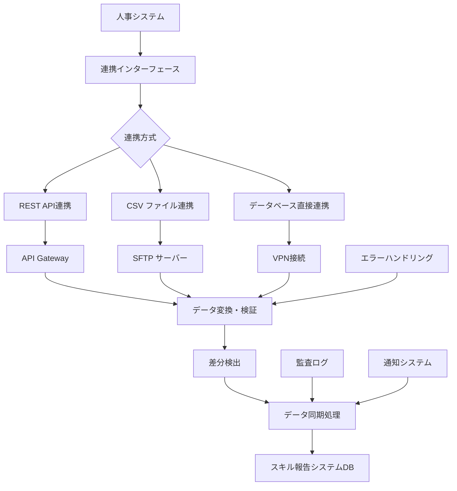
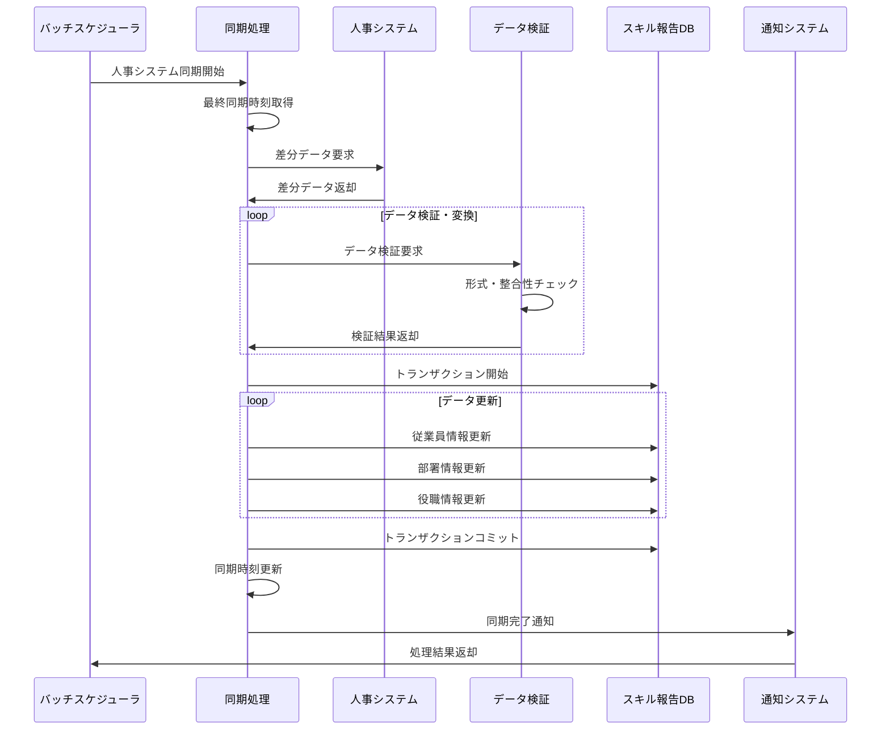

# インターフェース仕様書：人事システム連携 (IF-017)

| 項目                | 内容                                                                                |
|---------------------|------------------------------------------------------------------------------------|
| **インターフェースID** | IF-017                                                                          |
| **名称**            | 人事システム連携                                                                    |
| **インターフェース方式** | 外部                                                                           |
| **インターフェース種別** | バッチ-外部                                                                    |
| **概要**            | 人事システムとの従業員・組織情報の自動同期、差分データ連携                          |
| **主な連携先**      | BATCH-004                                                                          |
| **主なAPI/バッチID** | -                                                                                  |
| **主なテーブル/データ** | MST_Department, MST_Position                                                    |
| **主な機能ID**      | F03, F04                                                                           |
| **優先度**          | 最高                                                                                |
| **備考**            | 外部DB/CSVインポート                                                                |

## 1. インターフェース概要

人事システム連携インターフェース（IF-017）は、企業の人事システムから従業員情報、組織情報（部署・役職）を自動的に取得し、スキル報告システムのマスタデータを最新状態に保持します。日次バッチによる定期同期と、リアルタイム連携による即座な反映を組み合わせ、データの整合性を確保します。

## 2. 連携アーキテクチャ



## 3. 連携方式

### 3.1 REST API連携

**エンドポイント仕様**:
```typescript
interface HRSystemAPI {
  // 従業員情報取得
  getEmployees(lastModified?: Date): Promise<EmployeeData[]>;
  
  // 部署情報取得
  getDepartments(lastModified?: Date): Promise<DepartmentData[]>;
  
  // 役職情報取得
  getPositions(lastModified?: Date): Promise<PositionData[]>;
  
  // 差分情報取得
  getChanges(fromDate: Date, toDate: Date): Promise<ChangeData[]>;
}

// API呼び出し例
const hrApiClient = new HRSystemAPIClient({
  baseUrl: 'https://hr-system.company.com/api/v1',
  apiKey: process.env.HR_API_KEY,
  timeout: 30000,
  retryCount: 3
});

// 差分データ取得
const lastSyncTime = await this.getLastSyncTime();
const employees = await hrApiClient.getEmployees(lastSyncTime);
const departments = await hrApiClient.getDepartments(lastSyncTime);
const positions = await hrApiClient.getPositions(lastSyncTime);
```

### 3.2 CSV ファイル連携

**ファイル形式仕様**:
```typescript
interface CSVFileFormat {
  employees: {
    fileName: 'employees_YYYYMMDD.csv';
    encoding: 'UTF-8';
    delimiter: ',';
    headers: [
      'employee_id',
      'user_id', 
      'last_name',
      'first_name',
      'last_name_kana',
      'first_name_kana',
      'email',
      'phone_number',
      'hire_date',
      'birth_date',
      'gender',
      'department_code',
      'position_code',
      'status',
      'last_modified'
    ];
  };
  
  departments: {
    fileName: 'departments_YYYYMMDD.csv';
    encoding: 'UTF-8';
    delimiter: ',';
    headers: [
      'department_code',
      'department_name',
      'parent_department_code',
      'manager_employee_id',
      'cost_center',
      'status',
      'display_order',
      'last_modified'
    ];
  };
}

// CSV処理例
class CSVProcessor {
  async processEmployeeCSV(filePath: string): Promise<EmployeeData[]> {
    const csvData = await this.readCSVFile(filePath);
    const employees: EmployeeData[] = [];
    
    for (const row of csvData) {
      const employee = this.mapCSVRowToEmployee(row);
      const validationResult = await this.validateEmployee(employee);
      
      if (validationResult.isValid) {
        employees.push(employee);
      } else {
        await this.logValidationError(employee, validationResult.errors);
      }
    }
    
    return employees;
  }
}
```

### 3.3 データベース直接連携

**接続設定**:
```typescript
interface HRDatabaseConfig {
  host: string;
  port: number;
  database: string;
  username: string;
  password: string;
  connectionTimeout: number;
  queryTimeout: number;
  ssl: boolean;
}

// データベース連携クエリ
const hrQueries = {
  employees: `
    SELECT 
      emp_id as employee_id,
      user_id,
      last_name,
      first_name,
      last_name_kana,
      first_name_kana,
      email,
      phone_number,
      hire_date,
      birth_date,
      gender,
      dept_code as department_code,
      pos_code as position_code,
      status,
      last_modified
    FROM hr_employees 
    WHERE last_modified > ?
    ORDER BY last_modified
  `,
  
  departments: `
    SELECT 
      dept_code as department_code,
      dept_name as department_name,
      parent_dept_code as parent_department_code,
      manager_emp_id as manager_employee_id,
      cost_center,
      status,
      display_order,
      last_modified
    FROM hr_departments 
    WHERE last_modified > ?
    ORDER BY display_order
  `
};
```

## 4. データ同期処理

### 4.1 同期フロー



### 4.2 差分検出・同期処理

```typescript
interface HRSyncProcessor {
  async syncHRData(): Promise<SyncResult> {
    const syncResult = {
      totalRecords: 0,
      insertedRecords: 0,
      updatedRecords: 0,
      deletedRecords: 0,
      errorRecords: 0,
      errors: []
    };
    
    try {
      // 最終同期時刻取得
      const lastSyncTime = await this.getLastSyncTime();
      
      // 人事システムから差分データ取得
      const hrData = await this.fetchHRData(lastSyncTime);
      syncResult.totalRecords = hrData.employees.length + hrData.departments.length + hrData.positions.length;
      
      // トランザクション開始
      const transaction = await this.dbManager.beginTransaction();
      
      try {
        // 従業員情報同期
        const employeeResult = await this.syncEmployees(hrData.employees, transaction);
        syncResult.insertedRecords += employeeResult.inserted;
        syncResult.updatedRecords += employeeResult.updated;
        
        // 部署情報同期
        const departmentResult = await this.syncDepartments(hrData.departments, transaction);
        syncResult.insertedRecords += departmentResult.inserted;
        syncResult.updatedRecords += departmentResult.updated;
        
        // 役職情報同期
        const positionResult = await this.syncPositions(hrData.positions, transaction);
        syncResult.insertedRecords += positionResult.inserted;
        syncResult.updatedRecords += positionResult.updated;
        
        // 同期時刻更新
        await this.updateLastSyncTime(new Date(), transaction);
        
        // トランザクションコミット
        await this.dbManager.commitTransaction(transaction);
        
      } catch (error) {
        await this.dbManager.rollbackTransaction(transaction);
        throw error;
      }
      
    } catch (error) {
      syncResult.errors.push({
        type: 'SYNC_ERROR',
        message: error.message,
        timestamp: new Date()
      });
    }
    
    return syncResult;
  }
  
  private async syncEmployees(employees: EmployeeData[], transaction: Transaction): Promise<SyncStats> {
    const stats = { inserted: 0, updated: 0, errors: 0 };
    
    for (const employee of employees) {
      try {
        const existing = await this.employeeRepository.findByEmployeeId(employee.employeeId, transaction);
        
        if (existing) {
          // 更新処理
          if (this.hasChanges(existing, employee)) {
            await this.employeeRepository.update(employee, transaction);
            stats.updated++;
          }
        } else {
          // 新規作成
          await this.employeeRepository.insert(employee, transaction);
          stats.inserted++;
        }
        
      } catch (error) {
        stats.errors++;
        await this.logSyncError('EMPLOYEE', employee.employeeId, error);
      }
    }
    
    return stats;
  }
}
```

## 5. データ変換・マッピング

### 5.1 データマッピング定義

```typescript
interface DataMapping {
  employee: {
    hrField: string;
    skillSystemField: string;
    transformation?: (value: any) => any;
    validation?: (value: any) => boolean;
  }[];
  
  department: {
    hrField: string;
    skillSystemField: string;
    transformation?: (value: any) => any;
    validation?: (value: any) => boolean;
  }[];
}

const hrDataMapping: DataMapping = {
  employee: [
    { hrField: 'emp_id', skillSystemField: 'employee_id' },
    { hrField: 'user_id', skillSystemField: 'user_id' },
    { hrField: 'last_name', skillSystemField: 'last_name' },
    { hrField: 'first_name', skillSystemField: 'first_name' },
    { hrField: 'email', skillSystemField: 'email', validation: (v) => /^[^\s@]+@[^\s@]+\.[^\s@]+$/.test(v) },
    { hrField: 'hire_date', skillSystemField: 'hire_date', transformation: (v) => new Date(v) },
    { hrField: 'gender', skillSystemField: 'gender', transformation: (v) => v === '1' ? 'M' : v === '2' ? 'F' : 'O' },
    { hrField: 'status', skillSystemField: 'status', transformation: (v) => v === '1' ? 'ACTIVE' : 'INACTIVE' }
  ],
  
  department: [
    { hrField: 'dept_code', skillSystemField: 'department_code' },
    { hrField: 'dept_name', skillSystemField: 'department_name' },
    { hrField: 'parent_dept_code', skillSystemField: 'parent_department_code' },
    { hrField: 'manager_emp_id', skillSystemField: 'manager_employee_id' },
    { hrField: 'status', skillSystemField: 'status', transformation: (v) => v === '1' ? 'ACTIVE' : 'INACTIVE' }
  ]
};
```

### 5.2 データ変換処理

```typescript
class DataTransformer {
  transformEmployee(hrEmployee: any): EmployeeData {
    const transformed: any = {};
    
    for (const mapping of hrDataMapping.employee) {
      let value = hrEmployee[mapping.hrField];
      
      // データ変換
      if (mapping.transformation) {
        value = mapping.transformation(value);
      }
      
      // バリデーション
      if (mapping.validation && !mapping.validation(value)) {
        throw new ValidationError(`Invalid value for ${mapping.skillSystemField}: ${value}`);
      }
      
      transformed[mapping.skillSystemField] = value;
    }
    
    return transformed as EmployeeData;
  }
  
  transformDepartment(hrDepartment: any): DepartmentData {
    const transformed: any = {};
    
    for (const mapping of hrDataMapping.department) {
      let value = hrDepartment[mapping.hrField];
      
      if (mapping.transformation) {
        value = mapping.transformation(value);
      }
      
      if (mapping.validation && !mapping.validation(value)) {
        throw new ValidationError(`Invalid value for ${mapping.skillSystemField}: ${value}`);
      }
      
      transformed[mapping.skillSystemField] = value;
    }
    
    return transformed as DepartmentData;
  }
}
```

## 6. エラーハンドリング・復旧

### 6.1 エラー分類

| エラーカテゴリ | 説明 | 対応方法 |
|---------------|------|---------|
| CONNECTION_ERROR | 人事システム接続エラー | 指数バックオフでリトライ |
| DATA_FORMAT_ERROR | データ形式エラー | エラーレコードをスキップして継続 |
| VALIDATION_ERROR | データ検証エラー | エラー詳細をログ出力、管理者通知 |
| CONSTRAINT_ERROR | DB制約違反 | データ整合性チェック、手動修正要求 |
| TIMEOUT_ERROR | 処理タイムアウト | チャンクサイズ縮小、並列度調整 |

### 6.2 復旧処理

```typescript
interface HRSyncRecovery {
  async recoverFromFailure(syncId: string, failurePoint: string): Promise<void> {
    const syncState = await this.getSyncState(syncId);
    
    switch (syncState.failureType) {
      case 'CONNECTION_ERROR':
        await this.retryWithBackoff(syncId);
        break;
        
      case 'DATA_FORMAT_ERROR':
        await this.skipErrorRecordsAndContinue(syncId, failurePoint);
        break;
        
      case 'VALIDATION_ERROR':
        await this.validateAndFixData(syncId);
        break;
        
      case 'CONSTRAINT_ERROR':
        await this.resolveConstraintViolations(syncId);
        break;
        
      default:
        await this.requestManualIntervention(syncId, syncState);
    }
  }
  
  private async retryWithBackoff(syncId: string): Promise<void> {
    const maxRetries = 5;
    let retryCount = 0;
    
    while (retryCount < maxRetries) {
      try {
        await this.resumeSync(syncId);
        return;
      } catch (error) {
        retryCount++;
        const delay = Math.pow(2, retryCount) * 1000; // 指数バックオフ
        await this.delay(delay);
      }
    }
    
    throw new Error(`Sync failed after ${maxRetries} retries`);
  }
}
```

## 7. 監視・アラート

### 7.1 監視項目

```typescript
interface HRSyncMonitor {
  // 同期成功率
  recordSyncSuccess(duration: number, recordCount: number): void;
  recordSyncFailure(error: string, failurePoint: string): void;
  
  // データ品質
  recordDataQualityMetrics(metrics: DataQualityMetrics): void;
  
  // パフォーマンス
  recordPerformanceMetrics(metrics: PerformanceMetrics): void;
}

interface DataQualityMetrics {
  totalRecords: number;
  validRecords: number;
  invalidRecords: number;
  duplicateRecords: number;
  missingRequiredFields: number;
}

// 監視閾値
const hrSyncThresholds = {
  syncSuccessRate: {
    threshold: 0.95, // 95%
    alertLevel: 'WARNING'
  },
  dataQualityRate: {
    threshold: 0.98, // 98%
    alertLevel: 'CRITICAL'
  },
  syncDuration: {
    threshold: 1800000, // 30分
    alertLevel: 'WARNING'
  }
};
```

### 7.2 アラート通知

```typescript
interface HRSyncAlertManager {
  async sendSyncFailureAlert(syncResult: SyncResult): Promise<void> {
    const alert = {
      type: 'HR_SYNC_FAILURE',
      severity: this.calculateSeverity(syncResult),
      message: this.formatAlertMessage(syncResult),
      timestamp: new Date(),
      details: {
        totalRecords: syncResult.totalRecords,
        errorRecords: syncResult.errorRecords,
        errors: syncResult.errors.slice(0, 10) // 最初の10件のエラー
      }
    };
    
    // 管理者への通知
    await this.notificationService.sendAlert(alert);
    
    // Slackチャンネルへの通知
    if (alert.severity === 'CRITICAL') {
      await this.slackNotifier.sendMessage('#hr-system-alerts', alert);
    }
  }
  
  private calculateSeverity(syncResult: SyncResult): 'INFO' | 'WARNING' | 'CRITICAL' {
    const errorRate = syncResult.errorRecords / syncResult.totalRecords;
    
    if (errorRate > 0.1) return 'CRITICAL';  // 10%以上のエラー
    if (errorRate > 0.05) return 'WARNING';  // 5%以上のエラー
    return 'INFO';
  }
}
```

## 8. セキュリティ仕様

### 8.1 認証・認可

```typescript
interface HRSystemSecurity {
  // API認証
  apiAuthentication: {
    method: 'API_KEY' | 'OAUTH2' | 'MUTUAL_TLS';
    keyRotationInterval: number; // 90日
    encryptionAlgorithm: 'AES-256-GCM';
  };
  
  // データベース接続
  databaseSecurity: {
    connectionEncryption: 'TLS1.3';
    credentialRotation: number; // 30日
    minimumPrivileges: true;
  };
  
  // ファイル転送
  fileTransferSecurity: {
    protocol: 'SFTP' | 'FTPS';
    encryption: 'AES-256';
    integrityCheck: 'SHA-256';
  };
}
```

### 8.2 データ保護

```typescript
interface DataProtection {
  // 個人情報暗号化
  encryptPersonalData(data: PersonalData): EncryptedData {
    const sensitiveFields = ['email', 'phoneNumber', 'birthDate'];
    const encrypted = { ...data };
    
    for (const field of sensitiveFields) {
      if (encrypted[field]) {
        encrypted[field] = this.encryptionService.encrypt(encrypted[field]);
      }
    }
    
    return encrypted;
  }
  
  // 監査ログ記録
  logDataAccess(operation: string, userId: string, dataType: string): void {
    const auditLog = {
      operation,
      userId,
      dataType,
      timestamp: new Date(),
      ipAddress: this.getClientIP(),
      userAgent: this.getUserAgent()
    };
    
    this.auditLogger.log(auditLog);
  }
}
```

## 9. 運用手順

### 9.1 日次運用

1. **同期実行確認**:
   - バッチ実行ログの確認
   - 同期結果レポートの確認
   - エラー発生時の対応

2. **データ品質チェック**:
   - 重複データの確認
   - 必須項目の欠損チェック
   - データ整合性の確認

### 9.2 障害対応

```typescript
interface IncidentResponse {
  // 障害検知
  detectIncident(): Promise<Incident[]>;
  
  // 緊急対応
  emergencyResponse(incident: Incident): Promise<void>;
  
  // 復旧処理
  recoverFromIncident(incident: Incident): Promise<void>;
  
  // 事後分析
  postIncidentAnalysis(incident: Incident): Promise<AnalysisReport>;
}
```

## 10. 関連インターフェース

- [IF-003](./インターフェース仕様書_IF-003.md): プロフィール管理
- [IF-013](./インターフェース仕様書_IF-013.md): バッチ-DBアクセス全般
- [IF-016](./インターフェース仕様書_IF-016.md): バックアップ・帳票ファイル出力

## 11. 改訂履歴

| 改訂日     | 改訂者 | 改訂内容                                         |
|------------|--------|--------------------------------------------------|
| 2025/05/30 | 初版   | 初版作成                                         |
