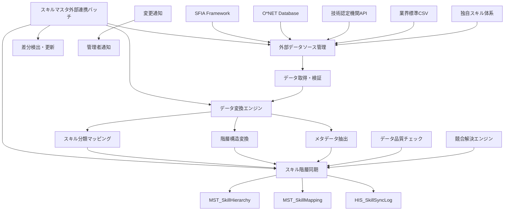
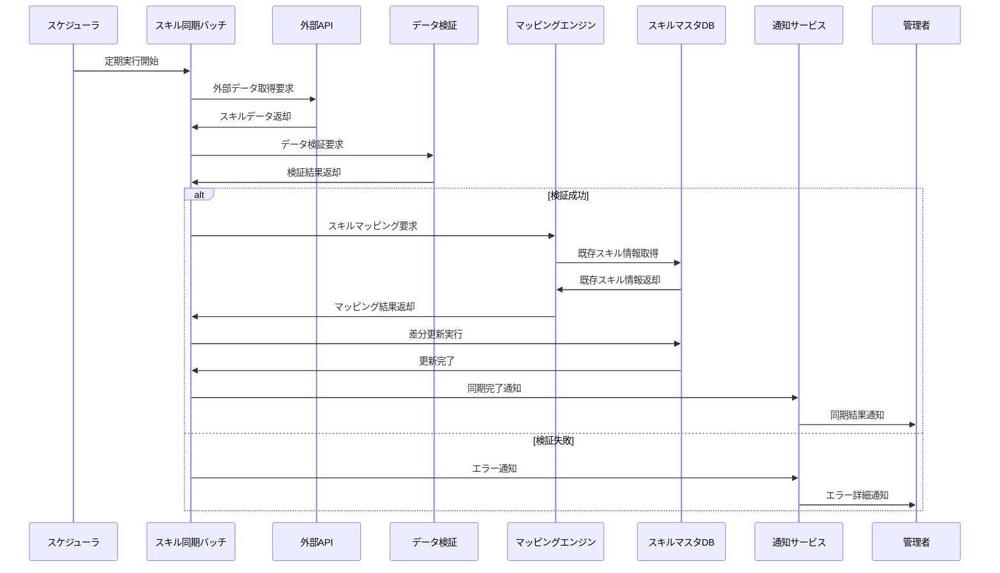

# インターフェース仕様書：スキルマスタ外部連携 (IF-018)

| 項目                | 内容                                                                                |
|---------------------|------------------------------------------------------------------------------------|
| **インターフェースID** | IF-018                                                                          |
| **名称**            | スキルマスタ外部連携                                                                |
| **インターフェース方式** | 外部                                                                           |
| **インターフェース種別** | バッチ-外部                                                                    |
| **概要**            | 外部スキル標準との連携、業界標準スキル体系の取り込み、スキル分類の同期              |
| **主な連携先**      | BATCH-005                                                                          |
| **主なAPI/バッチID** | -                                                                                  |
| **主なテーブル/データ** | MST_SkillHierarchy                                                              |
| **主な機能ID**      | F05                                                                                |
| **優先度**          | 高                                                                                  |
| **備考**            | 外部DB/CSV連携                                                                      |

## 1. インターフェース概要

スキルマスタ外部連携インターフェース（IF-018）は、外部のスキル標準体系や業界標準との連携を行う重要な統合機能です。SFIA（Skills Framework for the Information Age）、O*NET、各種技術認定機関のスキル分類体系などとの連携により、最新かつ標準化されたスキル情報を自動的に取り込み、組織内のスキル管理の精度と網羅性を向上させます。

## 2. 外部連携アーキテクチャ



## 3. インターフェースフロー



## 4. 外部データソース仕様

### 4.1 SFIA（Skills Framework for the Information Age）連携

**データソース**: SFIA公式API  
**更新頻度**: 月次  
**データ形式**: JSON/XML

```typescript
interface SFIASkillData {
  skillCode: string;           // SFIA スキルコード
  skillName: string;           // スキル名
  skillDescription: string;    // スキル説明
  category: string;            // カテゴリ
  subcategory: string;         // サブカテゴリ
  levels: SFIALevel[];         // レベル定義
  version: string;             // SFIAバージョン
  lastUpdated: Date;           // 最終更新日
}

interface SFIALevel {
  level: number;               // レベル（1-7）
  description: string;         // レベル説明
  responsibilities: string[];  // 責任範囲
  knowledge: string[];         // 必要知識
  skills: string[];           // 必要スキル
}

// SFIA連携設定例
const sfiaConfig = {
  apiEndpoint: 'https://api.sfia-online.org/v7',
  apiKey: process.env.SFIA_API_KEY,
  categories: [
    'ITMG', // IT management
    'PROG', // Programming/software development
    'ARCH', // Solution architecture
    'DTAN'  // Data analysis
  ],
  syncSchedule: '0 2 1 * *', // 毎月1日 2:00
  retryPolicy: {
    maxRetries: 3,
    retryDelay: 60000
  }
};
```

### 4.2 O*NET Database連携

**データソース**: O*NET Web Services  
**更新頻度**: 四半期  
**データ形式**: XML

```typescript
interface ONetSkillData {
  elementId: string;           // O*NET要素ID
  elementName: string;         // 要素名
  description: string;         // 説明
  scaleId: string;            // スケールID
  dataValue: number;          // データ値
  standardError: number;      // 標準誤差
  lowerCiBound: number;       // 信頼区間下限
  upperCiBound: number;       // 信頼区間上限
  recommendSuppress: boolean; // 抑制推奨フラグ
  notRelevant: boolean;       // 非関連フラグ
  date: Date;                 // データ日付
  domainSource: string;       // ドメインソース
}

// O*NET連携設定例
const onetConfig = {
  apiEndpoint: 'https://services.onetcenter.org/ws',
  username: process.env.ONET_USERNAME,
  password: process.env.ONET_PASSWORD,
  targetOccupations: [
    '15-1132.00', // Software Developers, Applications
    '15-1133.00', // Software Developers, Systems Software
    '15-1134.00', // Web Developers
    '15-1142.00'  // Network and Computer Systems Administrators
  ],
  syncSchedule: '0 3 1 */3 *', // 四半期初日 3:00
  dataElements: [
    'Skills',
    'Knowledge',
    'Abilities',
    'Technology Skills'
  ]
};
```

### 4.3 技術認定機関API連携

```typescript
interface CertificationProviderAPI {
  providerId: string;          // プロバイダーID
  providerName: string;        // プロバイダー名
  apiEndpoint: string;         // APIエンドポイント
  authMethod: 'API_KEY' | 'OAUTH2' | 'BASIC';
  credentials: any;            // 認証情報
  skillCategories: string[];   // 対象スキルカテゴリ
  syncFrequency: string;       // 同期頻度
}

// 主要認定機関設定例
const certificationProviders: CertificationProviderAPI[] = [
  {
    providerId: 'AWS',
    providerName: 'Amazon Web Services',
    apiEndpoint: 'https://api.aws.amazon.com/certification',
    authMethod: 'API_KEY',
    credentials: { apiKey: process.env.AWS_CERT_API_KEY },
    skillCategories: ['CLOUD', 'DEVOPS', 'SECURITY'],
    syncFrequency: '0 4 * * 1' // 毎週月曜日 4:00
  },
  {
    providerId: 'MICROSOFT',
    providerName: 'Microsoft Learn',
    apiEndpoint: 'https://docs.microsoft.com/api/learn',
    authMethod: 'OAUTH2',
    credentials: { 
      clientId: process.env.MS_CLIENT_ID,
      clientSecret: process.env.MS_CLIENT_SECRET
    },
    skillCategories: ['AZURE', 'OFFICE365', 'DYNAMICS'],
    syncFrequency: '0 5 * * 1'
  },
  {
    providerId: 'ORACLE',
    providerName: 'Oracle University',
    apiEndpoint: 'https://education.oracle.com/api',
    authMethod: 'API_KEY',
    credentials: { apiKey: process.env.ORACLE_EDU_API_KEY },
    skillCategories: ['DATABASE', 'JAVA', 'MIDDLEWARE'],
    syncFrequency: '0 6 * * 1'
  }
];
```

## 5. データ変換・マッピング仕様

### 5.1 スキル分類マッピング

```typescript
interface SkillMappingEngine {
  async mapExternalSkillToInternal(
    externalSkill: ExternalSkillData,
    sourceType: 'SFIA' | 'ONET' | 'CERTIFICATION'
  ): Promise<InternalSkillMapping> {
    
    // 1. 既存マッピングの確認
    const existingMapping = await this.findExistingMapping(
      externalSkill.externalId, 
      sourceType
    );
    
    if (existingMapping) {
      return this.updateExistingMapping(existingMapping, externalSkill);
    }
    
    // 2. 自動マッピング実行
    const autoMapping = await this.performAutoMapping(externalSkill, sourceType);
    
    // 3. 信頼度チェック
    if (autoMapping.confidence > 0.8) {
      return this.createConfirmedMapping(autoMapping);
    } else {
      return this.createPendingMapping(autoMapping);
    }
  }
  
  private async performAutoMapping(
    externalSkill: ExternalSkillData,
    sourceType: string
  ): Promise<AutoMappingResult> {
    const mappingStrategies = [
      this.exactNameMatch,
      this.semanticSimilarityMatch,
      this.keywordBasedMatch,
      this.hierarchyBasedMatch
    ];
    
    let bestMatch: MappingCandidate | null = null;
    let maxConfidence = 0;
    
    for (const strategy of mappingStrategies) {
      const candidates = await strategy(externalSkill);
      
      for (const candidate of candidates) {
        if (candidate.confidence > maxConfidence) {
          maxConfidence = candidate.confidence;
          bestMatch = candidate;
        }
      }
    }
    
    return {
      externalSkill,
      internalSkillCode: bestMatch?.skillCode,
      confidence: maxConfidence,
      mappingMethod: bestMatch?.method,
      alternatives: this.getAlternativeCandidates(externalSkill)
    };
  }
}
```

### 5.2 階層構造変換

```typescript
interface HierarchyConverter {
  async convertExternalHierarchy(
    externalHierarchy: ExternalHierarchyData,
    sourceType: string
  ): Promise<InternalHierarchyStructure> {
    
    const internalStructure: InternalHierarchyStructure = {
      rootCategories: [],
      mappingRules: [],
      conversionLog: []
    };
    
    // SFIA階層の変換
    if (sourceType === 'SFIA') {
      internalStructure.rootCategories = await this.convertSFIACategories(
        externalHierarchy.categories
      );
    }
    
    // O*NET階層の変換
    if (sourceType === 'ONET') {
      internalStructure.rootCategories = await this.convertONETOccupations(
        externalHierarchy.occupations
      );
    }
    
    // 階層の正規化
    await this.normalizeHierarchy(internalStructure);
    
    return internalStructure;
  }
  
  private async convertSFIACategories(
    sfiaCategories: SFIACategory[]
  ): Promise<InternalCategory[]> {
    return sfiaCategories.map(category => ({
      categoryCode: `SFIA-${category.code}`,
      categoryName: category.name,
      parentCode: category.parentCode ? `SFIA-${category.parentCode}` : null,
      level: category.level,
      description: category.description,
      externalSource: 'SFIA',
      externalId: category.code,
      skills: category.skills.map(skill => ({
        skillCode: `SFIA-${skill.code}`,
        skillName: skill.name,
        levels: skill.levels
      }))
    }));
  }
}
```

## 6. データ品質管理

### 6.1 データ検証ルール

```typescript
interface DataQualityValidator {
  async validateExternalSkillData(
    skillData: ExternalSkillData,
    sourceType: string
  ): Promise<ValidationResult> {
    const validationRules = this.getValidationRules(sourceType);
    const results: ValidationIssue[] = [];
    
    for (const rule of validationRules) {
      const issue = await rule.validate(skillData);
      if (issue) {
        results.push(issue);
      }
    }
    
    return {
      isValid: results.filter(r => r.severity === 'ERROR').length === 0,
      issues: results,
      score: this.calculateQualityScore(results)
    };
  }
  
  private getValidationRules(sourceType: string): ValidationRule[] {
    const commonRules = [
      new RequiredFieldRule(['skillCode', 'skillName']),
      new SkillNameLengthRule(3, 100),
      new DescriptionLengthRule(10, 1000),
      new DuplicateDetectionRule(),
      new CharacterEncodingRule()
    ];
    
    const sourceSpecificRules = {
      'SFIA': [
        new SFIALevelValidationRule(),
        new SFIACodeFormatRule(),
        new SFIACategoryValidationRule()
      ],
      'ONET': [
        new ONETElementIdRule(),
        new ONETScaleValidationRule(),
        new ONETDataValueRangeRule()
      ],
      'CERTIFICATION': [
        new CertificationLevelRule(),
        new ExpirationDateRule(),
        new ProviderValidationRule()
      ]
    };
    
    return [...commonRules, ...(sourceSpecificRules[sourceType] || [])];
  }
}
```

### 6.2 競合解決

```typescript
interface ConflictResolver {
  async resolveSkillConflicts(
    conflicts: SkillConflict[]
  ): Promise<ConflictResolution[]> {
    const resolutions: ConflictResolution[] = [];
    
    for (const conflict of conflicts) {
      const resolution = await this.resolveConflict(conflict);
      resolutions.push(resolution);
    }
    
    return resolutions;
  }
  
  private async resolveConflict(
    conflict: SkillConflict
  ): Promise<ConflictResolution> {
    const strategy = this.selectResolutionStrategy(conflict);
    
    switch (strategy) {
      case 'SOURCE_PRIORITY':
        return this.resolveBySourcePriority(conflict);
      case 'LATEST_UPDATE':
        return this.resolveByLatestUpdate(conflict);
      case 'MANUAL_REVIEW':
        return this.scheduleManualReview(conflict);
      case 'MERGE_ATTRIBUTES':
        return this.mergeSkillAttributes(conflict);
      default:
        return this.createPendingResolution(conflict);
    }
  }
  
  private selectResolutionStrategy(conflict: SkillConflict): ResolutionStrategy {
    // ソース優先度による解決
    if (this.hasSourcePriorityDifference(conflict)) {
      return 'SOURCE_PRIORITY';
    }
    
    // 更新日時による解決
    if (this.hasSignificantTimeDifference(conflict)) {
      return 'LATEST_UPDATE';
    }
    
    // 属性マージによる解決
    if (this.canMergeAttributes(conflict)) {
      return 'MERGE_ATTRIBUTES';
    }
    
    // 手動レビューが必要
    return 'MANUAL_REVIEW';
  }
}
```

## 7. 同期処理仕様

### 7.1 バッチ処理フロー

```typescript
interface SkillSyncBatch {
  async executeSyncProcess(): Promise<SyncResult> {
    const syncResult: SyncResult = {
      startTime: new Date(),
      endTime: null,
      status: 'IN_PROGRESS',
      processedSources: [],
      totalSkillsProcessed: 0,
      newSkillsAdded: 0,
      skillsUpdated: 0,
      conflictsDetected: 0,
      errors: []
    };
    
    try {
      // 1. 外部データソースからデータ取得
      const externalData = await this.fetchExternalData();
      
      // 2. データ検証
      const validationResults = await this.validateData(externalData);
      
      // 3. マッピング実行
      const mappingResults = await this.performMapping(validationResults.validData);
      
      // 4. 競合検出・解決
      const conflicts = await this.detectConflicts(mappingResults);
      const resolutions = await this.resolveConflicts(conflicts);
      
      // 5. データベース更新
      const updateResults = await this.updateDatabase(mappingResults, resolutions);
      
      // 6. 結果集計
      syncResult.endTime = new Date();
      syncResult.status = 'COMPLETED';
      syncResult.totalSkillsProcessed = updateResults.totalProcessed;
      syncResult.newSkillsAdded = updateResults.newSkills;
      syncResult.skillsUpdated = updateResults.updatedSkills;
      syncResult.conflictsDetected = conflicts.length;
      
      // 7. 通知送信
      await this.sendCompletionNotification(syncResult);
      
    } catch (error) {
      syncResult.endTime = new Date();
      syncResult.status = 'FAILED';
      syncResult.errors.push(error.message);
      
      await this.sendErrorNotification(syncResult, error);
    }
    
    // 8. ログ記録
    await this.logSyncResult(syncResult);
    
    return syncResult;
  }
}
```

### 7.2 増分同期

```typescript
interface IncrementalSyncService {
  async performIncrementalSync(
    sourceType: string,
    lastSyncTime: Date
  ): Promise<IncrementalSyncResult> {
    
    // 1. 変更データの取得
    const changedData = await this.fetchChangedData(sourceType, lastSyncTime);
    
    if (changedData.length === 0) {
      return {
        status: 'NO_CHANGES',
        processedCount: 0,
        lastSyncTime: new Date()
      };
    }
    
    // 2. 変更種別の分類
    const changes = this.classifyChanges(changedData);
    
    // 3. 各変更の処理
    const results = await Promise.all([
      this.processNewSkills(changes.newSkills),
      this.processUpdatedSkills(changes.updatedSkills),
      this.processDeletedSkills(changes.deletedSkills)
    ]);
    
    return {
      status: 'COMPLETED',
      processedCount: changedData.length,
      newSkills: results[0].count,
      updatedSkills: results[1].count,
      deletedSkills: results[2].count,
      lastSyncTime: new Date()
    };
  }
}
```

## 8. データ項目定義

### 8.1 MST_SkillMappingテーブル

| フィールド名 | データ型 | 必須 | 説明 |
|-------------|---------|------|------|
| mapping_id | String | ○ | マッピングID（主キー） |
| internal_skill_code | String | ○ | 内部スキルコード |
| external_source | String | ○ | 外部ソース（"SFIA"/"ONET"/"CERTIFICATION"） |
| external_skill_id | String | ○ | 外部スキルID |
| external_skill_name | String | ○ | 外部スキル名 |
| mapping_confidence | Decimal | ○ | マッピング信頼度（0.0-1.0） |
| mapping_method | String | ○ | マッピング手法 |
| mapping_status | String | ○ | マッピング状態（"CONFIRMED"/"PENDING"/"REJECTED"） |
| reviewed_by | String | × | レビュー者ID |
| reviewed_at | DateTime | × | レビュー日時 |
| created_at | DateTime | ○ | 作成日時 |
| updated_at | DateTime | ○ | 更新日時 |

### 8.2 HIS_SkillSyncLogテーブル

| フィールド名 | データ型 | 必須 | 説明 |
|-------------|---------|------|------|
| sync_log_id | String | ○ | 同期ログID（主キー） |
| sync_batch_id | String | ○ | 同期バッチID |
| external_source | String | ○ | 外部ソース |
| sync_type | String | ○ | 同期種別（"FULL"/"INCREMENTAL"） |
| start_time | DateTime | ○ | 開始日時 |
| end_time | DateTime | × | 終了日時 |
| status | String | ○ | 状態（"IN_PROGRESS"/"COMPLETED"/"FAILED"） |
| total_processed | Integer | ○ | 処理総数 |
| new_skills_added | Integer | ○ | 新規追加スキル数 |
| skills_updated | Integer | ○ | 更新スキル数 |
| conflicts_detected | Integer | ○ | 検出競合数 |
| error_count | Integer | ○ | エラー数 |
| error_details | JSON | × | エラー詳細 |
| created_at | DateTime | ○ | 作成日時 |

### 8.3 MST_ExternalSourceConfigテーブル

| フィールド名 | データ型 | 必須 | 説明 |
|-------------|---------|------|------|
| source_config_id | String | ○ | ソース設定ID（主キー） |
| source_type | String | ○ | ソース種別 |
| source_name | String | ○ | ソース名 |
| api_endpoint | String | × | APIエンドポイント |
| auth_method | String | × | 認証方式 |
| auth_config | JSON | × | 認証設定 |
| sync_schedule | String | ○ | 同期スケジュール |
| priority | Integer | ○ | 優先度 |
| enabled | Boolean | ○ | 有効フラグ |
| last_sync_time | DateTime | × | 最終同期日時 |
| created_at | DateTime | ○ | 作成日時 |
| updated_at | DateTime | ○ | 更新日時 |

## 9. エラーハンドリング

### 9.1 外部連携エラー分類

| エラーコード | 説明 | 対応方法 |
|-------------|------|---------|
| EXT_CONNECTION_TIMEOUT | 外部API接続タイムアウト | リトライ実行 |
| EXT_AUTH_FAILED | 外部API認証失敗 | 認証情報確認 |
| EXT_RATE_LIMIT | API呼び出し制限 | 待機後リトライ |
| EXT_DATA_FORMAT_ERROR | データ形式エラー | データ形式確認 |
| EXT_MAPPING_CONFLICT | マッピング競合 | 手動レビュー |

### 9.2 リトライ戦略

```typescript
interface RetryStrategy {
  async executeWithRetry<T>(
    operation: () => Promise<T>,
    config: RetryConfig
  ): Promise<T> {
    let lastError: Error;
    
    for (let attempt = 1; attempt <= config.maxRetries; attempt++) {
      try {
        return await operation();
      } catch (error) {
        lastError = error;
        
        if (!this.isRetryableError(error) || attempt === config.maxRetries) {
          throw error;
        }
        
        const delay = this.calculateDelay(attempt, config);
        await this.sleep(delay);
      }
    }
    
    throw lastError;
  }
  
  private calculateDelay(attempt: number, config: RetryConfig): number {
    switch (config.strategy) {
      case 'EXPONENTIAL_BACKOFF':
        return Math.min(
          config.baseDelay * Math.pow(2, attempt - 1),
          config.maxDelay
        );
      case 'LINEAR_BACKOFF':
        return Math.min(
          config.baseDelay * attempt,
          config.maxDelay
        );
      case 'FIXED_DELAY':
      default:
        return config.baseDelay;
    }
  }
}
```

## 10. 監視・運用

### 10.1 同期監視KPI

```typescript
interface SyncMonitoringKPI {
  // 同期成功率
  syncSuccessRate: number;
  
  // 平均同期時間
  averageSyncDuration: number;
  
  // データ品質スコア
  dataQualityScore: number;
  
  // マッピング精度
  mappingAccuracy: number;
  
  // 競合発生率
  conflictRate: number;
  
  // 外部ソース可用性
  externalSourceAvailability: Map<string, number>;
}
```

### 10.2 アラート設定

```typescript
interface SyncAlertManager {
  async checkSyncHealth(): Promise<HealthAlert[]> {
    const alerts: HealthAlert[] = [];
    
    // 同期失敗アラート
    const failedSyncs = await this.getRecentFailedSyncs();
    if (failedSyncs.length > 0) {
      alerts.push({
        type: 'SYNC_FAILURE',
        severity: 'HIGH',
        message: `${failedSyncs.length}件の同期が失敗しています`,
        details: failedSyncs
      });
    }
    
    // データ品質低下アラート
    const qualityScore = await this.calculateDataQualityScore();
    if (qualityScore < 0.8) {
      alerts.push({
        type: 'DATA_QUALITY_DEGRADATION',
        severity: 'MEDIUM',
        message: `データ品質スコアが低下しています: ${qualityScore}`,
        threshold: 0.8
      });
    }
    
    // 外部ソース接続エラーアラート
    const connectionIssues = await this.checkExternalSourceConnectivity();
    if (connectionIssues.length > 0) {
      alerts.push({
        type: 'EXTERNAL_SOURCE_UNAVAILABLE',
        severity: 'HIGH',
        message: '外部ソースへの接続に問題があります',
        affectedSources: connectionIssues
      });
    }
    
    return alerts;
  }
}
```

## 11. セキュリティ仕様

### 11.1 外部API認証

```typescript
interface ExternalAPIAuthenticator {
  async authenticateAPI(sourceConfig: ExternalSourceConfig): Promise<AuthToken> {
    switch (sourceConfig.authMethod) {
      case 'API_KEY':
        return this.authenticateWithApiKey(sourceConfig);
      case 'OAUTH2':
        return this.authenticateWithOAuth2(sourceConfig);
      case 'BASIC':
        return this.authenticateWithBasicAuth(sourceConfig);
      default:
        throw new Error(`Unsupported auth method: ${sourceConfig.authMethod}`);
    }
  }
  
  private async authenticateWithOAuth2(
    config: ExternalSourceConfig
  ): Promise<AuthToken> {
    const tokenResponse = await fetch(config.authConfig.tokenEndpoint, {
      method: 'POST',
      headers: {
        'Content-Type': 'application/x-www-form-url
