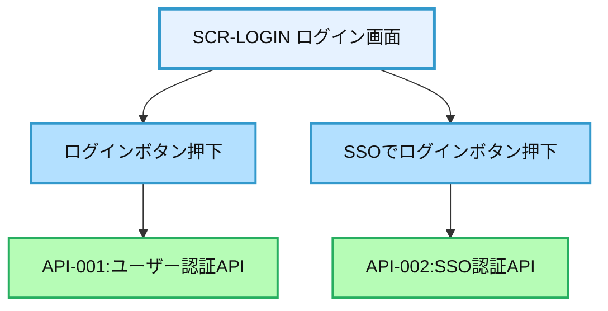
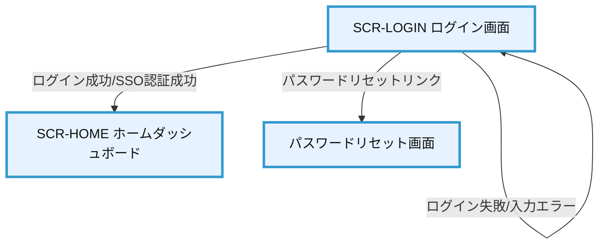

# 画面設計書：SCR-LOGIN（ログイン画面）

## 1. 画面基本情報

- **画面ID**：SCR-LOGIN
- **画面名称**：ログイン画面
- **画面の機能概要・目的**：  
  システム利用者が安全かつ簡便にログイン認証を行う画面。ID/パスワード認証およびSSO（シングルサインオン）に対応。セキュアな認証基盤を提供し、業務システムの起点となる。
- **利用ユーザー・アクター**：全ユーザー（社員・上司・人事・管理者）
- **関連機能・仕様ID・機能ID**：F01 / PLT.1-WEB.1, PLT.1-RESP.1, PLT.1-BRS.1, PLT.2-ENC.1, ACC.1-ROLE.1
- **作成日**：2025/05/28
- **作成者**：システム設計担当
- **改訂履歴**：2025/05/28 初版作成

---

## 2. 画面レイアウト

- **画面イメージ・ワイヤーフレーム**
```
+------------------------------------------------------+
|  [会社ロゴ]   年間スキル報告書システム ログイン       |
+------------------------------------------------------+
|  ユーザーID [__________________________]             | ①
|  パスワード [__________________________]             | ②
|  [ ] パスワードを表示                                | ③
|                                                      |
|  [ ログイン ]                                       | ④
|                                                      |
|  [SSOでログイン]                                     | ⑤
|                                                      |
|  [パスワードを忘れた方はこちら]                      | ⑥
|                                                      |
|  (エラー時メッセージ表示エリア)                      | ⑦
+------------------------------------------------------+
|  © 2025 Example Corp.                                |
+------------------------------------------------------+
```
- **画面サイズ**：レスポンシブ（PC：横800px基準、スマホ：100%）
- **UI/UX設計上の注意点**：キーボード操作・タブ移動対応、フォーカス時の強調、視認性重視

---

## 3. 画面項目定義

| 項目ID | 項目名            | APIパラメータ対応           | データ型   | I/O区分 | 必須 | 備考                       |
|--------|-------------------|----------------------------|-----------|---------|------|----------------------------|
| ①      | ユーザーID        | API-001.user_id            | テキスト   | 入力    | ○    | 社員番号またはメール       |
| ②      | パスワード        | API-001.password           | パスワード | 入力    | ○    | 8文字以上                  |
| ③      | パスワード表示    | -                          | チェックBOX| 入力    | -    | 入力時マスク/表示切替      |
| ④      | ログインボタン    | API-001（POST）            | ボタン     | 入力    | -    | 必須項目入力後のみ活性     |
| ⑤      | SSOログイン       | API-002（GET）             | ボタン     | 入力    | -    | SSO連携設定時のみ表示      |
| ⑥      | パスワードリセット| -                          | リンク     | 入力    | -    | パスワードリセット画面へ   |
| ⑦      | エラーメッセージ  | API-001/002エラー応答      | ラベル     | 出力    | -    | 入力エラー・認証失敗時     |

---

## 4. 画面イベント・アクション定義

| イベントID | トリガー/アクション           | イベント内容・アクション詳細                                         | 紐付くAPI ID・名称      | メッセージ表示                       |
|------------|------------------------------|---------------------------------------------------------------------|------------------------|--------------------------------------|
| E01        | [ログイン]ボタン押下          | 入力値バリデーション→API-001呼出→認証成功時はSCR-HOMEへ遷移         | API-001:ユーザー認証API | エラー時：エラーメッセージ表示        |
| E02        | [SSOでログイン]ボタン押下     | API-002呼出（IdPリダイレクト）→認証成功時はSCR-HOMEへ遷移           | API-002:SSO認証API     | エラー時：エラーメッセージ表示        |
| E03        | [パスワード表示]チェック      | パスワード入力欄の表示/非表示切替                                   | -                      |                                      |
| E04        | [パスワードを忘れた方はこちら]| パスワードリセット画面へ遷移                                        | -                      |                                      |
| E05        | Enterキー押下                 | ログインボタン押下と同等処理                                        | API-001                |                                      |
| E06        | 入力エラー                    | 必須項目未入力・形式不正・認証失敗                                  | API-001/002            | エラーメッセージ表示                  |
| E07        | ログイン成功                  | セッション発行・ユーザー権限取得・SCR-HOMEへ遷移                    | API-001/002            |                                      |
| E08        | ログイン失敗                  | エラーメッセージ表示・パスワード再入力促す                          | API-001/002            | 「ユーザーIDまたはパスワードが違います」|
| E09        | アカウントロック              | ログイン失敗回数上限超過                                            | API-001/002            | 「アカウントがロックされました」      |

---

## 5. 画面イベント・API関連図（Mermaid）



---

## 6. 画面遷移図・フロー



---

## 7. メッセージ定義

| メッセージID | メッセージ内容                                  | 種別    | 表示タイミング           |
|--------------|-----------------------------------------------|---------|-------------------------|
| MSG01        | ユーザーIDまたはパスワードが違います           | エラー  | 認証失敗時              |
| MSG02        | 必須項目が入力されていません                   | エラー  | 入力バリデーション時    |
| MSG03        | アカウントがロックされました。管理者に連絡してください | エラー  | ログイン失敗上限時      |
| MSG04        | システム障害が発生しました。再度お試しください | エラー  | システム例外時          |

---

## 8. 入出力一覧

| 種別      | 名称           | 概要                         | アクセス方式 | 経由API（ID・名称・エンドポイント）         |
|-----------|----------------|------------------------------|--------------|--------------------------------------------|
| テーブル  | UserAuth       | ユーザー認証情報             | API経由      | API-001:ユーザー認証API /api/auth/login    |
| API       | API-001        | ユーザー認証API              | -            | /api/auth/login                           |
| API       | API-002        | SSO認証API                   | -            | /api/auth/sso                             |
| セッション| Session        | ログインセッション管理       | API経由      | API-001/002経由で発行                     |

---

## 9. バックエンドAPIコール仕様（APIファースト設計）

### API-001 ユーザー認証API
- エンドポイント: `/api/auth/login`
- HTTPメソッド: POST
- リクエストパラメータ: user_id (string, 必須), password (string, 必須)
- レスポンスパラメータ: token (string), user_info (object)
- ステータスコードとエラーケース: 200, 401, 403, 500
- 認証・認可要件: なし（認証前API）
- 呼び出しタイミング: [ログイン]ボタン押下時（E01）
- 備考: ログイン失敗回数上限でアカウントロック

### API-002 SSO認証API
- エンドポイント: `/api/auth/sso`
- HTTPメソッド: GET
- リクエストパラメータ: sso_token (string, 必須)
- レスポンスパラメータ: token (string), user_info (object)
- ステータスコードとエラーケース: 200, 401, 403, 500
- 認証・認可要件: SSO（SAML/OIDC等）によるIdP認証
- 呼び出しタイミング: [SSOでログイン]ボタン押下時（E02）
- 備考: SSO未設定時はボタン非表示

---

## 10. オブジェクト構成・CRUD定義

- UserAuth: R（API-001/002経由のみ）
- Session: C, D（API-001/002経由のみ）
- ログイン履歴: C（API-001/002経由のみ）
- アカウントロック: U（API-001/002経由のみ）

---

## 11. その他

- **アクセシビリティ要件**  
  - キーボード操作・スクリーンリーダー対応、コントラスト確保、ラベル付与
- **セキュリティ要件**  
  - パスワードマスク、ペースト禁止、SSOはSAML/OIDC対応、TLS必須、アカウントロック、ログ記録
- **操作手順・利用ガイド**  
  - ユーザーID・パスワード入力→ログインボタンまたはEnter→認証→ホーム画面へ遷移
  - SSO利用時は「SSOでログイン」ボタンからIdP認証
  - パスワード忘れ時は「パスワードを忘れた方はこちら」リンクからリセット画面へ
- **備考・補足**  
  - SSO方式はシステム要件に応じてSAML/OIDC/代理認証等選択可能
  - 多要素認証（MFA）拡張も設計上考慮
  - 監査証跡は全認証トランザクションを記録
