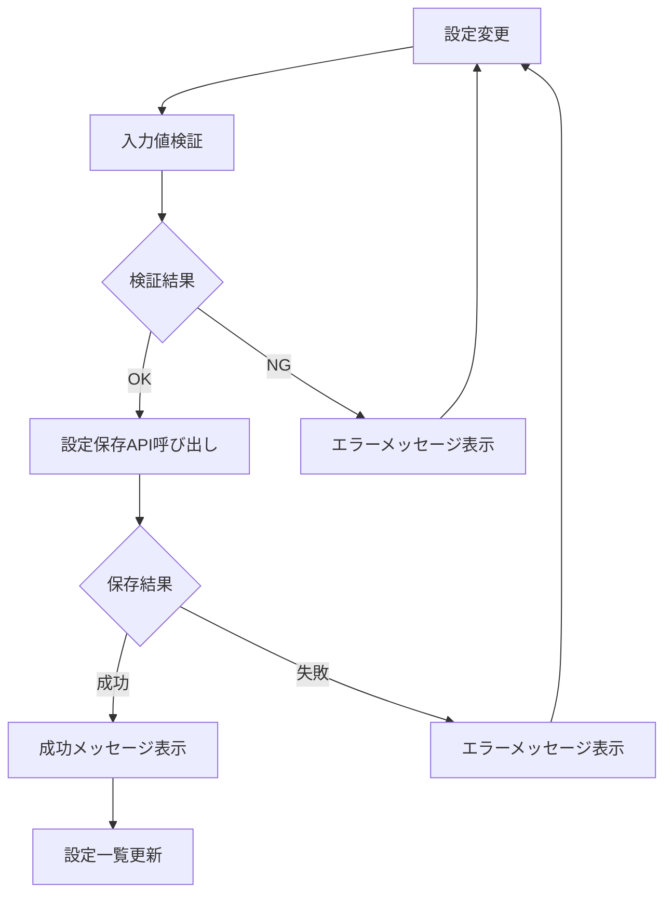
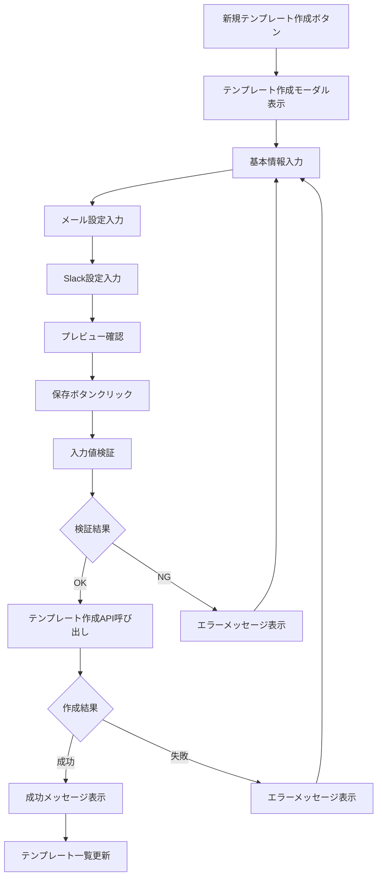
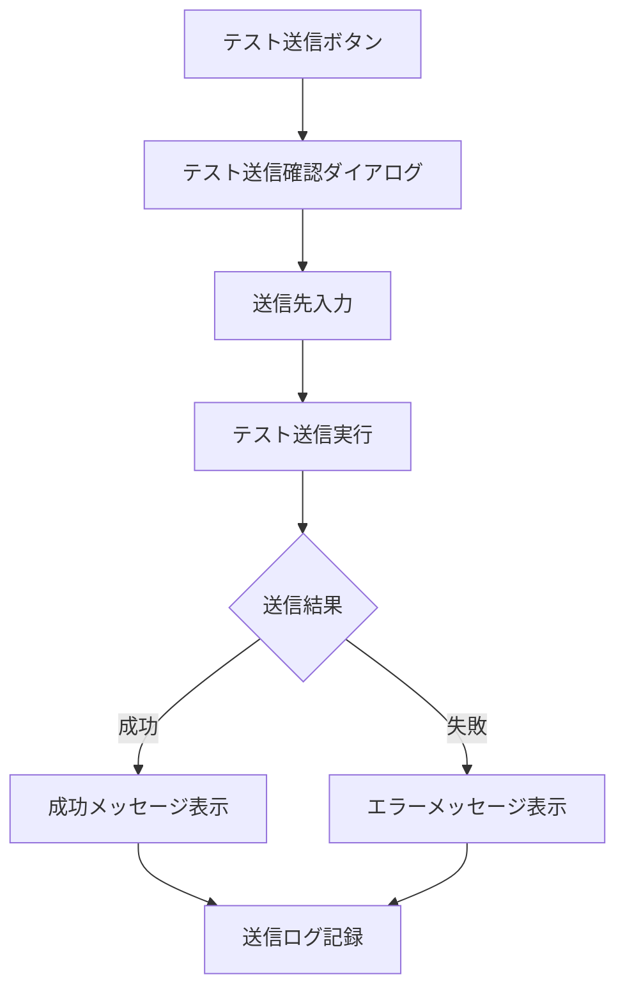

# 画面定義書 - SCR-NOTIFY-ADMIN 通知設定管理画面

## 基本情報

| 項目 | 内容 |
|------|------|
| 画面ID | SCR-NOTIFY-ADMIN |
| 画面名称 | 通知設定管理画面 |
| 機能カテゴリ | 通知・連携管理 |
| 主な利用者 | テナント管理者 |
| 優先度 | 高 |
| 作成日 | 2025-05-31 |
| 更新日 | 2025-05-31 |

## 画面概要

### 目的
- テナント別の通知設定の管理
- 通知テンプレートの作成・編集・削除
- 外部システム連携（Slack、Teams、LINE WORKS、メール）の設定
- 通知配信の監視・管理

### 主な機能
1. **通知設定管理**
   - テナント別通知設定の表示・編集
   - 通知種別ごとの有効/無効設定
   - 通知タイミングの設定

2. **通知テンプレート管理**
   - 通知テンプレートの作成・編集・削除
   - テンプレート変数の管理
   - プレビュー機能

3. **外部システム連携設定**
   - Slack連携設定
   - Teams連携設定
   - LINE WORKS連携設定
   - メール配信設定

4. **通知履歴・監視**
   - 通知配信履歴の表示
   - 配信エラーの確認
   - 配信統計の表示

## 画面レイアウト

### ヘッダー部
```
[ロゴ] 年間スキル報告書システム - 通知設定管理
                                    [ユーザー名] [ログアウト]
```

### ナビゲーション部
```
[ホーム] [通知設定] [テンプレート管理] [連携設定] [通知履歴]
```

### メイン部
```
┌─ 通知設定管理 ─────────────────────────────────────┐
│                                                    │
│ ┌─ 基本通知設定 ─────────────────────────────────┐ │
│ │                                                │ │
│ │ ┌─ システム通知 ─────────────────────────────┐ │ │
│ │ │ □ システムメンテナンス通知                 │ │ │
│ │ │ □ 障害発生通知                             │ │ │
│ │ │ □ セキュリティアラート                     │ │ │
│ │ └────────────────────────────────────────────┘ │ │
│ │                                                │ │
│ │ ┌─ 業務通知 ─────────────────────────────────┐ │ │
│ │ │ □ スキル報告書提出期限リマインダー         │ │ │
│ │ │ □ 目標設定期限リマインダー                 │ │ │
│ │ │ □ 研修受講リマインダー                     │ │ │
│ │ │ □ 資格期限アラート                         │ │ │
│ │ └────────────────────────────────────────────┘ │ │
│ │                                                │ │
│ │ ┌─ 承認・レビュー通知 ───────────────────────┐ │ │
│ │ │ □ 承認依頼通知                             │ │ │
│ │ │ □ レビュー依頼通知                         │ │ │
│ │ │ □ 承認完了通知                             │ │ │
│ │ └────────────────────────────────────────────┘ │ │
│ └────────────────────────────────────────────────┘ │
│                                                    │
│ ┌─ 通知チャネル設定 ─────────────────────────────┐ │
│ │                                                │ │
│ │ ┌─ メール ───────────────────────────────────┐ │ │
│ │ │ ☑ 有効                                     │ │ │
│ │ │ SMTPサーバー: [mail.company.com]           │ │ │
│ │ │ ポート: [587]  暗号化: [STARTTLS ▼]       │ │ │
│ │ │                              [テスト送信] │ │ │
│ │ └────────────────────────────────────────────┘ │ │
│ │                                                │ │
│ │ ┌─ Slack ────────────────────────────────────┐ │ │
│ │ │ ☑ 有効                                     │ │ │
│ │ │ Webhook URL: [https://hooks.slack.com/...] │ │ │
│ │ │ チャネル: [#notifications]                 │ │ │
│ │ │                              [テスト送信] │ │ │
│ │ └────────────────────────────────────────────┘ │ │
│ │                                                │ │
│ │ ┌─ Teams ────────────────────────────────────┐ │ │
│ │ │ □ 有効                                     │ │ │
│ │ │ Webhook URL: [________________]             │ │ │
│ │ │                              [テスト送信] │ │ │
│ │ └────────────────────────────────────────────┘ │ │
│ └────────────────────────────────────────────────┘ │
│                                                    │
│                              [キャンセル] [保存]   │
└────────────────────────────────────────────────────┘
```

### 通知テンプレート管理タブ
```
┌─ 通知テンプレート管理 ─────────────────────────────┐
│                                                    │
│ [新規テンプレート作成]                [検索: ____] │
│                                                    │
│ ┌─ テンプレート一覧 ─────────────────────────────┐ │
│ │ ID │ テンプレート名 │ 種別 │ 更新日 │ 操作     │ │
│ ├────┼──────────────┼──────┼────────┼──────────┤ │
│ │001 │ スキル提出期限 │ 業務 │2025-05 │[編集][削除]│ │
│ │002 │ 承認依頼       │ 承認 │2025-05 │[編集][削除]│ │
│ │003 │ システム障害   │ 障害 │2025-04 │[編集][削除]│ │
│ └────────────────────────────────────────────────┘ │
│                                                    │
│ [1] [2] [3] ... [次へ]                             │
└────────────────────────────────────────────────────┘
```

### テンプレート編集モーダル
```
┌─ 通知テンプレート編集 ─────────────────────────────┐
│                                          [×]      │
│ ┌─ 基本情報 ─────────────────────────────────────┐ │
│ │ テンプレート名: [________________]             │ │
│ │ 通知種別: [業務通知 ▼]                         │ │
│ │ 優先度: [中 ▼]                                 │ │
│ └────────────────────────────────────────────────┘ │
│                                                    │
│ ┌─ メール設定 ───────────────────────────────────┐ │
│ │ 件名: [________________]                       │ │
│ │ 本文:                                          │ │
│ │ ┌────────────────────────────────────────────┐ │ │
│ │ │ {{user_name}}さん                          │ │ │
│ │ │                                            │ │ │
│ │ │ スキル報告書の提出期限が近づいています。   │ │ │
│ │ │ 期限: {{deadline}}                         │ │ │
│ │ │                                            │ │ │
│ │ │ 以下のリンクから提出してください。         │ │ │
│ │ │ {{submission_url}}                         │ │ │
│ │ └────────────────────────────────────────────┘ │ │
│ └────────────────────────────────────────────────┘ │
│                                                    │
│ ┌─ Slack設定 ────────────────────────────────────┐ │
│ │ メッセージ:                                    │ │
│ │ ┌────────────────────────────────────────────┐ │ │
│ │ │ :warning: スキル報告書提出期限のお知らせ   │ │ │
│ │ │ {{user_name}}さん、期限: {{deadline}}      │ │ │
│ │ │ <{{submission_url}}|こちらから提出>        │ │ │
│ │ └────────────────────────────────────────────┘ │ │
│ └────────────────────────────────────────────────┘ │
│                                                    │
│ ┌─ 利用可能変数 ─────────────────────────────────┐ │
│ │ {{user_name}} - ユーザー名                     │ │
│ │ {{deadline}} - 期限日                          │ │
│ │ {{submission_url}} - 提出URL                   │ │
│ │ {{tenant_name}} - テナント名                   │ │
│ └────────────────────────────────────────────────┘ │
│                                                    │
│              [プレビュー] [キャンセル] [保存]      │
└────────────────────────────────────────────────────┘
```

## 画面項目定義

### 基本通知設定

| 項目名 | 項目ID | 型 | 必須 | 説明 |
|--------|--------|----|----|------|
| システムメンテナンス通知 | notify_maintenance | 真偽値 | ○ | システムメンテナンス通知の有効/無効 |
| 障害発生通知 | notify_incident | 真偽値 | ○ | 障害発生通知の有効/無効 |
| セキュリティアラート | notify_security | 真偽値 | ○ | セキュリティアラートの有効/無効 |
| スキル報告書期限リマインダー | notify_skill_deadline | 真偽値 | ○ | スキル報告書期限リマインダーの有効/無効 |
| 目標設定期限リマインダー | notify_goal_deadline | 真偽値 | ○ | 目標設定期限リマインダーの有効/無効 |
| 研修受講リマインダー | notify_training_reminder | 真偽値 | ○ | 研修受講リマインダーの有効/無効 |
| 資格期限アラート | notify_certification_alert | 真偽値 | ○ | 資格期限アラートの有効/無効 |
| 承認依頼通知 | notify_approval_request | 真偽値 | ○ | 承認依頼通知の有効/無効 |
| レビュー依頼通知 | notify_review_request | 真偽値 | ○ | レビュー依頼通知の有効/無効 |
| 承認完了通知 | notify_approval_complete | 真偽値 | ○ | 承認完了通知の有効/無効 |

### 通知チャネル設定

| 項目名 | 項目ID | 型 | 必須 | 説明 |
|--------|--------|----|----|------|
| メール有効 | email_enabled | 真偽値 | ○ | メール通知の有効/無効 |
| SMTPサーバー | smtp_server | 文字列 | - | SMTPサーバーのホスト名 |
| SMTPポート | smtp_port | 数値 | - | SMTPサーバーのポート番号 |
| SMTP暗号化 | smtp_encryption | 選択 | - | 暗号化方式（NONE/STARTTLS/SSL） |
| Slack有効 | slack_enabled | 真偽値 | ○ | Slack通知の有効/無効 |
| Slack Webhook URL | slack_webhook_url | 文字列 | - | SlackのWebhook URL |
| Slackチャネル | slack_channel | 文字列 | - | 通知先Slackチャネル |
| Teams有効 | teams_enabled | 真偽値 | ○ | Teams通知の有効/無効 |
| Teams Webhook URL | teams_webhook_url | 文字列 | - | TeamsのWebhook URL |

### 通知テンプレート

| 項目名 | 項目ID | 型 | 必須 | 最大長 | 説明 |
|--------|--------|----|----|--------|------|
| テンプレートID | template_id | 文字列 | ○ | 10 | システム内部ID |
| テンプレート名 | template_name | 文字列 | ○ | 100 | テンプレート名 |
| 通知種別 | notification_type | 選択 | ○ | - | システム/業務/承認 |
| 優先度 | priority | 選択 | ○ | - | 高/中/低 |
| メール件名 | email_subject | 文字列 | - | 200 | メール件名テンプレート |
| メール本文 | email_body | テキスト | - | 5000 | メール本文テンプレート |
| Slackメッセージ | slack_message | テキスト | - | 3000 | Slackメッセージテンプレート |
| Teamsメッセージ | teams_message | テキスト | - | 3000 | Teamsメッセージテンプレート |

## 操作フロー

### 通知設定保存フロー


### テンプレート作成フロー


### テスト送信フロー


## バリデーション

### 入力値検証
- **テンプレート名**: 必須、1-100文字
- **メール件名**: 最大200文字
- **メール本文**: 最大5000文字
- **Webhook URL**: URL形式の検証
- **SMTPポート**: 1-65535の範囲

### 業務ルール検証
- テンプレート名の重複チェック
- 必須通知設定の無効化制限
- 外部システム連携の接続確認

## エラーハンドリング

### エラーメッセージ一覧

| エラーコード | メッセージ | 対応方法 |
|-------------|-----------|----------|
| NOTIFY_001 | テンプレート名が重複しています | 別のテンプレート名を入力してください |
| NOTIFY_002 | 必須項目が入力されていません | 必須項目をすべて入力してください |
| NOTIFY_003 | Webhook URLの形式が正しくありません | 正しいURL形式で入力してください |
| NOTIFY_004 | SMTP接続に失敗しました | SMTP設定を確認してください |
| NOTIFY_005 | テスト送信に失敗しました | 設定を確認して再試行してください |
| NOTIFY_006 | システムエラーが発生しました | しばらく時間をおいて再試行してください |

## セキュリティ要件

### 認証・認可
- テナント管理者権限が必要
- セッション管理による認証状態の確認
- CSRF対策の実装

### データ保護
- Webhook URLの暗号化保存
- SMTP認証情報の暗号化保存
- 通知内容のログ記録（個人情報除く）

## パフォーマンス要件

- 設定画面表示: 1秒以内
- 設定保存処理: 2秒以内
- テンプレート一覧表示: 1秒以内
- テスト送信: 5秒以内

## アクセシビリティ

- キーボード操作対応
- スクリーンリーダー対応
- 色覚障害者への配慮（色以外の情報提供）
- フォーカス表示の明確化

## 関連API

- `GET /api/v1/tenants/{tenant_id}/notification-settings` - 通知設定取得
- `PUT /api/v1/tenants/{tenant_id}/notification-settings` - 通知設定更新
- `GET /api/v1/notification-templates` - 通知テンプレート一覧取得
- `POST /api/v1/notification-templates` - 通知テンプレート作成
- `PUT /api/v1/notification-templates/{id}` - 通知テンプレート更新
- `DELETE /api/v1/notification-templates/{id}` - 通知テンプレート削除
- `POST /api/v1/notifications/test` - テスト送信

## 関連画面

- [SCR-TENANT-ADMIN](画面定義書_SCR-TENANT-ADMIN_テナント管理画面.md) - テナント管理画面
- [SCR-NOTIFY](画面定義書_SCR-NOTIFY_通知画面.md) - 通知・アラート画面
- [SCR-HOME](画面定義書_SCR-HOME_ホーム画面.md) - ホームダッシュボード

## 特記事項

### テンプレート変数
- システム定義変数の自動補完機能
- カスタム変数の定義・管理機能
- 変数の型チェック機能

### 通知配信制御
- 配信頻度制限（スパム防止）
- 配信時間帯制限
- 緊急通知の優先配信

### 外部システム連携
- 各システムのAPI仕様変更への対応
- 認証トークンの自動更新
- 配信失敗時のリトライ機能

## 備考

- 通知機能の中核となる管理画面
- 外部システム連携の設定変更は即座に反映
- テンプレート変更は既存の予約通知にも適用
- 将来的にはLINE WORKS連携も追加予定
