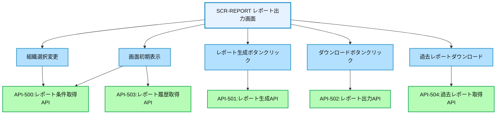
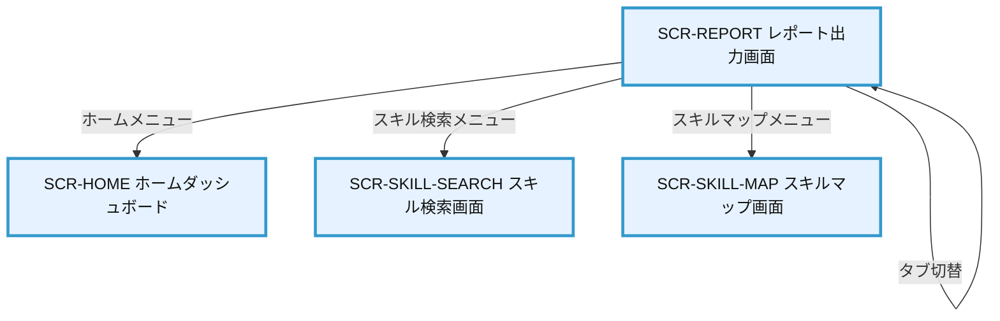

# 画面設計書：SCR-REPORT（レポート出力画面）

## 1. 画面基本情報

- **画面ID**：SCR-REPORT
- **画面名称**：レポート出力画面
- **画面の機能概要・目的**：  
  スキル情報や評価データを様々な切り口で集計・分析し、レポートとして出力する画面。個人・組織・スキル項目などの視点で統計情報を可視化し、人材育成や組織戦略の意思決定を支援する。
- **利用ユーザー・アクター**：上司・管理者・人事担当者
- **関連機能・仕様ID・機能ID**：F06 / PLT.1-WEB.1, PLT.1-RESP.1, PLT.2-ENC.1, ACC.1-ROLE.1, RPT.1-OUT.1
- **作成日**：2025/05/28
- **作成者**：システム設計担当
- **改訂履歴**：2025/05/28 初版作成

---

## 2. 画面レイアウト

- **画面イメージ・ワイヤーフレーム**
```
+------------------------------------------------------+
| [ロゴ] 年間スキル報告書システム    [ユーザー名▼] [🔔] |
+------------------------------------------------------+
| [サイドメニュー] | [レポート出力]                    |
| ┌─────────────┐ | ┌─────────────────────────────┐    |
| │ ホーム      │ | │ レポート種別                │    | ①
| │ プロフィール │ | │ [個人レポート] [組織レポート]  │    |
| │ スキル情報   │ | │ [スキル分布レポート] [推移レポート]│  |
| │ キャリアプラン│ | └─────────────────────────────┘    |
| │ 作業実績    │ | ┌─────────────────────────────┐    |
| │ 研修記録    │ | │ 出力条件                    │    | ②
| │ レポート    │ | │ 対象期間: [▼2025年度]        │    |
| │ 管理機能    │ | │ 組織: [▼選択してください]    │    |
| └─────────────┘ | │ 社員: [▼選択してください]    │    |
|                 | │ スキルカテゴリ: [▼選択]      │    |
|                 | │ 出力形式: [▼PDF] [▼A4]       │    |
|                 | │ [レポート生成]               │    |
|                 | └─────────────────────────────┘    |
|                 | ┌─────────────────────────────┐    |
|                 | │ レポートプレビュー           │    | ③
|                 | │ ┌─────────────────────────┐ │    |
|                 | │ │                         │ │    |
|                 | │ │ [レポートプレビュー表示領域]│ │    |
|                 | │ │                         │ │    |
|                 | │ │                         │ │    |
|                 | │ │                         │ │    |
|                 | │ │                         │ │    |
|                 | │ └─────────────────────────┘ │    |
|                 | │ [ダウンロード] [印刷]        │    |
|                 | └─────────────────────────────┘    |
|                 | ┌─────────────────────────────┐    |
|                 | │ 過去のレポート              │    | ④
|                 | │ ┌────────┬────────┬────────┐│    |
|                 | │ │日時    │種別    │ファイル ││    |
|                 | │ ├────────┼────────┼────────┤│    |
|                 | │ │2025/5/1│個人    │[PDF]   ││    |
|                 | │ │2025/4/1│組織    │[PDF]   ││    |
|                 | │ └────────┴────────┴────────┘│    |
|                 | └─────────────────────────────┘    |
+------------------------------------------------------+
|  © 2025 Example Corp.                                |
+------------------------------------------------------+
```
- **画面サイズ**：レスポンシブ（PC：横1200px基準、スマホ：100%）
- **UI/UX設計上の注意点**：
  - レポート種別タブで出力するレポートの種類を切り替え
  - 出力条件は選択したレポート種別に応じて動的に変更
  - レポートプレビューはPDF/Excel形式で表示
  - 過去に出力したレポートの履歴を表示し再ダウンロード可能
  - アクセシビリティ対応（キーボード操作・スクリーンリーダー対応）

---

## 3. 画面項目定義

| 項目ID | 項目名                | APIパラメータ対応           | データ型   | I/O区分 | 必須 | 備考                       |
|--------|----------------------|----------------------------|-----------|---------|------|----------------------------|
| ①      | レポート種別セクション | -                          | セクション | -       | -    | レポート種別選択エリア     |
| -      | 個人レポートタブ      | API-501.report_type="personal" | タブ    | 入力    | -    | 個人レポート選択タブ       |
| -      | 組織レポートタブ      | API-501.report_type="organization" | タブ | 入力    | -    | 組織レポート選択タブ       |
| -      | スキル分布レポートタブ | API-501.report_type="skill_distribution" | タブ | 入力 | -    | スキル分布レポート選択タブ |
| -      | 推移レポートタブ      | API-501.report_type="trend" | タブ      | 入力    | -    | 推移レポート選択タブ       |
| ②      | 出力条件セクション    | -                          | セクション | -       | -    | レポート出力条件入力エリア |
| -      | 対象期間選択          | API-501.period             | セレクト   | 入力    | ○    | 対象期間選択ドロップダウン |
| -      | 組織選択              | API-501.organization_id    | セレクト   | 入力    | △    | 組織選択ドロップダウン     |
| -      | 社員選択              | API-501.employee_id        | セレクト   | 入力    | △    | 社員選択ドロップダウン     |
| -      | スキルカテゴリ選択    | API-501.skill_category_id  | セレクト   | 入力    | △    | カテゴリ選択ドロップダウン |
| -      | 出力形式選択（ファイル形式）| API-501.format        | セレクト   | 入力    | ○    | PDF/Excel選択ドロップダウン|
| -      | 出力形式選択（用紙サイズ）| API-501.paper_size     | セレクト   | 入力    | ○    | A4/A3/Letter選択ドロップダウン|
| -      | レポート生成ボタン    | -                          | ボタン     | 入力    | -    | レポート生成実行ボタン     |
| ③      | レポートプレビューセクション | -                    | セクション | -       | -    | レポートプレビュー表示エリア |
| -      | プレビュー表示領域    | API-501.preview            | プレビュー | 出力    | -    | レポートプレビュー表示     |
| -      | ダウンロードボタン    | API-502                    | ボタン     | 入力    | -    | レポートダウンロードボタン |
| -      | 印刷ボタン            | -                          | ボタン     | 入力    | -    | レポート印刷ボタン         |
| ④      | 過去のレポートセクション | -                       | セクション | -       | -    | 過去レポート履歴表示エリア |
| -      | 過去レポート一覧      | API-503.history            | テーブル   | 出力    | -    | 過去レポート履歴一覧表示   |
| -      | 日時列                | API-503.history[].created_at | テキスト | 出力    | -    | 作成日時表示               |
| -      | 種別列                | API-503.history[].report_type | テキスト | 出力   | -    | レポート種別表示           |
| -      | ファイルリンク列      | API-503.history[].file_url | リンク     | 出力    | -    | ファイルダウンロードリンク |

---

## 4. 画面イベント・アクション定義

| イベントID | トリガー/アクション           | イベント内容・アクション詳細                                         | 紐付くAPI ID・名称      | メッセージ表示                       |
|------------|------------------------------|---------------------------------------------------------------------|------------------------|--------------------------------------|
| E01        | 画面初期表示                  | API-500呼出→レポート条件ドロップダウン初期化、API-503呼出→過去レポート履歴表示 | API-500, API-503 | エラー時：エラーメッセージ表示        |
| E02        | レポート種別タブクリック      | 選択したレポート種別に応じて出力条件項目の表示/非表示を切替           | -                      | -                                    |
| E03        | 組織選択変更                  | API-500呼出→選択組織に所属する社員リスト取得・表示                   | API-500                | -                                    |
| E04        | レポート生成ボタンクリック    | 入力値バリデーション→API-501呼出→レポートプレビュー表示              | API-501                | 成功/失敗メッセージ表示               |
| E05        | ダウンロードボタンクリック    | API-502呼出→レポートファイルダウンロード                            | API-502                | エラー時：エラーメッセージ表示        |
| E06        | 印刷ボタンクリック            | ブラウザ印刷ダイアログ表示                                          | -                      | -                                    |
| E07        | 過去レポートファイルリンククリック | API-504呼出→過去レポートファイルダウンロード                    | API-504                | エラー時：エラーメッセージ表示        |
| E08        | 入力エラー                    | 必須項目未入力・形式不正                                            | -                      | 「必須項目を入力してください」等      |

---

## 5. 画面イベント・API関連図（Mermaid）



---

## 6. 画面遷移図・フロー



---

## 7. メッセージ定義

| メッセージID | メッセージ内容                                  | 種別    | 表示タイミング           |
|--------------|-----------------------------------------------|---------|-------------------------|
| MSG01        | データの取得に失敗しました                      | エラー  | API呼出失敗時           |
| MSG02        | 必須項目を入力してください                      | エラー  | 必須項目未入力時        |
| MSG03        | レポートの生成に失敗しました                    | エラー  | レポート生成失敗時      |
| MSG04        | レポートを生成しました                          | 成功    | レポート生成成功時      |
| MSG05        | ファイルのダウンロードに失敗しました            | エラー  | ダウンロード失敗時      |
| MSG06        | 大量のデータを含むレポートのため、生成に時間がかかります | 警告    | 大量データ処理時        |

---

## 8. 入出力一覧

| 種別      | 名称           | 概要                         | アクセス方式 | 経由API（ID・名称・エンドポイント）         |
|-----------|----------------|------------------------------|--------------|--------------------------------------------|
| API       | API-500        | レポート条件取得API          | -            | /api/reports/conditions                    |
| API       | API-501        | レポート生成API              | -            | /api/reports/generate                      |
| API       | API-502        | レポート出力API              | -            | /api/reports/download                      |
| API       | API-503        | レポート履歴取得API          | -            | /api/reports/history                       |
| API       | API-504        | 過去レポート取得API          | -            | /api/reports/history/{id}                  |
| テーブル  | Organizations  | 組織マスタ                   | API経由      | API-500経由                                |
| テーブル  | Employees      | 社員情報                     | API経由      | API-500経由                                |
| テーブル  | SkillCategories| スキルカテゴリマスタ         | API経由      | API-500経由                                |
| テーブル  | EmployeeSkills | 社員スキル情報               | API経由      | API-501経由                                |
| テーブル  | ReportHistory  | レポート履歴                 | API経由      | API-503/504経由                            |
| ファイル  | PDF/Excel      | レポートファイル             | API経由      | API-502/504経由                            |

---

## 9. バックエンドAPIコール仕様（APIファースト設計）

### API-500 レポート条件取得API
- エンドポイント: `/api/reports/conditions`
- HTTPメソッド: GET
- リクエストパラメータ: organization_id (string, 任意)
- レスポンスパラメータ: periods (array), organizations (array), employees (array), skill_categories (array)
- ステータスコードとエラーケース: 200, 401, 403, 500
- 認証・認可要件: 認証済みユーザー、レポート出力権限
- 呼び出しタイミング: 画面初期表示時（E01）、組織選択変更時（E03）
- 備考: 組織選択時はその組織に所属する社員のみ返却

### API-501 レポート生成API
- エンドポイント: `/api/reports/generate`
- HTTPメソッド: POST
- リクエストパラメータ: report_type (string, 必須), period (string, 必須), organization_id (string, 条件付き必須), employee_id (string, 条件付き必須), skill_category_id (string, 条件付き必須), format (string, 必須), paper_size (string, 必須)
- レスポンスパラメータ: report_id (string), preview (string, Base64エンコード)
- ステータスコードとエラーケース: 200, 400, 401, 403, 500
- 認証・認可要件: 認証済みユーザー、レポート出力権限
- 呼び出しタイミング: レポート生成ボタンクリック時（E04）
- 備考: プレビュー用のレポートデータを返却

### API-502 レポート出力API
- エンドポイント: `/api/reports/download`
- HTTPメソッド: GET
- リクエストパラメータ: report_id (string, 必須)
- レスポンスパラメータ: ファイルダウンロード
- ステータスコードとエラーケース: 200, 400, 401, 403, 404, 500
- 認証・認可要件: 認証済みユーザー、レポート出力権限
- 呼び出しタイミング: ダウンロードボタンクリック時（E05）
- 備考: 生成済みレポートファイルをダウンロード

### API-503 レポート履歴取得API
- エンドポイント: `/api/reports/history`
- HTTPメソッド: GET
- リクエストパラメータ: limit (integer, 任意)
- レスポンスパラメータ: history (array of report history objects)
- ステータスコードとエラーケース: 200, 401, 403, 500
- 認証・認可要件: 認証済みユーザー、レポート出力権限
- 呼び出しタイミング: 画面初期表示時（E01）
- 備考: ユーザーが過去に出力したレポート履歴を返却

### API-504 過去レポート取得API
- エンドポイント: `/api/reports/history/{id}`
- HTTPメソッド: GET
- リクエストパラメータ: id (path parameter, 必須)
- レスポンスパラメータ: ファイルダウンロード
- ステータスコードとエラーケース: 200, 400, 401, 403, 404, 500
- 認証・認可要件: 認証済みユーザー、レポート出力権限
- 呼び出しタイミング: 過去レポートファイルリンククリック時（E07）
- 備考: 過去に生成したレポートファイルをダウンロード

---

## 10. オブジェクト構成・CRUD定義

- Organizations: R（API-500経由）
- Employees: R（API-500経由）
- SkillCategories: R（API-500経由）
- EmployeeSkills: R（API-501経由）
- ReportHistory: C, R（API-501/503/504経由）
- ReportFiles: C, R（API-501/502/504経由）

---

## 11. その他

- **アクセシビリティ要件**  
  - キーボード操作・スクリーンリーダー対応、コントラスト確保、ラベル付与
  - フォーム要素にはラベルと説明テキスト提供
  - プレビュー表示には代替テキスト提供
  - PDFプレビューはアクセシブルなPDF形式で表示

- **セキュリティ要件**  
  - レポート出力権限の厳格な検証
  - レポート出力操作の監査ログ記録
  - 出力レポートは権限に応じた範囲のみ表示（組織階層制限等）
  - CSRF対策、XSS対策
  - API呼出時のJWTトークン検証
  - ダウンロードファイルの一時URL有効期限設定

- **操作手順・利用ガイド**  
  - レポート種別タブで出力するレポートの種類を選択
  - 出力条件を入力し、レポート生成ボタンをクリック
  - プレビューを確認後、ダウンロードまたは印刷ボタンをクリック
  - 過去に出力したレポートは履歴から再ダウンロード可能

- **備考・補足**  
  - レポート種別によって必須となる出力条件が異なる
    - 個人レポート：社員選択が必須
    - 組織レポート：組織選択が必須
    - スキル分布レポート：スキルカテゴリ選択が必須
    - 推移レポート：対象期間の範囲指定が必須
  - 大量データを含むレポートは非同期処理で生成し、完了時に通知
  - レポートファイルは一定期間（30日間）保存後に自動削除
  - 将来的にはレポートテンプレートのカスタマイズ機能を追加予定
