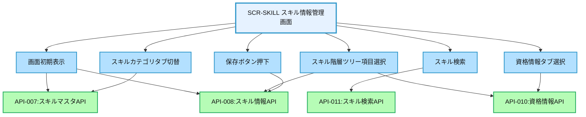
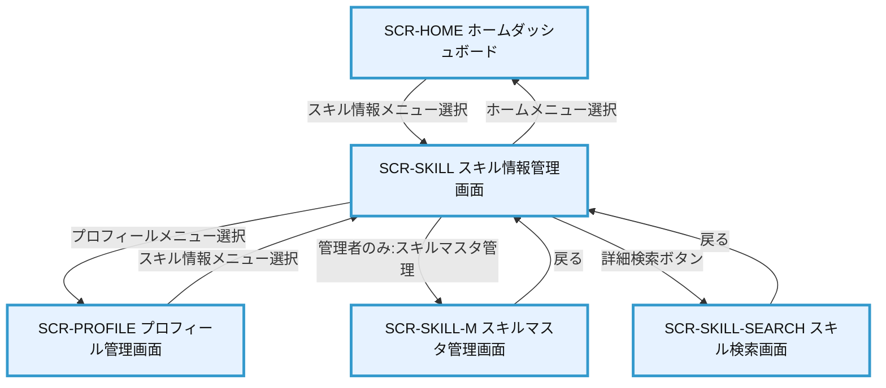

# 画面設計書：SCR-SKILL（スキル情報管理画面）

## 1. 画面基本情報

- **画面ID**：SCR-SKILL
- **画面名称**：スキル情報管理画面
- **画面の機能概要・目的**：  
  ユーザーの技術スキル・開発スキル・業務スキル・管理スキル・生産スキルを階層的に管理し、4段階評価（×/△/○/◎）で自己評価を行う画面。また、取得資格情報の登録・管理も行う。スキル情報は組織的な人材活用・育成戦略の基盤となるデータとして活用される。
- **利用ユーザー・アクター**：全ユーザー（社員・上司・人事・管理者）
- **関連機能・仕様ID・機能ID**：F05, F06, F07 / SKL.1-HIER.1, SKL.1-EVAL.1, SKL.1-MAINT.1, SKL.1-SRCH.1, SKL.2-MST.1, SKL.2-INP.1, SKL.2-EXP.1
- **作成日**：2025/05/28
- **作成者**：システム設計担当
- **改訂履歴**：2025/05/28 初版作成

---

## 2. 画面レイアウト

- **画面イメージ・ワイヤーフレーム**
```
+------------------------------------------------------+
|  [ヘッダー] ユーザー名 ▼ | 通知 | ログアウト         |
+------------------------------------------------------+
|  [サイドメニュー]  | [スキル情報管理]                |
|   ホーム          | +--------------------------------+
|   プロフィール    | | [技術スキル] [開発スキル] [業務スキル] | ①
|   スキル情報 ◀    | | [管理スキル] [生産スキル] [資格情報]   |
|   目標管理        | +--------------------------------+
|   作業実績        | | スキルカテゴリ検索: [_______] [検索] | ②
|   研修記録        | +--------------------------------+
|   レポート        | | スキル階層ツリー               | ③
|                   | | ├─ プログラミング言語         |
|                   | | │  ├─ Java                    |
|                   | | │  │  ├─ Java SE              |
|                   | | │  │  ├─ Java EE              |
|                   | | │  │  └─ Spring Framework     |
|                   | | │  ├─ JavaScript              |
|                   | | │  └─ Python                  |
|                   | | ├─ データベース               |
|                   | | └─ ...                        |
|                   | +--------------------------------+
|                   | | スキル詳細                     | ④
|                   | +--------------------------------+
|                   | | スキル名: Java SE              | ⑤
|                   | | カテゴリ: プログラミング言語   | ⑥
|                   | | 評価:  ○ × △ ○ ◎             | ⑦
|                   | | 習得日: [2024/05/10]           | ⑧
|                   | | 備考: [___________________]    | ⑨
|                   | +--------------------------------+
|                   | | 関連資格                       | ⑩
|                   | +--------------------------------+
|                   | | 資格名 | 取得日 | 有効期限 | スコア |
|                   | |--------|--------|----------|-------|
|                   | | Oracle Certified Professional | 2024/03/15 | 2027/03/14 | 750点 |
|                   | +--------------------------------+
|                   | | [キャンセル] [保存]            | ⑪
+------------------------------------------------------+
```
- **画面サイズ**：レスポンシブ（PC：横1000px基準、スマホ：100%）
- **UI/UX設計上の注意点**：
  - スキル階層ツリーは展開・折りたたみ可能
  - タブ切り替えでスキルカテゴリを切り替え
  - 評価は視覚的に分かりやすく（×/△/○/◎）
  - 資格の有効期限が近いものは警告表示
  - スキル検索は入力補完機能付き

---

## 3. 画面項目定義

| 項目ID | 項目名            | APIパラメータ対応           | データ型   | I/O区分 | 必須 | 備考                       |
|--------|-------------------|----------------------------|-----------|---------|------|----------------------------|
| ①      | スキルカテゴリタブ | API-008.skill_category     | タブ      | 入力    | -    | カテゴリ切替               |
| ②      | スキル検索        | API-011.keyword            | テキスト   | 入力    | -    | インクリメンタルサーチ     |
| ③      | スキル階層ツリー   | API-007.skill_hierarchy    | ツリー    | 出力    | -    | 3階層構造、展開・折りたたみ可 |
| ④      | スキル詳細セクション | -                        | セクション | -       | -    | 選択スキルの詳細表示       |
| ⑤      | スキル名          | API-008.skill_name         | テキスト   | 出力    | ○    | 選択したスキル名           |
| ⑥      | カテゴリ          | API-008.category           | テキスト   | 出力    | ○    | スキルのカテゴリ           |
| ⑦      | 評価              | API-008.level              | ラジオボタン | 入力   | ○    | ×/△/○/◎の4段階評価       |
| ⑧      | 習得日            | API-008.acquired_date      | 日付      | 入力    | -    | YYYY/MM/DD形式            |
| ⑨      | 備考              | API-008.remarks            | テキストエリア | 入力 | -    | 自由記述                   |
| ⑩      | 関連資格セクション | API-010.certifications     | テーブル   | 出力    | -    | 選択スキルに関連する資格   |
| ⑪      | 操作ボタン        | -                          | ボタン     | 入力    | -    | キャンセル・保存           |

---

## 4. 画面イベント・アクション定義

| イベントID | トリガー/アクション           | イベント内容・アクション詳細                                         | 紐付くAPI ID・名称      | メッセージ表示                       |
|------------|------------------------------|---------------------------------------------------------------------|------------------------|--------------------------------------|
| E01        | 画面初期表示                 | API-007呼出→スキル階層ツリー取得・表示<br>API-008呼出→ユーザースキル情報取得・表示 | API-007:スキルマスタAPI<br>API-008:スキル情報API | エラー時：取得エラーメッセージ |
| E02        | スキルカテゴリタブ切替       | 選択カテゴリに応じたスキルツリー表示                                 | API-007                | -                                    |
| E03        | スキル検索                   | API-011呼出→検索キーワードに合致するスキル抽出・ハイライト           | API-011:スキル検索API   | -                                    |
| E04        | スキル階層ツリー項目選択     | 選択スキルの詳細情報表示、関連資格表示                               | API-008, API-010       | -                                    |
| E05        | 評価ラジオボタン選択         | スキルレベル変更                                                    | -                      | -                                    |
| E06        | [保存]ボタン押下             | 入力値バリデーション→API-008呼出→保存成功時メッセージ表示            | API-008                | 成功時：「保存しました」<br>エラー時：エラーメッセージ |
| E07        | [キャンセル]ボタン押下       | 編集内容破棄確認→確認後に初期表示状態に戻す                          | -                      | 確認：「編集内容が破棄されますが、よろしいですか？」 |
| E08        | 資格情報タブ選択             | API-010呼出→ユーザー資格情報取得・表示                              | API-010:資格情報API     | -                                    |
| E09        | 資格追加ボタン押下           | 資格追加モーダル表示                                                | API-009, API-010       | -                                    |
| E10        | 資格編集ボタン押下           | 資格編集モーダル表示                                                | API-010                | -                                    |

---

## 5. 画面イベント・API関連図（Mermaid）



---

## 6. 画面遷移図・フロー



---

## 7. メッセージ定義

| メッセージID | メッセージ内容                                  | 種別    | 表示タイミング           |
|--------------|-----------------------------------------------|---------|-------------------------|
| MSG01        | スキル情報を保存しました                       | 成功    | 保存成功時              |
| MSG02        | スキル評価は必須です                           | エラー  | 入力バリデーション時    |
| MSG03        | 日付の形式が正しくありません                   | エラー  | 入力バリデーション時    |
| MSG04        | 編集内容が破棄されますが、よろしいですか？     | 確認    | キャンセルボタン押下時  |
| MSG05        | スキル情報の取得に失敗しました                 | エラー  | API通信エラー時         |
| MSG06        | 資格情報を保存しました                         | 成功    | 資格情報保存時          |
| MSG07        | 資格の有効期限が近づいています                 | 警告    | 有効期限30日以内の資格  |
| MSG08        | 検索結果はありません                           | 情報    | 検索結果0件時           |

---

## 8. 入出力一覧

| 種別      | 名称           | 概要                         | アクセス方式 | 経由API（ID・名称・エンドポイント）         |
|-----------|----------------|------------------------------|--------------|--------------------------------------------|
| テーブル  | MST_SkillHierarchy | スキル階層マスタ         | API経由      | API-007:スキルマスタAPI /api/skills/master |
| テーブル  | TRN_SkillRecord | ユーザースキル情報          | API経由      | API-008:スキル情報API /api/skills         |
| テーブル  | MST_Certification | 資格マスタ               | API経由      | API-009:資格マスタAPI /api/certifications/master |
| テーブル  | TRN_UserCertification | ユーザー資格情報      | API経由      | API-010:資格情報API /api/certifications   |
| テーブル  | SYS_SkillIndex | スキル検索インデックス       | API経由      | API-011:スキル検索API /api/skills/search  |

---

## 9. バックエンドAPIコール仕様（APIファースト設計）

### API-007 スキルマスタAPI
- エンドポイント: `/api/skills/master`
- HTTPメソッド: GET
- リクエストパラメータ: 
  - category: スキルカテゴリ（省略時は全カテゴリ）
  - parent_id: 親スキルID（省略時はトップレベル）
- レスポンスパラメータ: skill_hierarchy（スキル階層構造オブジェクト）
- ステータスコードとエラーケース: 200, 400, 500
- 認証・認可要件: 認証必須
- 呼び出しタイミング: 画面初期表示時、カテゴリタブ切替時
- 備考: 3階層構造（カテゴリ/サブカテゴリ/項目）

### API-008 スキル情報API
- エンドポイント: `/api/skills`
- HTTPメソッド: GET, POST, PUT
- リクエストパラメータ: 
  - GET: skill_id（省略時は全スキル）
  - POST/PUT: skill_id, level, acquired_date, remarks
- レスポンスパラメータ: skill_list（ユーザースキル情報リスト）
- ステータスコードとエラーケース: 200, 400, 403, 500
- 認証・認可要件: 認証必須、自分のスキルのみ編集可（上司・人事は閲覧可）
- 呼び出しタイミング: 画面初期表示時、スキル選択時、保存ボタン押下時
- 備考: 4段階評価（×/△/○/◎）

### API-009 資格マスタAPI
- エンドポイント: `/api/certifications/master`
- HTTPメソッド: GET
- リクエストパラメータ: 
  - keyword: 検索キーワード（省略時は全資格）
  - category: 資格カテゴリ（省略時は全カテゴリ）
- レスポンスパラメータ: cert_master_list（資格マスタリスト）
- ステータスコードとエラーケース: 200, 400, 500
- 認証・認可要件: 認証必須
- 呼び出しタイミング: 資格追加モーダル表示時
- 備考: 資格マスタにない資格は自由入力も可能

### API-010 資格情報API
- エンドポイント: `/api/certifications`
- HTTPメソッド: GET, POST, PUT, DELETE
- リクエストパラメータ: 
  - GET: cert_id（省略時は全資格）
  - POST/PUT: cert_id, cert_name, acquired_date, expire_date, score
- レスポンスパラメータ: cert_list（ユーザー資格情報リスト）
- ステータスコードとエラーケース: 200, 400, 403, 500
- 認証・認可要件: 認証必須、自分の資格のみ編集可
- 呼び出しタイミング: 資格情報タブ選択時、資格追加・編集時
- 備考: 有効期限のある資格は期限管理・通知

### API-011 スキル検索API
- エンドポイント: `/api/skills/search`
- HTTPメソッド: GET
- リクエストパラメータ: 
  - keyword: 検索キーワード（必須）
  - category: スキルカテゴリ（省略時は全カテゴリ）
- レスポンスパラメータ: search_result（検索結果リスト）
- ステータスコードとエラーケース: 200, 400, 500
- 認証・認可要件: 認証必須
- 呼び出しタイミング: 検索実行時
- 備考: インクリメンタルサーチ対応

---

## 10. オブジェクト構成・CRUD定義

- MST_SkillHierarchy: R（API-007経由）
- TRN_SkillRecord: C, R, U（API-008経由）
- MST_Certification: R（API-009経由）
- TRN_UserCertification: C, R, U, D（API-010経由）
- SYS_SkillIndex: R（API-011経由）

---

## 11. その他

- **アクセシビリティ要件**  
  - キーボード操作・スクリーンリーダー対応、ツリー構造のアクセシビリティ
  - 評価選択は色だけでなくテキスト（×/△/○/◎）も併記
  - タブ切替は適切なARIA属性付与
  - 階層構造は適切なマークアップでスクリーンリーダー対応

- **セキュリティ要件**  
  - 自分のスキル情報のみ編集可能（上司・人事は閲覧可）
  - 管理者のみスキルマスタ管理画面へのアクセス可
  - CSRF対策、入力値検証
  - 操作ログ記録

- **操作手順・利用ガイド**  
  - カテゴリタブで大分類を選択
  - スキル階層ツリーから評価したいスキルを選択
  - 評価レベル（×/△/○/◎）を選択し、必要に応じて習得日・備考を入力
  - 保存ボタンで確定
  - 資格情報タブでは資格の追加・編集・削除が可能
  - 検索機能で特定のスキルをすばやく見つけることが可能

- **備考・補足**  
  - スキル階層構造は管理者がメンテナンス（SCR-SKILL-M画面）
  - 評価基準の詳細説明をツールチップで表示
  - 将来拡張：チーム・部署単位でのスキルマップ表示
  - 将来拡張：前年比較グラフ表示
  - 将来拡張：推奨スキル・研修のレコメンド機能
