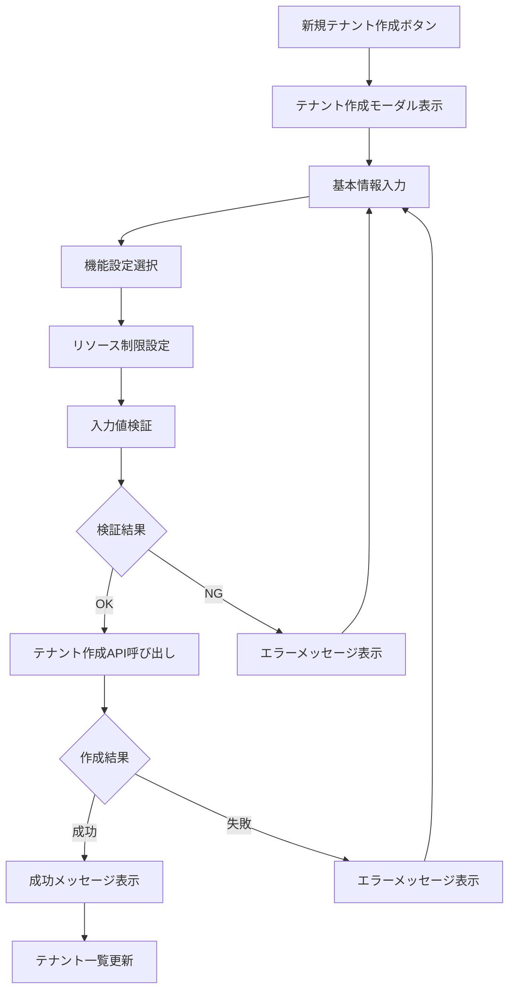
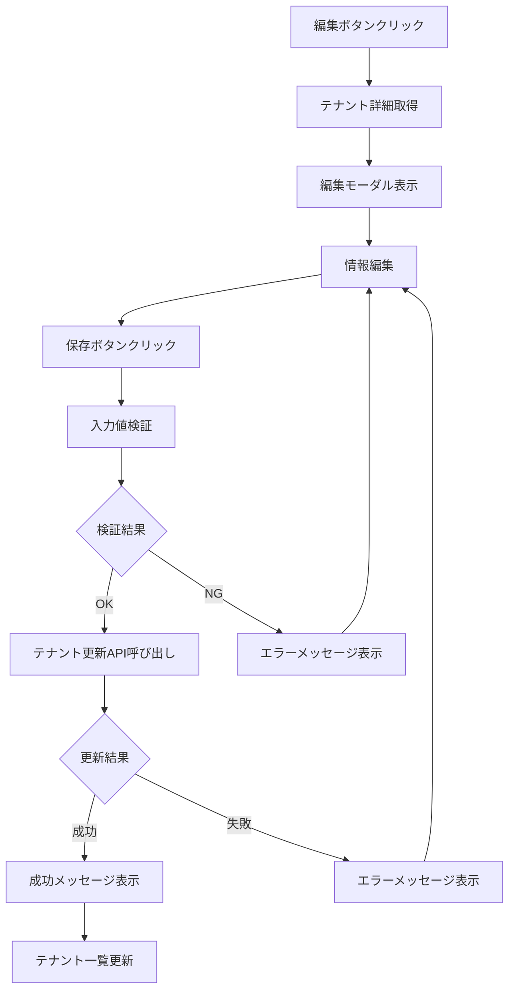

# 画面定義書 - SCR-TENANT-ADMIN テナント管理画面

## 基本情報

| 項目 | 内容 |
|------|------|
| 画面ID | SCR-TENANT-ADMIN |
| 画面名称 | テナント管理画面 |
| 機能カテゴリ | マルチテナント管理 |
| 主な利用者 | ホールディングス管理者 |
| 優先度 | 最高 |
| 作成日 | 2025-05-31 |
| 更新日 | 2025-05-31 |

## 画面概要

### 目的
- マルチテナント環境における各テナント（子会社・事業部）の管理
- テナントの作成、編集、削除、設定管理を行う
- テナント固有の設定やリソース制限の管理

### 主な機能
1. **テナント一覧表示**
   - 全テナントの一覧表示
   - テナント状態（アクティブ/非アクティブ）の表示
   - 検索・フィルタリング機能

2. **テナント作成**
   - 新規テナントの作成
   - 基本情報設定
   - 初期設定の適用

3. **テナント編集**
   - テナント基本情報の編集
   - 設定変更
   - リソース制限の調整

4. **テナント削除**
   - テナントの論理削除
   - データ保持期間の設定
   - 削除確認プロセス

5. **テナント設定管理**
   - 機能有効/無効の設定
   - カスタマイズ設定
   - 通知設定

## 画面レイアウト

### ヘッダー部
```
[ロゴ] 年間スキル報告書システム - テナント管理
                                    [ユーザー名] [ログアウト]
```

### ナビゲーション部
```
[ホーム] [テナント管理] [システム設定] [監査ログ]
```

### メイン部
```
┌─ テナント管理 ─────────────────────────────────────┐
│                                                    │
│ [新規テナント作成]                    [検索: ____] │
│                                                    │
│ ┌─ テナント一覧 ─────────────────────────────────┐ │
│ │ ID │ テナント名 │ 状態 │ 作成日 │ 最終更新 │ 操作 │ │
│ ├────┼──────────┼──────┼────────┼──────────┼──────┤ │
│ │001 │ 本社       │ 有効 │2025-01 │ 2025-05  │[編集]│ │
│ │002 │ 東京支社   │ 有効 │2025-02 │ 2025-05  │[編集]│ │
│ │003 │ 大阪支社   │ 無効 │2025-03 │ 2025-04  │[編集]│ │
│ └────────────────────────────────────────────────┘ │
│                                                    │
│ [1] [2] [3] ... [次へ]                             │
└────────────────────────────────────────────────────┘
```

### テナント詳細編集モーダル
```
┌─ テナント編集 ─────────────────────────────────────┐
│                                          [×]      │
│ ┌─ 基本情報 ─────────────────────────────────────┐ │
│ │ テナント名: [________________]                 │ │
│ │ 表示名:     [________________]                 │ │
│ │ 説明:       [________________]                 │ │
│ │ 状態:       [有効 ▼]                          │ │
│ └────────────────────────────────────────────────┘ │
│                                                    │
│ ┌─ 機能設定 ─────────────────────────────────────┐ │
│ │ □ スキル管理機能                               │ │
│ │ □ 目標管理機能                                 │ │
│ │ □ 作業実績管理機能                             │ │
│ │ □ 研修管理機能                                 │ │
│ │ □ レポート機能                                 │ │
│ └────────────────────────────────────────────────┘ │
│                                                    │
│ ┌─ リソース制限 ─────────────────────────────────┐ │
│ │ 最大ユーザー数: [____] 人                      │ │
│ │ ストレージ容量: [____] GB                      │ │
│ │ API呼び出し制限: [____] 回/日                  │ │
│ └────────────────────────────────────────────────┘ │
│                                                    │
│                              [キャンセル] [保存]   │
└────────────────────────────────────────────────────┘
```

## 画面項目定義

### テナント一覧

| 項目名 | 項目ID | 型 | 必須 | 最大長 | 説明 |
|--------|--------|----|----|--------|------|
| テナントID | tenant_id | 文字列 | ○ | 10 | システム内部ID |
| テナント名 | tenant_name | 文字列 | ○ | 50 | テナント識別名 |
| 表示名 | display_name | 文字列 | ○ | 100 | 画面表示用名称 |
| 状態 | status | 選択 | ○ | - | 有効/無効/停止中 |
| 作成日 | created_at | 日時 | ○ | - | テナント作成日時 |
| 最終更新日 | updated_at | 日時 | ○ | - | 最終更新日時 |

### テナント詳細設定

| 項目名 | 項目ID | 型 | 必須 | 説明 |
|--------|--------|----|----|------|
| 説明 | description | テキスト | - | テナントの説明 |
| 最大ユーザー数 | max_users | 数値 | ○ | 同時利用可能ユーザー数 |
| ストレージ容量 | storage_limit | 数値 | ○ | 利用可能ストレージ容量(GB) |
| API制限 | api_limit | 数値 | ○ | 1日あたりのAPI呼び出し制限 |

### 機能設定

| 項目名 | 項目ID | 型 | 必須 | 説明 |
|--------|--------|----|----|------|
| スキル管理機能 | enable_skill | 真偽値 | ○ | スキル管理機能の有効/無効 |
| 目標管理機能 | enable_goal | 真偽値 | ○ | 目標管理機能の有効/無効 |
| 作業実績管理機能 | enable_work | 真偽値 | ○ | 作業実績管理機能の有効/無効 |
| 研修管理機能 | enable_training | 真偽値 | ○ | 研修管理機能の有効/無効 |
| レポート機能 | enable_report | 真偽値 | ○ | レポート機能の有効/無効 |

## 操作フロー

### テナント作成フロー


### テナント編集フロー


## バリデーション

### 入力値検証
- **テナント名**: 必須、英数字とハイフンのみ、3-50文字
- **表示名**: 必須、1-100文字
- **最大ユーザー数**: 必須、1以上の整数
- **ストレージ容量**: 必須、1以上の整数
- **API制限**: 必須、100以上の整数

### 業務ルール検証
- テナント名の重複チェック
- 削除時の依存関係チェック（アクティブユーザーの存在確認）
- リソース制限の妥当性チェック

## エラーハンドリング

### エラーメッセージ一覧

| エラーコード | メッセージ | 対応方法 |
|-------------|-----------|----------|
| TENANT_001 | テナント名が重複しています | 別のテナント名を入力してください |
| TENANT_002 | 必須項目が入力されていません | 必須項目をすべて入力してください |
| TENANT_003 | テナントの削除に失敗しました | アクティブなユーザーが存在します |
| TENANT_004 | リソース制限値が不正です | 適切な値を入力してください |
| TENANT_005 | システムエラーが発生しました | しばらく時間をおいて再試行してください |

## セキュリティ要件

### 認証・認可
- ホールディングス管理者権限が必要
- セッション管理による認証状態の確認
- CSRF対策の実装

### データ保護
- テナント情報の暗号化保存
- 監査ログの記録
- 個人情報の適切な取り扱い

## パフォーマンス要件

- テナント一覧表示: 1秒以内
- テナント作成/更新: 3秒以内
- 検索・フィルタリング: 0.5秒以内
- ページング: 50件/ページ

## アクセシビリティ

- キーボード操作対応
- スクリーンリーダー対応
- 色覚障害者への配慮（色以外の情報提供）
- フォーカス表示の明確化

## 関連API

- `GET /api/v1/tenants` - テナント一覧取得
- `POST /api/v1/tenants` - テナント作成
- `GET /api/v1/tenants/{id}` - テナント詳細取得
- `PUT /api/v1/tenants/{id}` - テナント更新
- `DELETE /api/v1/tenants/{id}` - テナント削除

## 関連画面

- [SCR-TENANT-SELECT](画面定義書_SCR-TENANT-SELECT_テナント選択画面.md) - テナント選択画面
- [SCR-NOTIFY-ADMIN](画面定義書_SCR-NOTIFY-ADMIN_通知設定管理画面.md) - 通知設定管理画面
- [SCR-HOME](画面定義書_SCR-HOME_ホーム画面.md) - ホームダッシュボード

## 備考

- マルチテナント機能の中核となる重要な画面
- テナント作成時は初期データの自動生成を行う
- 削除は論理削除とし、物理削除は別途バッチ処理で実行
- 将来的にはテナント間のデータ移行機能も検討
