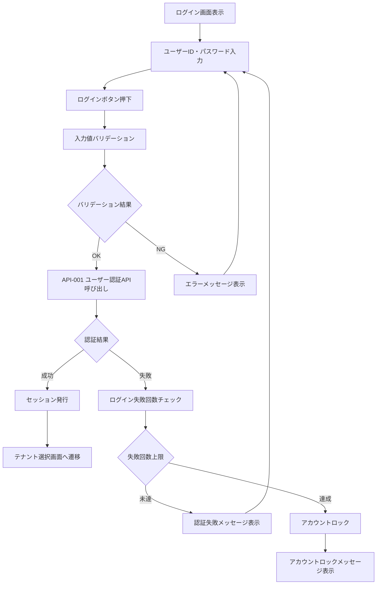
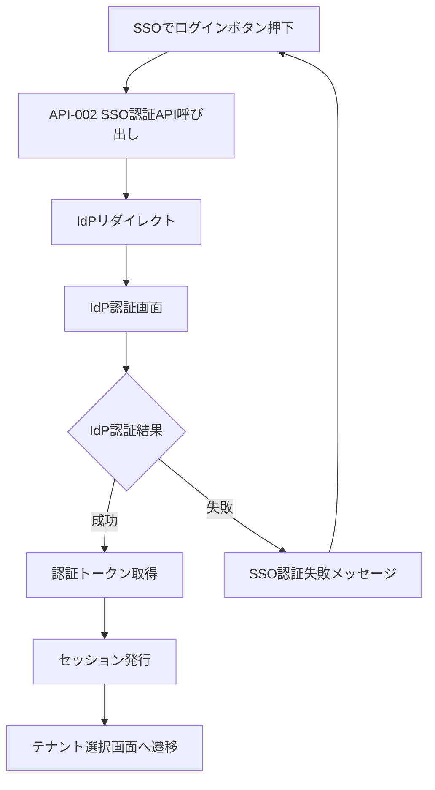

# 画面定義書 - SCR_AUT_Login ログイン画面

## 基本情報

| 項目 | 内容 |
|------|------|
| 画面ID | SCR_AUT_Login |
| 画面名称 | ログイン画面 |
| 機能カテゴリ | AUT（認証・認可） |
| 主な利用者 | 全ユーザー（社員・上司・人事・管理者） |
| 優先度 | 最高 |
| 作成日 | 2025-05-28 |
| 更新日 | 2025-06-01 |

## 画面概要

### 目的
システム利用者が安全かつ簡便にログイン認証を行う画面。ID/パスワード認証およびSSO（シングルサインオン）に対応。セキュアな認証基盤を提供し、業務システムの起点となる。

### 主な機能
1. **ID/パスワード認証**
   - ユーザーID（社員番号またはメール）とパスワードによる認証
   - パスワード表示/非表示の切り替え機能
   - 入力値のバリデーション

2. **SSO認証**
   - シングルサインオンによる認証
   - SAML/OIDC対応
   - IdP（Identity Provider）との連携

3. **セキュリティ機能**
   - アカウントロック機能
   - ログイン失敗回数の制限
   - 認証履歴の記録

4. **パスワードリセット**
   - パスワード忘れ時のリセット機能
   - セキュアなリセットプロセス

## 画面レイアウト

```
+------------------------------------------------------+
|  [会社ロゴ]   年間スキル報告書システム ログイン       |
+------------------------------------------------------+
|  ユーザーID [__________________________]             | ①
|  パスワード [__________________________]             | ②
|  [ ] パスワードを表示                                | ③
|                                                      |
|  [ ログイン ]                                       | ④
|                                                      |
|  [SSOでログイン]                                     | ⑤
|                                                      |
|  [パスワードを忘れた方はこちら]                      | ⑥
|                                                      |
|  (エラー時メッセージ表示エリア)                      | ⑦
+------------------------------------------------------+
|  © 2025 Example Corp.                                |
+------------------------------------------------------+
```

## 画面項目定義

| 項目ID | 項目名 | APIパラメータ対応 | データ型 | I/O区分 | 必須 | 備考 |
|--------|--------|------------------|----------|---------|------|------|
| ① | ユーザーID | API-001.user_id | テキスト | 入力 | ○ | 社員番号またはメール |
| ② | パスワード | API-001.password | パスワード | 入力 | ○ | 8文字以上 |
| ③ | パスワード表示 | - | チェックBOX | 入力 | - | 入力時マスク/表示切替 |
| ④ | ログインボタン | API-001（POST） | ボタン | 入力 | - | 必須項目入力後のみ活性 |
| ⑤ | SSOログイン | API-002（GET） | ボタン | 入力 | - | SSO連携設定時のみ表示 |
| ⑥ | パスワードリセット | - | リンク | 入力 | - | パスワードリセット画面へ |
| ⑦ | エラーメッセージ | API-001/002エラー応答 | ラベル | 出力 | - | 入力エラー・認証失敗時 |

## 操作フロー

### ログイン認証フロー


### SSO認証フロー


## イベント・アクション定義

| イベントID | トリガー/アクション | イベント内容・アクション詳細 | 紐付くAPI ID・名称 | メッセージ表示 |
|------------|-------------------|---------------------------|------------------|---------------|
| E01 | [ログイン]ボタン押下 | 入力値バリデーション→API-001呼出→認証成功時はSCR_TEN_Selectへ遷移 | API-001:ユーザー認証API | エラー時：エラーメッセージ表示 |
| E02 | [SSOでログイン]ボタン押下 | API-002呼出（IdPリダイレクト）→認証成功時はSCR_TEN_Selectへ遷移 | API-002:SSO認証API | エラー時：エラーメッセージ表示 |
| E03 | [パスワード表示]チェック | パスワード入力欄の表示/非表示切替 | - | |
| E04 | [パスワードを忘れた方はこちら] | パスワードリセット画面へ遷移 | - | |
| E05 | Enterキー押下 | ログインボタン押下と同等処理 | API-001 | |
| E06 | 入力エラー | 必須項目未入力・形式不正・認証失敗 | API-001/002 | エラーメッセージ表示 |
| E07 | ログイン成功 | セッション発行・ユーザー権限取得・SCR_TEN_Selectへ遷移 | API-001/002 | |
| E08 | ログイン失敗 | エラーメッセージ表示・パスワード再入力促す | API-001/002 | 「ユーザーIDまたはパスワードが違います」 |
| E09 | アカウントロック | ログイン失敗回数上限超過 | API-001/002 | 「アカウントがロックされました」 |

## バリデーション

### 入力値検証
- **ユーザーID**: 必須、英数字・記号、最大50文字
- **パスワード**: 必須、8文字以上、英数字・記号組み合わせ
- **特殊文字**: SQLインジェクション対策

### 業務ルール検証
- ログイン失敗回数の上限チェック（5回）
- アカウントロック状態の確認
- パスワード有効期限の確認

## エラーハンドリング

### エラーメッセージ一覧

| メッセージID | メッセージ内容 | 種別 | 表示タイミング |
|-------------|---------------|------|---------------|
| MSG01 | ユーザーIDまたはパスワードが違います | エラー | 認証失敗時 |
| MSG02 | 必須項目が入力されていません | エラー | 入力バリデーション時 |
| MSG03 | アカウントがロックされました。管理者に連絡してください | エラー | ログイン失敗上限時 |
| MSG04 | システム障害が発生しました。再度お試しください | エラー | システム例外時 |

## セキュリティ要件

### 認証・認可
- パスワードのハッシュ化保存
- セッション管理による認証状態の確認
- CSRF対策の実装
- TLS通信の必須化

### データ保護
- ログイン履歴の記録
- 不正アクセス試行の検知・記録
- パスワードマスク表示
- ペースト禁止設定

## パフォーマンス要件

- ログイン処理: 2秒以内
- SSO認証処理: 3秒以内
- 画面表示: 1秒以内

## アクセシビリティ

- キーボード操作対応（Tab、Enter）
- スクリーンリーダー対応
- 高コントラスト表示対応
- フォーカス表示の明確化
- ラベル付与の徹底

## レスポンシブデザイン

### デスクトップ（1200px以上）
- 中央配置レイアウト
- 横800px基準

### タブレット（768px-1199px）
- 中央配置レイアウト
- 画面幅に応じた調整

### モバイル（767px以下）
- 全幅レイアウト
- タップしやすいボタンサイズ

## 関連API

- `POST /api/auth/login` - ユーザー認証API
- `GET /api/auth/sso` - SSO認証API
- `POST /api/auth/logout` - ログアウトAPI
- `POST /api/auth/password-reset` - パスワードリセットAPI

## 関連画面

- [SCR_TEN_Select](画面定義書_SCR_TEN_Select_テナント選択画面.md) - テナント選択画面
- [SCR_CMN_Home](画面定義書_SCR_CMN_Home_ホームダッシュボード画面.md) - ホームダッシュボード画面
- パスワードリセット画面（未定義）

## 特記事項

### SSO設定
- SSO未設定時は「SSOでログイン」ボタンを非表示
- SAML/OIDC/代理認証等の方式に対応
- IdP設定はシステム管理者が行う

### 多要素認証（MFA）
- 将来的な拡張として設計上考慮
- SMS認証、アプリ認証等の追加予定

### 監査証跡
- 全認証トランザクションを記録
- ログイン成功/失敗の履歴管理
- セキュリティ監査への対応

## 備考

- マルチテナント環境の認証起点となる重要な画面
- セキュリティを最優先とした設計
- ユーザビリティとセキュリティのバランスを重視
- 将来的な認証方式拡張に対応可能な設計