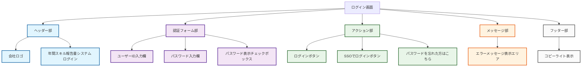
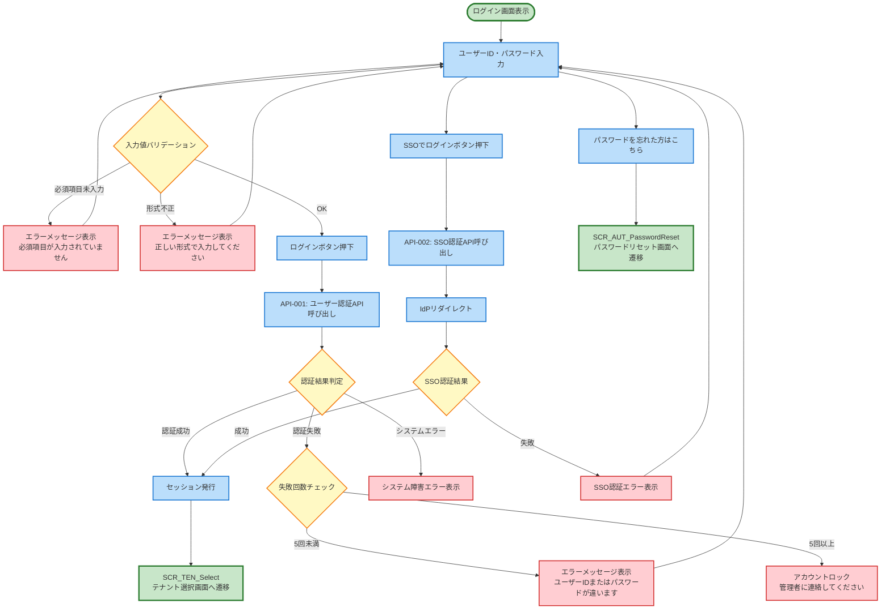
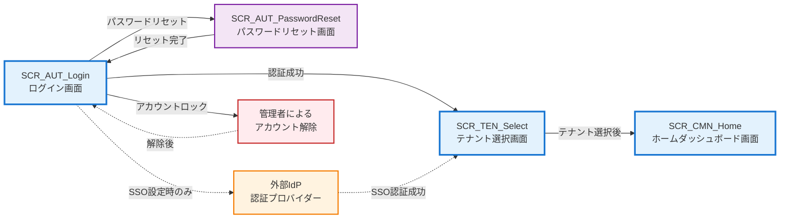
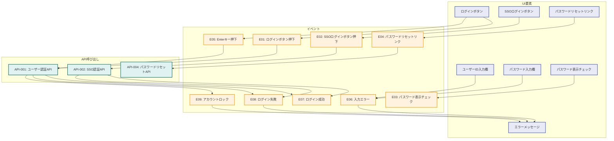
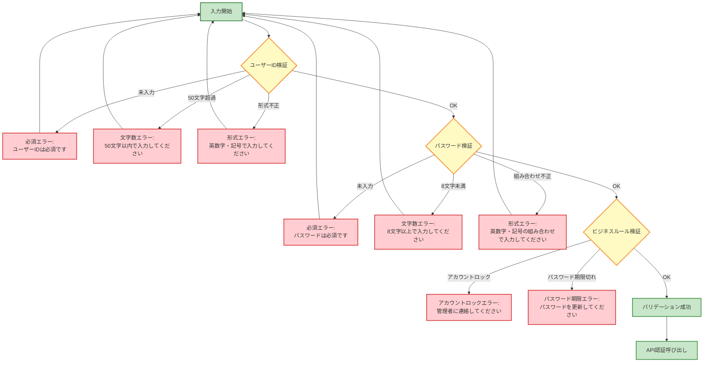

# 画面定義書: SCR_AUT_Login - Mermaid図

## 画面レイアウト

## 操作フロー

## ナビゲーションフロー

## 画面項目とイベントの関係図

## バリデーションフロー

---

## 図の説明

### 1. 画面レイアウト図
- ログイン画面の構成要素を階層構造で表現
- 各セクション（ヘッダー、フォーム、アクション、メッセージ、フッター）とその内容を視覚化
- 色分けにより各セクションの役割を明確化

### 2. 操作フロー図
- ユーザーの操作から画面遷移までの完全なフローを表現
- 通常ログイン、SSO、パスワードリセットの3つの主要パスを含む
- エラーハンドリングと復帰フローも詳細に記載

### 3. ナビゲーションフロー図
- 画面間の遷移関係を表現
- 条件付き遷移（SSO設定時、アカウントロック時）も含む
- システム全体での画面の位置づけを明確化

### 4. 画面項目とイベントの関係図
- UI要素、イベント、API呼び出しの関係を表現
- 画面定義書のイベント・アクション定義との対応を視覚化

### 5. バリデーションフロー図
- 入力値検証の詳細なフローを表現
- フィールドレベル、ビジネスルールレベルの検証を段階的に表示
- エラーメッセージとの対応も明確化

これらのMermaid図により、画面定義書の内容をより視覚的に理解しやすくなります。
