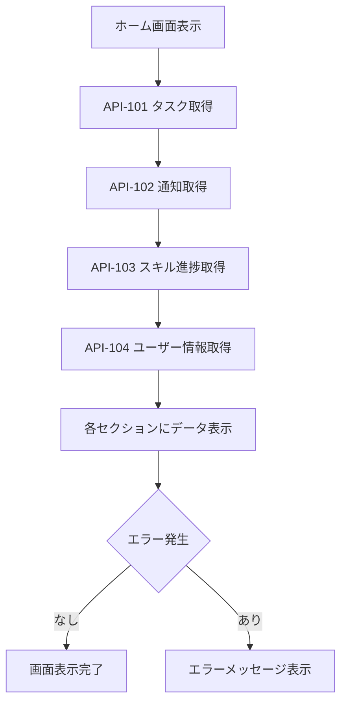
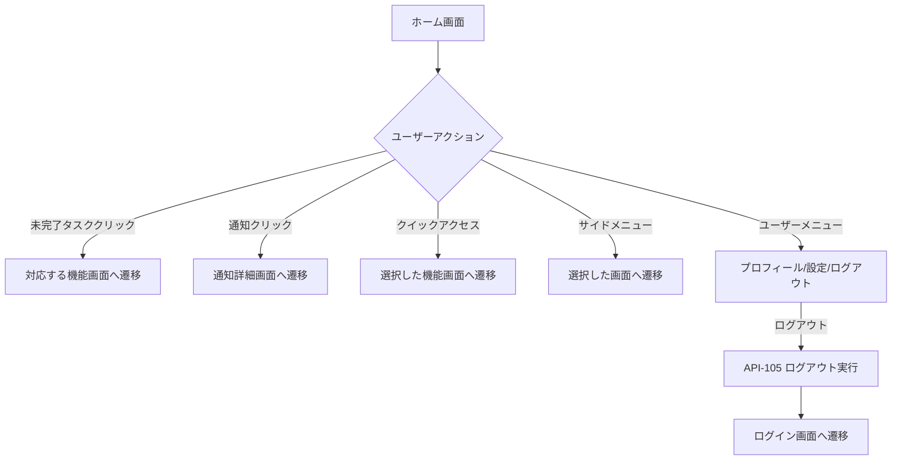

# 画面定義書 - SCR_CMN_Home ホームダッシュボード画面

## 基本情報

| 項目 | 内容 |
|------|------|
| 画面ID | SCR_CMN_Home |
| 画面名称 | ホームダッシュボード画面 |
| 機能カテゴリ | CMN（共通基盤） |
| 主な利用者 | 全ユーザー（社員・上司・人事・管理者） |
| 優先度 | 高 |
| 作成日 | 2025-05-28 |
| 更新日 | 2025-06-01 |

## 画面概要

### 目的
ログイン後の最初の画面として、ユーザーに必要な情報を一覧表示するダッシュボード。各種通知・進捗サマリ・ショートカットを提供し、システム内の主要機能へのアクセスポイントとなる。

### 主な機能
1. **未完了タスク表示**
   - ユーザーの未完了タスク一覧表示
   - タスクの優先度順表示
   - 対応する機能画面への直接遷移

2. **お知らせ・通知表示**
   - システム通知・個人通知の表示
   - 未読通知数のバッジ表示
   - 通知詳細への遷移

3. **クイックアクセス**
   - 主要機能へのショートカット
   - ユーザー権限に応じた機能表示
   - ワンクリックでの機能アクセス

4. **スキル達成状況**
   - スキル達成度の可視化
   - グラフ・チャート表示
   - 進捗状況の把握

5. **ナビゲーション**
   - サイドメニューによる画面遷移
   - ユーザーメニューの提供
   - ログアウト機能

## 画面レイアウト

```
+------------------------------------------------------+
| [ロゴ] 年間スキル報告書システム    [ユーザー名▼] [🔔] |
+------------------------------------------------------+
| [サイドメニュー] | [ようこそ、{ユーザー名}さん]      |
| ┌─────────────┐ | ┌─────────────────────────────┐    |
| │ ホーム      │ | │ 未完了タスク (3)            │    | ①
| │ プロフィール │ | │ ・スキル情報の更新          │    |
| │ スキル情報   │ | │ ・目標設定の承認           │    |
| │ キャリアプラン│ | │ ・研修参加記録の入力       │    |
| │ 作業実績    │ | └─────────────────────────────┘    |
| │ 研修記録    │ | ┌─────────────────────────────┐    |
| │ レポート    │ | │ お知らせ・通知 (5)          │    | ②
| │ 管理機能    │ | │ ・[NEW] システムメンテナンス │    |
| └─────────────┘ | │ ・[NEW] 四半期レビュー開始   │    |
|                 | │ ・資格更新リマインダー       │    |
|                 | │ ・[すべて表示]               │    |
|                 | └─────────────────────────────┘    |
|                 | ┌─────────────────────────────┐    |
|                 | │ クイックアクセス            │    | ③
|                 | │ [スキル入力] [目標設定]      │    |
|                 | │ [作業実績] [研修記録]        │    |
|                 | └─────────────────────────────┘    |
|                 | ┌─────────────────────────────┐    |
|                 | │ スキル達成状況              │    | ④
|                 | │ [グラフ/チャート表示]        │    |
|                 | │                             │    |
|                 | └─────────────────────────────┘    |
+------------------------------------------------------+
|  © 2025 Example Corp.                                |
+------------------------------------------------------+
```

## 画面項目定義

| 項目ID | 項目名 | APIパラメータ対応 | データ型 | I/O区分 | 必須 | 備考 |
|--------|--------|------------------|----------|---------|------|------|
| ① | 未完了タスク | API-101.tasks | リスト | 出力 | - | ユーザーの未完了タスク一覧 |
| ② | お知らせ・通知 | API-102.notifications | リスト | 出力 | - | システム通知・個人通知 |
| ③ | クイックアクセス | - | ボタン群 | 入力 | - | 主要機能へのショートカット |
| ④ | スキル達成状況 | API-103.skill_progress | グラフ | 出力 | - | スキル達成度の可視化 |
| - | ユーザー名表示 | API-104.user_info.name | テキスト | 出力 | - | ヘッダー部のユーザー表示 |
| - | 通知アイコン | API-102.unread_count | アイコン | 出力 | - | 未読通知数をバッジ表示 |
| - | サイドメニュー | - | メニュー | 入力 | - | 主要画面へのナビゲーション |

## 操作フロー

### 画面初期表示フロー


### ナビゲーションフロー


## イベント・アクション定義

| イベントID | トリガー/アクション | イベント内容・アクション詳細 | 紐付くAPI ID・名称 | メッセージ表示 |
|------------|-------------------|---------------------------|------------------|---------------|
| E01 | 画面初期表示 | API-101/102/103/104呼出→各セクションにデータ表示 | API-101/102/103/104 | エラー時：エラーメッセージ表示 |
| E02 | 未完了タスク項目クリック | 対応する機能画面へ遷移（スキル情報/目標設定/研修記録等） | - | - |
| E03 | [すべて表示]リンククリック | SCR_NTF_Alert（通知・アラート画面）へ遷移 | - | - |
| E04 | クイックアクセスボタンクリック | 対応する機能画面へ遷移 | - | - |
| E05 | サイドメニュー項目クリック | 選択した機能画面へ遷移 | - | - |
| E06 | ユーザー名ドロップダウンクリック | ユーザーメニュー表示（プロフィール/設定/ログアウト等） | - | - |
| E07 | 通知アイコンクリック | 通知ポップアップ表示 | API-102 | - |
| E08 | 通知項目クリック | 対応する詳細画面へ遷移 | - | - |
| E09 | ログアウト選択 | セッション破棄→SCR_AUT_Loginへ遷移 | API-105 | - |

## バリデーション

### 業務ルール検証
- セッション有効性の確認
- ユーザー権限に応じた表示制御
- データ取得時のエラーハンドリング

## エラーハンドリング

### エラーメッセージ一覧

| メッセージID | メッセージ内容 | 種別 | 表示タイミング |
|-------------|---------------|------|---------------|
| MSG01 | データの取得に失敗しました | エラー | API呼出失敗時 |
| MSG02 | セッションが切れました。再ログインしてください | エラー | セッションタイムアウト時 |
| MSG03 | 〇件の未完了タスクがあります | 警告 | 未完了タスク存在時 |
| MSG04 | 〇件の未読通知があります | 情報 | 未読通知存在時 |

## セキュリティ要件

### 認証・認可
- 認証済みセッション必須
- ユーザー権限に応じた表示制御（RBAC）
- API呼出時のJWTトークン検証

### データ保護
- CSRF対策の実装
- XSS対策の実装
- セッション管理の適切な実装

## パフォーマンス要件

- 画面初期表示: 2秒以内
- API呼び出し: 1秒以内
- 画面遷移: 1秒以内

## アクセシビリティ

- キーボード操作・スクリーンリーダー対応
- WAI-ARIA準拠のダッシュボードコンポーネント
- グラフ・チャートには代替テキスト提供
- コントラスト確保、ラベル付与

## レスポンシブデザイン

### デスクトップ（1200px以上）
- サイドメニュー + メインコンテンツレイアウト
- 4つのセクションを2×2で配置

### タブレット（768px-1199px）
- 折りたたみ可能なサイドメニュー
- カード型レイアウトに変更

### モバイル（767px以下）
- ハンバーガーメニュー
- 縦積みカードレイアウト

## 関連API

- `GET /api/tasks` - タスク取得API
- `GET /api/notifications` - 通知取得API
- `GET /api/skills/progress` - スキル進捗API
- `GET /api/users/me` - ユーザー情報API
- `POST /api/auth/logout` - ログアウトAPI

## 関連画面

- [SCR_AUT_Login](画面定義書_SCR_AUT_Login_ログイン画面.md) - ログイン画面
- [SCR_TEN_Select](画面定義書_SCR_TEN_Select_テナント選択画面.md) - テナント選択画面
- [SCR_PRF_Profile](画面定義書_SCR_PRF_Profile_プロフィール管理画面.md) - プロフィール管理画面
- [SCR_SKL_Info](画面定義書_SCR_SKL_Info_スキル情報管理画面.md) - スキル情報管理画面
- [SCR_CAR_Plan](画面定義書_SCR_CAR_Plan_キャリアプラン画面.md) - キャリアプラン画面
- [SCR_WRK_Input](画面定義書_SCR_WRK_Input_作業実績入力画面.md) - 作業実績入力画面
- [SCR_TRN_Record](画面定義書_SCR_TRN_Record_研修参加記録画面.md) - 研修参加記録画面
- [SCR_RPT_Output](画面定義書_SCR_RPT_Output_レポート出力画面.md) - レポート出力画面
- [SCR_ADM_System](画面定義書_SCR_ADM_System_システム管理画面.md) - システム管理画面
- [SCR_NTF_Alert](画面定義書_SCR_NTF_Alert_通知アラート画面.md) - 通知アラート画面

## 特記事項

### ユーザー権限による表示制御
- **社員**: 基本的なタスクとスキル情報を表示
- **上司**: 部下の進捗状況も表示
- **人事**: 組織全体の統計情報を表示
- **管理者**: システム管理機能へのアクセスを表示

### ダッシュボードカスタマイズ
- ユーザー権限によってレイアウトを動的変更
- 管理者向けには追加の管理機能ショートカットを表示
- 将来的にはウィジェットのユーザーカスタマイズ機能を検討

### データ更新
- リアルタイム通知の受信
- 定期的なデータ更新（5分間隔）
- 手動更新機能の提供

## 備考

- システムの中核となるダッシュボード画面
- ユーザビリティを最優先とした設計
- スキル達成状況グラフは四半期ごとの推移を可視化
- 将来的な機能拡張に対応可能な柔軟な設計