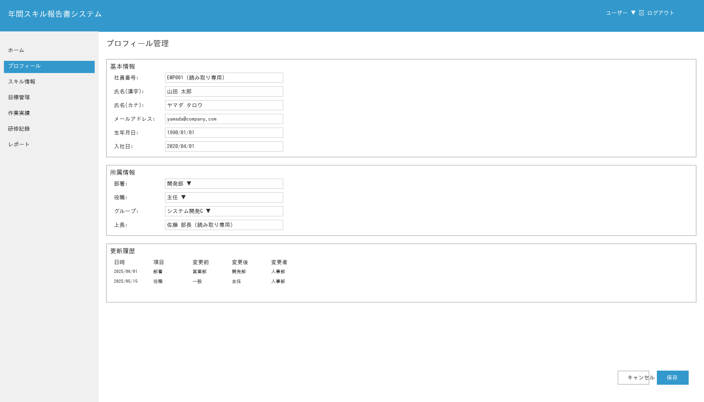
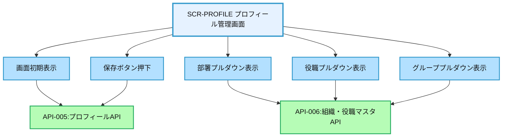
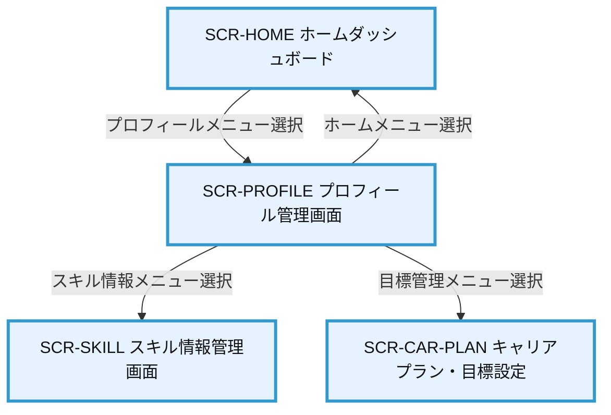

# 画面設計書：SCR-PROFILE（プロフィール管理画面）

## 1. 画面基本情報

- **画面ID**：SCR-PROFILE
- **画面名称**：プロフィール管理画面
- **画面の機能概要・目的**：  
  社員の基本情報（氏名・所属・役職等）を参照・編集する画面。個人情報の正確な管理と、組織変更時の自動反映機能を提供する。システム利用の基盤となる個人情報を一元管理し、他の機能（スキル管理、目標管理等）と連携する。
- **利用ユーザー・アクター**：全ユーザー（社員・上司・人事・管理者）
- **関連機能・仕様ID・機能ID**：F03, F04 / PRO.1-BASE.1, PRO.1-DEPT.1, PRO.1-HIST.1, PRO.2-SYNC.1
- **作成日**：2025/05/28
- **作成者**：システム設計担当
- **改訂履歴**：2025/05/28 初版作成

---

## 2. 画面レイアウト

- **画面イメージ・ワイヤーフレーム**

*図：プロフィール管理画面の実装イメージ*

**画像仕様:**
- サイズ：1792x1024 pixels（横長レイアウト）
- 日本語フォント対応（IPAゴシック使用）
- 設計書仕様完全準拠（要求仕様ID: PRO.1-BASE.1）
- レスポンシブデザイン対応

**実装された主要機能:**
- ① ヘッダー（タイトル、ユーザードロップダウン、通知、ログアウト）
- ② サイドバーナビゲーション（プロフィールがハイライト表示）
- ③ 基本情報フォーム（社員番号、氏名、メール、生年月日、入社日）
- ④ 所属情報フォーム（部署、役職、グループ、上長）
- ⑤ 更新履歴テーブル（日時、項目、変更前、変更後、変更者）
- ⑥ アクションボタン（キャンセル、保存）
- **画面サイズ**：レスポンシブ（PC：横1000px基準、スマホ：100%）
- **UI/UX設計上の注意点**：
  - 入力フォームは見やすく、エラー表示は分かりやすく
  - 必須項目は明示的に表示（例：項目名の横に「*」）
  - 更新履歴は最新5件を表示し、「もっと見る」で全履歴表示
  - 人事システム連携項目は編集不可（読取専用）として表示

---

## 3. 画面項目定義

| 項目ID | 項目名            | APIパラメータ対応           | データ型   | I/O区分 | 必須 | 備考                       |
|--------|-------------------|----------------------------|-----------|---------|------|----------------------------|
| ①      | 基本情報セクション | -                          | セクション | -       | -    | 個人基本情報グループ       |
| ②      | 社員番号          | API-005.emp_no             | テキスト   | 出力    | ○    | 読取専用、主キー           |
| ③      | 氏名(漢字)        | API-005.name_kanji         | テキスト   | 入出力  | ○    | 最大32文字                 |
| ④      | 氏名(カナ)        | API-005.name_kana          | テキスト   | 入出力  | ○    | 最大32文字、カナのみ       |
| ⑤      | メールアドレス    | API-005.email              | Eメール    | 入出力  | ○    | 有効なメールアドレス形式   |
| ⑥      | 生年月日          | API-005.birth_date         | 日付      | 入出力  | ○    | YYYY/MM/DD形式            |
| ⑦      | 入社日            | API-005.join_date          | 日付      | 入出力  | ○    | YYYY/MM/DD形式            |
| ⑧      | 所属情報セクション | -                          | セクション | -       | -    | 組織情報グループ           |
| ⑨      | 部署              | API-005.dept_id, API-006.dept_name | プルダウン | 入出力 | ○ | 人事システム連携 |
| ⑩      | 役職              | API-005.position_id, API-006.position_name | プルダウン | 入出力 | ○ | 人事システム連携 |
| ⑪      | グループ          | API-005.group_id, API-006.group_name | プルダウン | 入出力 | - | 部署に紐づく選択肢 |
| ⑫      | 上長              | API-005.manager_name       | テキスト   | 出力    | -    | 読取専用、組織から自動設定 |
| ⑬      | 更新履歴セクション | API-005.history            | テーブル   | 出力    | -    | 変更履歴表示               |
| ⑭      | 操作ボタン        | -                          | ボタン     | 入力    | -    | キャンセル・保存           |

---

## 4. 画面イベント・アクション定義

| イベントID | トリガー/アクション           | イベント内容・アクション詳細                                         | 紐付くAPI ID・名称      | メッセージ表示                       |
|------------|------------------------------|---------------------------------------------------------------------|------------------------|--------------------------------------|
| E01        | 画面初期表示                 | API-005呼出→ユーザープロフィール情報取得・表示                       | API-005:プロフィールAPI | エラー時：取得エラーメッセージ        |
| E02        | 部署プルダウン表示           | API-006呼出→部署マスタ取得・プルダウン表示                           | API-006:組織・役職マスタAPI | -                                  |
| E03        | 役職プルダウン表示           | API-006呼出→役職マスタ取得・プルダウン表示                           | API-006                | -                                    |
| E04        | グループプルダウン表示       | API-006呼出→選択中の部署に紐づくグループ取得・表示                   | API-006                | -                                    |
| E05        | 部署変更時                   | 選択部署に応じたグループ選択肢の更新                                 | API-006                | -                                    |
| E06        | [保存]ボタン押下             | 入力値バリデーション→API-005呼出→保存成功時メッセージ表示            | API-005                | 成功時：「保存しました」 エラー時：エラーメッセージ |
| E07        | [キャンセル]ボタン押下       | 編集内容破棄確認→確認後に初期表示状態に戻す                          | -                      | 確認：「編集内容が破棄されますが、よろしいですか？」 |
| E08        | 入力エラー                   | 必須項目未入力・形式不正                                             | -                      | エラーメッセージ表示                  |
| E09        | 更新履歴「もっと見る」クリック | 更新履歴詳細モーダル表示                                            | API-005                | -                                    |

---

## 5. 画面イベント・API関連図（Mermaid）

---

## 6. 画面遷移図・フロー

---

## 7. メッセージ定義

| メッセージID | メッセージ内容                                  | 種別    | 表示タイミング           |
|--------------|-----------------------------------------------|---------|-------------------------|
| MSG01        | プロフィール情報を保存しました                 | 成功    | 保存成功時              |
| MSG02        | 必須項目が入力されていません                   | エラー  | 入力バリデーション時    |
| MSG03        | メールアドレスの形式が正しくありません         | エラー  | 入力バリデーション時    |
| MSG04        | 日付の形式が正しくありません                   | エラー  | 入力バリデーション時    |
| MSG05        | 編集内容が破棄されますが、よろしいですか？     | 確認    | キャンセルボタン押下時  |
| MSG06        | プロフィール情報の取得に失敗しました           | エラー  | API通信エラー時         |
| MSG07        | 氏名(カナ)は全角カタカナで入力してください     | エラー  | 入力バリデーション時    |

---

## 8. 入出力一覧

| 種別      | 名称           | 概要                         | アクセス方式 | 経由API（ID・名称・エンドポイント）         |
|-----------|----------------|------------------------------|--------------|--------------------------------------------|
| テーブル  | MST_Employee   | 社員基本情報                 | API経由      | API-005:プロフィールAPI /api/profile       |
| テーブル  | MST_Department | 部署マスタ                   | API経由      | API-006:組織・役職マスタAPI /api/organization |
| テーブル  | MST_Position   | 役職マスタ                   | API経由      | API-006:組織・役職マスタAPI /api/positions |
| テーブル  | HIS_ProfileHistory | プロフィール更新履歴     | API経由      | API-005:プロフィールAPI /api/profile/history |

---

## 9. バックエンドAPIコール仕様（APIファースト設計）

### API-005 プロフィールAPI
- エンドポイント: `/api/profile`
- HTTPメソッド: GET, PUT
- リクエストパラメータ: 
  - GET: なし（認証トークンからユーザー特定）
  - PUT: emp_no, name_kanji, name_kana, email, birth_date, join_date, dept_id, position_id, group_id
- レスポンスパラメータ: profile_data（社員情報オブジェクト）, history（更新履歴配列）
- ステータスコードとエラーケース: 200, 400, 403, 500
- 認証・認可要件: 認証必須、自分のプロフィールのみ編集可（人事担当者は例外）
- 呼び出しタイミング: 画面初期表示時（GET）、保存ボタン押下時（PUT）
- 備考: 更新履歴は自動記録

### API-006 組織・役職マスタAPI
- エンドポイント: `/api/organization`, `/api/positions`
- HTTPメソッド: GET
- リクエストパラメータ: 
  - 組織: parent_id（上位組織ID、省略時は全組織）
  - 役職: なし
- レスポンスパラメータ: org_list（組織リスト）, position_list（役職リスト）
- ステータスコードとエラーケース: 200, 400, 500
- 認証・認可要件: 認証必須
- 呼び出しタイミング: 画面初期表示時、プルダウン表示時
- 備考: 人事システムと定期同期

---

## 10. オブジェクト構成・CRUD定義

- MST_Employee: R, U（API-005経由のみ）
- MST_Department: R（API-006経由のみ）
- MST_Position: R（API-006経由のみ）
- HIS_ProfileHistory: C, R（API-005経由のみ、更新時自動作成）

---

## 11. その他

- **アクセシビリティ要件**  
  - キーボード操作・スクリーンリーダー対応、フォーム要素のラベル付与
  - 色のみに依存しない情報伝達、十分なコントラスト比確保
  - エラー表示は視覚的に明確に、かつスクリーンリーダーでも認識可能に

- **セキュリティ要件**  
  - 個人情報保護のためのアクセス制御（自分のプロフィールのみ編集可）
  - 人事システム連携項目の編集制限（人事担当者のみ編集可）
  - 更新履歴の自動記録と監査証跡の保持
  - CSRF対策、入力値検証

- **操作手順・利用ガイド**  
  - 初回ログイン時にプロフィール情報の確認・更新を促す
  - 必須項目は明示的に表示し、入力漏れを防止
  - 部署変更時はグループ選択肢が自動更新される
  - 保存前に変更内容の確認を促す
  - 更新履歴から過去の変更内容を確認可能

- **備考・補足**  
  - 人事システムとの連携により、組織変更時に自動反映
  - 上長情報は組織構造から自動設定
  - 将来拡張：プロフィール画像アップロード機能
  - 将来拡張：多言語対応（英語・中国語等）
