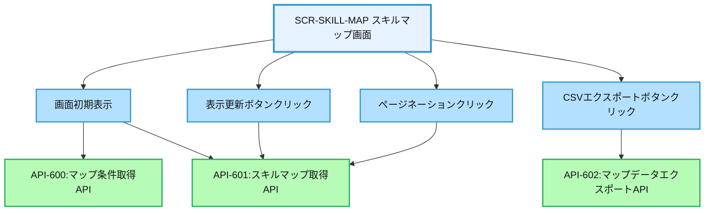
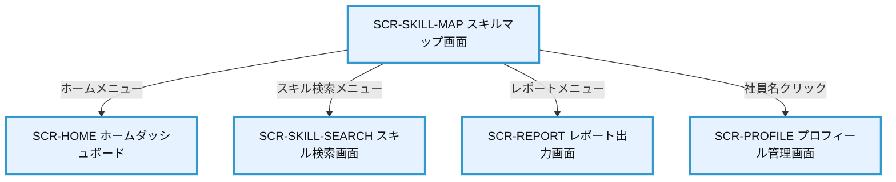

# 画面設計書：SCR-SKILL-MAP（スキルマップ画面）

## 1. 画面基本情報

- **画面ID**：SCR-SKILL-MAP
- **画面名称**：スキルマップ画面
- **画面の機能概要・目的**：  
  組織全体または特定グループのスキル分布をビジュアル化するスキルマップを表示する画面。スキルの強み・弱みを可視化し、人材配置や育成計画の立案、組織のスキルギャップ分析を支援する。
- **利用ユーザー・アクター**：上司・管理者・人事担当者
- **関連機能・仕様ID・機能ID**：F07 / PLT.1-WEB.1, PLT.1-RESP.1, PLT.2-ENC.1, ACC.1-ROLE.1, SKL.3-MAP.1
- **作成日**：2025/05/28
- **作成者**：システム設計担当
- **改訂履歴**：2025/05/28 初版作成

---

## 2. 画面レイアウト

- **画面イメージ・ワイヤーフレーム**
```
+------------------------------------------------------+
| [ロゴ] 年間スキル報告書システム    [ユーザー名▼] [🔔] |
+------------------------------------------------------+
| [サイドメニュー] | [スキルマップ]                    |
| ┌─────────────┐ | ┌─────────────────────────────┐    |
| │ ホーム      │ | │ 表示条件                    │    | ①
| │ プロフィール │ | │ 組織: [▼開発部]             │    |
| │ スキル情報   │ | │ スキルカテゴリ: [▼技術スキル] │    |
| │ キャリアプラン│ | │ 表示形式: [▼ヒートマップ]    │    |
| │ 作業実績    │ | │ [表示更新]                  │    |
| │ 研修記録    │ | └─────────────────────────────┘    |
| │ レポート    │ | ┌─────────────────────────────┐    |
| │ 管理機能    │ | │ スキルマップ                │    | ②
| └─────────────┘ | │ ┌─────────────────────────┐ │    |
|                 | │ │                         │ │    |
|                 | │ │ [スキルマップ表示領域]    │ │    |
|                 | │ │ (ヒートマップ/レーダーチャート等)│ │    |
|                 | │ │                         │ │    |
|                 | │ │                         │ │    |
|                 | │ └─────────────────────────┘ │    |
|                 | │ [CSVエクスポート] [画像保存]  │    |
|                 | └─────────────────────────────┘    |
|                 | ┌─────────────────────────────┐    |
|                 | │ 詳細データ                  │    | ③
|                 | │ ┌────┬────┬────────┬────────┐│    |
|                 | │ │社員│組織│スキル項目│評価レベル││    |
|                 | │ ├────┼────┼────────┼────────┤│    |
|                 | │ │山田│開発│Java    │A       ││    |
|                 | │ │鈴木│開発│Java    │B+      ││    |
|                 | │ │佐藤│開発│Java    │C       ││    |
|                 | │ │... │... │...     │...     ││    |
|                 | │ └────┴────┴────────┴────────┘│    |
|                 | │ [< 前へ] 1/3 [次へ >]        │    |
|                 | └─────────────────────────────┘    |
+------------------------------------------------------+
|  © 2025 Example Corp.                                |
+------------------------------------------------------+
```
- **画面サイズ**：レスポンシブ（PC：横1200px基準、スマホ：100%）
- **UI/UX設計上の注意点**：
  - スキルマップは視覚的に分かりやすいビジュアライゼーションで表示
  - 表示形式は複数（ヒートマップ/レーダーチャート/バブルチャート等）から選択可能
  - マップ上の要素はインタラクティブで、クリックすると詳細データを表示
  - 詳細データはページング対応で大量データも閲覧可能
  - アクセシビリティ対応（キーボード操作・スクリーンリーダー対応、色覚特性への配慮）

---

## 3. 画面項目定義

| 項目ID | 項目名                | APIパラメータ対応           | データ型   | I/O区分 | 必須 | 備考                       |
|--------|----------------------|----------------------------|-----------|---------|------|----------------------------|
| ①      | 表示条件セクション    | -                          | セクション | -       | -    | 表示条件入力エリア         |
| -      | 組織選択              | API-601.organization_id    | セレクト   | 入力    | ○    | 組織選択ドロップダウン     |
| -      | スキルカテゴリ選択    | API-601.skill_category_id  | セレクト   | 入力    | ○    | カテゴリ選択ドロップダウン |
| -      | 表示形式選択          | API-601.display_type       | セレクト   | 入力    | ○    | 表示形式選択ドロップダウン |
| -      | 表示更新ボタン        | -                          | ボタン     | 入力    | -    | マップ表示更新ボタン       |
| ②      | スキルマップセクション | -                         | セクション | -       | -    | スキルマップ表示エリア     |
| -      | スキルマップ表示領域  | API-601.map_data           | グラフ     | 出力    | -    | スキルマップ表示           |
| -      | CSVエクスポートボタン | API-602                    | ボタン     | 入力    | -    | データCSVエクスポートボタン |
| -      | 画像保存ボタン        | -                          | ボタン     | 入力    | -    | マップ画像保存ボタン       |
| ③      | 詳細データセクション  | -                          | セクション | -       | -    | 詳細データ表示エリア       |
| -      | 詳細データテーブル    | API-601.detail_data        | テーブル   | 出力    | -    | 詳細データ一覧表示         |
| -      | 社員列                | API-601.detail_data[].employee_name | テキスト | 出力 | -    | 社員名表示                 |
| -      | 組織列                | API-601.detail_data[].organization | テキスト | 出力  | -    | 組織名表示                 |
| -      | スキル項目列          | API-601.detail_data[].skill_item | テキスト | 出力   | -    | スキル項目名表示           |
| -      | 評価レベル列          | API-601.detail_data[].evaluation_level | テキスト | 出力 | -    | 評価レベル表示             |
| -      | ページネーション      | API-601.pagination         | ページャー | 入力    | -    | ページ切替                 |

---

## 4. 画面イベント・アクション定義

| イベントID | トリガー/アクション           | イベント内容・アクション詳細                                         | 紐付くAPI ID・名称      | メッセージ表示                       |
|------------|------------------------------|---------------------------------------------------------------------|------------------------|--------------------------------------|
| E01        | 画面初期表示                  | API-600呼出→表示条件ドロップダウン初期化、API-601呼出→初期マップ表示 | API-600, API-601       | エラー時：エラーメッセージ表示        |
| E02        | 表示更新ボタンクリック        | 入力値バリデーション→API-601呼出→スキルマップ・詳細データ表示        | API-601                | エラー時：エラーメッセージ表示        |
| E03        | マップ要素クリック            | クリックした要素の詳細情報をポップアップ表示                         | -                      | -                                    |
| E04        | CSVエクスポートボタンクリック | API-602呼出→詳細データCSVダウンロード                               | API-602                | エラー時：エラーメッセージ表示        |
| E05        | 画像保存ボタンクリック        | 現在表示中のスキルマップをPNG画像として保存                          | -                      | -                                    |
| E06        | ページネーションクリック      | API-601呼出→指定ページの詳細データ表示                              | API-601                | エラー時：エラーメッセージ表示        |
| E07        | 組織選択変更                  | 選択した組織に応じてスキルカテゴリリストを更新                       | API-600                | -                                    |
| E08        | 表示形式選択変更              | 選択した表示形式に応じてマップ表示を切替                             | -                      | -                                    |

---

## 5. 画面イベント・API関連図（Mermaid）



---

## 6. 画面遷移図・フロー



---

## 7. メッセージ定義

| メッセージID | メッセージ内容                                  | 種別    | 表示タイミング           |
|--------------|-----------------------------------------------|---------|-------------------------|
| MSG01        | データの取得に失敗しました                      | エラー  | API呼出失敗時           |
| MSG02        | 表示条件を選択してください                      | 警告    | 必須条件未選択時        |
| MSG03        | スキルマップを更新しました                      | 成功    | マップ表示更新成功時    |
| MSG04        | CSVエクスポートが完了しました                   | 成功    | エクスポート成功時      |
| MSG05        | 画像の保存に失敗しました                        | エラー  | 画像保存失敗時          |
| MSG06        | 大量のデータを含むため、表示に時間がかかります   | 警告    | 大量データ処理時        |

---

## 8. 入出力一覧

| 種別      | 名称           | 概要                         | アクセス方式 | 経由API（ID・名称・エンドポイント）         |
|-----------|----------------|------------------------------|--------------|--------------------------------------------|
| API       | API-600        | マップ条件取得API            | -            | /api/skill-map/conditions                  |
| API       | API-601        | スキルマップ取得API          | -            | /api/skill-map                             |
| API       | API-602        | マップデータエクスポートAPI  | -            | /api/skill-map/export                      |
| テーブル  | Organizations  | 組織マスタ                   | API経由      | API-600経由                                |
| テーブル  | SkillCategories| スキルカテゴリマスタ         | API経由      | API-600経由                                |
| テーブル  | SkillItems     | スキル項目マスタ             | API経由      | API-600経由                                |
| テーブル  | Employees      | 社員情報                     | API経由      | API-601経由                                |
| テーブル  | EmployeeSkills | 社員スキル情報               | API経由      | API-601経由                                |
| ファイル  | CSV            | エクスポートファイル         | API経由      | API-602経由                                |
| ファイル  | PNG            | マップ画像ファイル           | クライアント生成 | -                                      |

---

## 9. バックエンドAPIコール仕様（APIファースト設計）

### API-600 マップ条件取得API
- エンドポイント: `/api/skill-map/conditions`
- HTTPメソッド: GET
- リクエストパラメータ: なし
- レスポンスパラメータ: organizations (array), skill_categories (array), display_types (array)
- ステータスコードとエラーケース: 200, 401, 403, 500
- 認証・認可要件: 認証済みユーザー、スキルマップ閲覧権限
- 呼び出しタイミング: 画面初期表示時（E01）
- 備考: 表示条件のドロップダウンリストを返却

### API-601 スキルマップ取得API
- エンドポイント: `/api/skill-map`
- HTTPメソッド: POST
- リクエストパラメータ: organization_id (string, 必須), skill_category_id (string, 必須), display_type (string, 必須), page (integer, 任意), limit (integer, 任意)
- レスポンスパラメータ: map_data (object), detail_data (array), pagination (object)
- ステータスコードとエラーケース: 200, 400, 401, 403, 500
- 認証・認可要件: 認証済みユーザー、スキルマップ閲覧権限
- 呼び出しタイミング: 画面初期表示時（E01）、表示更新ボタンクリック時（E02）、ページネーション操作時（E06）
- 備考: スキルマップデータと詳細データを返却、詳細データはページング対応

### API-602 マップデータエクスポートAPI
- エンドポイント: `/api/skill-map/export`
- HTTPメソッド: POST
- リクエストパラメータ: organization_id (string, 必須), skill_category_id (string, 必須)
- レスポンスパラメータ: CSVファイルダウンロード
- ステータスコードとエラーケース: 200, 400, 401, 403, 500
- 認証・認可要件: 認証済みユーザー、エクスポート権限
- 呼び出しタイミング: CSVエクスポートボタンクリック時（E04）
- 備考: スキルマップの詳細データをCSV形式でエクスポート

---

## 10. オブジェクト構成・CRUD定義

- Organizations: R（API-600経由）
- SkillCategories: R（API-600経由）
- SkillItems: R（API-600/601経由）
- Employees: R（API-601経由）
- EmployeeSkills: R（API-601経由）
- MapViewLog: C（閲覧履歴記録）
- ExportLog: C（エクスポート履歴記録）

---

## 11. その他

- **アクセシビリティ要件**  
  - キーボード操作・スクリーンリーダー対応、コントラスト確保、ラベル付与
  - ヒートマップなどの色を使用した表現には、色覚特性に配慮した配色を使用
  - グラフ・チャートには代替テキスト提供
  - テーブルにはキャプションと適切なヘッダー設定

- **セキュリティ要件**  
  - スキルマップ閲覧権限の厳格な検証
  - 閲覧・エクスポート操作の監査ログ記録
  - 表示データは権限に応じた範囲のみ表示（組織階層制限等）
  - CSRF対策、XSS対策
  - API呼出時のJWTトークン検証

- **操作手順・利用ガイド**  
  - 表示条件（組織、スキルカテゴリ、表示形式）を選択
  - 表示更新ボタンをクリックしてスキルマップを表示
  - マップ上の要素をクリックすると詳細情報をポップアップ表示
  - CSVエクスポートボタンでデータをCSVファイルとしてダウンロード
  - 画像保存ボタンで現在表示中のマップをPNG画像として保存
  - 詳細データテーブルでは、ページネーションで全データを閲覧可能

- **備考・補足**  
  - 表示形式は以下のタイプから選択可能
    - ヒートマップ：スキル項目×社員のマトリクス表示
    - レーダーチャート：スキル項目を軸とした多角形チャート
    - バブルチャート：スキル分布を円の大きさで表現
    - ツリーマップ：階層構造を矩形で表現
  - 大規模組織の場合は、部署・チーム単位での集計表示も可能
  - 将来的には時系列での変化を表示する機能や、目標スキルレベルとの比較機能を追加予定
  - モバイル表示時は、マップ表示を簡略化し操作性を確保
