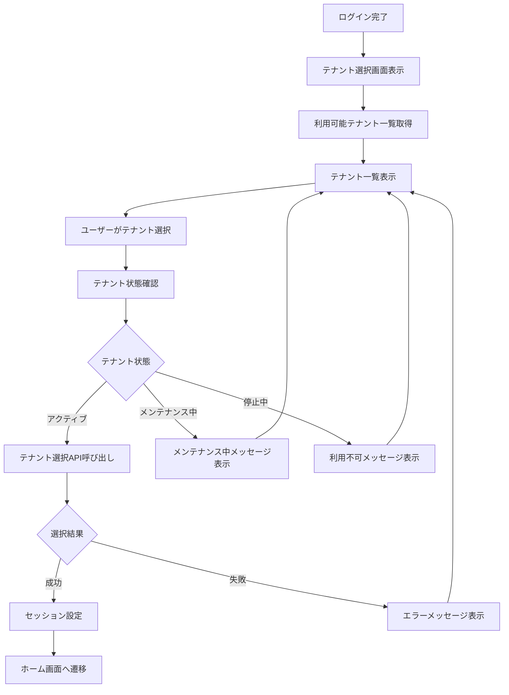
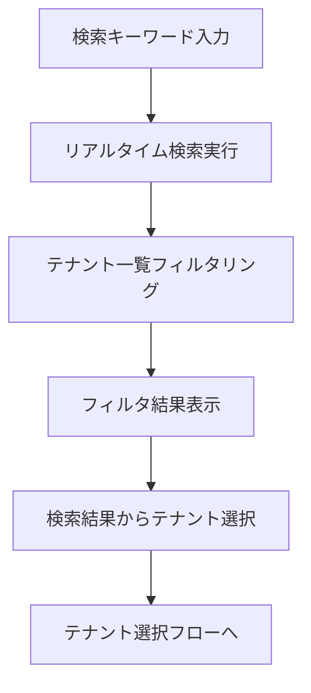

# 画面定義書 - SCR_TEN_Select テナント選択画面

## 基本情報

| 項目 | 内容 |
|------|------|
| 画面ID | SCR_TEN_Select |
| 画面名称 | テナント選択画面 |
| 機能カテゴリ | TEN（テナント管理） |
| 主な利用者 | 全ユーザー |
| 優先度 | 最高 |
| 作成日 | 2025-05-31 |
| 更新日 | 2025-06-01 |

## 画面概要

### 目的
- ユーザーが所属する複数のテナント（子会社・事業部）から利用するテナントを選択
- マルチテナント環境における認証後のテナント切り替え
- ユーザーのテナント権限に基づいたアクセス制御

### 主な機能
1. **テナント一覧表示**
   - ユーザーがアクセス可能なテナントの一覧表示
   - テナント状態（アクティブ/メンテナンス中）の表示
   - 最近利用したテナントの優先表示

2. **テナント選択**
   - テナントの選択とセッション設定
   - 選択したテナントでのシステム利用開始
   - テナント固有の設定の適用

3. **テナント検索**
   - テナント名による検索・フィルタリング
   - 大量のテナントがある場合の効率的な選択

4. **最近の利用履歴**
   - 最近利用したテナントの表示
   - ワンクリックでの再選択

## 画面レイアウト

### ヘッダー部
```
[ロゴ] 年間スキル報告書システム
                                    [ユーザー名] [ログアウト]
```

### メイン部
```
┌─ テナント選択 ─────────────────────────────────────┐
│                                                    │
│              年間スキル報告書システム              │
│                                                    │
│ ようこそ、[ユーザー名]さん                         │
│ 利用するテナントを選択してください                 │
│                                                    │
│ ┌─ 最近利用したテナント ─────────────────────────┐ │
│ │ [本社]           [東京支社]      [大阪支社]    │ │
│ └────────────────────────────────────────────────┘ │
│                                                    │
│ [検索: ________________]                           │
│                                                    │
│ ┌─ 利用可能なテナント ───────────────────────────┐ │
│ │                                                │ │
│ │ ┌─ 本社 ─────────────────────────────────────┐ │ │
│ │ │ 本社                                       │ │ │
│ │ │ 状態: アクティブ                           │ │ │
│ │ │ 最終利用: 2025-05-30                       │ │ │
│ │ │                              [選択して開始] │ │ │
│ │ └────────────────────────────────────────────┘ │ │
│ │                                                │ │
│ │ ┌─ 東京支社 ─────────────────────────────────┐ │ │
│ │ │ 東京支社                                   │ │ │
│ │ │ 状態: アクティブ                           │ │ │
│ │ │ 最終利用: 2025-05-28                       │ │ │
│ │ │                              [選択して開始] │ │ │
│ │ └────────────────────────────────────────────┘ │ │
│ │                                                │ │
│ │ ┌─ 大阪支社 ─────────────────────────────────┐ │ │
│ │ │ 大阪支社                                   │ │ │
│ │ │ 状態: メンテナンス中                       │ │ │
│ │ │ 最終利用: 2025-05-25                       │ │ │
│ │ │                              [利用不可]     │ │ │
│ │ └────────────────────────────────────────────┘ │ │
│ └────────────────────────────────────────────────┘ │
│                                                    │
│ [1] [2] [3] ... [次へ]                             │
└────────────────────────────────────────────────────┘
```

### テナント詳細モーダル（オプション）
```
┌─ テナント詳細 ─────────────────────────────────────┐
│                                          [×]      │
│ ┌─ 基本情報 ─────────────────────────────────────┐ │
│ │ テナント名: 本社                               │ │
│ │ 説明: 本社の年間スキル報告書管理               │ │
│ │ 状態: アクティブ                               │ │
│ │ 最終利用: 2025-05-30 14:30                     │ │
│ └────────────────────────────────────────────────┘ │
│                                                    │
│ ┌─ 利用可能機能 ─────────────────────────────────┐ │
│ │ ✓ スキル管理機能                               │ │
│ │ ✓ 目標管理機能                                 │ │
│ │ ✓ 作業実績管理機能                             │ │
│ │ ✓ 研修管理機能                                 │ │
│ │ ✓ レポート機能                                 │ │
│ └────────────────────────────────────────────────┘ │
│                                                    │
│ ┌─ あなたの権限 ─────────────────────────────────┐ │
│ │ • 一般ユーザー                                 │ │
│ │ • スキル入力・編集                             │ │
│ │ • レポート閲覧                                 │ │
│ └────────────────────────────────────────────────┘ │
│                                                    │
│                              [キャンセル] [選択]   │
└────────────────────────────────────────────────────┘
```

## 画面項目定義

### テナント一覧

| 項目名 | 項目ID | 型 | 必須 | 説明 |
|--------|--------|----|----|------|
| テナントID | tenant_id | 文字列 | ○ | システム内部ID |
| テナント名 | tenant_name | 文字列 | ○ | テナント表示名 |
| 説明 | description | 文字列 | - | テナントの説明 |
| 状態 | status | 選択 | ○ | アクティブ/メンテナンス中/停止中 |
| 最終利用日時 | last_accessed | 日時 | - | ユーザーの最終利用日時 |
| ユーザー権限 | user_role | 文字列 | ○ | テナント内でのユーザー権限 |

### 検索・フィルタ

| 項目名 | 項目ID | 型 | 必須 | 説明 |
|--------|--------|----|----|------|
| 検索キーワード | search_keyword | 文字列 | - | テナント名での検索 |
| 状態フィルタ | status_filter | 選択 | - | 状態による絞り込み |

## 操作フロー

### テナント選択フロー


### 検索フロー


## バリデーション

### 入力値検証
- **検索キーワード**: 最大100文字
- **特殊文字**: SQLインジェクション対策

### 業務ルール検証
- ユーザーのテナントアクセス権限確認
- テナント状態の確認（アクティブ状態のみ選択可能）
- セッション有効性の確認

## エラーハンドリング

### エラーメッセージ一覧

| エラーコード | メッセージ | 対応方法 |
|-------------|-----------|----------|
| TENANT_SELECT_001 | テナントが見つかりません | 検索条件を変更してください |
| TENANT_SELECT_002 | このテナントは現在利用できません | 管理者にお問い合わせください |
| TENANT_SELECT_003 | テナントへのアクセス権限がありません | 管理者にお問い合わせください |
| TENANT_SELECT_004 | セッションが無効です | 再度ログインしてください |
| TENANT_SELECT_005 | システムエラーが発生しました | しばらく時間をおいて再試行してください |

### 状態別メッセージ

| 状態 | メッセージ | 表示方法 |
|------|-----------|----------|
| メンテナンス中 | このテナントは現在メンテナンス中です | 警告アイコン + オレンジ色 |
| 停止中 | このテナントは現在停止中です | エラーアイコン + 赤色 |
| アクセス権限なし | このテナントへのアクセス権限がありません | 情報アイコン + グレー色 |

## セキュリティ要件

### 認証・認可
- ログイン済みユーザーのみアクセス可能
- ユーザーのテナントアクセス権限の確認
- セッション管理による認証状態の確認

### データ保護
- テナント選択履歴の記録
- 不正アクセス試行の検知・記録
- CSRF対策の実装

## パフォーマンス要件

- テナント一覧表示: 1秒以内
- テナント選択処理: 2秒以内
- 検索・フィルタリング: 0.5秒以内
- ページング: 20件/ページ

## アクセシビリティ

- キーボード操作対応（Tab、Enter、矢印キー）
- スクリーンリーダー対応
- 色覚障害者への配慮（アイコンと色の併用）
- フォーカス表示の明確化
- 高コントラスト表示対応

## レスポンシブデザイン

### デスクトップ（1200px以上）
- 3列レイアウトでテナントカード表示
- 詳細情報の充実表示

### タブレット（768px-1199px）
- 2列レイアウトでテナントカード表示
- 必要最小限の情報表示

### モバイル（767px以下）
- 1列レイアウトでテナントリスト表示
- タップしやすいボタンサイズ

## 関連API

- `GET /api/v1/users/{user_id}/tenants` - ユーザーの利用可能テナント一覧取得
- `POST /api/v1/auth/tenant-select` - テナント選択
- `GET /api/v1/tenants/{tenant_id}/status` - テナント状態確認
- `POST /api/v1/users/{user_id}/tenant-history` - テナント利用履歴記録

## 関連画面

- [SCR_AUT_Login](画面定義書_SCR_AUT_Login_ログイン画面.md) - ログイン画面
- [SCR_CMN_Home](画面定義書_SCR_CMN_Home_ホームダッシュボード画面.md) - ホームダッシュボード画面
- [SCR_TEN_Admin](画面定義書_SCR_TEN_Admin_テナント管理画面.md) - テナント管理画面

## 特記事項

### 初回利用時の動作
- 利用可能テナントが1つの場合は自動選択
- 利用可能テナントが0の場合はエラー画面表示
- 初回利用時は利用規約同意画面を表示

### テナント切り替え
- ホーム画面からのテナント切り替えも同様の画面を使用
- 現在選択中のテナントは明示的に表示
- 切り替え時は確認ダイアログを表示

### 最近の利用履歴
- 最大5件まで表示
- 利用日時の降順で表示
- ローカルストレージとサーバーサイドの両方で管理

## 備考

- マルチテナント機能の入り口となる重要な画面
- ユーザビリティを重視し、直感的な操作を実現
- 大量のテナントがある場合の性能を考慮した設計
- 将来的にはお気に入りテナント機能も検討