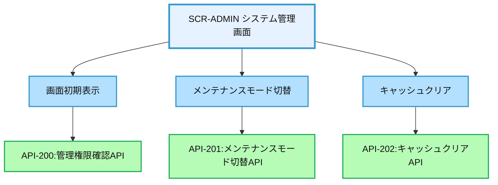

# 画面設計書：SCR-ADMIN（システム管理画面）

## 1. 画面基本情報

- **画面ID**：SCR-ADMIN
- **画面名称**：システム管理画面
- **画面の機能概要・目的**：  
  システム管理者向けの管理機能を集約した画面。システム設定、マスタデータ管理、ユーザー管理、バックアップ/リストア、監視・ログ管理などの機能を提供し、システム全体の運用・保守を支援する。
- **利用ユーザー・アクター**：システム管理者
- **関連機能・仕様ID・機能ID**：F03 / PLT.1-WEB.1, PLT.1-RESP.1, PLT.2-ENC.1, ACC.1-ROLE.1, SYS.1-MSTR.1, SYS.1-BKUP.1
- **作成日**：2025/05/28
- **作成者**：システム設計担当
- **改訂履歴**：2025/05/28 初版作成

---

## 2. 画面レイアウト

- **画面イメージ・ワイヤーフレーム**
```
+------------------------------------------------------+
| [ロゴ] 年間スキル報告書システム    [ユーザー名▼] [🔔] |
+------------------------------------------------------+
| [サイドメニュー] | [システム管理]                    |
| ┌─────────────┐ | ┌─────────────────────────────┐    |
| │ ホーム      │ | │ システム設定                │    | ①
| │ プロフィール │ | │ [基本設定] [通知設定] [連携設定]│    |
| │ スキル情報   │ | └─────────────────────────────┘    |
| │ キャリアプラン│ | ┌─────────────────────────────┐    |
| │ 作業実績    │ | │ マスタデータ管理            │    | ②
| │ 研修記録    │ | │ [組織マスタ] [役職マスタ]    │    |
| │ レポート    │ | │ [スキルマスタ] [資格マスタ]  │    |
| │ 管理機能    │ | └─────────────────────────────┘    |
| └─────────────┘ | ┌─────────────────────────────┐    |
|                 | │ ユーザー管理                │    | ③
|                 | │ [ユーザー一覧] [権限管理]    │    |
|                 | │ [アカウントロック解除]       │    |
|                 | └─────────────────────────────┘    |
|                 | ┌─────────────────────────────┐    |
|                 | │ システム運用                │    | ④
|                 | │ [バックアップ] [リストア]    │    |
|                 | │ [監視ダッシュボード] [ログ閲覧]│    |
|                 | └─────────────────────────────┘    |
|                 | ┌─────────────────────────────┐    |
|                 | │ メンテナンス                │    | ⑤
|                 | │ [メンテナンスモード] [通知配信]│    |
|                 | │ [キャッシュクリア]           │    |
|                 | └─────────────────────────────┘    |
+------------------------------------------------------+
|  © 2025 Example Corp.                                |
+------------------------------------------------------+
```
- **画面サイズ**：レスポンシブ（PC：横1200px基準、スマホ：100%）
- **UI/UX設計上の注意点**：
  - 管理者専用画面のため、誤操作防止のUI設計
  - 危険な操作（データ削除等）は確認ダイアログ表示
  - 操作ログを自動記録
  - アクセシビリティ対応（キーボード操作・スクリーンリーダー対応）

---

## 3. 画面項目定義

| 項目ID | 項目名                | APIパラメータ対応           | データ型   | I/O区分 | 必須 | 備考                       |
|--------|----------------------|----------------------------|-----------|---------|------|----------------------------|
| ①      | システム設定          | -                          | セクション | -       | -    | システム全体設定セクション |
| -      | 基本設定ボタン        | -                          | ボタン     | 入力    | -    | 基本設定画面へ遷移         |
| -      | 通知設定ボタン        | -                          | ボタン     | 入力    | -    | 通知設定画面へ遷移         |
| -      | 連携設定ボタン        | -                          | ボタン     | 入力    | -    | 外部連携設定画面へ遷移     |
| ②      | マスタデータ管理      | -                          | セクション | -       | -    | マスタデータ管理セクション |
| -      | 組織マスタボタン      | -                          | ボタン     | 入力    | -    | 組織マスタ管理画面へ遷移   |
| -      | 役職マスタボタン      | -                          | ボタン     | 入力    | -    | 役職マスタ管理画面へ遷移   |
| -      | スキルマスタボタン    | -                          | ボタン     | 入力    | -    | スキルマスタ管理画面へ遷移 |
| -      | 資格マスタボタン      | -                          | ボタン     | 入力    | -    | 資格マスタ管理画面へ遷移   |
| ③      | ユーザー管理          | -                          | セクション | -       | -    | ユーザー管理セクション     |
| -      | ユーザー一覧ボタン    | -                          | ボタン     | 入力    | -    | ユーザー一覧画面へ遷移     |
| -      | 権限管理ボタン        | -                          | ボタン     | 入力    | -    | 権限管理画面へ遷移         |
| -      | アカウントロック解除ボタン | -                     | ボタン     | 入力    | -    | ロック解除画面へ遷移       |
| ④      | システム運用          | -                          | セクション | -       | -    | システム運用セクション     |
| -      | バックアップボタン    | -                          | ボタン     | 入力    | -    | バックアップ画面へ遷移     |
| -      | リストアボタン        | -                          | ボタン     | 入力    | -    | リストア画面へ遷移         |
| -      | 監視ダッシュボードボタン | -                       | ボタン     | 入力    | -    | 監視画面へ遷移             |
| -      | ログ閲覧ボタン        | -                          | ボタン     | 入力    | -    | ログ閲覧画面へ遷移         |
| ⑤      | メンテナンス          | -                          | セクション | -       | -    | メンテナンスセクション     |
| -      | メンテナンスモードボタン | API-201.maintenance_mode | ボタン     | 入力    | -    | メンテナンスモード切替     |
| -      | 通知配信ボタン        | -                          | ボタン     | 入力    | -    | 通知配信画面へ遷移         |
| -      | キャッシュクリアボタン | API-202.clear_cache       | ボタン     | 入力    | -    | システムキャッシュクリア   |

---

## 4. 画面イベント・アクション定義

| イベントID | トリガー/アクション           | イベント内容・アクション詳細                                         | 紐付くAPI ID・名称      | メッセージ表示                       |
|------------|------------------------------|---------------------------------------------------------------------|------------------------|--------------------------------------|
| E01        | 画面初期表示                  | API-200呼出→管理機能の利用可否を判定                                | API-200                | エラー時：エラーメッセージ表示        |
| E02        | 各機能ボタンクリック          | 対応する管理画面へ遷移                                              | -                      | -                                    |
| E03        | メンテナンスモードボタンクリック | 確認ダイアログ表示→API-201呼出→メンテナンスモード切替             | API-201                | 成功/失敗メッセージ表示               |
| E04        | キャッシュクリアボタンクリック | 確認ダイアログ表示→API-202呼出→キャッシュクリア                    | API-202                | 成功/失敗メッセージ表示               |
| E05        | 権限エラー                    | 管理者権限がない場合、アクセス拒否                                  | API-200                | 「権限がありません」メッセージ表示     |

---

## 5. 画面イベント・API関連図（Mermaid）



---

## 6. 画面遷移図・フロー

```mermaid
flowchart TD
    SCR-ADMIN["SCR-ADMIN システム管理画面"]:::screen
    SCR-HOME["SCR-HOME ホームダッシュボード"]:::screen
    SCR-ACCESS["SCR-ACCESS 権限管理画面"]:::screen
    SCR-SKILL-M["SCR-SKILL-M スキルマスタ管理"]:::screen
    SCR-ORG["組織マスタ管理画面"]:::screen
    SCR-ROLE["役職マスタ管理画面"]:::screen
    SCR-CERT["資格マスタ管理画面"]:::screen
    SCR-USER["ユーザー一覧画面"]:::screen
    SCR-LOCK["アカウントロック解除画面"]:::screen
    SCR-BACKUP["バックアップ画面"]:::screen
    SCR-RESTORE["リストア画面"]:::screen
    SCR-MONITOR["監視ダッシュボード"]:::screen
    SCR-LOG["ログ閲覧画面"]:::screen
    SCR-NOTIFY-SEND["通知配信画面"]:::screen
    SCR-SETTINGS["基本設定画面"]:::screen
    SCR-NOTIFY-SET["通知設定画面"]:::screen
    SCR-CONNECT["連携設定画面"]:::screen
    
    SCR-ADMIN -- ホームメニュー --> SCR-HOME
    SCR-ADMIN -- 基本設定 --> SCR-SETTINGS
    SCR-ADMIN -- 通知設定 --> SCR-NOTIFY-SET
    SCR-ADMIN -- 連携設定 --> SCR-CONNECT
    SCR-ADMIN -- 組織マスタ --> SCR-ORG
    SCR-ADMIN -- 役職マスタ --> SCR-ROLE
    SCR-ADMIN -- スキルマスタ --> SCR-SKILL-M
    SCR-ADMIN -- 資格マスタ --> SCR-CERT
    SCR-ADMIN -- ユーザー一覧 --> SCR-USER
    SCR-ADMIN -- 権限管理 --> SCR-ACCESS
    SCR-ADMIN -- アカウントロック解除 --> SCR-LOCK
    SCR-ADMIN -- バックアップ --> SCR-BACKUP
    SCR-ADMIN -- リストア --> SCR-RESTORE
    SCR-ADMIN -- 監視ダッシュボード --> SCR-MONITOR
    SCR-ADMIN -- ログ閲覧 --> SCR-LOG
    SCR-ADMIN -- 通知配信 --> SCR-NOTIFY-SEND
    
    classDef screen fill:#e6f2ff,stroke:#3399cc,stroke-width:3px,color:#111;
```



---

## 7. メッセージ定義

| メッセージID | メッセージ内容                                  | 種別    | 表示タイミング           |
|--------------|-----------------------------------------------|---------|-------------------------|
| MSG01        | 権限がありません                               | エラー  | 管理者権限がない場合     |
| MSG02        | メンテナンスモードを有効にしました             | 成功    | メンテナンスモード有効時 |
| MSG03        | メンテナンスモードを解除しました               | 成功    | メンテナンスモード解除時 |
| MSG04        | キャッシュをクリアしました                     | 成功    | キャッシュクリア成功時   |
| MSG05        | 操作に失敗しました                             | エラー  | API呼出失敗時           |
| MSG06        | 本当に実行しますか？この操作は元に戻せません   | 確認    | 危険な操作実行前         |

---

## 8. 入出力一覧

| 種別      | 名称           | 概要                         | アクセス方式 | 経由API（ID・名称・エンドポイント）         |
|-----------|----------------|------------------------------|--------------|--------------------------------------------|
| API       | API-200        | 管理権限確認API              | -            | /api/admin/check-permission                |
| API       | API-201        | メンテナンスモード切替API    | -            | /api/admin/maintenance-mode                |
| API       | API-202        | キャッシュクリアAPI          | -            | /api/admin/clear-cache                     |
| テーブル  | UserRoles      | ユーザー権限情報             | API経由      | API-200経由                                |
| テーブル  | SystemSettings | システム設定情報             | API経由      | API-201経由                                |
| キャッシュ| AppCache       | アプリケーションキャッシュ   | API経由      | API-202経由                                |

---

## 9. バックエンドAPIコール仕様（APIファースト設計）

### API-200 管理権限確認API
- エンドポイント: `/api/admin/check-permission`
- HTTPメソッド: GET
- リクエストパラメータ: なし
- レスポンスパラメータ: is_admin (boolean), permissions (array of string)
- ステータスコードとエラーケース: 200, 401, 403, 500
- 認証・認可要件: 認証済みユーザー、管理者権限
- 呼び出しタイミング: 画面初期表示時（E01）
- 備考: 管理者権限の有無と詳細権限を返却

### API-201 メンテナンスモード切替API
- エンドポイント: `/api/admin/maintenance-mode`
- HTTPメソッド: POST
- リクエストパラメータ: enabled (boolean, 必須), message (string, 任意), scheduled_end (datetime, 任意)
- レスポンスパラメータ: success (boolean), current_status (object)
- ステータスコードとエラーケース: 200, 401, 403, 500
- 認証・認可要件: 認証済みユーザー、管理者権限
- 呼び出しタイミング: メンテナンスモードボタンクリック時（E03）
- 備考: メンテナンス中はログイン画面に通知表示

### API-202 キャッシュクリアAPI
- エンドポイント: `/api/admin/clear-cache`
- HTTPメソッド: POST
- リクエストパラメータ: cache_type (string, 任意, デフォルト="all")
- レスポンスパラメータ: success (boolean), cleared_caches (array of string)
- ステータスコードとエラーケース: 200, 401, 403, 500
- 認証・認可要件: 認証済みユーザー、管理者権限
- 呼び出しタイミング: キャッシュクリアボタンクリック時（E04）
- 備考: アプリケーションキャッシュをクリア

---

## 10. オブジェクト構成・CRUD定義

- UserRoles: R（API-200経由）
- SystemSettings: R, U（API-201経由）
- AppCache: D（API-202経由）
- AdminLog: C（全管理操作記録）

---

## 11. その他

- **アクセシビリティ要件**  
  - キーボード操作・スクリーンリーダー対応、コントラスト確保、ラベル付与
  - 危険な操作は視覚的に区別（赤色表示等）
  - 操作確認のためのフィードバック提供

- **セキュリティ要件**  
  - 管理者権限の厳格な検証
  - 全操作の監査ログ記録
  - 危険な操作は二段階認証
  - CSRF対策、XSS対策
  - API呼出時のJWTトークン検証

- **操作手順・利用ガイド**  
  - 管理機能へのアクセスはホーム画面の「管理機能」メニューから
  - 各機能ボタンをクリックして対応する管理画面へ遷移
  - メンテナンスモード切替やキャッシュクリアは確認ダイアログ表示後に実行
  - 全ての管理操作はログに記録され、監査証跡として保存

- **備考・補足**  
  - 管理者権限は複数レベル（一般管理者/システム管理者等）で設定可能
  - 一部の危険な操作（データリストア等）はシステム管理者のみ実行可能
  - メンテナンスモード中はログイン画面に通知メッセージとメンテナンス終了予定時刻を表示
  - 将来的には管理機能のカスタマイズや管理者向けダッシュボードの拡張を予定
