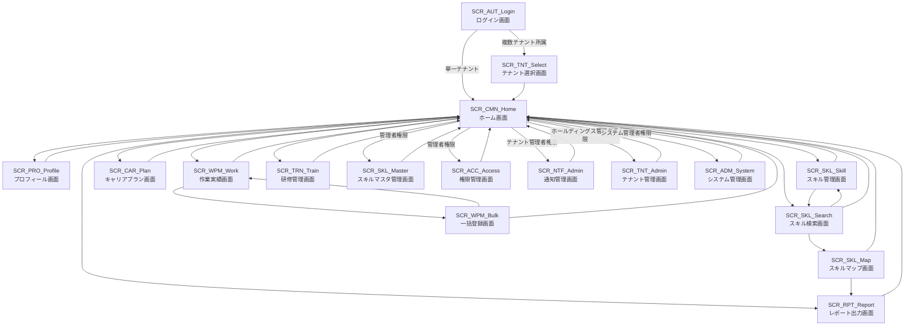

# 画面一覧

## 概要
本システムで提供される画面の一覧です。各画面の基本情報と詳細定義書へのリンクを記載しています。

## 画面一覧表

| 画面ID | 画面名称 | 機能カテゴリ | 主な対応機能 | 主な利用者 | 優先度 | 対応要求仕様ID | 備考 |
|--------|----------|-------------|-------------|-----------|--------|----------------|------|
| [SCR_AUT_Login](specs/画面定義書_SCR_AUT_Login_ログイン画面.md) | ログイン画面 | 認証・マルチテナント | ユーザー認証・テナント選択 | 全ユーザー | 最高 | TNT.3-AUTH.1, PLT.1-WEB.1 | マルチテナント対応システム入口 |
| [SCR_TNT_Select](specs/画面定義書_SCR_TNT_Select_テナント選択画面.md) | テナント選択画面 | マルチテナント | テナント選択・切り替え | 全ユーザー | 最高 | TNT.3-AUTH.1 | 複数テナント所属ユーザー向け |
| [SCR_CMN_Home](specs/画面定義書_SCR_CMN_Home_ホーム画面.md) | ホーム画面 | 共通 | ダッシュボード・メニュー・通知 | 全ユーザー | 高 | - | ログイン後初期画面 |
| [SCR_PRO_Profile](specs/画面定義書_SCR_PRO_Profile_プロフィール画面.md) | プロフィール画面 | プロフィール管理 | 基本情報表示・編集・履歴管理 | 全ユーザー | 最高 | PRO.1-BASE.1, PRO.1-HIST.1 | 個人情報管理 |
| [SCR_SKL_Skill](specs/画面定義書_SCR_SKL_Skill_スキル管理画面.md) | スキル管理画面 | スキル管理 | スキル情報入力・編集・評価 | 全ユーザー | 最高 | SKL.1-HIER.1, SKL.1-EVAL.1 | スキル情報編集 |
| [SCR_SKL_Search](specs/画面定義書_SCR_SKL_Search_スキル検索画面.md) | スキル検索画面 | スキル管理 | スキル検索・一覧表示・絞り込み | 全ユーザー | 高 | SKL.1-SRCH.1 | スキル情報閲覧・検索 |
| [SCR_SKL_Master](specs/画面定義書_SCR_SKL_Master_スキルマスタ管理画面.md) | スキルマスタ管理画面 | スキル管理 | スキル階層・項目・資格マスタ管理 | 管理者 | 高 | SKL.1-MAINT.1, SKL.2-MST.1 | スキル体系管理 |
| [SCR_SKL_Map](specs/画面定義書_SCR_SKL_Map_スキルマップ画面.md) | スキルマップ画面 | レポート・分析 | スキルマップ・ヒートマップ表示 | 管理者・マネージャー | 低 | RPT.2-MAP.1, RPT.2-VIS.1 | スキル分析・可視化 |
| [SCR_CAR_Plan](specs/画面定義書_SCR_CAR_Plan_キャリアプラン画面.md) | キャリアプラン画面 | 目標・キャリア管理 | 目標設定・キャリアプラン管理 | 全ユーザー | 中 | CAR.1-PLAN.1, CAR.1-VIS.1 | 中長期目標管理 |

| [SCR_WPM_Work](specs/画面定義書_SCR_WPM_Work_作業実績画面.md) | 作業実績画面 | 作業実績管理 | 案件実績入力・編集・管理 | 全ユーザー | 中 | WPM.1-DET.1, WPM.1-TECH.1 | 案件実績管理 |
| [SCR_WPM_Bulk](specs/画面定義書_SCR_WPM_Bulk_一括登録画面.md) | 一括登録画面 | 作業実績管理 | CSV/Excel一括登録・バリデーション | 全ユーザー | 低 | WPM.1-BULK.1 | 効率的データ登録 |
| [SCR_TRN_Train](specs/画面定義書_SCR_TRN_Train_研修管理画面.md) | 研修管理画面 | 研修・教育管理 | 研修参加記録・履歴管理 | 全ユーザー | 中 | TRN.1-ATT.1, TRN.1-ANAL.1 | 研修履歴管理 |

| [SCR_RPT_Report](specs/画面定義書_SCR_RPT_Report_レポート出力画面.md) | レポート出力画面 | レポート・分析 | Excel/PDF帳票出力・ダウンロード | 全ユーザー | 低 | RPT.1-EXCEL.1, RPT.1-PDF.1 | 帳票出力機能 |
| [SCR_ACC_Access](specs/画面定義書_SCR_ACC_Access_権限管理画面.md) | 権限管理画面 | 認証・認可 | ロール・権限管理・監査証跡 | 管理者 | 高 | ACC.1-ROLE.1, ACC.3-AUDT.1 | アクセス制御管理 |
| [SCR_TNT_Admin](specs/画面定義書_SCR_TNT_Admin_テナント管理画面.md) | テナント管理画面 | マルチテナント管理 | テナント作成・設定・ユーザー管理 | ホールディングス管理者 | 最高 | TNT.1-MGMT.1, TNT.1-CONF.1 | マルチテナント基盤管理 |
| [SCR_NTF_Admin](specs/画面定義書_SCR_NTF_Admin_通知管理画面.md) | 通知管理画面 | 通知・連携管理 | 通知設定・テンプレート・連携管理 | テナント管理者 | 高 | NTF.1-EMAIL.1, NTF.2-TEMP.1 | 通知・連携サービス管理 |
| [SCR_ADM_System](specs/画面定義書_SCR_ADM_System_システム管理画面.md) | システム管理画面 | システム管理 | バックアップ・監視・ログ管理 | システム管理者 | 高 | PLT.2-BKP.1, PLT.2-MON.1 | システム運用管理 |

## 画面カテゴリ別分類

### 認証・マルチテナント系画面
- SCR_AUT_Login: ログイン画面
- SCR_TNT_Select: テナント選択画面

### 共通画面
- SCR_CMN_Home: ホーム画面

### プロフィール管理画面
- SCR_PRO_Profile: プロフィール画面

### スキル管理画面
- SCR_SKL_Skill: スキル管理画面
- SCR_SKL_Search: スキル検索画面
- SCR_SKL_Master: スキルマスタ管理画面
- SCR_SKL_Map: スキルマップ画面

### 目標・キャリア管理画面
- SCR_CAR_Plan: キャリアプラン画面

### 作業実績管理画面
- SCR_WPM_Work: 作業実績画面
- SCR_WPM_Bulk: 一括登録画面

### 研修・教育管理画面
- SCR_TRN_Train: 研修管理画面

### レポート・分析画面
- SCR_RPT_Report: レポート出力画面
- SCR_SKL_Map: スキルマップ画面（再掲）

### 権限・アクセス制御画面
- SCR_ACC_Access: 権限管理画面

### マルチテナント管理画面
- SCR_TNT_Admin: テナント管理画面

### 通知・連携管理画面
- SCR_NTF_Admin: 通知管理画面

### システム管理画面
- SCR_ADM_System: システム管理画面

## 画面遷移図

## 優先度について

- **最高**: 業務フローの起点となる必須画面（ログイン、基本情報・スキル入力/管理、マルチテナント基盤）
- **高**: 最低限の非機能（認証、権限、セキュリティ）、スキル管理・検索、管理者向け主要機能
- **中**: 目標管理、作業実績、研修管理、通知など日常業務運用に必要な機能
- **低**: 一括登録、マスタ管理、レポート出力など補助的・運用効率向上機能

## 注意事項

- 画面IDは「SCR_」で始まる命名規則に従っています
- 各画面の詳細仕様は、対応する画面定義書を参照してください
- 画面定義書は `create_screen_definitions.py` スクリプトで自動生成されます

## 関連ドキュメント

- [画面定義書生成スクリプト](create_screen_definitions.py)
- [画面設計ガイドライン](../guidelines/screen_design_guidelines.md)
- [UI/UXガイドライン](../guidelines/ui_ux_guidelines.md)
