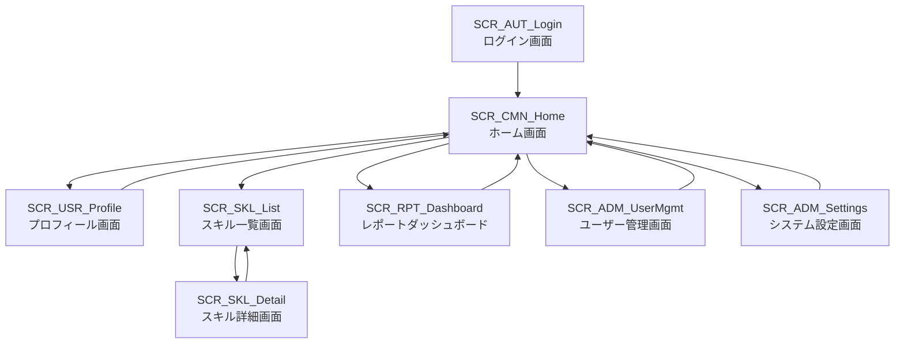

# 画面一覧

## 概要
本システムで提供される画面の一覧です。各画面の基本情報と詳細定義書へのリンクを記載しています。

## 画面一覧表

| 画面ID | 画面名称 | 機能カテゴリ | 主な対応機能 | 主な利用者 | 優先度 | 備考 |
|--------|----------|-------------|-------------|-----------|--------|------|
| [SCR_AUT_Login](specs/画面定義書_SCR_AUT_Login_ログイン画面.md) | ログイン画面 | 認証 | ユーザー認証・ログイン | 全ユーザー | 高 | システム入口 |
| [SCR_CMN_Home](specs/画面定義書_SCR_CMN_Home_ホーム画面.md) | ホーム画面 | 共通 | ダッシュボード・メニュー | 全ユーザー | 高 | ログイン後初期画面 |
| [SCR_USR_Profile](specs/画面定義書_SCR_USR_Profile_プロフィール画面.md) | プロフィール画面 | ユーザー管理 | プロフィール表示・編集 | 全ユーザー | 中 | 個人情報管理 |
| [SCR_SKL_List](specs/画面定義書_SCR_SKL_List_スキル一覧画面.md) | スキル一覧画面 | スキル管理 | スキル検索・一覧表示 | 全ユーザー | 高 | スキル情報閲覧 |
| [SCR_SKL_Detail](specs/画面定義書_SCR_SKL_Detail_スキル詳細画面.md) | スキル詳細画面 | スキル管理 | スキル詳細表示・編集 | 全ユーザー | 高 | スキル情報編集 |
| [SCR_RPT_Dashboard](specs/画面定義書_SCR_RPT_Dashboard_レポートダッシュボード.md) | レポートダッシュボード | レポート | 各種レポート表示 | 管理者・マネージャー | 中 | 分析・レポート |
| [SCR_ADM_UserMgmt](specs/画面定義書_SCR_ADM_UserMgmt_ユーザー管理画面.md) | ユーザー管理画面 | 管理機能 | ユーザー管理・権限設定 | 管理者 | 中 | システム管理 |
| [SCR_ADM_Settings](specs/画面定義書_SCR_ADM_Settings_システム設定画面.md) | システム設定画面 | 管理機能 | システム設定・環境設定 | 管理者 | 低 | システム設定 |

## 画面カテゴリ別分類

### 認証系画面
- SCR_AUT_Login: ログイン画面

### 共通画面
- SCR_CMN_Home: ホーム画面

### ユーザー管理画面
- SCR_USR_Profile: プロフィール画面

### スキル管理画面
- SCR_SKL_List: スキル一覧画面
- SCR_SKL_Detail: スキル詳細画面

### レポート画面
- SCR_RPT_Dashboard: レポートダッシュボード

### 管理機能画面
- SCR_ADM_UserMgmt: ユーザー管理画面
- SCR_ADM_Settings: システム設定画面

## 画面遷移図

## 優先度について

- **高**: システムの基本機能として必須の画面
- **中**: 重要な機能だが、段階的に実装可能な画面
- **低**: 運用開始後に実装予定の画面

## 注意事項

- 画面IDは「SCR_」で始まる命名規則に従っています
- 各画面の詳細仕様は、対応する画面定義書を参照してください
- 画面定義書は `create_screen_definitions.py` スクリプトで自動生成されます

## 関連ドキュメント

- [画面定義書生成スクリプト](create_screen_definitions.py)
- [画面設計ガイドライン](../guidelines/screen_design_guidelines.md)
- [UI/UXガイドライン](../guidelines/ui_ux_guidelines.md)
