# 画面一覧

以下は年間スキル報告書WEB化PJTの画面一覧です。各画面名をクリックすると、詳細な画面設計書を参照できます。

| 画面ID          | 画面名称                 | 主な機能カテゴリ           | 主な対応機能（抜粋）                            | 主な利用者         | 優先度 | 画面設計書リンク |
|-----------------|--------------------------|---------------------------|------------------------------------------------|--------------------|--------|-----------------|
| [SCR-LOGIN](specs/画面設計書_SCR-LOGIN.md)       | ログイン画面             | 認証・認可                | ユーザー認証、SSO連携                           | 全ユーザー         | 最高   | [詳細設計書](specs/画面設計書_SCR-LOGIN.md) |
| [SCR-ACCESS](specs/画面設計書_SCR-ACCESS.md)      | 権限管理画面             | 認証・認可                | 権限・ロール管理、監査証跡                      | システム管理者     | 高     | [詳細設計書](specs/画面設計書_SCR-ACCESS.md) |
| [SCR-PROFILE](specs/画面設計書_SCR-PROFILE.md)     | プロフィール管理画面     | プロフィール管理          | 基本情報管理、組織・役職管理                    | 社員・人事         | 最高   | [詳細設計書](specs/画面設計書_SCR-PROFILE.md) |
| [SCR-ADMIN](specs/画面設計書_SCR-ADMIN.md)       | システム管理画面         | システム管理、プロフィール管理 | バックアップ、監視、マスタ管理、組織・役職管理 | システム管理者     | 高/低  | [詳細設計書](specs/画面設計書_SCR-ADMIN.md) |
| [SCR-SKILL](specs/画面設計書_SCR-SKILL.md)       | スキル情報管理画面       | スキル管理                | スキル入力・編集、資格管理                      | 社員・上司         | 最高   | [詳細設計書](specs/画面設計書_SCR-SKILL.md) |
| [SCR-SKILL-M](specs/画面設計書_SCR-SKILL-M.md)     | スキルマスタ管理画面     | スキル管理                | スキルマスタ管理、資格マスタ管理                | システム管理者     | 高     | [詳細設計書](specs/画面設計書_SCR-SKILL-M.md) |
| [SCR-SKILL-SEARCH](specs/画面設計書_SCR-SKILL-SEARCH.md)| スキル検索画面           | スキル管理                | スキル検索、社員抽出                            | 上司・管理者       | 高     | [詳細設計書](specs/画面設計書_SCR-SKILL-SEARCH.md) |
| [SCR-SKILL-MAP](specs/画面設計書_SCR-SKILL-MAP.md)   | スキルマップ・分析画面   | レポート・分析            | スキルマップ生成、ギャップ分析                  | 管理者・人事       | 低     | [詳細設計書](specs/画面設計書_SCR-SKILL-MAP.md) |
| [SCR-CAR-PLAN](specs/画面設計書_SCR-CAREER.md)    | キャリアプラン・目標設定 | 目標・キャリア管理        | 目標・キャリア設定                              | 社員・上司         | 中     | [詳細設計書](specs/画面設計書_SCR-CAREER.md) |
| [SCR-CAR-EVAL](specs/画面設計書_SCR-CAREER.md)    | 目標進捗・評価画面       | 目標・キャリア管理        | 進捗管理・評価                                  | 社員・上司         | 中     | [詳細設計書](specs/画面設計書_SCR-CAREER.md) |
| [SCR-WORK](specs/画面設計書_SCR-WORK.md)        | 作業実績入力画面         | 作業実績管理              | 案件実績入力・編集                              | 社員               | 中     | [詳細設計書](specs/画面設計書_SCR-WORK.md) |
| [SCR-WORK-BULK](specs/画面設計書_SCR-WORK-BULK.md)   | 一括実績登録画面         | 作業実績管理              | 一括実績登録（CSV/Excel）                        | 社員・管理者       | 低     | [詳細設計書](specs/画面設計書_SCR-WORK-BULK.md) |
| [SCR-TRAIN](specs/画面設計書_SCR-TRAINING.md)       | 研修参加記録画面         | 研修・教育管理            | 研修参加記録管理                                | 社員・人事         | 中     | [詳細設計書](specs/画面設計書_SCR-TRAINING.md) |
| [SCR-TRAIN-M](specs/画面設計書_SCR-TRAINING.md)     | 継続教育管理画面         | 研修・教育管理            | 継続教育・PDU管理                                | 社員・人事         | 中     | [詳細設計書](specs/画面設計書_SCR-TRAINING.md) |
| [SCR-REPORT](specs/画面設計書_SCR-REPORT.md)      | レポート出力画面         | レポート・分析            | 帳票出力（Excel/PDF）                            | 管理者・人事       | 低     | [詳細設計書](specs/画面設計書_SCR-REPORT.md) |
| [SCR-NOTIFY](specs/画面設計書_SCR-NOTIFY.md)      | 通知・アラート画面       | システム管理、研修・教育管理 | 障害通知、資格期限アラート、進捗リマインダー   | 全ユーザー         | 中     | [詳細設計書](specs/画面設計書_SCR-NOTIFY.md) |
| [SCR-HOME](specs/画面設計書_SCR-HOME.md)        | ホームダッシュボード     | 共通基盤                  | 各種通知・進捗サマリ・ショートカット             | 全ユーザー         | 高     | [詳細設計書](specs/画面設計書_SCR-HOME.md) |

## 優先度基準
- **最高**：業務フローの起点となる「社員基本情報登録・更新」「スキル階層構造定義」に関わる画面
- **高**：最低限の非機能（認証、権限、セキュリティ）、スキル管理・検索、管理者向けの主要画面
- **中**：目標管理、作業実績、研修管理、通知など日常の業務運用に必要な画面
- **低**：一括登録、マスタ管理、レポート出力など補助的・運用効率向上画面

## 画面遷移図

```mermaid
flowchart TD
    %% 優先度: 最高=red, 高=orange, 中=yellow, 低=gray

    %% 最高優先度
    SCR-LOGIN["SCR-LOGINログイン画面"]:::prio_max
    SCR-PROFILE["SCR-PROFILEプロフィール管理画面"]:::prio_max
    SCR-SKILL["SCR-SKILLスキル情報管理画面"]:::prio_max

    %% 高優先度
    SCR-ACCESS["SCR-ACCESS権限管理画面"]:::prio_high
    SCR-SKILL-M["SCR-SKILL-Mスキルマスタ管理画面"]:::prio_high
    SCR-SKILL-SEARCH["SCR-SKILL-SEARCHスキル検索画面"]:::prio_high
    SCR-ADMIN["SCR-ADMINシステム管理画面"]:::prio_high
    SCR-HOME["SCR-HOMEホームダッシュボード"]:::prio_high

    %% 中優先度
    SCR-CAR-PLAN["SCR-CAR-PLANキャリアプラン・目標設定"]:::prio_mid
    SCR-CAR-EVAL["SCR-CAR-EVAL目標進捗・評価画面"]:::prio_mid
    SCR-WORK["SCR-WORK作業実績入力画面"]:::prio_mid
    SCR-TRAIN["SCR-TRAIN研修参加記録画面"]:::prio_mid
    SCR-TRAIN-M["SCR-TRAIN-M継続教育管理画面"]:::prio_mid
    SCR-NOTIFY["SCR-NOTIFY通知・アラート画面"]:::prio_mid

    %% 低優先度
    SCR-WORK-BULK["SCR-WORK-BULK一括実績登録画面"]:::prio_low
    SCR-REPORT["SCR-REPORTレポート出力画面"]:::prio_low
    SCR-SKILL-MAP["SCR-SKILL-MAPスキルマップ・分析画面"]:::prio_low

    %% 画面遷移
    SCR-LOGIN --> SCR-HOME
    SCR-HOME --> SCR-PROFILE
    SCR-HOME --> SCR-SKILL
    SCR-HOME --> SCR-CAR-PLAN
    SCR-HOME --> SCR-WORK
    SCR-HOME --> SCR-TRAIN
    SCR-HOME --> SCR-REPORT
    SCR-HOME --> SCR-NOTIFY
    SCR-HOME --> SCR-ACCESS
    SCR-HOME --> SCR-ADMIN
    SCR-HOME --> SCR-SKILL-SEARCH
    SCR-HOME --> SCR-SKILL-MAP

    SCR-PROFILE --> SCR-HOME
    SCR-SKILL --> SCR-HOME
    SCR-SKILL --> SCR-SKILL-M
    SCR-SKILL --> SCR-SKILL-SEARCH
    SCR-SKILL --> SCR-SKILL-MAP
    SCR-SKILL --> SCR-REPORT

    SCR-SKILL-M --> SCR-SKILL
    SCR-SKILL-SEARCH --> SCR-SKILL
    SCR-SKILL-MAP --> SCR-SKILL
    SCR-ACCESS --> SCR-ADMIN
    SCR-ADMIN --> SCR-HOME

    SCR-CAR-PLAN --> SCR-CAR-EVAL
    SCR-CAR-EVAL --> SCR-HOME

    SCR-WORK --> SCR-WORK-BULK
    SCR-WORK-BULK --> SCR-WORK

    SCR-TRAIN --> SCR-TRAIN-M
    SCR-TRAIN-M --> SCR-TRAIN

    SCR-NOTIFY --> SCR-HOME
    SCR-REPORT --> SCR-HOME

    %% スタイル定義
    classDef prio_max fill:#ffcccc,stroke:#b22222,stroke-width:2px,color:#111;
    classDef prio_high fill:#ffe4b5,stroke:#ff8c00,stroke-width:2px,color:#111;
    classDef prio_mid fill:#ffffcc,stroke:#bdb76b,stroke-width:2px,color:#111;
    classDef prio_low fill:#eeeeee,stroke:#888888,stroke-width:1px,color:#111;
```

## 色分け凡例
- **最高（赤）**：業務フローの起点（ログイン・基本情報・スキル入力/編集）
- **高（オレンジ）**：最低限の非機能（認証・権限・セキュリティ）、スキル管理・検索、管理者向け主要機能
- **中（黄）**：目標管理、作業実績、研修管理など日常運用機能
- **低（グレー）**：一括登録・マスタ管理・レポート出力など補助・運用効率向上機能
