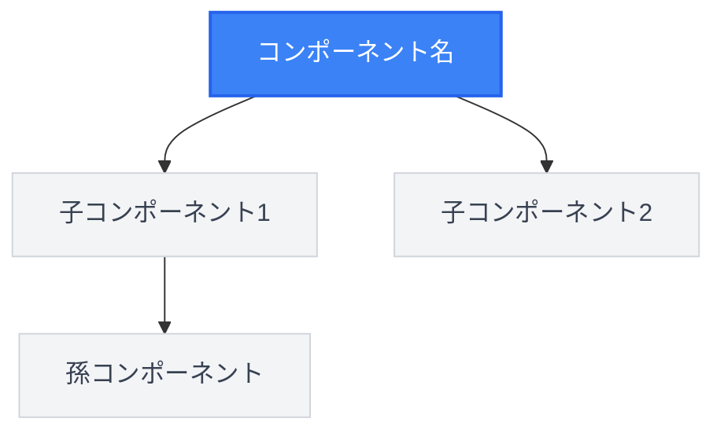
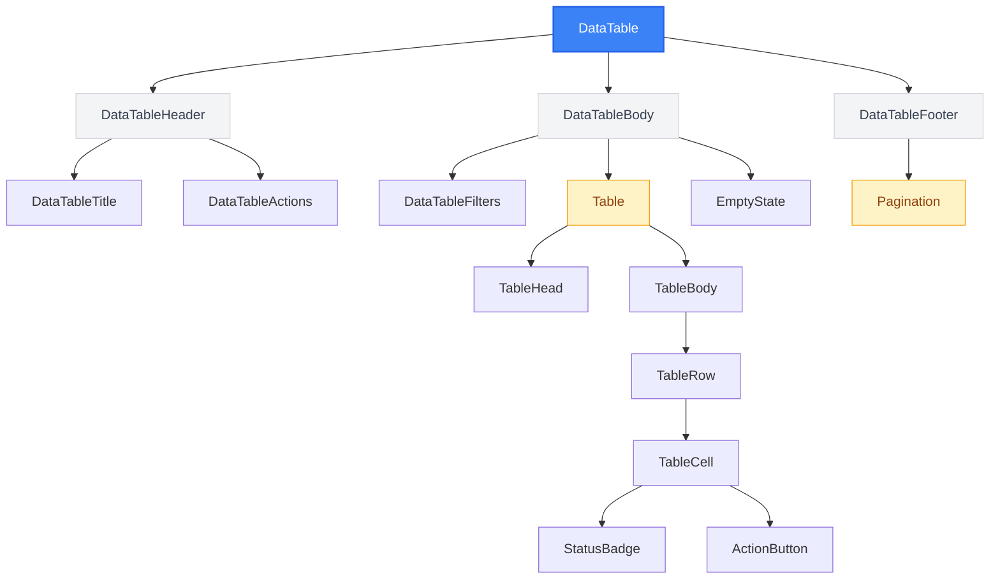
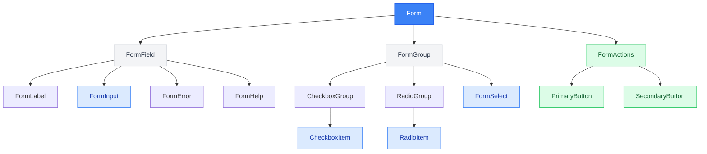
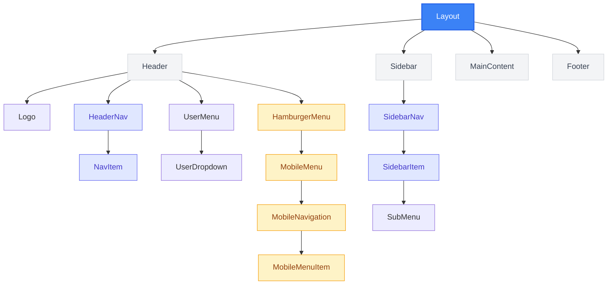
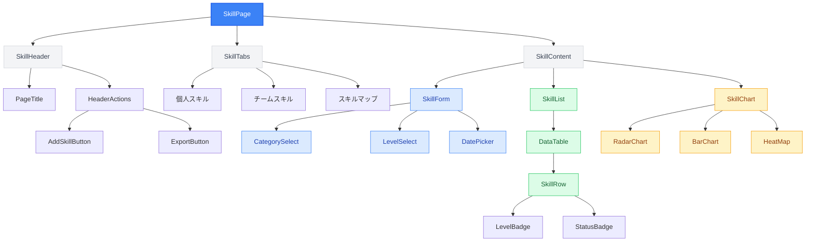
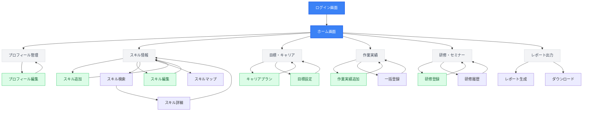
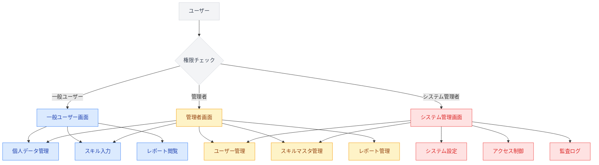
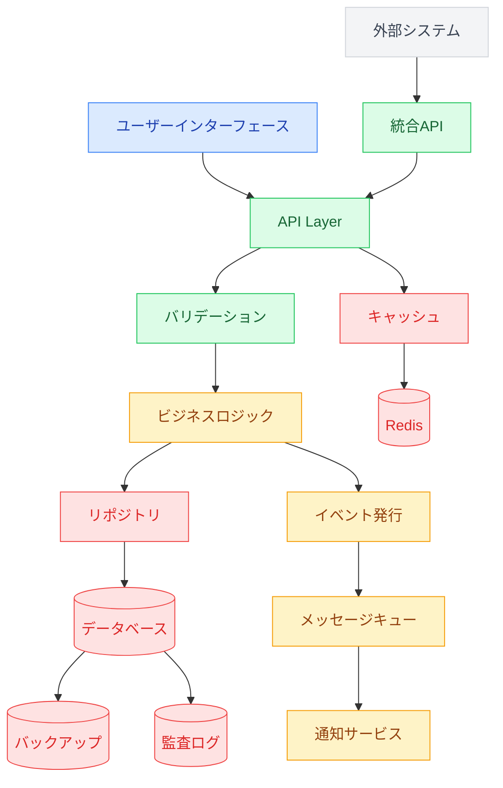
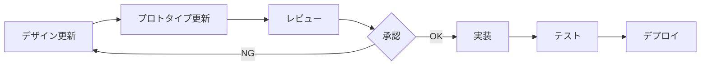

# UI/UX共通仕様書: 年間スキル報告書WEB化PJT

## 1. 文書基本情報

- **文書名**: UI/UX共通仕様書
- **プロジェクト名**: 年間スキル報告書WEB化PJT
- **対象システム**: 年間スキル報告書Webアプリケーション
- **技術スタック**: Next.js 14 + TypeScript + React 18 + Tailwind CSS
- **作成日**: 2025/05/30
- **作成者**: システム設計担当
- **改訂履歴**: 2025/05/30 初版作成

---

## 2. 基本設計方針

### 2.1 デザインコンセプト
- **シンプル・直感的**: 業務効率を重視したミニマルデザイン
- **アクセシブル**: WCAG 2.1 AA準拠、全ユーザーが利用可能
- **レスポンシブ**: PC・タブレット・スマートフォン対応
- **一貫性**: 全画面で統一されたUI/UX

### 2.2 ユーザビリティ原則
- **3ステップ以内**: 目的の画面・機能へ3ステップ以内でアクセス
- **1秒以内**: API〜UI まで1秒以内のレスポンス
- **直感的操作**: 説明不要で操作可能なインターフェース
- **エラー防止**: 入力ミス・操作ミスを事前に防ぐ設計

---

## 3. カラーパレット

### 3.1 プライマリカラー
```css
/* メインブランドカラー */
--primary-50: #eff6ff;    /* 背景・薄い強調 */
--primary-100: #dbeafe;   /* ホバー背景 */
--primary-200: #bfdbfe;   /* 無効状態 */
--primary-300: #93c5fd;   /* ボーダー */
--primary-400: #60a5fa;   /* アイコン */
--primary-500: #3b82f6;   /* メインボタン */
--primary-600: #2563eb;   /* ホバー状態 */
--primary-700: #1d4ed8;   /* アクティブ状態 */
--primary-800: #1e40af;   /* 濃い強調 */
--primary-900: #1e3a8a;   /* 最濃色 */
```

### 3.2 セカンダリカラー
```css
/* サブカラー（グレー系） */
--gray-50: #f9fafb;       /* 背景 */
--gray-100: #f3f4f6;      /* カード背景 */
--gray-200: #e5e7eb;      /* ボーダー */
--gray-300: #d1d5db;      /* 無効テキスト */
--gray-400: #9ca3af;      /* プレースホルダー */
--gray-500: #6b7280;      /* 補助テキスト */
--gray-600: #4b5563;      /* 通常テキスト */
--gray-700: #374151;      /* 見出し */
--gray-800: #1f2937;      /* 強調テキスト */
--gray-900: #111827;      /* 最濃テキスト */
```

### 3.3 ステータスカラー
```css
/* 成功・エラー・警告・情報 */
--success-50: #f0fdf4;    /* 成功背景 */
--success-500: #22c55e;   /* 成功メイン */
--success-600: #16a34a;   /* 成功ホバー */

--error-50: #fef2f2;      /* エラー背景 */
--error-500: #ef4444;     /* エラーメイン */
--error-600: #dc2626;     /* エラーホバー */

--warning-50: #fffbeb;    /* 警告背景 */
--warning-500: #f59e0b;   /* 警告メイン */
--warning-600: #d97706;   /* 警告ホバー */

--info-50: #eff6ff;       /* 情報背景 */
--info-500: #3b82f6;      /* 情報メイン */
--info-600: #2563eb;      /* 情報ホバー */
```

---

## 4. タイポグラフィ

### 4.1 フォントファミリー
```css
/* 日本語・英語混在対応 */
--font-family-base: 'Hiragino Kaku Gothic ProN', 'Hiragino Sans', 'Yu Gothic Medium', 'Meiryo', 'MS PGothic', sans-serif;
--font-family-mono: 'SFMono-Regular', 'Consolas', 'Liberation Mono', 'Menlo', monospace;
```

### 4.2 フォントサイズ・行間
```css
/* テキストサイズ階層 */
--text-xs: 0.75rem;       /* 12px - 注釈・補助情報 */
--text-sm: 0.875rem;      /* 14px - 小さなラベル */
--text-base: 1rem;        /* 16px - 基本テキスト */
--text-lg: 1.125rem;      /* 18px - 強調テキスト */
--text-xl: 1.25rem;       /* 20px - 小見出し */
--text-2xl: 1.5rem;       /* 24px - 中見出し */
--text-3xl: 1.875rem;     /* 30px - 大見出し */
--text-4xl: 2.25rem;      /* 36px - ページタイトル */

/* 行間 */
--leading-tight: 1.25;    /* 見出し用 */
--leading-normal: 1.5;    /* 本文用 */
--leading-relaxed: 1.625; /* 長文用 */
```

### 4.3 フォントウェイト
```css
--font-light: 300;        /* 軽い強調 */
--font-normal: 400;       /* 通常テキスト */
--font-medium: 500;       /* 中程度強調 */
--font-semibold: 600;     /* 強調 */
--font-bold: 700;         /* 見出し */
```

---

## 5. スペーシング・レイアウト

### 5.1 スペーシングシステム
```css
/* 8px基準のスペーシング */
--space-1: 0.25rem;       /* 4px */
--space-2: 0.5rem;        /* 8px */
--space-3: 0.75rem;       /* 12px */
--space-4: 1rem;          /* 16px */
--space-5: 1.25rem;       /* 20px */
--space-6: 1.5rem;        /* 24px */
--space-8: 2rem;          /* 32px */
--space-10: 2.5rem;       /* 40px */
--space-12: 3rem;         /* 48px */
--space-16: 4rem;         /* 64px */
--space-20: 5rem;         /* 80px */
--space-24: 6rem;         /* 96px */
```

### 5.2 レイアウトグリッド
```css
/* コンテナ幅 */
--container-sm: 640px;    /* スマートフォン */
--container-md: 768px;    /* タブレット */
--container-lg: 1024px;   /* デスクトップ */
--container-xl: 1280px;   /* 大画面 */
--container-2xl: 1536px;  /* 超大画面 */

/* グリッド間隔 */
--gap-4: 1rem;            /* 基本間隔 */
--gap-6: 1.5rem;          /* 中間隔 */
--gap-8: 2rem;            /* 大間隔 */
```

---

## 6. コンポーネント仕様

### 6.1 ボタン

#### プライマリボタン
```css
/* 基本スタイル */
.btn-primary {
  background-color: var(--primary-500);
  color: white;
  padding: var(--space-3) var(--space-6);
  border-radius: 0.375rem; /* 6px */
  font-size: var(--text-base);
  font-weight: var(--font-medium);
  border: none;
  cursor: pointer;
  transition: all 0.2s ease-in-out;
}

/* ホバー状態 */
.btn-primary:hover {
  background-color: var(--primary-600);
  transform: translateY(-1px);
  box-shadow: 0 4px 12px rgba(59, 130, 246, 0.3);
}

/* アクティブ状態 */
.btn-primary:active {
  background-color: var(--primary-700);
  transform: translateY(0);
}

/* 無効状態 */
.btn-primary:disabled {
  background-color: var(--gray-300);
  cursor: not-allowed;
  transform: none;
  box-shadow: none;
}
```

#### セカンダリボタン
```css
.btn-secondary {
  background-color: white;
  color: var(--primary-500);
  border: 1px solid var(--primary-500);
  padding: var(--space-3) var(--space-6);
  border-radius: 0.375rem;
  font-size: var(--text-base);
  font-weight: var(--font-medium);
  cursor: pointer;
  transition: all 0.2s ease-in-out;
}

.btn-secondary:hover {
  background-color: var(--primary-50);
  border-color: var(--primary-600);
}
```

#### ボタンサイズバリエーション
```css
/* 小サイズ */
.btn-sm {
  padding: var(--space-2) var(--space-4);
  font-size: var(--text-sm);
}

/* 大サイズ */
.btn-lg {
  padding: var(--space-4) var(--space-8);
  font-size: var(--text-lg);
}

/* 全幅 */
.btn-full {
  width: 100%;
}
```

### 6.2 フォーム要素

#### 入力フィールド
```css
.form-input {
  width: 100%;
  padding: var(--space-3) var(--space-4);
  border: 1px solid var(--gray-300);
  border-radius: 0.375rem;
  font-size: var(--text-base);
  background-color: white;
  transition: all 0.2s ease-in-out;
}

.form-input:focus {
  outline: none;
  border-color: var(--primary-500);
  box-shadow: 0 0 0 3px rgba(59, 130, 246, 0.1);
}

.form-input:invalid {
  border-color: var(--error-500);
}

.form-input:disabled {
  background-color: var(--gray-100);
  color: var(--gray-500);
  cursor: not-allowed;
}
```

#### ラベル
```css
.form-label {
  display: block;
  font-size: var(--text-sm);
  font-weight: var(--font-medium);
  color: var(--gray-700);
  margin-bottom: var(--space-2);
}

.form-label.required::after {
  content: ' *';
  color: var(--error-500);
}
```

#### セレクトボックス
```css
.form-select {
  width: 100%;
  padding: var(--space-3) var(--space-4);
  border: 1px solid var(--gray-300);
  border-radius: 0.375rem;
  font-size: var(--text-base);
  background-color: white;
  background-image: url("data:image/svg+xml;charset=utf-8,%3Csvg xmlns='http://www.w3.org/2000/svg' fill='none' viewBox='0 0 20 20'%3E%3Cpath stroke='%236b7280' stroke-linecap='round' stroke-linejoin='round' stroke-width='1.5' d='M6 8l4 4 4-4'/%3E%3C/svg%3E");
  background-position: right 0.5rem center;
  background-repeat: no-repeat;
  background-size: 1.5em 1.5em;
  padding-right: 2.5rem;
}
```

#### チェックボックス・ラジオボタン
```css
.form-checkbox,
.form-radio {
  width: 1rem;
  height: 1rem;
  border: 1px solid var(--gray-300);
  background-color: white;
  cursor: pointer;
}

.form-checkbox {
  border-radius: 0.25rem;
}

.form-radio {
  border-radius: 50%;
}

.form-checkbox:checked,
.form-radio:checked {
  background-color: var(--primary-500);
  border-color: var(--primary-500);
}
```

### 6.3 カード・パネル

#### 基本カード
```css
.card {
  background-color: white;
  border-radius: 0.5rem;
  box-shadow: 0 1px 3px rgba(0, 0, 0, 0.1);
  border: 1px solid var(--gray-200);
  overflow: hidden;
}

.card-header {
  padding: var(--space-6);
  border-bottom: 1px solid var(--gray-200);
  background-color: var(--gray-50);
}

.card-body {
  padding: var(--space-6);
}

.card-footer {
  padding: var(--space-6);
  border-top: 1px solid var(--gray-200);
  background-color: var(--gray-50);
}
```

### 6.4 テーブル

#### 基本テーブル
```css
.table {
  width: 100%;
  border-collapse: collapse;
  background-color: white;
  border-radius: 0.5rem;
  overflow: hidden;
  box-shadow: 0 1px 3px rgba(0, 0, 0, 0.1);
  border: 1px solid var(--gray-200);
}

.table th {
  background-color: var(--gray-50);
  padding: var(--space-3) var(--space-4);
  text-align: left;
  font-weight: var(--font-semibold);
  color: var(--gray-700);
  border-bottom: 1px solid var(--gray-200);
  font-size: var(--text-sm);
  white-space: nowrap;
}

.table td {
  padding: var(--space-3) var(--space-4);
  border-bottom: 1px solid var(--gray-200);
  font-size: var(--text-sm);
  color: var(--gray-600);
  vertical-align: middle;
}

.table tbody tr:hover {
  background-color: var(--gray-50);
  transition: background-color 0.2s ease-in-out;
}

.table tbody tr:nth-child(even) {
  background-color: var(--gray-25);
}

.table tbody tr:nth-child(even):hover {
  background-color: var(--gray-75);
}

/* テーブル内のアクションボタン */
.table-action-btn {
  padding: var(--space-1) var(--space-3);
  font-size: var(--text-xs);
  border-radius: 0.25rem;
  border: 1px solid var(--primary-300);
  background-color: white;
  color: var(--primary-600);
  cursor: pointer;
  transition: all 0.2s ease-in-out;
}

.table-action-btn:hover {
  background-color: var(--primary-50);
  border-color: var(--primary-400);
}

/* レスポンシブテーブル */
.table-responsive {
  overflow-x: auto;
  -webkit-overflow-scrolling: touch;
}

@media (max-width: 767px) {
  .table-responsive .table {
    min-width: 600px;
  }
  
  .table th,
  .table td {
    padding: var(--space-2) var(--space-3);
    font-size: var(--text-xs);
  }
}
```

#### データテーブル（一覧表示）
```css
.data-table {
  background-color: white;
  border-radius: 0.5rem;
  overflow: hidden;
  box-shadow: 0 1px 3px rgba(0, 0, 0, 0.1);
  border: 1px solid var(--gray-200);
}

.data-table-header {
  background-color: var(--gray-50);
  padding: var(--space-4) var(--space-6);
  border-bottom: 1px solid var(--gray-200);
  display: flex;
  justify-content: space-between;
  align-items: center;
}

.data-table-title {
  font-size: var(--text-lg);
  font-weight: var(--font-semibold);
  color: var(--gray-900);
}

.data-table-actions {
  display: flex;
  gap: var(--space-2);
}

.data-table-body {
  padding: var(--space-4);
}

.data-table-filters {
  display: flex;
  gap: var(--space-4);
  margin-bottom: var(--space-4);
  align-items: center;
  flex-wrap: wrap;
}

.data-table-filter-item {
  display: flex;
  align-items: center;
  gap: var(--space-2);
}

.data-table-filter-label {
  font-size: var(--text-sm);
  font-weight: var(--font-medium);
  color: var(--gray-700);
  white-space: nowrap;
}

/* 空状態 */
.data-table-empty {
  text-align: center;
  padding: var(--space-12) var(--space-6);
  color: var(--gray-500);
}

.data-table-empty-icon {
  width: 48px;
  height: 48px;
  margin: 0 auto var(--space-4);
  color: var(--gray-300);
}

.data-table-empty-title {
  font-size: var(--text-lg);
  font-weight: var(--font-medium);
  color: var(--gray-900);
  margin-bottom: var(--space-2);
}

.data-table-empty-description {
  font-size: var(--text-sm);
  color: var(--gray-500);
}
```

### 6.5 ナビゲーション

#### ヘッダーナビゲーション
```css
.header-nav {
  background-color: white;
  border-bottom: 1px solid var(--gray-200);
  padding: var(--space-4) 0;
}

.nav-item {
  padding: var(--space-2) var(--space-4);
  color: var(--gray-600);
  text-decoration: none;
  border-radius: 0.375rem;
  transition: all 0.2s ease-in-out;
}

.nav-item:hover {
  background-color: var(--gray-100);
  color: var(--gray-900);
}

.nav-item.active {
  background-color: var(--primary-100);
  color: var(--primary-700);
}
```

#### サイドバーナビゲーション
```css
.sidebar {
  width: 256px;
  background-color: var(--gray-50);
  border-right: 1px solid var(--gray-200);
  height: 100vh;
  overflow-y: auto;
}

.sidebar-item {
  display: block;
  padding: var(--space-3) var(--space-4);
  color: var(--gray-700);
  text-decoration: none;
  border-left: 3px solid transparent;
  transition: all 0.2s ease-in-out;
}

.sidebar-item:hover {
  background-color: var(--gray-100);
  border-left-color: var(--primary-300);
}

.sidebar-item.active {
  background-color: var(--primary-50);
  color: var(--primary-700);
  border-left-color: var(--primary-500);
}
```

#### ハンバーガーメニュー

##### 基本仕様
- **表示条件**: 画面幅768px未満（タブレット・スマートフォン）
- **配置**: ヘッダー左上、ロゴの左側
- **サイズ**: 44px × 44px（タッチフレンドリー）
- **アニメーション**: 開閉時のスムーズなトランジション

##### ハンバーガーアイコン
```css
.hamburger-menu {
  display: none;
  width: 44px;
  height: 44px;
  background: none;
  border: none;
  cursor: pointer;
  padding: var(--space-2);
  border-radius: 0.375rem;
  transition: background-color 0.2s ease-in-out;
}

.hamburger-menu:hover {
  background-color: var(--gray-100);
}

.hamburger-menu:focus {
  outline: 2px solid var(--primary-500);
  outline-offset: 2px;
}

/* ハンバーガーアイコンの線 */
.hamburger-lines {
  display: flex;
  flex-direction: column;
  justify-content: space-between;
  width: 24px;
  height: 18px;
}

.hamburger-line {
  width: 100%;
  height: 2px;
  background-color: var(--gray-700);
  border-radius: 1px;
  transition: all 0.3s ease-in-out;
  transform-origin: center;
}

/* アクティブ状態（×マーク） */
.hamburger-menu.active .hamburger-line:nth-child(1) {
  transform: rotate(45deg) translate(6px, 6px);
}

.hamburger-menu.active .hamburger-line:nth-child(2) {
  opacity: 0;
}

.hamburger-menu.active .hamburger-line:nth-child(3) {
  transform: rotate(-45deg) translate(6px, -6px);
}

/* レスポンシブ表示 */
@media (max-width: 767px) {
  .hamburger-menu {
    display: flex;
    align-items: center;
    justify-content: center;
  }
}
```

##### モバイルメニューオーバーレイ
```css
.mobile-menu-overlay {
  position: fixed;
  top: 0;
  left: 0;
  width: 100%;
  height: 100%;
  background-color: rgba(0, 0, 0, 0.5);
  z-index: 998;
  opacity: 0;
  visibility: hidden;
  transition: all 0.3s ease-in-out;
}

.mobile-menu-overlay.active {
  opacity: 1;
  visibility: visible;
}

.mobile-menu {
  position: fixed;
  top: 0;
  left: -100%;
  width: 280px;
  height: 100%;
  background-color: white;
  z-index: 999;
  overflow-y: auto;
  transition: left 0.3s ease-in-out;
  box-shadow: 2px 0 10px rgba(0, 0, 0, 0.1);
}

.mobile-menu.active {
  left: 0;
}

.mobile-menu-header {
  padding: var(--space-4);
  border-bottom: 1px solid var(--gray-200);
  display: flex;
  justify-content: space-between;
  align-items: center;
}

.mobile-menu-close {
  width: 32px;
  height: 32px;
  background: none;
  border: none;
  cursor: pointer;
  padding: var(--space-1);
  border-radius: 0.25rem;
  color: var(--gray-500);
}

.mobile-menu-close:hover {
  background-color: var(--gray-100);
  color: var(--gray-700);
}

.mobile-menu-nav {
  padding: var(--space-4) 0;
}

.mobile-menu-item {
  display: block;
  padding: var(--space-3) var(--space-4);
  color: var(--gray-700);
  text-decoration: none;
  border-bottom: 1px solid var(--gray-100);
  transition: background-color 0.2s ease-in-out;
}

.mobile-menu-item:hover {
  background-color: var(--gray-50);
}

.mobile-menu-item.active {
  background-color: var(--primary-50);
  color: var(--primary-700);
  border-left: 3px solid var(--primary-500);
}

/* サブメニュー */
.mobile-submenu {
  background-color: var(--gray-50);
  border-top: 1px solid var(--gray-200);
}

.mobile-submenu-item {
  padding: var(--space-2) var(--space-6);
  font-size: var(--text-sm);
  color: var(--gray-600);
}
```

##### JavaScript実装例
```typescript
// MobileMenu.tsx
interface MobileMenuProps {
  isOpen: boolean;
  onClose: () => void;
  menuItems: MenuItem[];
}

export const MobileMenu: React.FC<MobileMenuProps> = ({
  isOpen,
  onClose,
  menuItems
}) => {
  // ESCキーでメニューを閉じる
  useEffect(() => {
    const handleEscape = (e: KeyboardEvent) => {
      if (e.key === 'Escape' && isOpen) {
        onClose();
      }
    };

    document.addEventListener('keydown', handleEscape);
    return () => document.removeEventListener('keydown', handleEscape);
  }, [isOpen, onClose]);

  // メニューが開いている間はボディのスクロールを無効化
  useEffect(() => {
    if (isOpen) {
      document.body.style.overflow = 'hidden';
    } else {
      document.body.style.overflow = 'unset';
    }

    return () => {
      document.body.style.overflow = 'unset';
    };
  }, [isOpen]);

  return (
    <>
      {/* オーバーレイ */}
      <div
        className={`mobile-menu-overlay ${isOpen ? 'active' : ''}`}
        onClick={onClose}
        aria-hidden="true"
      />
      
      {/* メニュー本体 */}
      <nav
        className={`mobile-menu ${isOpen ? 'active' : ''}`}
        role="navigation"
        aria-label="モバイルメニュー"
      >
        <div className="mobile-menu-header">
          <h2 className="text-lg font-semibold">メニュー</h2>
          <button
            className="mobile-menu-close"
            onClick={onClose}
            aria-label="メニューを閉じる"
          >
            <XMarkIcon className="w-5 h-5" />
          </button>
        </div>
        
        <div className="mobile-menu-nav">
          {menuItems.map((item) => (
            <a
              key={item.id}
              href={item.href}
              className={`mobile-menu-item ${item.active ? 'active' : ''}`}
              onClick={onClose}
            >
              {item.label}
            </a>
          ))}
        </div>
      </nav>
    </>
  );
};

// ハンバーガーボタンコンポーネント
export const HamburgerButton: React.FC<{
  isOpen: boolean;
  onClick: () => void;
}> = ({ isOpen, onClick }) => {
  return (
    <button
      className={`hamburger-menu ${isOpen ? 'active' : ''}`}
      onClick={onClick}
      aria-label={isOpen ? 'メニューを閉じる' : 'メニューを開く'}
      aria-expanded={isOpen}
    >
      <div className="hamburger-lines">
        <span className="hamburger-line" />
        <span className="hamburger-line" />
        <span className="hamburger-line" />
      </div>
    </button>
  );
};
```

##### アクセシビリティ要件
- **ARIA属性**: `aria-label`, `aria-expanded`, `role="navigation"`
- **キーボード操作**: Escキーでメニューを閉じる
- **フォーカス管理**: メニュー開閉時の適切なフォーカス移動
- **スクリーンリーダー**: メニューの状態を音声で通知

##### UX設計指針
- **タッチターゲット**: 最小44px×44pxのタッチ領域確保
- **アニメーション**: 300ms以内のスムーズなトランジション
- **直感的操作**: オーバーレイタップ・Escキーでメニューを閉じる
- **視覚的フィードバック**: ホバー・アクティブ状態の明確な表示

### 6.6 ページネーション

#### 基本ページネーション
```css
.pagination {
  display: flex;
  align-items: center;
  justify-content: center;
  gap: var(--space-2);
  margin-top: var(--space-6);
  padding: var(--space-4) 0;
}

.pagination-info {
  font-size: var(--text-sm);
  color: var(--gray-600);
  margin-right: var(--space-4);
}

.pagination-button {
  display: flex;
  align-items: center;
  justify-content: center;
  width: 40px;
  height: 40px;
  border: 1px solid var(--gray-300);
  background-color: white;
  color: var(--gray-700);
  font-size: var(--text-sm);
  border-radius: 0.375rem;
  cursor: pointer;
  transition: all 0.2s ease-in-out;
}

.pagination-button:hover:not(:disabled) {
  background-color: var(--gray-50);
  border-color: var(--gray-400);
}

.pagination-button:disabled {
  background-color: var(--gray-100);
  color: var(--gray-400);
  cursor: not-allowed;
  border-color: var(--gray-200);
}

.pagination-button.active {
  background-color: var(--primary-500);
  color: white;
  border-color: var(--primary-500);
}

.pagination-button.active:hover {
  background-color: var(--primary-600);
  border-color: var(--primary-600);
}

/* 前へ・次へボタン */
.pagination-nav {
  display: flex;
  align-items: center;
  gap: var(--space-1);
  padding: var(--space-2) var(--space-3);
  border: 1px solid var(--gray-300);
  background-color: white;
  color: var(--gray-700);
  font-size: var(--text-sm);
  border-radius: 0.375rem;
  cursor: pointer;
  transition: all 0.2s ease-in-out;
}

.pagination-nav:hover:not(:disabled) {
  background-color: var(--gray-50);
  border-color: var(--gray-400);
}

.pagination-nav:disabled {
  background-color: var(--gray-100);
  color: var(--gray-400);
  cursor: not-allowed;
  border-color: var(--gray-200);
}

.pagination-nav-icon {
  width: 16px;
  height: 16px;
}

/* シンプルページネーション（1/2形式） */
.pagination-simple {
  display: flex;
  align-items: center;
  justify-content: center;
  gap: var(--space-4);
  margin-top: var(--space-4);
}

.pagination-simple-info {
  font-size: var(--text-sm);
  color: var(--gray-600);
  font-weight: var(--font-medium);
}

.pagination-simple-nav {
  display: flex;
  align-items: center;
  gap: var(--space-2);
}

/* レスポンシブ対応 */
@media (max-width: 767px) {
  .pagination {
    flex-direction: column;
    gap: var(--space-3);
  }
  
  .pagination-info {
    margin-right: 0;
    margin-bottom: var(--space-2);
  }
  
  .pagination-button,
  .pagination-nav {
    min-width: 44px;
    min-height: 44px;
  }
}
```

### 6.7 ステータスバッジ・ラベル

#### 基本ステータスバッジ
```css
.badge {
  display: inline-flex;
  align-items: center;
  padding: var(--space-1) var(--space-3);
  font-size: var(--text-xs);
  font-weight: var(--font-medium);
  border-radius: 9999px;
  white-space: nowrap;
}

/* ステータス別カラー */
.badge-success {
  background-color: var(--success-100);
  color: var(--success-800);
  border: 1px solid var(--success-200);
}

.badge-error {
  background-color: var(--error-100);
  color: var(--error-800);
  border: 1px solid var(--error-200);
}

.badge-warning {
  background-color: var(--warning-100);
  color: var(--warning-800);
  border: 1px solid var(--warning-200);
}

.badge-info {
  background-color: var(--info-100);
  color: var(--info-800);
  border: 1px solid var(--info-200);
}

.badge-gray {
  background-color: var(--gray-100);
  color: var(--gray-800);
  border: 1px solid var(--gray-200);
}

/* サイズバリエーション */
.badge-sm {
  padding: var(--space-1) var(--space-2);
  font-size: 0.625rem; /* 10px */
}

.badge-lg {
  padding: var(--space-2) var(--space-4);
  font-size: var(--text-sm);
}

/* 研修・作業ステータス専用 */
.status-completed {
  background-color: #dcfce7;
  color: #166534;
  border: 1px solid #bbf7d0;
}

.status-in-progress {
  background-color: #dbeafe;
  color: #1e40af;
  border: 1px solid #bfdbfe;
}

.status-pending {
  background-color: #fef3c7;
  color: #92400e;
  border: 1px solid #fde68a;
}

.status-cancelled {
  background-color: #fee2e2;
  color: #991b1b;
  border: 1px solid #fecaca;
}

/* アイコン付きバッジ */
.badge-with-icon {
  display: inline-flex;
  align-items: center;
  gap: var(--space-1);
}

.badge-icon {
  width: 12px;
  height: 12px;
}
```

### 6.8 日付選択（DatePicker）

#### 日付入力フィールド
```css
.date-input-wrapper {
  position: relative;
  display: inline-block;
  width: 100%;
}

.date-input {
  width: 100%;
  padding: var(--space-3) var(--space-10) var(--space-3) var(--space-4);
  border: 1px solid var(--gray-300);
  border-radius: 0.375rem;
  font-size: var(--text-base);
  background-color: white;
  transition: all 0.2s ease-in-out;
}

.date-input:focus {
  outline: none;
  border-color: var(--primary-500);
  box-shadow: 0 0 0 3px rgba(59, 130, 246, 0.1);
}

.date-input-icon {
  position: absolute;
  right: var(--space-3);
  top: 50%;
  transform: translateY(-50%);
  width: 20px;
  height: 20px;
  color: var(--gray-400);
  pointer-events: none;
}

/* 日付範囲選択 */
.date-range-wrapper {
  display: flex;
  align-items: center;
  gap: var(--space-3);
}

.date-range-separator {
  font-size: var(--text-sm);
  color: var(--gray-500);
  white-space: nowrap;
}

/* カレンダーポップアップ */
.date-picker-popup {
  position: absolute;
  top: 100%;
  left: 0;
  z-index: 1000;
  margin-top: var(--space-1);
  background-color: white;
  border: 1px solid var(--gray-200);
  border-radius: 0.5rem;
  box-shadow: 0 10px 25px rgba(0, 0, 0, 0.1);
  padding: var(--space-4);
  min-width: 280px;
}

.date-picker-header {
  display: flex;
  justify-content: space-between;
  align-items: center;
  margin-bottom: var(--space-4);
}

.date-picker-nav {
  background: none;
  border: none;
  padding: var(--space-1);
  border-radius: 0.25rem;
  cursor: pointer;
  color: var(--gray-600);
}

.date-picker-nav:hover {
  background-color: var(--gray-100);
}

.date-picker-title {
  font-size: var(--text-base);
  font-weight: var(--font-semibold);
  color: var(--gray-900);
}

/* レスポンシブ対応 */
@media (max-width: 767px) {
  .date-range-wrapper {
    flex-direction: column;
    align-items: stretch;
  }
  
  .date-range-separator {
    text-align: center;
    padding: var(--space-1) 0;
  }
  
  .date-picker-popup {
    position: fixed;
    top: 50%;
    left: 50%;
    transform: translate(-50%, -50%);
    width: 90vw;
    max-width: 320px;
  }
}
```

### 6.9 チェックボックスグループ

#### 基本チェックボックスグループ
```css
.checkbox-group {
  display: flex;
  flex-direction: column;
  gap: var(--space-3);
}

.checkbox-group-title {
  font-size: var(--text-sm);
  font-weight: var(--font-medium);
  color: var(--gray-700);
  margin-bottom: var(--space-2);
}

.checkbox-group-horizontal {
  flex-direction: row;
  flex-wrap: wrap;
  gap: var(--space-4);
}

.checkbox-item {
  display: flex;
  align-items: center;
  gap: var(--space-2);
  cursor: pointer;
  padding: var(--space-2);
  border-radius: 0.375rem;
  transition: background-color 0.2s ease-in-out;
}

.checkbox-item:hover {
  background-color: var(--gray-50);
}

.checkbox-item-input {
  width: 16px;
  height: 16px;
  border: 1px solid var(--gray-300);
  border-radius: 0.25rem;
  background-color: white;
  cursor: pointer;
  transition: all 0.2s ease-in-out;
}

.checkbox-item-input:checked {
  background-color: var(--primary-500);
  border-color: var(--primary-500);
  background-image: url("data:image/svg+xml;charset=utf-8,%3Csvg xmlns='http://www.w3.org/2000/svg' viewBox='0 0 16 16' fill='white'%3E%3Cpath d='M12.207 4.793a1 1 0 010 1.414l-5 5a1 1 0 01-1.414 0l-2-2a1 1 0 011.414-1.414L6.5 9.086l4.293-4.293a1 1 0 011.414 0z'/%3E%3C/svg%3E");
  background-size: 12px;
  background-position: center;
  background-repeat: no-repeat;
}

.checkbox-item-input:focus {
  outline: 2px solid var(--primary-500);
  outline-offset: 2px;
}

.checkbox-item-label {
  font-size: var(--text-sm);
  color: var(--gray-700);
  cursor: pointer;
  user-select: none;
}

/* スキル選択専用スタイル */
.skill-checkbox-group {
  display: grid;
  grid-template-columns: repeat(auto-fit, minmax(200px, 1fr));
  gap: var(--space-3);
  padding: var(--space-4);
  background-color: var(--gray-50);
  border-radius: 0.5rem;
  border: 1px solid var(--gray-200);
}

.skill-checkbox-item {
  display: flex;
  align-items: center;
  gap: var(--space-2);
  padding: var(--space-2) var(--space-3);
  background-color: white;
  border-radius: 0.375rem;
  border: 1px solid var(--gray-200);
  cursor: pointer;
  transition: all 0.2s ease-in-out;
}

.skill-checkbox-item:hover {
  border-color: var(--primary-300);
  box-shadow: 0 1px 3px rgba(59, 130, 246, 0.1);
}

.skill-checkbox-item.checked {
  border-color: var(--primary-500);
  background-color: var(--primary-50);
}

/* レスポンシブ対応 */
@media (max-width: 767px) {
  .checkbox-group-horizontal {
    flex-direction: column;
  }
  
  .skill-checkbox-group {
    grid-template-columns: 1fr;
  }
  
  .checkbox-item,
  .skill-checkbox-item {
    min-height: 44px;
    padding: var(--space-3);
  }
}
```

### 6.10 セクション・カードレイアウト

#### セクションコンテナ
```css
.section {
  background-color: white;
  border-radius: 0.5rem;
  box-shadow: 0 1px 3px rgba(0, 0, 0, 0.1);
  border: 1px solid var(--gray-200);
  margin-bottom: var(--space-6);
  overflow: hidden;
}

.section-header {
  background-color: var(--gray-50);
  padding: var(--space-4) var(--space-6);
  border-bottom: 1px solid var(--gray-200);
  display: flex;
  justify-content: space-between;
  align-items: center;
}

.section-title {
  font-size: var(--text-lg);
  font-weight: var(--font-semibold);
  color: var(--gray-900);
  margin: 0;
}

.section-actions {
  display: flex;
  gap: var(--space-2);
}

.section-body {
  padding: var(--space-6);
}

.section-footer {
  background-color: var(--gray-50);
  padding: var(--space-4) var(--space-6);
  border-top: 1px solid var(--gray-200);
  display: flex;
  justify-content: flex-end;
  gap: var(--space-2);
}

/* セクション内のタブ */
.section-tabs {
  display: flex;
  border-bottom: 1px solid var(--gray-200);
  background-color: var(--gray-50);
}

.section-tab {
  padding: var(--space-3) var(--space-6);
  font-size: var(--text-sm);
  font-weight: var(--font-medium);
  color: var(--gray-600);
  background: none;
  border: none;
  border-bottom: 2px solid transparent;
  cursor: pointer;
  transition: all 0.2s ease-in-out;
}

.section-tab:hover {
  color: var(--gray-900);
  background-color: var(--gray-100);
}

.section-tab.active {
  color: var(--primary-600);
  border-bottom-color: var(--primary-500);
  background-color: white;
}

.section-tab-content {
  padding: var(--space-6);
}

/* コンパクトセクション */
.section-compact {
  margin-bottom: var(--space-4);
}

.section-compact .section-header {
  padding: var(--space-3) var(--space-4);
}

.section-compact .section-body {
  padding: var(--space-4);
}

.section-compact .section-title {
  font-size: var(--text-base);
}

/* レスポンシブ対応 */
@media (max-width: 767px) {
  .section-header {
    flex-direction: column;
    align-items: stretch;
    gap: var(--space-3);
  }
  
  .section-actions {
    justify-content: stretch;
  }
  
  .section-tabs {
    flex-direction: column;
  }
  
  .section-tab {
    text-align: left;
    border-bottom: 1px solid var(--gray-200);
    border-right: none;
  }
  
  .section-tab.active {
    border-bottom-color: var(--gray-200);
    border-left: 3px solid var(--primary-500);
  }
}
```

---

## 7. アラート・メッセージ

### 7.1 アラートコンポーネント
```css
.alert {
  padding: var(--space-4);
  border-radius: 0.375rem;
  border: 1px solid;
  margin-bottom: var(--space-4);
}

.alert-success {
  background-color: var(--success-50);
  border-color: var(--success-200);
  color: var(--success-800);
}

.alert-error {
  background-color: var(--error-50);
  border-color: var(--error-200);
  color: var(--error-800);
}

.alert-warning {
  background-color: var(--warning-50);
  border-color: var(--warning-200);
  color: var(--warning-800);
}

.alert-info {
  background-color: var(--info-50);
  border-color: var(--info-200);
  color: var(--info-800);
}
```

### 7.2 トースト通知
```css
.toast {
  position: fixed;
  top: var(--space-4);
  right: var(--space-4);
  min-width: 300px;
  padding: var(--space-4);
  background-color: white;
  border-radius: 0.5rem;
  box-shadow: 0 10px 25px rgba(0, 0, 0, 0.1);
  border-left: 4px solid;
  z-index: 1000;
  animation: slideIn 0.3s ease-out;
}

@keyframes slideIn {
  from {
    transform: translateX(100%);
    opacity: 0;
  }
  to {
    transform: translateX(0);
    opacity: 1;
  }
}
```

---

## 8. レスポンシブデザイン

### 8.1 ブレークポイント
```css
/* モバイルファースト */
@media (min-width: 640px) { /* sm */ }
@media (min-width: 768px) { /* md */ }
@media (min-width: 1024px) { /* lg */ }
@media (min-width: 1280px) { /* xl */ }
@media (min-width: 1536px) { /* 2xl */ }
```

### 8.2 レスポンシブ対応指針
- **モバイル**: 単一カラム、タッチフレンドリー（44px以上のタップ領域）
- **タブレット**: 2カラム、スワイプ操作対応
- **デスクトップ**: 3カラム、マウス操作最適化

---

## 9. アクセシビリティ

### 9.1 WCAG 2.1 AA準拠要件
- **コントラスト比**: 4.5:1以上（通常テキスト）、3:1以上（大きなテキスト）
- **キーボード操作**: 全機能がキーボードのみで操作可能
- **フォーカス表示**: 明確なフォーカスインジケーター
- **スクリーンリーダー**: 適切なARIAラベル・ロール

### 9.2 実装要件
```css
/* フォーカス表示 */
*:focus {
  outline: 2px solid var(--primary-500);
  outline-offset: 2px;
}

/* スキップリンク */
.skip-link {
  position: absolute;
  top: -40px;
  left: 6px;
  background: var(--primary-500);
  color: white;
  padding: 8px;
  text-decoration: none;
  z-index: 1000;
}

.skip-link:focus {
  top: 6px;
}
```

---

## 10. アニメーション・トランジション

### 10.1 基本トランジション
```css
/* 標準的なトランジション */
.transition-base {
  transition: all 0.2s ease-in-out;
}

.transition-fast {
  transition: all 0.1s ease-in-out;
}

.transition-slow {
  transition: all 0.3s ease-in-out;
}
```

### 10.2 ローディング・スピナー
```css
.spinner {
  width: 2rem;
  height: 2rem;
  border: 2px solid var(--gray-200);
  border-top: 2px solid var(--primary-500);
  border-radius: 50%;
  animation: spin 1s linear infinite;
}

@keyframes spin {
  0% { transform: rotate(0deg); }
  100% { transform: rotate(360deg); }
}
```

---

## 11. アイコン・画像

### 11.1 アイコンシステム
- **アイコンライブラリ**: Heroicons（Tailwind CSS公式）
- **サイズ**: 16px, 20px, 24px, 32px
- **スタイル**: Outline（通常）、Solid（強調）

### 11.2 画像最適化
- **フォーマット**: WebP優先、PNG/JPEGフォールバック
- **レスポンシブ**: srcset属性による解像度対応
- **遅延読み込み**: loading="lazy"属性

---

## 12. パフォーマンス・最適化

### 12.1 CSS最適化
- **Critical CSS**: Above-the-fold CSSの優先読み込み
- **CSS分割**: ページ別CSS分割
- **未使用CSS除去**: PurgeCSS使用

### 12.2 フォント最適化
- **フォント表示**: font-display: swap
- **サブセット**: 日本語フォントサブセット化
- **プリロード**: 重要フォントのpreload

---

## 13. 実装ガイドライン

### 13.1 Tailwind CSS設定
```javascript
// tailwind.config.js
module.exports = {
  content: ['./src/**/*.{js,ts,jsx,tsx}'],
  theme: {
    extend: {
      colors: {
        primary: {
          50: '#eff6ff',
          500: '#3b82f6',
          600: '#2563eb',
          // ... 他の色定義
        }
      },
      fontFamily: {
        sans: ['Hiragino Kaku Gothic ProN', 'Hiragino Sans', 'Yu Gothic Medium', 'Meiryo', 'MS PGothic', 'sans-serif']
      }
    }
  },
  plugins: [
    require('@tailwindcss/forms'),
    require('@tailwindcss/typography')
  ]
}
```

### 13.2 コンポーネント実装例
```typescript
// Button.tsx
interface ButtonProps {
  variant?: 'primary' | 'secondary';
  size?: 'sm' | 'base' | 'lg';
  fullWidth?: boolean;
  disabled?: boolean;
  children: React.ReactNode;
  onClick?: () => void;
}

export const Button: React.FC<ButtonProps> = ({
  variant = 'primary',
  size = 'base',
  fullWidth = false,
  disabled = false,
  children,
  onClick
}) => {
  const baseClasses = 'font-medium rounded-md transition-all duration-200 focus:outline-none focus:ring-2 focus:ring-offset-2';
  
  const variantClasses = {
    primary: 'bg-primary-500 text-white hover:bg-primary-600 focus:ring-primary-500',
    secondary: 'bg-white text-primary-500 border border-primary-500 hover:bg-primary-50 focus:ring-primary-500'
  };
  
  const sizeClasses = {
    sm: 'px-4 py-2 text-sm',
    base: 'px-6 py-3 text-base',
    lg: 'px-8 py-4 text-lg'
  };
  
  const classes = [
    baseClasses,
    variantClasses[variant],
    sizeClasses[size],
    fullWidth ? 'w-full' : '',
    disabled ? 'opacity-50 cursor-not-allowed' : ''
  ].join(' ');
  
  return (
    <button
      className={classes}
      disabled={disabled}
      onClick={onClick}
    >
      {children}
    </button>
  );
};
```

---

## 14. 実装例（TypeScript/React）

### 14.1 ページネーションコンポーネント
```typescript
interface PaginationProps {
  currentPage: number;
  totalPages: number;
  onPageChange: (page: number) => void;
  showInfo?: boolean;
  totalItems?: number;
  itemsPerPage?: number;
}

export const Pagination: React.FC<PaginationProps> = ({
  currentPage,
  totalPages,
  onPageChange,
  showInfo = true,
  totalItems,
  itemsPerPage = 10
}) => {
  const startItem = (currentPage - 1) * itemsPerPage + 1;
  const endItem = Math.min(currentPage * itemsPerPage, totalItems || 0);

  return (
    <div className="pagination">
      {showInfo && totalItems && (
        <div className="pagination-info">
          {startItem}-{endItem} / {totalItems}件
        </div>
      )}
      
      <div className="flex items-center gap-2">
        <button
          className="pagination-nav"
          onClick={() => onPageChange(currentPage - 1)}
          disabled={currentPage <= 1}
        >
          <ChevronLeftIcon className="pagination-nav-icon" />
          前へ
        </button>
        
        {Array.from({ length: totalPages }, (_, i) => i + 1).map((page) => (
          <button
            key={page}
            className={`pagination-button ${page === currentPage ? 'active' : ''}`}
            onClick={() => onPageChange(page)}
          >
            {page}
          </button>
        ))}
        
        <button
          className="pagination-nav"
          onClick={() => onPageChange(currentPage + 1)}
          disabled={currentPage >= totalPages}
        >
          次へ
          <ChevronRightIcon className="pagination-nav-icon" />
        </button>
      </div>
    </div>
  );
};
```

### 14.2 ステータスバッジコンポーネント
```typescript
interface BadgeProps {
  status: 'completed' | 'in-progress' | 'pending' | 'cancelled';
  size?: 'sm' | 'base' | 'lg';
  children: React.ReactNode;
  icon?: React.ReactNode;
}

export const StatusBadge: React.FC<BadgeProps> = ({
  status,
  size = 'base',
  children,
  icon
}) => {
  const statusClasses = {
    completed: 'status-completed',
    'in-progress': 'status-in-progress',
    pending: 'status-pending',
    cancelled: 'status-cancelled'
  };

  const sizeClasses = {
    sm: 'badge-sm',
    base: '',
    lg: 'badge-lg'
  };

  const classes = [
    'badge',
    statusClasses[status],
    sizeClasses[size],
    icon ? 'badge-with-icon' : ''
  ].join(' ');

  return (
    <span className={classes}>
      {icon && <span className="badge-icon">{icon}</span>}
      {children}
    </span>
  );
};
```

### 14.3 日付選択コンポーネント
```typescript
interface DatePickerProps {
  value?: Date;
  onChange: (date: Date | null) => void;
  placeholder?: string;
  disabled?: boolean;
  required?: boolean;
}

export const DatePicker: React.FC<DatePickerProps> = ({
  value,
  onChange,
  placeholder = "日付を選択",
  disabled = false,
  required = false
}) => {
  const [isOpen, setIsOpen] = useState(false);
  const [inputValue, setInputValue] = useState(
    value ? format(value, 'yyyy/MM/dd') : ''
  );

  const handleDateSelect = (date: Date) => {
    onChange(date);
    setInputValue(format(date, 'yyyy/MM/dd'));
    setIsOpen(false);
  };

  return (
    <div className="date-input-wrapper">
      <input
        type="text"
        className="date-input"
        value={inputValue}
        placeholder={placeholder}
        disabled={disabled}
        required={required}
        readOnly
        onClick={() => !disabled && setIsOpen(true)}
      />
      <CalendarIcon className="date-input-icon" />
      
      {isOpen && (
        <div className="date-picker-popup">
          <div className="date-picker-header">
            <button className="date-picker-nav">
              <ChevronLeftIcon className="w-4 h-4" />
            </button>
            <h3 className="date-picker-title">2025年5月</h3>
            <button className="date-picker-nav">
              <ChevronRightIcon className="w-4 h-4" />
            </button>
          </div>
          {/* カレンダー実装 */}
        </div>
      )}
    </div>
  );
};
```

### 14.4 チェックボックスグループコンポーネント
```typescript
interface CheckboxOption {
  id: string;
  label: string;
  value: string;
  disabled?: boolean;
}

interface CheckboxGroupProps {
  options: CheckboxOption[];
  value: string[];
  onChange: (value: string[]) => void;
  title?: string;
  horizontal?: boolean;
  skillStyle?: boolean;
}

export const CheckboxGroup: React.FC<CheckboxGroupProps> = ({
  options,
  value,
  onChange,
  title,
  horizontal = false,
  skillStyle = false
}) => {
  const handleChange = (optionValue: string, checked: boolean) => {
    if (checked) {
      onChange([...value, optionValue]);
    } else {
      onChange(value.filter(v => v !== optionValue));
    }
  };

  const containerClass = skillStyle 
    ? 'skill-checkbox-group'
    : `checkbox-group ${horizontal ? 'checkbox-group-horizontal' : ''}`;

  return (
    <div className={containerClass}>
      {title && (
        <h3 className="checkbox-group-title">{title}</h3>
      )}
      
      {options.map((option) => {
        const isChecked = value.includes(option.value);
        const itemClass = skillStyle
          ? `skill-checkbox-item ${isChecked ? 'checked' : ''}`
          : 'checkbox-item';

        return (
          <label key={option.id} className={itemClass}>
            <input
              type="checkbox"
              className="checkbox-item-input"
              checked={isChecked}
              disabled={option.disabled}
              onChange={(e) => handleChange(option.value, e.target.checked)}
            />
            <span className="checkbox-item-label">{option.label}</span>
          </label>
        );
      })}
    </div>
  );
};
```

### 14.5 セクションコンポーネント
```typescript
interface SectionProps {
  title: string;
  children: React.ReactNode;
  actions?: React.ReactNode;
  footer?: React.ReactNode;
  compact?: boolean;
  tabs?: Array<{
    id: string;
    label: string;
    content: React.ReactNode;
  }>;
}

export const Section: React.FC<SectionProps> = ({
  title,
  children,
  actions,
  footer,
  compact = false,
  tabs
}) => {
  const [activeTab, setActiveTab] = useState(tabs?.[0]?.id);

  const sectionClass = compact ? 'section section-compact' : 'section';

  return (
    <div className={sectionClass}>
      <div className="section-header">
        <h2 className="section-title">{title}</h2>
        {actions && (
          <div className="section-actions">{actions}</div>
        )}
      </div>
      
      {tabs && (
        <div className="section-tabs">
          {tabs.map((tab) => (
            <button
              key={tab.id}
              className={`section-tab ${activeTab === tab.id ? 'active' : ''}`}
              onClick={() => setActiveTab(tab.id)}
            >
              {tab.label}
            </button>
          ))}
        </div>
      )}
      
      <div className={tabs ? 'section-tab-content' : 'section-body'}>
        {tabs 
          ? tabs.find(tab => tab.id === activeTab)?.content
          : children
        }
      </div>
      
      {footer && (
        <div className="section-footer">{footer}</div>
      )}
    </div>
  );
};
```

### 14.6 データテーブルコンポーネント
```typescript
interface Column<T> {
  key: keyof T;
  title: string;
  render?: (value: any, record: T) => React.ReactNode;
  sortable?: boolean;
  width?: string;
}

interface DataTableProps<T> {
  data: T[];
  columns: Column<T>[];
  title?: string;
  actions?: React.ReactNode;
  filters?: React.ReactNode;
  loading?: boolean;
  emptyText?: string;
  pagination?: {
    current: number;
    total: number;
    pageSize: number;
    onChange: (page: number) => void;
  };
}

export function DataTable<T extends Record<string, any>>({
  data,
  columns,
  title,
  actions,
  filters,
  loading = false,
  emptyText = "データがありません",
  pagination
}: DataTableProps<T>) {
  if (loading) {
    return (
      <div className="data-table">
        <div className="flex justify-center items-center p-8">
          <div className="spinner" />
        </div>
      </div>
    );
  }

  return (
    <div className="data-table">
      {(title || actions) && (
        <div className="data-table-header">
          {title && <h2 className="data-table-title">{title}</h2>}
          {actions && (
            <div className="data-table-actions">{actions}</div>
          )}
        </div>
      )}
      
      <div className="data-table-body">
        {filters && (
          <div className="data-table-filters">{filters}</div>
        )}
        
        {data.length === 0 ? (
          <div className="data-table-empty">
            <div className="data-table-empty-icon">
              <DocumentIcon />
            </div>
            <h3 className="data-table-empty-title">データなし</h3>
            <p className="data-table-empty-description">{emptyText}</p>
          </div>
        ) : (
          <div className="table-responsive">
            <table className="table">
              <thead>
                <tr>
                  {columns.map((column) => (
                    <th key={String(column.key)} style={{ width: column.width }}>
                      {column.title}
                    </th>
                  ))}
                </tr>
              </thead>
              <tbody>
                {data.map((record, index) => (
                  <tr key={index}>
                    {columns.map((column) => (
                      <td key={String(column.key)}>
                        {column.render 
                          ? column.render(record[column.key], record)
                          : record[column.key]
                        }
                      </td>
                    ))}
                  </tr>
                ))}
              </tbody>
            </table>
          </div>
        )}
        
        {pagination && data.length > 0 && (
          <Pagination
            currentPage={pagination.current}
            totalPages={Math.ceil(pagination.total / pagination.pageSize)}
            onPageChange={pagination.onChange}
            totalItems={pagination.total}
            itemsPerPage={pagination.pageSize}
          />
        )}
      </div>
    </div>
  );
}
```

### 14.7 フォームコンポーネント
```typescript
interface FormFieldProps {
  label: string;
  required?: boolean;
  error?: string;
  children: React.ReactNode;
  description?: string;
}

export const FormField: React.FC<FormFieldProps> = ({
  label,
  required = false,
  error,
  children,
  description
}) => {
  return (
    <div className="mb-4">
      <label className={`form-label ${required ? 'required' : ''}`}>
        {label}
      </label>
      {description && (
        <p className="text-sm text-gray-500 mb-2">{description}</p>
      )}
      {children}
      {error && (
        <p className="text-sm text-error-600 mt-1">{error}</p>
      )}
    </div>
  );
};

interface InputProps extends React.InputHTMLAttributes<HTMLInputElement> {
  error?: boolean;
}

export const Input: React.FC<InputProps> = ({ 
  error = false, 
  className = '', 
  ...props 
}) => {
  const inputClass = [
    'form-input',
    error ? 'border-error-500' : '',
    className
  ].join(' ');

  return <input className={inputClass} {...props} />;
};

interface SelectProps extends React.SelectHTMLAttributes<HTMLSelectElement> {
  options: Array<{ value: string; label: string; disabled?: boolean }>;
  placeholder?: string;
  error?: boolean;
}

export const Select: React.FC<SelectProps> = ({
  options,
  placeholder,
  error = false,
  className = '',
  ...props
}) => {
  const selectClass = [
    'form-select',
    error ? 'border-error-500' : '',
    className
  ].join(' ');

  return (
    <select className={selectClass} {...props}>
      {placeholder && (
        <option value="" disabled>
          {placeholder}
        </option>
      )}
      {options.map((option) => (
        <option 
          key={option.value} 
          value={option.value}
          disabled={option.disabled}
        >
          {option.label}
        </option>
      ))}
    </select>
  );
};
```

---

## 15. 品質保証・テスト

### 14.1 ビジュアルリグレッションテスト
- **ツール**: Chromatic、Percy
- **対象**: 全コンポーネント、主要画面
- **頻度**: PR作成時、リリース前

### 14.2 アクセシビリティテスト
- **自動テスト**: axe-core、Lighthouse
- **手動テスト**: スクリーンリーダー、キーボード操作
- **基準**: WCAG 2.1 AA準拠

---

## 15. 運用・メンテナンス

### 15.1 デザインシステム管理
- **Storybook**: コンポーネントカタログ
- **ドキュメント**: 使用方法・実装例
- **バージョン管理**: セマンティックバージョニング

### 15.2 継続的改善
- **ユーザーフィードバック**: 定期的なユーザビリティテスト
- **パフォーマンス監視**: Core Web Vitals監視
- **アクセシビリティ監査**: 四半期ごとの監査

---

## 16. 付録

### 16.1 参考リソース
- [Tailwind CSS公式ドキュメント](https://tailwindcss.com/)
- [WCAG 2.1ガイドライン](https://www.w3.org/WAI/WCAG21/quickref/)
- [Material Design](https://material.io/design)
- [Apple Human Interface Guidelines](https://developer.apple.com/design/human-interface-guidelines/)

### 16.2 ツール・ライブラリ
- **CSS**: Tailwind CSS
- **アイコン**: Heroicons
- **フォーム**: React Hook Form
- **アニメーション**: Framer Motion
- **テスト**: Jest, Testing Library, axe-core

# UI/UX共通仕様書 完全版: HTMLプロトタイプ・Storybook・Mermaidダイアグラム

## 17. HTMLプロトタイプ作成

### 17.1 プロトタイプ作成方針

#### 目的
- 仕様書のCSSを実際に動作するサンプルとして実装
- 開発者が視覚的に確認でき、実装時の参考となるプロトタイプ提供
- インタラクティブな要素（ホバー、フォーカス、アニメーション）の動作確認

#### 作成対象
- 全コンポーネントの基本動作サンプル
- レスポンシブ動作の確認用サンプル
- アクセシビリティ機能の実装例

### 17.2 コンポーネント別サンプル

#### ボタンプロトタイプ
```html
<!DOCTYPE html>
<html lang="ja">
<head>
    <meta charset="UTF-8">
    <meta name="viewport" content="width=device-width, initial-scale=1.0">
    <title>ボタンコンポーネント - プロトタイプ</title>
    <style>
        /* CSS変数定義 */
        :root {
            --primary-500: #3b82f6;
            --primary-600: #2563eb;
            --primary-700: #1d4ed8;
            --gray-300: #d1d5db;
            --space-3: 0.75rem;
            --space-6: 1.5rem;
        }
        
        /* ボタン基本スタイル */
        .btn-primary {
            background-color: var(--primary-500);
            color: white;
            padding: var(--space-3) var(--space-6);
            border-radius: 0.375rem;
            font-size: 1rem;
            font-weight: 500;
            border: none;
            cursor: pointer;
            transition: all 0.2s ease-in-out;
            display: inline-flex;
            align-items: center;
            gap: 0.5rem;
        }
        
        .btn-primary:hover {
            background-color: var(--primary-600);
            transform: translateY(-1px);
            box-shadow: 0 4px 12px rgba(59, 130, 246, 0.3);
        }
        
        .btn-primary:active {
            background-color: var(--primary-700);
            transform: translateY(0);
        }
        
        .btn-primary:disabled {
            background-color: var(--gray-300);
            cursor: not-allowed;
            transform: none;
            box-shadow: none;
        }
        
        .btn-primary:focus {
            outline: 2px solid var(--primary-500);
            outline-offset: 2px;
        }
        
        /* デモ用スタイル */
        .demo-container {
            max-width: 800px;
            margin: 2rem auto;
            padding: 2rem;
            font-family: -apple-system, BlinkMacSystemFont, 'Segoe UI', Roboto, sans-serif;
        }
        
        .demo-section {
            margin-bottom: 2rem;
            padding: 1.5rem;
            border: 1px solid #e5e7eb;
            border-radius: 0.5rem;
        }
        
        .demo-title {
            font-size: 1.25rem;
            font-weight: 600;
            margin-bottom: 1rem;
            color: #374151;
        }
        
        .demo-grid {
            display: grid;
            grid-template-columns: repeat(auto-fit, minmax(200px, 1fr));
            gap: 1rem;
            align-items: center;
        }
    </style>
</head>
<body>
    <div class="demo-container">
        <h1>ボタンコンポーネント - インタラクティブプロトタイプ</h1>
        
        <div class="demo-section">
            <h2 class="demo-title">基本ボタン</h2>
            <div class="demo-grid">
                <button class="btn-primary">保存</button>
                <button class="btn-primary">
                    <svg width="16" height="16" fill="currentColor" viewBox="0 0 16 16">
                        <path d="M8 4a.5.5 0 0 1 .5.5v3h3a.5.5 0 0 1 0 1h-3v3a.5.5 0 0 1-1 0v-3h-3a.5.5 0 0 1 0-1h3v-3A.5.5 0 0 1 8 4z"/>
                    </svg>
                    追加
                </button>
                <button class="btn-primary" disabled>無効状態</button>
            </div>
        </div>
        
        <div class="demo-section">
            <h2 class="demo-title">インタラクション確認</h2>
            <p>以下のボタンをクリック・ホバー・フォーカスして動作を確認してください：</p>
            <button class="btn-primary" onclick="alert('ボタンがクリックされました！')">
                クリックテスト
            </button>
        </div>
    </div>
    
    <script>
        // キーボードアクセシビリティのデモ
        document.addEventListener('keydown', function(e) {
            if (e.key === 'Tab') {
                console.log('Tab navigation detected');
            }
        });
        
        // ボタンフォーカス時の動作
        document.querySelectorAll('.btn-primary').forEach(button => {
            button.addEventListener('focus', function() {
                console.log('Button focused:', this.textContent);
            });
        });
    </script>
</body>
</html>
```

---

## 18. Storybookセットアップ

### 18.1 環境構築手順

#### Next.js 14 + TypeScript環境でのStorybook導入

```bash
# Storybookインストール
npx storybook@latest init

# 必要な依存関係追加
npm install --save-dev @storybook/addon-essentials @storybook/addon-a11y @storybook/addon-docs @storybook/addon-controls @storybook/addon-viewport
```

#### Storybook設定ファイル
```typescript
// .storybook/main.ts
import type { StorybookConfig } from '@storybook/nextjs';

const config: StorybookConfig = {
  stories: ['../src/**/*.stories.@(js|jsx|ts|tsx|mdx)'],
  addons: [
    '@storybook/addon-essentials',
    '@storybook/addon-a11y',
    '@storybook/addon-docs',
    '@storybook/addon-controls',
    '@storybook/addon-viewport',
    '@storybook/addon-interactions'
  ],
  framework: {
    name: '@storybook/nextjs',
    options: {}
  },
  typescript: {
    check: false,
    reactDocgen: 'react-docgen-typescript',
    reactDocgenTypescriptOptions: {
      shouldExtractLiteralValuesFromEnum: true,
      propFilter: (prop) => (prop.parent ? !/node_modules/.test(prop.parent.fileName) : true),
    },
  },
  docs: {
    autodocs: 'tag',
  },
};

export default config;
```

---

## 19. コンポーネント構造図（Mermaidダイアグラム）

### 19.1 Mermaidダイアグラム仕様

#### 基本記法


### 19.2 主要コンポーネント構造図

#### DataTableコンポーネント構造


#### フォームコンポーネント構造


#### ナビゲーションコンポーネント構造


#### スキル管理コンポーネント構造


### 19.3 画面遷移図

#### メイン画面遷移フロー


#### 権限別アクセス制御フロー


### 19.4 データフロー図

#### スキル情報管理データフロー


---

## 20. 実装ガイドライン

### 20.1 HTMLプロトタイプの活用方法

#### 開発フェーズでの活用
1. **設計フェーズ**: デザイナー・開発者間での仕様確認
2. **実装フェーズ**: 実装時の参考・動作確認
3. **テストフェーズ**: 期待動作との比較検証
4. **レビューフェーズ**: ステークホルダーへのデモ

#### プロトタイプ更新フロー


### 20.2 Storybookの運用方針

#### 継続的更新
- **コンポーネント追加時**: 対応するストーリーを必ず作成
- **仕様変更時**: ストーリーとドキュメントを同期更新
- **リリース前**: 全ストーリーの動作確認

#### 品質管理
- **ビジュアルリグレッションテスト**: Chromaticによる自動検証
- **アクセシビリティテスト**: a11yアドオンによる継続的チェック
- **インタラクションテスト**: play関数による動作検証

### 20.3 Mermaidダイアグラムの保守

#### 更新タイミング
- **新機能追加時**: コンポーネント構造図の更新
- **アーキテクチャ変更時**: データフロー図の見直し
- **画面追加時**: 画面遷移図の拡張

#### バージョン管理
- **図表のバージョニング**: 変更履歴の記録
- **差分管理**: 変更点の明確化
- **承認プロセス**: 重要な変更の承認フロー

---

## 21. まとめ

### 21.1 本仕様書の活用効果

#### 開発効率の向上
- **HTMLプロトタイプ**: 実装前の動作確認による手戻り削減
- **Storybook**: コンポーネントの独立開発・テスト
- **Mermaidダイアグラム**: 視覚的な設計理解の促進

#### 品質の向上
- **一貫性**: 統一されたUI/UX基準
- **保守性**: 体系化されたコンポーネント管理
- **可読性**: 図表による分かりやすい仕様表現

#### チーム協力の促進
- **共通理解**: 視覚的な仕様共有
- **効率的レビュー**: プロトタイプによる迅速な確認
- **知識共有**: Storybookによるコンポーネントライブラリ

### 21.2 継続的改善

#### 定期的な見直し
- **月次レビュー**: 仕様書の内容確認・更新
- **四半期評価**: 活用効果の測定・改善
- **年次改訂**: 大幅な仕様変更・技術更新

#### フィードバック収集
- **開発者**: 実装時の課題・改善提案
- **デザイナー**: UI/UX観点での改善点
- **ユーザー**: 実際の使用感・要望

この拡張版UI/UX共通仕様書により、年間スキル報告書WEB化プロジェクトの開発効率と品質の向上を実現します。

---

この共通仕様書に従って、一貫性のある高品質なUI/UXを実現し、ユーザビリティとアクセシビリティを両立したWebアプリケーションを構築します。
