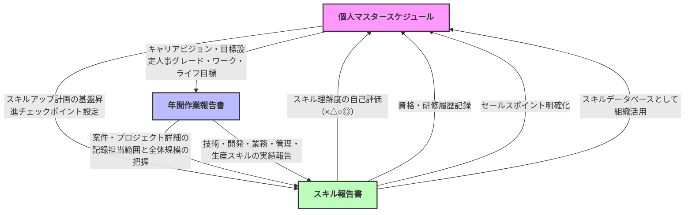
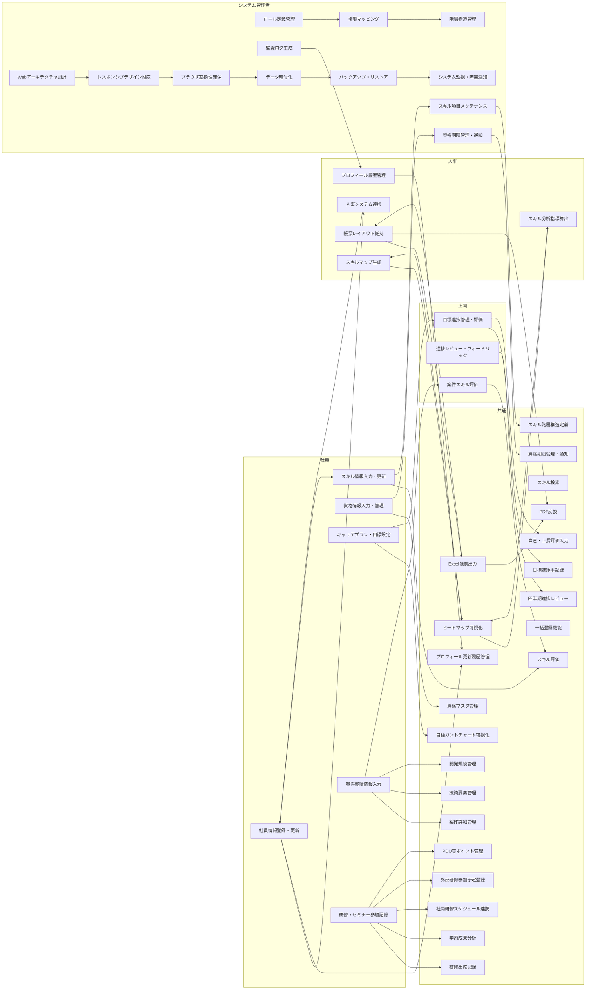

# 1. プロジェクト概要

プロジェクトの基本情報、目的、スコープについては README.md に詳細に記載されているため、本ドキュメントでは省略します。詳細は README.md を参照してください。

なお、本ドキュメントでは、README.md に記載されていない詳細な機能要件、データモデル、開発・運用方針について記載します。


---
# 2. 現状分析

## 2.1. 個人マスタースケジュール

---

### 2.1.1. 個人マスタースケジュールを作成する本来の目的

1. **社員一人ひとりのキャリアビジョンと成長目標の明確化**
   - 自分が将来どうなりたいか、どんなスキルを身につけたいかを具体的に言語化し、行動計画として落とし込む。
2. **会社の経営方針・中期経営計画との整合性の可視化**
   - 個人の目標と会社の方向性を連動させ、組織と個人の成長が同じベクトルになるようにする。
3. **スキルアップのための具体的なロードマップ策定**
   - 技術、開発、業務、管理、生産など複数のスキル領域で、現状と目標、必要なアクションを明確にする。
4. **ワークとライフ両面での目標設定とバランスの最適化**
   - 業務だけでなく、自己実現やプライベートの充実も含めた中長期的な人生設計を行う。
5. **昇進・評価の透明化と納得感の向上**
   - 昇進基準や評価ポイントを明確にし、本人と上司の双方が納得できるキャリアパスを設計する。

---

### 2.1.2. 個人マスタースケジュールの現状分析

| 分析項目                  | 現状・課題                                                                                   |
|--------------------------|--------------------------------------------------------------------------------------------|
| 目的・範囲の明確化        | 目的や記載範囲が個人・部署ごとに曖昧で、内容やレベルにバラつきがある。                       |
| フォーマット・記載内容    | Excel等で個別運用されており、フォーマットや記載方法が統一されていない。                       |
| 進捗・更新管理            | 定期的な見直しや進捗更新が徹底されておらず、計画と実態の乖離が発生しやすい。                 |
| スキル・目標設定          | 各スキル領域での目標設定が抽象的・主観的になりやすく、具体的なアクションや評価指標が不足。     |
| 昇進・評価の透明性        | 昇進ポイントや評価基準が明確でなく、納得感やモチベーション向上に十分つながっていない。         |
| 作業負荷                  | Excelでの手作業・個別管理が中心で、本人・上司ともに作業負荷が高い。                         |
| 情報共有・活用            | 上司との個別やりとりが中心で、組織的なナレッジ共有や人材育成への活用が限定的。                 |
| ワークライフバランス      | 業務目標に偏りがちで、ライフ面の目標設定やバランス最適化が十分に意識されていない。             |

---

### 2.1.3. 現状から見える主な課題

- **目的や内容のバラつき・曖昧さ**
- **Excel運用による作業負荷・進捗管理の煩雑さ**
- **目標設定やスキル評価の主観性・抽象性**
- **昇進・評価の透明性不足**
- **組織的な情報共有・ナレッジ活用の不足**
- **ワークライフバランス目標の弱さ**

---

### 2.1.4. 改善の方向性（参考）

- フォーマット・運用ルールの標準化、クラウドツール等での一元管理
- 目標・スキル評価の具体化と定量化、進捗の定期レビュー仕組み化
- 昇進・評価基準の明確化と納得感向上
- ワークとライフ両面の目標設定を推奨し、バランスを重視した運用
- 組織全体でのナレッジ共有・人材育成への活用強化

---

**まとめ：**  
個人マスタースケジュールの本来の目的は、社員のキャリアと組織の成長を両立させるための「中長期的な自己実現計画」として機能させることです。現状はExcel運用による作業負荷や内容のバラつき、評価の不透明さなど多くの課題が見られますが、標準化・システム化・具体化を進めることで、より戦略的かつ実効性の高い運用が可能となります。

---
## 2.2. 年間作業報告書

---

### 2.2.1. 年間作業報告書を作成する本来の目的

1. **自身の担当案件・プロジェクトの全体像と詳細を把握する**
   - 担当範囲だけでなく、プロジェクト全体の規模や構成を理解し、全体最適を意識した業務遂行につなげる。
2. **技術・開発・業務・管理・生産スキルの理解度を明確にする**
   - 年間を通じてどのスキル領域でどのような経験・成長があったかを客観的に振り返り、自己評価や今後の成長戦略に活かす。
3. **プロジェクトのアーキテクチャやシステム構成情報を記録・共有する**
   - システム全体の設計思想や構成を把握し、技術的知見を組織内で共有・蓄積する。
4. **プロジェクト規模（プログラム数、画面数、帳票数、バッチ数等）を定量的に把握する**
   - 定量的なデータをもとに案件規模や工数を分析し、見積もり精度やリソース配分の向上に役立てる。
5. **組織的なナレッジ共有・人材育成・評価の基礎資料とする**
   - 個人の経験や知見を組織全体の資産とし、次世代プロジェクトや人材育成、適正評価に活用する。

---

### 2.2.2. 年間作業報告書の現状分析

| 分析項目                  | 現状・課題                                                                                   |
|--------------------------|--------------------------------------------------------------------------------------------|
| 目的・範囲の明確化        | 作成目的や記載範囲が個人によって曖昧で、全体像や規模感の把握が不十分なケースが多い。         |
| フォーマット・記載内容    | 統一されたフォーマットやガイドラインがなく、記載内容や粒度にバラつきがある。                 |
| 客観性・定量性            | 記載内容が主観的になりやすく、プロジェクト規模やスキル実績の定量的な記録が不足。             |
| システム構成・アーキテクチャ | システム構成やアーキテクチャ情報の記載が曖昧・不足しがち。                                 |
| 作業負荷                  | 手作業・個別ファイル（Excel等）による運用が多く、本人・上司ともに作業負荷が高い。            |
| ナレッジ共有・活用        | 報告内容が個人と上司間にとどまり、組織的なナレッジ共有やデータベース化が進んでいない。       |
| 評価・フィードバック      | 年間成果やスキル成長の客観的評価が難しく、適切なフィードバックや人材育成に十分活用できていない。|

---

### 2.2.3. 現状から見える主な課題

- **目的や記載範囲の曖昧さによる情報のバラつき**
- **主観的・定性的な記載が多く、客観的・定量的評価が難しい**
- **システム構成やプロジェクト規模の情報が不足しがち**
- **手作業中心で本人・上司の負荷が高い**
- **組織的なナレッジ共有や人材育成への活用が限定的**

---

### 2.2.4. 改善の方向性（参考）

- 報告書フォーマットの標準化と記載ガイドラインの整備
- システム構成・規模・スキル領域ごとの記載項目の明確化
- クラウドや専用ツールによる一元管理・進捗可視化
- 定量的な評価指標やスキルマップとの連携
- 組織的なナレッジベース構築と活用推進

---

**まとめ：**  
年間作業報告書は、個人の経験やスキルを可視化し、組織全体の成長やプロジェクト品質向上に貢献するための重要な資料です。現状は主観的・手作業中心で運用負荷が高く、組織的な活用も限定的ですが、標準化・定量化・システム化を進めることで本来の目的をより効果的に達成できるようになります。


---
## 2.3. スキル報告書

---

### 2.3.1. スキル報告書を作成する本来の目的

1. **自身のスキルの現状把握と可視化**
   - 技術スキル・開発スキル・業務スキル・管理スキル・生産スキルなど、業務に必要なスキルを体系的に棚卸しし、理解度を「×/△/○/◎」の4段階で自己評価することで、現時点での強み・弱みや成長余地を明確にする。
2. **キャリアパス・目標管理との連動**
   - 個人マスタースケジュールで設定したキャリアビジョンや中長期目標（例：昇進・資格取得・担当領域拡大など）とスキル実態を紐づけ、目標達成に必要なスキルギャップを把握し、具体的な成長計画に落とし込む。
3. **資格・研修履歴の記録による客観性の付与**
   - 取得資格・予定資格、研修・セミナー受講履歴を記載することで、スキルの客観的証明と自己研鑽の姿勢を示し、評価・配置やキャリア形成の根拠とする。
4. **セールスポイントの明確化**
   - 自身の強みや他者との差別化ポイントを明文化し、現場配属や面談、社内外へのアピール材料とする。
5. **組織的な人材活用・育成戦略への活用**
   - 全社員のスキルデータベースとして活用し、適材適所の配置や教育計画、プロジェクトアサイン、組織のスキルギャップ分析・戦略立案に役立てる。

---

### 2.3.2. 現状分析（スキル報告書の実態と課題）

| 分析項目              | 現状・課題                                                                                      |
|----------------------|-----------------------------------------------------------------------------------------------|
| 目的・範囲の明確化    | スキル報告書の目的や記載範囲が個人によって曖昧になりやすく、自己評価の基準や粒度にバラつきがある。      |
| フォーマット・記載内容| Excelでの個別運用が主流で、記載内容や評価方法の統一性が不足。スキル分類や評価基準が曖昧な場合もある。|
| 自己評価の客観性      | 「×/△/○/◎」評価は主観的になりやすく、実際の業務成果やキャリア目標との整合性が弱いケースがある。   |
| 資格・研修履歴        | 資格や研修履歴の記載が漏れがちで、最新情報の反映や一元管理が十分でない。                         |
| セールスポイント      | セールスポイントの記載が抽象的・簡素で、具体的な強みや実績に基づくアピールが弱い。                |
| 作業負荷              | Excelによる手作業・個別管理で、本人・上司ともに記入・管理の負担が大きい。                        |
| 情報共有・活用        | 上司とのやり取りや個人管理にとどまり、組織的なスキルデータベースや人材戦略への活用が限定的。         |
| キャリアパス連動      | 個人マスタースケジュールとの連動が弱く、目標達成に必要なスキルギャップや成長戦略が見えにくい。       |

---

### 2.3.3. 改善の方向性（参考）

- **記載フォーマット・評価基準の標準化**  
  スキル分類や評価基準（×/△/○/◎）の明確化と統一を図り、全社員で比較可能なデータベースを構築。
- **キャリアパス・目標管理との連動強化**  
  個人マスタースケジュールとスキル報告書を連携させ、目標達成に必要なスキルや資格を明確化。
- **資格・研修履歴の一元管理**  
  資格・研修情報を定期的に更新し、組織全体で検索・活用できる仕組みを導入。
- **セールスポイントの具体化**  
  実績や案件経験に基づいた強みを明文化し、配属や評価に活かす。
- **クラウドツール等による作業負荷軽減・情報共有**  
  デジタル化・システム化により、本人・上司の作業負荷を軽減し、組織的な活用を推進。

---

**まとめ**  
スキル報告書の本来の目的は、個人のスキル現状を可視化し、キャリア目標や成長戦略と連動させて、組織的な人材活用・育成に活かすことにあります。現状は主観的・手作業中心で運用負荷や活用度に課題があり、標準化・システム化・キャリアパス連動の強化が今後の重要な改善ポイントです。


---

## 2.4. ドキュメントの関連性

---

### 2.4.1. 関連図



### 2.4.2. 解説

- **個人マスタースケジュール**は、社員のキャリアビジョンや中長期目標を設定し、ワーク・ライフバランスや昇進計画を含む自己成長の全体計画を示します。
- **年間作業報告書**は、個人マスタースケジュールで設定した目標に基づき、実際の案件・プロジェクトの詳細やスキル実績を記録し、担当範囲だけでなくプロジェクト全体の規模も把握します。
- **スキル報告書**は、技術・開発・業務・管理・生産スキルの理解度を自己評価し、資格・研修履歴やセールスポイントを明確化することで、個人のスキル状況をデータベース化し組織的に活用します。
- スキル報告書の評価結果や資格情報は個人マスタースケジュールの目標見直しに反映され、年間作業報告書の実績記録もスキル報告書の更新材料となるなど、三者は相互に連携しながら個人の成長と組織の人材戦略を支えています。


---
## 2.5. 現状分析の総括

### 2.5.1. 個人マスタースケジュール

**本来の目的**は、社員一人ひとりのキャリアビジョンや成長目標を明確化し、会社の経営方針や中期経営計画と整合させながら、スキルアップのための具体的なロードマップを策定することにあります。また、ワークとライフ両面の目標設定とバランスの最適化、昇進・評価の透明化と納得感の向上も重要な役割です。

**現状の主な課題**は、目的や記載範囲の曖昧さ、Excelによる個別運用による作業負荷の高さと進捗管理の煩雑さ、目標設定やスキル評価の主観性・抽象性、昇進・評価の透明性不足、組織的な情報共有・ナレッジ活用の不足、ワークライフバランス目標の弱さなどが挙げられます。標準化やシステム化、具体化を進める必要性が高い状態です。

---

### 2.5.2. 年間作業報告書

**本来の目的**は、自身の担当案件やプロジェクトの全体像と詳細を把握し、スキル領域ごとの経験や成長を客観的に振り返ること、プロジェクトのアーキテクチャやシステム構成情報を記録・共有すること、そしてプロジェクト規模を定量的に把握し、組織的なナレッジ共有・人材育成・評価の基礎資料とすることです。

**現状の主な課題**は、作成目的や記載範囲の曖昧さによる情報のバラつき、フォーマットや記載内容の統一性の欠如、主観的・定性的な記載が多く客観的・定量的評価が難しい点、システム構成やプロジェクト規模の情報が不足しがちな点、手作業中心で本人・上司の負荷が高い点、組織的なナレッジ共有や人材育成への活用が限定的な点です。標準化・定量化・システム化が求められます。

---

### 2.5.3. スキル報告書

**本来の目的**は、技術・開発・業務・管理・生産スキルなどの現状把握と可視化、キャリアパスや目標管理との連動、資格・研修履歴の記録による客観性の付与、セールスポイントの明確化、そして組織的な人材活用・育成戦略への活用です。

**現状の主な課題**は、目的や記載範囲の曖昧さ、Excelによる個別運用・評価基準の不統一、自己評価の主観性、資格・研修履歴の反映や一元管理の不足、セールスポイントの抽象性、作業負荷の高さ、情報共有・活用の限定、キャリアパス連動の弱さです。記載フォーマットや評価基準の標準化、キャリアパス連動強化、デジタル化・システム化が必要です。

---

### 2.5.4. 現状の主な課題

- **記載内容や評価基準のバラつき・主観性**
  - 各帳票（個人マスタースケジュール、年間作業報告書、スキル報告書）の目的や記載項目が個人・部署ごとに曖昧で、内容や評価の基準が統一されていない。
- **Excel中心の手作業による高い作業負荷と非効率**
  - 帳票作成・進捗管理・レビューがExcel等で個別に行われており、本人・上司ともに作業負担が大きく、データの一元管理や集計も煩雑。
- **定量的・客観的評価の不足**
  - 目標進捗やスキル評価、プロジェクト実績などの定量的な記録・分析が不十分で、組織的な人材育成や最適配置に十分活用できていない。
- **情報共有・ナレッジ活用の限定**
  - 帳票情報が個人や直属上司間にとどまり、組織全体でのナレッジ共有や人材戦略への活用が進んでいない。

---

### 2.5.5. 解決案

#### A. 帳票類の標準化・ガイドライン整備

- 各帳票の目的・記載項目・評価基準を明確化し、全社共通のフォーマットと運用ルールを策定。
- 目標やスキル評価は定量的指標（達成率、スキルレベル、KPI等）を必須項目とし、主観的記述は補足情報とする。

#### B. Webアプリケーションによる一元管理・業務自動化

- **Webアプリケーションを導入し、帳票の作成・更新・レビュー・集計・検索をクラウド上で一元管理。**
  - 帳票入力フォーム、進捗管理、レビュー・承認ワークフローをオンライン化し、データの一元管理とリアルタイム可視化を実現。
  - 過去データや他者の事例も検索・参照しやすくし、ナレッジ共有・活用を促進。
- **AI機能の活用**
  - 入力補助・自動チェック（記載漏れや不整合のアラート、推奨入力例の提示）。
  - スキルデータベースと連携し、AIがスキルギャップやキャリアパス、最適な研修・資格取得をレコメンド。
  - 帳票内容からAIが自己評価やフィードバック案を自動生成し、上司のレビュー負担を軽減。
  - ダッシュボードで進捗・スキル状況・組織全体の傾向をリアルタイムで可視化し、経営層や人事が戦略的意思決定に活用。

#### C. 定量的・客観的評価指標の導入

- 目標やスキルについて「達成率」「習熟度（×/△/○/◎）」などの定量評価を必須化し、AIによる自動集計・分析を実現。
- プロジェクト規模や成果もプログラム数・画面数・工数など客観的データで記録し、組織横断で比較・分析可能にする。

#### D. 組織的なナレッジ基盤・人材育成戦略への活用

- 帳票データをスキルデータベースや人材管理システムと連携し、AIが人材配置・教育計画・プロジェクトアサインを最適化。
- 過去の実績・スキル・研修履歴をもとに、AIが将来のスキル需要や人材リスクを予測し、持続的な組織成長を支援。

---

### 2.5.6. Webアプリケーション導入による業務改善効果

- **作業効率・生産性の大幅向上**
  - 帳票作成・レビュー・集計の手間を大幅に削減し、社員は本来業務や高付加価値活動に集中できる。
- **データドリブンな人材戦略と意思決定**
  - 全社のスキル・目標進捗・人材配置状況をリアルタイムで把握し、AIが最適な人材育成や配置を提案。
- **ナレッジ共有と組織力強化**
  - 全社員の実績・スキル・知見がデータベース化され、組織全体でのナレッジ活用とイノベーション創出が促進される。
- **AI駆動による持続的改善サイクル**
  - AIがデータを学習し続け、業務プロセスや人材育成の最適化を自律的に高度化。DX推進の基盤となる。

---

### 2.5.7. 結論

AI駆動開発を推進する社内方針に合わせ、WebアプリケーションとAIプロセスオートメーションを活用した帳票・人材管理のデジタル化が、現状課題の抜本的解決策となります。  
標準化・定量化・システム化・AI活用による業務改革を進めることで、個人と組織の成長を両立し、競争力のある人材戦略・働き方改革を実現できます。


---
# 2. 要求仕様

---
## 2.1 要件カテゴリ一覧

| カテゴリID | 名称 | 説明 |
| :--: | :-- | :-- |
| PLT | Platform | システム基盤要件 |
| ACC | Access Control | ユーザー権限管理 |
| PRO | Profile | 個人プロフィール管理 |
| SKL | Skill | スキル情報管理 |
| CAR | Career | 目標・キャリア管理 |
| WPM | Work Performance Mgmt | 作業実績管理 |
| TRN | Training | 研修・セミナー管理 |
| RPT | Report | レポート出力 |

---
## 2.2 要求仕様一覧

**優先度基準**
- 最高：業務フロー起点（社員基本情報登録・更新、スキル階層構造定義）
- 高：最低限の非機能（セキュリティ、認証）、スキル管理・検索、社員の業務起点に近いもの
- 中：進捗管理や目標管理、作業実績、資格管理、研修管理など日常の業務運用に必要なもの
- 低：一括登録、PDF変換、レイアウト維持、分析・可視化など補助的・運用効率向上機能

| カテゴリID | 要求ID | 要求内容 | 優先度 | 仕様グループID | 仕様グループ内容 | 仕様ID | 仕様内容 |
| :--: | :-- | :-- | :-- | :-- | :-- | :-- | :-- |
| **PLT** | PLT.1 | Webベースシステムの構築 | 高 | PLT.1-BRS | ブラウザ互換性確保 | PLT.1-BRS.1 | Chrome, Edge, Safari最新版対応 |
| PLT | PLT.1 | Webベースシステムの構築 | 高 | PLT.1-RESP | レスポンシブデザイン対応 | PLT.1-RESP.1 | マルチデバイス対応 |
| PLT | PLT.1 | Webベースシステムの構築 | 高 | PLT.1-WEB | Webアーキテクチャ設計 | PLT.1-WEB.1 | SPA構成、RESTful API設計 |
| PLT | PLT.2 | データセキュリティ | 高 | PLT.2-BKP | バックアップ・リストア | PLT.2-BKP.1 | 日次バックアップ、30日保持 |
| PLT | PLT.2 | データセキュリティ | 高 | PLT.2-ENC | データ暗号化 | PLT.2-ENC.1 | AES-256暗号化 |
| PLT | PLT.2 | データセキュリティ | 高 | PLT.2-MON | システム監視・障害通知 | PLT.2-MON.1 | 死活監視と障害時の管理者通知 |
| **ACC** | ACC.1 | ロールベースアクセス制御 | 高 | ACC.1-PERM | 権限マッピング | ACC.1-PERM.1 | リソースと権限の紐付け |
| ACC | ACC.1 | ロールベースアクセス制御 | 高 | ACC.1-ROLE | ロール定義管理 | ACC.1-ROLE.1 | 4段階権限評価体系の実装 |
| ACC | ACC.1 | ロールベースアクセス制御 | 中 | ACC.1-HIER | 階層構造管理 | ACC.1-HIER.1 | 権限継承ルール |
| ACC | ACC.3 | 監査証跡管理 | 中 | ACC.3-AUDT | 監査ログ生成 | ACC.3-AUDT.1 | 90日間ログ保持の実装 |
| **PRO** | PRO.1 | 基本情報管理機能 | 最高 | PRO.1-BASE | 基本属性管理 | PRO.1-BASE.1 | 7項目の個人情報を主キー管理 |
| PRO | PRO.1 | 基本情報管理機能 | 高 | PRO.1-DEPT | 部署情報管理 | PRO.1-DEPT.1 | 組織変更時の自動反映機能 |
| PRO | PRO.1 | 基本情報管理機能 | 高 | PRO.1-HIST | 更新履歴管理 | PRO.1-HIST.1 | 変更前/変更後の値保持、変更者記録 |
| PRO | PRO.2 | データ連携 | 高 | PRO.2-SYNC | 人事システム連携 | PRO.2-SYNC.1 | マスタデータ同期 |
| **SKL** | SKL.1 | 技術スキルを階層的に管理する | 最高 | SKL.1-HIER | 階層構造定義 | SKL.1-HIER.1 | 3階層（カテゴリ/サブカテゴリ/項目）構成 |
| SKL | SKL.1 | 技術スキルを階層的に管理する | 高 | SKL.1-EVAL | 評価基準設定 | SKL.1-EVAL.1 | 4段階評価（×/△/○/◎） |
| SKL | SKL.1 | 技術スキルを階層的に管理する | 高 | SKL.1-MAINT | メンテナンス機能 | SKL.1-MAINT.1 | 管理者によるスキル項目管理（追加・編集・削除） |
| SKL | SKL.1 | 技術スキルを階層的に管理する | 高 | SKL.1-SRCH | 検索機能 | SKL.1-SRCH.1 | 特定スキルを持つ社員抽出 |
| SKL | SKL.2 | 取得資格情報を管理する | 中 | SKL.2-EXP | 期限管理・通知 | SKL.2-EXP.1 | 有効期限のある資格は期限管理・通知 |
| SKL | SKL.2 | 取得資格情報を管理する | 中 | SKL.2-INP | 資格情報入力 | SKL.2-INP.1 | 資格マスタにない資格は自由入力も可能 |
| SKL | SKL.2 | 取得資格情報を管理する | 中 | SKL.2-MST | 資格マスタ管理 | SKL.2-MST.1 | 資格マスタを用意し選択式で入力 |
| **CAR** | CAR.1 | 個人のキャリアプランと目標を管理する | 中 | CAR.1-PLAN | 長期計画定義 | CAR.1-PLAN.1 | 3年・5年・10年の目標設定 |
| CAR | CAR.1 | 個人のキャリアプランと目標を管理する | 中 | CAR.1-VIS | 可視化機能 | CAR.1-VIS.1 | ガントチャート形式で目標期間を表示 |
| CAR | CAR.2 | 目標の進捗状況を管理する | 中 | CAR.2-TRACK | 達成率追跡 | CAR.2-TRACK.1 | 目標ごとに達成率（%）を記録 |
| CAR | CAR.2 | 目標の進捗状況を管理する | 中 | CAR.2-EVAL | 評価機能 | CAR.2-EVAL.1 | 自己評価と上長評価を分離入力 |
| CAR | CAR.2 | 目標の進捗状況を管理する | 中 | CAR.2-REV | 進捗確認 | CAR.2-REV.1 | 四半期ごとに進捗確認リマインダー |
| **WPM** | WPM.1 | 担当案件の実績情報を記録する | 中 | WPM.1-DET | 案件詳細管理 | WPM.1-DET.1 | 案件ごとに期間・案件名・業務内容を記録 |
| WPM | WPM.1 | 担当案件の実績情報を記録する | 中 | WPM.1-SKILL | スキル評価連携 | WPM.1-SKILL.1 | 担当スキル領域の自己評価をスキルマップと連動 |
| WPM | WPM.1 | 担当案件の実績情報を記録する | 中 | WPM.1-TECH | 技術要素管理 | WPM.1-TECH.1 | 使用機種・言語/ツール・ミドルウェア記録 |
| WPM | WPM.1 | 担当案件の実績情報を記録する | 低 | WPM.1-BULK | 一括登録機能 | WPM.1-BULK.1 | CSV/Excel形式による複数案件の一括登録 |
| WPM | WPM.1 | 担当案件の実績情報を記録する | 低 | WPM.1-SCALE | 開発規模管理 | WPM.1-SCALE.1 | プログラム本数・画面数・帳票数・バッチ数記録 |
| **TRN** | TRN.1 | 参加した研修・セミナー情報を管理する | 中 | TRN.1-ANAL | 学習成果分析 | TRN.1-ANAL.1 | 講習内容と学びのポイントを自由記述 |
| TRN | TRN.1 | 参加した研修・セミナー情報を管理する | 中 | TRN.1-ATT | 出席記録管理 | TRN.1-ATT.1 | 開催日・主催・講師・テーマ・理解度を記録 |
| TRN | TRN.2 | 社内研修情報と連携する | 低 | TRN.2-REG | 参加予定登録 | TRN.2-REG.1 | 外部研修の手動登録機能 |
| TRN | TRN.2 | 社内研修情報と連携する | 低 | TRN.2-SCH | 社内研修スケジュール連携 | TRN.2-SCH.1 | 社内研修カレンダーから参加予定を自動取得 |
| TRN | TRN.3 | 専門資格の継続教育ポイントを管理する | 低 | TRN.3-PDU | ポイント管理 | TRN.3-PDU.1 | PDU等のポイントを自動計算・累積 |
| **RPT** | RPT.1 | 年間スキル報告書をExcel形式で出力する | 低 | RPT.1-EXCEL | Excel形式出力 | RPT.1-EXCEL.1 | 4シート構成（表紙/スケジュール/スキル/作業報告書） |
| RPT | RPT.1 | 年間スキル報告書をExcel形式で出力する | 低 | RPT.1-LAY | レイアウト維持 | RPT.1-LAY.1 | サンプルファイルと同一のセル結合/書式を再現 |
| RPT | RPT.1 | 年間スキル報告書をExcel形式で出力する | 低 | RPT.1-PDF | PDF変換機能 | RPT.1-PDF.1 | Excel→PDF自動変換機能 |
| RPT | RPT.2 | 部門スキルマップを生成する | 低 | RPT.2-ANAL | 分析指標算出 | RPT.2-ANAL.1 | スキル充足率/リスク領域を自動算出 |
| RPT | RPT.2 | 部門スキルマップを生成する | 低 | RPT.2-MAP | マトリクス表示 | RPT.2-MAP.1 | スキルカテゴリ×社員のマトリクス表生成 |
| RPT | RPT.2 | 部門スキルマップを生成する | 低 | RPT.2-VIS | 可視化機能 | RPT.2-VIS.1 | ヒートマップ表示（スキルレベル色分け） |


---
## 2.3 要求仕様書

[RequirementsSpecification.xlsx](https://github.com/user-attachments/files/20297499/RequirementsSpecification.xlsx)


---
# 3. 業務要件

---
## 3.1 業務フロー

```mermaid
flowchart TD
    %% プロフィール管理
    PRO1["社員基本情報登録・更新 (PRO.1-BASE)"]
    PRO2["部署情報管理 (PRO.1-DEPT)"]
    PRO3["プロフィール更新履歴管理 (PRO.1-HIST)"]
    PRO4["人事システム連携 (PRO.2-SYNC)"]

    %% スキル情報管理
    SKL1["スキル階層構造定義 (SKL.1-HIER)"]
    SKL2["スキル評価基準設定 (SKL.1-EVAL)"]
    SKL3["スキル項目メンテナンス (SKL.1-MAINT)"]
    SKL4["スキル検索 (SKL.1-SRCH)"]
    SKL5["資格マスタ管理 (SKL.2-MST)"]
    SKL6["資格情報入力 (SKL.2-INP)"]
    SKL7["資格期限管理・通知 (SKL.2-EXP)"]

    %% 目標・キャリア管理
    CAR1["キャリアプラン目標設定 (CAR.1-PLAN)"]
    CAR2["目標ガントチャート可視化 (CAR.1-VIS)"]
    CAR3["目標進捗率記録 (CAR.2-TRACK)"]
    CAR4["自己・上長評価入力 (CAR.2-EVAL)"]
    CAR5["四半期進捗レビュー (CAR.2-REV)"]

    %% 作業実績管理
    WPM1["案件詳細管理 (WPM.1-DET)"]
    WPM2["技術要素管理 (WPM.1-TECH)"]
    WPM3["開発規模管理 (WPM.1-SCALE)"]
    WPM4["スキル評価連携 (WPM.1-SKILL)"]
    WPM5["一括登録機能 (WPM.1-BULK)"]

    %% 研修・セミナー管理
    TRN1["研修出席記録 (TRN.1-ATT)"]
    TRN2["学習成果分析 (TRN.1-ANAL)"]
    TRN3["社内研修スケジュール連携 (TRN.2-SCH)"]
    TRN4["外部研修参加予定登録 (TRN.2-REG)"]
    TRN5["PDU等ポイント管理 (TRN.3-PDU)"]

    %% レポート出力
    RPT1["Excel帳票出力 (RPT.1-EXCEL)"]
    RPT2["帳票レイアウト維持 (RPT.1-LAY)"]
    RPT3["PDF変換 (RPT.1-PDF)"]
    RPT4["スキルマップ生成 (RPT.2-MAP)"]
    RPT5["ヒートマップ可視化 (RPT.2-VIS)"]
    RPT6["スキル分析指標算出 (RPT.2-ANAL)"]

    %% アクセス制御
    ACC1["ロール定義管理 (ACC.1-ROLE)"]
    ACC2["権限マッピング (ACC.1-PERM)"]
    ACC3["階層構造管理 (ACC.1-HIER)"]
    ACC4["監査ログ生成 (ACC.3-AUDT)"]

    %% システム基盤
    PLT1["Webアーキテクチャ設計 (PLT.1-WEB)"]
    PLT2["レスポンシブデザイン対応 (PLT.1-RESP)"]
    PLT3["ブラウザ互換性確保 (PLT.1-BRS)"]
    PLT4["データ暗号化 (PLT.2-ENC)"]
    PLT5["バックアップ・リストア (PLT.2-BKP)"]
    PLT6["システム監視・障害通知 (PLT.2-MON)"]

    %% 業務フロー
    PRO1 --> PRO2
    PRO1 --> PRO3
    PRO1 --> PRO4
    PRO1 --> SKL1
    PRO1 --> CAR1

    SKL1 --> SKL2
    SKL1 --> SKL3
    SKL1 --> SKL4
    SKL2 --> SKL3
    SKL5 --> SKL6
    SKL6 --> SKL7

    CAR1 --> CAR2
    CAR1 --> CAR3
    CAR3 --> CAR4
    CAR4 --> CAR5

    WPM1 --> WPM2
    WPM2 --> WPM3
    WPM3 --> WPM4
    WPM1 --> WPM5

    TRN1 --> TRN2
    TRN1 --> TRN3
    TRN3 --> TRN4
    TRN2 --> TRN5

    SKL4 --> RPT4
    SKL7 --> RPT4
    CAR5 --> RPT4
    WPM4 --> RPT4
    TRN5 --> RPT4

    RPT4 --> RPT5
    RPT5 --> RPT6
    RPT4 --> RPT1
    RPT1 --> RPT2
    RPT1 --> RPT3

    ACC1 --> ACC2
    ACC2 --> ACC3
    ACC1 --> ACC4

    PLT1 --> PLT2
    PLT1 --> PLT3
    PLT1 --> PLT4
    PLT4 --> PLT5
    PLT5 --> PLT6
```



---
## 3.2 業務スイムレーン




---
# 4. 機能要件

---
## 4.1 機能一覧

| 機能ID | 機能カテゴリ         | 機能名                  | 機能概要                                                                 | 要求仕様ID（全）                                               | 画面ID（全）                                         | API ID（全）                                   | バッチID（全）                      | 優先度 |
|--------|----------------------|-------------------------|--------------------------------------------------------------------------|----------------------------------------------------------------|----------------------------------------------------|----------------------------------------------|-------------------------------------|--------|
| F01    | 認証・認可           | ユーザー認証            | ユーザーID・パスワード/SSOによる認証、トークン発行、アカウントロック管理 | PLT.1-WEB.1, PLT.1-RESP.1, PLT.1-BRS.1, PLT.2-ENC.1, ACC.1-ROLE.1 | SCR-LOGIN                                           | API-001, API-002                            | BATCH-001, BATCH-002, BATCH-017     | 最高   |
| F02    | 認証・認可           | 権限・ロール管理        | ロール・権限の作成・編集・削除、ユーザーへの付与、監査証跡の管理         | ACC.1-ROLE.1, ACC.1-PERM.1, ACC.1-HIER.1, ACC.3-AUDT.1          | SCR-ACCESS                                         | API-003, API-004, API-022                   | BATCH-003                            | 高     |
| F03    | プロフィール管理     | 基本情報管理            | 社員の基本情報（氏名・所属・役職等）の参照・編集                         | PRO.1-BASE.1, PRO.1-DEPT.1, PRO.1-HIST.1, PRO.2-SYNC.1          | SCR-PROFILE                                        | API-005, API-006                            | BATCH-004                             | 最高   |
| F04    | プロフィール管理     | 組織・役職マスタ管理    | 組織・役職マスタの同期・編集、人事システムとの連携                       | PRO.1-DEPT.1, PRO.2-SYNC.1                                      | SCR-ADMIN, SCR-PROFILE                             | API-006                                    | BATCH-004, BATCH-015                  | 最高   |
| F05    | スキル管理           | スキルマスタ管理        | スキル・資格マスタの追加・編集・削除、階層管理                           | SKL.1-HIER.1, SKL.1-MAINT.1, SKL.2-MST.1                        | SCR-SKILL-M                                        | API-007, API-009                           | BATCH-005                              | 高     |
| F06    | スキル管理           | スキル情報入力・編集    | ユーザーのスキル・資格情報の登録・編集・削除                             | SKL.1-HIER.1, SKL.1-EVAL.1, SKL.1-MAINT.1, SKL.1-SRCH.1, SKL.2-MST.1, SKL.2-INP.1, SKL.2-EXP.1 | SCR-SKILL | API-008, API-010 | BATCH-006, BATCH-007 | 最高   |
| F07    | スキル管理           | スキル検索              | スキル情報によるユーザー検索・絞り込み                                   | SKL.1-SRCH.1                                                   | SCR-SKILL-SEARCH                                    | API-011                                   | BATCH-006                              | 高     |
| F08    | スキル管理           | スキル分析・レポート    | スキルマップ・ギャップ分析、スキルデータの集計・可視化                   | RPT.2-MAP.1, RPT.2-VIS.1, RPT.2-ANAL.1                          | SCR-SKILL-MAP                                       | API-019                                   | BATCH-006                              | 低     |
| F09    | 目標・キャリア管理   | 目標・キャリア設定      | 目標・キャリアプランの登録・参照・編集                                   | CAR.1-PLAN.1, CAR.1-VIS.1                                      | SCR-CAR-PLAN                                        | API-012                                   | BATCH-008                              | 中     |
| F10    | 目標・キャリア管理   | 進捗管理・評価          | 目標進捗・評価・フィードバックの登録・参照                               | CAR.2-TRACK.1, CAR.2-EVAL.1, CAR.2-REV.1                        | SCR-CAR-EVAL                                        | API-013                                   | BATCH-008                              | 中     |
| F11    | 作業実績管理         | 案件実績入力・編集      | 案件実績データの登録・編集・集計                                        | WPM.1-DET.1, WPM.1-TECH.1, WPM.1-SKILL.1                        | SCR-WORK                                            | API-014                                   | BATCH-009                              | 中     |
| F12    | 作業実績管理         | 一括実績登録            | CSV/Excelによる案件実績の一括登録                                       | WPM.1-BULK.1, WPM.1-SCALE.1                                    | SCR-WORK-BULK                                       | API-015                                   | BATCH-010                              | 低     |
| F13    | 研修・教育管理       | 研修参加記録管理        | 研修参加履歴の登録・参照・集計                                          | TRN.1-ATT.1, TRN.1-ANAL.1                                      | SCR-TRAIN                                           | API-016                                   | BATCH-011                              | 中     |
| F14    | 研修・教育管理       | 継続教育・PDU管理       | 継続教育ポイント（PDU）の登録・参照・集計                                | TRN.3-PDU.1                                                    | SCR-TRAIN-M                                         | API-017                                   | BATCH-011                              | 中     |
| F15    | レポート・分析       | 帳票出力                | Excel/PDF帳票の出力・ダウンロード                                       | RPT.1-EXCEL.1, RPT.1-LAY.1, RPT.1-PDF.1                        | SCR-REPORT                                          | API-018                                   | BATCH-012                              | 低     |
| F16    | システム管理         | バックアップ・リストア  | データベース・ファイルのバックアップ・リストア                           | PLT.2-BKP.1                                                    | SCR-ADMIN                                           | API-020                                   | BATCH-013                              | 高     |
| F17    | システム管理         | システム監視・障害対応  | 死活監視、障害通知、システムログ管理                                    | PLT.2-MON.1                                                    | SCR-ADMIN, SCR-NOTIFY                               | API-021                                   | BATCH-014                              | 高     |
| F18    | システム管理         | 監査証跡管理            | 操作ログ・監査証跡の記録・検索・CSV出力                                 | ACC.3-AUDT.1                                                   | SCR-ACCESS, SCR-ADMIN                               | API-022                                   | BATCH-003, BATCH-014                   | 高     |
| F19    | システム管理         | マスタデータ管理        | 各種マスタデータ（部署・役職・スキル等）の編集・同期                     | SKL.1-MAINT.1, SKL.2-MST.1, PRO.1-DEPT.1, PRO.2-SYNC.1         | SCR-ADMIN                                           | API-023                                   | BATCH-015                              | 低     |
| F20    | システム管理         | システム設定管理        | システム設定の変更・履歴管理                                            |                                                            | SCR-ADMIN                                           | API-024                                   | BATCH-016                              | 低     |
| F21    | 共通基盤             | トークン管理            | セッション・認証トークンの発行・更新・削除                              | PLT.2-ENC.1                                                    | -                                                  | API-001, API-002                          | BATCH-017                              | 高     |
| F22    | 通知・アラート       | 資格期限アラート        | 資格期限・障害・目標進捗のリマインダー通知                              | SKL.2-EXP.1, PLT.2-MON.1, CAR.2-REV.1                          | SCR-NOTIFY                                         | API-010, API-021, API-013                 | BATCH-007, BATCH-017                   | 高     |
| F23    | ホームダッシュボード | ホーム表示・通知集約    | 各種通知・進捗サマリ・ショートカットの集約表示                           |                                                            | SCR-HOME                                           | 各カテゴリAPI                              | -                                     | 高     |

---

**優先度基準の解説**

- **最高**：業務フローの起点（ログイン、基本情報・スキル入力/管理）
- **高**：最低限の非機能（認証、権限、セキュリティ）、スキル管理・検索、管理者向け主要機能
- **中**：目標管理、作業実績、研修管理、通知など日常業務運用に必要な機能
- **低**：一括登録、マスタ管理、レポート出力など補助的・運用効率向上機能

**備考**
- 「API IDマッピング」には、各画面で直接利用・連携されるAPI ID（API-001～API-024）を記載しています。
- SCR-HOMEはダッシュボードのため、複数カテゴリのAPIを参照（主要APIは各カテゴリの画面に従う）。
- 複数APIを利用する画面（例：SCR-SKILL, SCR-ADMIN, SCR-NOTIFY）はカンマ区切りで記載しています。
- ご要望に応じて、画面-機能-API-仕様IDの四層マッピングやAPI詳細仕様も作成可能です。


---
## 4.2 機能関連図

```mermaid
flowchart TD
    %% 優先度: 最高=red, 高=orange, 中=yellow, 低=gray

    %% 認証・認可
    A1["ユーザー認証 (SCR-LOGIN/AuthAPI)"]:::prio_max
    A2["権限・ロール管理 (SCR-ACCESS/RBACAPI)"]:::prio_high

    %% プロフィール管理
    B1["基本情報管理 (SCR-PROFILE/ProfileAPI)"]:::prio_max
    B2["組織・役職管理 (SCR-ADMIN/OrgAPI)"]:::prio_low

    %% スキル管理
    C1["スキルマスタ管理 (SCR-SKILL-M/SkillAPI)"]:::prio_high
    C2["スキル情報入力・編集 (SCR-SKILL/SkillAPI)"]:::prio_max
    C3["資格マスタ・資格管理 (SCR-SKILL-M, SCR-SKILL/CertAPI)"]:::prio_high
    C4["スキル検索 (SCR-SKILL-SEARCH/SearchAPI)"]:::prio_high

    %% 目標・キャリア管理
    D1["目標・キャリア設定 (SCR-CAR-PLAN/GoalAPI)"]:::prio_mid
    D2["進捗管理・評価 (SCR-CAR-EVAL/ProgressAPI)"]:::prio_mid

    %% 作業実績管理
    E1["案件実績入力・編集 (SCR-WORK/WorkAPI)"]:::prio_mid
    E2["一括実績登録 (SCR-WORK-BULK/BulkAPI)"]:::prio_low

    %% 研修・教育管理
    F1["研修参加記録管理 (SCR-TRAIN/TrainingAPI)"]:::prio_mid
    F2["継続教育・PDU管理 (SCR-TRAIN-M/EduAPI)"]:::prio_mid

    %% レポート・分析
    G1["帳票出力（Excel/PDF） (SCR-REPORT/ReportAPI)"]:::prio_low
    G2["スキルマップ・分析 (SCR-SKILL-MAP/AnalyticsAPI)"]:::prio_low

    %% システム管理
    H1["バックアップ・リストア (SCR-ADMIN/BackupAPI)"]:::prio_high
    H2["システム監視・障害対応 (SCR-ADMIN/MonitorAPI)"]:::prio_high
    H3["ログ・監査証跡管理 (SCR-ADMIN/LogAPI)"]:::prio_high
    H4["マスタデータ管理 (SCR-ADMIN/MasterAPI)"]:::prio_low
    H5["システム基本設定 (SCR-ADMIN/ConfigAPI)"]:::prio_low

    %% 共通基盤
    I1["UIフレームワーク (React/Vue.js)"]:::prio_high
    I2["APIゲートウェイ (Kong/AWS API Gateway)"]:::prio_high
    I3["データ暗号化 (AES-256/TLS 1.3)"]:::prio_high
    I4["監査証跡 (ELK Stack)"]:::prio_high
    I5["非同期処理 (Apache Kafka)"]:::prio_high

    %% 関連線
    A1 --> A2
    A1 --> B1
    A2 --> B1
    B1 --> C2
    B2 --> B1
    C1 --> C2
    C1 --> C3
    C2 --> C4
    C3 --> C2
    C4 --> C2
    B1 --> D1
    D1 --> D2
    B1 --> E1
    E1 --> E2
    E1 --> C2
    B1 --> F1
    F1 --> F2
    C2 --> G2
    D2 --> G2
    E1 --> G2
    F2 --> G2
    G2 --> G1
    H1 --> H2
    H1 --> H3
    H4 --> C1
    H4 --> C3
    H4 --> B2
    H4 --> F1
    H4 --> F2
    H2 --> H3
    H5 --> H1
    H5 --> H2
    H5 --> H3
    H5 --> H4
    %% 共通基盤の連携
    I1 --> A1
    I1 --> B1
    I1 --> C2
    I1 --> D1
    I1 --> E1
    I1 --> F1
    I1 --> G1
    I1 --> H1
    I2 --> A1
    I2 --> C2
    I2 --> D1
    I2 --> E1
    I2 --> F1
    I2 --> G1
    I2 --> H1
    I3 --> A1
    I3 --> B1
    I3 --> C2
    I3 --> D1
    I3 --> E1
    I3 --> F1
    I3 --> G1
    I3 --> H1
    I4 --> H3
    I4 --> A2
    I5 --> G2
    I5 --> H1

    %% スタイル定義
    classDef prio_max fill:#ffcccc,stroke:#b22222,stroke-width:2px,color:#111;
    classDef prio_high fill:#ffe4b5,stroke:#ff8c00,stroke-width:2px,color:#111;
    classDef prio_mid fill:#ffffcc,stroke:#bdb76b,stroke-width:2px,color:#111;
    classDef prio_low fill:#eeeeee,stroke:#888888,stroke-width:1px,color:#111;

```



---
# 5. 画面設計

画面設計に関する情報は以下の別ファイルで管理しています。

---
## 5.1 画面一覧

画面一覧は別ファイルで管理しています。詳細は以下のリンクを参照してください。

[画面一覧](./画面一覧.md)

各画面の詳細仕様書へのリンクも上記ファイルに含まれています。

---
## 5.2 画面遷移図
画面遷移図は別ファイルで管理しています。詳細は以下のリンクを参照してください。

[画面遷移図](./画面遷移図.md)


---
# 6. API設計

API設計に関する情報は以下の別ファイルで管理しています。


---
## 6.1 API一覧

API一覧は別ファイルで管理しています。詳細は以下のリンクを参照してください。

[API一覧](./API一覧.md)

各APIの詳細仕様書へのリンクも上記ファイルに含まれています。


---
# 7. バッチ設計

バッチ設計に関する情報は以下の別ファイルで管理しています。

---
## 7.1 バッチ一覧

バッチ一覧は別ファイルで管理しています。詳細は以下のリンクを参照してください。

[バッチ一覧](./バッチ一覧.md)

各バッチの詳細仕様書へのリンクも上記ファイルに含まれています。


---
# 8. インターフェース設計

インターフェース設計に関する情報は以下の別ファイルで管理しています。

---
## 8.1 インターフェース一覧

インターフェース一覧は別ファイルで管理しています。詳細は以下のリンクを参照してください。

[インターフェース一覧](./インターフェース一覧.md)

各インターフェースの詳細仕様書へのリンクも上記ファイルに含まれています。


---
# 9. データベース設計

データベース設計に関する情報は以下の別ファイルで管理しています。

---
## 9.1 テーブル一覧

テーブル一覧は別ファイルで管理しています。詳細は以下のリンクを参照してください。

[テーブル一覧](./テーブル一覧.md)

各テーブルの詳細定義書へのリンクも上記ファイルに含まれています。

---
## 9.2 エンティティ関連図

エンティティ関連図は別ファイルで管理しています。詳細は以下のリンクを参照してください。

[エンティティ関連図](./エンティティ関連図.md)

---

# 10. テスト設計

## 10.1 ユーザーテストシナリオ一覧

| シナリオID | シナリオ名                       | 登場アクター         | 主な画面ID           | 主な機能ID         | 要求仕様ID（抜粋）               | テスト内容・期待結果                                           |
|------------|----------------------------------|----------------------|----------------------|--------------------|-------------------------------|-------------------------------------------------------------|
| TS-001     | ログイン認証正常                 | 一般ユーザー         | SCR-LOGIN            | F01                | PLT.1-WEB.1, ACC.1-ROLE.1     | 正しいID/パスワードでログインし、ホームへ遷移できる           |
| TS-002     | ログイン認証エラー               | 一般ユーザー         | SCR-LOGIN            | F01                | PLT.1-WEB.1                   | 誤ったパスワードでエラーメッセージが表示される                |
| TS-003     | アカウントロック                 | 一般ユーザー         | SCR-LOGIN            | F01                | PLT.1-WEB.1                   | ログイン失敗上限でロックされ、以降ログイン不可                |
| TS-004     | SSOログイン                      | 一般ユーザー         | SCR-LOGIN            | F01                | PLT.1-WEB.1                   | SSOボタンからIdP認証し、正常にホームへ遷移できる              |
| TS-005     | プロフィール参照・編集           | 一般ユーザー         | SCR-PROFILE          | F03                | PRO.1-BASE.1, PRO.1-DEPT.1    | プロフィール情報を参照・編集し、保存後に変更が反映される      |
| TS-006     | 部署・役職マスタ同期             | 人事担当者           | SCR-PROFILE, SCR-ADMIN| F04                | PRO.2-SYNC.1                  | 外部人事システム連携で部署・役職マスタが最新化される           |
| TS-007     | 権限管理（ロール追加・編集）     | システム管理者       | SCR-ACCESS           | F02                | ACC.1-ROLE.1                  | 新規ロール追加・編集・削除が正しく反映される                  |
| TS-008     | 権限付与・変更                   | システム管理者       | SCR-ACCESS           | F02                | ACC.1-PERM.1                  | ユーザーへロール付与・変更が正しく反映される                  |
| TS-009     | 監査証跡検索・CSV出力            | システム管理者       | SCR-ACCESS, SCR-ADMIN| F02, F19           | ACC.3-AUDT.1                  | 監査ログの検索・CSV出力ができ、操作履歴が正しく記録される      |
| TS-010     | スキル情報登録・編集             | 一般ユーザー         | SCR-SKILL            | F06                | SKL.1-HIER.1, SKL.2-INP.1     | スキル情報を登録・編集し、保存後に正しく反映される            |
| TS-011     | スキルマスタ管理                 | システム管理者       | SCR-SKILL-M          | F05, F07           | SKL.1-MAINT.1                 | スキル・資格マスタの追加・編集・削除ができる                   |
| TS-012     | スキル検索                       | 上司・管理者         | SCR-SKILL-SEARCH     | F08                | SKL.1-SRCH.1                  | 検索条件でユーザー抽出・スキル一覧が正しく表示される           |
| TS-013     | 目標設定・進捗管理               | 一般ユーザー, 上司   | SCR-CAR-PLAN, SCR-CAR-EVAL | F09, F10      | CAR.1-PLAN.1, CAR.2-TRACK.1   | 目標設定・進捗入力・評価ができ、履歴が残る                     |
| TS-014     | 案件実績入力・一括登録           | 一般ユーザー, 管理者 | SCR-WORK, SCR-WORK-BULK | F11, F12         | WPM.1-DET.1, WPM.1-BULK.1     | 案件実績の個別・一括登録が正しく反映される                     |
| TS-015     | 研修参加記録・PDU管理            | 一般ユーザー, 人事   | SCR-TRAIN, SCR-TRAIN-M | F13, F14         | TRN.1-ATT.1, TRN.3-PDU.1      | 研修参加・PDUポイントの登録・参照ができる                      |
| TS-016     | 帳票出力・ダウンロード           | 管理者, 人事         | SCR-REPORT           | F15                | RPT.1-EXCEL.1, RPT.1-PDF.1    | 帳票（Excel/PDF）出力・ダウンロードが正常にできる              |
| TS-017     | システムバックアップ・リストア    | システム管理者       | SCR-ADMIN            | F17                | PLT.2-BKP.1                   | バックアップ・リストアが正常に実行でき、履歴が残る             |
| TS-018     | システム監視・障害通知           | システム管理者       | SCR-ADMIN, SCR-NOTIFY| F18                | PLT.2-MON.1                   | 死活監視・障害通知・アラートが正しく発報される                 |
| TS-019     | システム設定変更・履歴記録       | システム管理者       | SCR-ADMIN            | F21                |                                | システム設定変更ができ、履歴が記録される                       |
| TS-020     | マスタデータ管理                 | システム管理者       | SCR-ADMIN            | F20                | SKL.1-MAINT.1, PRO.2-SYNC.1    | マスタデータの追加・編集・削除・同期ができる                    |
| TS-021     | 通知・アラート受信               | 全ユーザー           | SCR-NOTIFY           | F07, F18, F10      | SKL.2-EXP.1, PLT.2-MON.1       | 資格期限アラート、障害通知、進捗リマインダーが正しく受信できる  |
| TS-022     | ホームダッシュボード表示         | 全ユーザー           | SCR-HOME             | F22, F23, F24, F25, F26 |                              | 各種通知・進捗サマリ・ショートカットが正しく表示される           |

---

### 登場アクター定義

- **一般ユーザー**：システム利用社員
- **上司**：部下を持つ管理職
- **人事担当者**：人事部門ユーザー
- **システム管理者**：システム運用・管理専任者
- **管理者**：部門管理や帳票出力等を担うユーザー

---


---
# 11. 技術スタック

## 11.1 採用技術一覧

| カテゴリ | 技術 | バージョン | 選定理由 |
|---------|------|-----------|----------|
| フレームワーク | Next.js | 14 | TypeScript + React 18対応、SSR/SSG、API Routes |
| 言語 | TypeScript | 最新 | 型安全性、開発効率向上 |
| UIライブラリ | React | 18 | コンポーネントベース開発 |
| CSSフレームワーク | Tailwind CSS | 最新 | ユーティリティファースト、レスポンシブ対応 |
| データベース | PostgreSQL | 最新 | ACID特性、JSON対応、スケーラビリティ |
| デプロイ先 | Vercel | - | Next.js最適化、CI/CD統合、スケーラビリティ |
| コンテナ | Docker + Docker Compose | 最新 | 開発環境統一、ポータビリティ |

## 11.2 アーキテクチャ構成

```
┌─────────────────┐    ┌─────────────────┐    ┌─────────────────┐
│   Frontend      │    │   Backend       │    │   Database      │
│   (Next.js 14)  │◄──►│   (API Routes)  │◄──►│  (PostgreSQL)   │
│   + React 18    │    │   + TypeScript  │    │                 │
│   + Tailwind    │    │                 │    │                 │
└─────────────────┘    └─────────────────┘    └─────────────────┘
         │                       │                       │
         └───────────────────────┼───────────────────────┘
                                 │
                    ┌─────────────────┐
                    │     Vercel      │
                    │   (Deployment)  │
                    └─────────────────┘
```

## 11.3 開発環境

- **ローカル開発**: Docker + Docker Compose
- **パッケージ管理**: npm/yarn
- **バージョン管理**: Git + GitHub
- **CI/CD**: Vercel自動デプロイ
- **コード品質**: ESLint + Prettier + TypeScript

---
